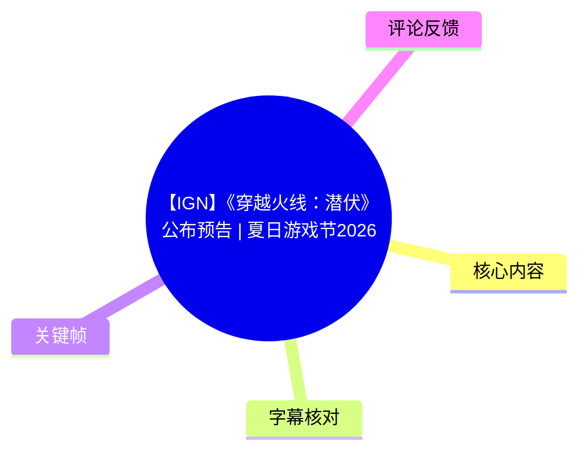
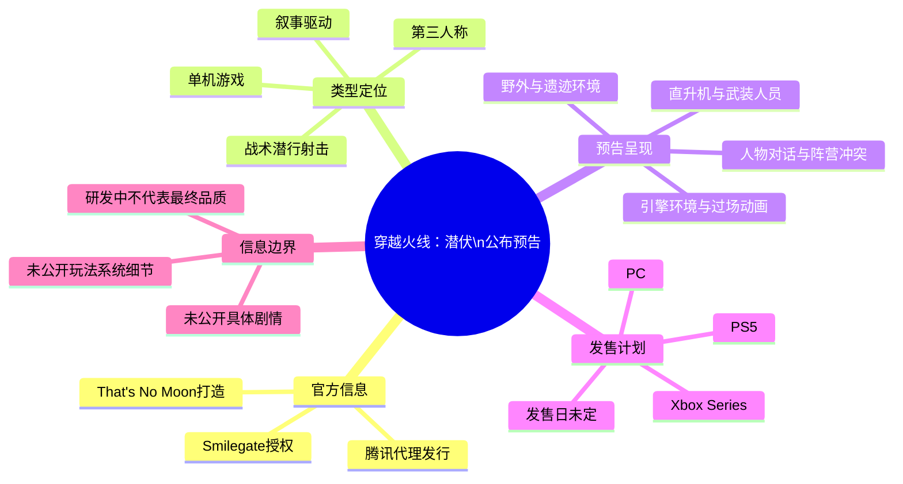
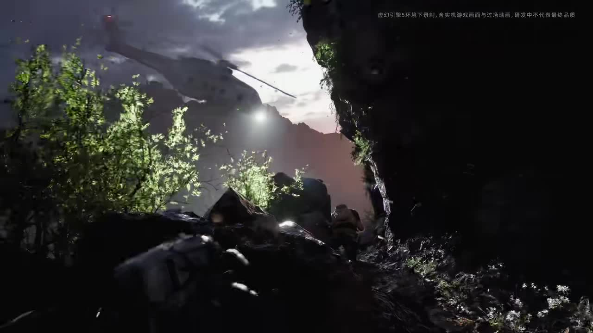
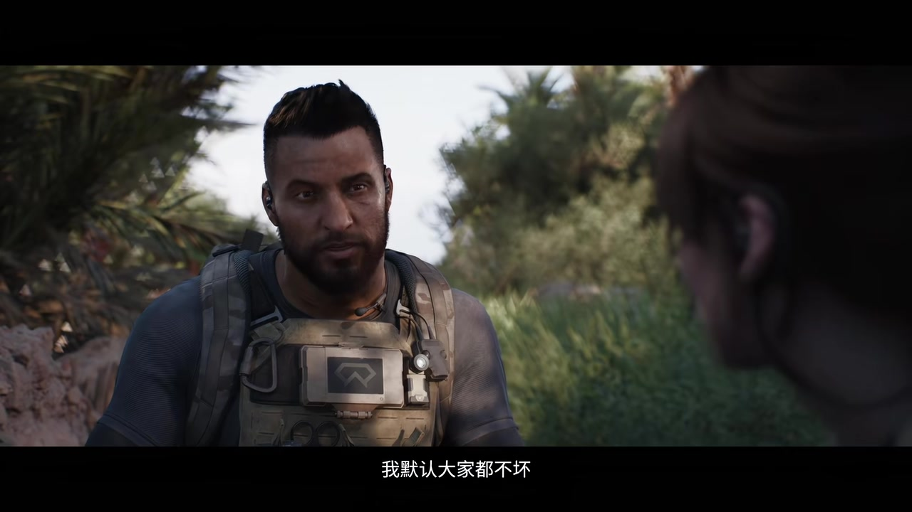
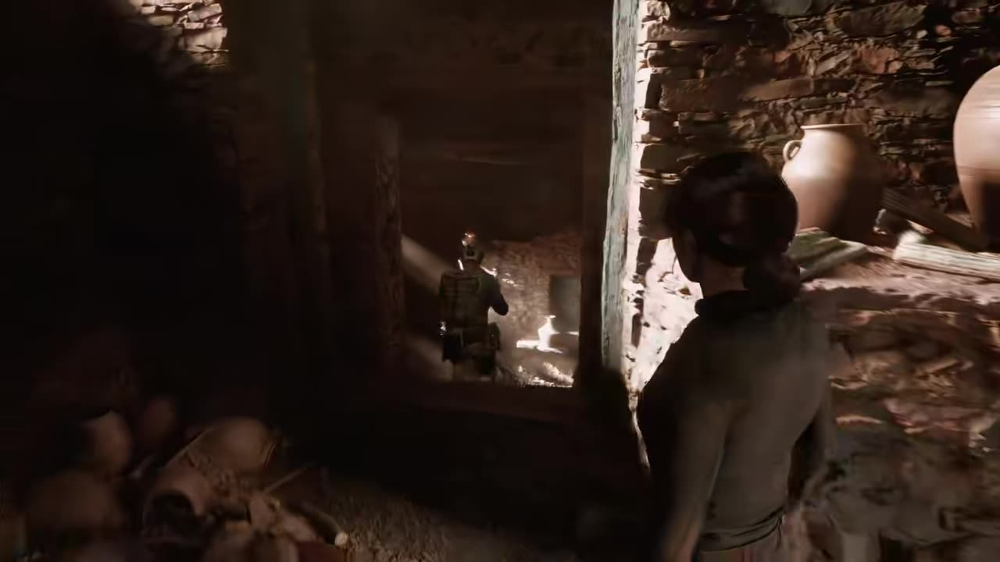

# 【IGN】《穿越火线：潜伏》公布预告 | 夏日游戏节2026

> 来源：[Bilibili 视频](https://www.bilibili.com/video/BV1Sv716oE3r)  
> UP 主：IGN中国｜发布于：2026-06-06｜时长：02:34  
> 游戏信息以视频发布时的官方简介为准。

## 小结

本视频是单机游戏《穿越火线：潜伏》（英文名未在所给素材中出现）的公布预告。根据投稿简介，本作由 **Smilegate 授权**、**That's No Moon 工作室打造**、**腾讯代理发行**，定位为一款**叙事驱动的第三人称战术潜行射击单机游戏**。

预告以角色对话、野外渗透、武装人员行动和紧张冲突场景建立氛围。ASR 可识别出多段人物对白，围绕“人类”“流氓”“不是一路人”“不属于他们”“现实”等表达展开，暗示角色阵营或价值立场存在冲突；但预告没有交代角色姓名、具体时代地点、敌对组织名称、任务目标与剧情全貌，不能据此补写设定。

画面中可明确看到低空直升机、山地/遗迹环境、持枪行动人员，以及一名装备通信设备与战术背心的男性角色。该视频展示的是预告级素材，而非完整实机演示；画面右上角还出现“部分引擎环境下录制，含实机游戏画面与过场动画，研发中不代表最终品质”的提示，因此视觉效果、内容与玩法形态仍可能调整。

官方简介确认本作计划登陆 **PS5、Xbox Series 和 PC**，但**发售日未定**。视频未公布售价、配置需求、联网需求、语言支持、具体发售时间、实际流程结构或可操作系统细节。适合关注《穿越火线》IP单机化方向、第三人称潜行射击作品及 Summer Game Fest 2026 公布信息的读者查阅。

## 思维导图

## 目录

- [发布背景与已确认信息](#发布背景与已确认信息-0000)
- [预告开场：环境、空中载具与技术提示](#预告开场环境空中载具与技术提示-0000)
- [角色冲突：对白所呈现的立场张力](#角色冲突对白所呈现的立场张力-0027)
- [行动场景：第三人称潜行射击的画面线索](#行动场景第三人称潜行射击的画面线索-0101)
- [结尾信息与平台、发售限制](#结尾信息与平台发售限制-0143)
- [可提炼的观看与判断方法](#可提炼的观看与判断方法-0000)
- [结论与限制](#结论与限制-0143)
- [字幕比对](#字幕比对)
- [评论分析](#评论分析)
- [处理记录](#处理记录)

## 发布背景与已确认信息 [00:00](https://www.bilibili.com/video/BV1Sv716oE3r?t=0)

本视频标题标明其为 Summer Game Fest 2026 期间发布的《穿越火线：潜伏》预告，视频总长 **154 秒**，由 IGN中国投稿。

投稿简介提供了本条视频中最具确定性的产品信息：

| 项目 | 已公开内容 |
| --- | --- |
| 游戏名称 | 《穿越火线：潜伏》 |
| 授权方 | Smilegate |
| 开发工作室 | That's No Moon |
| 代理发行 | 腾讯 |
| 游戏类型 | 叙事驱动的第三人称战术潜行射击单机游戏 |
| 登陆平台 | PS5、Xbox Series、PC |
| 发售时间 | 未定 |

需要区分的是：上述内容来自投稿简介，属于视频附带的官方/发行信息；而对预告中人物关系、故事背景、生物或实验要素的理解，只能停留在画面或台词所能直接支撑的范围内。

## 预告开场：环境、空中载具与技术提示 [00:00](https://www.bilibili.com/video/BV1Sv716oE3r?t=0)

ASR 在 [00:00:00,980](https://www.bilibili.com/video/BV1Sv716oE3r?t=0) 至 [00:00:03,300](https://www.bilibili.com/video/BV1Sv716oE3r?t=0) 识别到一句开场对白：

> “人类一直都是这个样子。”

开场关键帧呈现夜间或低照度的山地/林地环境：画面上方有直升机，地面有人员在岩石与植被之间行动。画面右上角的可见提示写有“部分引擎环境下录制，含实机游戏画面与过场动画，研发中不代表最终品质”。

> 图：该帧同时展示低空直升机、崎岖自然地形和地面人员，是判断预告存在军事行动氛围、且混合使用实机画面与过场动画的重要依据；它不能单独证明直升机可操控或该区域为开放世界。

从这段提示可得出的技术层面结论有限但明确：

1. 视频并非纯粹CG展示，提示称其包含“实机游戏画面与过场动画”。
2. 素材仍处于研发阶段，画面质量、镜头内容、特效表现及最终玩法均不可视为锁定版本。
3. “部分引擎环境下录制”是画面制作/运行环境说明，并未公布引擎名称、目标帧率、分辨率、光追设置或主机性能模式，不能自行推定技术参数。

## 角色冲突：对白所呈现的立场张力 [00:27](https://www.bilibili.com/video/BV1Sv716oE3r?t=27)

预告在 [00:00:27,790](https://www.bilibili.com/video/BV1Sv716oE3r?t=27) 至 [00:00:44,770](https://www.bilibili.com/video/BV1Sv716oE3r?t=44) 连续出现多句可识别对白。其文本和时间如下：

| 时间 | ASR 识别文本 |
| --- | --- |
| [00:27.790](https://www.bilibili.com/video/BV1Sv716oE3r?t=27)–00:29.370 | “对，我抓到一个。” |
| [00:30.900](https://www.bilibili.com/video/BV1Sv716oE3r?t=30)–00:35.140 | “在我眼里你们就是屈软怕硬的流氓。” |
| [00:36.580](https://www.bilibili.com/video/BV1Sv716oE3r?t=36)–00:38.200 | “所以我们就不是一路人。” |
| [00:39.740](https://www.bilibili.com/video/BV1Sv716oE3r?t=39)–00:41.600 | “我默认大家都不坏。” |
| [00:42.850](https://www.bilibili.com/video/BV1Sv716oE3r?t=42)–00:44.770 | “那你可真是没救了。” |

其中，“屈软怕硬”可能是 ASR 对口语发音的转写，素材没有提供足够的官方文字台词可供逐字校订，故保留 ASR 原样，不擅自改为其他词语。

> 图：该帧呈现一名佩戴耳机、战术背心和胸前设备的男性角色，镜头前景还有另一名人物。它为“人物对话而非纯旁白”的判断提供了画面支撑，也说明预告包含角色叙事镜头；但角色身份、所属阵营和相互关系均未被素材明确说明。

从台词本身可做的谨慎归纳是：角色之间存在关于暴力、现实认知或群体归属的争执，“不是一路人”与后续“不属于他们了”的表述共同强化了关系破裂或阵营转换的紧张感。此为对对白语义的整理，不等于已证实故事有多阵营选择、道德系统或玩家分支。

## 行动场景：第三人称潜行射击的画面线索 [01:01](https://www.bilibili.com/video/BV1Sv716oE3r?t=61)

在 [00:01:01,350](https://www.bilibili.com/video/BV1Sv716oE3r?t=61) 至 [00:01:05,300](https://www.bilibili.com/video/BV1Sv716oE3r?t=61)，ASR 识别到：

> “是我们，你已经不属于他们了。”

随后在 [00:01:11,640](https://www.bilibili.com/video/BV1Sv716oE3r?t=71) 至 [00:01:13,100](https://www.bilibili.com/video/BV1Sv716oE3r?t=71) 识别到：

> “只是暂时的。”

画面中出现人物在石砌建筑或遗迹式室内空间内行动的镜头。镜头从人物后方观察，人物接近前方持枪同伴/目标所在的狭窄通道；这一构图与官方简介所说的“第三人称”定位相符。

> 图：该帧显示角色背影、狭窄石砌通道及前方武装人物，可用于说明预告存在第三人称视角下的隐蔽接近式行动画面。由于没有HUD、按键提示、敌人警觉状态或完整连续操作过程，不能由此确认具体潜行机制、掩体机制、处决动作或AI规则。

结合官方类型描述，可确认本作的目标类型是“第三人称战术潜行射击”；但下列常见系统均**未在给定素材中得到明确展示或说明**：

- 是否可全程潜行通关；
- 是否存在非致命处置、侦察、伪装、噪声系统或尸体处理；
- 是否有队友指挥、战术暂停、装备改装、技能树或关卡评分；
- 枪械种类、弹药系统、敌方AI、难度选项与辅助功能；
- 单人叙事流程时长、任务结构及是否含合作/多人模式。

因此，现阶段应将“潜行射击”视为官方类型定位，而非把单个镜头扩展为完整玩法清单。

## 结尾信息与平台、发售限制 [01:43](https://www.bilibili.com/video/BV1Sv716oE3r?t=103)

预告末段的最后一句可识别对白出现在 [00:01:43,760](https://www.bilibili.com/video/BV1Sv716oE3r?t=103) 至 [00:01:44,640](https://www.bilibili.com/video/BV1Sv716oE3r?t=103)：

> “让我们都得死。”

这句台词进一步维持了危机感，但没有明确“我们”具体指谁、死亡威胁来自何处。应避免据此把视频概括为某一已确定的灾难、实验或怪物题材。

现有发售相关信息只有平台与“发售日未定”：

- **PS5**
- **Xbox Series**
- **PC**
- **未公布具体发售日期**

“Xbox Series”在投稿简介中如此表述，未进一步区分 Xbox Series X 与 Xbox Series S；PC 也未说明 Steam、Epic Games Store、WeGame 或其他发行渠道。视频同样没有公布 PS4、Xbox One、Nintendo Switch、移动端或云游戏版本，因此不能把未提及平台视作“确定不会推出”。

## 可提炼的观看与判断方法 [00:00](https://www.bilibili.com/video/BV1Sv716oE3r?t=0)

对于此类“公布预告”，可按以下顺序区分信息等级，避免把氛围镜头或社区推测当成已公布功能：

1. **先锁定可验证的文字信息**  
   以投稿简介为核心，记录开发/授权/发行关系、游戏类型、平台与发售状态。本视频中，Smilegate、That's No Moon、腾讯、PS5、Xbox Series、PC与“发售日未定”均属于该层级。

2. **再记录预告直接可见的画面元素**  
   如直升机、林地、石砌空间、战术装备人物与第三人称构图。这些能够说明预告的视觉环境和叙事调性，但不必然对应可操作内容。

3. **将对白作为剧情线索，而非完整设定**  
   本片对白呈现人物对立、群体归属和危险处境，但未给出人物名、组织名、地点或前因后果。整理时应保留原句、附上时间，并明确语义边界。

4. **检查“研发中”免责声明**  
   当画面带有“研发中不代表最终品质”提示时，不能以预告的画质、动画、镜头调度直接推断发售版性能或成品质量。

5. **将社区评论另列为未验证补充**  
   评论可以帮助发现玩家关心点，例如开发团队履历或剧情联想，但必须标记为评论者观点，不能与投稿简介混写为官方确认事项。

## 结论与限制 [01:43](https://www.bilibili.com/video/BV1Sv716oE3r?t=103)

《穿越火线：潜伏》目前已公开的核心定位是：由 Smilegate 授权、That's No Moon 打造、腾讯代理发行的叙事驱动第三人称战术潜行射击单机游戏，计划推出 PS5、Xbox Series 与 PC 版本。

预告提供了军事化行动、自然与石砌环境、人物冲突及危险局势等叙事/视觉线索，也通过“实机游戏画面与过场动画”的说明表明视频并非完全CG。但是，视频没有展示足以完整验证玩法循环的连续实机操作，且带有研发中免责声明。

截至本视频所附资料的抓取时间（2026-07-16），发售日期仍为未定。未来的发售窗口、平台商店、语言支持、实际玩法系统、技术指标和剧情设定均可能随官方后续公告变化；本文不将预告外的评论推测作为事实。

## 字幕比对

| 字幕来源 | 完整性 | 专有名词 | 时间轴 | 主要问题 |
| --- | --- | --- | --- | --- |
| Bilibili 站内字幕 `p01-ai-zh.srt` | 很低，仅覆盖约 00:07.700–00:41.980 的部分区段 | 无有效专有名词信息 | 有精确起止时间 | 全部为“♪ 音乐 ♪”，未提供实际对白内容 |
| 本次 ASR 字幕 | 中等，识别出 11 段、合计约 22.89 秒语音，语音覆盖率 14.91% | 未识别出游戏名、团队名或角色名 | 有精确起止时间，覆盖 00:00.980–01:44.640 | 若干短句存在口语断句或同音转写不确定性；其余时段主要是音乐、环境声或无可识别对白 |

### 最终字幕选择

正文以**本次 ASR 的带时间戳对白**为主要文本来源，以站内字幕作为“该时段存在音乐标注”的补充参考。原因是站内字幕没有有效台词文字，而 ASR 提供了实际对白及其时间范围。

本次 ASR 使用 `medium` 模型，自动识别语言为中文，语言概率为 **0.9970703125**；源音频时长为 **153.472 秒**。诊断结果未标记 `noAudioStream=true`，说明源视频**存在音轨**，且本次 ASR 成功识别到语音；站内字幕缺少对白并不代表视频无音频。

以下内容未做无依据校正：

- “屈软怕硬”保留为 ASR 转写，未擅自替换为可能的近音词；
- “是我们，你已经不属于他们了”按 ASR 原文保留，其上下文指代不明；
- 游戏名称、开发商、授权方、发行方及平台信息取自视频元数据和投稿简介，而非对白字幕；
- 直升机、石砌空间、战术人物、第三人称构图等视觉信息由关键帧辅助核对，不将其扩展为未展示的功能设定。

## 评论分析

以下仅处理可获取热评前三条，评论发布时间与内容均反映发布后的社区讨论，不构成官方公告或已验证事实。

### 1. 关于 That's No Moon 团队履历的补充

- 评论者：无上寰宇
- 点赞：484
- 核心观点：评论称 That's No Moon 由两位前顽皮狗成员创立，并进一步列举两人与《最后生还者》、 《神秘海域》、Infinity Ward、《使命召唤：无限战争》和《使命召唤：现代战争》（2019）战役制作的关联；评论者据此表达对本作战役叙事的期待。
- 价值：该评论指出玩家关注开发团队的过往作品与叙事/战役经验，为理解社区期待来源提供了线索。
- 可信度边界：这是用户评论中提供的履历叙述，视频元数据与预告本身未展示这些人员姓名、履历或其在本作的具体职务，因此不能将其作为本视频已直接证实的信息。

### 2. 对后半段剧情元素的推测

- 评论者：鸡翅Fredom
- 点赞：347
- 核心观点：评论者认为后半段画面可能类似“生化实验室”，并根据“快速愈合、红色的手、电梯扑出来的人”等其所感知的元素，猜测作品可能与《穿越火线》前传有关。
- 价值：反映观众从预告视觉细节中延伸出的题材联想。
- 可信度边界：这是明确的推测，投稿简介未确认生化实验室、快速愈合、前传定位或任何具体世界观设定。本文不据此认定游戏包含生化实验、怪物或前传剧情。

### 3. 对《穿越火线》亮相 Summer Game Fest 的即时反应

- 评论者：世界第一女子
- 点赞：951
- 核心观点：“在夏日游戏节看到穿越火线belike”，以网络化表达传达对《穿越火线》出现在该活动中的惊讶或讨论热度。
- 价值：该评论是前三条中点赞最高者，说明“IP在该舞台亮相”本身是观众的重要关注点。
- 可信度边界：评论没有提供可核验的新产品信息，主要属于情绪与社区反应，不应外推为市场表现或官方战略结论。

## 处理记录

- Worker ID：`worker-mrj0wjed-b0c290ad`
- 模型：`gpt-5.6-terra`
- 调用工具与模型：素材整理 Agent；本次 ASR 模型为 `medium`，运行设备为 CUDA，计算类型为 `float16`。
- 使用的素材：视频元数据、投稿简介、站内字幕 `p01-ai-zh.srt`、本次 ASR 结果与 SRT、12 张关键帧清单、可获取热评前三条。
- 字幕选择：已检查站内字幕和本次 ASR。站内字幕仅含音乐标记，正文采用本次 ASR 的实际对白及时间轴；不存在 `noAudioStream=true` 标记，源视频有音轨。
- 关键帧选择依据：选用 `frames/frame-001.jpg` 展示开场山地、直升机及“实机/过场动画、研发中”提示；选用 `frames/frame-002.jpg` 展示石砌空间中的第三人称行动构图；选用 `frames/frame-004.jpg` 展示战术装备角色与对话镜头。选择标准是能直接支撑正文中已陈述的可见画面信息，未用其推断未展示的玩法系统。
- 时间轴依据：正文各章节与对白时间均优先使用本次 ASR SRT 的真实起止时间换算为秒；未依据文字顺序虚构时间位置。
- 缓存清理：未提供缓存清理执行记录；本文不声称已执行或完成缓存清理。
- 未解决问题：角色身份、阵营、剧情背景、关卡结构、潜行/战斗具体机制、引擎名称、性能参数、商店渠道、发售日期及评论中涉及的团队履历均未由所给预告素材完整确认。
