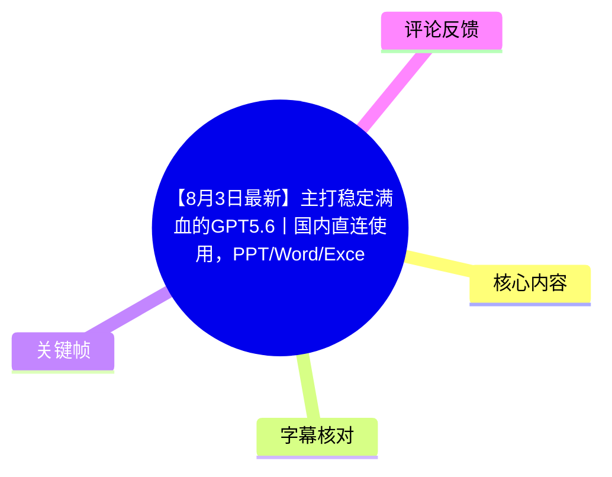
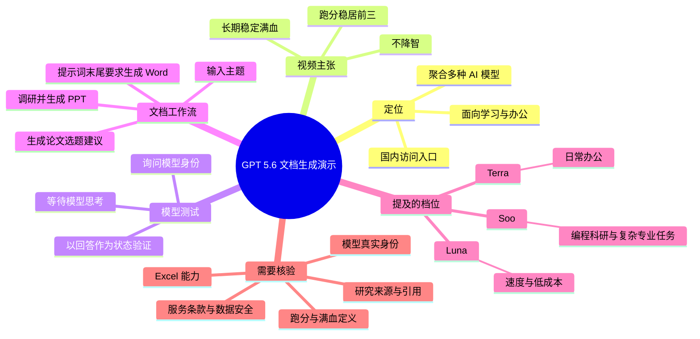
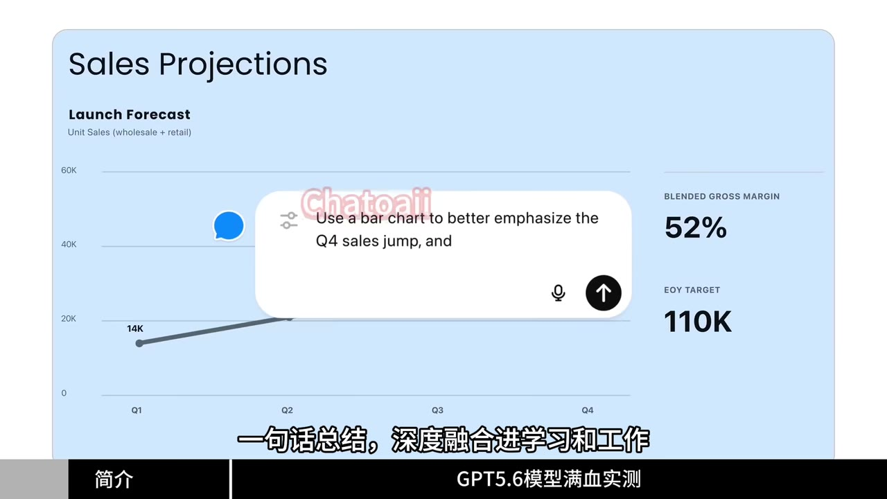
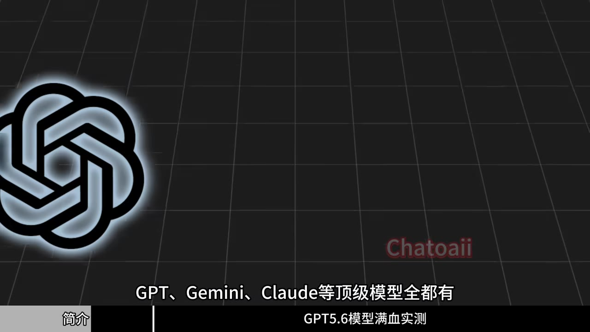
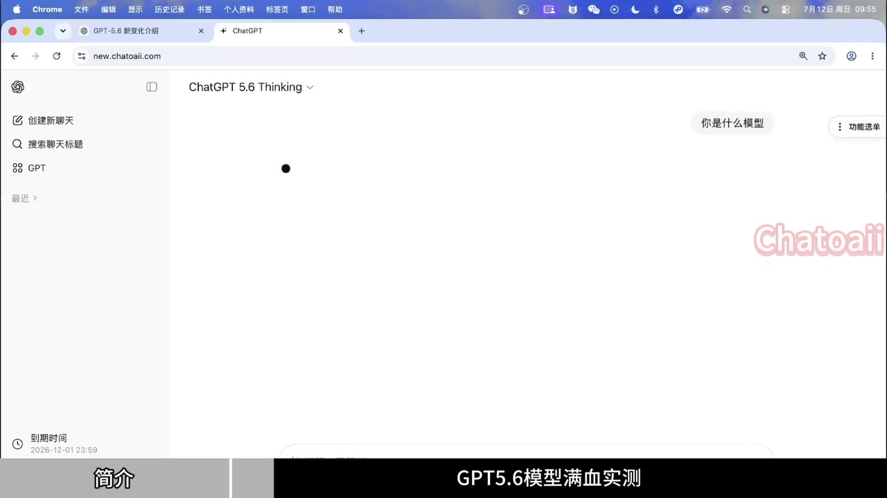
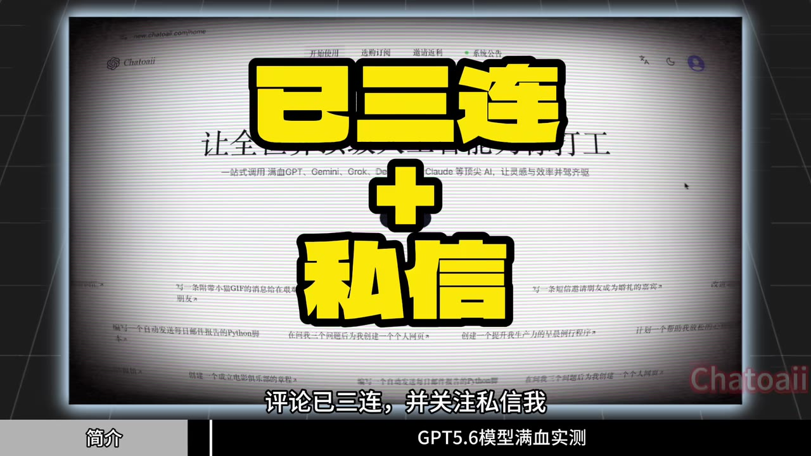

# 【8月3日最新】主打稳定满血的GPT5.6丨国内直连使用，PPT/Word/Excel能力拉满

> 来源：[Bilibili 视频](https://www.bilibili.com/video/BV1h13d6uE8a)<br>
> UP 主：晴川今天做实验了吗｜发布时间：2026-08-03｜视频时长：02:29｜分辨率：1920×1080

## 小结

视频以名为“GPT 5.6”的模型/服务为主线，推广一个可在国内访问的聚合式 AI 使用入口。UP 主称该入口集成 GPT、Gemini、Claude 等模型，并强调“长期稳定满血”“不降智”和文档生成能力；画面中出现 `new.chatoaii.com` 及 “Chatoaii” 水印，说明演示所用页面疑似属于该服务。

核心演示包括三类任务：先在聊天页面询问模型身份，以此作为“满血状态”验证；再让模型围绕主题调研并生成 PPT；最后在提示词末尾加入“生成 Word”，将调研结果导出为 Word 文档。UP 主特别将论文选题建议场景定位为对初次写论文的学生友好。

视频中关于“跑分稳居前三”“PPT 质量比任何模型高很多”“查阅过去十年研究”“模型没有降智且满血”等均为 UP 主的展示或主张。素材未提供可复核的基准来源、模型官方文档、实际服务套餐/额度、导出文件原始内容或第三方验证，因此不能将这些营销性结论视为已经独立证实的事实。

标题写有 Excel 能力，但 ASR 可识别语音与给出的关键帧仅覆盖 GPT、PPT、Word；未发现 Excel 的具体操作、提示词、表格结果或导出过程。对 Excel 有刚需的读者，需要自行验证功能是否存在、是否可用及是否受套餐限制。

这是一条时效性较强的工具演示视频，发布于 2026-08-03。模型名称、可选档位、国内可访问性、价格、稳定性、可用模型与文件生成质量都可能随服务端更新变化；涉及论文、研究与正式文档时，必须对来源、引文、数据和格式进行人工核验。

## 思维导图





## 目录

- [背景、定位与时效性](#背景定位与时效性-0000)
- [模型集合与“满血”测试](#模型集合与满血测试-0024)
- [模型档位与思考程度](#模型档位与思考程度-0046)
- [从主题到 PPT](#从主题到-ppt-0111)
- [用短提示词生成 Word 调研文档](#用短提示词生成-word-调研文档-0138)
- [可复用操作步骤](#可复用操作步骤-0111)
- [参数、限制与核验清单](#参数限制与核验清单-0204)
- [字幕比对](#字幕比对-0000)
- [评论分析](#评论分析-0000)
- [处理记录](#处理记录-0000)

## 背景、定位与时效性 [00:00](https://www.bilibili.com/video/BV1h13d6uE8a?t=0)

UP 主在开场称，“GPT 5.6”相较旧模型的文件生成能力“更强、更完善”，适合学生群体，并将其概括为“深度融合进学习和工作”。视频的实际重点不是介绍模型底层技术，而是演示一个第三方网页入口如何调用模型完成 PPT 与 Word 生成。

画面中的首屏是一张英文销售预测幻灯片，中央输入框文字为“Use a bar chart to better emphasize the Q4 sales jump, and…”，旁边可见 “Sales Projections”“BLENDED GROSS MARGIN 52%”“EOY TARGET 110K”等内容。这一画面直接体现视频想强调的能力方向：把自然语言要求落实到具有图表、版式和商业数据块的演示文稿中。



> 图：关键帧展示了英文销售预测幻灯片及其自然语言编辑指令。它说明视频所说的“PPT 能力”包含图表强调与视觉排版，但不能据此推断全部 PPT 均由该模型自动生成，也不能验证其中数据真实性。

需要区分以下层次：

- **可直接从视频/素材确认**：UP 主确实展示并口述了模型聊天、PPT 生成和 Word 导出流程。
- **UP 主的主张**：模型跑分排行“稳居前三”、文件能力强于旧模型、服务可以长期稳定且“满血”运行。
- **无法由本视频独立确认的事项**：GPT 5.6 的官方名称与提供方、聚合平台实际接入的模型版本、模型输出是否未经改动、稳定性、速度、配额、费用、隐私条款和数据保存方式。

## 模型集合与“满血”测试 [00:24](https://www.bilibili.com/video/BV1h13d6uE8a?t=24)

约 00:24 起，UP 主称该入口拥有 GPT、Gemini、Claude 等“顶级模型”，并强调可“国内免翻”使用。视频画面以 OpenAI 标志和 “Chatoaii” 水印呈现这项推广信息，但没有展示模型列表、具体版本号、上下文长度、调用渠道、账号权限或价格页面。



> 图：画面文字明确写有“GPT、Gemini、Claude等顶级模型全都有”，可作为视频宣传口径的视觉证据；但该画面不构成服务实际可用性、模型版本或官方授权关系的证明。

随后 UP 主进入一个网页聊天界面，选择栏显示为 “ChatGPT 5.6 Thinking”，并向模型提问“你是什么模型”。这是视频所采用的“满血实测”方法：通过模型自我报告来判断是否为相应模型、是否“降智”。



> 图：该帧显示 `new.chatoaii.com` 页面、模型选择文字“ChatGPT 5.6 Thinking”及问题“你是什么模型”。它有助于还原演示操作，但模型在对话中自称什么并不能可靠证明实际后端模型身份或性能档位。

### 对该测试方法的评价

1. **操作层面**：直接询问模型身份是一个极低成本的检查动作，适合确认界面回显与对话基本可用。
2. **证据强度有限**：语言模型可能被系统提示词、前端标签、路由配置或回答策略影响；自我陈述不能替代 API 响应中的模型标识、服务方技术说明或可复现基准测试。
3. **更可靠的补充验证**：若需要验证模型版本，应查看平台模型说明、请求日志/API 返回字段（若有）、官方公告，并采用固定提示词与多个模型进行盲测对比。
4. **“满血”“降智”未被定义**：视频未说明该词对应哪些可测指标，例如推理预算、上下文窗口、工具调用权限、输出长度限制、并发量或服务质量等级，因此无法据此量化判断。

## 模型档位与思考程度 [00:46](https://www.bilibili.com/video/BV1h13d6uE8a?t=46)

ASR 在 00:46—01:10 识别到 UP 主介绍了三个单位/档位，但专有名词存在明显误识别。按 ASR 原文近似表述：

| ASR 识别名称 | 视频口述的用途 | 可靠性说明 |
| --- | --- | --- |
| `Soo` | 编程、科研和复杂专业任务 | 名称可能误识别，未获得可读画面或官方资料校正 |
| `Terra` | 大多数日常办公 | `Terra` 与任务中提供模型名 `gpt-5.6-terra` 存在字面对应，但仍不能据此确认其是视频平台的官方档位名称 |
| `Luna` | 主打速度与低成本 | 未获得可独立验证的模型说明 |

UP 主还称本次更新支持切换“思考程度”，可以按需要选择档位，使任务匹配更精确。视频未给出具体档位数量、名称、思考时间、计费差异或切换界面，因此以下只能作为选型原则，不能当作该平台的已确认参数：

- 对编程、科研、复杂专业任务，优先选择视频所称偏复杂任务的档位，并用真实样例验证准确性。
- 对常规办公，优先关注输出稳定性、格式支持与处理速度。
- 对低成本、低延迟需求，需同时检查响应速度、生成质量、额度与收费规则，避免仅根据“低成本”标签判断。

## 从主题到 PPT [01:11](https://www.bilibili.com/video/BV1h13d6uE8a?t=71)

在 01:11—01:18，UP 主演示的指令思路是：**输入一个主题，让 GPT 围绕主题调研并生成 PPT**。随后在 01:20—01:29，UP 主主观评价 5.6 版本的 PPT“内容准确、排版好看、设计感拉满”，且称质量明显高于其他模型。

这段演示提供的是一个简化工作流，而非完整提示词模板。视频未展示主题原文、资料来源、页数、受众、语言、模板、图表数据、生成时长、实际导出格式或人工修改过程。因此可以确认“主题 → 调研 → PPT”的意图，但不能复现某个特定成品。



> 图：画面覆盖“已三连 + 私信”等引导文字，背景为服务网页。该帧说明视频将具体入口或后续信息引导至私信，而非在视频中公开完整配置、注册链接或提示词；这也是读者无法按视频完整复现的原因之一。

### PPT 生成时应补充的任务约束

若在实际工作中复用该流程，建议把视频中没有展开的约束写入提示词：

1. **明确主题与目标**：说明要解答的问题，而非仅给一个宽泛标题。
2. **明确受众与用途**：例如课堂汇报、项目立项、销售复盘或管理层简报。
3. **限制页数与结构**：要求封面、目录、核心论点、数据页、结论及参考来源等固定结构。
4. **要求来源可追溯**：对研究内容要求列出链接、出版物或数据来源；未能核验的内容须标注。
5. **规定视觉要素**：指定是否需要柱状图、折线图、流程图、配色与比例。
6. **人工复核后再使用**：核对数字、事实、版权素材、图表标签及中文排版，特别是对外发布的材料。

## 用短提示词生成 Word 调研文档 [01:38](https://www.bilibili.com/video/BV1h13d6uE8a?t=98)

01:38—01:46，UP 主给出的 Word 操作要点非常明确：如果希望把调研内容导出为 Word 文档，只需在提示词结尾说明“生成 Word”即可。接下来使用的短提示词仅要求生成“论文选题建议”；UP 主称模型会据此扩展、补充信息，适合首次写论文、尚不知如何开始的学生。

视频在 02:04—02:19 声称，生成出来的 Word 文档查阅了过去十年的相关研究，并将内容完整呈现；最后一句 ASR 识别为“空白点等总结得非常到位”，结合上下文可理解为 UP 主在评价研究空白等内容，但原始语音中的准确措辞无法仅凭 ASR 完全确认。

### 视频呈现的最小提示词逻辑

```text
[论文主题或研究方向] 的论文选题建议，生成 Word
```

该句式的关键不在于“Word”二字本身，而在于向工具明确两个输出目标：

- **内容目标**：围绕研究方向给出选题建议与扩展信息；
- **交付目标**：将结果生成或导出为 Word 文档。

### 对“过去十年研究”主张的使用边界

视频没有展示可核验的文献清单、检索数据库、DOI、作者、年份、引用格式或访问日期。因此，不能据此认为生成文档真的完成了严格意义上的近十年文献综述。尤其在论文场景中，应执行以下检查：

- 将每一条参考文献放入学术数据库、期刊官网或学校图书馆系统核验；
- 检查作者、题名、期刊、年份、卷期、页码和 DOI 是否真实对应；
- 区分模型生成的“研究趋势概括”与真实可引用的文献证据；
- 检查研究空白是否由可靠文献支持，而不是由模型编造；
- 按学校格式规范重新整理标题层级、引文、脚注、目录、图表和页码。

## 可复用操作步骤 [01:11](https://www.bilibili.com/video/BV1h13d6uE8a?t=71)

以下按视频顺序整理为可执行流程；其中未在视频中展示的步骤均标注为建议，而非视频原话。

### 1. 进入模型聊天页面并确认当前标签 [00:32](https://www.bilibili.com/video/BV1h13d6uE8a?t=32)

- 打开视频演示的聊天服务页面。
- 查看当前模型选择栏。关键帧可见的标签为“ChatGPT 5.6 Thinking”。
- 如服务提供模型/思考档位切换，按任务复杂度选择；视频只说明可切换，不提供完整选项与参数。

### 2. 做基础可用性测试 [00:32](https://www.bilibili.com/video/BV1h13d6uE8a?t=32)

- 输入“你是什么模型”或其他固定测试题。
- 等待回复，观察能否正常生成。
- 不要仅凭模型自我介绍确认后端版本；如任务重要，应增加固定基准题、长上下文、文件生成和事实检索等测试。

### 3. 生成 PPT [01:11](https://www.bilibili.com/video/BV1h13d6uE8a?t=71)

- 输入明确主题。
- 说明希望模型“调研并生成 PPT”。
- 获得成品后，重点检查论点结构、数据来源、图表数值、版式溢出、字体兼容性和图片版权。
- 若要提高可控性，建议补充页数、目标读者、语言、风格、资料范围与引用格式。

### 4. 生成论文选题建议并导出 Word [01:38](https://www.bilibili.com/video/BV1h13d6uE8a?t=98)

- 输入研究主题或专业方向。
- 请求生成论文选题建议。
- 在提示词结尾加入“生成 Word”。
- 导出后，人工检查文档是否具备清晰标题层级、选题依据、研究问题、方法建议、参考文献及可追溯来源。

### 5. 保存与安全处理 [02:04](https://www.bilibili.com/video/BV1h13d6uE8a?t=124)

- 对需要提交的文档保留本地副本和修改记录。
- 不向第三方聚合服务输入未公开课题、受保密协议约束的资料、个人隐私、公司经营数据或客户数据，除非已确认其数据处理与保留政策符合要求。
- 对所有自动生成的研究、商业和教学内容进行事实校验后再对外使用。

## 参数、限制与核验清单 [02:04](https://www.bilibili.com/video/BV1h13d6uE8a?t=124)

### 视频中出现或可读取的参数

| 项目 | 内容 | 来源与说明 |
| --- | --- | --- |
| 视频时长 | 149 秒 | 元数据 |
| ASR 音频时长 | 148.677 秒 | ASR 诊断 |
| 语言识别 | 中文，概率 0.9980 | ASR 诊断 |
| ASR 有语音覆盖 | 115.64 秒，覆盖率 77.78% | ASR 诊断；存在转场、静音或音乐空隙 |
| 可见模型标签 | `ChatGPT 5.6 Thinking` | 关键帧画面 |
| 画面可见服务地址 | `new.chatoaii.com` | 关键帧画面；不代表官方关系或推荐 |
| 文档类型 | PPT、Word | 语音与画面均覆盖 |
| Excel | 仅出现在视频标题 | 未见操作演示或 ASR 支撑 |
| 模型集合 | GPT、Gemini、Claude | 视频宣传口径 |
| 思考程度 | 支持切换 | 视频口述，未展示具体配置 |

### 重要限制

1. **平台与模型身份未证实**：聚合网站的前端模型名称不等同于可验证的后端模型版本。
2. **“满血”没有标准定义**：视频未提供可复现测试条件、上下文限制、推理资源、接口日志或对照实验。
3. **性能结论不可外推**：UP 主关于跑分排名、PPT 质量领先的说法没有附带基准名称、数据集、样本、评测时间或排名截图。
4. **研究内容可能产生幻觉**：即使文档看似完整，文献、数字、结论与“研究空白”仍可能错误或虚构。
5. **导出能力未完整展示**：Word 虽被口述演示，但素材未提供原始文件；Excel 完全没有实际演示。
6. **服务规则可能变化**：国内可访问性、模型可用性、账号有效期、价格、速度和额度均具有强时效性。
7. **视频含推广导流**：UP 主要求评论、关注并私信获取后续信息。涉及注册、付费或提交资料时，应自行核对服务主体、协议与风险。

## 字幕比对 [00:00](https://www.bilibili.com/video/BV1h13d6uE8a?t=0)

| 字幕来源 | 完整性 | 专有名词 | 时间轴 | 主要问题 |
| --- | --- | --- | --- | --- |
| Bilibili 站内字幕 `p01-ai-zh.srt` | 与本视频内容严重不符，仅到 01:04.900 | 几乎没有 GPT、PPT、Word 等相关词 | 有真实 SRT 时间段，但内容对应疑似其他视频 | 出现“同学聚会”“输入法算命”等无关内容，不能用于本视频正文 |
| 本次 ASR `large-v3-turbo` | 覆盖 00:00.050—02:28.530，语音覆盖率 77.78% | 主要模型名和部分词语存在误识别 | 有连续可用的真实分段时间戳 | 如“免番/玩赚/模形”“降致”“提示茨”“GPT 5.0”“Soo”等词不可靠；01:29—01:38 存在约 9.84 秒较大空隙 |

### 最终字幕选择

正文以**本次 ASR 的时间轴**为主，因为它与视频标题、关键帧和内容主题一致；站内字幕虽具备时间戳，但内容明显错配，予以排除。ASR 没有 `noAudioStream=true` 标记，且诊断显示存在 115.64 秒有效语音，因此本视频有可识别音轨，并非无音轨源视频。

对 ASR 的校正遵循“只校正有画面或任务元数据支持的词”原则：

- 将 `GPt` 等大小写混乱统一写为 `GPT`；
- 将 `Gemini Cloud` 依据关键帧中“GPT、Gemini、Claude等顶级模型全都有”的文字校正为“GPT、Gemini、Claude”；
- 将“生成Word”统一写为“生成 Word”；
- 对 `Soo`、`Terra`、`Luna` 等档位名保留 ASR 不确定性，不据此扩展技术细节；
- ASR 中“GPT 5.0”“满邪”“空白点”等无法由关键帧或可靠字幕确认的内容，不作为模型身份、性能或论文功能的确定事实。

## 评论分析 [00:00](https://www.bilibili.com/video/BV1h13d6uE8a?t=0)

本次素材中的热评接口返回 `items: []`，可获取热评数量为 **0**，因此不存在可分析的热评前三条。

视频元数据同时显示回复数为 0。没有用户反馈可用于补充服务可用性、付费体验、实际生成质量或争议信息；不能以缺少评论推断该工具可靠或不可靠。

## 处理记录 [00:00](https://www.bilibili.com/video/BV1h13d6uE8a?t=0)

- **Worker ID**：`worker-mrj0wbly-5dc4e50c`
- **整理模型**：`gpt-5.6-terra`
- **ASR 模型**：`large-v3-turbo`，CUDA 推理，`int8_float16`
- **使用素材/工具产物**：视频元数据、站内 SRT、ASR 结果 JSON、ASR SRT、关键帧目录、评论 JSON；素材包还提供了合并视频、WAV 音频等产物路径。
- **字幕选择**：检查了站内字幕与本次 ASR。站内字幕内容错配，最终采用与视频内容相符的本次 ASR 时间轴；对专有名词仅做有关键帧支持的有限校正。
- **关键帧选择依据**：选用 `frames/frame-001.jpg` 展示 PPT 编辑与版式目标，`frames/frame-002.jpg` 记录多模型集合宣传口径，`frames/frame-003.jpg` 说明视频将具体入口引导至私信，`frames/frame-004.jpg` 还原模型身份提问及可见网页标签。其余关键帧未在提供的画面素材中附带可核验内容，未强行引用。
- **缓存清理**：未提供缓存清理执行记录；本整理未声明或编造已删除任何本地素材、音频、视频或缓存。
- **未解决问题**：无法确认服务的真实后端模型、官方授权关系、模型档位准确名称、费用与额度、数据政策、PPT/Word 文件原件质量、Excel 功能，以及“跑分前三”“满血”“近十年研究”的可复核证据。

## 评论分析

本次流程未获取到可用热评，因此不推断观众态度或额外结论。
