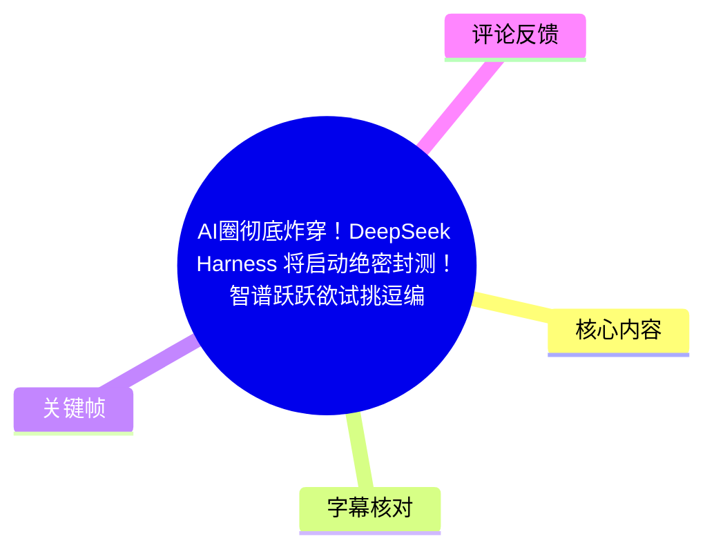
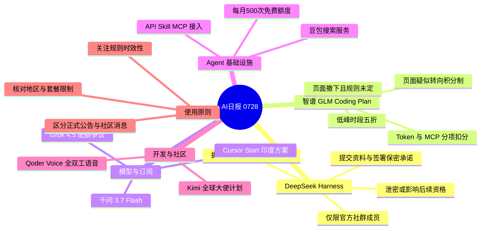
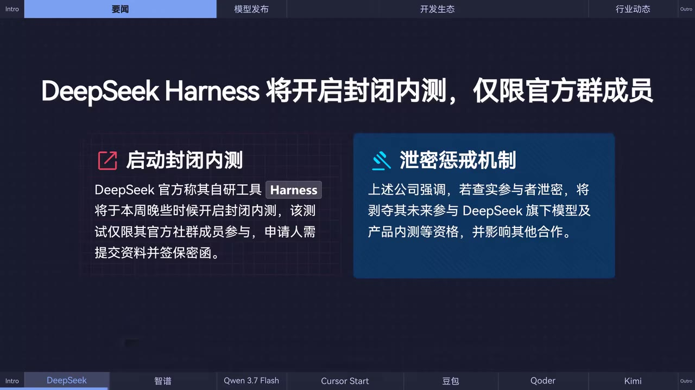
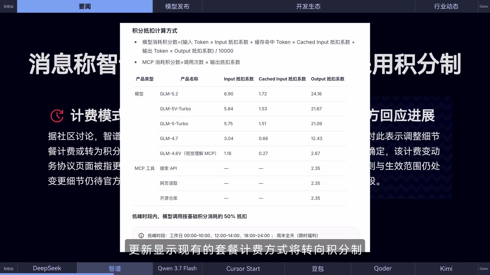
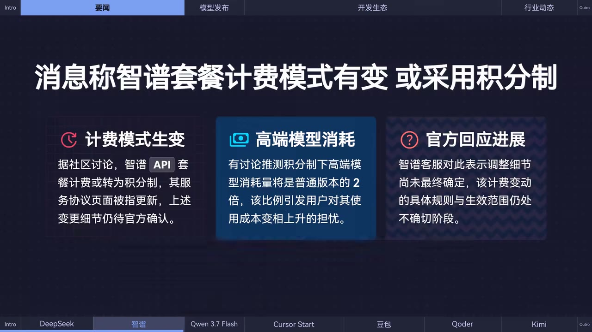

# AI圈彻底炸穿！DeepSeek Harness 将启动绝密封测！智谱跃跃欲试挑逗编程套餐用户！| AI日报0728

> 来源：[Bilibili 视频](https://www.bilibili.com/video/BV1Bj3B6KEn7)  
> UP 主：黑鸦Heya｜视频时长：01:44｜栏目：AIcode  
> 信息性质：本视频为 AI 日报资讯汇总。UP 主在简介中声明内容来自互联网公开信息，因此其中“爆料”“社区用户发现”“疑似”等表述均不等同于厂商正式公告。

## 小结

视频在 104 秒内串联了 7 条 AI 工具与行业动态，重点集中于产品灰测、订阅/计费变化、模型发布、Agent 搜索能力，以及开发工具的交互升级。

最受关注的消息是：据社区爆料，DeepSeek 自研工具 **DeepSeek Harness** 计划于“本周晚些时候”启动封闭内测。参与者仅从官方社群成员中选择，需提交个人资料、签署保密承诺函；画面还显示，泄密可能影响未来参与 DeepSeek 模型、产品内测及其他合作的资格。该信息属于内测传闻与群公告截图层面的材料，不能据此推断 Harness 的能力、上线日期或公开可用性。

第二项重点是智谱 **GLM Coding Plan** 的计费页面变动：画面显示其可能由套餐计费改为积分制，并给出了模型 Token、缓存命中 Token、输出 Token 与 MCP 工具调用的扣分规则及低峰折扣。不过，视频同时明确称相关页面随后被撤下，客服称细节尚未最终确定。因此，具体费率、何时生效、适用用户范围均仍不确定。

其余资讯包括：千问 3.7 Flash 上线并强调多模态理解与 Agent 执行；Cursor 在印度推出每月 649 卢比的 Cursor Start，但社区质疑其中 Grok 4.5 的思考强度和额度；火山引擎上线面向 AI Agent 的豆包搜索服务，提供每月 500 次免费搜索额度，并支持 API、Skill、MCP 接入；Qoder 推出全双工实时语音智能体 Qoder Voice；Kimi 则启动全球大使计划。

本期内容适合关注 AI 编程套餐成本、Agent 工具链、联网搜索接入和模型产品动态的开发者阅读。使用层面的共同经验是：对“页面短暂出现”“客服口径”“社区发现”一类新闻，应先将其视为待验证信号，避免按未确认规则直接调整生产预算或工作流。

## 思维导图

## 目录

- [资讯背景与阅读边界](#资讯背景与阅读边界)
- [DeepSeek Harness：传闻中的封闭内测与保密限制](#deepseek-harness传闻中的封闭内测与保密限制)
- [智谱 GLM Coding Plan：疑似积分制及计费参数](#智谱-glm-coding-plan疑似积分制及计费参数)
- [千问 37 Flash 与 Cursor Start：模型能力和订阅限制](#千问-37-flash-与-cursor-start模型能力和订阅限制)
- [豆包搜索、Qoder Voice 与 Kimi 大使计划](#豆包搜索qoder-voice-与-kimi-大使计划)
- [实践检查清单](#实践检查清单)
- [结论、限制与时效性](#结论限制与时效性)
- [字幕比对](#字幕比对)
- [评论分析](#评论分析)
- [处理记录](#处理记录)

## [资讯背景与阅读边界](https://www.bilibili.com/video/BV1Bj3B6KEn7?t=0)

视频自 **00:00:00.300** 开始播报，至 **00:01:43.000** 结束。内容采用“日报快讯”形式，单条新闻之间衔接紧凑，视频未提供每条新闻的独立口播时间戳；以下时间轴优先采用本次 ASR 的真实分段起点，而不依据文字顺序虚构更细的时间位置。

需要区分三类信息强度：

1. **视频明确转述的产品消息**：例如千问 3.7 Flash 已在阿里云百炼和 OpenRouter 可用、豆包搜索支持 API/Skill/MCP 等。
2. **社区线索或尚未落定的规则**：DeepSeek Harness 内测、智谱计费变更、Cursor Start 中 Grok 4.5 的能力/额度限制均含“爆料”“发现”“疑似”等限定。
3. **画面中出现的细节**：智谱积分公式、折扣时段和抵扣系数来自视频展示的页面截图；但该页面据视频称已被撤下，因此不能将其当作当前有效价目表。

## [DeepSeek Harness：传闻中的封闭内测与保密限制](https://www.bilibili.com/video/BV1Bj3B6KEn7?t=0)

ASR 对应分段：**00:00:00.300–00:00:24.400**。

视频称，社区用户爆料 **DeepSeek Harness** 产品计划于“本周晚些时候”开启封闭内测。画面将 Harness 描述为 DeepSeek 的自研工具，但视频没有说明它的产品形态、具体功能、支持的模型、运行环境或公开发布时间。

### 视频所述参与条件

- 测试资格仅限 **DeepSeek 官方社群成员**；
- 非本群用户填写问卷无效；
- 有意参与者需在问卷中提交个人资料；
- 参与者需签署一份保密承诺函；
- 获选后会被拉入内测用户群，并获得产品访问权限。

### 保密限制

画面中的“泄密惩戒机制”写明：若查实参与者泄密，可能剥夺其未来参与 DeepSeek 旗下模型及产品内测的资格，并影响其他合作机会。这里应注意两点：

- 这是视频展示的群公告/转述材料，不是本任务提供的 DeepSeek 官方公开公告链接；
- “本周晚些时候”是强时效措辞，其指向的视频发布当周，已不能直接用于判断现在是否仍可报名或测试是否已开始。

> 图：该关键帧将“仅限官方群成员”“提交资料并签署保密函”与“泄密可能影响未来内测资格”并列呈现，是理解该消息核心限制的直接画面依据。它同时说明此处讨论的是受限灰测，而非公开产品发布。

## [智谱 GLM Coding Plan：疑似积分制及计费参数](https://www.bilibili.com/video/BV1Bj3B6KEn7?t=0)

ASR 对应分段：**00:00:00.300–00:00:24.400**，其中计费信息延续到下一 ASR 分段 **00:00:24.400–00:00:48.440** 的开头。

视频称，有用户发现 **智谱 GLM Coding Plan** 相关文档页面更新，显示现有套餐计费方式可能转向积分制；但页面随后已被撤下，且据用户转述，客服表示细节尚未最终确定。

因此，本节可将画面内容理解为“曾出现过的候选规则/页面信息”，而非确定执行的现行政策。

### 画面展示的积分计算方式

视频展示的页面将消耗区分为模型 Token 消耗与 MCP 消耗：

\[
\text{模型消耗积分数} =
\frac{
(\text{输入 Token} \times \text{Input 抵扣系数})
+
(\text{缓存命中 Token} \times \text{Cached Input 抵扣系数})
+
(\text{输出 Token} \times \text{Output 抵扣系数})
}{10000}
\]

\[
\text{MCP 消耗积分数} =
\text{调用次数} \times \text{输出抵扣系数}
\]

画面中可辨识的抵扣系数如下：

| 产品类型 | 产品名称 | Input 抵扣系数 | Cached Input 抵扣系数 | Output 抵扣系数 |
| --- | --- | ---: | ---: | ---: |
| 模型 | GLM-5.2 | 6.90 | 1.72 | 24.16 |
| 模型 | GLM-5V-Turbo | 5.84 | 1.53 | 21.67 |
| 模型 | GLM-5-Turbo | 5.75 | 1.51 | 21.09 |
| 模型 | GLM-4.7 | 3.04 | 0.66 | 12.43 |
| 模型 | GLM-4.6V（视觉理解 MCP） | 1.18 | 0.27 | 2.67 |
| MCP 工具 | 搜索 API | — | — | 2.35 |
| MCP 工具 | 网页读取 | — | — | 2.35 |
| MCP 工具 | 开源仓库 | — | — | 2.35 |

### 画面展示的低峰折扣

页面写明，低峰时段模型调用按基础积分消耗的 **50% 折扣**计算，时段为：

- 工作日：`00:00–10:00`、`12:00–14:00`、`18:00–24:00`
- 周末全天（限时福利）

视频画面还概述，高端模型的消耗量可能达到普通版本的约 2 倍，但视频没有给出“普通版本”的精确定义，也没有提供套餐价格、积分总量、地区限制或具体生效日期。

> 图：该关键帧保留了模型积分公式、各模型的输入/缓存/输出抵扣系数，以及 MCP 工具的扣分数值，是复核视频中计费参数的主要依据。由于视频称该页面已撤下，图片的价值在于记录“当时出现过什么”，而不是证明规则已经生效。

### 对编程套餐用户的影响

若该机制实际落地，用户不能只以“调用次数”估算成本，而要同时关注：

1. **输入长度**：长上下文会增加输入 Token 对应的积分消耗。
2. **输出长度**：从表中可见，输出抵扣系数明显高于输入与缓存命中系数，长代码生成、反复重写可能更快消耗积分。
3. **缓存命中率**：缓存命中 Token 的抵扣系数较低，工作流若能复用上下文，潜在成本会低于每轮都携带完整新上下文。
4. **MCP 工具调用次数**：搜索、网页读取、开源仓库等 MCP 操作按调用次数消耗，Agent 循环中应设置调用上限。
5. **调用时段**：如低峰折扣确认生效，可将非实时批处理安排至优惠时段；但不应在未核实规则前依赖该策略。

> 图：该关键帧明确同时呈现“计费模式生变”“高端模型消耗”与“官方回应进展”，其中强调调整细节尚未最终确定。这为解读前述系数表提供了必要的风险边界。

## [千问 3.7 Flash 与 Cursor Start：模型能力和订阅限制](https://www.bilibili.com/video/BV1Bj3B6KEn7?t=24)

ASR 对应分段：**00:00:24.400–00:00:48.440**，Cursor 的后半段说明延续至下一分段开头。

### 千问 3.7 Flash

视频称，千问近日上线 **千问 3.7 Flash** 模型，强化了：

- 多模态理解能力；
- Agent 执行能力。

视频所述可用渠道为：

- 阿里云百炼平台；
- OpenRouter。

需要注意，视频未介绍模型的上下文长度、价格、是否支持图像/音频/视频等具体模态、函数调用格式、基准成绩或区域可用性。因此，“全面强化”是视频的概述性表达，不能外推为对所有任务和所有部署渠道的量化性能承诺。

### Cursor Start 印度订阅方案

视频称，Cursor 面向印度用户推出 **Cursor Start**：

- 月价格：**649 印度卢比**；
- 可访问模型：**Grok 4.5** 与 **Composer**。

但社区用户发现，该方案中的 Grok 4.5 **疑似仅支持中等思考强度**，且可使用额度远低于 Pro 方案。这里的“疑似”“社区发现”意味着这不是视频中得到 Cursor 官方确认的完整规格。

对用户而言，订阅比较至少应核对：

| 核对项 | 视频能确认的内容 | 视频未确认或存在限制 |
| --- | --- | --- |
| 适用区域 | 面向印度用户 | 是否可跨地区购买、迁移或使用 |
| 价格 | 649 卢比/月 | 税费、汇率、续费价格 |
| 可访问模型 | Grok 4.5、Composer | 每个模型的调用上限、速率限制 |
| 思考能力 | 社区称 Grok 4.5 或仅中等强度 | 是否可切换、何时调整 |
| 用量 | 社区称低于 Pro | 准确 Token/请求配额及重置周期 |

## [豆包搜索、Qoder Voice 与 Kimi 大使计划](https://www.bilibili.com/video/BV1Bj3B6KEn7?t=48)

ASR 对应分段：**00:00:48.440–00:01:12.440**；Kimi 的报名条件延续到 **00:01:36.460–00:01:43.000**。

### 火山引擎豆包搜索服务

视频称，火山引擎正式上线 **豆包搜索服务**，定位是为 AI Agent 提供“实时、权威、可信”的联网搜索能力。

视频给出的明确参数和接入方式为：

- 免费额度：**每月 500 次免费搜索额度**；
- 支持接入：**API、Skill、MCP**。

这意味着它可覆盖三类集成模式：

1. **API**：由应用后端直接发起搜索请求并处理返回结果；
2. **Skill**：作为智能体/应用框架中的可调用技能；
3. **MCP**：作为遵循 Model Context Protocol 的外部工具接入 Agent。

视频没有给出搜索结果来源、时效刷新频率、引用格式、超额价格、单次请求限制或数据合规范围。因此，“权威、可信”应视为产品定位，实际接入前仍需自行测试召回、引用质量和失败重试策略。

### Qoder Voice

视频称，Qoder 发布 **Qoder Voice**，是一种支持**全双工实时语音交互**的智能体能力，表现为桌面常驻气泡，可在任意位置唤起。

视频说明：

- 已向 Qoder 用户开放抢先体验；
- 在限定时间内免费。

“全双工”在此指用户说话与系统回应可更实时地交错进行，而非必须严格等用户说完再开始处理。视频未说明支持的操作系统、语言、是否需要特定麦克风权限、免费截止时间、模型选择或隐私处理规则。

### Kimi 全球大使计划

视频称，Kimi 启动全球大使计划，在全球范围招募：

- 在真实项目中深度使用 **Kimi K3**；
- 乐于分享使用经验的先行者。

视频列出的影响力方向包括：

- 创业；
- 技术；
- 内容；
- 校园。

这是一项社区/推广招募信息，不是 Kimi K3 新功能发布。视频没有说明具体申请入口、筛选规则、奖励、合作义务或截止日期，意向者需要以 Kimi 的当期官方招募页面为准。

## [实践检查清单](https://www.bilibili.com/video/BV1Bj3B6KEn7?t=48)

本视频没有展示安装命令、代码或完整配置流程。基于其披露的接入方式与限制，可采用以下不超出素材范围的核验步骤：

1. **先判断消息来源等级**  
   对 DeepSeek Harness、GLM Coding Plan 计费变更和 Cursor Start 的限制，标记为“社区消息/待官方确认”；不要仅凭截图调整采购或套餐迁移计划。

2. **核对账号、地区与资格**  
   - Harness：确认是否属于官方社群成员，以及是否能接受保密约束；  
   - Cursor Start：确认账号归属地区是否符合印度方案条件；  
   - Kimi 大使：确认自身是否具备真实项目案例及相应领域影响力。

3. **为 Agent 搜索设置额度保护**  
   豆包搜索每月免费额度为 500 次。将搜索工具放入 Agent 循环时，应记录调用次数、限制无效重复检索，并在达到内部阈值前降级到人工确认或缓存结果。

4. **按 Token 与工具调用分别评估潜在积分消耗**  
   若智谱积分制最终生效，需同时记录输入、缓存命中、输出 Token，以及 MCP 调用次数；不能只统计对话轮数。

5. **保存证据并复核最新页面**  
   对页面撤下或短期免费的内容，保存当时链接、截图、访问时间与地区信息；正式采用前再次查看厂商公告、控制台价目表或套餐协议。

## [结论、限制与时效性](https://www.bilibili.com/video/BV1Bj3B6KEn7?t=96)

本期日报反映出 AI 开发工具竞争中的三个方向：

- **灰测与保密管理**：DeepSeek Harness 的传闻显示，部分工具可能先在封闭社群中验证；
- **计费精细化**：若 GLM Coding Plan 采用积分制，Token 类型、缓存命中和 MCP 工具调用会共同影响成本；
- **Agent 工具链产品化**：豆包搜索的 API/Skill/MCP 支持，以及 Qoder Voice 的实时语音入口，均面向 Agent 的实际调用与交互场景。

但本视频的主要限制同样明确：

- DeepSeek Harness 是“据社区用户爆料”的内测信息；
- 智谱计费页面已被撤下，客服口径为细节未最终确定；
- Cursor Start 对 Grok 4.5 思考强度与配额的限制来自社区观察；
- 豆包搜索、Qoder Voice、Kimi 大使计划虽被视频表述为上线/开放/启动，但视频没有给出完整产品文档、价格细则、开放地区或截止日期；
- 视频发布后，内测资格、费率、免费期、模型能力和订阅条款均可能已发生变化。

因此，最可迁移的经验不是直接记住某个“爆料结论”，而是建立验证顺序：**先看信息来源，再核对官方当前页面，最后以自己的账号地区、配额和实际工作负载进行小规模测试。**

## 字幕比对

| 字幕来源 | 完整性 | 专有名词 | 时间轴 | 主要问题 |
| --- | --- | --- | --- | --- |
| Bilibili 站内字幕 | 未提供可用字幕 | 无法核验 | 无法使用 | 素材记录显示字幕抓取过程出现 `Invalid URL`，未获得站内字幕文件。 |
| 本次 ASR 字幕 | 较完整；诊断显示语音覆盖率 99.28%，覆盖 00:00:00.300–00:01:43.000 | 存在较多误识别 | 可用；采用 `asr-result.json` 中的真实分段时间 | SRT 文本的第 3–5 段结束时间被延长，累计超出视频实际时长；专名存在错写。 |

### 最终字幕选择与校正

最终以本次 **large-v3-turbo ASR** 的 `asr-result.json` 时间戳作为时间轴依据，而非直接采用存在尾部时间异常的 SRT 显示时间。ASR 文件未标记 `noAudioStream=true`，且诊断显示存在完整音频与高语音覆盖率，因此本视频并非无音轨素材。

结合视频标题、画面文字和语境，对以下 ASR 词语进行校正或保留不确定性说明：

| ASR 原文 | 本文采用 | 校正依据 |
| --- | --- | --- |
| `Deepseek Harness` | DeepSeek Harness | 标题及关键帧中的产品名。 |
| `质朴GLM Coding Plan` | 智谱 GLM Coding Plan | 视频画面显示“智谱”，标题也指向智谱。 |
| `千问3.7Flash` | 千问 3.7 Flash | 依据口播语境保留产品名空格规范。 |
| `多么泰理解` | 多模态理解 | 常见术语及视频上下文。 |
| `Grog 4.5` | Grok 4.5 | 常见模型名称；ASR 音近误识别。 |
| `火山引擎正式上线豆包搜索服务` | 火山引擎上线豆包搜索服务 | 与口播语义一致。 |
| `实施,权威,可信` | 实时、权威、可信 | 语境校正。 |
| `搜换额读` | 搜索额度 | 语境校正。 |
| `Code Voice`、`Code用户` | Qoder Voice、Qoder 用户 | 标题下方导航和口播上下文指向 Qoder；但未提供对应的清晰关键帧，故仅作语境性校正。 |
| `全双公`、`桌面常铸气泡` | 全双工、桌面常驻气泡 | 常见中文术语与句意。 |
| `Kimi K3` | Kimi K3 | ASR 可辨识，直接采用。 |

## 评论分析

仅分析可获取的热评前三条。三条评论均为情绪化或圈内梗表达，没有提供可独立核验的产品信息。

1. **黑翼全开（166 赞）**  
   > “还tm惦记你那破harness呐，我问你我DeepSeek V4 GA呢。”
   
   评论者将注意力从 Harness 内测转向其期待的 DeepSeek V4 GA（一般可理解为正式可用版本）。这反映部分观众更关心核心模型的大规模正式发布，而非周边工具的封闭测试。评论没有提供 V4 的发布时间、官方路线图或证据，不能作为产品进度依据。

2. **地月系地球（139 赞）**  
   > “大赢鲸尚未呈完全体，亿万鲸子仍需等待”
   
   这是一条带有调侃性质的等待表态，可能借“鲸”指涉 DeepSeek 或相关 AI 圈期待。它表达了对产品进展的观望情绪，但没有补充任何可验证事实。

3. **苻凝纳（98 赞）**  
   > “梁文峰牢师，我不记得你”
   
   评论以 DeepSeek 创始人梁文峰为对象使用网络化玩笑，更多体现社区情绪与人物关注度。该评论不构成对 Harness、模型版本或计费消息的事实补充。

总体而言，热评的共同点是：观众对 DeepSeek 的期待明显高于对单一 Harness 内测细节的讨论；但这些声音属于用户态度，不应替代官方公告或产品文档。

## 处理记录

- Worker ID：`worker-mrj0wjed-b0c290ad`
- 模型：`gpt-5.6-terra`
- ASR 模型与参数：`large-v3-turbo`，语言 `zh`，CUDA，`int8_float16`
- 使用的素材工具结果：音频提取、关键帧提取、ASR 转写、评论获取；站内字幕获取未产生可用字幕，记录的警告为 `Invalid URL`。
- 字幕选择：未提供 Bilibili 站内字幕；检查并采用本次 ASR 的 `asr-result.json` 分段时间（00:00:00.300–00:01:43.000）。未采用 SRT 第 3–5 段的异常延长结束时间。
- 关键帧选择依据：  
  - `frames/frame-002.jpg`：直接展示 Harness 的内测门槛与泄密后果；  
  - `frames/frame-003.jpg`：直接展示积分公式、系数表、MCP 扣分和低峰时段；  
  - `frames/frame-004.jpg`：直接展示计费变更仍待官方确认的风险边界。  
- 缓存清理：素材中未提供缓存清理执行结果，本文不对清理状态作未证实声明。
- 未解决问题：DeepSeek Harness 的功能与正式状态、GLM Coding Plan 积分制是否落地及其最终价格、Cursor Start 的确切额度和思考模式、豆包搜索超额规则、Qoder Voice 免费期限、Kimi 大使计划申请细则，均需以各厂商后续官方页面为准。
