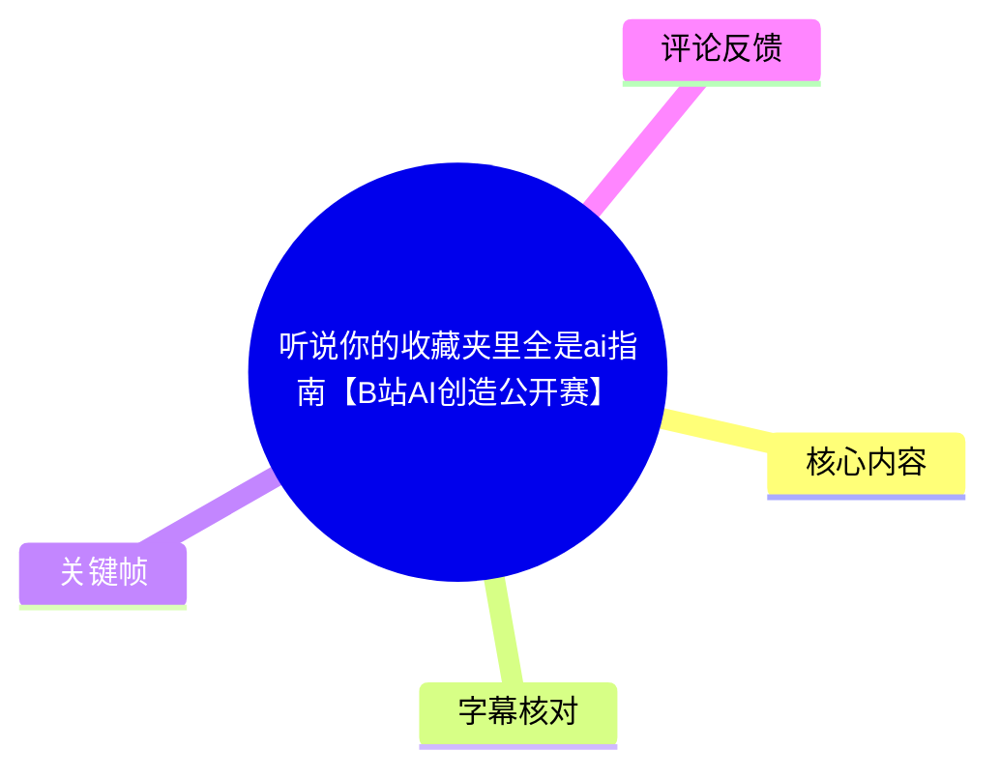
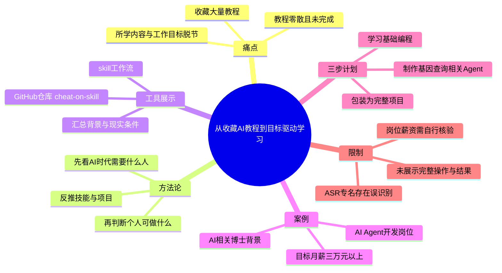

# 听说你的收藏夹里全是ai指南【B站AI创造公开赛】

> 来源：[Bilibili 视频](https://www.bilibili.com/video/BV1vbTP6sEB2) 
> UP 主：他们都叫我蜗牛学长｜视频时长：2 分 10 秒｜竖屏分辨率：2160 × 3840  
> 数据抓取时间：2026-07-21；当时视频数据为 6729 播放、1283 收藏、715 点赞。

## 小结

视频针对“收藏了大量 AI 教程却没有真正学习”的问题，提出一种以职业目标为起点的学习路径：先判断 AI 时代所需岗位和个人可匹配方向，再反推需要学习的技能与项目，而不是在信息流中零散地消费教程。

UP 主以自己“AI 相关博士背景”为例，称自己也难以直接判断可在 AI 时代从事什么具体工作。因此，他将个人背景信息交给一个名为“skill”的工具/工作流处理；视频画面展示了 GitHub 仓库 `XBuilderLAB/cheat-on-skill`，热评亦给出同一仓库链接。该工具被描述为可结合求职网站岗位信息、薪资预期、可投入时间等条件，推荐职业方向并产出学习计划。

案例中的目标是 AI Agent 开发相关岗位，薪资预期为月薪 3 万元以上。视频称工具据此找到一个可能达到该薪资范围的岗位，并将学习路径拆分为三个阶段：先做一个基因查询相关 Agent（具体名称 ASR 识别不清）、学习基础编程技能、再把成果包装成完整项目。

这是一段经验分享与工具展示，而非对岗位真实性、薪资可得性或学习结果的独立验证。视频没有展示实际输入表单、完整提示词、岗位链接、项目代码、学习周期长度或最终求职结果；因此，最可迁移的是“从目标岗位反推能力与作品”的框架，而不是将视频中的岗位和薪资承诺视为普遍结论。

内容具有时效性：岗位市场、招聘站点数据、GitHub 仓库内容及工具功能都可能变化。元数据显示视频发布于 2026 年 6 月，数据抓取于 2026 年 7 月；使用前应自行核验仓库可访问性、工具权限、招聘信息来源及岗位有效期。

## 思维导图

## 目录

- [问题：AI 教程收藏与学习脱节](#问题ai-教程收藏与学习脱节)
- [核心方法：从岗位反推学习内容](#核心方法从岗位反推学习内容)
- [案例：背景、目标岗位与薪资筛选](#案例背景目标岗位与薪资筛选)
- [实践路径：三步学习计划与记录方式](#实践路径三步学习计划与记录方式)
- [关键帧](#关键帧)
- [结论、限制与时效性](#结论限制与时效性)
- [字幕比对](#字幕比对)
- [评论分析](#评论分析)
- [处理记录](#处理记录)

## 问题：AI 教程收藏与学习脱节 [00:00:32](https://www.bilibili.com/video/BV1vbTP6sEB2?t=32)

ASR 从 00:00:32,260 开始识别到连续语音。UP 主以提问切入：观众是否收藏了许多 AI 视频，却一个也没有看；并以“不是你的问题，是我的问题”为转折，称自己没有更早做出这个用于组织学习的工具/工作流。

他强调，自己作为开发和学习 AI 相关内容的人，收藏夹中也有很多 AI 学习教学视频，但“一个都没看过”。这构成视频的核心问题定义：

1. **信息过载**：AI 教程持续由信息流推送，容易不断收藏、不断切换主题。
2. **知识碎片化**：修图、视频制作、科研等不同方向的教程被混合学习，彼此未必形成能力链路。
3. **目标错配**：若本人从事营销，却随意学习修图、视频、科研相关 AI 内容，可能无法直接服务职业目标。
4. **行动缺口**：收藏行为不等于完成学习，也不等于形成作品或求职能力。

> 图：画面字幕出现“教学的视频”，对应视频对“收藏大量 AI 教学内容”的开场提问。其价值在于明确视频批评的并非学习 AI 本身，而是无目标地积累教程。

> 图：字幕为“怪我没有早点开发出来这个skill啊”。该帧直接支持视频存在一个名为“skill”的解决方案叙述；但画面未展示其完整产品定义，不能据此推断具体实现机制。

## 核心方法：从岗位反推学习内容 [00:00:32](https://www.bilibili.com/video/BV1vbTP6sEB2?t=32)

UP 主给出的明确方法论是：**先看 AI 时代需要什么样的人，再倒推自己应该学习什么。**

这与视频否定的路径形成对照：

| 维度 | 视频不建议的路径 | 视频提倡的路径 |
| --- | --- | --- |
| 起点 | 信息流中的单个 AI 教程 | 目标岗位与社会需求 |
| 学习内容 | 看见什么就学什么 | 按目标岗位倒推 |
| 内容组织 | 修图、视频、科研等零散并列 | 技能、作品与岗位要求相互连接 |
| 结果导向 | 收藏或观看 | 可执行学习计划、项目与求职准备 |

视频中的“反推”至少包含以下逻辑链条：

1. 输入个人背景与现实条件；
2. 判断该背景在 AI 相关岗位中可能对应的方向；
3. 结合薪资预期筛选岗位；
4. 根据目标岗位所需能力制定学习周期与每日投入安排；
5. 将学习落到项目上，并将项目包装为可呈现的成果。

需要注意，视频是在介绍其工具的使用体验，未提供该方法背后的岗位数据处理规则、推荐算法、数据更新频率、筛选条件权重或隐私处理方式。因此，它适合作为学习规划的思路，而不能从素材中推导出工具推荐必然准确。

> 图：字幕显示“结果我一个我都没有看过”，强化了“收藏≠学习完成”的经验判断。该帧适合用于理解视频为何要从内容消费转向任务驱动。

> 图：画面可见 GitHub 页面中的 `XBuilderLAB / cheat-on-skill` 与仓库名 `cheat-on-skill`。这是素材中对工具来源最明确的可视证据；它只证明视频展示了该仓库，不能单凭画面判断仓库代码质量、当前维护状态或使用安全性。

## 案例：背景、目标岗位与薪资筛选 [00:00:56](https://www.bilibili.com/video/BV1vbTP6sEB2?t=56)

UP 主用自身经历演示该工作流的输入与输出关系。

### 1. 输入：个人背景

他称自己拥有“AI 相关博士”背景；ASR 将原话识别为“AFI BIOS 的博士的背景”，该专有表述明显不稳定，无法仅据现有素材准确还原其具体学科或项目名称。可以确认的是：UP 主认为即便已有 AI 相关高学历背景，也未必能直接判断自己在 AI 时代适合什么具体职业。

### 2. 岗位推荐：AI Agent 开发

视频称，在向工具提供信息后，工具会到“BOSS 直聘”查询/抓取岗位信息，并推荐一个 AI Agent 开发相关岗位。ASR 原文识别为“BOSS直频”“要起AI agent的开发岗”，其中“BOSS 直聘”可依据常见平台名称进行上下文校正；“AI Agent 开发岗”是对 ASR 语义的保守整理。

UP 主表达了对该岗位的个人认可：如果自己真的找工作，会想找该工作。这是其主观评价，并不等同于岗位已经核验、可投递或适合所有拥有类似背景的人。

### 3. 薪资约束：月薪 3 万元以上

视频给出的明确量化条件是：UP 主希望月薪在 **3 万元以上**。他称工具找到了一个“可能”为数不多能达到这个薪资水平的工作岗位。

这里应区分三个层面：

- **视频陈述**：该岗位可能达到月薪 3 万元以上；
- **未展示的证据**：具体岗位名称、城市、岗位链接、薪资结构、税前税后口径、经验要求及招聘状态；
- **应有判断**：薪资信息通常受地点、公司、年限、面试能力和市场周期影响，不能由单一视频案例外推。

## 实践路径：三步学习计划与记录方式 [00:01:20](https://www.bilibili.com/video/BV1vbTP6sEB2?t=80)

视频称，该工具不仅推荐岗位，还会继续询问现实情况，为学习计划提供约束条件，包括：

- 大致学习周期；
- 每天可投入的时间；
- 个人现实情况；
- 目标岗位及其可能的薪资范围。

在这些条件基础上，工具会安排“详细计划”。根据 00:01:20,640 至 00:02:09,100 的 ASR，案例中的三步计划如下。

### 第一步：完成一个基因查询相关的 AI Agent [00:01:20](https://www.bilibili.com/video/BV1vbTP6sEB2?t=80)

ASR 将项目名称识别为“总流基因便宜查询在你这个 Agent”，语义不稳定，无法可靠确定其规范名称。可确认的最小事实是：第一步是先做一个**与基因查询有关的 AI Agent 项目**。

这一安排体现了视频的项目优先取向：不是先无限扩展教程清单，而是先将目标落为一个可做的 Agent。由于未展示项目需求、数据源、技术栈、评测标准、代码仓库或部署方式，不能补写为具体的生物信息学应用方案。

### 第二步：补齐基础编程技能 [00:01:44](https://www.bilibili.com/video/BV1vbTP6sEB2?t=104)

第二步是“把基础编程技能学会”。视频没有列出语言、框架、课程、版本、练习量或验收要求。因此，该步骤只能被理解为围绕第一步项目所需的基础开发能力补齐，而非一份完整的编程课程建议。

### 第三步：包装为完整项目 [00:01:44](https://www.bilibili.com/video/BV1vbTP6sEB2?t=104)

第三步是把此前成果“包装成一个完整的……项目”。ASR 在“案例/项目”等词上存在混淆，但“完整项目”是语义明确的部分。

视频的职业导向在此处更加清楚：学习输出不应只停留在零散技能，而应形成可对外展示、可用于求职的项目。视频未说明“包装”具体应包含 README、演示视频、部署链接、简历描述、作品集页面或面试材料中的哪些内容，实践者需要根据岗位要求自行补全。

### 视频建议的执行闭环

按视频表述，可将其执行流程整理为：

1. **汇总个人信息**：写清已有背景、想转向的方向、目标薪资、可用时间。
2. **确定目标岗位**：用岗位需求而不是短视频信息流作为筛选基准。
3. **生成阶段计划**：明确学习周期与每日投入，避免只有“想学”而没有时间边界。
4. **先做目标项目**：以项目暴露真正欠缺的能力。
5. **补齐必要基础**：围绕项目需求学习编程与相关技能。
6. **形成求职可用成果**：将项目整理为完整作品，而非只保留学习记录。
7. **在同一工作区记录与复盘**：UP 主称所有内容可在同一个 skill/工作夹中完成、记录和回溯。

最后一点是视频的组织主张：将目标、计划、学习过程和复盘放在同一工作空间中，以减少多平台收藏造成的断裂。不过，视频没有展示该工作空间的界面或数据结构，无法确认其具体记录形式与导出能力。

## 关键帧

本次正文选用 4 张有明确文字或界面信息的关键帧，避免依据未提供时间标记的画面强行推定精确出现时刻。

| 关键帧 | 画面信息 | 正文价值 |
| --- | --- | --- |
| `frames/frame-001.jpg` | “教学的视频”字幕与 UP 主出镜 | 对应开场的教程收藏痛点。 |
| `frames/frame-002.jpg` | “怪我没有早点开发出来这个skill啊” | 证明视频将 skill 描述为解决方案。 |
| `frames/frame-003.jpg` | “结果我一个我都没有看过” | 支撑“收藏不等于完成学习”的核心判断。 |
| `frames/frame-004.jpg` | GitHub：`XBuilderLAB/cheat-on-skill` | 提供仓库名的可见画面证据，便于读者核验评论补充链接。 |

## 结论、限制与时效性 [00:01:44](https://www.bilibili.com/video/BV1vbTP6sEB2?t=104)

视频最有价值的经验是把 AI 学习从“内容消费”改造成“职业目标—岗位要求—学习计划—项目成果”的闭环。对于收藏夹里积累了大量 AI 教程、却难以决定先学什么的人，这一框架可用于压缩选择范围：先选目标，再选择性学习。

但视频的结论应在以下限制下使用：

1. **案例仅代表 UP 主个人背景与判断**：AI 相关博士背景、目标岗位和月薪 3 万元以上的条件，不具备普适性。
2. **岗位信息没有被完整展示**：缺少岗位链接、地域、公司、职责、经验要求与更新时间，无法独立验证。
3. **薪资不构成承诺**：视频使用了“可能”达到月薪 3 万元以上的表达；实际薪资取决于多项现实条件。
4. **工具细节不足**：未展示输入字段、隐私保护、数据抓取授权、生成质量、费用、开源协议或运行步骤。
5. **项目第一步名称不清**：ASR 对基因查询 Agent 的具体名称出现明显识别错误，不能据此编造项目功能。
6. **仓库与平台均可能变化**：评论提供的 GitHub 地址及视频提及的招聘平台，应在使用时重新确认可访问性、内容版本和数据合规性。
7. **视频时长有限**：全片仅 130 秒，属于方向性展示，不应替代职业咨询、技能训练或招聘信息核验。

## 字幕比对

| 字幕来源 | 完整性 | 专有名词 | 时间轴 | 主要问题 |
| --- | --- | --- | --- | --- |
| Bilibili 站内字幕 | 未提供可用字幕 | 无法评估 | 无法使用 | 素材记录显示字幕工具因 `Invalid URL` 退出，未取得站内字幕。 |
| 本次 ASR 字幕 | 覆盖 32.26–129.10 秒；诊断语音覆盖率 74.81% | 多处不稳定 | 可用，提供 5 段 SRT 时间范围 | 开场至 32.26 秒无识别文本；存在长句合并、同音词和专名误识别。 |

### 最终字幕选择

正文以**本次 ASR 的带时间戳 SRT**作为时间轴依据，所有章节时间链接均由其真实起止时间换算而来；没有采用按文字顺序猜测的时间点。

ASR 诊断未标记 `noAudioStream=true`，且检测到约 96.84 秒语音，说明素材存在音轨；不存在“源视频无音轨”这一情况。虽然站内字幕未能获取，但本次 ASR 已完成检查并可用于时间定位。

### 重要校正与保留项

- **`skill` / `scale`**：ASR 多次写作“scale”，但关键帧字幕清晰显示“skill”，故正文优先使用 `skill`；画面中的仓库名为 `cheat-on-skill`。
- **GitHub 仓库**：关键帧展示 `XBuilderLAB/cheat-on-skill`；热评第一条给出链接 `https://github.com/XBuilderLAB/cheat-on-skill`。正文将其作为“视频画面和评论均提及的链接”，未额外验证其当前内容。
- **“BOSS直频”**：ASR 结果存在同音误识别；正文以常见平台名“BOSS 直聘”做语义校正，并明确原始识别不稳定。
- **“AFI BIOS”**：无法仅凭 ASR 还原，正文仅保留“AI 相关博士背景”的可确认语义。
- **基因查询 Agent 名称**：ASR 文本不清，未强行还原为特定产品或技术方案。

## 评论分析

以下仅处理本次可获取的热评前三条，评论属于用户观点或补充信息，不视为已经独立验证的事实。

### 1. 普通的-易辰p（44 赞）

评论指出视频中已展示 GitHub 仓库名，建议观众自行在浏览器或 GitHub 搜索，而非重复在评论区索要资源；其附上链接：

<https://github.com/XBuilderLAB/cheat-on-skill>

这条评论与关键帧中的 `XBuilderLAB / cheat-on-skill` 画面一致，因此可作为仓库地址的交叉线索。其局限是评论未说明仓库版本、安装方式、用途范围、许可证或安全性，仍需读者自行检查。

### 2. 提莫灬料理（4 赞）

评论称其 GitHub 下载速度很慢，并询问是否有人能提供“加速器”。这补充了实际获取开源资源时可能遇到的网络访问问题，但没有提供具体可用方案，也未说明所在网络环境。该问题属于个人网络体验，不能外推为仓库不可用或工具无法运行。

### 3. 不穿衣服的祢老弟（2 赞）

“进收藏夹吧你”是对视频主题的调侃，呼应“收藏许多 AI 指南却不学习”的痛点。它没有提供新的技术或工具信息，但反映出观众注意到视频自身可能再次成为“被收藏而未实践”的内容。

## 处理记录

- Worker ID：`worker-mrj0www4-e8d79408`
- 模型：`gpt-5.6-terra`
- 使用素材与工具结果：视频元数据、关键帧清单与已提供关键帧画面、ASR 诊断、ASR SRT、热评 JSON；站内字幕获取流程曾返回 `Invalid URL`，因此未取得可用站内字幕。
- 字幕选择：未提供站内字幕；已检查本次 ASR，采用其 5 个带时间戳分段作为正文时间轴依据，并以关键帧校正 `skill` 与 GitHub 仓库名。
- ASR 状态：识别语言为中文，置信度 `0.99462890625`，模型为 `medium`，CUDA / float16；音频时长 `129.45125` 秒，ASR 语音覆盖率 `0.7481`，未见 `noAudioStream=true` 标记。
- 关键帧选择依据：优先选择含可读字幕或明确界面信息的 `frame-001` 至 `frame-004`；未对没有提供精确帧时间戳的图片附会具体秒数。
- 评论范围：仅分析可获取热评前三条，未扩展到其他评论。
- 缓存清理：提供的素材中没有缓存清理执行日志，无法核验是否执行，故不虚构清理结果。
- 未解决问题：`skill` 的完整功能、运行方式、数据来源和当前仓库状态未在视频素材中完整展示；基因查询 Agent 的精确项目名称受 ASR 误识别影响，无法可靠还原。
