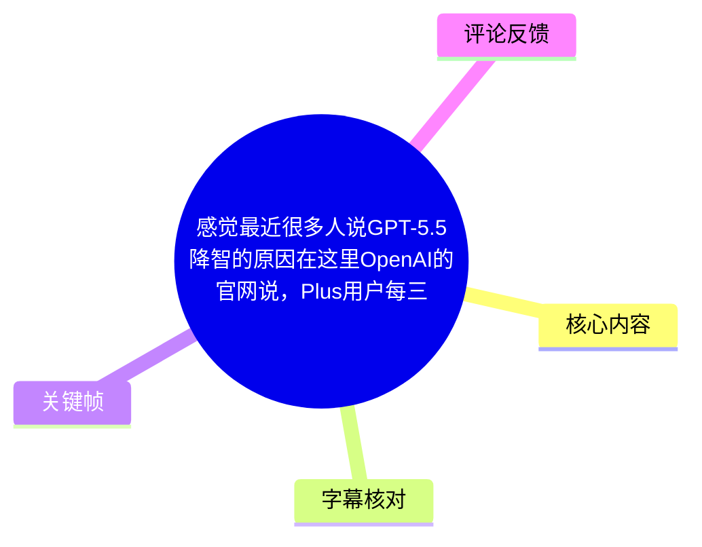
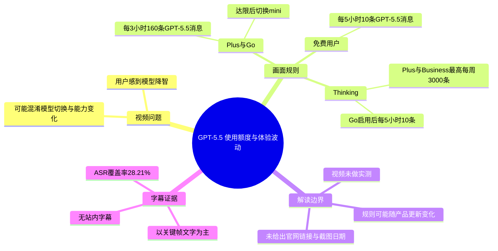
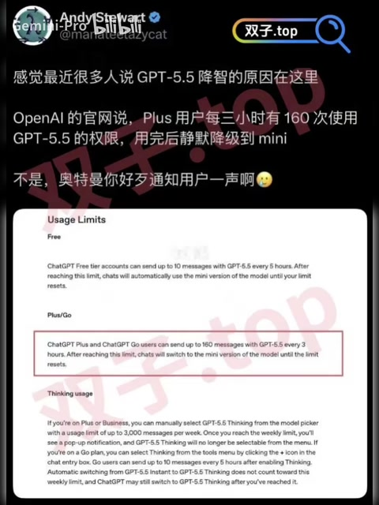
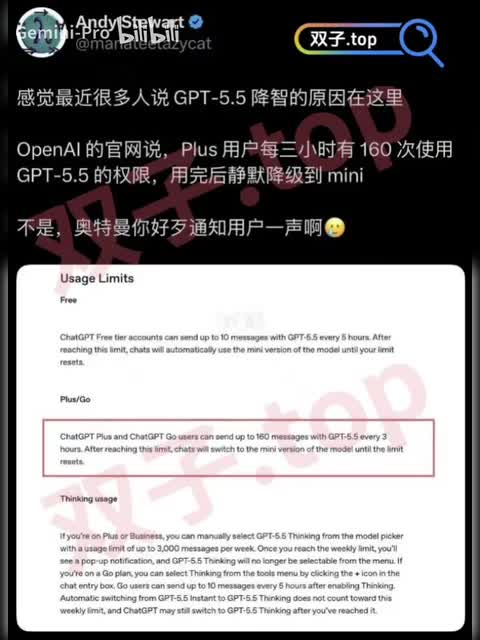

## 小结

这是一则约 12 秒的图文式短视频，讨论“近期有人感觉 GPT-5.5 降智”可能与模型用量上限和自动切换有关。视频核心依据是一张标为 **Usage Limits** 的英文规则截图，而非演示实际对话效果。

画面中重点标注：**ChatGPT Plus 和 ChatGPT Go 用户每 3 小时最多可向 GPT-5.5 发送 160 条消息**；达到限制后，聊天会**自动切换至该模型的 mini 版本，直至限制重置**。视频文案据此提出疑问：这种切换是否会在未显著提醒用户的情况下发生，从而让用户把不同模型的表现差异理解为“GPT-5.5 降智”。

截图还显示了免费用户和 Thinking 使用的不同限制：免费用户在 GPT-5.5 上限为每 5 小时 10 条；Plus/Business 的 GPT-5.5 Thinking 被描述为最高每周 3,000 条，并有独立的可选性与通知规则。应注意，这些内容均来自视频展示的规则截图，未提供官网链接、截图抓取时间或实际产品测试过程。

本次 ASR 虽检测到音轨，但只识别出“世界曾”“遇也曾遭遇”等不成句片段，语音覆盖率仅 28.21%，无法支撑正文事实整理。因此，本文以画面中的中文文案和英文规则截图为主要材料，并将 ASR 结果单独记录为低可用性字幕。

适合关注 ChatGPT 套餐配额、模型路由、模型体验波动，以及希望在日常使用中区分“模型降级”和“模型能力变化”的读者阅读。该内容具有较强时效性：产品命名、套餐权益、消息额度与自动路由规则均可能调整，不能将视频截图直接视为长期有效的官方政策。

## 思维导图

## 目录

- [视频信息与问题背景](#视频信息与问题背景)
- [画面展示的用量规则](#画面展示的用量规则)
  - [Plus/Go：160 条 / 3 小时及 mini 切换](#plusgo160-条--3-小时及-mini-切换)
  - [免费用户与 Thinking 相关限制](#免费用户与-thinking-相关限制)
- [如何理解“降智”反馈](#如何理解降智反馈)
- [使用中的核查步骤](#使用中的核查步骤)
- [关键帧解读](#关键帧解读)
- [结论、限制与时效性](#结论限制与时效性)
- [字幕比对](#字幕比对)
- [评论分析](#评论分析)
- [处理记录](#处理记录)

## 视频信息与问题背景 [00:00:02](https://www.bilibili.com/video/BV1pgG26KEj4?t=2)

- **视频标题**：感觉最近很多人说GPT-5.5降智的原因在这里OpenAI的官网说，Plus用户每三小时有160次使用GPT-5.5的权限，用完后静默降级到mini不是
- **UP 主**：Gemini-Pro
- **合集**：AIcode
- **时长**：12 秒
- **画面规格**：720 × 960，竖屏
- **来源**：[Bilibili：BV1pgG26KEj4](https://www.bilibili.com/video/BV1pgG26KEj4)
- **元数据发布时间**：Unix 时间戳 `1779890915`（对应时间应以平台页面显示为准）
- **素材抓取时间**：2026-07-16

视频开头的中文文案写道：“感觉最近很多人说 GPT-5.5 降智的原因在这里”。随后以“OpenAI 的官网说”为引导，展示一张英文的 **Usage Limits（使用限制）** 页面截图。

这里需要区分三个层次：

1. **视频陈述**：近期有用户认为 GPT-5.5 表现“降智”。
2. **视频展示的规则证据**：不同套餐存在消息额度；达到某些额度后，会切换至 mini 版本。
3. **尚未被视频证明的因果关系**：视频没有展示某位用户在额度耗尽前后的同一任务对比，因此不能仅凭截图确认所有“降智”反馈都由自动切换导致。

## 画面展示的用量规则 [00:00:07](https://www.bilibili.com/video/BV1pgG26KEj4?t=7)

### Plus/Go：160 条 / 3 小时及 mini 切换 [00:00:07](https://www.bilibili.com/video/BV1pgG26KEj4?t=7)

画面截图中以红框突出了一段英文规则，内容可整理为：

> ChatGPT Plus 和 ChatGPT Go 用户，在每个 3 小时周期内最多可使用 GPT-5.5 发送 160 条消息。达到此限制后，聊天会切换到该模型的 mini 版本，直至限制重置。

对应的关键参数如下：

| 项目 | 画面所示内容 |
| --- | --- |
| 适用套餐 | ChatGPT Plus、ChatGPT Go |
| 指定模型 | GPT-5.5 |
| 使用上限 | 每 3 小时 160 条消息 |
| 达限后行为 | 聊天切换到该模型的 mini 版本 |
| 恢复条件 | 等待使用限制重置 |

视频的中文叠字进一步强调“用完后静默降级到 mini 不是，奥特曼你好歹通知用户一声啊”，其表达的是发布者对提示机制的质疑。需要谨慎的是：

- 截图英文原文明确写有“will switch to the mini version”，即会切换到 mini；
- 但截图本身**没有完整说明普通 GPT-5.5 聊天切换时界面是否会以何种方式提醒用户**；
- 因此，“静默降级”是视频作者的解释或批评，不应直接改写为已被截图完全证实的产品行为细节。

> 图：画面中央展示 Usage Limits 页面，红框标出 Plus/Go 用户“每 3 小时 160 条 GPT-5.5 消息”以及达限后切换 mini 版本的文字。这是视频最关键的事实依据，可用于理解其“体验变化可能来自模型切换”的论点。

### 免费用户与 Thinking 相关限制 [00:00:07](https://www.bilibili.com/video/BV1pgG26KEj4?t=7)

除 Plus/Go 的红框内容外，截图中还能辨认出其他套餐和 Thinking 相关规则。由于截图分辨率有限，以下仅记录可辨识的文字，不补充截图外的政策解释。

| 分类 | 画面文字所示规则 |
| --- | --- |
| Free | 免费账户每 5 小时最多可向 GPT-5.5 发送 10 条消息；达到上限后，聊天将自动使用 mini 版本，直至额度重置。 |
| Plus/Go | 每 3 小时最多 160 条 GPT-5.5 消息；达到上限后切换 mini 版本。 |
| Plus/Business Thinking | 可从模型选择器手动选择 GPT-5.5 Thinking；使用限制最高为每周 3,000 条消息。 |
| Thinking 周额度耗尽 | 截图称达到每周限制后会弹出通知，且 GPT-5.5 Thinking 将不能再从菜单中选择。 |
| Go Thinking | 截图称 Go 用户可通过聊天输入框旁的“+”图标，在工具菜单中选择 Thinking；启用后每 5 小时最多发送 10 条消息。 |
| 自动切换至 Thinking | 截图称，从 GPT-5.5 Instant 自动切换到 GPT-5.5 Thinking 不计入上述每周限制；即使达到该限制，ChatGPT 仍可能切换到 GPT-5.5 Thinking。 |

其中，**普通 GPT-5.5、mini、GPT-5.5 Instant 与 GPT-5.5 Thinking 并非同一名称**。视频只展示了额度规则，没有解释这些模式之间的具体能力、延迟、价格或路由条件。因此，不能由“切至 mini”直接推导出所有任务上的质量差异幅度。

> 图：该帧保留了截图中的 Free、Plus/Go、Thinking 三个分区，说明视频讨论的并不只是“160 条 / 3 小时”，还涉及不同套餐、普通模型与 Thinking 模式的分层额度。它有助于避免把所有限制混为一条规则。

## 如何理解“降智”反馈 [00:00:07](https://www.bilibili.com/video/BV1pgG26KEj4?t=7)

视频提出的是一个**可能的解释路径**：

1. 用户在 Plus 或 Go 账户中连续使用 GPT-5.5；
2. 在某个 3 小时窗口内累计达到画面所示的 160 条消息；
3. 系统根据截图规则转而使用 mini 版本，直至窗口重置；
4. 用户若没有清楚识别当前实际模型，可能把后续输出差异概括成“GPT-5.5 降智”。

这一推理具备一定合理性，但它仍是待验证假设。视频没有提供下列关键证据：

- 用户实际消息计数与达到额度的时刻；
- 切换前后模型标识、界面状态或系统提示；
- 使用相同提示词、相同工具权限、相同上下文长度进行的对照；
- 网络、服务端负载、上下文压缩、工具调用失败等其他变量的排除过程；
- “mini”与原模型在具体任务上的能力测试数据。

因此，更准确的表述应是：

> **视频展示的规则说明，额度耗尽后的模型切换可能是部分体验波动的候选原因；它不能单独证明 GPT-5.5 本身发生了普遍、持续或全局性的能力下降。**

> 图：该帧同时呈现“很多人说 GPT-5.5 降智”的问题设定，以及对额度用尽后切换 mini 的质疑。它体现的是视频作者的观点框架，不是模型能力下降的实测证据。

## 使用中的核查步骤 [00:00:07](https://www.bilibili.com/video/BV1pgG26KEj4?t=7)

视频没有演示操作流程。基于画面中明确出现的额度与模型切换信息，若用户想判断自身体验变化是否与额度有关，可采用以下**核查思路**；这不是视频直接提供的官方操作说明。

1. **确认当前套餐与模型入口**
   - 先区分自己使用的是 Free、Plus、Go、Business 中的哪一种账户。
   - 查看当前会话中显示的模型名称，避免把普通 GPT-5.5、mini、Instant 与 Thinking 视为同一模型。

2. **记录消息频率与时间窗口**
   - 对照视频截图中的口径，Plus/Go 的普通 GPT-5.5 关注“每 3 小时 160 条”。
   - 免费账户关注“每 5 小时 10 条”。
   - 若涉及 Thinking，应另外关注截图中“每周最高 3,000 条”及 Go 用户“启用后每 5 小时 10 条”的描述。
   - 不应只按自然日统计，因为视频截图写的是滚动时间窗口和每周额度。

3. **在感到输出变化时留存会话证据**
   - 记录当前模型标签、时间、已发送消息的大致数量，以及是否出现套餐或模型提示。
   - 保留切换前后的相同或高度相似任务，便于排除“提示词不同”造成的主观差异。

4. **做最小对照测试**
   - 在确认模型标识的前提下，用相同提示词、相同附件、相近上下文长度测试。
   - 分别记录回答质量、响应速度、工具可用性和推理过程是否可选。
   - 若仅凭一次回答质量变化下结论，容易受到上下文、任务随机性及服务状态影响。

5. **以当期官方页面为最终依据**
   - 视频中的截图没有提供可点击的官网地址、地区信息或抓取日期。
   - 实际使用时应以账户内显示的限制和当期 OpenAI 官方帮助文档为准；若规则不同，不应以本视频的截图覆盖当前账户提示。

## 关键帧解读 [00:00:02](https://www.bilibili.com/video/BV1pgG26KEj4?t=2)

本视频提供的 12 张关键帧画面内容高度一致：均为黑色背景的中文标题叠字，加上一张 Usage Limits 规则截图。正文选取以下帧，而未重复插入近似画面。

| 关键帧 | 用途 | 选择价值 |
| --- | --- | --- |
| `frames/frame-001.jpg` | 呈现视频问题与作者立场 | 同时包含“GPT-5.5 降智”话题和对降至 mini 的质疑，适合界定讨论范围。 |
| `frames/frame-004.jpg` | 核对 Plus/Go 核心额度 | 红框最直观地突出“160 条 / 3 小时”及切换 mini 的规则，是正文的主要证据图。 |
| `frames/frame-010.jpg` | 补充套餐与 Thinking 分区 | 可见 Free、Plus/Go、Thinking 等板块，适合说明规则不是单一额度。 |

关键帧可支撑的结论仅限于画面文字：视频确实展示了有关消息额度和模型切换的英文规则。关键帧不能证明截图出处的实时性，也不能代替实际账户状态、官方公告或性能基准测试。

## 结论、限制与时效性 [00:00:07](https://www.bilibili.com/video/BV1pgG26KEj4?t=7)

视频最有价值的信息是：它把“模型能力是否下降”的主观感受，转化为一个可检查的产品机制问题——**用户是否在使用额度达到上限后，被切换至 mini 或其他模式**。

可迁移的经验是，在评价 AI 输出质量前，应优先核实：

- 当前实际运行的模型或模式；
- 套餐对应的消息额度；
- 是否处于滚动时间窗口或周额度限制内；
- 会话是否发生模型路由或模式切换；
- 对比测试是否控制了提示词、上下文和工具条件。

但本视频存在明确限制：

1. **没有实测**：未展示同一任务在 GPT-5.5 与 mini 下的结果比较。
2. **没有原始链接**：画面虽称“OpenAI 官网”，但未提供 URL、页面版本或截图日期。
3. **“静默”未被完整证实**：截图可证明“达到限制后切换 mini”的表述；普通聊天是否无提示、何时提示、如何提示，需以实际界面和官方说明核验。
4. **ASR 不可用**：音轨存在，但识别文本不成句，不能作为视频口述内容的可靠转写。
5. **强时效性**：模型名、套餐、额度、周限制、自动路由和提示方式均可能随产品更新、地区或账户状态变化。

因此，视频适合作为“检查模型额度与路由”的线索，而不应被当作 GPT-5.5 已被证实普遍“降智”的结论。

## 字幕比对 [00:00:02](https://www.bilibili.com/video/BV1pgG26KEj4?t=2)

| 字幕来源 | 完整性 | 专有名词 | 时间轴 | 主要问题 |
| --- | --- | --- | --- | --- |
| Bilibili 站内字幕 | 未提供可用字幕 | 无法核验 | 无 | 素材中未提供可用站内字幕文件。 |
| 本次 ASR 字幕 | 很低 | 识别失败，未识别出 GPT-5.5、OpenAI、Plus、mini 等关键名词 | 有真实分段时间 | 仅有两段不成句文本，语音覆盖率 28.21%，不足以还原视频表达。 |

本次 ASR 的实际结果为：

| 时间段 | ASR 文本 |
| --- | --- |
| 00:00:02,570 → 00:00:04,490 | 世界曾 |
| 00:00:07,050 → 00:00:08,510 | 遇也曾遭遇 |

ASR 诊断信息显示：

- 识别语言：中文（置信度 `0.91552734375`）
- 音频时长：`11.9815` 秒
- 识别模型：`medium`
- 识别到的语音时长：`3.38` 秒
- 语音覆盖率：`0.2821`
- `noAudioStream`：**未标记为 true**；即源视频并非无音轨，而是本次语音识别结果本身不足以形成可靠转写。

### 最终字幕与证据选择

- **站内字幕**：无可用文件，无法采用。
- **本次 ASR**：已检查，但因文本不完整且语义不成立，不作为事实转写依据。
- **正文主要依据**：关键帧中的中文叠字与英文 Usage Limits 截图。
- **多模态校正的重要词语**：`GPT-5.5`、`OpenAI`、`ChatGPT Plus`、`ChatGPT Go`、`mini`、`Thinking`、`160 messages every 3 hours`、`3,000 messages per week`。这些词语来自画面可见文字，不是由 ASR 纠正得出。

## 评论分析 [00:00:07](https://www.bilibili.com/video/BV1pgG26KEj4?t=7)

以下仅处理素材中可获取的热评前三条；评论属于用户观点，不构成已验证事实。

### 1. 末至-_（531 赞）

> “3小时160次日常用用不完吧，他们说的降智应该是codex那边”

- **观点**：认为日常使用者通常不会耗尽“3 小时 160 次”的额度，因此“降智”讨论可能主要指向 Codex 相关场景，而非视频所说的普通 GPT-5.5 用量耗尽。
- **补充价值**：提出了使用场景差异。高频编码、自动化工作流与普通聊天的消息消耗速度可能不同。
- **限制与可信度**：评论没有提供 Codex 的规则、实际账户记录或性能对照，故“应该是 codex 那边”只能视为待验证猜测。

### 2. 月溅星河ovo（505 赞）

> “笑死，Gemini不用都降智[吃瓜]”

- **观点**：以调侃方式批评 Gemini，未直接讨论视频中的 OpenAI 额度规则。
- **补充价值**：反映评论区存在跨模型的情绪化比较与品牌调侃。
- **限制与可信度**：没有提供可核查证据、模型版本、任务样本或测试条件，对本视频论点没有实质补充。

### 3. menelmacar（125 赞）

> “一分钟一条消息，真要用到thinking，他思考回答+你来看也要一分钟了吧[笑哭]没啥影响啊，而且你能这样连续工作学习3个小时，也是很专注了[笑哭]”

- **观点**：按“一分钟一条消息”的主观估算，认为 Thinking 模式下达到高频消息上限不容易，对多数人实际影响有限。
- **补充价值**：提示应将额度放入实际交互节奏评估，而非只看绝对条数。
- **限制与可信度**：这是基于个人使用节奏的估算；短指令、连续迭代、批量代码审查或自动化调用等场景可能显著提高频率，不能据此推广到所有用户。

## 评论分析

- 热评 1：3小时160次日常用用不完吧，他们说的降智应该是codex那边
- 热评 2：笑死，Gemini不用都降智[吃瓜]
- 热评 3：一分钟一条消息，真要用到thinking，他思考回答+你来看也要一分钟了吧[笑哭]没啥影响啊，而且你能这样连续工作学习3个小时，也是很专注了[笑哭]

以上内容是观众反馈摘录，只用于补充理解视频反响，不作为正文事实依据。

## 处理记录

- **Worker ID**：`worker-mrj0wjed-b0c290ad`
- **模型**：`gpt-5.6-terra`
- **调用工具与模型**：素材处理链已提供视频、音频、关键帧、ASR、字幕目录和评论数据；ASR 诊断使用 `medium` 模型，CUDA / `float16`。
- **使用的素材工具输出**：
  - 视频合并文件：`merged.mp4`
  - 音频文件：`audio/audio.wav`
  - 关键帧目录：`frames/`
  - ASR SRT：`asr/transcript.srt`
  - ASR 分段结果：`asr/asr-result.json`
  - 评论文件：`comments/comments.json`
- **字幕选择**：未提供可用 Bilibili 站内字幕；已检查本次 ASR，但其仅产出两段无完整语义的文本、覆盖率 28.21%，故不采用为正文转写。正文以关键帧可见文本为主，并保留 ASR 原始时间段供核查。
- **关键帧选择依据**：`frame-001` 用于呈现视频议题与作者态度；`frame-004` 用于核验 Plus/Go 的 160 条 / 3 小时及 mini 切换规则；`frame-010` 用于补充 Free、Plus/Go、Thinking 的规则分区。其余帧与这些画面高度重复，未重复使用。
- **评论处理范围**：仅分析已提供的热评前三条，未扩展至其他评论。
- **缓存清理**：素材清单未提供缓存清理执行日志或结果；本文不宣称已执行缓存清理。
- **未解决问题**：
  - 无法从素材确认截图对应的官方页面 URL、版本日期、地区与账户条件；
  - 无法由视频确认普通 GPT-5.5 达限切换时是否必然“静默”；
  - 无法从 ASR 还原可靠旁白；
  - 无法依据本视频验证“GPT-5.5 降智”与额度切换之间的实际因果关系。
