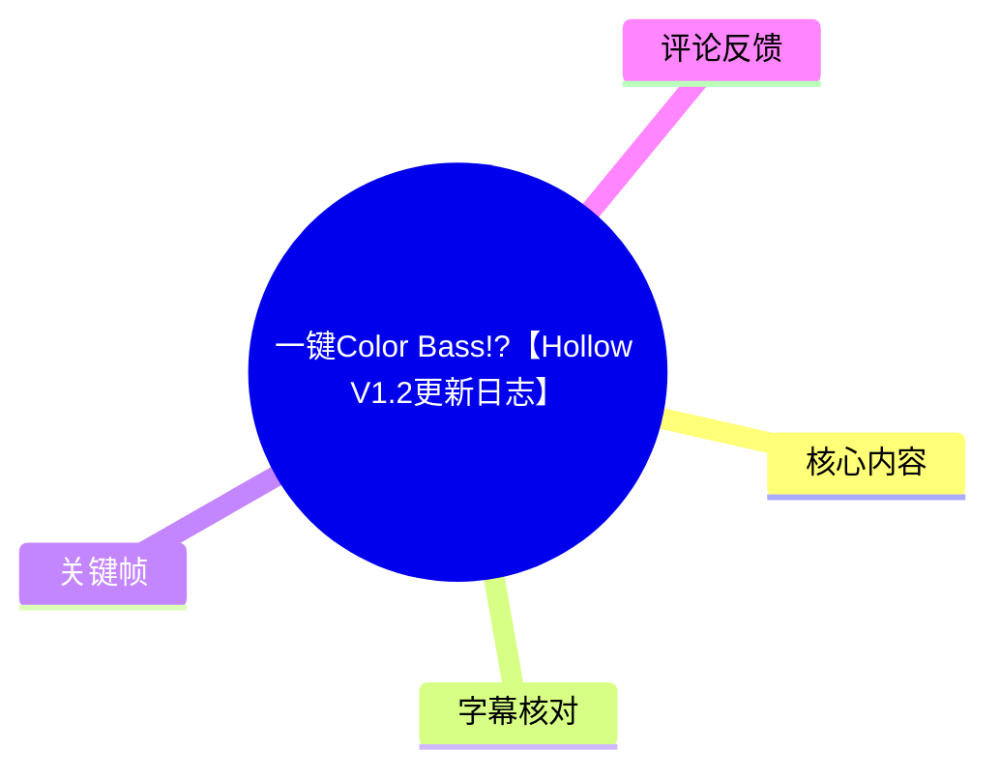
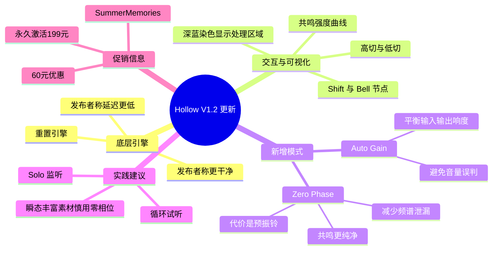
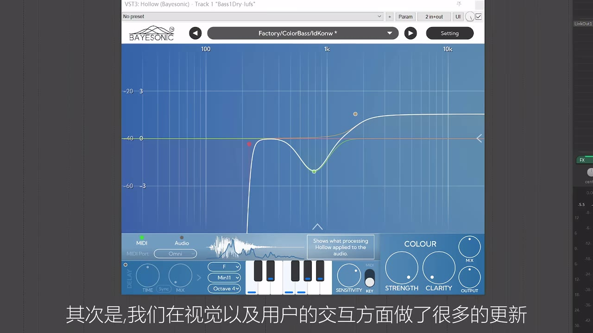
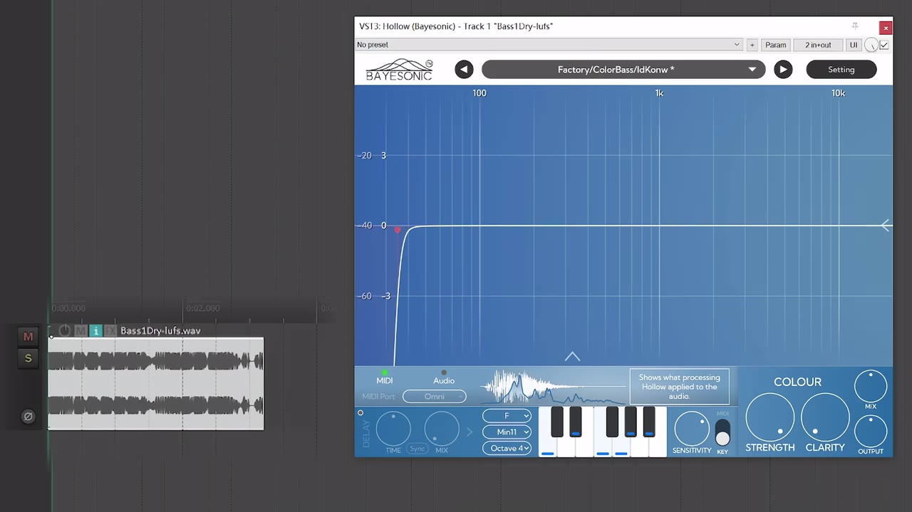
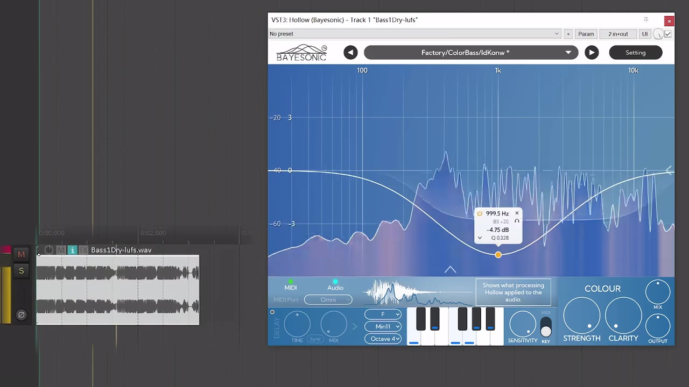
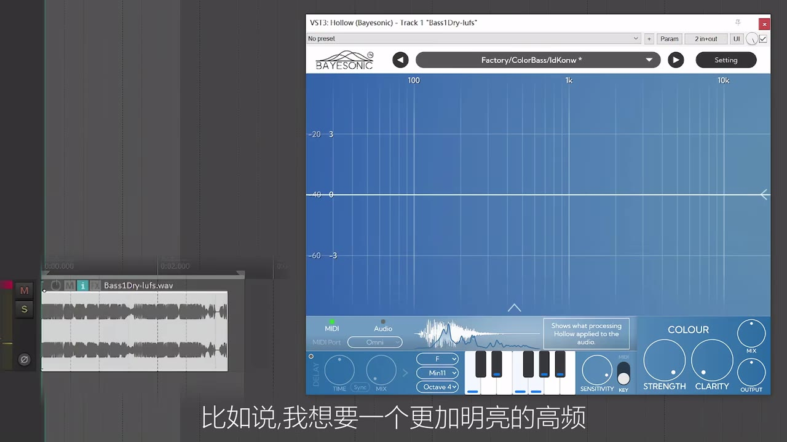

# 一键Color Bass!?【Hollow V1.2更新日志】

> 来源：[Bilibili 视频](https://www.bilibili.com/video/BV1eg3u62EHc) 
> UP 主：Bayesonic｜时长：06:19｜分辨率：3840×2160｜合集：AIcode  
> 视频描述中的活动信息：访问 `bayesonic.com`，使用兑换码 `SummerMemories` 可解锁 60 元专属优惠。

## 小结

这是一支 Bayesonic 对音频插件 **Hollow V1.2** 的更新说明视频。更新重点不在新增一种单独的音色算法，而是同时覆盖底层引擎、频率交互曲线、频谱可视化、响度补偿与零相位处理模式。UP 主称，重置底层引擎后，插件的声音更干净、质感更好且延迟更低；这些属于发布者的产品陈述，视频中没有给出可复现的延迟数值或测量条件。

最直观的工作流变化是：原先的 EQ Response Curve 被改为用于控制**共鸣强度**的曲线。用户可像使用 EQ 一样在两端加入高切、低切，也能在任意频段插入 Shift、Bell 等节点；视频以“让高频更明亮”为例进行演示。界面同时把共鸣响应的结果投射到主显示区域中，以深蓝色染色提示哪些频段正在被共鸣处理，颜色越深代表处理强度越高。

功能层面新增 **Auto Gain** 与 **Zero Phase（零相位）**。Auto Gain 用来自动平衡输入和输出响度，避免音色处理后因音量变化而误判“更好听”，也尽量维持原本的音量平衡。Zero Phase 则被描述为能带来更纯净、频谱泄漏更少的共鸣效果，但代价是预振铃：湿声可能比干声更早出现，使瞬态起音受到影响。

因此，Hollow V1.2 更适合希望在 MIDI／音频驱动的共鸣、着色和频段塑形之间快速调整的音乐制作人。实际使用时应先借助 Solo 与循环试听单独的处理信号，再以 Auto Gain 进行音量匹配；若素材的瞬态很突出，尤其是鼓类，UP 主明确不推荐启用零相位模式。

视频末尾给出当期促销：60 元无门槛优惠券后，永久激活价格为 **199 元**；也可采用视频中称为 “Runtune” 的方式，以 **0.1 元**获得一个月使用权。该价格、兑换方式与活动有效期均属于发布时的商业信息，可能随官网活动变动，应以购买页面为准。

## 思维导图

## 目录

- [更新背景与适用对象](#更新背景与适用对象-0000)
- [底层引擎与共鸣强度曲线](#底层引擎与共鸣强度曲线-0009)
- [屏幕染色：把共鸣响应可视化](#屏幕染色把共鸣响应可视化-0143)
- [Auto Gain：处理前后的响度平衡](#auto-gain处理前后的响度平衡-0220)
- [Zero Phase：更干净的共鸣与预振铃代价](#zero-phase更干净的共鸣与预振铃代价-0347)
- [实际操作流程与参数要点](#实际操作流程与参数要点-0045)
- [价格、活动与时效性](#价格活动与时效性-0546)
- [结论与限制](#结论与限制-0546)
- [字幕比对](#字幕比对)
- [评论分析](#评论分析)
- [处理记录](#处理记录)

## 更新背景与适用对象 [00:00](https://www.bilibili.com/video/BV1eg3u62EHc?t=0)

视频开场说明主题是 Hollow V1.2 的更新内容。根据标题、插件界面和 ASR 上下文，产品名称应为 **Hollow**；ASR 多次误识别为 “Holo”。

[00:09](https://www.bilibili.com/video/BV1eg3u62EHc?t=9) 起，UP 主概括此次更新的两个方向：

1. **底层引擎重置**：发布者称新版更干净、质感更好、延迟更低。
2. **视觉与用户交互更新**：包括曲线操作方式、处理区域提示，以及后文演示的 Auto Gain 和 Zero Phase。

视频是在 DAW 内打开 VST3: Hollow 的界面进行讲解。它面向的不是通用均衡器教学，而是围绕“共鸣”与“着色”处理的插件更新说明；因此，视频展示的曲线与频谱视觉反馈应理解为 Hollow 的特定工作方式，不能直接等同于所有 EQ 或共鸣器的行为。

> 图：该关键帧展示了演示环境和插件总体布局。主频率区域占据界面上半部，下方可见 MIDI、Audio、键盘及 Strength、Clarity、Mix、Output 等控制区，有助于理解后续“曲线”和“屏幕染色”并非独立窗口，而是同一主界面的交互反馈。

## 底层引擎与共鸣强度曲线 [00:09](https://www.bilibili.com/video/BV1eg3u62EHc?t=9)

### 从 EQ Response Curve 改为共鸣强度曲线 [00:33](https://www.bilibili.com/video/BV1eg3u62EHc?t=33)

UP 主称，V1.2 移除了此前的 **EQ Response Curve**，改成控制**共鸣强度**的曲线。此处的核心变化是曲线的语义：它不再主要表达普通 EQ 的增益响应，而用于决定不同频段获得多强的共鸣处理。

从 [00:45](https://www.bilibili.com/video/BV1eg3u62EHc?t=45) 到 [01:04](https://www.bilibili.com/video/BV1eg3u62EHc?t=64)，视频给出的节点操作包括：

- 在曲线左右两端添加**高切／低切**；
- 在任意位置加入 **Shift**、**Bell** 等控制节点；
- 操作方式“跟 EQ 一样”，即通过节点建立目标频段的处理轮廓。

这意味着可以先用两端切除限定参与处理的频率范围，再针对局部频段使用 Bell 或 Shift 类节点塑形。视频没有说明每一种节点的完整算法定义、Q 值边界或可调范围，不能从画面反推其精确内部实现。

> 图：该帧显示曲线左端形成类似低切的陡峭边缘，直观对应“可在左右添加高低切”的说明。它说明曲线可被用于限定参与共鸣的频率带宽。

### Solo 与高频塑形示例 [01:09](https://www.bilibili.com/video/BV1eg3u62EHc?t=69)

[01:09](https://www.bilibili.com/video/BV1eg3u62EHc?t=69) 起，UP 主提示可以对处理结果进行 **Solo**，并打开循环试听；随后在 [01:27](https://www.bilibili.com/video/BV1eg3u62EHc?t=87) 提出目标：“想要一个更加明亮的高频”。

这段演示传达的经验不是“固定使用某个数值”，而是以下听辨流程：

1. 打开素材循环，保证修改前后能反复比较；
2. Solo 处理信号，先辨认共鸣器本身产生了什么；
3. 根据听感目标调整曲线节点，例如提高高频相关区域的处理倾向；
4. 回到完整干湿混合中复听，避免仅在 Solo 状态下做出不适用于整体编曲的决定。

> 图：该帧给出节点编辑的可见例子：节点浮窗中可读取约 `999.5 Hz`、`-4.75 dB`、`Q 0.328`。这是画面中该节点当时的示范值，不是视频宣称的通用推荐参数；其价值在于确认曲线确实支持频率、幅度与 Q 相关的局部编辑。

## 屏幕染色：把共鸣响应可视化 [01:43](https://www.bilibili.com/video/BV1eg3u62EHc?t=103)

[01:43](https://www.bilibili.com/video/BV1eg3u62EHc?t=103) 起，UP 主说明第二项视觉更新：原本的共鸣响应曲线被移动、整合到主屏幕显示中。屏幕上被染成**深蓝色**的区域，表示对应位置正在被共鸣；[02:10](https://www.bilibili.com/video/BV1eg3u62EHc?t=130) 进一步说明，**染色越深，共鸣强度越强**。

这一设计的实际价值在于把“曲线设定”和“当前正在对音频做什么”放到同一个观察区域中：

- 可借频谱与蓝色处理区域判断处理是否集中在预期频段；
- 当局部频段的蓝色明显更深时，说明该处的共鸣处理更强；
- 它是可视化辅助，不应替代耳朵判断；频谱与染色展示的是处理信息，并不自动证明混音结果合适。

> 图：此帧同时可见频谱、白色曲线和蓝色染色区，适合作为“共鸣处理被可视化”的例证。频段着色的面积与深浅让用户能快速定位当前处理的覆盖区域。

## Auto Gain：处理前后的响度平衡 [02:20](https://www.bilibili.com/video/BV1eg3u62EHc?t=140)

[02:20](https://www.bilibili.com/video/BV1eg3u62EHc?t=140) 起，视频宣布两个较大的功能更新：**Zero Phase** 与 **Auto Gain**。UP 主先演示 Auto Gain。

### Auto Gain 的作用 [02:31](https://www.bilibili.com/video/BV1eg3u62EHc?t=151)

Auto Gain 被定义为自动平衡输入与输出的响度。演示中，UP 主打开一个名称经 ASR 误识别的限制器／响度监看插件，用于对比处理后与原始音频的响度。可确认的结论是：

- 开启 Auto Gain 后，处理后输出与原始音频的响度“大差不差”；
- [03:35](https://www.bilibili.com/video/BV1eg3u62EHc?t=215) 关闭 Auto Gain 后，响度明显变大；
- [03:39](https://www.bilibili.com/video/BV1eg3u62EHc?t=219) UP 主明确指出，此功能可避免音色处理破坏原本的音量平衡。

ASR 在 [03:02](https://www.bilibili.com/video/BV1eg3u62EHc?t=182) 将响度读数转写为 “-14/-15 左右”，而在原始音频读数处出现 “-4/-13” 的不连贯结果。由于没有站内字幕可交叉校验，本文不把后一组具体数字当作可靠参数；可保留的事实是视频进行了响度对照，并主张 Auto Gain 能让前后响度接近。

### 使用意义与边界

Auto Gain 特别适合 A/B 比较。人耳通常会把更响的信号误认为更好，因此处理前后若不做音量匹配，很难只评价“音色变化”。不过，自动匹配并不表示：

- 峰值、短时响度、综合响度都会完全一致；
- 插件不会改变动态、瞬态或频谱；
- 所有后级限制器、母线处理和自动化场景中都无需再次检查电平。

应把它视作减少主观响度偏差的便利工具，而非最终响度管理的替代品。

## Zero Phase：更干净的共鸣与预振铃代价 [03:47](https://www.bilibili.com/video/BV1eg3u62EHc?t=227)

### 声音收益：更纯净、较少频谱泄漏 [03:52](https://www.bilibili.com/video/BV1eg3u62EHc?t=232)

[03:47](https://www.bilibili.com/video/BV1eg3u62EHc?t=227) 起，UP 主转入 Zero Phase。其说明是：零相位模式会得到“更加纯净、更加干净的共鸣”，但存在代价。

演示将 **Mix 调至 100%**，先听纯湿声，然后比较 Zero Phase 与自然相位／常规相位状态。到 [04:20](https://www.bilibili.com/video/BV1eg3u62EHc?t=260)，UP 主指出常规状态存在较多“频谱泄漏”；[04:27](https://www.bilibili.com/video/BV1eg3u62EHc?t=267) 总结为零相位明显更干净。

> 图：该帧用于定位试听时的主控制区，尤其是右侧的 Mix 旋钮。视频在零相位对照中明确将 Mix 调到 100%，以单独检查湿声；这张画面有助于理解为何该段的听感比较不是完整混合状态。

### 代价：预振铃与瞬态受损 [04:33](https://www.bilibili.com/video/BV1eg3u62EHc?t=273)

UP 主对 Zero Phase 的限制描述得很明确：

- 会出现**预振铃**；
- 具体表现为：湿声会比干声**提前一点点**出现；
- 在干湿混合时，提前出现的湿声可能破坏瞬态的起音／“音头”；
- [05:09](https://www.bilibili.com/video/BV1eg3u62EHc?t=309) 的试听说明，零相位下的瞬态听起来会有所不同，原因正是湿声提前。

这不是“零相位必然更好”的模式。视频给出的选择原则如下：

| 素材／目标 | 建议 |
| --- | --- |
| 瞬态不丰富的素材 | 可考虑 Zero Phase，以获得更干净的共鸣效果。 |
| 喜欢湿声略微提前的听感 | 可把这种预振铃视为一种可选效果。 |
| 瞬态强、起音重要的素材 | 谨慎使用。 |
| 鼓等瞬态较突出的素材 | UP 主明确不推荐使用 Zero Phase。 |

需要注意，预振铃的可感知程度还会受到处理强度、Mix 比例、素材类型、监听系统和编曲掩蔽影响。视频只展示了示例试听，并未给出量化阈值；实际项目仍须在完整编曲中切换模式验证。

## 实际操作流程与参数要点 [00:45](https://www.bilibili.com/video/BV1eg3u62EHc?t=45)

以下流程依据视频演示顺序整理，适用于想以 Hollow 的共鸣曲线做频段着色／塑形的场景。

### 1. 建立处理频段 [00:45](https://www.bilibili.com/video/BV1eg3u62EHc?t=45)

- 在曲线两端按需要加入高切或低切；
- 用于排除不想进入共鸣处理的低频或高频；
- 再在目标位置加入 Shift、Bell 等节点。

视频画面中的节点示例约为：

| 项目 | 画面示例值 | 说明 |
| --- | ---: | --- |
| 频率 | 999.5 Hz | 当前示范节点的位置，不是推荐频率。 |
| 幅度 | -4.75 dB | 当前示范节点显示值。 |
| Q | 0.328 | 当前示范节点显示值。 |

### 2. 用 Solo 与循环定位问题 [01:09](https://www.bilibili.com/video/BV1eg3u62EHc?t=69)

- 打开循环，避免单次播放造成判断不稳定；
- Solo 共鸣处理，检查处理信号是否出现不需要的尖锐感、泄漏或频段偏移；
- 以实际目标驱动编辑，例如视频中的“更明亮的高频”；
- 完成局部调整后，关闭 Solo 回到完整干湿混合复查。

### 3. 用染色确认处理位置 [01:43](https://www.bilibili.com/video/BV1eg3u62EHc?t=103)

观察主屏幕中的深蓝区域：

- 蓝色区域应大致对应你通过曲线设定的目标频率带；
- 深色区域代表更强的共鸣；
- 若视觉重点与听觉重点不一致，应优先依听感调整，再将可视化作为定位参考。

### 4. 开启 Auto Gain 后进行 A/B [02:31](https://www.bilibili.com/video/BV1eg3u62EHc?t=151)

- 先开启 Auto Gain；
- 比较处理前后，避免处理后单纯因变响而显得更好；
- 若需要关闭 Auto Gain 追求额外输出，应重新检查后级电平、峰值和整体响度。

### 5. 按素材决定是否启用 Zero Phase [03:52](https://www.bilibili.com/video/BV1eg3u62EHc?t=232)

- 初步评估可把 Mix 调到 **100%**，先听纯湿声中的共鸣纯净度与泄漏；
- 再回到所需干湿比例，听瞬态是否被提前出现的湿声影响；
- 对鼓等瞬态素材优先使用非零相位／常规模式，除非试听确认预振铃是可接受甚至有意需要的效果。

## 价格、活动与时效性 [05:46](https://www.bilibili.com/video/BV1eg3u62EHc?t=346)

视频结尾给出的商业信息如下：

- 可使用屏幕上方优惠码兑换 **60 元无门槛优惠券**；
- 视频描述明确给出兑换码：`SummerMemories`；
- 使用优惠券后，Hollow 永久激活价格为 **199 元**；
- 还可使用视频中称为 “Runtune” 的方式，以 **0.1 元**获得一个月使用权。

以上是视频发布时点的信息，不构成当前价格、活动资格、地区可用性或产品授权条款的保证。由于视频元数据记录的发布时间为 **2026-07-25**，且促销具有“夏日限定”性质，阅读时应在 `bayesonic.com` 核验兑换码可用性、原价、授权方式、订阅／试用条件和适用地区。

## 结论与限制 [05:46](https://www.bilibili.com/video/BV1eg3u62EHc?t=346)

Hollow V1.2 的更新可归纳为三条实际价值链：

1. **更直接的频段塑形**：以共鸣强度曲线取代原 EQ Response Curve，并支持高低切、Shift、Bell 等节点操作。
2. **更可读的过程反馈**：把共鸣响应以深蓝色覆盖在主界面上，使频率、频谱与处理强度能够一起观察。
3. **更容易做可靠对比**：Auto Gain 控制处理前后响度差；Zero Phase 提供更干净的共鸣选择，但必须权衡预振铃和瞬态损伤。

可迁移的制作经验是：先隔离处理信号（Solo）并循环试听，再检查完整混音；先做响度匹配，再评价音色；当模式选择涉及频谱纯净度与瞬态完整性的取舍时，不应默认选择“更干净”的一端。

素材本身也有明确限制：视频未公布引擎重置后的延迟数值、CPU 占用、支持的宿主／系统、节点全部类型、Zero Phase 的具体滤波实现及预振铃量化标准。视频里呈现的单个节点数值、试听素材和响度读数仅是演示，不能直接外推为所有工程的最佳设置。

## 字幕比对

| 字幕来源 | 完整性 | 专有名词 | 时间轴 | 主要问题 |
| --- | --- | --- | --- | --- |
| Bilibili 站内字幕 | 未提供可用字幕，无法比对正文 | 无法核验 | 无 | 素材中未提供可用站内字幕。 |
| 本次 ASR 字幕 | 覆盖至 06:18，27 段；语音覆盖约 254.9 秒／378.88 秒 | 存在多处误识别 | 有逐段 SRT 时间戳，可直接用于时间轴 | “Hollow”多次识别为“Holo”；“共鸣”多次误识别为“共铣”；“Auto Gain”误作“Auto Game”；“Zero Phase”误作“零香位／零消位”；个别响度数值和外部插件名称不可靠。 |

本次检查确认：ASR 结果**未标记 `noAudioStream=true`**，且诊断显示中文识别语言概率为 `0.998046875`、带时间戳，因此源视频存在可识别的音轨；不存在“无音轨而改用画面／站内字幕”的情况。

最终采用**本次 ASR 的 SRT 时间段作为时间轴依据**，并结合标题、插件界面文字和上下文对以下高置信术语进行规范化：

| ASR 转写 | 正文采用 | 校正依据 |
| --- | --- | --- |
| Holo | Hollow | 视频标题为 Hollow V1.2；插件界面显示 `VST3: Hollow (Bayesonic)`。 |
| 共铣 | 共鸣 | 语境为共鸣强度、共鸣响应、纯共鸣声音；ASR 的同音／近音误识别。 |
| Auto Game | Auto Gain | 视频语义明确为自动平衡输入输出响度。 |
| 零香位／零消位 | Zero Phase／零相位 | 视频先说英文模式名，后续中文解释为零相位。 |

未能可靠校正的内容包括：用于响度对照的第三方插件名称，以及原始音频的第二组具体响度数值；因此正文保留其功能性结论，不把不稳定转写当作精确参数。

## 评论分析

仅处理本次可获取的热评前三条；评论是用户体验与需求反馈，不应视为已验证的产品规格。

1. **苔石_（42 赞）**  
   - 观点：认可插件持续售后更新和体验优化，并表示支持。  
   - 补充建议：认为 GUI 中频谱可视化占比过大、下方参数区拥挤；二级菜单与功能编排仍可优化。该用户希望在 Key 音调映射开启时，能配合 MIDI 模式 ADSR 包络进行更精细的效果控制，也希望 Pre Gain 和电平可视化不必放在二级菜单。  
   - 可信度与边界：评论提供了具体工作流诉求，具有参考价值；但其中提到的现有功能限制、其他插件对比和建议均为个人使用意见，未在本视频中得到验证。

2. **原来是季皮皮啊（1 赞）**  
   - 观点：表示准备立即支持，并自称可能成为第一批用户。  
   - 补充信息：没有提供安装、功能、音质或兼容性细节。  
   - 可信度与边界：属于购买意向与情绪反馈，不能用于证明产品性能或活动有效性。

3. **超萌小白熊（12 赞）**  
   - 观点：高度好评，认为 199 元价格具有吸引力。  
   - 补充信息：该评论称插件“自带很多预设”、可自行拖入采样，并提到“很多和弦”。  
   - 可信度与边界：这些是用户陈述，视频本身未逐项演示预设数量、拖入采样的完整流程或和弦功能范围，故不能当作本视频已经证实的功能清单；199 元也应结合活动时效重新核验。

## 处理记录

- **Worker ID**：worker-mrj0www4-e8d79408
- **模型**：gpt-5.6-terra
- **工具与素材检查**：使用任务提供的视频元数据、ASR 识别诊断、ASR SRT 时间轴、关键帧清单与可获取热评数据进行整理；未调用外部网页补充未提供的信息。
- **ASR 模型与配置**：`large-v3-turbo`，语言自动检测为中文（`zh`），设备 `cuda`，计算类型 `int8_float16`。
- **字幕选择**：站内字幕未提供可用版本；已检查本次 ASR，确认其含真实分段时间戳且未标记 `noAudioStream=true`。正文以 ASR SRT 为时间轴基础，并对可由标题、界面和语境确认的术语进行校正。
- **关键帧选择依据**：选用 `frames/frame-001.jpg` 展示整体插件布局，`frames/frame-002.jpg` 对应低切式曲线形态，`frames/frame-003.jpg` 对应 Bell 节点、频谱和深蓝处理染色，`frames/frame-004.jpg` 用于说明主控区及 Mix 试听语境；均服务于正文中的可见界面信息，未将画面外信息写为事实。
- **缓存清理**：本任务仅接收已生成的素材路径与文本数据，未执行可验证的本地缓存删除操作；无可报告的清理结果。
- **未解决问题**：无法从现有素材确认底层引擎延迟的实际数值、CPU 占用、完整兼容性、第三方响度监看插件的准确名称、ASR 中不连贯的原始响度读数，以及促销活动在当前时点是否仍有效。
