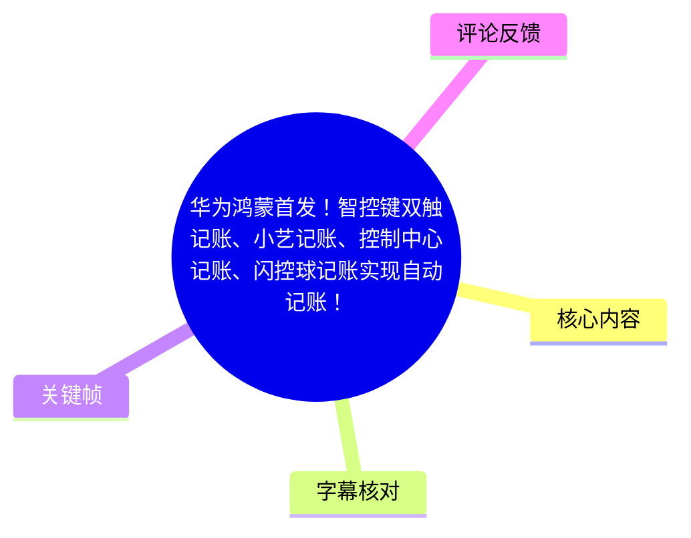
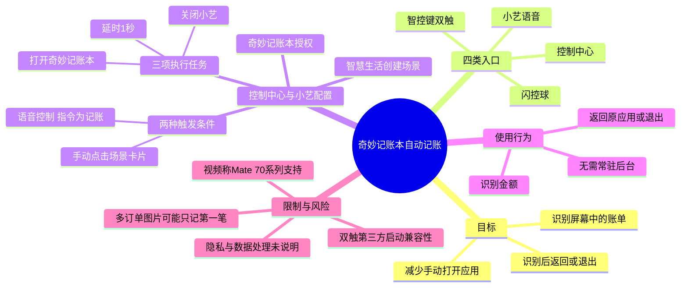
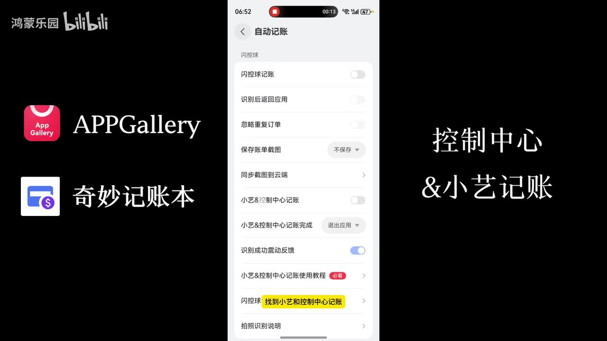
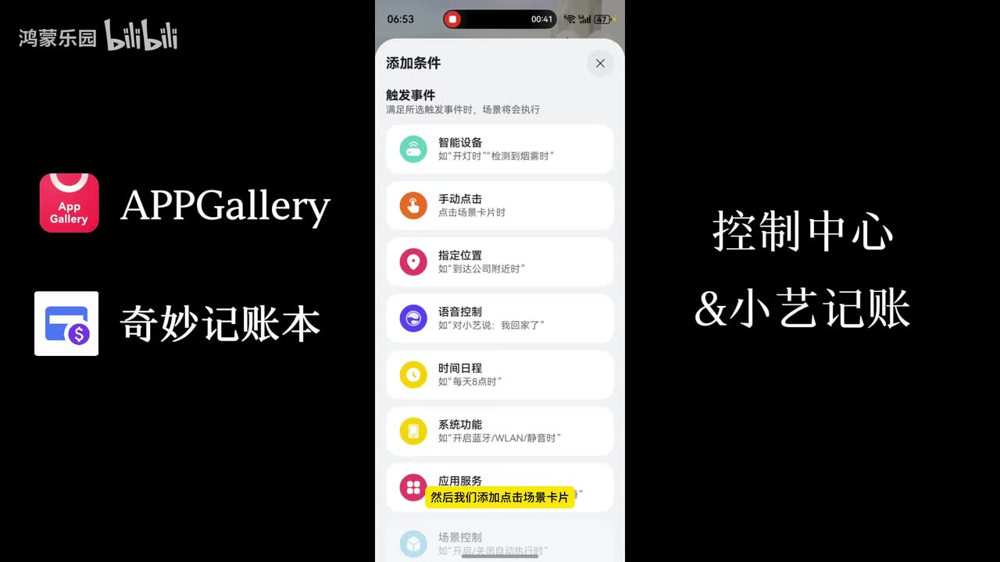
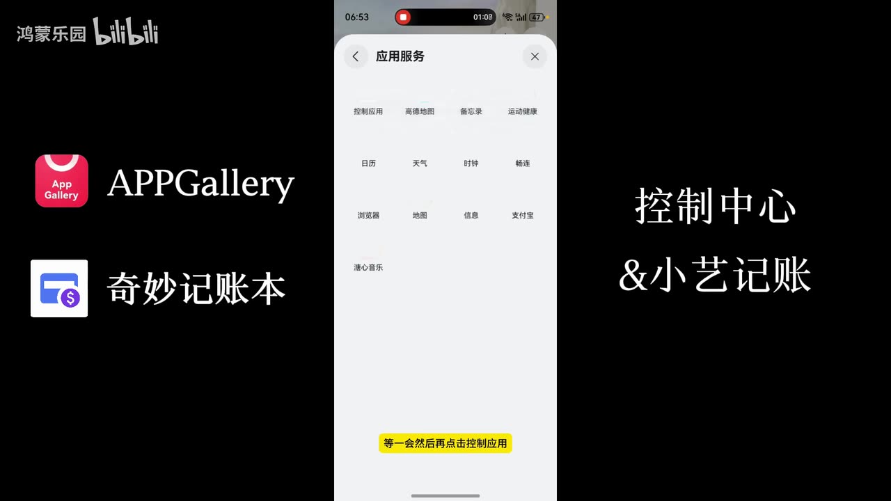

# 华为鸿蒙首发！智控键双触记账、小艺记账、控制中心记账、闪控球记账实现自动记账！

> 来源：[Bilibili 视频](https://www.bilibili.com/video/BV1PjFYzDESN)<br>
> UP 主：奇妙全家桶｜视频时长：5 分 54 秒｜画面规格：1920×1080<br>
> 视频简介中称，应用名为 **奇妙记账本**，提供传统记账及控制中心、小艺、智控键双触、闪控球四种自动记账入口，并宣称“无需常驻后台”“3 秒实现完成自动记账”。这些是开发者/视频陈述，未在素材中获得独立性能验证。

## 小结

视频演示的是鸿蒙设备上“奇妙记账本”的自动记账工作流：当屏幕正在显示账单或待识别页面时，用户可从控制中心、小艺语音、智控键双触或闪控球触发应用打开并识别当前内容；识别后既可回到原应用，也可自动退出。

最完整的配置流程是“控制中心与小艺记账”。需要先在奇妙记账本的“我的 → 自动记账”中启用并授权“小艺&控制中心记账”，再借助华为自带的“智慧生活”创建场景。场景包含两种触发条件：手动点击场景卡片、语音控制；依次执行打开奇妙记账本、延时 1 秒、关闭小艺三项任务。最后将该场景添加至控制中心。

视频强调两个关键经验：第一，场景第三项应关闭的是**小艺**而非奇妙记账本；第二，自动记账完成后，奇妙记账本不必一直留在后台。识别完成后的行为可在应用设置中选择“退出应用”或“识别后返回应用”，两种取舍分别偏向自动化程度与继续浏览原账单页面的便利性。

智控键双触被解释为轻点两下电源键。视频基于用户测试称，当时只有 **Mate 70 系列**支持通过双触启动第三方应用，其他设备“好像”只能启动官方应用；这是经验性、时效性结论，不应视为华为官方兼容性清单。设备型号、系统版本、权限策略及后续功能开放均可能改变实际结果。

视频展示了单笔账单金额能够被正确识别的案例，但没有给出识别率、支持的账单来源、分类规则、离线/联网条件、数据处理路径或隐私机制。热评还反馈多订单图片目前只会记第一笔，这提示批量订单场景可能存在限制，且尚未获作者回应或验证。

## 思维导图





## 目录

- [产品定位与前置条件](#产品定位与前置条件)
- [控制中心与小艺记账：完整配置](#控制中心与小艺记账完整配置)
- [控制中心与小艺：触发及识别演示](#控制中心与小艺触发及识别演示)
- [智控键双触：设置、使用与设备限制](#智控键双触设置使用与设备限制)
- [闪控球记账与片尾复测](#闪控球记账与片尾复测)
- [关键参数、限制与时效性](#关键参数限制与时效性)
- [字幕比对](#字幕比对)
- [评论分析](#评论分析)
- [处理记录](#处理记录)

## [产品定位与前置条件](https://www.bilibili.com/video/BV1PjFYzDESN?t=0)

视频的主体是奇妙记账本在鸿蒙设备上的自动记账入口配置，不是通用记账方法论。视频开头直接进入“控制中心及小艺记账”的设置，后半段补充智控键双触与闪控球两种入口。

### 前置条件与应用内开关 [00:00:06](https://www.bilibili.com/video/BV1PjFYzDESN?t=6)

按视频操作，先进入：

1. 打开 **奇妙记账本**。
2. 点击“我的”。
3. 进入“自动记账”。
4. 找到并打开“小艺&控制中心记账”。
5. 根据系统提示完成授权。

完成授权后，视频称可以关闭奇妙记账本，再前往华为自带的“智慧生活”继续配置场景。这说明后续控制中心/小艺入口依赖应用服务授权及系统场景能力，而不是要求记账应用前台常驻。



> 图：该关键帧展示“自动记账”页面，可见“小艺&控制中心记账”开关、完成后的“退出应用”选项，以及“闪控球记账”等入口。这是理解后续场景配置为何需要先在应用内授权的依据。

### 视频中的“自动”含义

视频所称自动记账，并非在所有支付行为发生时自动抓取交易，而是：**用户在某个需要识别的页面上，通过指定入口触发记账应用，再由应用识别屏幕内容**。从演示可确认的链路是：

> 显示账单/截图页面 → 触发入口 → 打开奇妙记账本 → 识别 → 返回原应用或退出。

因此，触发动作仍是必要步骤；“自动”主要体现在打开、识别及退出/返回等后续过程。

## [控制中心与小艺记账：完整配置](https://www.bilibili.com/video/BV1PjFYzDESN?t=23)

### 在智慧生活中创建场景 [00:00:23](https://www.bilibili.com/video/BV1PjFYzDESN?t=23)

视频指定使用华为自带的 **智慧生活**：

1. 打开“智慧生活”。
2. 点击右上角“创建场景”。
3. 场景配置分为“添加条件”与“添加任务”两部分。

### 添加两种触发条件 [00:00:34](https://www.bilibili.com/video/BV1PjFYzDESN?t=34)

视频要求同一场景中配置以下两个条件：

| 条件 | 视频中的配置 | 作用 |
| --- | --- | --- |
| 手动点击 | 添加“场景卡片” | 让场景可以作为控制中心卡片被点击触发 |
| 语音控制 | 添加“语音控制”，口令示例为“记账” | 让用户能通过对小艺说出该指令触发 |

视频将“记账”作为示例口令，并在后文以此进行小艺演示。若系统中已有同名指令或语音歧义，视频没有说明冲突处理方法。



> 图：该帧清楚展示智慧生活的条件类型，其中“手动点击”与“语音控制”是本教程明确要求添加的两类触发入口；“应用服务”则在后续被用作执行任务。

### 添加三项执行任务 [00:00:58](https://www.bilibili.com/video/BV1PjFYzDESN?t=58)

视频要求按如下次序添加任务：

| 顺序 | 任务类型与路径 | 具体设置 | 目的 |
| --- | --- | --- | --- |
| 1 | 添加任务 → 应用服务 → 控制应用 | **打开应用：奇妙记账本** | 启动识别应用 |
| 2 | 添加任务 → 延时 | **延时 1 秒** | 为应用打开预留时间 |
| 3 | 添加任务 → 应用服务 → 控制应用 | **关闭应用：小艺** | 在语音触发后关闭小艺界面 |

其中第 3 项是视频重复强调的要点：关闭对象是“小艺”，**不是**奇妙记账本。若误关闭奇妙记账本，可能打断刚启动的识别流程；该因果关系虽符合视频的流程设计，但视频未展示误配后的实际报错或表现。



> 图：该帧显示智慧生活“应用服务”页面，并以“控制应用”为操作目标。它对应任务 1 和任务 3 的共同配置路径，是场景自动化能启动/关闭指定应用的技术基础。

### 保存场景并添加到控制中心 [00:02:09](https://www.bilibili.com/video/BV1PjFYzDESN?t=129)

视频完成场景后，给出的添加路径为：

1. 点击场景编辑页右上角“完成”，保存场景。
2. 打开控制中心。
3. 点击左上角，向下滑动。
4. 点击最下方“添加”按钮。
5. 在“场景”中找到刚创建的场景。
6. 保存，使场景卡片出现在控制中心。

至此，一个场景同时具有控制中心手动入口与小艺语音入口。视频口头回顾为“两个条件、三个任务”，可作为核对清单：

```text
条件：
- 手动点击场景卡片
- 对小艺说出语音控制指令

任务：
- 打开奇妙记账本
- 延时 1 秒
- 关闭小艺
```

## [控制中心与小艺：触发及识别演示](https://www.bilibili.com/video/BV1PjFYzDESN?t=149)

### 控制中心触发 [00:02:29](https://www.bilibili.com/video/BV1PjFYzDESN?t=149)

演示中，奇妙记账本并未留在后台。用户先停留在含账单的页面，再：

1. 拉出控制中心。
2. 点击此前添加的记账场景卡片。
3. 系统显示“已执行”后关闭控制中心。
4. 奇妙记账本自动开始识别。
5. 视频展示金额被正确识别，随后应用自动退出。

视频只展示了一个识别成功案例，未展示金额、商家、时间、分类等字段如何被拆分或保存，也没有提供识别失败时的手动修正流程。

### 小艺语音触发 [00:02:59](https://www.bilibili.com/video/BV1PjFYzDESN?t=179)

小艺演示使用此前设置的语音指令“记账”。视频画面中用户说出指令后，系统按场景执行：打开奇妙记账本、识别，完成后默认退出应用，无需在中途手动干预。

### 两种完成后行为 [00:03:09](https://www.bilibili.com/video/BV1PjFYzDESN?t=189)

视频说明识别后的行为可以选择：

| 设置倾向 | 结果 | 适合场景 |
| --- | --- | --- |
| 识别完成后退出应用 | 记账应用自动退出 | 希望尽量少干预、回到系统原状态的情况 |
| “识别后返回应用”/点击返回 | 回到此前查看的账单或原页面 | 希望继续核对账单、继续使用原应用的情况 |

视频在约 00:03:36 的第二次演示中展示了“点击返回”后正确识别并返回的效果。这里的“点击返回”具体是应用内完成后行为选项；不同应用版本的文字或位置可能改变。

## [智控键双触：设置、使用与设备限制](https://www.bilibili.com/video/BV1PjFYzDESN?t=232)

### 设置步骤 [00:03:52](https://www.bilibili.com/video/BV1PjFYzDESN?t=232)

视频在控制中心/小艺教程结束后，切换到智控键双触方案。操作步骤为：

1. 在系统设置中搜索“**双触**”。
2. 进入搜索结果中的第一个相关功能。
3. 在可选应用中搜索并勾选“奇妙记账本”。
4. 关闭奇妙记账本后台（视频强调不需要留在后台）。
5. 打开一个需要被截图/识别的页面。
6. 轻点两下电源键，触发奇妙记账本。
7. 等待识别完成。
8. 根据偏好设置为返回原应用，或直接退出记账应用。

视频将“双触”的全称说为“智控键双触”，并明确动作是轻点两下电源键。此方案的价值是无需拉出控制中心，也无需语音唤醒；代价是硬件与系统功能兼容性更强相关。

### 兼容性说明 [00:04:40](https://www.bilibili.com/video/BV1PjFYzDESN?t=280)

视频给出的限定如下：

- 依据作者“用户测试”的说法，**Mate 70 系列**支持以双触启动第三方软件。
- 其他设备“好像”只能通过双触启动官方应用。
- 若设备当前不支持第三方应用，作者建议等待华为后续逐步开放功能。

这不是官方文档结论，也没有给出具体系统版本、测试设备范围或例外机型。因此应将其理解为视频制作时的观察。实际使用前应以本机“智控键双触”设置页是否允许选择奇妙记账本为准。

## [闪控球记账与片尾复测](https://www.bilibili.com/video/BV1PjFYzDESN?t=300)

### 闪控球入口 [00:05:00](https://www.bilibili.com/video/BV1PjFYzDESN?t=300)

视频给出的闪控球配置较短：

1. 进入“我的”。
2. 进入“自动记账”。
3. 点击并开启“闪控球记账”。
4. 按需开启“识别后返回应用”。
5. 在账单页面通过出现的闪控球触发识别。

演示显示识别完成后可以自动回到原应用，且视频称识别结果正确。与控制中心方案相比，闪控球不需要配置智慧生活场景；与双触相比，它不依赖视频提及的 Mate 70 系列第三方启动兼容性，但会在界面上提供一个浮动入口。

### 片尾快速复测 [00:05:16](https://www.bilibili.com/video/BV1PjFYzDESN?t=316)

片尾重新概览了小艺与控制中心方案，作者称“配置一下，一分钟就搞定”，随后演示：

- 关闭记账应用，不要求后台保活；
- 从控制中心点击场景后返回；
- 自动识别，并在完成后退出；
- 对小艺说“记账”，小艺回复“没问题”后，触发识别与退出。

“1 分钟”属于作者对配置耗时的口头估计，实际时间会受授权状态、系统页面加载和用户是否熟悉智慧生活场景配置影响。

## [关键参数、限制与时效性](https://www.bilibili.com/video/BV1PjFYzDESN?t=265)

### 视频明确给出的参数与事实

| 项目 | 视频内容 | 证据性质 |
| --- | --- | --- |
| 应用名称 | 奇妙记账本 | 视频简介、画面与口述；站内/ASR 中偶有“奇妙账本”等转写差异 |
| 控制中心/小艺场景条件 | 手动点击场景卡片 + 语音控制 | 视频操作演示 |
| 语音指令示例 | “记账” | 视频演示 |
| 自动化任务 | 打开奇妙记账本 → 延时 1 秒 → 关闭小艺 | 视频操作演示 |
| 关键延时 | 1 秒 | 视频明确参数 |
| 识别完成行为 | 返回原应用或退出应用 | 视频功能演示 |
| 是否要求后台常驻 | 视频称不需要 | 作者陈述与演示 |
| 双触动作 | 轻点两下电源键 | 视频明确解释 |
| 双触兼容性 | 作者称 Mate 70 系列可启动第三方应用 | 基于用户测试的作者陈述 |
| 单次处理耗时 | 简介称“3 秒实现完成自动记账” | 宣传性陈述，视频未提供计时验证 |

### 未被视频回答的问题

以下问题不能根据本视频作出确定结论：

1. **数据与隐私**：截图、账单内容和识别结果是否上传云端、保存多久、是否用于模型训练、如何删除，视频没有说明。
2. **权限范围**：授权涉及哪些系统权限、能否单独撤销、权限被收回后的降级行为，视频没有展示。
3. **识别能力边界**：支持哪些支付平台、通知页或账单版式；是否识别商户、类别、时间、收支方向；失败率与错误修正方式，均未说明。
4. **多订单处理**：视频仅演示单笔金额识别；热评反馈多订单图片只处理第一笔，尚缺作者确认。
5. **设备和系统版本**：除“Mate 70 系列”的经验性说法外，没有完整机型、鸿蒙版本或应用版本清单。
6. **自动退出影响**：视频说退出应用且无需后台留存，但未说明系统省电策略、权限回收、锁屏状态或异常中断时的行为。

### 时效性提示

视频发布时间对应元数据时间为 2026-02-05。自动化能力同时受奇妙记账本版本、华为智慧生活、鸿蒙系统权限与机型功能影响，界面名称、入口路径、第三方应用可选范围均可能在后续版本中变化。尤其是“Mate 70 系列支持双触启动第三方软件”的说法仅反映作者当时的测试，应在当前设备上重新验证。

## [字幕比对](https://www.bilibili.com/video/BV1PjFYzDESN?t=0)

本次素材同时提供站内时间轴字幕与本次 ASR。ASR 诊断显示：识别语言为中文，语言置信度为 0.9985，音频总时长约 353.41 秒，语音覆盖约 92.59%，首段语音在 00:00:00.620 出现、末段语音在 00:05:48.220 结束；诊断中**没有** `noAudioStream=true` 标记，且存在连续的语音识别片段，因此源视频有音轨，并非无音轨视频。

| 字幕来源 | 完整性 | 专有名词 | 时间轴 | 主要问题 |
| --- | --- | --- | --- | --- |
| Bilibili 站内字幕 | 覆盖从约 00:00:00.820 至 00:05:48.220，句子较细 | “小E”“奇妙账本”等与标题/画面存在称谓差异 | 逐句 SRT 时间较精细，适合定位操作 | 个别词语疑似口语转写，如“小E”；部分应用名不够规范 |
| 本次 ASR（medium） | 20 个较长片段，语音覆盖 92.59% | 误识别较多，如“小翼/小翅”“奇妥账品”“制控键” | 有时间戳，但单段常约 24 秒，粒度较粗 | 同音字、错别字明显，部分任务名称和应用名需校正 |
| 最终整理文本 | 覆盖两份字幕共同内容，并参照关键帧与视频简介 | 统一采用“小艺”“奇妙记账本”“智控键双触” | 章节时间优先使用站内 SRT 的真实分段起止时间换算 | 未把无法由素材确认的能力补写为事实 |

### 最终字幕选择与校正

正文以**站内 SRT 的细粒度时间轴**作为章节链接依据，并与本次 ASR 交叉核验语义连续性。对于名称，结合视频标题、简介和关键帧进行了最小必要校正：

- 站内字幕与 ASR 的“小E / 小翼 / 小翅 / 小异”等，统一为标题与画面所示的 **小艺**。
- “奇妙账本、奇妙降本、奇妥账品”等，统一为视频简介和画面中的 **奇妙记账本**。
- “双处、双出、双促、双速、制控键”等，统一为视频口述含义及标题中的 **智控键双触**。
- “关闭小艺而非关闭奇妙记账本”由站内字幕与 ASR 均有重复表达，是本教程中可靠度较高的关键步骤。
- 关键帧中“自动记账”设置页同时可见“小艺&控制中心记账”“闪控球记账”“识别后返回应用”等界面文字，为入口名称和完成后行为提供画面佐证。

## [评论分析](https://www.bilibili.com/video/BV1PjFYzDESN?t=0)

本次可获取热评共 2 条，未达到“前三条”的数量；以下仅分析实际可得内容，不将评论中的说法当作已验证事实。

| 热评 | 点赞 | 观点与补充 | 可信度与待验证点 |
| --- | ---: | --- | --- |
| Crystalsman：“如何保证客户隐私不泄露？现在看到贵公司是有诉讼在案的。” | 82 | 评论聚焦账单识别产品可能涉及的隐私保护，并提及“有诉讼在案”。这与视频未解释截图/账单数据流向的问题直接相关。 | 隐私担忧合理，但“诉讼在案”未附案号、主体、法院或公开链接，不能据此认定具体法律事实。需要开发者隐私政策、权限说明与公开司法资料验证。 |
| 房东我没钱了：“试了一下，如果图片中有多个订单，目前只会对第一笔账单进行记账，能优化下吗” | 15 | 用户报告：单张图片中存在多笔订单时，目前只记录第一笔。该反馈补充了视频仅展示单笔识别的能力边界。 | 属于单一用户体验报告，可能受版本、图片版式或操作路径影响；视频未确认，也没有作者回复。适合在实际使用前自行用多订单截图复测。 |

评论区没有提供第三条可获取热评，因此未虚构补充。两条评论共同指出：视频重点在“如何触发”，但对数据安全与复杂账单识别这两类真实使用条件覆盖不足。

## [处理记录](https://www.bilibili.com/video/BV1PjFYzDESN?t=0)

- **Worker ID**：worker-mrj0wbly-5dc4e50c
- **模型**：gpt-5.6-terra
- **素材与工具结果**：使用任务提供的元数据、站内 SRT 字幕、ASR 时间轴字幕、ASR 诊断结果、关键帧清单/画面、热评 JSON；未执行外部网页检索或额外事实核验。
- **字幕选择**：以站内 `p01-ai-zh.srt` 的逐句时间轴作为章节定位主依据；检查并对照本次 ASR（medium）结果。ASR 存在音轨、时间戳和 92.59% 语音覆盖，但专有名词误识别较多，故仅用于交叉验证，不直接沿用其错别字。
- **关键帧选择依据**：
  - `frames/frame-001.jpg`：展示自动记账总设置页，能够佐证“小艺&控制中心记账”“闪控球记账”和识别后行为设置。
  - `frames/frame-002.jpg`：展示智慧生活的条件类别，用于解释手动点击与语音控制的触发设计。
  - `frames/frame-003.jpg`：展示“应用服务/控制应用”路径，用于说明三项任务中打开或关闭应用的配置基础。
- **缓存清理**：素材清单未提供缓存清理执行日志；本次仅依据已提供文件内容完成整理，无法确认或声明已执行本地缓存删除。
- **未解决问题**：未获得应用版本号、鸿蒙版本、官方兼容机型清单、隐私政策、识别字段/准确率、复杂订单处理规则及开发者对热评问题的回应；相关内容均未作推断性补全。

## 评论分析

- 热评 1：如何保证客户隐私不泄露？现在看到贵公司是有诉讼在案的。
- 热评 2：试了一下，如果图片中有多个订单，目前只会对第一笔账单进行记账，能优化下吗[打call]

以上内容是观众反馈摘录，只用于补充理解视频反响，不作为正文事实依据。
