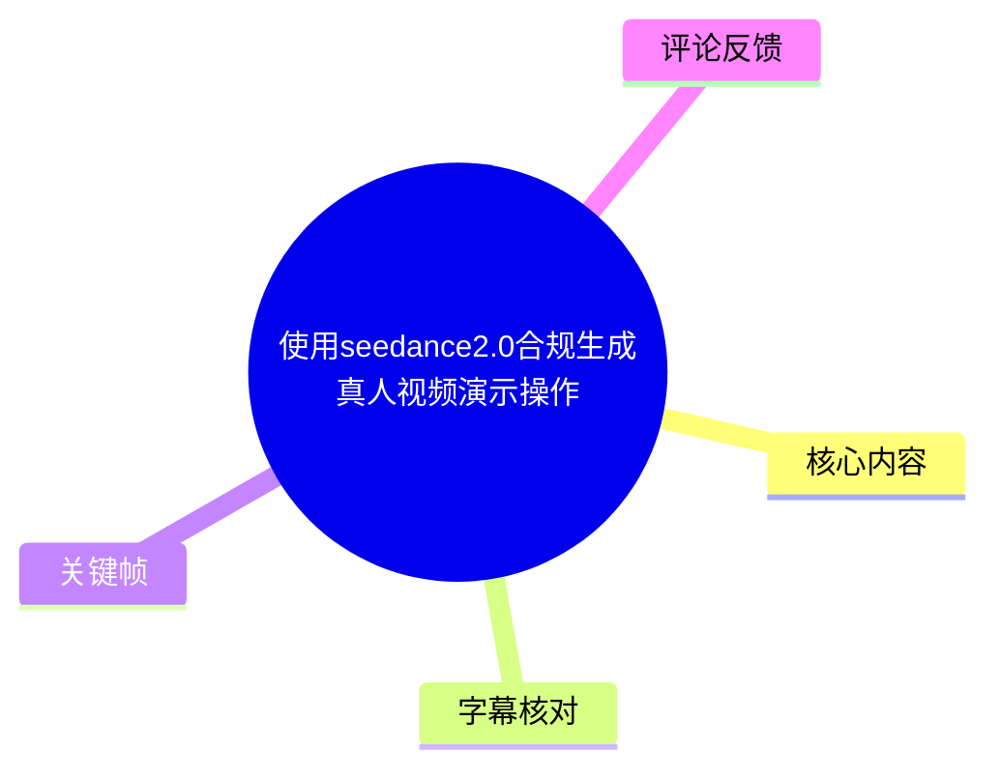
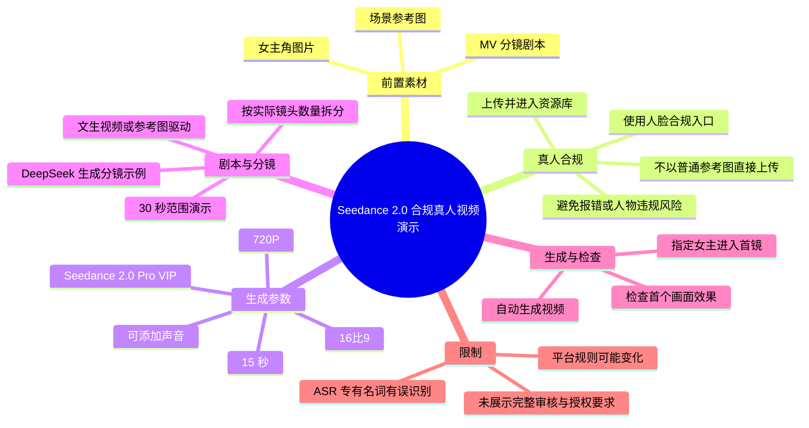
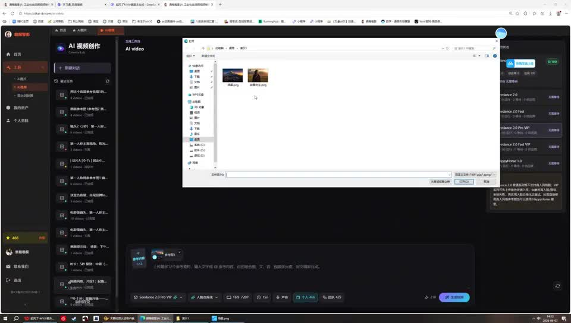
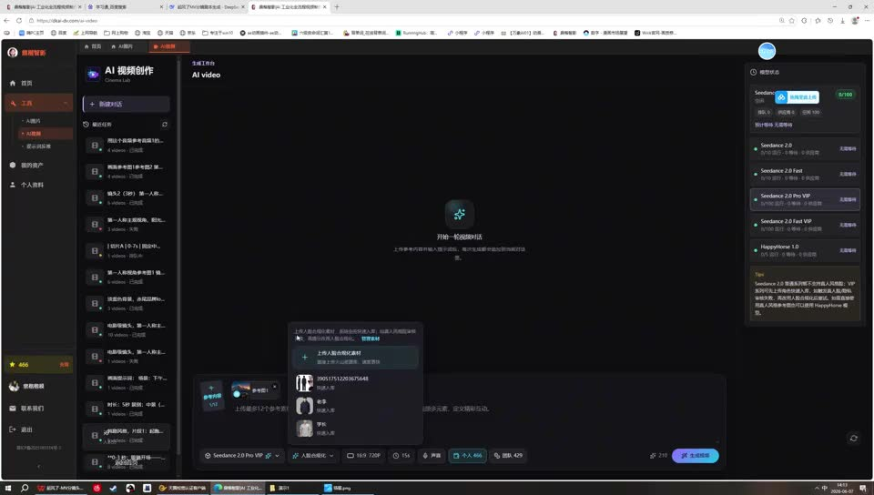
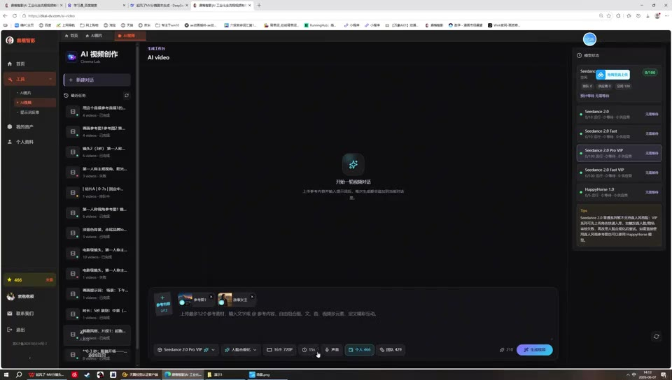
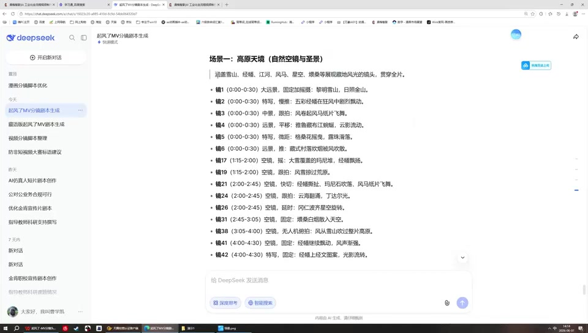

# 使用seedance2.0合规生成真人视频演示操作

> 来源：[Bilibili 视频](https://www.bilibili.com/video/BV1FPJ76AEMo) 
> UP 主：AI视频研究员｜发布时间：2026-06-13｜视频时长：3 分 52 秒｜分辨率：960×544  
> 视频简介提及：`鼎楷智影 d kai-dv.com` 的“合规真人视频生成”操作演示。

## 小结

本视频演示了在一个名为“AI 视频创作”的网页工具中，使用 `Seedance 2.0 Pro VIP` 相关选项生成包含真人角色的视频时，如何先进行“人脸合规化”上传，再将其用于生成任务。UP 的核心提醒是：用于真人角色的人脸素材应上传到专门的合规入口，而不是直接作为普通参考图上传；否则可能报错，或触发人物相关的违规限制。

操作链路可概括为：准备场景参考图与女主角图片 → 在人脸合规入口上传并入库 → 选择 `720P`、`16:9`、`15 秒`等生成参数 → 将已有剧本按时长拆为分镜 → 视情况使用文生视频或引用参考图 → 在提示词中要求将女主置入指定镜头 → 发起生成并检查首个画面的效果。

视频中还展示了用 DeepSeek 生成 MV 分镜脚本的界面。UP 以“前 30 秒”为本次实际演示范围，并提出一种拆分思路：若 30 秒内容包含 6 个镜头，可按实际需要每 3 个镜头组织为一个生成单元；但这属于其 MV 项目的工作方法，不是平台固定规则。

该教程适合已经具备图像素材、需要制作带固定真人角色的 AI 视频创作者。尤其应注意，视频并未展示完整的身份核验、授权材料要求、审核时长、生成计费、最终成片时长上限或平台条款，因此“合规化”功能的具体法律与平台规则不能仅凭本视频推断。

素材发布时间为 2026-06-13，平台界面、模型名称、会员档位、分辨率、时长选项与人脸上传规则均可能在后续调整。视频中的“效果完全 OK”是 UP 对其单个样例画面的主观评价，不等同于对稳定性或合规性的普遍保证。

## 思维导图

## 目录

- [背景、素材与适用边界](#背景素材与适用边界)
- [真人素材的合规上传路径](#真人素材的合规上传路径)
- [生成参数与项目配置](#生成参数与项目配置)
- [从剧本到分镜：30 秒内容的拆分方法](#从剧本到分镜30-秒内容的拆分方法)
- [参考图、女主角植入与文生视频选择](#参考图女主角植入与文生视频选择)
- [发起生成与结果检查](#发起生成与结果检查)
- [可复用操作清单](#可复用操作清单)
- [限制、风险与时效性](#限制风险与时效性)
- [字幕比对](#字幕比对)
- [评论分析](#评论分析)
- [处理记录](#处理记录)

## [背景、素材与适用边界](https://www.bilibili.com/video/BV1FPJ76AEMo?t=2)

视频开头说明演示将使用两类素材：一个场景，以及一个“女主”人物素材。后续画面可见，UP 在浏览器中打开“AI 视频创作”工作区，并使用本地文件选择窗口准备上传图片。其视频简介将演示定位为“合规真人视频生成”操作。

视频中的工作目标不是从零构思完整故事，而是把既有的场景素材、人物图和 MV 剧本组合为可生成的视频任务。UP 后续以“前 30 秒”作为实际试做片段，而非完成整支长视频。

> 图：画面显示在“AI 视频创作”页面中调用本地文件选择窗口，文件区可见两张待选图片。它说明本教程依赖预先准备好的视觉素材，而非完全由文字从零生成。

## [真人素材的合规上传路径](https://www.bilibili.com/video/BV1FPJ76AEMo?t=2)

### [不要将真人脸直接当作普通参考图上传](https://www.bilibili.com/video/BV1FPJ76AEMo?t=2)

UP 明确提示：其所用的 `ProPlus VIP` 方案中存在“人脸合规化”功能，女主角对应的人脸图片必须上传至这一专门位置，不能放在普通“参考图”位置直接使用。

按照视频口述，绕过该路径可能产生两类结果：

1. 系统报错；
2. 被判定为人物相关违规。

这里的“必须”是 UP 针对其当时所见界面和所用方案的操作建议。视频没有展示平台条款原文、审核标准、授权凭证格式或违规提示的完整内容，因此应将其理解为该工作流中的必要前置步骤，而不是对任何平台的通用合规结论。

### [上传后进入人脸资源库](https://www.bilibili.com/video/BV1FPJ76AEMo?t=26)

UP 在约 00:26 说明，上传会直接进入“火山资源库”；约 00:30 再次强调，要将人脸做“合理上传、合规上传”。随后在约 00:40 表示人物已经完成上传并“入库”。

> 图：工作区底部弹出人物相关选择面板，首项为上传/合规处理入口，下方展示可选的人物资源。该画面是区分“人脸合规化资源”与一般参考图片流程的关键证据。

### [合规操作的实际含义与未展示环节](https://www.bilibili.com/video/BV1FPJ76AEMo?t=30)

视频可确认的事实仅包括：界面提供人物合规上传入口、上传后可在任务内选择相关资源、UP 认为此流程可避免直接把真人脸放在参考图区的风险。

视频**未展示**以下信息：

- 被拍摄者授权或肖像权证明如何提交；
- 是否需要本人活体、身份验证或授权书；
- 审核由谁完成、审核耗时多久；
- 人脸资源是否可复用、可否删除及保存期限；
- 是否允许上传公众人物、第三方人物或未成年人图像；
- 生成视频的水印、使用范围与商业授权限制。

因此，实际使用时仍应核验所用服务的最新版协议和所在地区的法律要求，并确保拥有人物肖像、声音及相关素材的明确授权。

## [生成参数与项目配置](https://www.bilibili.com/video/BV1FPJ76AEMo?t=39)

约 00:40 起，UP 展示并口述部分生成配置。可从口述与界面共同确认的设置如下：

| 项目 | 视频中信息 | 说明 |
| --- | --- | --- |
| 模型/方案 | `Seedance 2.0 Pro VIP` | 画面底部可见该选项；右侧模型列表还出现多个 Seedance 相关条目。 |
| 人物处理 | 人脸合规化 | 先上传入库，再在任务中选用。 |
| 分辨率 | `720P` | UP 在约 00:40 口述选择 720P。 |
| 画幅 | `16:9` | UP 在约 00:48 说明“720P 是 16:9”。 |
| 时长 | `15 秒` | 界面底部可见 `15s` 选项。 |
| 声音 | 可添加个人声音/声音 | UP 表示声音“可以加上”；ASR 对具体措辞不清，不能据此确认具体音频模式。 |

> 图：底部生成栏可见 `Seedance 2.0 Pro VIP`、人脸合规化、`16:9 720P`、`15s` 等控件，以及右侧“生成视频”按钮。这张图将口述中的关键参数与实际操作界面对应起来。

需要注意：视频没有交代 720P 的具体像素尺寸、码率、帧率、单次积分/费用、并发限制或最长可生成时长。即使画面展示了 15 秒选项，也不能据此推断该平台只支持 15 秒，或所有账号均具备相同选项。

## [从剧本到分镜：30 秒内容的拆分方法](https://www.bilibili.com/video/BV1FPJ76AEMo?t=53)

### [调用已有 MV 分镜剧本](https://www.bilibili.com/video/BV1FPJ76AEMo?t=53)

约 00:53，UP 表示“把我的剧本掏出来了”；约 00:58 说明按其分镜内容进行编写。随后画面切换到 DeepSeek 页面，标题为“起风了MV分镜脚本生成”。

> 图：画面展示 DeepSeek 输出的“场景一：高原天境（自然空镜与主景）”及按镜头编号、时间段、景别/内容排列的文本。这为后续按时间范围和镜头拆分生成任务提供了源材料。

该示例脚本包含高原自然场景描述，例如远景、特写、空镜等镜头项。画面中可见时间段格式如 `00:00-00:30`、`00:00-0:30` 和后续时间段，但不宜据模糊画面逐项转写未被清晰确认的全部文案。

### [按实际素材和时长拆镜](https://www.bilibili.com/video/BV1FPJ76AEMo?t=76)

约 01:16 至 01:40，UP 提出其拆分经验：

- 本例先考虑 `0—30 秒`内容；
- 假设 15 秒内容包含 6 个镜头，30 秒则可按 3 个镜头为一个处理单元；
- 本例是 MV 剧本，和一般项目可能不同；
- 观众应按自身实际情况修改；
- UP 将本例写作“镜一、镜二、镜三”。

这段表述存在口语化和 ASR 误识别，但核心意思清楚：先依据目标成片范围和原始镜头数量组织分镜，不应机械照搬模板。UP 也提到某处少一个分号“无所谓”，说明文本格式的微小标点问题并非其关注重点；真正重要的是镜头结构、时长与素材指向是否清晰。

## [参考图、女主角植入与文生视频选择](https://www.bilibili.com/video/BV1FPJ76AEMo?t=124)

### [普通场景可直接采用文生视频](https://www.bilibili.com/video/BV1FPJ76AEMo?t=124)

约 02:05 起，UP 举例描述“白马从……上骑车下来”等镜头构想，并指出：对于音乐 MV，如果不是必须依赖故事性人物连续性的情形，普通场景可以直接使用“文生视频”。

这意味着视频给出两种路径：

| 路径 | 适用情形 | 视频中的做法 |
| --- | --- | --- |
| 文生视频 | 普通场景、无需特定人物进入镜头的段落 | 直接用文字描述生成。 |
| 参考图 + 人物资源 | 需要指定场景视觉风格或将女主放入画面的段落 | 引用场景参考图，并使用已合规入库的人脸/人物资源。 |

“故事性必须使用某种方式”的具体判断标准并未在视频中展开；UP 只是说明其 MV 项目有别于普通场景生成。

### [在提示中引用场景并提出人物要求](https://www.bilibili.com/video/BV1FPJ76AEMo?t=149)

UP 以“镜一”为例，表示会在提示文本中 `@` 场景参考图；ASR 将该场景名识别为“日照静山”，该词可能是素材名称或口语识别结果，未能通过画面完全核准，故保留为 ASR 转写而不将其视作标准术语。

随后，UP 说明自己为演示而准备了一张女主角图片，并将其放入任务，向系统提出“请你帮我把女主放到第一……”的要求。约 02:48，UP 表示系统会理解为“用户希望在前头这种……入女主”，继而按照需求修改剧本。

这里能得到的实操经验是：

1. 场景参考图用于约束场景画面；
2. 真人女主不能仅作为普通参考图处理，而要先走合规上传；
3. 在文本指令中说明人物要出现在哪个镜头或哪个位置；
4. 生成前检查系统是否已将人物植入要求反映到任务/剧本中。

但视频没有展示系统修改后的完整剧本，也没有展示人物在每一个镜头中的一致性，因此不能保证这种提示方式必然维持角色、服装、脸部或动作的一致性。

## [发起生成与结果检查](https://www.bilibili.com/video/BV1FPJ76AEMo?t=178)

### [将本次示范收缩到前 30 秒](https://www.bilibili.com/video/BV1FPJ76AEMo?t=178)

约 02:59，UP 明确说本次只做“前 30 秒”。约 03:06 提到当前一段为“14 秒”，说明实际生成片段时长可能并不严格等于此前界面中的 15 秒选项，或该数字是在描述具体分镜素材的长度。视频未提供足够信息判断两者差异的原因。

约 03:12，UP 再次提到“参考图一”，随后在约 03:16 表示此时不再需要进行人脸合规化，并尝试生成视频。结合上下文，应理解为：人物资源已经完成合规入库后，在当前生成步骤无需重复上传/合规处理；并不意味着后续新人物素材也可跳过合规流程。

### [生成并检查首帧/首个画面](https://www.bilibili.com/video/BV1FPJ76AEMo?t=203)

约 03:24，UP 点击“生成视频”，表示界面开始生成。约 03:30，UP 说可按自己的要求修改，并以第一个画面为例检查效果。ASR 在 03:35—03:49 存在约 14 秒无有效语音段，视频未提供可用字幕描述该段完整的界面过程；不能补写为具体的生成耗时或进度状态。

约 03:49，UP 评价“是不是这个画面，我觉得完全非常 OK”。这是对当前样例首个画面的主观验收。一个更稳妥的检查顺序应是：

- 人物是否出现在指定镜头与位置；
- 人脸是否与已上传人物资源相符；
- 场景参考图的主要视觉信息是否被保留；
- 画幅、清晰度和片段时长是否符合预期；
- 如包含声音，检查声音是否正确关联并具备使用授权；
- 若不符合，基于具体镜头或首个画面继续修改提示、参考素材或分镜。

## [可复用操作清单](https://www.bilibili.com/video/BV1FPJ76AEMo?t=2)

以下清单依据视频的实际先后顺序整理；其中“核验授权”是由“合规真人”主题引出的必要风险控制，并非视频演示出的具体按钮步骤。

1. **准备素材。**整理场景参考图、人物图片和已有剧本/分镜文本。
2. **确认人物授权。**在上传前确认对人物脸部、声音和图片拥有合法使用权限；视频没有展示授权核验流程，不可省略自行判断。
3. **进入人脸合规化入口。**使用 UP 所示的专用人物上传入口，而不是直接将真人脸当作普通参考图。
4. **上传并确认资源入库。**视频口述该资源会进入“火山资源库”；确认后再在生成任务中选择人物资源。
5. **设置生成参数。**视频示例为 `Seedance 2.0 Pro VIP`、`720P`、`16:9` 与 `15 秒`；实际可选项以账号当下页面为准。
6. **处理声音选项。**UP 表示可以添加声音，但未说明具体配置与授权要求；若使用声音，应单独检查权利归属。
7. **整理分镜。**先限定要生成的时间范围。视频示例只做前 30 秒，并按镜头数组织“镜一、镜二、镜三”。
8. **选择生成路线。**普通场景可采用文生视频；有指定视觉场景时可引用参考图；需要真人角色时调用已合规入库的人物资源。
9. **明确人物植入要求。**在提示中指定女主出现的镜头、画面位置或叙事功能；必要时让系统根据要求修改剧本。
10. **发起生成。**视频中由“生成视频”按钮启动任务，并采用自动处理。
11. **按首个画面回查。**检查人物、场景、构图与参数是否符合要求；不符合时基于具体镜头修改，而非只凭整体印象判断。
12. **保存可追溯信息。**保留人物授权、上传记录、版本参数、提示词与生成结果，便于后续核验与复现。

## [限制、风险与时效性](https://www.bilibili.com/video/BV1FPJ76AEMo?t=196)

### 视频能够支持的结论

- UP 的示例工作流要求先将真人脸上传到“人脸合规化”入口。
- 视频展示了 `720P`、`16:9`、`15 秒`等设置，并以 `Seedance 2.0 Pro VIP` 为示例方案。
- 可利用分镜文本、场景参考图和已入库人物资源共同组织生成任务。
- UP 实际只演示了前 30 秒和首个画面检查。

### 不应从视频延伸出的结论

- 不能据此认定任意人物图片上传后即具备法律意义上的“合规”资格。
- 不能据此认定平台允许未授权的人脸、公众人物或第三方肖像。
- 不能据此确认“火山资源库”的实际服务归属、数据保留、跨平台共享或隐私规则。
- 不能据此确认生成的角色在多镜头、多片段中一定一致。
- 不能据此确认 720P、16:9、15 秒为固定或免费参数。
- 不能以 UP 对样例“完全非常 OK”的评价替代多轮质量、失真、审核与版权测试。

### 时效性

本条视频发布于 2026-06-13。AI 视频产品的模型版本、会员权益、审核机制、素材保存策略、界面入口和计费结构变化频繁。复现时应优先以当前服务页面、当前账号权限及最新协议为准；若找不到视频所示的入口或参数，不应假定是操作错误，也可能是产品更新导致的差异。

## [字幕比对](https://www.bilibili.com/video/BV1FPJ76AEMo?t=2)

| 字幕来源 | 完整性 | 专有名词 | 时间轴 | 主要问题 |
| --- | --- | --- | --- | --- |
| Bilibili 站内字幕 `p01-ai-zh.srt` | 很低：仅覆盖若干音乐段 | 无可用技术名词 | 有真实起止时间，但不能承载教程内容 | 全部内容基本为“♪ 音乐 ♪”，未转写讲解语音。 |
| 本次 ASR 字幕 | 较高：22 段，语音覆盖约 164.34 秒，占全片约 70.85% | 存在明显误识别 | 有真实起止时间，首段 00:02.210，末段 03:51.690 | “人脸合规化”“参考图”“Seedance”等词及部分场景名、句子边界识别不稳定；03:35—03:49 有约 14.02 秒语音空档。 |

本次 ASR 诊断语言为中文，置信概率约 `0.9912`；结果未标记 `noAudioStream=true`，且识别到了连续讲解语音，因此可确认源视频存在可用于识别的音轨。这不是无音轨视频，也不是工具失败情形。

最终采用策略为：**以本次 ASR 的时间轴和讲解内容为主，站内字幕仅用于确认其未提供有效语义内容，并结合关键帧校正界面中可辨认的术语。**

重要校正与保留原则：

- ASR 中多次出现的“人脺”“人脁”等，结合口述语境及画面“人脸合规化”控件，统一整理为“人脸合规化”。
- ASR 的“参稿图”“参搞图”统一整理为“参考图”。
- 画面可辨认 `Seedance 2.0 Pro VIP`、`16:9 720P` 与 `15s`，这些术语优先按界面显示记录。
- ASR 中“火山资源库”来自 UP 口述；画面未能独立清晰验证其完整名称和服务关系，故按视频陈述保留，不扩展解释。
- “日照静山”等场景名称无法从画面稳定确认，正文仅将其标记为 ASR 转写，不当作已验证的标准名称。
- 站内字幕虽有 00:00:07.520—00:02:08.080 等真实音乐时间段，但不包含讲解文字，因此不用于定位正文技术步骤。

## [评论分析](https://www.bilibili.com/video/BV1FPJ76AEMo?t=0)

仅处理此次可获取的热评前三条；三条评论点赞数均为 0，且均未提供可独立验证的工具信息或操作补充。

1. **二大爷我查**：“做得好好！！”  
   - 观点：对视频质量表达正向认可。  
   - 补充信息：无。  
   - 可信度与价值：属于主观鼓励，不能作为教程有效性、平台合规性或生成质量稳定性的证据。

2. **小童和丫丫**：“什么集合站”  
   - 观点：询问该工具是否属于“集合站”或聚合型服务。  
   - 补充信息：无，视频与评论均未给出答复。  
   - 可信度与价值：反映观众对服务性质的疑问，但不能据此判断平台的技术来源、运营主体或合规资质。

3. **徐盼的华华呢**：“牛逼”  
   - 观点：表达赞赏。  
   - 补充信息：无。  
   - 可信度与价值：为情绪性反馈，不构成对操作细节、模型能力或结果真实性的验证。

## [处理记录](https://www.bilibili.com/video/BV1FPJ76AEMo?t=0)

- **Worker ID**：`worker-mrj0wjed-b0c290ad`
- **模型**：`gpt-5.6-terra`
- **使用工具与素材**：视频元数据、站内字幕 `p01-ai-zh.srt`、本次 ASR 结果 `asr/asr-result.json` 与 `asr/transcript.srt`、关键帧目录 `frames/`、热评数据 `comments/comments.json`。
- **ASR 检查结果**：已检查本次 ASR；语言为中文，含时间戳，未标记 `noAudioStream=true`，故以 ASR 作为教程正文的主要语义来源。
- **字幕选择**：站内字幕只含“♪ 音乐 ♪”，不具备讲解转写价值；正文采用 ASR 时间段定位，并用关键帧校正可辨认的界面术语，保留无法确认的 ASR 不确定性。
- **关键帧选择依据**：选用 `frame-001` 展示本地图片上传，`frame-002` 展示人物合规/资源选择入口，`frame-003` 展示模型与生成参数，`frame-004` 展示 DeepSeek 分镜脚本；均直接服务于素材上传、合规、参数和剧本拆分四个核心环节。
- **未采用的关键帧**：其余已提供帧未在素材描述中给出可核实的画面内容，为避免对未确认画面作出编造性解释，未强行引用。
- **评论范围**：仅分析可获取热评前三条，未延伸至其他评论。
- **缓存清理**：未提供缓存清理执行日志；本记录不虚构已完成的清理操作。
- **未解决问题**：无法从素材确认平台的正式运营主体、完整授权/审核规则、计费与资源库数据政策；ASR 中部分专有名词与场景名称存在误识别风险。

## 评论分析

- 热评 1：做得好好！！
- 热评 2：什么集合站
- 热评 3：牛逼

以上内容是观众反馈摘录，只用于补充理解视频反响，不作为正文事实依据。
