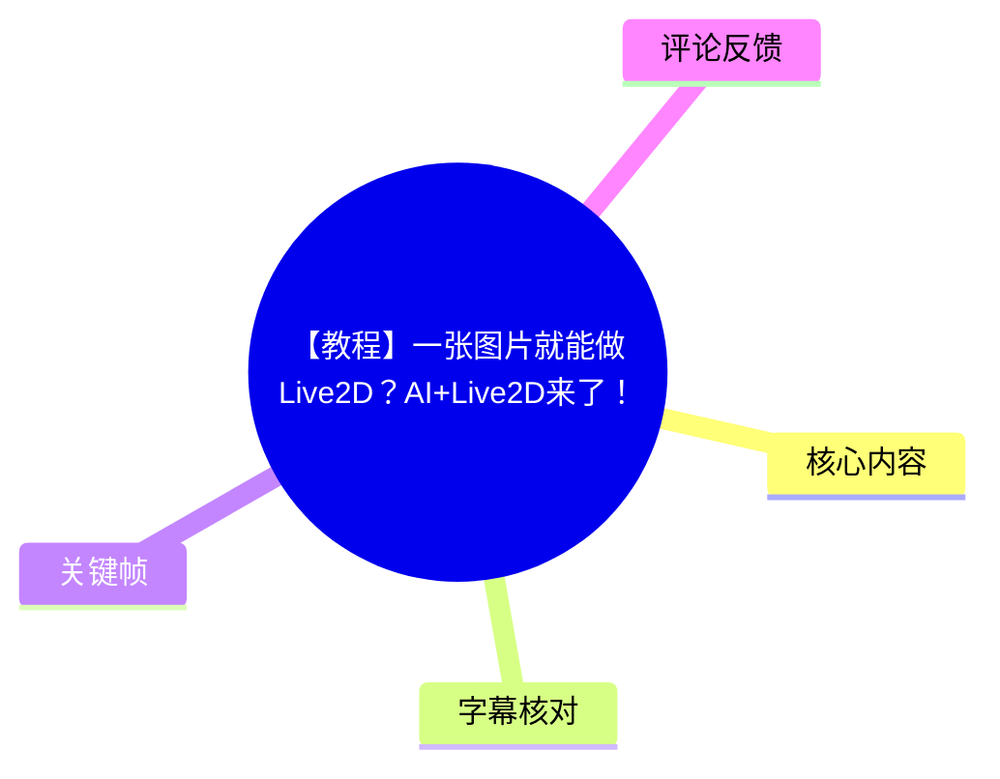
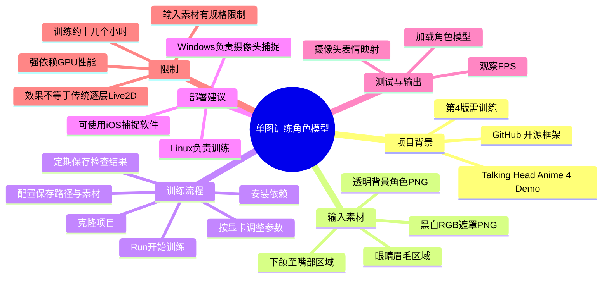
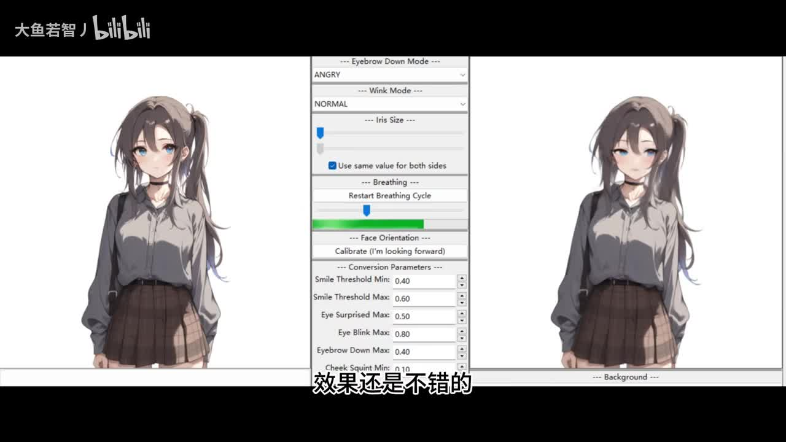
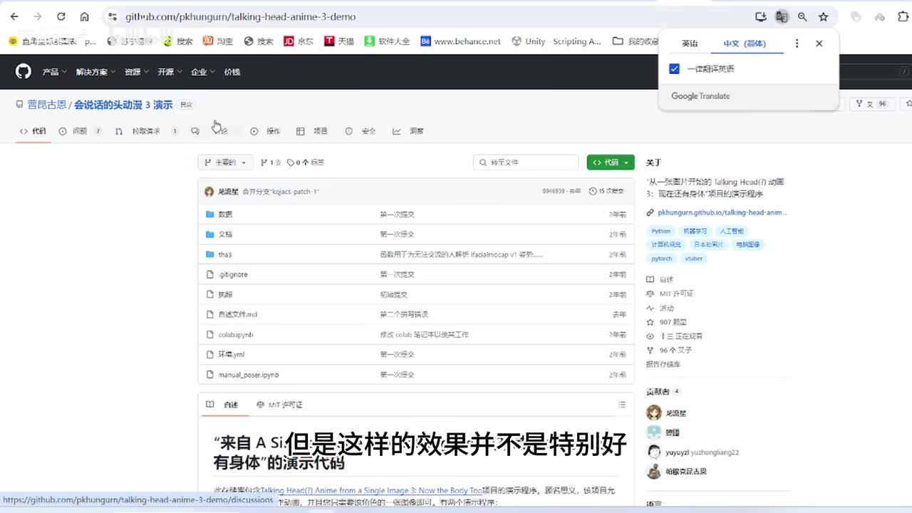
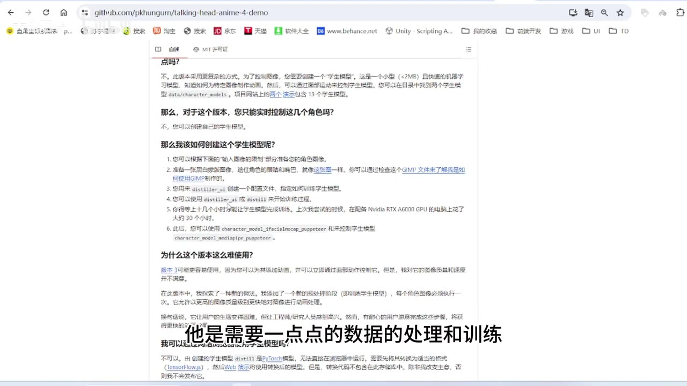

# 【教程】一张图片就能做Live2D？AI+Live2D来了！

> 来源：[Bilibili 视频](https://www.bilibili.com/video/BV14f421z7c1) 
> UP 主：大鱼若智丿｜发布时间：2024-07-11｜视频时长：07:44 
> 项目地址：<https://github.com/pkhungurn/talking-head-anime-4-demo>

## 小结

视频介绍了 GitHub 开源项目 **Talking Head Anime 4 Demo** 的一套工作流：不必像传统 Live2D 那样预先把立绘拆成大量图层，而是以一张角色 PNG 图和一张区域遮罩图为输入，训练专属的角色模型，再把摄像头捕捉到的人脸表情、头部动作映射到角色上。

其关键不在于“上传一张图立刻可用”。视频明确说明，第 4 版需要进行数据处理与训练；没有训练的情况下不能直接使用该版本。若只追求“单图直接变形”，可考虑项目较早的版本，但 UP 主认为这类不经 AI 训练的效果并不特别好。

实际制作需要准备两项素材：**透明背景的角色 PNG**，以及黑白、RGB 三通道且不含透明通道的 **PNG 遮罩图**。遮罩中的两个上方矩形对应左右眼与眉毛区域，下方矩形覆盖下颌角至嘴部区域。角色图片的头部尺寸与位置也须符合界面帮助或项目文档的约束。

部署上，UP 主建议 Linux 与 Windows 各部署一份：Linux 更适合训练，Windows 更适合借助网络摄像头进行实时动作捕捉；没有网络摄像头时，视频还提到可以使用 iOS 端的捕捉软件。训练方面，UP 主使用 A100，耗时约十几个小时，并建议租用 GPU；本机显卡性能不足时训练会很慢。

训练完成后，程序可通过实时捕捉界面加载保存的角色模型。演示中，角色能跟随头部、身体、眨眼、表情和嘴形动作，UP 主主观评价其自然度与传统 Live2D 成品差距不大；但这属于该演示和该角色素材下的观察，不能外推为所有立绘均能达到同等质量。

视频发布于 2024 年 7 月。视频中“最新版本”“五个月前发布”等说法均是当时的项目状态；截至本次素材抓取时间（2026-07-15），仓库、依赖、硬件门槛和运行方式均可能已经变化，应以项目仓库当前文档为准。

## 思维导图

## 目录

- [项目定位与版本差异](#项目定位与版本差异)
- [素材规范：角色图与遮罩图](#素材规范角色图与遮罩图)
- [部署与训练步骤](#部署与训练步骤)
- [实时捕捉、模型加载与性能](#实时捕捉模型加载与性能)
- [结论、限制与时效性](#结论限制与时效性)
- [字幕比对](#字幕比对)
- [评论分析](#评论分析)
- [处理记录](#处理记录)

## [项目定位与版本差异](https://www.bilibili.com/video/BV14f421z7c1?t=21)

### [演示目标：一张图驱动角色](https://www.bilibili.com/video/BV14f421z7c1?t=0)

视频开头展示了官方模型与 UP 主自行训练模型的效果：画面左右为角色，中间为控制面板。UP 主的目标是用**未进行图层拆分的一张角色图片**制作可由人脸实时控制的角色效果。

> 图：画面同时呈现左右角色预览及中间控制面板，可直观看到这是“输入人物动作/表情—输出角色动作”的实时控制场景，也是理解视频最终目标的关键帧。

### [开源框架与版本思路](https://www.bilibili.com/video/BV14f421z7c1?t=21)

UP 主将方案指向 GitHub 上的 Talking Head Anime 项目，并说明该项目已有多个版本。视频浏览的页面显示为仓库页面；视频简介提供的链接为 `pkhungurn/talking-head-anime-4-demo`。

> 图：关键帧展示了 GitHub 项目页面，确认教程依托的是开源仓库而非独立闭源软件；实际安装要求与脚本名称应以该仓库当前文档为准。

### [第 4 版与早期版本的差别](https://www.bilibili.com/video/BV14f421z7c1?t=45)

视频对两类思路作了区分：

| 方案 | 视频描述 | 使用条件与取舍 |
| --- | --- | --- |
| 较早版本 | 一张图直接变形，不经过 AI 训练 | 可直接给图使用，但 UP 主认为效果“不特别好” |
| Talking Head Anime 4 相关方案 | 使用 AI 训练与推理，让角色学习更多运动与一定的 3D 效果 | 必须处理数据并训练专属角色模型，成本更高 |

UP 主称第 4 版是其在录制时看到的较新版本，且在当时约五个月前发布。该相对时间仅能反映 2024 年视频录制阶段的信息，不能作为当前版本状态的依据。

> 图：页面正文展示了关于学生模型（视频口述为“学生模型”）及创建方式的说明，印证本版本并非纯粹“单图免训练”的流程。

### [训练是该版本的前提](https://www.bilibili.com/video/BV14f421z7c1?t=69)

视频明确指出：

1. 先将项目克隆到本地，并安装依赖；
2. 需要训练自己的角色模型；
3. 仓库内有详细训练步骤；
4. **不训练则无法使用该版本**；
5. 训练预计约一天，后文给出的 A100 实测量级约为十几个小时。

这里的“约一天”和“十几个小时”并非固定承诺，实际耗时会受 GPU、配置、输入素材、训练设置和运行环境影响。

## [素材规范：角色图与遮罩图](https://www.bilibili.com/video/BV14f421z7c1?t=119)

### [角色图要求](https://www.bilibili.com/video/BV14f421z7c1?t=119)

开始数据处理前，需要一张角色图。视频给出的硬性要求是：

- 文件格式为 **PNG**；
- 背景应为**透明背景**；
- 人物头部的大小和在画面中的位置应符合工具帮助提示及文档要求。

视频没有在字幕中给出具体像素尺寸、画布分辨率或头部坐标，因此不能据此补写固定数值。实际操作时，应在训练 UI 上传图片后查看该字段的帮助信息，并对照仓库文档调整素材。

### [遮罩图要求与区域含义](https://www.bilibili.com/video/BV14f421z7c1?t=144)

遮罩图同样为 PNG，但规格不同：

| 项目 | 视频要求 |
| --- | --- |
| 图像形式 | 黑白图片 |
| 通道 | RGB 三通道 |
| Alpha / 透明通道 | 必须删除 |
| 上方两个矩形 | 左眼与右眼各一个，覆盖眼睛和眉毛区域 |
| 下方矩形 | 从下颌角延伸至嘴巴附近 |

遮罩不是可随意涂抹的辅助图，而是训练时界定脸部关键可动区域的重要输入。若眼眉或下颌—嘴部区域不符合项目预期，可能影响表情、眨眼或口型的学习质量；这一点是根据视频说明的输入依赖作出的流程性判断，视频未提供失败样例或量化标准。

## [部署与训练步骤](https://www.bilibili.com/video/BV14f421z7c1?t=95)

### [环境分工建议](https://www.bilibili.com/video/BV14f421z7c1?t=95)

UP 主建议分别在 Linux 和 Windows 部署：

- **Linux**：主要负责训练。UP 主认为其用于训练较方便。
- **Windows**：主要使用网络摄像头进行动作捕捉。
- **替代捕捉方式**：没有网络摄像头时，可以使用 iOS 自带或 iOS 端的捕捉软件。
- 视频口述中提到 Linux “没有界面也没有摄像头”，这更接近其自身部署条件或使用习惯，并非所有 Linux 环境的绝对技术结论。

### [Windows 训练 UI 的启动顺序](https://www.bilibili.com/video/BV14f421z7c1?t=168)

视频展示的 Windows 侧训练流程为：

1. 切换（`cd`）至项目文件目录；
2. 激活虚拟环境；
3. 运行项目提供的命令，打开训练 UI；
4. 等待训练界面弹出；
5. 配置输出位置、角色图和遮罩图；
6. 按显卡能力调整相关配置；
7. 点击 `Run` 开始训练。

视频没有清晰、完整地提供可逐字复用的命令行文本，因此不能凭空补出 `git clone`、环境名、Python 版本、依赖安装命令或脚本文件名。应直接查阅仓库 README/文档并使用其中的当前命令。

### [训练 UI 中需要配置的内容](https://www.bilibili.com/video/BV14f421z7c1?t=193)

训练界面中，UP 主依次说明了以下字段和操作：

| 配置项 | 视频说明 |
| --- | --- |
| 模型保存路径 | 第一个字段用于指定后续训练模型的保存位置，可通过 `change` 修改 |
| `image file name` | 选择准备好的角色 PNG 图 |
| 素材帮助提示 | 每个图片字段都有帮助信息，说明头部大小、位置等具体要求 |
| 遮罩文件 | 上传前述黑白 RGB 三通道遮罩图 |
| 其他配置 | 大多数无需修改 |
| `C` 相关项 | UP 主建议保持随机 |
| 数值 `8` 对应项 | 应根据显卡配置调整；显卡性能较低时可调小 |
| 启动训练 | 设置完成后点击 `Run` |

“数值 8”在 ASR 中可识别到，但字段全名未被可靠转录，视频素材也未提供可确认的界面文字。因此只能记录其为与显卡配置相关、低配时可降低的参数，不能断定它是 batch size、线程数或其他具体超参数。

### [Linux 训练、保存频率与中途检查](https://www.bilibili.com/video/BV14f421z7c1?t=266)

UP 主更推荐租用 GPU 训练，并以自身为例：

- 使用 **A100**；
- 训练约花费**十几个小时**；
- 本机显卡性能不高时可能非常慢；
- 在 Linux 终端运行训练文件/脚本；
- 训练结果可按步数设置保存频率；
- 演示中的设置为**每 1 万步保存一次**；
- 训练期间可查看输出效果，以检查是否产生问题。

建议将中间输出作为训练监控点，而不是只等待最终模型：若样本结果明显异常，应优先检查角色图、遮罩图、路径设置与训练日志。前半句来自视频的“检查是否有问题”，后半句为基于流程的排查建议，不是视频提供的具体故障清单。

## [实时捕捉、模型加载与性能](https://www.bilibili.com/video/BV14f421z7c1?t=315)

### [打开测试与捕捉界面](https://www.bilibili.com/video/BV14f421z7c1?t=315)

训练结束后，需要再运行相应命令打开实时捕捉界面。视频说明该界面理论上会在启动后自动打开摄像头；若没有检测到摄像头，则需要进一步调试设备或连接配置。

### [定位并加载模型](https://www.bilibili.com/video/BV14f421z7c1?t=340)

UP 主展示的模型加载逻辑如下：

1. 在界面内执行 `load model`；
2. 训练产物位于项目根目录下的 `data` 相关目录；
3. 进入视频口述为“carry out models”的目录（ASR 对该名称识别不稳定）；
4. `lambda0`、`lambda1` 是程序自带内容；
5. 选择自己训练后保存的角色模型文件；
6. 打开文件，等待程序完成读取。

随后的视频提到，目录中除了角色模型外，还有中间产物；`sample output` 中会保存用于检查训练是否正常的图片。

> 注意：ASR 将相关目录/文件名转写为 “carry out model(s)”，但其发音与屏幕中实际英文命名并不完全可靠。本文保留 ASR 表述并标记不确定性，不将其写成可直接执行的准确路径。

### [摄像头到角色的映射效果](https://www.bilibili.com/video/BV14f421z7c1?t=400)

模型读取完成后，系统将摄像头采集的人脸信息映射到角色模型，从而控制角色。UP 主在演示中观察到：

- 角色会随表情和动作变化；
- 可表现身体运动、头部摆动、眨眼、表情与嘴形；
- 效果在演示中较自然；
- 与传统 Live2D 成品相比，UP 主认为差距“不特别大”。

这一结论是演示者的经验判断。传统 Live2D 的逐层美术拆分、物理参数调校、模型精修与本项目的神经网络推理路径不同，二者不宜仅凭单段演示直接判定总体优劣。

### [FPS 与 GPU 关系](https://www.bilibili.com/video/BV14f421z7c1?t=424)

界面右下角会显示 FPS。视频说明该帧率由 GPU 计算能力影响：GPU 性能更好，帧率可能更高。这里的视频信息只给出了方向性关系，没有提供具体 FPS 数值、显卡型号对比、分辨率、摄像头规格或显存占用，因此无法据此建立可复现实测基准。

## [结论、限制与时效性](https://www.bilibili.com/video/BV14f421z7c1?t=449)

这套方案的可迁移经验是：若目标是快速将单张角色立绘变为可实时响应人脸动作的角色，重点不只在“图片本身”，还在于**合规的透明角色 PNG、正确的区域遮罩、足够的训练资源和可用的摄像头捕捉链路**。

但它并非零成本替代传统 Live2D：

- 第 4 版需要训练，不能把“单图输入”理解为“免训练、即开即用”；
- 角色图与遮罩有格式、通道和区域限制；
- 训练对 GPU 很敏感，UP 主用 A100 仍耗时十几个小时；
- 实时效果的 FPS 同样受 GPU 计算能力影响；
- 视频没有给出完整命令、固定超参数、费用、显存需求、可支持的系统版本或完整故障排查方案；
- 展示效果来自特定角色图和特定训练条件，不代表所有画风、姿态、构图或遮罩质量都能获得相同表现。

从项目时效角度看，视频中关于“最新版本”的描述属于 2024 年 7 月时点的信息。本次素材抓取于 2026-07-15，建议在实践前核验仓库是否仍可访问、依赖是否更新、脚本入口是否变化，以及当前硬件与驱动兼容性。

## 字幕比对

| 字幕来源 | 完整性 | 专有名词 | 时间轴 | 主要问题 |
| --- | --- | --- | --- | --- |
| Bilibili 站内字幕 | 未提供可用字幕 | 无法核验 | 无法使用 | 素材记录显示字幕获取工具报 `Invalid URL`，未取得站内 SRT |
| 本次 ASR 字幕 | 较完整：20 段，覆盖约 455.99 秒，覆盖率 98.31% | 存在训练、系统名、目录名等误识别 | 可用：全部段落具有明确起止时间 | 中英混杂术语与部分界面名识别不稳定，如“训读/讯练”“Linus”“carry out model”等 |

本次任务没有提供可用的站内字幕，因此正文采用**本次 ASR 时间轴**作为章节定位依据，并结合关键帧、视频简介和上下文进行有限校正。ASR 诊断中未标记 `noAudioStream=true`；相反，音频时长为约 463.84 秒，说明源视频存在音轨，本次 ASR 结果必须且已经被检查。

重要校正与保留原则如下：

- `Talking Head Anime`：由 ASR、视频简介项目链接和关键帧中的 GitHub 地址共同支持。
- `talking-head-anime-4-demo`：采用视频简介给出的完整仓库名。
- “训读”“讯练”：按上下文统一理解为“训练”，但不改写为视频未明确给出的具体训练算法。
- “Linus”：按语境校正为 Linux。
- “carry out model(s)”：ASR 对界面路径/文件名识别不可靠，正文保留其不确定性，未把它当作精确目录名或命令。
- “第 4 版发布时间为五个月前”：仅保留为 UP 主在视频中的相对时间陈述，不转换为未经核验的绝对发布日期。

## 评论分析

以下仅分析可获取热评前三条；评论反映的是用户体验与观点，不应直接视作已验证的项目技术结论。

1. **逗比小白白白白｜62 赞**  
   - 观点：认为拥有不错显卡时，可节省传统建模成本；缺点是流程不够顺、很吃显卡。  
   - 价值：补充了“成本从人工建模转移到算力与操作流程”的视角，与视频中 A100、训练时长和显卡影响的说法相呼应。  
   - 限制：评论没有给出显卡型号、训练参数、角色质量或实际账单，不能据此量化“省多少钱”。

2. **gwy｜51 赞**  
   - 观点：指出 A100 仍需十几个小时；其称查文档后认为运行至少需要 4070，并认为输出质量只是“能用”，训练成本可能高于委托制作普通 Live2D。  
   - 价值：提出“训练成本与传统外包/自制 Live2D 成本对比”的现实问题，也提醒读者区分“技术可行”与“商业上划算”。  
   - 可信度边界：其中“至少需要 4070”“训练成本足以找人做更好模型”是评论者的判断，本视频未给出此硬件下限或价格对比数据，不能作为本教程的已验证结论。

3. **白糖荏苒｜31 赞**  
   - 观点：认为传统 Live2D 是设置好的参数，而该方案属于实时计算，动作时可能变糊，类比运行大型游戏。  
   - 价值：指出实时推理与预设参数驱动之间可能存在的画面稳定性、清晰度和性能权衡。  
   - 可信度边界：视频只提到 FPS 与 GPU 性能相关，未展示“动作时模糊”的对比测试；该评论应视为待自行复测的使用体验，而不是视频已证明的现象。

## 处理记录

- Worker ID：`worker-mrj0wjed-b0c290ad`
- 模型：`gpt-5.6-terra`
- 可用素材与工具结果：视频元数据、音频 ASR（`medium`，CUDA、float16）、带时间戳的 `asr/transcript.srt`、12 个关键帧路径、热评 JSON；站内字幕获取结果报错 `Invalid URL`。
- 字幕选择：未提供可用站内字幕；已检查本次 ASR，采用其 20 段 SRT 起止时间生成正文时间轴链接。ASR 音频覆盖诊断为 98.31%，且未标记 `noAudioStream=true`。
- 关键帧依据：
  - `frames/frame-001.jpg`：展示角色实时控制及参数面板，用于说明最终效果；
  - `frames/frame-002.jpg`：展示 GitHub 仓库页，用于确认开源项目背景；
  - `frames/frame-003.jpg`：展示第 4 版文档中的训练说明，用于说明训练并非可选；
  - 其余关键帧未在提供的画面预览中获得足够可核验的内容，未强行引用。
- 缓存清理：素材中未提供缓存清理工具的执行记录；本记录不宣称已执行缓存清理。
- 未解决问题：
  - 站内字幕不可用，无法进行逐句对照；
  - 视频未提供完整可复制命令、准确脚本名及全部 UI 参数名；
  - ASR 对部分英文目录/模型名存在误识别，实际操作必须以项目仓库当前文档和界面为准。
