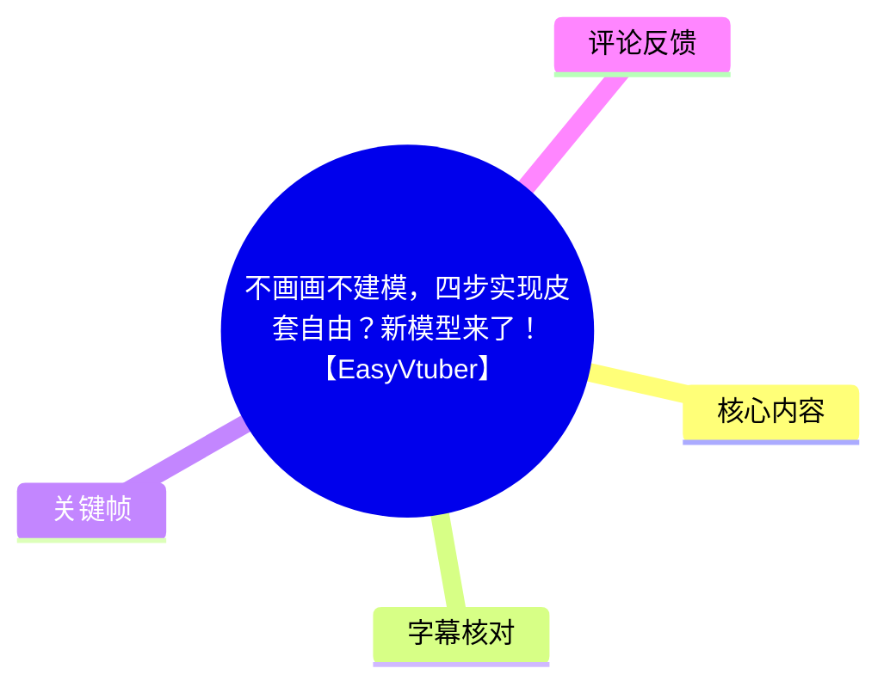
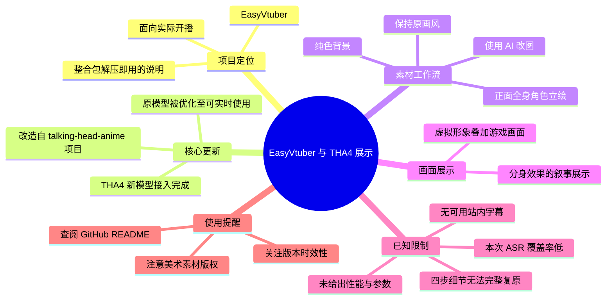
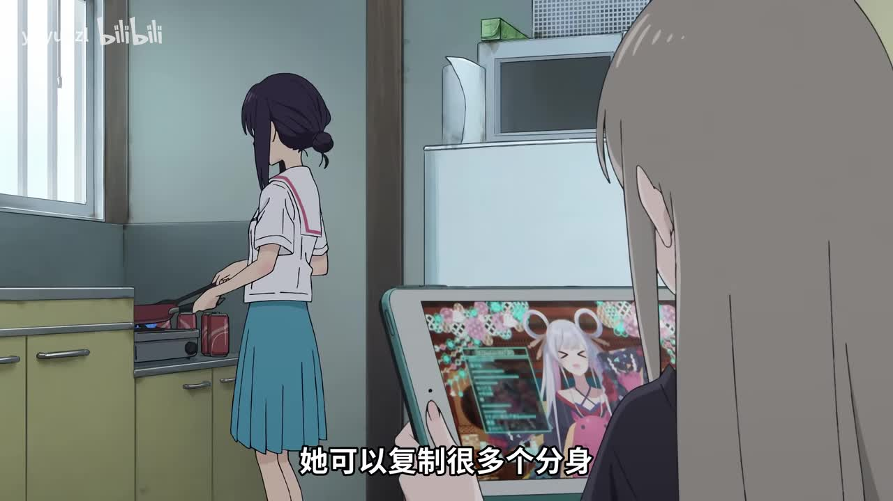
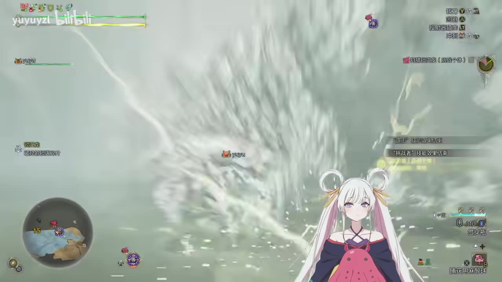
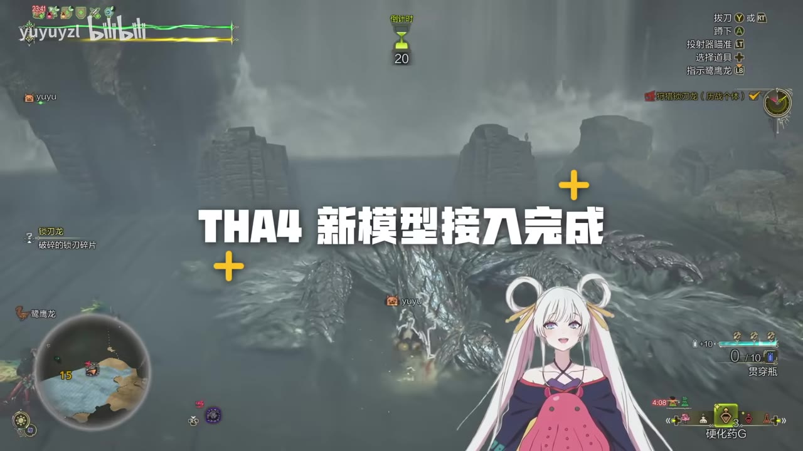
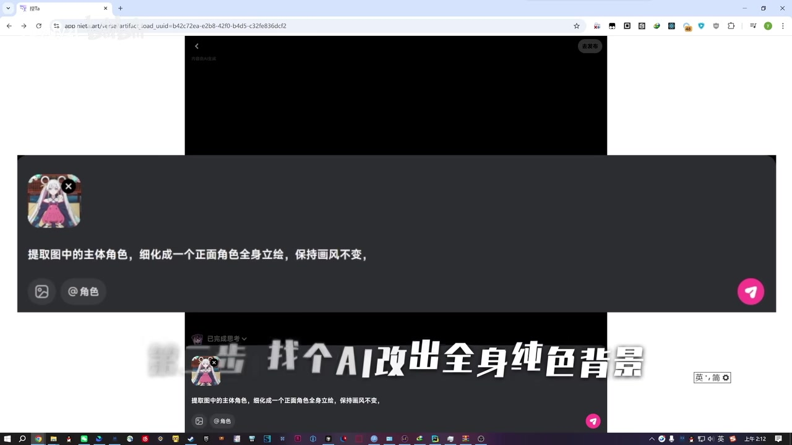

# 不画画不建模，四步实现皮套自由？新模型来了！【EasyVtuber】

> 来源：[Bilibili 视频](https://www.bilibili.com/video/BV1Duc8zQEj9) 
> UP 主：yuyuyzl｜视频时长：110 秒｜分辨率：1920×1080 
> 标签：AI、虚拟偶像、虚拟 UP 主、EasyVtuber、Python、Live2D、Vtuber

## 小结

该视频是对 **EasyVtuber 接入 THA4 新模型**的短技术展示。UP 主在视频简介中说明：项目基于知名的 `talking-head-anime` 系列进行改造，目标是将原本“只能用于蒸馏训练”的模型优化到可实时使用，并补充面向实际开播的功能与打包支持。

视频标题提出“不画画不建模，四步实现皮套自由”，但当前可可靠获得的字幕并未覆盖完整讲解过程。结合视频提供的关键画面，能确认其展示了两类内容：一是动画角色作为虚拟形象叠加在游戏画面上的效果；二是借助“捏Ta”等 AI 改图工具，将角色图处理为适合后续使用的正面全身、纯色背景素材。画面还明确显示“THA4 新模型接入完成”。

需要特别区分：**“四步”是标题中的宣传性概括，不等于素材已提供四个可复现的完整步骤。** 当前材料只能明确看到其中与素材准备相关的一步；没有可靠证据支持补写其余步骤、命令、运行参数、显卡需求、帧率或兼容软件清单。

这项内容适合希望降低虚拟形象制作门槛、关注实时动画驱动与 AI 改图工作流的用户参考。实际使用前，UP 主明确建议前往 GitHub 仓库 `yuyuyzl/EasyVtuber` 获取下载链接，并阅读 README；美术素材版权、模型版本与环境兼容性仍需使用者自行确认。

时效性方面，视频元数据显示发布时间为 2026-02-12，素材抓取时间为 2026-07-15。AI 模型、整合包、仓库 README 与下载方式都可能在此后更新，因此本文仅记录该视频及其元数据所能证实的状态。

## 思维导图

## 目录

- [背景与项目定位](#背景与项目定位)
- [开场：分身、演出效果与虚拟形象展示](#开场分身演出效果与虚拟形象展示)
- [THA4 新模型接入](#tha4-新模型接入)
- [可确认的素材准备步骤](#可确认的素材准备步骤)
- [实际使用边界与时效性](#实际使用边界与时效性)
- [字幕比对](#字幕比对)
- [评论分析](#评论分析)
- [处理记录](#处理记录)

## [背景与项目定位](https://www.bilibili.com/video/BV1Duc8zQEj9?t=0)

视频简介将此次内容定位为 **EasyVtuber 的技术展示**，而非一份完整的从零安装教学。UP 主给出的项目说明包括：

1. **模型来源与改造方向**  
   EasyVtuber 魔改自 `talking-head-anime` 项目；简介特别感谢 `pkhungurn/talking-head-anime-4-demo`、`pkhungurn/talking-head-anime-3-demo` 以及 `zpeng11/ezvtuber-rt`。

2. **实时化目标**  
   UP 主称，原本“只能蒸馏训练用”的模型已经被优化到能够实时运行。这里的“实时”是项目方的目标与声明；素材中没有给出量化依据，例如 FPS、端到端延迟、GPU 型号、显存占用、分辨率或并发实例数量，因此不能将其进一步解释为特定硬件上的性能承诺。

3. **开播可用性目标**  
   简介称项目“以技术落地为目标增加了大量实用特性”“全力保证配完环境就能开播”，并称整合包可“解压即用”。这描述的是开发者预期的使用体验，实际是否可直接运行仍取决于操作系统、驱动、依赖、摄像头/动捕输入以及仓库当前版本。

4. **获取方式与使用前置**  
   简介只提供 GitHub 仓库名 `yuyuyzl/EasyVtuber`，并建议用户自行进入仓库查找下载链接、阅读 README 后使用。本素材未附仓库 README、发行包清单或命令行内容，故本文不补写安装命令。

## [开场：分身、演出效果与虚拟形象展示](https://www.bilibili.com/video/BV1Duc8zQEj9?t=0)

本次 ASR 在 0–10.10 秒内识别到少量日语文本，其中包含“分身”“唱歌、跳舞”等语义线索；同时，关键画面中出现“她可以复制很多个分身”的中文画面字幕。两者与视频开场的演出性展示相互呼应。

不过，ASR 被自动判为日语，且总语音覆盖率仅为 **6.7%**，无法作为完整旁白依据。因此可以确认的是：开场画面在强调虚拟角色可呈现多角色/分身式演出效果；不能据此确认“分身”属于 THA4 的某个具体模型能力、某项单独的可配置功能，或可在任意环境中稳定复现。

> 图：画面以动画场景中的平板为媒介展示虚拟角色，并出现“她可以复制很多个分身”的中文文本。它的价值在于保留了本视频对“分身”效果的直接视觉表达，但该画面属于演出展示，不能单独推导实现机制。

> 图：角色形象叠加在游戏画面右下区域，可用于理解视频希望达成的直播使用场景：将虚拟形象与游戏内容同时呈现。画面未展示软件界面、捕捉来源或性能数据，故不能判断具体接入链路。

### 可直接使用的 ASR 时间片段

| 时间 | 本次 ASR 原文 | 可用性判断 |
| --- | --- | --- |
| [00:00–00:00.66](https://www.bilibili.com/video/BV1Duc8zQEj9?t=0) | `えー` | 仅为短语气词，缺乏上下文。 |
| [00:02.80–00:03.42](https://www.bilibili.com/video/BV1Duc8zQEj9?t=2) | `ってこと?` | 日语短句，语义不完整。 |
| [00:04.06–00:10.10](https://www.bilibili.com/video/BV1Duc8zQEj9?t=4) | `分身もできて、歌って踊れて八千歳って設定うぇーおもろー` | 可辨识出“可分身、唱歌跳舞”等片段，但末尾内容明显不稳定；不宜据此转写为准确中文旁白。 |

## [THA4 新模型接入](https://www.bilibili.com/video/BV1Duc8zQEj9?t=4)

关键帧直接显示“**THA4 新模型接入完成**”。这是视频中最明确的版本/技术更新信息。

从视频简介可进一步确认，UP 主所称的新模型与实时化有关：其表述是将原本只能用于蒸馏训练的模型优化到能实时使用。此处可将信息分为三个层次：

- **画面直接事实**：视频内出现“THA4 新模型接入完成”。
- **UP 主在简介中的项目陈述**：项目已将相关模型优化至可实时使用，并为开播场景增加实用特性。
- **无法由当前素材验证的内容**：具体采用哪个 THA4 权重版本、是否默认启用、推理引擎、驱动方式、输入输出分辨率、是否支持全身、是否需要独显及性能表现。

> 图：该帧以大字标明“THA4 新模型接入完成”，是本文确认模型接入这一事实的主要视觉依据。背景仍为游戏与虚拟形象演示，说明视频更侧重展示效果而非公开底层配置。

## [可确认的素材准备步骤](https://www.bilibili.com/video/BV1Duc8zQEj9?t=4)

标题声称“四步实现皮套自由”，但在当前可用素材中，仅能安全复原出一个明确的素材处理动作：**使用 AI 改图工具生成或整理正面全身、纯色背景的角色图。**

画面中可见浏览器打开“捏Ta”页面，并展示如下输入内容：

> 提取图中的主体角色，细化成一个正面角色全身立绘，保持画风不变

画面叠加文字为：

> 第一步 找个AI改出全身纯色背景

据此，可整理出视频实际呈现的第一步：

1. 准备一张已有角色图。
2. 在 AI 改图工具中引用该角色图。
3. 通过提示词要求提取主体角色、生成正面全身立绘、保持既有画风。
4. 目标素材是纯色背景的角色图，以便后续进入虚拟形象处理流程。

> 图：该帧同时呈现了角色参考图、改图提示词和“第一步 找个AI改出全身纯色背景”的字幕，是可复原素材准备步骤的直接依据。它也说明视频所说的“不画画”并不表示不需要角色素材，而是将部分素材制作工作交给 AI 改图流程完成。

### 提示词的可迁移部分

视频画面中可确认的提示词核心要求为：

- 提取图片主体角色；
- 细化为正面角色全身立绘；
- 保持画风不变。

其中，“全身”“正面”“纯色背景”是面向后续处理便利性的素材规范；但视频没有说明背景具体颜色、图像分辨率、人物姿势容差、遮挡处理、手部要求、透明通道要求或失败后的修图策略。因此实际生成时，仍可能遇到肢体结构错误、服装细节丢失、背景不干净、画风偏移等 AI 改图常见问题。

### 无法补全的后三步

由于站内字幕不可用，本次 ASR 又只覆盖了开头约 10 秒且识别语言错误，材料中没有提供标题所称“四步”的完整步骤顺序。以下内容均**未在现有素材中得到证实**：

- 角色图导入 EasyVtuber 的具体操作；
- THA4 模型文件的下载与放置路径；
- 表情、头部姿态、口型或身体驱动的配置；
- OBS、直播软件或游戏采集的接入方法；
- 输出透明背景、绿幕、窗口捕获等配置；
- 性能优化、报错排查与硬件门槛。

因此，不能为了凑足“四步”而虚构操作流程。若要复现，应以 `yuyuyzl/EasyVtuber` 仓库在实际使用时的 README 为准。

## [实际使用边界与时效性](https://www.bilibili.com/video/BV1Duc8zQEj9?t=4)

### 已知限制

| 项目 | 当前能够确认的情况 |
| --- | --- |
| 完整教学步骤 | 无法确认；标题提到四步，但可用材料只明确展示了第一步。 |
| 模型能力 | 可确认 THA4 新模型已接入；“实时使用”来自 UP 主简介，未给出量化指标。 |
| 运行环境 | 未提供操作系统、Python 版本、CUDA、显卡、显存、摄像头或动捕设备要求。 |
| 输出与直播接入 | 未提供 OBS 或其他直播软件的详细配置。 |
| 美术授权 | UP 主明确称视频中的美术素材仅供个人学习分享使用，使用者需自行注意版权。 |
| AI 改图工具 | 视频说明使用“捏Ta”，并称理论上大部分改图模型都可轻松完成；该说法是创作者经验性判断，未给出跨工具验证结果。 |

### 可迁移经验

1. **先统一输入素材，再考虑实时驱动。**  
   正面、全身、背景干净的角色素材有利于降低后续处理复杂度；这比直接把复杂场景图投入驱动流程更可控。

2. **展示效果与工程可复现性应分开评估。**  
   视频已经展示了虚拟角色与游戏画面的组合效果，但没有公开完整环境。观看者不应把视觉演示等同于自己设备上的必然效果。

3. **以仓库文档而非短视频标题作为实施依据。**  
   视频本身是技术展示，简介也明确要求用户查阅 GitHub README。安装、模型更新、依赖变更和许可证问题应以仓库当前文档为准。

4. **版权责任不会因 AI 改图而消失。**  
   即便使用 AI 将角色整理为全身立绘，原始角色、美术素材与生成结果的使用范围仍需要自行核验。

## 字幕比对

| 字幕来源 | 完整性 | 专有名词 | 时间轴 | 主要问题 |
| --- | --- | --- | --- | --- |
| Bilibili 站内字幕 | 无可用字幕 | 无法核验 | 无法使用 | 素材抓取记录显示字幕工具返回 `Invalid URL`；任务材料也明确标注“未提供可用站内字幕”。 |
| 本次 ASR 字幕 | 很低：3 段、约 7.32 秒语音、覆盖率 6.7% | 未识别 EasyVtuber、THA4、捏Ta 等关键术语 | 有真实时间戳，可对应 0–10.10 秒 | 自动识别语言为日语，置信度 0.931；识别文本与中文视频主题不匹配，且 10 秒后没有有效语音覆盖。 |

### 最终字幕使用策略

本次未获得可用站内字幕，故不存在可与 ASR 合并的完整字幕底稿。已检查本次 ASR 结果：其 `diagnostics` 中**没有** `noAudioStream=true` 标记，说明不能将当前低覆盖归因于“源视频没有音轨”；实际情况是音频存在，但 ASR 将内容识别为日语且结果严重不完整。

因此，本文采用以下证据优先级：

1. 视频元数据与 UP 主简介；
2. 关键帧中可直接读取的中文文字与界面内容；
3. ASR 中带真实时间戳、但仅可作开场弱辅助的片段。

经关键画面校正或确认的关键词包括：

- **THA4 新模型接入完成**：来自画面文字；
- **第一步 找个 AI 改出全身纯色背景**：来自画面文字；
- **捏Ta**：来自浏览器页面及视频简介；
- **EasyVtuber**：来自标题、标签与视频简介；
- **talking-head-anime**：来自视频简介中的致谢与项目来源说明。

## 评论分析

本次仅获取到 2 条热评，少于要求上限“前三条”；以下仅分析可获取的两条，不将评论内容视为已验证事实。

### 1. 米想啥子（87 赞）

> “所以，他喵的，这是年更项目？？UP们也太强了……自己只是希望有个简单的皮套，感觉要是有工作流可以跟live2d的制作器捆绑在一起，进行分解就更好了，实时同步会不会性能负荷比较大。。学习了”

- **观点概括**：评论者认可项目进展，同时表达了对“简单皮套”工作流的需求。
- **补充价值**：提出了与 Live2D 制作工具衔接、分解素材流程以及实时同步性能负担的问题，这些恰好是短视频未展开的工程问题。
- **可信度与边界**：这是用户期待与疑问，不包含性能测试结果。尤其“实时同步会不会性能负荷比较大”是待验证问题，不能据此断定项目性能不足。

### 2. 星野I梦美（102 赞）

> “皮套通货膨胀的时代要结束了？”

- **观点概括**：评论者认为该工具可能降低虚拟形象制作门槛，进而冲击传统皮套制作的稀缺性或价格结构。
- **补充价值**：反映了观众对 AI 工具降低制作成本的直观预期。
- **可信度与边界**：该评论是修辞性的市场判断。视频没有提供制作成本、人工工时、商用质量、授权成本或与传统 Live2D 流程的对照数据，不能据此得出“皮套价格将下降”的结论。

## 处理记录

- **Worker ID**：worker-mrj0www4-e8d79408
- **模型**：gpt-5.6-terra
- **素材与工具记录**：使用任务提供的 Bilibili 元数据、视频简介、关键帧清单、ASR 结果、ASR SRT、抓取告警与热评 JSON；未获得可用站内字幕。
- **ASR 检查结果**：已检查 `asr/asr-result.json` 与 `asr/transcript.srt`。ASR 模型为 `medium`，运行于 CUDA、`float16`，自动检测语言为日语，识别出 3 段带时间戳文本；未发现 `noAudioStream=true` 标记。
- **字幕选择**：站内字幕不可用；本次 ASR 仅用于保留 0–10.10 秒的真实时间锚点，不作为完整内容转写依据。正文以视频简介和关键帧可见文字为主。
- **关键帧选择依据**：选用 `frames/frame-001.jpg` 至 `frames/frame-004.jpg`，分别支撑分身演出、游戏叠加效果、THA4 接入完成和 AI 改图第一步这四项正文事实；图片说明明确区分了画面可证实信息与不可推导信息。
- **缓存清理**：任务材料未提供缓存清理执行日志；无法确认是否已清理临时下载、音频、帧图或 ASR 缓存，故如实记录为“未提供结果”。
- **未解决问题**：无法从现有材料可靠恢复“四步”完整流程；缺少安装命令、模型版本、性能参数、硬件要求、完整软件配置与可用站内字幕。
