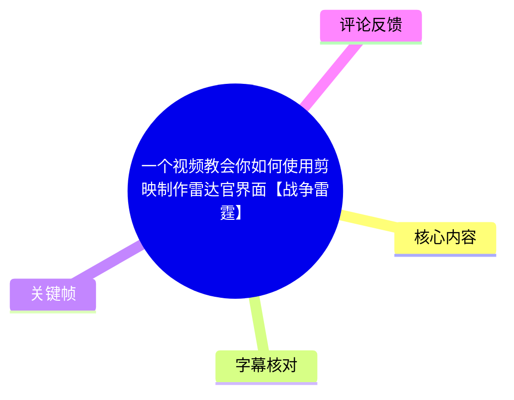
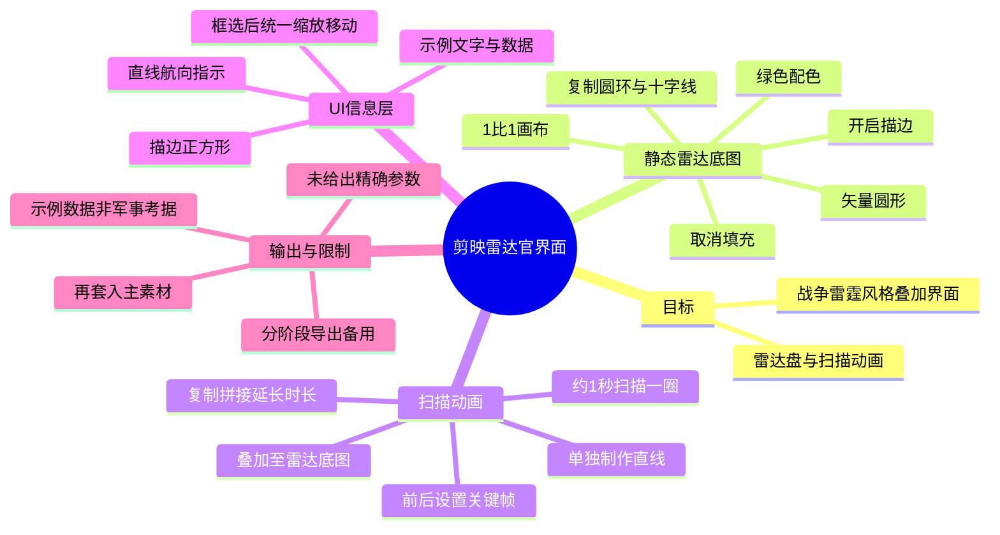
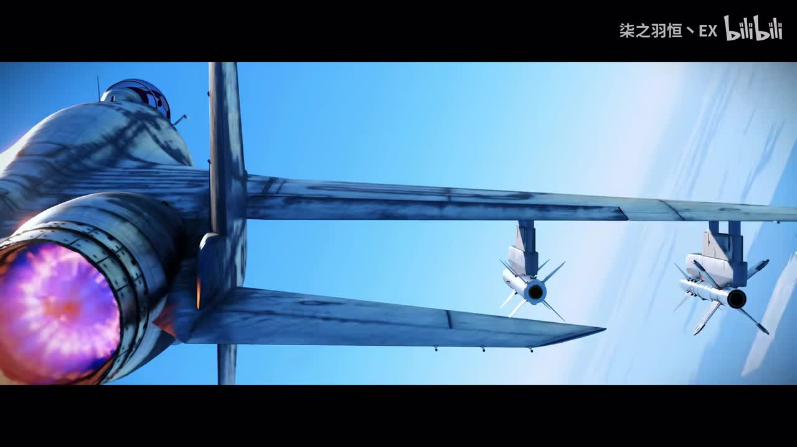
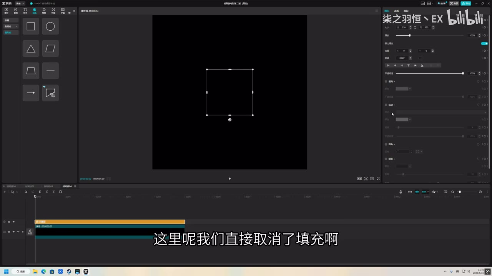
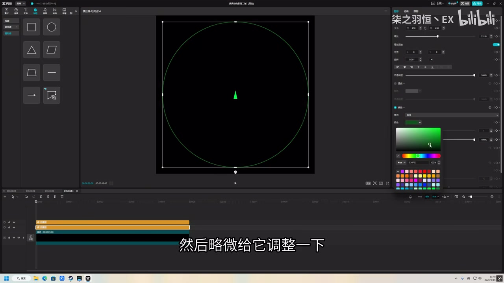
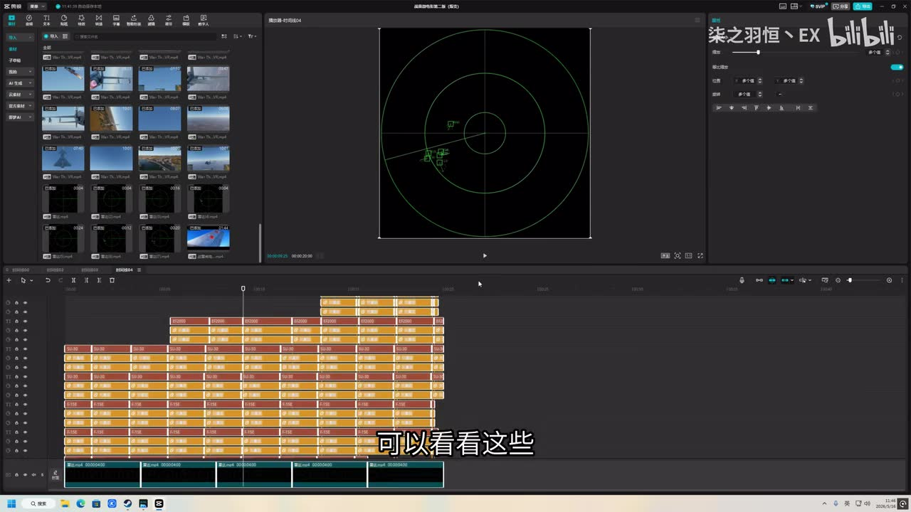

# 一个视频教会你如何使用剪映制作雷达官界面【战争雷霆】

> 来源：[Bilibili 视频](https://www.bilibili.com/video/BV1tzLg6nE8X)  
> UP 主：柒之羽恒丶EX｜视频时长：04:01｜画面规格：3840 × 2160  
> 标签：战争雷霆、军事、空战、剪辑、雷达

## 小结

本视频演示了使用剪映桌面端制作“雷达官界面”风格动态图形的流程，并将其作为叠加素材使用在《战争雷霆》相关主视频中。成品由静态雷达底图、独立制作的扫描线动画、目标/航向标识和文字数据等元素构成。

核心做法是：先以 **1:1 画布**制作静态雷达盘，再单独制作一条扫描线，通过前后两个关键帧令其约在 **1 秒内完成一圈扫描**；随后把扫描动画叠加到雷达底图上，复制并拼接动画片段以延长时长。最后制作方框、航向线和数据文字等 UI 元素，导出后再放入主素材。

视频采用剪映内置“矢量图/图形”完成主要绘制：圆形和正方形均取消填充、保留描边；雷达主体使用绿色。UP 主明确表示颜色可自行调整，且示例中的歼-10C相关数据只是随意填写，并非严谨军事参数。

本教程适合希望快速制作军事风格 HUD、雷达盘、战术态势界面或游戏视频信息叠加层的剪映用户。其价值在于用基础图形、复制、关键帧和叠加完成视觉效果，而非依赖录制游戏原生雷达界面。

限制在于：视频没有给出精确色值、描边粗细、画布像素尺寸、导出编码/码率、混合模式名称及文字数据规范；“混合”相关操作的具体菜单与设置也未展开。因此，本文只记录视频明确出现的操作逻辑，不将未展示的参数补全为确定事实。

## 思维导图

## 目录

- [成品目标与项目准备（00:00）](#成品目标与项目准备0000)
- [建立雷达底图：圆环、颜色与网格（00:37）](#建立雷达底图圆环颜色与网格0037)
- [制作扫描线动画并循环拼接（01:36）](#制作扫描线动画并循环拼接0136)
- [制作目标框、航向指示和数据层（02:16）](#制作目标框航向指示和数据层0216)
- [导出并合成至主素材（03:32）](#导出并合成至主素材0332)
- [可复用步骤清单与参数边界](#可复用步骤清单与参数边界)
- [关键帧索引](#关键帧索引)
- [字幕比对](#字幕比对)
- [评论分析](#评论分析)
- [处理记录](#处理记录)

## 成品目标与项目准备（00:00）

### 成品预览与教程定位 [00:00](https://www.bilibili.com/video/BV1tzLg6nE8X?t=0)

开场展示的是一段航空器画面，视频说明将教观众用剪映做出后续出现的雷达界面效果。教程正式开始于约 **00:18.72**。

UP 主在开始操作前展示了自己已有的剪映工程草稿；时间线中可见大量分层素材，预览窗口中已经出现绿色圆形雷达盘、十字坐标线及多个绿色目标标记。这说明最终效果不是单个滤镜，而是由多层图形、文字或视频片段组合而成。

> 图：开场展示航空器镜头，是雷达官界面将要服务的主素材语境。它的价值在于说明教程目标是为游戏/军事题材画面增加图形化信息层，而非复刻某个真实雷达系统。

### 新建图形的基本原则 [00:18](https://www.bilibili.com/video/BV1tzLg6nE8X?t=18)

视频从打开剪映和查看草稿开始，随后进入演示。UP 主说明，这套做法参考、模仿了网络上类似作品的手法和思路；这属于创作方法分享，而不是软件官方标准工作流。

视频明确提出的第一项画面参数是：

| 项目 | 视频中的做法 | 说明 |
| --- | --- | --- |
| 雷达底图比例 | 1:1 | 用于构成正方形区域内的圆形雷达盘 |
| 图形创建方式 | 矢量图/内置图形 | 以剪映图形工具制作 |
| 主体造型 | 圆形、直线、正方形 | 分别承担雷达圈、坐标/航向线、目标框等功能 |
| 颜色 | 绿色为示例 | UP 主表示其他颜色也可以使用 |

## 建立雷达底图：圆环、颜色与网格（00:37）

### 用无填充圆形建立雷达盘 [00:37](https://www.bilibili.com/video/BV1tzLg6nE8X?t=37)

在约 **00:37.42—01:15.04**，UP 主制作雷达底图：

1. 在 1:1 画面中创建圆形矢量图。
2. 放大或调整图形大小，使其适配雷达盘所需区域。
3. **取消填充**。
4. 开启并保留**描边**。
5. 调整描边颜色；示例选择绿色。
6. 复制图形，进行进一步排版。

取消填充而只保留描边，是这一界面风格的关键：它使圆形保持透明内部区域，不遮挡底下的视频内容，同时形成雷达范围圈的视觉识别。

> 图：画面展示剪映图形编辑界面中的方形对象及右侧属性面板，字幕对应“直接取消了填充”。虽然此处选中对象为方形，但它直观说明了本教程对图形通用的“无填充、保留描边”处理方式。

### 绿色描边、复制圆环与十字线 [00:54](https://www.bilibili.com/video/BV1tzLg6nE8X?t=54)

UP 主将轮廓调整为绿色，并称许多雷达常使用这一视觉色调；这是一种视觉风格选择，并不代表真实雷达设备必然使用该颜色。之后通过复制圆形、调整大小和排版，形成同心圆结构。

接着，视频用直线构成雷达中的横线、竖线。操作要点是：

- 直线可横向或纵向摆放；
- 调整好一条线的位置后，复制一份；
- 再继续调整副本的位置或方向；
- 由圆环和横竖线共同构成雷达盘的基本框架。

> 图：该帧显示黑色背景上的绿色圆形描边和中心绿色标记，右侧打开了颜色选择面板。它能够直接说明“绿色描边 + 无填充圆形”如何形成基础雷达盘的视觉效果。

### 静态雷达底图导出 [01:28](https://www.bilibili.com/video/BV1tzLg6nE8X?t=88)

约 **01:28.60—01:33.88**，UP 主表示雷达雏形已完成，并将其导出。此处体现了视频的分阶段工作方式：先输出静态雷达底图，再单独制作扫描动画和后续 UI 层。

这种拆分便于后续复用，但视频未说明导出是否带透明通道，也没有提供导出格式、帧率、码率或分辨率。因此，不能据此断言其导出文件可直接保留透明背景；实际项目应以剪映当前版本可提供的导出选项为准。

## 制作扫描线动画并循环拼接（01:36）

### 将直线作为独立扫描素材 [01:36](https://www.bilibili.com/video/BV1tzLg6nE8X?t=96)

约 **01:36.54** 起，视频开始制作雷达扫描效果。UP 主的做法是先创建一条直线，将其导出为素材，再把该素材叠加到前一步的雷达界面上。

视频中关于叠加关系的表述是把素材“套到”雷达界面上，并进行“混合”相关处理，使扫描线能出现在雷达盘上。站内字幕对应原句为“直接让想要这个混合”。由于视频没有明确展示混合模式名称，也没有给出具体参数，能够确认的是：

- 扫描线与静态雷达底图是分开制作的；
- 扫描线随后被放在雷达盘的上层进行合成；
- 视频意图是使扫描元素在雷达界面上正常呈现。

不能从素材判断其具体使用了“滤色”“叠加”“正片叠底”或其他任何命名模式。

### 用两个关键帧控制一圈扫描 [01:59](https://www.bilibili.com/video/BV1tzLg6nE8X?t=119)

扫描动画的明确时间参数出现在约 **01:59.99—02:06.96**：

1. 在扫描线片段前段打一个关键帧。
2. 在约 **1 秒**后的时间点再打一个关键帧。
3. 通过改变扫描线的角度，使其在这段约 1 秒的时间内完成一圈扫描。

视频的原始意图是“在一秒的时间内扫一圈”。这里的“一秒”是 UP 主口述的近似时长，视频没有提供帧级精度、起止旋转角度、插值曲线或关键帧具体位置。

对于复现，关键不在于精确复制某一数值，而在于保持三个关系：

- 扫描线的旋转中心应与雷达圆心一致；
- 两个关键帧之间完成完整的循环旋转；
- 扫描线应处于雷达底图之上，并与圆环范围匹配。

### 复制和拼接扫描段延长时长 [02:08](https://www.bilibili.com/video/BV1tzLg6nE8X?t=128)

完成单次扫描后，UP 主将这一段扫描动画复制多份并拼接起来，最后导出备用。这种方式用短循环片段扩展为足够长的动画素材。

需要注意的实际限制：

- 视频未展示复制片段之间是否存在角度跳变，也未说明是否调整了首尾帧以实现无缝循环。
- 若首尾扫描线角度不一致，拼接点可能出现突然跳动。
- 若扫描素材的长度与主视频不一致，需要按主素材时长继续复制或裁剪。
- 视频没有展示扫描线透明度、模糊、辉光或残影参数，因此这些效果不应被视为教程必需步骤。

## 制作目标框、航向指示和数据层（02:16）

### 无填充正方形作为 UI 框体 [02:16](https://www.bilibili.com/video/BV1tzLg6nE8X?t=136)

约 **02:16.34—02:35.36**，视频创建新的矢量图正方形，并重复此前的图形处理逻辑：

1. 创建正方形。
2. 取消填充。
3. 开启描边。
4. 填写或调整颜色。
5. 调整至适合界面的大小。

UP 主补充称，图形可以选择其他样式；但其当时使用的剪映图形选项中主要采用方形，并认为方形已经够用。这里反映的是作者当前版本和个人可用素材范围，不宜外推为剪映只支持方形。

### 直线构成航向指示 [02:42](https://www.bilibili.com/video/BV1tzLg6nE8X?t=162)

约 **02:42.02—02:50.17**，UP 主用一条直线制作雷达上的“航向指示”。此步骤与前面的网格线类似，但其语义用途不同：前者服务于雷达坐标结构，后者服务于目标或飞机的航向表达。

随后，视频在约 **02:52.76—02:58.36** 提示将相关元素全部框选。框选后可以：

- 整体移动位置；
- 调整整体大小；
- 保持多个界面元素的相对关系。

这是一项重要的工程习惯：当目标框、航向线、文字数据已组成一个局部模块时，应优先整体缩放和移动，而不是分别调整每一层。

### 歼-10C文字示例与数据可信度 [03:02](https://www.bilibili.com/video/BV1tzLg6nE8X?t=182)

约 **03:02.96—03:21.01**，UP 主以“三架歼-10C在这里巡航”为示例配置界面数据。UP 主同时明确表示自己并不懂很多军事理念，示例中输入的若干数字是随意填写的，请观众不要据此追究。

因此，可将该部分理解为**排版和信息氛围示范**，而不能将其视为：

- 歼-10C的真实雷达参数；
- 真实编队态势数据；
- 游戏《战争雷霆》的官方雷达显示规范；
- 军事行动或航空术语的准确标注模板。

若需要制作具备军事考据性的界面，应另行核验机型、航向、距离、速度、高度、敌我识别和编队标识等信息来源。

## 导出并合成至主素材（03:32）

### UI层导出并套入主视频 [03:32](https://www.bilibili.com/video/BV1tzLg6nE8X?t=212)

约 **03:32.84—03:41.12**，UP 主完成数据/UI元素后再次导出备用，随后将其套入“主素材”。至此，视频呈现出清晰的素材组织顺序：

1. 静态雷达底图；
2. 扫描线循环动画；
3. 目标框、航向线、数据文字等 UI 层；
4. 主视频画面；
5. 将上述图层作为叠加素材合成。

分层导出的优点是可以在不同项目中复用雷达组件；代价是修改其中一个元素时可能需要回到对应子工程重新导出。视频没有展示主素材中的具体位置调整、遮罩、透明度、运动跟踪或最终叠加层级顺序。

### 成果确认 [03:56](https://www.bilibili.com/video/BV1tzLg6nE8X?t=236)

约 **03:56.51—04:00.30**，UP 主展示成果并说明完成后直接导出即可。视频至此结束。

素材中未提供可精确辨识最终成片界面细节的单独关键帧，因此不对最终成片的字体、UI布局、扫线亮度或数据内容作超出字幕与已给画面的描述。

## 可复用步骤清单与参数边界

### 可按视频复现的工作流

1. 新建 1:1 的雷达底图工程或画面区域。
2. 创建圆形矢量图，取消填充并开启描边。
3. 将描边调为绿色或其他所需颜色。
4. 复制圆形并调整大小，排出同心圆结构。
5. 添加横线和竖线；复制线条以形成雷达坐标结构。
6. 导出静态雷达底图备用。
7. 单独创建一条用于扫描的直线。
8. 将扫描线叠到雷达底图上，进行视频中所称的“混合”处理。
9. 在扫描线前段和约 1 秒后分别设置关键帧，通过旋转让其完成一圈扫描。
10. 复制扫描动画片段并拼接，延长为所需时长后导出。
11. 新建无填充、带描边的正方形，作为目标框或信息框。
12. 用直线制作航向指示。
13. 对相关 UI 元素进行框选，以整体移动和缩放。
14. 添加机型名称、数量和数据等文字信息；若追求真实性，应自行核验内容。
15. 导出 UI 层，并将底图、扫描动画、UI层叠加到主素材中。
16. 检查效果后导出最终视频。

### 视频明确给出的参数

| 参数/条件 | 值或做法 | 来源时间 |
| --- | --- | --- |
| 雷达底图比例 | 1:1 | [00:37](https://www.bilibili.com/video/BV1tzLg6nE8X?t=37) |
| 圆形内部 | 取消填充 | [00:45](https://www.bilibili.com/video/BV1tzLg6nE8X?t=45) |
| 圆形边缘 | 开启描边 | [00:47](https://www.bilibili.com/video/BV1tzLg6nE8X?t=47) |
| 示例颜色 | 绿色 | [00:56](https://www.bilibili.com/video/BV1tzLg6nE8X?t=56) |
| 扫描周期 | 约 1 秒一圈 | [01:59](https://www.bilibili.com/video/BV1tzLg6nE8X?t=119) |
| 扫描延时方式 | 复制多个片段并拼接 | [02:08](https://www.bilibili.com/video/BV1tzLg6nE8X?t=128) |
| 数据示例 | 三架歼-10C巡航 | [03:02](https://www.bilibili.com/video/BV1tzLg6nE8X?t=182) |

### 未给出、需自行决定的内容

- 画布具体像素尺寸；
- 圆环数量、半径、描边宽度；
- 绿色的准确 RGB/HEX 数值；
- 扫描线角度、宽度、透明度和旋转插值；
- “混合”功能的具体模式及参数；
- 字体、字号、字距和文字布局；
- 导出格式、帧率、分辨率、码率；
- 是否使用透明背景/透明通道；
- 示例军事数据的真实性与格式规范。

## 关键帧索引

| 关键帧 | 正文关联 | 画面内容 | 选用价值 |
| --- | --- | --- | --- |
|  | 开场目标 | 航空器飞行画面 | 交代雷达界面拟叠加的军事/游戏视频语境。 |
|  | 项目准备 | 剪映工程、分层时间线及绿色雷达预览 | 展示成品由大量分层元素构成，并可见同心圆、坐标线与目标标记的整体关系。 |
|  | 无填充描边 | 图形对象与编辑属性面板 | 印证“取消填充、保留描边”的基础图形处理。 |
|  | 绿色圆环 | 绿色圆形雷达轮廓与颜色面板 | 说明绿色描边应用到圆形雷达盘后的视觉结果。 |

## 字幕比对

| 字幕来源 | 完整性 | 专有名词 | 时间轴 | 主要问题 |
| --- | --- | --- | --- | --- |
| Bilibili 站内字幕 | 覆盖开场、教程主体和结尾，分段较细 | “剪映”“矢量图”“描边”“歼10C”等识别较稳定 | 有效 SRT 时间轴，覆盖 00:00.04—04:00.30 | 个别口语片段不完整；“混合”相关表述语义不够明确；夹杂少量歌词/环境声转写。 |
| 本次 ASR 字幕（medium） | 共 16 段，语音覆盖约 171.35 秒，占视频约 71.19% | 多处错识别，如“简映/简硬”“十量图”“关锵针”“雷打”等 | 有效时间戳，覆盖 00:00.05—03:59.95 | 分段较长；存在 15.20 秒、16.38 秒等较大无语音间隔；专有名词及操作术语错误较多。 |

### 最终字幕选择与校正

本文以**站内字幕**作为主时间轴和主要文字依据，并使用本次 ASR 的时间范围、语音覆盖诊断进行交叉检查。原因是站内字幕对软件名称、图形术语和“歼10C”等词语的识别明显更准确，且分段更适合定位具体操作。

本次 ASR 已实际检查；诊断中**未标记 `noAudioStream=true`**，且识别到中文语音，故不存在“源视频没有音轨”的情况。ASR 的主要价值是确认视频含语音、总时长约 240.704 秒，以及站内字幕的时序与音频内容大体一致。

结合站内字幕、ASR和关键帧，可校正或优先采用以下词语：

| ASR 易错词 | 本文采用 | 校正依据 |
| --- | --- | --- |
| 简映、简硬 | 剪映 | 站内字幕与视频标题 |
| 十量图、实量图 | 矢量图 | 站内字幕 |
| 揉边 | 描边 | 站内字幕及图形编辑画面 |
| 雷打、雷大 | 雷达 | 视频主题与站内字幕 |
| 关锵针 | 关键帧 | 站内字幕 |
| 前风曲掉 | 填充取消掉 | 站内字幕及属性面板画面 |
| 殲10C | 歼-10C | 站内字幕；仅作作者示例文本记录 |

## 评论分析

以下仅分析本次可获取的热评前三条，评论内容反映观众感受，不作为教程事实或技术验证依据。

1. **0d00の0721（341 赞）**  
   评论认为自己原先以为视频会采用“录制《战争雷霆》数字显示屏后替换”的方式，实际发现作者是通过多边形/图形手工搭建界面。该评论准确指出了视频的主要创作特征：使用图形元素重建视觉效果，而非直接替换游戏原始 UI。评论中的“很毛子”属于玩笑式表达，不构成技术评价或来源证明。

2. **一架空二师的苏27（153 赞）**  
   评论表示已投币、收藏，并计划在下一支视频使用该特效。这反映教程具有较高的即时可模仿性和创作启发性，但没有提供额外技术参数或复现结果，不能据此判断不同剪映版本中的兼容情况。

3. **Lao_Wang_NFS_（83 赞）**  
   评论以“已严肃学习”表达认可。该评论未补充实际操作、问题或争议信息，更多体现观众对题材和效果的接受度。

## 处理记录

- Worker ID：`worker-mrj0wjed-b0c290ad`
- 整理模型：`gpt-5.6-terra`
- 可用素材与工具结果：视频元数据、站内 SRT 字幕、本次 ASR 结果与 SRT、ASR 覆盖诊断、12 张抽取关键帧路径、热评前三条。
- 本次 ASR：`medium` 模型，语言识别为中文，置信度约 `0.9995`，CUDA / `float16`；音频时长约 `240.704` 秒。
- 字幕选择：以站内 `p01-ai-zh.srt` 为主；检查并对照本次 ASR。对剪映、矢量图、描边、关键帧、歼-10C等错误识别采用站内字幕校正。
- 关键帧选择依据：优先选取能够直接展示主素材语境、剪映分层工程、无填充描边设置、绿色雷达圆环的帧；正文使用 `frames/frame-001.jpg` 至 `frames/frame-004.jpg`，并说明各帧在理解步骤中的作用。
- 缓存清理：提供的素材清单未包含缓存清理执行日志；无法据此确认是否已清理，不作“已清理”断言。
- 未解决问题：素材未提供精确颜色数值、混合模式名称、描边和动画参数、透明通道设置及最终导出参数；视频中的军事数据已由 UP 主声明为随意填写，未进行真实性补证。
