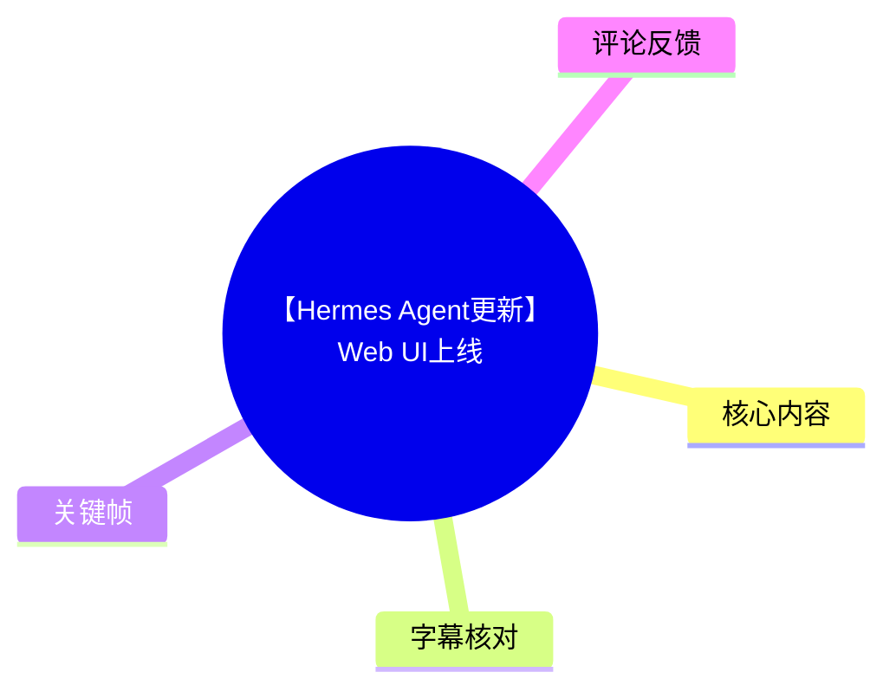
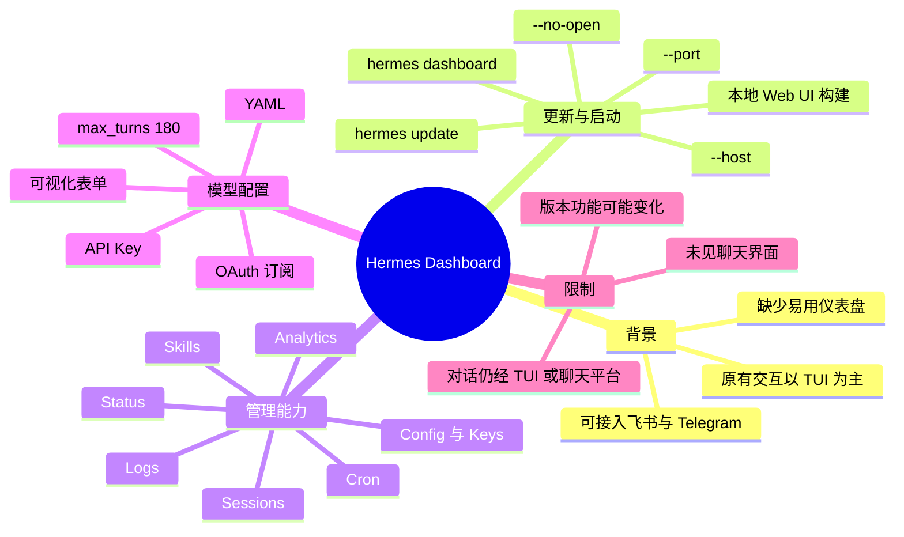
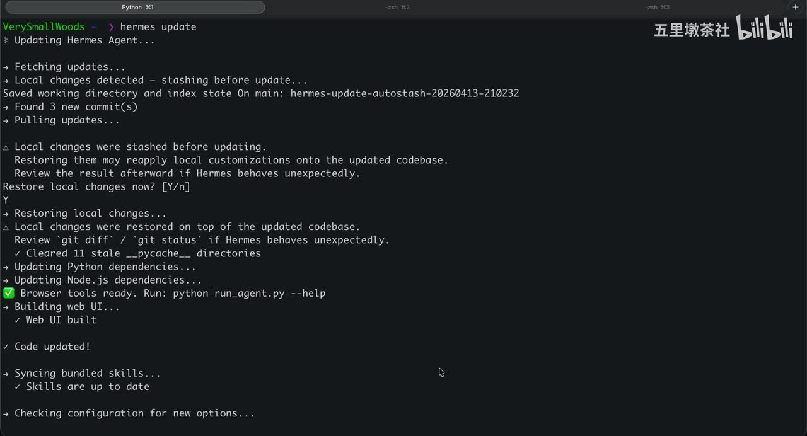
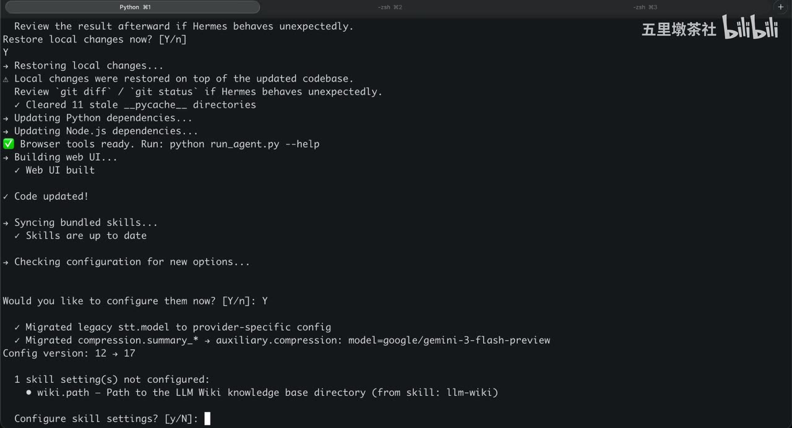
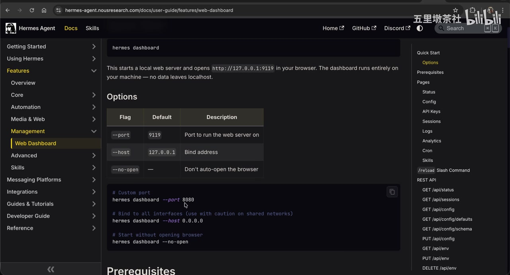

# 【Hermes Agent更新】Web UI上线

> 来源：[Bilibili 视频](https://www.bilibili.com/video/BV1vUQhBrEEn)<br>
> UP 主：五里墩茶社｜时长：06:33｜合集：AIcode  
> 本文只整理视频、站内字幕、ASR、关键帧及可获取热评中出现的信息；命令与功能均以视频演示版本为准。

## 小结

Hermes Agent 此次更新的核心是官方代码仓库已提供 Web UI，即 **Hermes Dashboard**。在此之前，视频称用户主要通过 TUI/命令行或飞书、Telegram 等 Channel 与 Hermes 交互；Dashboard 补足了对 Agent 状态、网关、会话、日志、分析、定时任务、技能和配置的可视化管理能力。

视频给出的基础操作路径是：已完成 Hermes 本地安装后，先执行 `hermes update` 更新；再以 `hermes dashboard` 构建并启动本地 Web UI。官方文档页面显示该服务默认在本机 `127.0.0.1:9119` 启动，支持通过 `--port` 更换端口、通过 `--host` 指定绑定地址，以及用 `--no-open` 阻止自动打开浏览器。

Dashboard 的定位是**管理和观测台，而不是聊天前台**。Status 可看 Agent、Gateway、Session 状态及会话来源；Sessions 能回看用户提示、工具执行与智能体输出；Analytics 用于查看 Token 总开销与 API 调用；Logs 用于排查异常；Cron、Skills、Config 与 Keys 分别服务于任务自动化、技能管理、模型参数和敏感凭据配置。

视频还演示了一个典型自动化用例：通过 Cron 定期获取 Hacker News 信息，抽取、整理后发送。新建任务只需填写名称、提示词和执行周期；但视频并未展示任务具体的 Cron 表达式格式、投递目标配置或失败重试机制，因此不能据此推断这些能力的完整实现细节。

配置方面，Dashboard 支持可视化表单和 YAML 两种形式；视频以将 `max_turns` 调为 `180` 为例，并说明模型可以通过 API Key 接入，也可以使用 OAuth 订阅授权。演示者已配置 OpenAI Codex 订阅，界面因此显示 `Disconnect`；Kimi 则以填入并保存 API Key 为例。

重要限制是：截至视频录制时，演示者认为 Dashboard **似乎没有内置聊天界面**，实际对话仍要通过 TUI 或聊天平台完成。由于这是开源项目且界面、命令、配置字段会持续演进，本文记录的是视频所示版本，不应视作当前最新版产品文档。

## 思维导图





## 目录

- [背景、更新内容与前置条件](#背景更新内容与前置条件)
- [更新 Hermes 并启动 Dashboard](#更新-hermes-并启动-dashboard)
- [状态、网关与多渠道会话](#状态网关与多渠道会话)
- [会话追踪、分析与日志](#会话追踪分析与日志)
- [Cron 自动化与技能管理](#cron-自动化与技能管理)
- [配置、模型与密钥](#配置模型与密钥)
- [限制、适用范围与时效性](#限制适用范围与时效性)
- [字幕比对](#字幕比对)
- [评论分析](#评论分析)
- [处理记录](#处理记录)

## 背景、更新内容与前置条件 [00:00:02](https://www.bilibili.com/video/BV1vUQhBrEEn?t=2)

视频将 Hermes Agent 介绍为近期受到关注的智能体产品。按演示者描述，更新前的交互主要有两条路径：

1. **TUI/命令行界面**：通过命令行直接操作 Hermes。
2. **Channel 接入**：可配置外部消息渠道，视频点名飞书（Lark/Feishu）和 Telegram。

问题在于，虽然渠道支持较全，但 Hermes 缺少一个“好用的仪表盘”或 Web UI。此次更新后的官方 Web UI 已在代码仓库中提供，名称为 **Hermes Dashboard**。视频的目标不是从零安装，而是向已安装 Hermes 的用户展示如何更新，以及 Dashboard 能管理哪些内容。


> 图：封面直接点出“全新的 Web UI 上线”，用于界定本视频的新闻主题：Hermes Agent 新增官方 Dashboard，而非介绍一个第三方界面。

### 更新包含的相关变化 [00:01:01](https://www.bilibili.com/video/BV1vUQhBrEEn?t=61)

演示者强调，这一版本最重要的话题是 Web UI；此外，配置方面也有更新。视频还提到当前支持如 `llm.wiki` 一类技能，但明确表示本期暂不展开 Skill 的具体内容、安装方式或使用方法。

前置条件是本地已安装 Hermes，并且命令行中能够调用 `hermes`。未安装的用户被建议参考 UP 主此前的本地安装配置视频；本视频没有重复安装步骤，因此不能把它当作完整安装教程。

## 更新 Hermes 并启动 Dashboard [00:00:58](https://www.bilibili.com/video/BV1vUQhBrEEn?t=58)

### 1. 执行更新命令

视频的更新命令为：

```bash
hermes update
```

关键帧显示，更新流程会拉取更新、处理本地改动、更新 Python 与 Node.js 依赖、构建 Web UI，并同步捆绑技能。画面还出现了本地改动恢复与配置迁移提示，说明已有本地定制的用户需要额外注意更新后的兼容性。



> 图：该帧展示 `hermes update` 的实际终端输出，包括“Local changes detected”、依赖更新与“Building Web UI / Web UI built”。其价值在于提示：更新不仅是拉取代码，本地修改可能被暂存并恢复，更新后应检查行为是否符合预期。

关键帧中的终端提示还包括以下风险信息：

- 检测到本地改动时，更新过程会先暂存它们；
- 恢复本地改动到更新后的代码库上，可能导致定制行为与新版本不兼容；
- 终端建议在行为异常时检查 `git diff`、`git status`；
- 演示中清理了 `11` 个陈旧的 `__pycache__` 目录；
- 配置版本从 `12` 迁移到 `17`；
- 有一个未配置的 Skill 设置：`wiki.path`，即 LLM Wiki 知识库目录。

这些都是**画面中该演示环境的更新输出**，不能推导为每位用户升级时都会发生同样的迁移或清理数量。



> 图：该帧显示配置迁移、`Config version: 12 -> 17` 与 `wiki.path` 尚未配置的提示。它补充说明升级后可能需要进入交互式配置，尤其是已使用相关技能的用户。

### 2. 启动 Dashboard

更新完成后，视频用以下命令启动 Dashboard：

```bash
hermes dashboard
```

视频称该命令会构建并启动 Web UI。更多配置可在官方文档的 **Management → Web Dashboard** 章节查看。

关键帧中的文档页面给出以下明确参数与默认值：

| 参数 | 默认值/示例 | 视频与画面所示含义 |
| --- | --- | --- |
| `--port` | 默认 `9119`；示例 `8080` | 指定 Web 服务运行端口 |
| `--host` | 默认 `127.0.0.1`；示例 `0.0.0.0` | 指定绑定地址 |
| `--no-open` | 无默认值 | 不自动打开浏览器 |
| 服务地址 | `http://127.0.0.1:9119` | 文档画面显示的默认本地地址 |

```bash
# 指定端口
hermes dashboard --port 8080

# 绑定到所有网络接口；文档提示共享网络场景应谨慎
hermes dashboard --host 0.0.0.0

# 启动服务但不自动打开浏览器
hermes dashboard --no-open
```



> 图：该帧展示官方文档的 Options 表与命令示例，明确给出默认端口 `9119`、默认 Host `127.0.0.1`、`--no-open` 的作用，以及绑定 `0.0.0.0` 时需要谨慎的提示，是理解部署边界的关键证据。

### 实操建议

1. **先确认更新状态**：尤其是已有本地改动或自定义配置时，先阅读更新终端的迁移、暂存和恢复信息。
2. **优先本地绑定**：视频文档页面默认绑定 `127.0.0.1`。若改用 `0.0.0.0`，意味着服务可被其他网络设备访问的可能性增加；而 Dashboard 涉及会话、日志和 Key，应审视网络隔离与访问控制。
3. **需要无头或远程操作时使用 `--no-open`**：避免启动服务时自动弹出浏览器。
4. **升级后检查 Skill 配置**：如果终端提示 `wiki.path` 等字段未配置，需结合自己的技能使用需求补齐，不能忽略配置迁移结果。

## 状态、网关与多渠道会话 [00:02:04](https://www.bilibili.com/video/BV1vUQhBrEEn?t=124)

### Status：统一查看 Agent、Gateway 与 Session

Status 标签页显示：

- 当前 **Agent** 状态及版本；
- **Gateway** 是否已启动；
- 最近的 **Session（会话）**；
- 每个会话的来源标签。

在视频的初始状态中，Agent 处于活跃状态，但 Gateway 尚未启动。下方最近会话会标出来源，例如：

- 命令行；
- 由 Cron Job 触发的定时任务；
- 飞书渠道。

这意味着 Dashboard 将分散的调用入口集中到同一视图中，便于运维人员判断会话从哪里产生，而不是只看无来源的聊天记录。

### 启动 Gateway 并确认 Channel [00:02:32](https://www.bilibili.com/video/BV1vUQhBrEEn?t=152)

视频使用以下命令启动网关：

```bash
hermes gateway
```

启动后刷新 Dashboard，可看到 Gateway 正常启动，并出现更多已连接平台的信息。演示环境中接入了：

- Telegram；
- 飞书。

视频显示两者均保持连接、状态正常。需要注意：这只是演示者环境中的连接结果，视频没有展示 Telegram 或飞书的授权步骤、权限范围、消息路由规则，也没有说明是否支持其他渠道。

### 管理经验

- Agent 处于 active 并不等于 Gateway 已可接收外部渠道消息；需要单独确认 Gateway 状态。
- 对外部 Channel 的排障可以先从 Dashboard 的连接状态入手，再回到 Logs 查看实际运行记录。
- 会话来源是追踪自动任务、命令行调试和消息渠道输入的重要上下文，应在成本或异常分析时一并查看。

## 会话追踪、分析与日志 [00:02:55](https://www.bilibili.com/video/BV1vUQhBrEEn?t=175)

### Sessions：回看提示、工具执行和输出

视频以一个 Hacker News 定时任务为例说明 Sessions：

1. 在会话列表中选择一个已完成会话；
2. 可查看该任务做了什么；
3. 查看用户级提示词；
4. 查看定时任务工具的执行情况；
5. 查看最终的智能体输出。

因此，Sessions 不只是对话历史列表，也承担了对智能体任务链路的回溯作用。若要删除会话，视频称可点击小垃圾桶图标直接删除。

> 视频只说明了删除入口，并未说明删除是否不可恢复、是否同步删除日志、是否影响统计数据或外部渠道记录；执行删除前应自行确认当前版本行为。

### Analytics：关注 Token 与 API 调用 [00:03:34](https://www.bilibili.com/video/BV1vUQhBrEEn?t=214)

演示者称自己使用量不多，故演示面板中的消耗较低。该页主要用于关注：

- 整体 Token 开销；
- API 调用量；
- 对话过程的总体成本。

如果希望进一步理解单次对话中的提示词规模，视频建议回到 Sessions 获取更多细节。也就是说：

- **Analytics** 适合总览消耗趋势与调用量；
- **Sessions** 更适合定位到具体会话、提示词、工具过程和输出。

这是一种可迁移的智能体运维思路：总览发现成本异常后，按 Session 追溯任务来源和输入规模，而不是只依赖聚合图表。

### Logs：异常排查入口 [00:04:03](https://www.bilibili.com/video/BV1vUQhBrEEn?t=243)

Logs 标签页列出了 Hermes Agent 的完整运行日志。视频明确建议：使用中遇到问题，特别是异常情况时，应到 Logs 进行检查。

结合视频所示模块，推荐的排障顺序可以是：

1. 在 **Status** 确认 Agent 与 Gateway 是否正常；
2. 在 **Channel** 相关状态确认平台是否连接；
3. 在 **Sessions** 定位问题会话，核对提示词、工具执行和输出；
4. 在 **Logs** 查看完整运行记录；
5. 如果是成本问题，再在 **Analytics** 看 Token 与 API 调用概况。

此顺序是根据视频展示的各页面职责整理的工作流，不代表 Hermes 官方规定的唯一排障流程。

## Cron 自动化与技能管理 [00:04:17](https://www.bilibili.com/video/BV1vUQhBrEEn?t=257)

### Cron：创建定时信息处理任务

Cron 页面列出所有定时任务。演示环境中只有一个任务，其目标是每天定时：

1. 获取 Hacker News 的有用信息；
2. 对信息进行抽取和整理；
3. 将整理结果发送给演示者。

在 Dashboard 中创建新任务的操作要素为：

1. 填写任务名称；
2. 填写提示词；
3. 设置任务执行周期。

视频未展示具体表单字段、Cron 表达式语法、时区、消息发送通道、失败后处理、最大执行时长和并发限制。因此，以上仅能作为界面操作的最小流程，不能直接用于推断生产环境的可靠性配置。

### Skills：管理 Agent 技能包 [00:04:41](https://www.bilibili.com/video/BV1vUQhBrEEn?t=281)

Skills 被演示者称为非常有用的板块，用于列出并管理技能包。视频的更新部分提到 `llm.wiki` 技能；更新过程的关键帧则出现 `wiki.path` 未配置，表明至少在该演示版本中，LLM Wiki 技能需要指定知识库目录。

可得出的结论是：

- Dashboard 提供了技能包的管理入口；
- 部分技能可能有额外配置前提；
- 本视频没有演示技能启停、安装、卸载、版本管理或权限控制，不能据此假定这些功能均已具备。

## 配置、模型与密钥 [00:04:52](https://www.bilibili.com/video/BV1vUQhBrEEn?t=292)

### Config：表单与 YAML 两种配置方式

Config 中首先是模型配置。视频明确指出有两种编辑形式：

| 方式 | 用途 |
| --- | --- |
| 可视化表单 | 适合直接、直观地修改配置项 |
| YAML 显示/编辑 | 适合查看和直接操作结构化配置 |

视频示例是将 `max_turns` 改为 `180`，然后点击右上角 **Save** 保存：

```yaml
max_turns: 180
```

该字段名以站内高质量中文字幕 `p01-zh.srt` 为准。其他 AI 生成字幕曾写成 `max turn`，但站内中文字幕明确给出 `max_turns`。视频没有解释该参数的精确定义、默认值、上限或改大后的成本与上下文影响，因此不应把 `180` 视为通用推荐值。

### Keys：API Key 与 OAuth 订阅 [00:05:16](https://www.bilibili.com/video/BV1vUQhBrEEn?t=316)

Keys 标签页被演示者强调为隐私敏感部分，可配置：

- 模型 API Key；
- OAuth 订阅授权。

视频所示的订阅授权方式有两种：

1. 点击 **Login**，通过浏览器登录并授权；
2. 点击 **CLI**，获得命令行命令后手动执行。

演示者已经配置 OpenAI Codex 订阅，因此界面显示 **Disconnect**。下方还会列出模型服务商，通常以 API Key 集成；视频以 Kimi 为例，输入 `Kimi API Key` 后保存。

### 安全与使用边界

- API Key、OAuth 订阅与会话记录均可能属于高敏感数据；不要因 Dashboard 是本地 Web UI 就忽视系统账户、浏览器会话、网络暴露和机器访问权限。
- 将 Host 从默认 `127.0.0.1` 改为 `0.0.0.0` 前，应先理解该变化会扩大服务可访问范围。视频文档画面也对共享网络环境使用该设置提示“谨慎”。
- 视频只展示了 API Key 的录入与保存，没有说明密钥存储位置、加密方式、日志脱敏规则、权限模型或轮换机制，这些均需以实际版本文档和代码为准。

## 限制、适用范围与时效性 [00:05:59](https://www.bilibili.com/video/BV1vUQhBrEEn?t=359)

### 当前限制

视频结束前明确指出：当前 Dashboard 中**似乎尚未提供对话界面**。因此，用户仍需通过以下方式进行实际对话：

- TUI；
- 已配置的聊天平台，例如视频中提到的飞书、Telegram。

演示者同时保留了不确定性：若聊天界面隐藏在某处，他本人尚未发现。这不是官方“绝对没有聊天功能”的公告，只能表述为**视频演示者在录制版本中未找到聊天入口**。

### 适合谁使用

Dashboard 更适合以下需求：

- 已有 Hermes 安装环境，想减少纯命令行管理负担的用户；
- 接入多个渠道后，需要集中看 Gateway、Channel 和会话来源的用户；
- 需要检查 Token 成本、API 调用、任务执行和运行日志的智能体维护者；
- 希望通过界面创建和管理定时任务、技能、模型参数和凭据的用户。

不适合将其直接当作完整聊天产品：视频中没有演示 Dashboard 内聊天、多人协作权限、远程认证、任务重试策略或生产级安全治理。

### 时效性说明

- 视频时长为 393 秒，内容是一次更新演示，界面、命令和配置字段可能已在后续版本变化。
- 文中端口 `9119`、Host `127.0.0.1`、`--no-open`、`max_turns: 180`、OpenAI Codex 与 Kimi 示例均来自视频画面或字幕，应以当前 Hermes 官方文档和实际命令帮助为最终依据。
- 热评中有用户报告长任务 Token 消耗和上下文遗忘问题，但这属于个人使用反馈，并未由视频或官方数据验证，不能当成产品性能结论。

## 字幕比对

| 字幕来源 | 完整性 | 专有名词 | 时间轴 | 主要问题 |
| --- | --- | --- | --- | --- |
| Bilibili 站内中文字幕 `p01-zh.srt` | 完整，覆盖约 00:00:00–00:06:32 | 较准确：`TUI`、`hermes update`、`hermes dashboard`、`hermes gateway`、`max_turns`、`OAuth`、`CLI`、`Keys` 等均可辨识 | 分段细，适合作为章节时间轴依据 | 个别口语断句，未展示具体命令参数的全部细节 |
| Bilibili AI 中文字幕 `p01-ai-zh.srt` | 完整 | 存在多处误识别，如 `TUY`、`HARMONUPDATE`、`HERMESGWAY`、`yo`、`CRI`、`OOS`、`kiss` | 时间轴可用 | 专有名词和界面标签错误较多，不作为主依据 |
| 本次 ASR `medium` | 完整度高：语音覆盖率 `0.9932`，17 段，约 00:00:00–00:06:32 | 基础内容基本一致 | 有时间戳，但每段约 24 秒，粒度较粗 | 将“命令行”误作“迷你行”，飞书误作 Facebook，`cron job` 误作 ChromeJob，`YAML`、OAuth、CLI 等多处识别不稳定 |
| 英文/西班牙语/阿拉伯语/葡萄牙语站内 AI 字幕 | 覆盖完整 | 可辅助核对 Dashboard、Gateway、Sessions、Analytics 等英文 UI 名称 | 有效时间轴 | 为机器翻译，部分词汇与命令转写有偏差，不作为中文技术术语主来源 |

### 最终字幕选择与校正

本文以 **Bilibili 站内人工样式中文字幕 `p01-zh.srt`** 为主要文字与时间轴依据，并逐段核查本次 ASR；需要确认参数和命令时，再结合关键帧中的终端与官方文档画面校正。

本次 ASR 诊断没有 `noAudioStream=true` 标记；相反，素材显示存在音轨，ASR 识别语言为中文，语言置信度 `0.99560546875`，语音覆盖率 `0.9932`。因此没有将视频当作无音轨素材处理。

重点校正项如下：

| 误识别/不稳定写法 | 采用的校正写法 | 校正依据 |
| --- | --- | --- |
| `TUY`、迷你行界面 | `TUI` 命令行界面 | 站内中文字幕 |
| `HARMONUPDATE` | `hermes update` | 站内中文字幕与终端关键帧 |
| `HERMESGWAY` | `hermes gateway` | 站内中文字幕 |
| `ChromeJob` / `chrome` | `Cron Job` / `Cron` | 站内中文字幕 |
| `yo` / 压模 | `YAML` | 站内中文字幕 |
| `Max Turn` | `max_turns` | 站内中文字幕 |
| `OOS` / `OS` | `OAuth` | 站内中文字幕 |
| `CRI` | `CLI` | 站内中文字幕 |
| `kiss` | `Keys` | 站内中文字幕 |
| Facebook | 飞书（Feishu/Lark） | 站内中文字幕及上下文 |

## 评论分析

以下仅分析可获取的热评前三条。评论反映的是用户个人感受或玩笑，不构成已验证的产品事实。

1. **MRLSmrls（33 赞）**  
   - 观点：认为 Hermes 比 OpenClaw 更容易上手，OpenClaw 太难，不敢使用。  
   - 补充价值：从用户体验角度支持了本视频的一个隐含价值——Dashboard 和较直观的管理入口可能降低使用门槛。  
   - 局限：没有说明版本、安装环境、具体任务或比较标准，因此“更简单”只能作为主观评价。

2. **抓一只瓜娃子（25 赞）**  
   - 观点：自称使用 4 天、消耗“6 亿多 Token”、使用 GPT-5.4 后，认为 Hermes 不如 OpenClaw；其判断是 Hermes 适合简单短任务，而长任务会遗忘前文。  
   - 补充价值：提出了长任务上下文保持与 Token 成本两个需要重点验证的风险维度，恰好与视频中的 Analytics、Sessions 功能相关。  
   - 局限与争议：Token 数量、模型名称、任务结构、上下文窗口、计费规则和日志均未提供，无法独立核验；也不能据此得出 Hermes 普遍不适合长任务的结论。

3. **17446675236_bili（25 赞）**  
   - 观点：调侃自己前一天刚让 Hermes 写了一个 Web UI，官方当天就上线官方 Web UI。  
   - 补充价值：侧面反映官方 Dashboard 上线前，用户可能已有自行补齐界面的需求。  
   - 局限：这是时间巧合式的个人表达，不提供功能、性能或兼容性证据。

## 处理记录

- Worker ID：`worker-mrj0www4-e8d79408`
- 模型：`gpt-5.6-terra`
- 任务素材：Bilibili 元数据、站内时间轴字幕、ASR 结果、12 张关键帧路径清单、可获取热评前三条。
- ASR 检查：已检查 `asr/asr-result.json`。模型为 `medium`，语言为中文，置信度 `0.99560546875`，时长 `392.8584375` 秒，语音覆盖率 `0.9932`；未见 `noAudioStream=true`，因此按有音轨视频处理。
- 字幕选择：以站内 `p01-zh.srt` 为主，因为其时间轴细、中文技术词和命令转写更可靠；本次 ASR 用于覆盖完整性核验；多语种 AI 字幕仅作辅助比对。
- 时间轴依据：章节链接优先采用 `p01-zh.srt` 的实际起始时间换算秒数，例如 `00:02:04,466` 对应 `t=124`。
- 关键帧选择依据：
  - `frames/frame-001.jpg`：视频主题封面，确认“全新 Web UI 上线”；
  - `frames/frame-002.jpg`：展示 `hermes update`、依赖更新和 Web UI 构建；
  - `frames/frame-003.jpg`：展示配置迁移、`wiki.path` 未配置及缓存目录清理；
  - `frames/frame-004.jpg`：展示官方 Web Dashboard 文档、默认端口/Host 与启动参数。
- 关键帧未选用说明：其余帧虽在素材清单中，但未提供对应画面内容描述；为避免对未见画面作推断，未强行插入正文。
- 缓存清理：视频终端画面显示 Hermes 更新过程中清理了 `11` 个陈旧 `__pycache__` 目录；本知识整理任务本身未提供独立缓存清理执行记录，故不编造清理结果。
- 未解决问题：
  - 视频未展示 Dashboard 的完整认证、网络安全、密钥存储与权限机制；
  - 未展示聊天界面是否在后续版本加入；
  - 未展示 Cron 的表达式格式、失败重试和投递配置；
  - 热评涉及的长任务能力与高 Token 消耗缺乏可核验运行数据。
