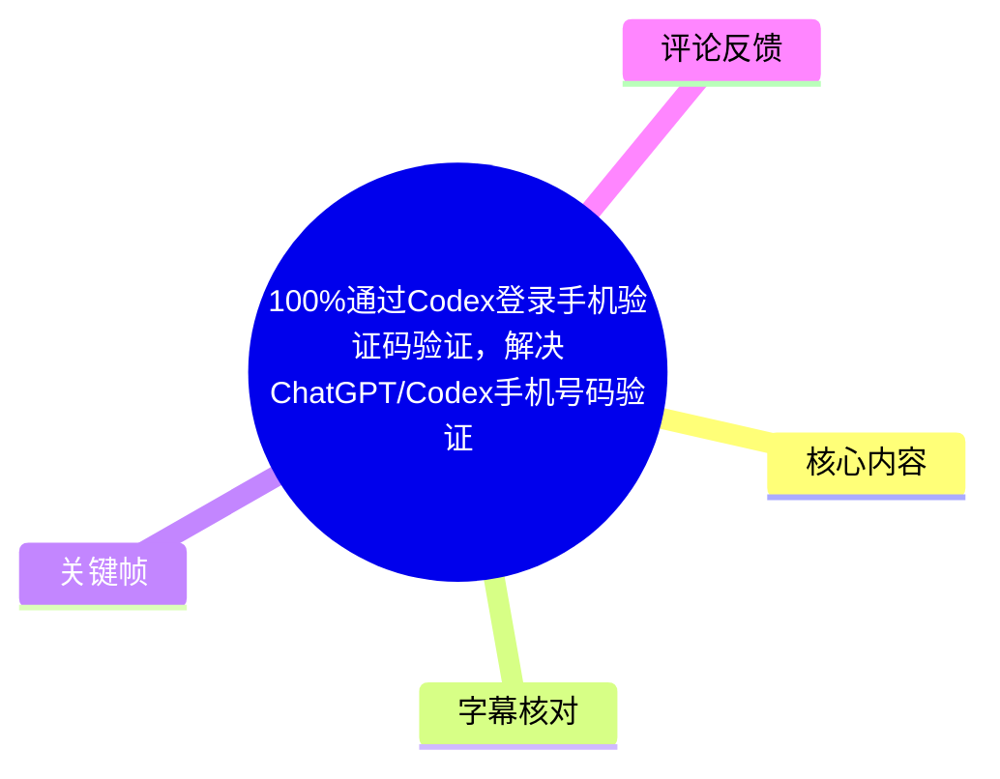
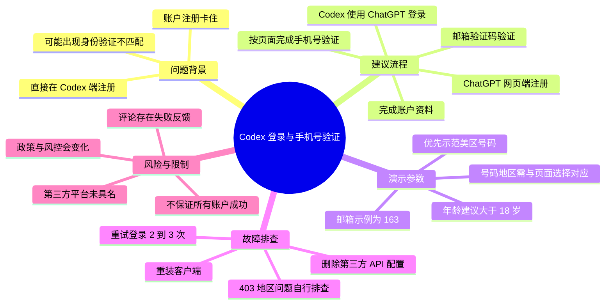
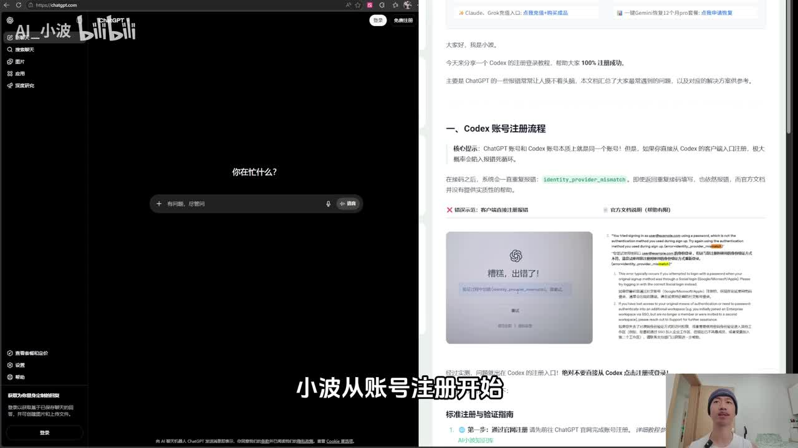
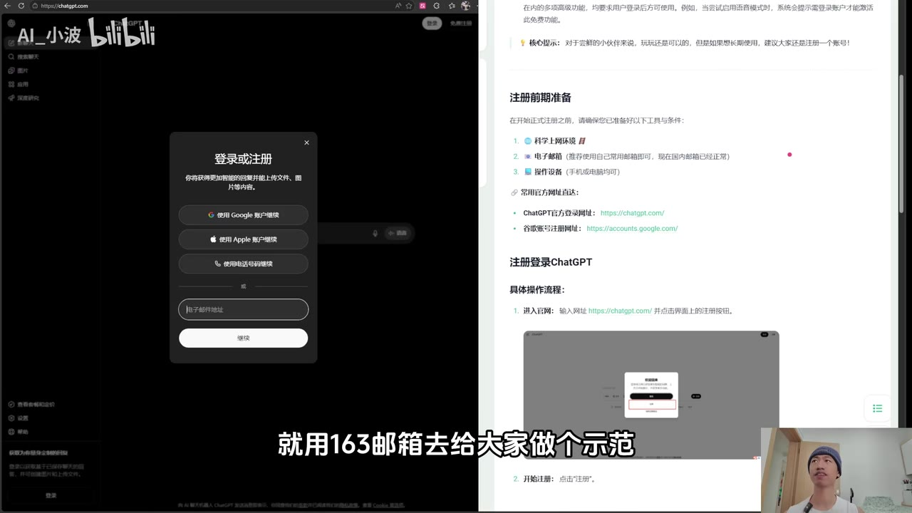
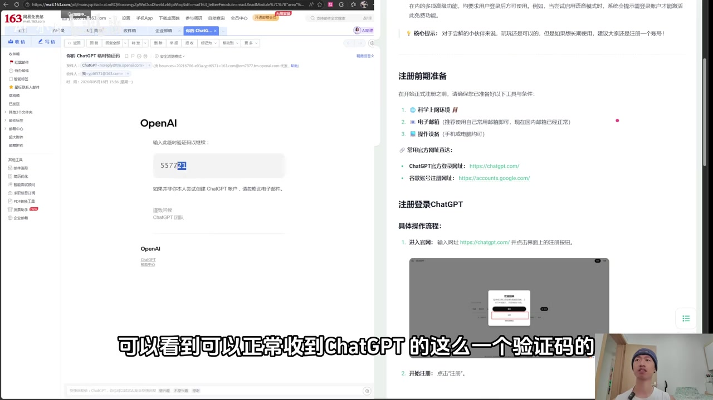
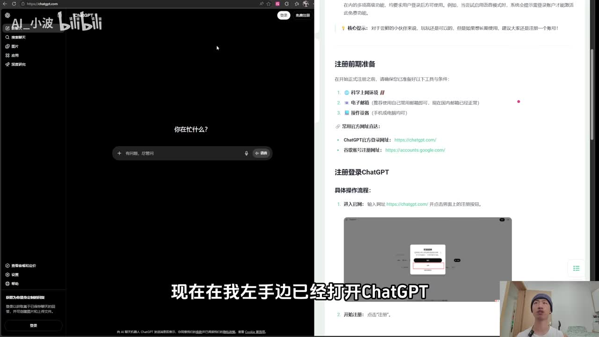

# 100%通过Codex登录手机验证码验证，解决ChatGPT/Codex手机号码验证、风控弹窗等问题

> 来源：[Bilibili 视频](https://www.bilibili.com/video/BV1zkLw6jEQ8) 
> UP 主：AI_小波｜时长：03:14｜合集：AIcode  
> 注：视频元数据中的发布时间与素材抓取时间存在先后矛盾；本文保留元数据换算结果，不据此推断实际发布状态。

## 小结

视频演示的核心路径是：**先在 ChatGPT 网页端完成账户注册，再在 Codex 客户端或编辑器插件中选择“使用 ChatGPT 继续”登录，最后按页面要求完成手机号验证**。UP 主认为，直接在 Codex 端开始注册，可能出现 `identity_provider_mismatch`（画面文档中可见）或身份验证不匹配类错误，因此应避免这一顺序。

注册示例使用了 **163 邮箱**：输入邮箱、从邮箱取得 ChatGPT 验证码、填写姓名及年龄（视频口述建议大于 18 岁）、完成账户创建。视频仅展示该邮箱在演示时能够收到验证码，不能由单次展示推导出所有国内邮箱、所有地区或所有账户均可成功。

进入 Codex 后，UP 主称 Codex 客户端与 VS Code 中的相关 GPT/Codex 插件遵循相同的登录思路：选用已有 ChatGPT 账户继续，随后进入手机号验证。视频提到可自行参考一份汇总文档选择号码验证平台，但**未在素材中明确具体平台名称、服务条款、资费、号码归属或合法性**；不应将其扩展理解为对第三方接码服务有效性或合规性的背书。

针对登录失败，视频提供了三个排查方向：先尝试重复登录 **2～3 次**；如果配置过第三方 API，则删除配置文件后重新安装；如果报错为 **403 且提示国家/地区不符合**，UP 主归因于网络/地区环境问题，并明确表示无法代为处理。

标题和置顶评论中的“100% 成功”均属于 UP 主在特定流程与当时环境下的主张，而非本视频能够独立证明的普遍结论。热评中已有用户反馈付费后仍无法使用，说明实际结果可能受账户状态、地区、网络、服务策略及第三方服务质量影响。验证码、地区限制与风险控制策略具有高度时效性，应以服务官方当前规则为准。

## 思维导图

## 目录

- [背景：为何不要直接在 Codex 端注册](#背景为何不要直接在-codex-端注册)
- [ChatGPT 网页端账户注册](#chatgpt-网页端账户注册)
- [在 Codex 中使用既有 ChatGPT 账户登录](#在-codex-中使用既有-chatgpt-账户登录)
- [手机号验证演示与地区匹配](#手机号验证演示与地区匹配)
- [登录结果与故障排查](#登录结果与故障排查)
- [限制、风险与时效性](#限制风险与时效性)
- [字幕比对](#字幕比对)
- [评论分析](#评论分析)
- [处理记录](#处理记录)

## 背景：为何不要直接在 Codex 端注册 [00:00:22](https://www.bilibili.com/video/BV1zkLw6jEQ8?t=22)

UP 主开场称，Codex 热度较高，但部分用户在注册账户阶段受阻。其给出的判断是：**不要直接从 Codex 软件端发起注册**，否则“会”遇到身份验证不匹配类错误；正确顺序应是先打开 ChatGPT 网站并注册账户。

关键帧左侧为 ChatGPT 网页，右侧为配套文档。文档标题为“Codex 账号注册流程”，画面中可辨识 `identify_provider_mismatch` 相关提示，并以红叉标出“客户端直接注册报错”的情形。这支持视频确实在讨论“客户端直接注册”与身份提供方不匹配错误的关系；但该画面并不能证明错误必然发生，更不能证明对所有 Codex 版本、地区和账户均适用。

> 图：画面同时呈现 ChatGPT 网页和注册流程文档，其中列举了身份提供方不匹配相关错误。它说明视频建议先完成 ChatGPT 账户注册的上下文与理由。

## ChatGPT 网页端账户注册 [00:00:24](https://www.bilibili.com/video/BV1zkLw6jEQ8?t=24)

视频在 ChatGPT 网页端演示以下操作：

1. 打开 ChatGPT 网站，点击“免费注册”。
2. 输入邮箱地址并继续。
3. 视频口述称 QQ 邮箱、163 邮箱等国内邮箱均可填写；本次演示选择 **163 邮箱**。
4. 进入邮箱查看来自 ChatGPT/OpenAI 的验证码。
5. 将验证码复制回注册页面并继续。
6. 填写姓名。UP 主称姓名“随便填”。
7. 填写年龄；视频口述建议年龄“**一般是大于 18 岁**”。
8. 点击完成账户创建；随后跳过部分引导并继续。

“国内邮箱均支持”“姓名可随意填写”等说法均为视频口述，未附官方规则或服务条款验证。账户资料应如实填写，并遵循服务方的年龄、地区及身份验证要求。

> 图：ChatGPT 的“登录或注册”弹窗显示可通过 Google、Apple、手机号或电子邮件地址继续；这与视频选择电子邮箱注册的步骤相对应。

> 图：163 邮箱页面展示来自 OpenAI 的验证码邮件，是视频“邮箱可收验证码”这一演示结果的直接画面依据。验证码属于敏感一次性凭据，实际操作中不应向他人泄露。

### 演示中可提取的参数与条件

| 项目 | 视频内容 | 适用边界 |
| --- | --- | --- |
| 注册入口 | ChatGPT 网页端“免费注册” | 页面文案和入口可能随版本变化 |
| 邮箱示例 | 163 邮箱 | 仅证明演示账户在当时收到邮件 |
| 邮箱类别 | 视频称 QQ、163 等国内邮箱可用 | 未获得官方普遍性保证 |
| 年龄 | 口述“一般大于 18 岁” | 应以服务官方年龄政策与所在地区法律为准 |
| 验证方式 | 邮箱验证码 | 验证码时效、发送频率与拦截情况会变化 |

## 在 Codex 中使用既有 ChatGPT 账户登录 [00:01:13](https://www.bilibili.com/video/BV1zkLw6jEQ8?t=73)

ChatGPT 账户创建完成后，视频转到 Codex 登录：

1. 打开 Codex 软件。
2. 在登录界面选择“**使用 ChatGPT 继续**”。
3. 页面会显示刚刚注册完成的 ChatGPT 账户。
4. 选择该账户并继续。
5. 在后续页面进行手机号验证。

UP 主称，无论是 Codex 客户端，还是 VS Code 中的相关 GPT/Codex 插件，登录思路都相同。该表述描述的是视频作者的使用经验，实际选项名称、支持的编辑器插件与登录授权流程会随产品版本变动。

> 图：右侧文档列有“注册前期准备”“注册登录 ChatGPT”等段落，左侧为 ChatGPT 页面。该画面有助于理解视频把“先建 ChatGPT 账户”作为 Codex 登录前置步骤的安排。

## 手机号验证演示与地区匹配 [00:01:37](https://www.bilibili.com/video/BV1zkLw6jEQ8?t=97)

视频将手机号验证描述为在 Codex 中登录既有 ChatGPT 账户后的下一步。UP 主提到有一份外部教程汇总了号码验证平台，并称不同平台“操作步骤都一样”；随后以“通过任意一个平台获取号码”的假设示例继续演示。

素材中可确认的操作逻辑是：

1. 获取一个待填写的号码。
2. 将号码复制到 Codex 的手机号验证输入位置。
3. **号码归属地区必须与界面所选地区相对应。**
4. 视频示例称自己“优先选美区”，因此没有修改地区选项。
5. 点击继续后，返回号码服务处查看是否收到验证码。
6. 将收到的验证码填回 Codex 验证页面，点击继续。
7. 页面通过后，再点击继续进入 Codex。

### 必须注意的限制

- 视频没有展示或点名任何具体第三方号码平台，无法核验其价格、稳定性、隐私处理、号码来源、是否支持目标服务或是否符合服务条款。
- 手机号验证通常用于账号安全、反滥用与地区资格控制。使用并非本人合法控制的号码、共享号码或绕过地区/身份限制，可能导致验证失败、账户限制、隐私泄露或违反平台规则。
- “选择其他地区号码”及“美区”的内容仅是视频中的演示表述。号码地区、实际网络环境、账户注册地区与服务可用地区之间的关系，不能仅靠视频流程解决。
- 本文不补充视频未提供的平台、号码来源或规避方案；应优先使用本人可合法控制的号码，并遵循 OpenAI/Codex 及当地法律的现行要求。

## 登录结果与故障排查 [00:02:25](https://www.bilibili.com/video/BV1zkLw6jEQ8?t=145)

视频在完成验证码填写后，展示 Codex 已进入可交互状态，并向其提出一个问题，画面结果显示能够正常回复。UP 主将此作为本次演示账户成功登录的结果。

随后，视频按优先级给出排查建议：

| 顺序 | 视频建议 | 说明 |
| --- | --- | --- |
| 1 | 尝试重新登录 **2～3 次** | UP 主认为部分错误可能通过重复登录恢复；未说明适用的报错类别或原因。 |
| 2 | 如已配置第三方 API，先删除配置文件，再重新安装 | 这是针对已有第三方 API 配置的建议；视频未给出配置文件位置、文件名、备份方式或删除范围。操作前应自行备份重要配置。 |
| 3 | 若持续报错 403 且显示国家/地区不符合，检查网络/地区环境 | UP 主将其归为“魔法问题”，并表示需用户自行解决、无法代办。该结论是经验判断，并非官方故障码说明。 |

视频最后称，详细文档可查看评论区置顶评论。可获取的置顶热评确实提供了一个外部链接，但其页面内容未包含在本任务素材中，因此本文不对该链接内的步骤、平台或承诺作进一步转述或验证。

## 限制、风险与时效性 [00:02:50](https://www.bilibili.com/video/BV1zkLw6jEQ8?t=170)

1. **“100% 成功”不可视为通用保证。** 这是标题、视频描述和 UP 主置顶评论中的主张；视频只演示了一次成功流程，且热评中已有“充值 7 元后不好使”的反例反馈。
2. **服务规则会变化。** ChatGPT/Codex 的注册资格、手机号验证、地区支持、风控策略、客户端登录入口以及插件集成均可能更新。本文依据的是时长 03:14 的视频素材与抓取时的文本，而非官方长期承诺。
3. **403 的成因不止一种。** 视频将“国家/地区不符合”的 403 归为网络/地区问题，但 403 还可能与账户权限、组织策略、反滥用控制或服务端策略有关；应结合完整错误信息与官方支持渠道判断。
4. **第三方服务有额外风险。** 视频提及但未具名的号码平台可能涉及付费、号码复用、短信延迟、隐私与账号安全风险。不要将验证码、账户密码、会话令牌或支付信息交给不可信主体。
5. **账号信息应真实、合规。** 视频中“姓名随便填”的口述不应替代平台要求。注册与验证时应使用真实、合法、由本人控制的信息，并避免违反服务条款或地区规定。

## 字幕比对 [00:00:22](https://www.bilibili.com/video/BV1zkLw6jEQ8?t=22)

| 字幕来源 | 完整性 | 专有名词 | 时间轴 | 主要问题 |
| --- | --- | --- | --- | --- |
| Bilibili 站内字幕 | 未提供可用字幕 | 无法评估 | 无法评估 | 素材清单提示字幕工具进程异常，且未提供站内 SRT 内容。 |
| 本次 ASR 字幕 | 覆盖 00:00:21.900—00:03:13.740；诊断语音覆盖约 88.5% | 存在较多误识别 | 8 个带起止时间的分段，可直接用于时间轴 | 开头约 22 秒无识别语音；“Codex”“ChatGPT”“VS Code”“验证码”“配置文件”等词存在混淆、错字或同音替代。 |

### 最终字幕选择与校正

最终以**本次 ASR 的带时间戳 SRT**作为章节定位依据：其共有 8 段，时间范围覆盖 21.900 秒至 193.740 秒；ASR 诊断未标记 `noAudioStream=true`，且提供了 `audio/audio.wav`，因此不能将字幕缺失归因为源视频无音轨。

站内字幕未提供可用内容，无法进行逐句文本一致性对照；但已检查本次 ASR 结果，并结合标题、元数据、关键帧画面和上下文对以下术语作审慎规范化：

| ASR 原始或近似识别 | 正文采用 | 校正依据 |
| --- | --- | --- |
| `Code X`、`Codescodex` | Codex | 视频标题、标签和上下文一致指向 Codex |
| `ChatGPD`、`GPB` | ChatGPT | 页面画面、标题与语义上下文 |
| `Risk口里面的GPD插件` | VS Code 中的相关 GPT/Codex 插件 | ASR 听辨不清；仅作保守语义归纳，不断言插件具体名称 |
| `号砂`、`号砲`、`号砝` | 手机号/号码验证 | 同段明确在描述填写号码与接收短信验证码 |
| `魔法问题` | 网络/地区环境问题 | 保留 UP 主原意，但不将其视为正式技术分类 |
| `identify_provider_mismatch` | 身份提供方不匹配相关错误 | 关键帧右侧文档中可辨识的英文错误标识 |

## 评论分析 [00:03:00](https://www.bilibili.com/video/BV1zkLw6jEQ8?t=180)

以下仅分析可获取的热评前三条，评论为用户观点或作者补充，不等同于已验证事实。

1. **Johndeppe（32 赞）**：称自己“充了 7 块钱”后仍然“不好使，完全没用”。  
   - 价值：提供了与“100% 成功”主张相反的实际失败反馈，提示第三方付费环节存在不确定性。  
   - 局限：评论未说明使用的平台、号码地区、账户状态、错误信息或完整操作过程，无法确定失败原因，也不能据此判断视频整体流程无效。

2. **AI_小波（22 赞，UP 主）**：称已结合常见流程错误优化文档，并附上“ChatGPT / Codex SMS Activation Guide”外部链接；再次声称按流程可“100% 注册成功”。  
   - 价值：说明视频外存在作者维护的补充文档，且该评论是视频中“看置顶评论获取文档”说法的对应来源。  
   - 局限：链接正文不在本任务素材内，无法核验其内容、更新时间、第三方服务推荐、可用性与合规性；“100%”仍是作者自述。

3. **硅基生物喵（9 赞）**：询问 Gemini 学生账号似乎被要求重新认证时应如何处理。  
   - 价值：反映观众可能将本视频的账户验证经验延伸到其他产品。  
   - 局限：Gemini 学生账号与 ChatGPT/Codex 是不同服务，该问题未在视频中回答，不能用本视频的流程作为 Gemini 认证方案。

## 处理记录 [00:03:13](https://www.bilibili.com/video/BV1zkLw6jEQ8?t=193)

- Worker ID：`worker-mrj0wjed-b0c290ad`
- 模型：`gpt-5.6-terra`
- 可用素材与工具产物：视频元数据、`merged.mp4`、`audio/audio.wav`、ASR 结果、ASR SRT、12 张关键帧路径、热评前三条；素材清单显示站内字幕工具曾报错：`Tool process exited with code 3221226505`。
- 字幕选择：站内字幕未提供可用内容；已检查本次 ASR，采用其 8 段 SRT 的真实起止时间生成时间轴。ASR 语言为中文，置信诊断语言概率为 `0.9970703125`，时间戳可用。
- 关键帧选择依据：选用 `frame-001.jpg` 展示“先注册 ChatGPT、避免直接客户端注册”的文档上下文；`frame-002.jpg` 展示注册准备与网页入口；`frame-003.jpg` 展示邮箱登录/注册方式；`frame-004.jpg` 展示 163 邮箱收到验证码。未对未提供画面内容描述的其余关键帧作臆测性引用。
- 缓存清理：素材未提供缓存清理执行记录，无法确认是否已清理；本文不虚构清理结果。
- 未解决问题：无法核验外部置顶链接内容、第三方号码平台、服务官方当前资格规则、403 的具体账户级原因；视频“100% 成功”主张缺乏可独立复现的全面证据。

## 评论分析

- 热评 1：试了，充了 7 块钱，不好使，完全没用
- 热评 2：结合了大家常见的流程错误，优化了一下文档 最新文档：https://blog.aixiaobo.cn/posts/chatgpt-codex-sms-activation-guide/ 目前按照流程跑，100%注册成功的
- 热评 3：up主gemini学生账号好像让重新认证了，这该怎么办呀[笑哭]

以上内容是观众反馈摘录，只用于补充理解视频反响，不作为正文事实依据。
