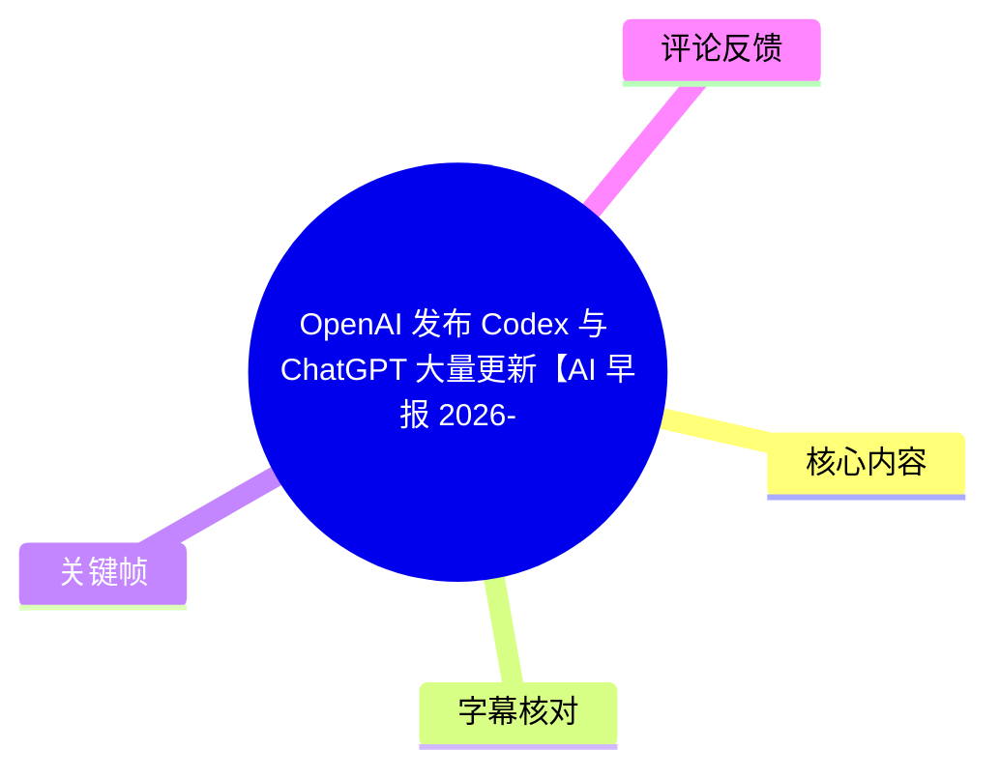
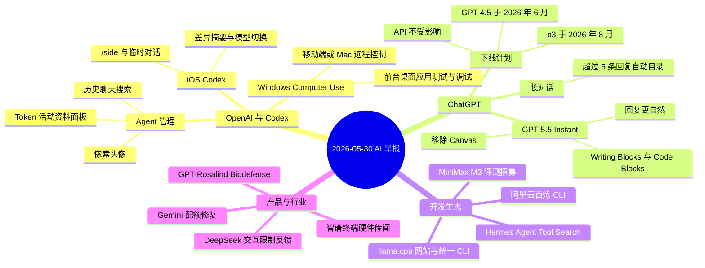
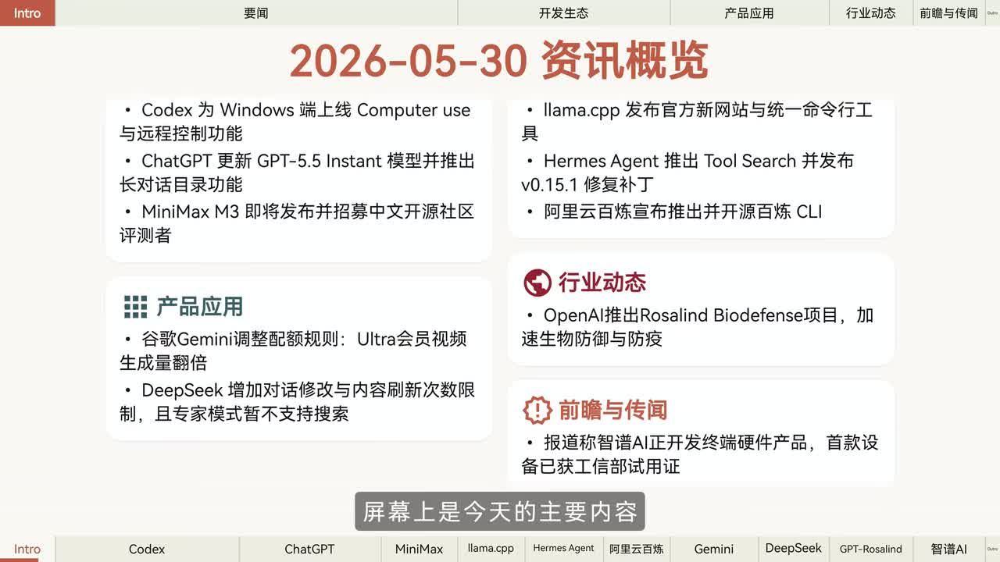
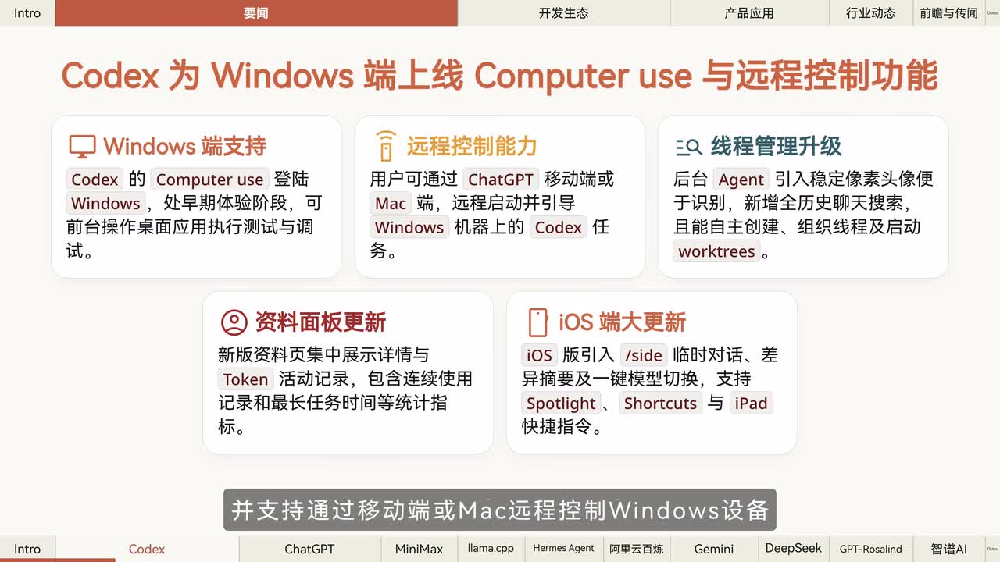
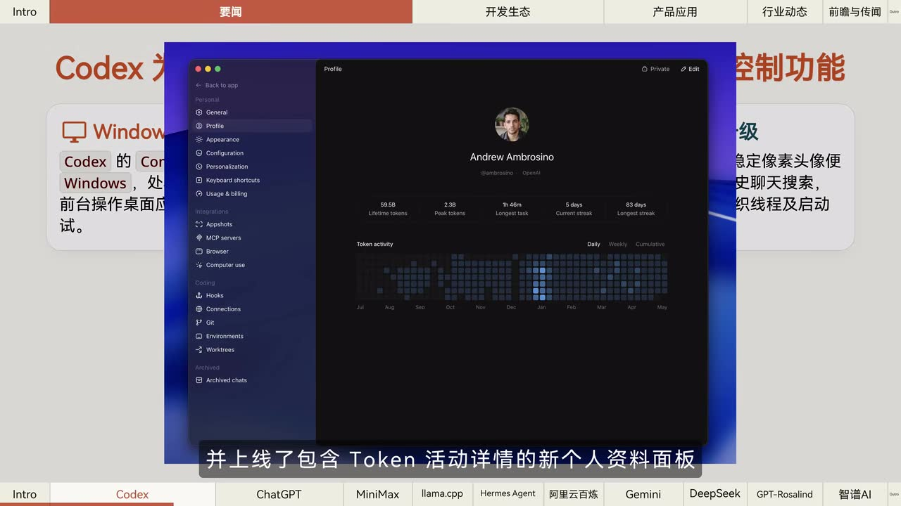
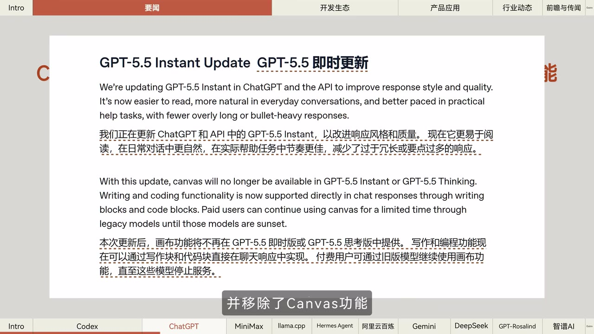

# OpenAI 发布 Codex 与 ChatGPT 大量更新【AI 早报 2026-05-30】

> 来源：[Bilibili 视频](https://www.bilibili.com/video/BV11pVM6iERu)  
> UP 主：橘鸦Juya｜发布时间：2026-05-30｜视频时长：02:52  
> 视频简介提供文字版及相关链接：<https://mp.weixin.qq.com/s/xAOF8DKdH0PkQGBKaRkS8g>

## 小结

这是一则 2026 年 5 月 30 日的 AI 行业晨报，重点是 OpenAI 对 Codex 与 ChatGPT 的密集更新：Codex 的 Computer Use 登陆 Windows 并处于早期体验阶段，可在前台操控桌面应用进行测试、调试；用户还能通过 ChatGPT 移动端或 Mac 远程启动和引导 Windows 设备上的 Codex 任务。

除 Windows 端能力外，Codex 的后台 Agent 增加了便于区分的像素头像、历史聊天搜索、可展示 Token 活动的个人资料面板，以及与线程和 worktree 相关的组织能力。iOS 端则加入 `/side`、临时对话、差异摘要、模型切换及 Spotlight、Shortcuts、iPad 快捷指令等功能。

ChatGPT 产品层面的更新包括 GPT-5.5 Instant 的回复风格与质量优化、移除 Canvas、以对话内 Writing Blocks 和 Code Blocks 承接写作与编程；当长对话包含 5 条以上回复时，系统会自动生成目录。视频同时提醒：GPT-4.5 与 o3 预计分别于 2026 年 6 月、8 月从 ChatGPT 下线，但 API 调用不受该下线安排影响。

其余资讯覆盖 MiniMax M3 前期评测招募、llama.cpp 新网站与统一 CLI、Hermes Agent 的 Tool Search 与 v0.15.1 修复、阿里云百炼 CLI 开源，以及 Gemini、DeepSeek 的配额和交互限制变化。对开发者而言，最具可操作性的信号是：本地模型运行、第三方 Agent 集成与工具 Schema 的上下文管理仍在持续演进；对普通产品用户而言，则需要关注套餐配额、网页端交互次数与功能下线窗口。

这是新闻汇编而非实操教程。视频中的版本号、配额、资格、可用地区和下线日期均具有强时效性；特别是 Windows Computer Use 被明确表述为早期体验，DeepSeek 的限制则来自“用户反馈”，不应将其直接视为平台正式规则的完整说明。

## 思维导图

## 目录

- [资讯范围与时效说明](#资讯范围与时效说明)
- [OpenAI Codex：Windows Computer Use 与远程控制](#openai-codexwindows-computer-use-与远程控制)
- [Codex Agent 管理与 iOS 更新](#codex-agent-管理与-ios-更新)
- [ChatGPT：GPT-5.5 Instant、Canvas 调整与模型下线](#chatgptgpt-55-instantcanvas-调整与模型下线)
- [开发生态：MiniMax、llama.cpp、Hermes 与百炼 CLI](#开发生态minimaxllamacpphermes-与百炼-cli)
- [产品规则与使用限制：Gemini、DeepSeek](#产品规则与使用限制geminideepseek)
- [生物防御项目与智谱硬件传闻](#生物防御项目与智谱硬件传闻)
- [可执行的关注路径](#可执行的关注路径)
- [结论与限制](#结论与限制)
- [关键帧索引](#关键帧索引)
- [字幕比对](#字幕比对)
- [评论分析](#评论分析)
- [处理记录](#处理记录)

## [资讯范围与时效说明](https://www.bilibili.com/video/BV11pVM6iERu?t=0)

视频开场将当天新闻分为“要闻、开发生态、产品应用、行业动态、前瞻与传闻”五类。概览页列出的项目与后续播报相对应，核心包括 Codex for Windows、ChatGPT/GPT-5.5 Instant、MiniMax M3、llama.cpp、Hermes Agent、阿里云百炼、Gemini、DeepSeek、OpenAI 生物防御项目及智谱硬件。

> 图：概览页直接列出当天新闻的分类与主要条目，是核对视频报道范围、避免将单项新闻误读为完整产品公告的依据。

**时效边界：**

- 视频发布时间为 2026 年 5 月 30 日，所有“已上线”“即将发布”“将下线”和配额描述均应以该日期为观察点。
- 视频为新闻播报，未展示实际注册、安装、订阅、部署或调用过程；因此不能据此推导具体命令、定价、地区开放范围或账号资格。
- 文中“官方宣布”仅表示视频转述为官方信息；“据用户反馈”“据报道”“推测”则分别属于用户观察、媒体报道和视频的推断，可信度层级不同。

## [OpenAI Codex：Windows Computer Use 与远程控制](https://www.bilibili.com/video/BV11pVM6iERu?t=0)

视频首先报道 Codex 的重大更新：**Computer Use 功能登陆 Windows 平台**。根据画面文字与播报，当前属于“早期体验阶段”，可在前台操控桌面应用执行测试与调试。这里的“前台”意味着任务会与可见桌面应用交互，而不是视频所能证明的纯后台无界面执行。

用户还可通过 **ChatGPT 移动端或 Mac 端**，远程启动并引导 Windows 机器上的 Codex 任务。该能力的应用价值在于将任务发起终端与实际运行 Windows 设备分离：用户可从移动设备或 Mac 发起、管理任务，而 Windows 机器承载 Codex 的桌面操作。

> 图：画面明确写出“Windows 端支持”“远程控制能力”“线程管理升级”“资料面板更新”“iOS 端大更新”，并说明 Computer Use 是早期体验，补足了 ASR 中“测试和挑事”的误识别；此处应校正为“测试与调试”。

**视频陈述的功能边界：**

| 项目 | 视频所述能力 | 已知限制或前提 |
| --- | --- | --- |
| Windows Computer Use | 前台操作桌面应用以执行测试、调试 | 处于早期体验；未说明所有 Windows 版本、应用类型或账号是否支持 |
| 远程控制 | 从 ChatGPT 移动端或 Mac 启动、引导 Windows 上的 Codex 任务 | 需要有可被远程使用的 Windows 设备；视频未说明网络、权限和安全配置 |
| 桌面自动化 | 操控应用的工作流能力 | 不等同于可绕过系统权限或任意操作；具体授权机制未在视频展示 |

对希望尝试该能力的开发者，视频实际提供的是产品方向信息，而不是可复现的部署指南。应先确认自身 ChatGPT/Codex 版本、Windows 端可用性及远程设备权限，再依据官方文档操作。

## [Codex Agent 管理与 iOS 更新](https://www.bilibili.com/video/BV11pVM6iERu?t=24)

Codex 后台 Agent 的管理界面也有更新。视频称其引入稳定的**像素头像**，用于便于识别不同后台 Agent；新增对**所有历史聊天内容的搜索**；并可自行创建、组织线程及启动 worktrees。画面还提到新版个人资料页会展示 Token 活动记录，包括连续使用记录与最长任务时间等统计指标。

> 图：该帧展示 Codex 的 Profile 页面、Token activity 热力图、累计 token、峰值 token、最长任务与连续使用天数等统计字段，说明“Token 活动详情”不是抽象描述，而是资料面板中的可视化使用记录。

这组更新可按三个目标理解：

1. **区分任务主体**：像素头像降低多个后台 Agent 或线程并行时的辨识成本。
2. **追溯历史上下文**：全历史聊天搜索有助于找回过去的任务讨论与结果。
3. **观察用量与连续性**：Token 活动、累计 token、峰值 token、最长任务、连续使用记录等指标，为用户回顾使用情况提供界面入口；但视频没有说明这些指标是否用于计费、限额或绩效评价。

iOS 版 ChatGPT 的 Codex 专项更新包括：

- 引入 `/side` 与临时对话；
- 提供差异摘要与一键模型切换；
- 支持 Spotlight、Shortcuts 与 iPad 快捷指令。

视频未解释 `/side` 的具体命令语义，也未演示各项系统集成的触发方式。因此，这些信息可用于确认移动端存在对应入口，但不能替代官方功能说明。

## [ChatGPT：GPT-5.5 Instant、Canvas 调整与模型下线](https://www.bilibili.com/video/BV11pVM6iERu?t=24)

视频称 OpenAI 更新了 **GPT-5.5 Instant**，目标是改善回复风格和质量：更易阅读、在日常对话中更自然，并在实际帮助任务中节奏更好，减少过长或项目符号过多的回复。画面显示该更新涉及 ChatGPT 与 API。

> 图：画面中的中英文说明指出，GPT-5.5 Instant 更新旨在提升回复风格和质量；并明确 Canvas 不再在 GPT-5.5 Instant 或 GPT-5.5 Thinking 中提供，写作和编程改由聊天回复内的 Writing Blocks、Code Blocks 支持。这是校正 ASR 专有名词与功能关系的关键证据。

### Canvas 的替代方式

视频所述产品调整并不是取消写作和编程支持，而是改变承载位置：

| 调整前后 | 视频描述 |
| --- | --- |
| Canvas | 不再在 GPT-5.5 Instant 与 GPT-5.5 Thinking 中提供 |
| 写作功能 | 直接通过聊天回复内的 Writing Blocks 提供 |
| 编程功能 | 直接通过聊天回复内的 Code Blocks 提供 |
| 旧模型 Canvas | 付费用户可通过旧版模型暂时继续使用，直到这些模型停止服务 |

因此，依赖 Canvas 工作流的用户应注意：视频未提供迁移步骤，但明确给出“对话内区块”是新承载方式；付费用户的旧模型过渡期也会随旧模型停止服务而结束。

### 长对话目录与模型下线计划

当一段 ChatGPT 长对话包含 **5 条以上回复** 时，视频称系统将自动生成目录，帮助在较长线程中定位内容。这里的阈值是“5 条以上回复”，并非 5 条消息，也未说明目录是否可关闭或是否适用于全部模型、平台和账号。

模型生命周期方面，视频转述官方安排：

- **GPT-4.5**：预计于 **2026 年 6 月**从 ChatGPT 下线；
- **o3**：预计于 **2026 年 8 月**从 ChatGPT 下线；
- **API 调用不受影响**。

这一区分很重要：下线对象是 ChatGPT 内的对应模型可用性，而非视频所述的 API 调用。视频没有给出具体下线日、API 版本策略或替代模型建议，实际迁移仍应以届时官方公告为准。

## [开发生态：MiniMax、llama.cpp、Hermes 与百炼 CLI](https://www.bilibili.com/video/BV11pVM6iERu?t=48)

### MiniMax M3 前期评测

视频称 **MiniMax M3 即将发布**，目前正邀请中文开源社区 Contributor 参与前期评测。申请条件包括：

1. 具备开源贡献经验；
2. 在验证信息中附上过往工作（Work）；
3. 审核通过后，可第一时间体验。

这里的“即将发布”不等于已公开可用，且视频未说明申请入口、评测周期、评测内容、名额、保密义务或模型规格。

### llama.cpp：新网站、App 与统一命令行工具

视频报道 **llama.cpp** 发布官方新网站与 llama.cpp App，并推出跨平台统一命令行工具。其目标能力包括：

- 一键安装；
- 本地模型运行；
- 第三方 Agent 集成。

这表明 llama.cpp 正尝试将本地模型运行与 Agent 生态的接入路径统一起来。需要注意，视频没有展示具体 CLI 名称、安装命令、支持的操作系统、模型格式、硬件要求或 Agent 接口配置，不能从“一键安装”延伸出未提供的命令行参数。

## [Hermes Agent 与百炼 CLI](https://www.bilibili.com/video/BV11pVM6iERu?t=72)

### Hermes Agent：按需加载工具 Schema

Hermes Agent 推出 **Tool Search** 功能。其设计是按需加载 MCP 与非核心插件工具的 Schema，以减少上下文占用。可将其理解为：不在一开始把所有工具定义都塞入模型上下文，而是在需要时再检索、加载相应工具描述。

该思路解决的是工具数量增加后，工具 Schema 挤占上下文窗口的问题。视频未给出工具检索准确率、加载延迟、MCP 兼容范围或配置方式，因此不能据此判断其对复杂多工具 Agent 的实际效果。

视频还提到官方发布 **v0.15.1** 补丁，修复了 Dashboard、无线重载等 Bug。ASR 将部分词识别为“无线重载”，但没有足够画面材料确认其具体英文术语；因此保留为视频字幕层面的转述，不额外推定为某一实现机制。

### 阿里云百炼 CLI

阿里云百炼宣布开源 **百炼 CLI**。视频称，开发者“仅需一行命令”即可让 AI Agent 直接调用百炼提供的能力，包括：

- 多模态生成；
- 知识库；
- 记忆；
- 其他全栈 AI 能力。

“一行命令”表达的是接入门槛降低，而不是视频已展示了一条可直接复制的命令。账号认证、密钥管理、模型选择、计费、知识库权限与生产环境安全策略均未在本视频说明。

## [产品规则与使用限制：Gemini、DeepSeek](https://www.bilibili.com/video/BV11pVM6iERu?t=96)

### Gemini App 配额修复

针对 Gemini App 配额消耗过快的问题，视频转述谷歌宣布多项修复：

- 已修复 **Omni 视频 Bug**；
- **Ultra 会员**的视频生成配额立即翻倍；
- **Flashlight 模型**调用将不再扣除配额；
- 官方正在为 **Deep Research** 设计详细用量明细。

其中若干模型或功能名称来自 ASR，存在专有名词识别不稳定的风险；可确定的是视频的核心信息：谷歌正在处理 Gemini App 用量消耗争议，采取了视频生成配额和模型调用扣额规则的调整，并计划增强 Deep Research 的用量透明度。

“立即翻倍”仅对应视频报道时的 Ultra 会员视频生成配额；视频没有说明翻倍后的绝对额度、适用国家地区、重置周期或是否有后续变化。

## [DeepSeek 交互限制](https://www.bilibili.com/video/BV11pVM6iERu?t=120)

视频称“据用户反馈”，DeepSeek 近期增加了多轮交互限制，表现为：

- 对生成内容的**刷新次数**设定上限；
- 对 **Prompt 修改次数**设定上限；
- **专家模式暂不支持搜索功能**。

这段新闻的证据属性应严格限定为“用户反馈”，不是视频中展示的 DeepSeek 正式规则页，也不是对所有账号、套餐、地区和入口的统一结论。热评的讨论也主要围绕网页端限额与资源滥用展开，反映了用户对限制合理性的不同看法，但同样不能替代官方规则。

对实际使用者而言，稳妥做法是：

1. 在操作前确认当前页面显示的配额与限制提示；
2. 对重要 Prompt 做版本保存，避免反复修改耗尽次数；
3. 不假定专家模式一定具备搜索能力；
4. 将网页端限制与 API 配额分开理解，视频未说明二者是否相同。

## [生物防御项目与智谱硬件传闻](https://www.bilibili.com/video/BV11pVM6iERu?t=144)

OpenAI 宣布推出 **GPT-Rosalind Biodefense** 项目，向全球符合资格的开发者资助生命科学模型 GPT-Rosalind，并向特定政府扩大受信任访问。视频给出的目标是加速构建生物防御与大流行病防范能力。

该项目涉及生命科学模型与受信任访问，资格审查、可访问主体和用途边界显然重要，但视频未提供申请标准、模型具体能力、资助金额、地区限制或安全治理细则。因此只能确认视频所述的项目方向与访问对象分类，不能推断模型已向所有开发者开放。

视频最后以“据报道”介绍智谱 AI 正研发多款终端硬件产品：其中型号 **ZAI PE** 已获得工信部进网试用证，由早教代工厂生产；视频据此推测智谱或将进军教育终端。

需要区分三个层级：

- “正研发多款终端硬件”“已获进网试用证”“由早教代工厂生产”是视频转述的报道信息；
- “或将进军教育终端”是基于上述信息的推测；
- 视频没有展示产品外观、规格、发售时间、价格或智谱官方确认，因此不能将教育终端视作已发布事实。

## [可执行的关注路径](https://www.bilibili.com/video/BV11pVM6iERu?t=72)

本视频没有给出完整操作教学、代码或可执行命令，但可以据已播报的信息整理以下关注步骤：

1. **评估 Codex Windows 试用资格**  
   确认 Windows 端 Computer Use 是否已对自身账号和设备开放；由于其被标记为早期体验，应避免在无人工监督的情况下将其用于高风险桌面操作。

2. **审查远程控制场景的权限边界**  
   若从移动端或 Mac 控制 Windows 上的任务，先确认目标 Windows 设备、登录身份、网络环境和本机敏感数据暴露范围。视频没有提供权限模型，不能默认远程控制安全配置已自动完成。

3. **适应 ChatGPT 的界面迁移**  
   对 Canvas 有依赖的用户，应尝试将写作、编码任务迁移到对话内 Writing Blocks、Code Blocks；若仍依赖 Canvas，需关注旧模型的可用期限与模型下线通知。

4. **为模型下线做资产盘点**  
   使用 GPT-4.5 或 o3 的 ChatGPT 用户应记录关键工作流、提示词和产出格式。视频仅说明 API 不受影响，不能据此假定 ChatGPT 内原有模型可长期继续使用。

5. **控制多轮交互消耗**  
   面对 DeepSeek 网页端可能出现的刷新与修改上限，优先离线整理 Prompt、减少无效刷新；对 Gemini 则关注套餐页面和用量明细是否更新。

6. **跟进开发工具的正式文档**  
   对 llama.cpp CLI、Hermes Tool Search、百炼 CLI 感兴趣的开发者，应从官方仓库或文档获取真实安装命令与权限配置。视频仅说明产品方向，不提供足以部署的参数。

## [结论与限制](https://www.bilibili.com/video/BV11pVM6iERu?t=169)

本期最重要的信号是 Codex 正从代码生成进一步延展至 **Windows 桌面应用的前台操作与跨设备任务控制**；与此同时，ChatGPT 正将 Canvas 式能力转移到聊天内的结构化写作、代码区块，并增强长对话的组织能力。

开发工具方向上，llama.cpp 的统一 CLI、Hermes 的按需 Schema 加载、百炼 CLI 的 Agent 接入，分别指向本地模型部署便利性、Agent 上下文效率和云端 AI 服务集成。它们具有明确的工程价值，但视频没有提供可用于复现的安装命令、版本依赖或性能数据。

限制与风险主要包括：

- Codex Windows Computer Use 仍是早期体验，兼容性与权限机制未在视频中完整披露；
- GPT-4.5、o3 下线信息具有日期敏感性，且只有 ChatGPT 与 API 的区分，没有具体迁移方案；
- Gemini 配额调整缺少绝对额度、地区及套餐细节；
- DeepSeek 限制来自用户反馈，不能概括为所有用户都适用的官方政策；
- GPT-Rosalind 与智谱硬件部分分别涉及资格受限项目和媒体报道，不能扩展为普遍可访问或已经上市的事实。

## 关键帧索引

| 关键帧 | 对应内容 | 价值 |
| --- | --- | --- |
|  | 开场资讯概览 | 给出全片新闻分类和条目范围，便于建立阅读框架。 |
|  | Codex Windows、远程控制、线程和 iOS 更新 | 直接验证“早期体验”“前台操作”“移动端/Mac 远控”等关键功能关系。 |
|  | Codex 资料面板与 Token activity | 展示 Token 活动、最长任务、连续使用等数据呈现形式。 |
|  | GPT-5.5 Instant 与 Canvas 调整 | 以原始中英文画面校正 ASR，并明确 Writing Blocks、Code Blocks 的替代关系。 |

## 字幕比对

| 字幕来源 | 完整性 | 专有名词 | 时间轴 | 主要问题 |
| --- | --- | --- | --- | --- |
| Bilibili 站内字幕 | 未提供可用站内字幕，无法核对 | 无法评估 | 无法评估 | 素材中未提供站内字幕文件或可用文本。 |
| 本次 ASR 字幕 | 高：共 8 段，覆盖约 171 秒；语音覆盖率 99.69% | 中等：中英文产品名与个别术语存在误识别 | 高：提供 00:00:00.270 至 00:02:51.270 的真实时间段 | 分段较长，句间缺少标点；“测试和挑事”“喇嘛到 CPP”“百恙/百恒”“包吐”等出现明显识别错误。 |

最终采用**本次 ASR 时间轴**作为章节定位依据：首段从 0.27 秒开始，末段结束于 171.27 秒；素材诊断未标记 `noAudioStream=true`，且音频识别语言为中文、置信度约 0.998，因此不存在“源视频没有音轨”的情况。

由于没有站内字幕，本次整理以 ASR 为基础，并结合关键帧文字做有限校正；已校正或保留说明的重点包括：

- “测试和挑事”根据画面校正为“测试与调试”；
- “GPT 5.5”统一为画面中的 **GPT-5.5 Instant**；
- “Canvas”移除后，改用 **Writing Blocks** 与 **Code Blocks**；
- “喇嘛到 CPP”校正为 **llama.cpp**；
- “百恙 CLI / 百恒”按新闻上下文校正为 **阿里云百炼 CLI / 百炼**；
- “包吐 5 条以上回备”按上下文整理为“包含 5 条以上回复的长对话”；
- “Omni 视频”“Flashlight”等 Gemini 相关名称缺少对应细节画面验证，保留为 ASR 转述，并不额外扩展其具体产品定义；
- “ZAI PE”按 ASR 可辨识文本保留，未推定其完整产品名或规格。

## 评论分析

仅处理可获取的热评前三条。三条评论均围绕视频中提及的 DeepSeek 网页端限制展开，反映的是用户对免费资源、反代滥用和付费机制的态度，而非对具体限额规则的官方证据。

1. **FPS_NOOBQwQ｜186 赞**  
   观点是反对在不考虑无良反代滥用的前提下单纯抵制网页端限额。评论认为，免费资源被过度“薅取”会促使平台收紧限制。其补充价值在于提出了“反代滥用”这一可能的资源压力来源；但没有提供数据、平台声明或反代与限额之间的直接因果证据。

2. **是一只渡海蚍蜉｜184 赞**  
   评论称“调 API 的”用户支持网页端限制，隐含观点是网页端免费高频使用可能与 API 付费使用形成资源分配或成本公平问题。该观点清晰但高度概括，没有说明 API 用户身份、套餐、实际使用量或平台资源策略，代表个人立场而非群体统计。

3. **雨露当归｜113 赞**  
   评论支持 DeepSeek 推出低价网页端会员，并认为免费资源容易被滥用，适度付费可提高使用者珍惜程度。评论还批评无意义、高频问答对国内厂商资源的消耗。该评论提出了“低价订阅换取可持续服务”的治理思路，但“10 元”只是个人可接受价格，不应理解为平台定价信息；对“无意义使用”的判断也具有主观性。

## 处理记录

- Worker ID：`worker-mrj0wbly-5dc4e50c`
- 模型：`gpt-5.6-terra`
- 使用素材与工具结果：视频元数据、`asr/asr-result.json`、`asr/transcript.srt`、关键帧 `frames/frame-001.jpg` 至 `frames/frame-004.jpg`、热评数据 `comments/comments.json`。
- 字幕选择：未提供可用 Bilibili 站内字幕；已检查本次 ASR。采用 ASR 的真实 SRT 起止时间生成时间轴链接，并使用关键帧对少量明显术语误识别进行校正。
- ASR 状态：语言为中文，识别模型为 `medium`，CUDA / float16；语音时长约 171 秒，未出现大间隔警告；未标记 `noAudioStream=true`。
- 关键帧选择依据：优先选取含可读原始文字、可验证功能名称和限制条件的画面。概览帧用于确认范围，Codex 帧用于确认 Windows/远控和早期体验，Profile 帧用于确认 Token 指标，GPT-5.5 帧用于确认 Canvas 与区块功能调整。
- 评论处理：仅分析可获取热评前三条，未将评论内容作为已验证事实。
- 缓存清理：未提供缓存清理执行日志或结果，无法确认是否已清理；本记录不虚构清理状态。
- 未解决问题：Gemini 相关个别专有名词、Hermes v0.15.1 中“无线重载”的具体术语、ZAI PE 的完整产品命名，以及各产品的地区、账号、价格与详细配置，均未能从给定字幕和关键帧中可靠确认。
