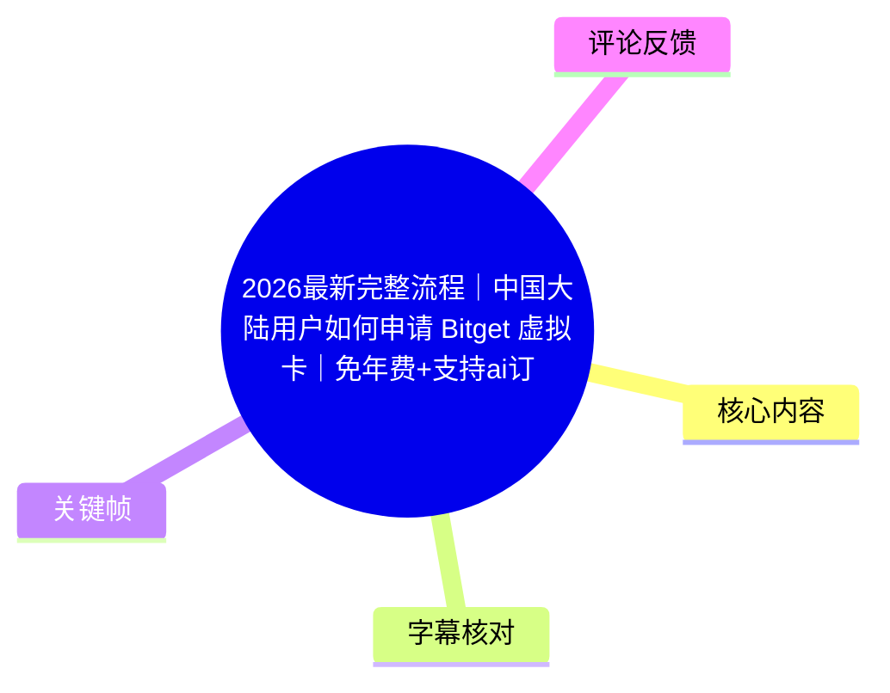
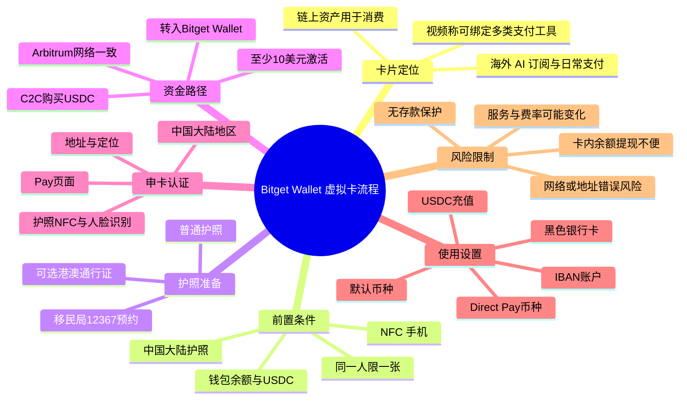
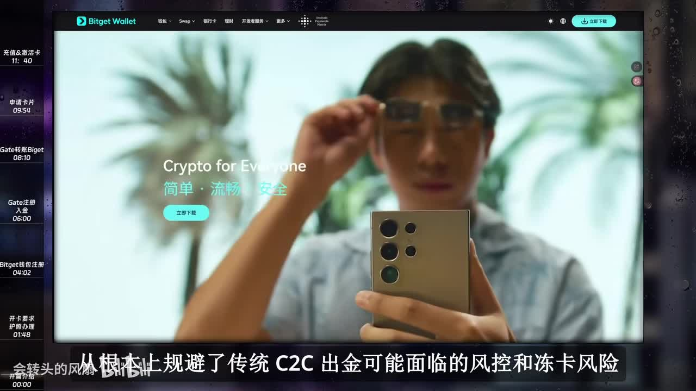
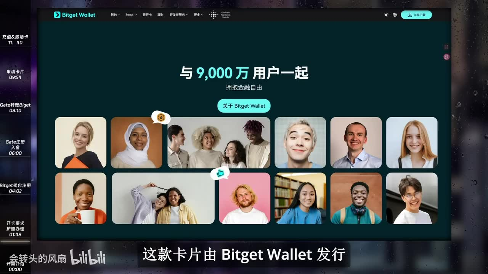
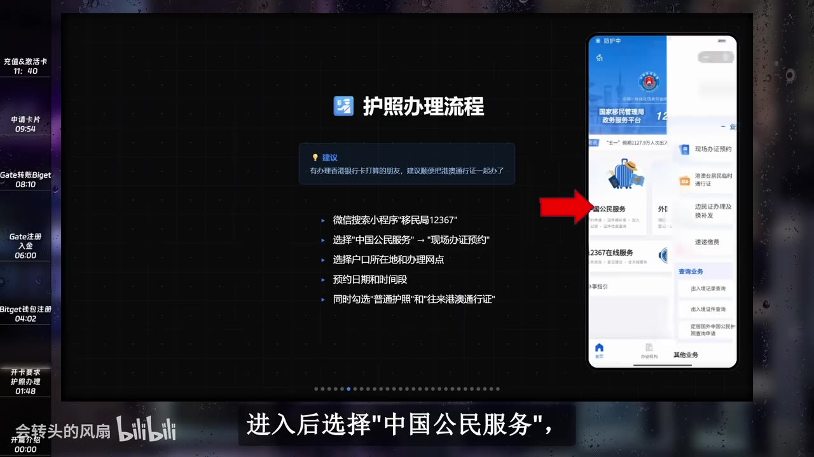
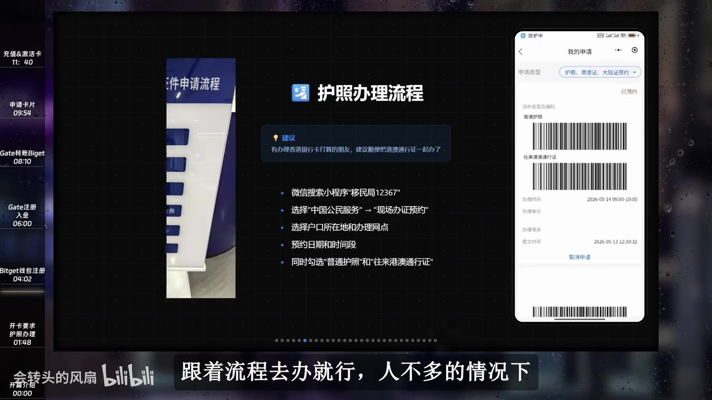

# 2026最新完整流程｜中国大陆用户如何申请 Bitget 虚拟卡｜免年费+支持ai订阅

> 来源：[Bilibili 视频](https://www.bilibili.com/video/BV16bLE6FEDi)<br>
> UP 主：会转头的风扇｜视频时长：14 分 01 秒｜分区合集：AIcode  
> 本文仅整理视频中的流程与说法，不构成金融、法律、税务、跨境支付或平台开户建议。加密资产、虚拟卡、C2C 交易及跨境账户均可能涉及资金损失、账户限制、地区服务规则及合规风险。

## 小结

视频讲解的是：大陆用户如何以 Bitget Wallet 中的虚拟卡为支付工具，完成从准备护照、安装钱包、购买并转入 USDC、提交身份认证，到充值激活、设置支付币种和查看费率的完整流程。UP 主将该卡定位为连接链上资产与日常/海外消费的工具，特别提及 ChatGPT、Claude、Apple Pay、Google Pay、PayPal、微信及支付宝等场景。

视频给出的关键门槛是：申请人需要使用**中国大陆护照**，手机需支持 **NFC**；视频称大陆身份证申请通道已关闭，且底层服务为 Fiat24、同一人只能申请一张。申卡过程中还涉及定位、证件地址、护照芯片读取和人脸识别，因此并非仅下载 App 即可完成。

资金路径方面，视频演示先通过交易平台 C2C 购买 **USDC**，再将 USDC 经 **Arbitrum** 网络转入 Bitget Wallet，并在审核通过后向卡内充值至少 **10 美元**以激活。视频强调：这 10 美元被描述为激活资金而非开卡费，充值后会成为卡内可用余额；不过链上网络、地址和交易平台规则均必须以实时页面为准。

费用与使用方面，视频称该卡免费开卡、无年费；每月 **400 美元**以内消费可享“零手续费/手续费返还”，国内绑定微信或支付宝时，单笔 **200 元人民币以下**的日常消费没有额外损耗，超过后按微信或支付宝官方标准费率结算。这些均是视频陈述，实际费率、额度、支持商户和返还规则可能随地区、账户状态或平台政策变化。

视频同时揭示了重要限制：卡户“没有存款保护”，UP 主建议“用多少充多少”；卡内余额提现较麻烦，而钱包链上余额可转账或提现。评论区中已有用户反馈微信国内消费和 ChatGPT 订阅被拒，也有用户反映账户信息页面卡住，因此视频中的“可绑定/可支付”实测不应视为对所有账号、商户和地区均有效的保证。

## 思维导图





## 目录

- [卡片定位、费用与使用边界](#卡片定位费用与使用边界)
- [开卡资格与护照办理](#开卡资格与护照办理)
- [Bitget Wallet 安装、注册与激活资金](#bitget-wallet-安装注册与激活资金)
- [USDC 购买与链上转入](#usdc-购买与链上转入)
- [提交申卡认证与卡片激活](#提交申卡认证与卡片激活)
- [支付币种、IBAN 与消费验证](#支付币种iban-与消费验证)
- [关键参数、限制与时效性](#关键参数限制与时效性)
- [字幕比对](#字幕比对)
- [评论分析](#评论分析)
- [处理记录](#处理记录)

## [卡片定位、费用与使用边界](https://www.bilibili.com/video/BV16bLE6FEDi?t=0)

视频开场将 Bitget Wallet Card 描述为面向大陆跨境从业者和 Web3 用户的支付工具，核心用途是把链上资产用于现实消费。UP 主的主要论点包括：

1. **资产与消费的连接**：可使用 USDT 或 USDC 消费，以减少传统 C2C 出金可能遇到的账户风控或“动卡”风险。这里是 UP 主对使用路径的判断，不代表使用虚拟卡本身能够消除任何风控或合规风险。
2. **持有成本**：视频称免费开卡、没有年费；月度额度在 400U 以内可享零手续费，且该说法包含外汇转换、充值等成本。
3. **支付生态**：视频称可绑定微信、支付宝、Apple Pay、PayPal、Google Pay；支持 Mastercard 网络的商户可以结算，并称适合订阅 ChatGPT、Claude 等海外 AI 服务。
4. **国内消费说法**：绑定微信或支付宝后，单笔 200 元人民币以下的日常消费“体验和储蓄卡一样”；超过 200 元则按微信或支付宝官方标准费率结算。
5. **发行与安全说法**：视频称该卡由 Bitget Wallet 发行，并以平台用户规模作为资金安全的辅助论据。平台规模并不等同于卡内资金有存款保险或不会产生支付、合规及技术风险。



> 图：画面显示 Bitget Wallet 网站和视频内置章节列表，左侧可见“开卡要求”“Bitget 钱包注册”“Gate 注册入金”“Gate 转账”等阶段，有助于确认本视频是从资格准备到资金转入再到激活的端到端教程。



> 图：画面出现“与 9,000 万用户一起”的平台宣传信息。这是 UP 主用于说明平台体量的视觉材料；该宣传数字应视为视频画面中的平台宣称，而不是本文独立验证的安全结论。

## [开卡资格与护照办理](https://www.bilibili.com/video/BV16bLE6FEDi?t=110)

### 视频列出的开卡要求

在约 01:48 起，UP 主说明相较于此前条件的变化：

- **证件要求**：必须使用中国大陆护照申请；视频称大陆身份证申请通道目前已关闭。
- **一人一卡**：视频称底层由 Fiat24 提供，同一人只能申请一张；若此前已经通过身份证或其他渠道申请过一张，可能无法再次申请。
- **设备要求**：手机需要支持 NFC，用于读取护照芯片。
- **护照用途**：UP 主补充称，护照还可能用于其他国际业务，例如国际卡或 eSIM 号码申请；此处属于其经验性说明。

### 视频演示的护照预约步骤

从约 02:32 起，视频演示在微信小程序中办理护照预约：

1. 在微信搜索小程序“**移民局 12367**”。
2. 进入后选择“**中国公民服务**”。
3. 点击“**现场办证预约**”，阅读并同意条款。
4. 选择户口所在地、就近办理网点和预约日期/时间段。
5. 若未来有办理香港银行卡的打算，视频建议同时勾选“**普通护照**”和“**往来港澳通行证**”。
6. 护照部分选择首次申请，前往事由按实际情况填写；视频示例为“旅游”。
7. 港澳通行证部分选择通行证与签注、香港、个人旅游，并以“一年一次”为示例。
8. 填写个人信息、紧急联系人、取证方式后提交。
9. 到线下网点时，在“我的—预约申请”中出示条码，按现场流程完成办理。

视频称：护照工本费为 **120 元**、港澳通行证为 **75 元**，通常约 **7 天内**办好；这些是视频制作时的口述信息，受地区、受理规则和政策影响，应向国家移民管理部门或当地受理网点确认。



> 图：画面将“护照办理流程”要点与手机中的“移民局12367”入口并置，直观说明视频的前置任务是先预约线下证件办理，而非在钱包 App 中直接生成护照资格。



> 图：画面展示预约申请完成后的条码页面。它对应视频所说的线下到办理网点出示条码的环节，帮助区分“线上预约”与“线下采集/办理”。

## [Bitget Wallet 安装、注册与激活资金](https://www.bilibili.com/video/BV16bLE6FEDi?t=242)

### 安装与钱包注册

视频从约 04:02 开始进入 Bitget Wallet 流程：

1. 准备网络环境并下载安装 Bitget Wallet。
2. 视频称 iPhone 需要使用港区或海外 Apple ID 从 App Store 下载；Android 可从 Google Play 下载。
3. 打开 App，选择创建钱包。
4. 输入注册邮箱、邮箱验证码并设置密码。
5. 登录后，可依次进入左上角头像、右上角设置、邀请中心，绑定好友邀请码。

UP 主称邀请码区分大小写，且首次消费后可获得 **5U 空投奖励**。邀请码、奖励条件及是否可叠加均可能变化，视频未在素材中给出可核验的邀请码文本，本文不补写或推测。

### 进入 Pay 与激活资金要求

视频约 04:56 起的流程为：

1. 回到主页，底部进入“**Pay**”。
2. 点击“立即体验”。
3. 地区切换为“**中国大陆**”。
4. 点击注册。
5. 系统会提示钱包余额需大于 **10 美元**。

视频特别区分：

- **没有开卡费、没有年费**是其陈述；
- 但需至少向卡内充值 **10 美元**才能激活；
- 该笔资金被描述为激活后转为卡内可用余额，而非被平台扣除。

### 人民币不能直接充值

视频称因合规限制，不支持直接用人民币向钱包充值，因此示范路径是：

```text
C2C 购买 USDC
      ↓
将 USDC 提现至 Bitget Wallet
      ↓
用 USDC 向虚拟卡充值
      ↓
卡片激活并获得可用余额
```

该路径同时涉及法币交易、加密资产、链上转账和虚拟卡服务。用户应自行确认所在地区法律、支付平台规则、交易平台服务范围、资产来源及税务义务。

## [USDC 购买与链上转入](https://www.bilibili.com/video/BV16bLE6FEDi?t=344)

### 视频中关于 Gate 注册/KYC 的内容

视频约 05:44 起以 Gate 为例演示交易平台流程。需要特别指出：UP 主在视频中建议注册时避开某些居住地区、选择台湾、澳大利亚或日韩等地，同时又要求国籍和实名证件保持一致。**这类“居住地区”填写建议可能与平台条款、KYC 真实性要求及当地法律冲突，本文仅记录视频原话，不建议提供虚假或不实信息。应按平台实际服务地区和真实身份/居住信息办理。**

视频其余步骤包括：

1. 下载并打开 Gate App，点击注册，填写邮箱和验证码，设置密码。
2. 完成身份认证：视频称国籍必须与实名证件一致，示例为中国国籍、身份证，并上传身份证正反面、完成人脸识别。
3. 回到 App 首页，进入充值/交易所，打开 C2C 页面。
4. 购买币种需选择 **USDC**；若显示 USDT，视频提醒手动切换。
5. 输入购买金额，视频示例为 **20**。
6. 新账号可能需绑定手机号码；视频称可填写 +86 手机号。
7. 选择支付方式，示例使用支付宝，预览订单后按商家信息付款。
8. 付款后保存凭证，回到平台点击“我已付款”并上传截图；如上传异常，可通过聊天框与商家沟通。

视频提醒付款备注不要出现加密货币相关敏感词。该提醒仅反映视频经验，不应被理解为规避银行、支付机构、交易平台监管或审核的建议；进行任何支付时应遵守平台交易说明、如实处理争议并保留合法凭证。

### 从 Gate 向 Bitget Wallet 转入 USDC

约 08:10 起，UP 主强调网络选择是本流程中最关键的技术点：

1. 在 Bitget Wallet 中点击“充值”。
2. 选择链上收款币种 **USDC**。
3. 网络选择 **Arbitrum**。
4. 复制系统生成的收款地址，或使用二维码。
5. 回到 Gate 的资产页，选择提现—链上提现—USDC。
6. 粘贴刚复制的地址。
7. 提现网络必须选择与钱包端**完全一致的 Arbitrum**。
8. 输入提现数量，提交提现。

视频称 Fiat24 构建在该链上，若选错链，系统可能无法识别资金，并警告可能无法退回。无论何种服务，链上转账均应先核对：

| 核对项 | 视频强调的原因 |
| --- | --- |
| 币种 | 接收端要求 USDC，不要误用 USDT |
| 收款地址 | 错误地址可能导致不可逆损失 |
| 网络 | 视频指定 Arbitrum；发送端和接收端必须一致 |
| 提现金额与最低额度 | 交易平台可能收取链上手续费或有最低提现额 |
| 账户状态 | 新账户可能无法立即提现 |

### 资金密码与 24 小时保护期

视频约 09:08 起补充，交易平台新账号若未设置资金密码，需要在个人设置—安全中心—资金密码中设置，并使用邮箱验证码确认。再次申请提现时，可能会出现 **24 小时保护期**。

UP 主称这类限制在新号中较常见，因此建议尽早注册、绑定手机号并设置资金密码。保护期结束后，视频示例需要再次核验地址和网络，输入资金密码、邮箱验证码、手机验证码；其称大约等待 1—2 分钟即可在 Bitget Wallet 查看到账。实际到账时间取决于交易平台审核、网络拥堵、风控和区块确认，不宜以视频时长作为保证。

## [提交申卡认证与卡片激活](https://www.bilibili.com/video/BV16bLE6FEDi?t=596)

### 申卡前的两个提示

视频在约 09:56 提出两个申卡操作提示：

- 中国大陆用户在申卡流程中不要使用 VPN；
- Android 用户需要手动打开手机 GPS 定位。

这是视频针对定位和地址核验的操作经验。平台可能会结合网络、设备、定位和 KYC 信息做风控审核；不应尝试伪造位置或绕过区域、身份验证限制。

### 视频演示的认证步骤

资金到账后，视频给出的申卡流程为：

1. 在 Bitget Wallet 切换到 Pay 页面。
2. 点击“立即体验”，地区选择“中国大陆”。
3. 点击“立即申请”并注册，输入密码后进入认证。
4. 国家选择除美国以外的国家；这是视频界面中的选择说明，实际应根据自己真实国籍、居住地和服务资格选择。
5. 系统询问当前位置是否在家中，视频解释此项用于地址证明与实际定位合理性检测。
6. 同意提示、填写性别并分享位置。
7. 若系统自动识别地址，视频建议尽量不修改；若识别不完整，则手动补充，尽量与证件地址一致。
8. 勾选协议与账户用途；视频强调账户用途应据实填写。
9. 国籍选择中国。
10. 拍摄护照。
11. 手机贴近护照，使用 NFC 扫描护照芯片。
12. 完成人脸识别，等待审核。

视频称常规情况下“几分钟”可通过审核，但 UP 主本人因已用身份证申请过一张卡而收到审核不通过邮件，随后改用另一个已申请好的账号继续演示。这一案例与前述“一人一张”的限制相互印证，但不代表所有拒绝都由同一原因造成。

### 充值、解锁与卡片选择

审核通过后，视频约 11:42 展示：

1. 在 App 进入 Pay 页面。
2. 点击“银行卡”。
3. 页面可能出现蓝卡与黑卡两个选项；视频选择**黑色银行卡**。
4. 点击“立即充值”，币种选择 **USDC**。
5. 输入金额、输入密码。
6. 充值成功后，视频称卡片即正式解锁。

视频在此再次强调“无开卡费、无年费”与“至少 10 美元激活资金”的区别。应注意卡片状态、可充值资产、最低充值额、可用国家/商户均可能由账户资质及实时服务条款决定。

## [支付币种、IBAN 与消费验证](https://www.bilibili.com/video/BV16bLE6FEDi?t=722)

### Direct Pay 币种设置

约 12:02 起，视频演示实用设置：

1. 在“更多”中进入“账户信息”。
2. 根据提示完成验证。
3. 点击左上角三横线，进入“Payment”。
4. 在“Direct Pay”中打开下方四个币种开关。
5. 根据最常用的消费币种设置默认币种；视频以常有海外消费时选 **USD** 为例，称可减少货币兑换造成的汇率磨损。

视频未列出“四个币种”的具体名称，因此本文不臆测。默认币种是否真的减少损耗，取决于商户结算币种、卡组织汇率、平台换汇机制与动态货币转换（DCC）等条件，应以实际账单为准。

### 视频关于 IBAN 的说明

视频将顶部标签切换为“IBAN”后，称系统提供了一个欧洲 IBAN 账户，并将其描述为可以：

- 像普通银行转账一样，汇款至本人名下其他海外实体银行卡；
- 使用自己的海外银行卡向该 IBAN 汇款充值；
- 对欧洲电商场景，例如亚马逊欧洲站，作为收款账户。

同时，视频列出两个“硬规矩”：

1. **同名转账最安全**；
2. 主要支持欧元等主流法币。

UP 主建议把该账户作为个人资金的专属中转站使用。必须注意：IBAN 账户是否可收款、适用币种、同名限制、商业收款用途及是否支持电商平台入账，都应以 Fiat24/Bitget Wallet 的实时条款和账户页面为准；视频口述不应替代服务协议或合规审查。

### 视频声称的实测支付能力

视频最后展示卡片交易记录，并称有 PayPal、微信、支付宝支付流水；UP 主表示自己实测该卡可绑定 ChatGPT、Apple Pay 和 Google Pay，并提示用户可自行尝试其他海外平台。

随后，视频称：

- “更多”中可查看交易额度和费率；
- “零手续费”页可查看手续费返还记录；
- “额度说明”显示每月免手续费额度为 **400 美元**。

这些结论是 UP 主的账户实测与视频画面说明。它们并不能保证其他账号同样能绑定、扣款成功或享有相同费用待遇，尤其是 AI 订阅与境内支付会受商户收单规则、卡 BIN、账单地址、3DS 验证、账户地区、余额、风控与实时政策影响。

## [关键参数、限制与时效性](https://www.bilibili.com/video/BV16bLE6FEDi?t=654)

### 视频中的参数汇总

| 项目 | 视频说法 | 适用提醒 |
| --- | --- | --- |
| 开卡费 | 免费开卡 | 应以实时开卡页面为准 |
| 年费 | 无年费 | 不等于没有充值、换汇、支付或其他费用 |
| 激活要求 | 至少充值 10 美元 | 视频称该资金会进入卡内余额 |
| 月免手续费额度 | 400 美元 | 视频称可在“额度说明”中查看，可能变化 |
| 国内小额消费 | 单笔 200 元以下无额外损耗 | 视频陈述；取决于支付渠道与卡片状态 |
| 超过 200 元消费 | 按微信/支付宝官方标准费率结算 | 应向微信、支付宝及卡平台确认 |
| 申请证件 | 中国大陆护照 | 视频称大陆身份证通道已关闭 |
| 设备能力 | NFC | 用于读取护照芯片 |
| 卡数量 | 同一人一张 | 视频归因于 Fiat24 底层限制 |
| 充值币种 | USDC | 视频演示使用 USDC |
| 入金网络 | Arbitrum | 钱包端和交易平台提现端必须完全一致 |
| 新账户提现限制 | 可能有 24 小时保护期 | 实际期限和触发条件由平台决定 |
| 卡户保障 | 没有存款保护 | 视频明确提示，不宜大额存放 |
| 推荐资金策略 | 用多少充多少 | 视频经验建议，不是风险消除措施 |

### 必须重视的风险

1. **卡内资金不等于银行存款**：视频明确称没有存款保护，且卡内余额提现较麻烦。不要因“可消费”或“有 IBAN”就把它视为受本地存款保险保障的账户。
2. **链上转账不可逆**：网络、地址或币种不匹配，可能导致资金无法到账甚至无法找回。首次操作宜使用自己可承受损失的小额测试。
3. **服务可用性不确定**：支付成功受卡片状态、KYC、账户地区、商户、卡组织、钱包和支付平台风控共同影响。视频实测不是普遍承诺。
4. **KYC 与地区信息必须真实**：视频中有关选择居住地区的表述存在明显合规风险。开户、认证和税务信息应真实、准确，并符合平台服务范围。
5. **C2C 交易存在对手方和账户风险**：支付凭证、订单沟通、放币时效、争议处理与资金来源审核都可能影响结果。
6. **AI 订阅并非必然成功**：热评已有“ChatGPT 订阅被拒”的个案，说明商户支付兼容性有账号差异。
7. **信息时效性有限**：视频标题标注“2026”，元数据发布时间为 2026 年 5 月；但卡片准入、护照政策、费率、额度、支持网络、交易平台区域政策都可能在之后变化。

## [字幕比对](https://www.bilibili.com/video/BV16bLE6FEDi?t=0)

| 字幕来源 | 完整性 | 专有名词 | 时间轴 | 主要问题 |
| --- | --- | --- | --- | --- |
| Bilibili 站内字幕 | 覆盖 00:00:00—00:14:00，分句细、与视频章节连续对应 | 总体较好；但有“比特get wallet cut”“cloud”等转写/大小写问题 | 最细粒度，适合作为章节时间定位依据 | 部分英文品牌、网络名存在音译或识别误差 |
| 本次 ASR 字幕 | 诊断显示语音覆盖约 96.14%，时长 840.632 秒，语言中文置信度约 0.9995 | 多处错误明显，如 Bitget、Arbitrum、Fiat24、ChatGPT、IBAN 被误识别 | 有时间戳，但 ASR 首段从 00:00:28.320 开始，与站内字幕开头不一致；分段较粗 | 存在“消败”“连费”“2B寸”“RB创”“iBank”等错字和专名误识别 |

### 最终字幕选择与校正原则

本文以**站内 SRT**作为时间轴链接和主文本的首选依据，因为其从 00:00:00.080 起完整覆盖、时间分段更细；同时对照本次 ASR 进行复核。ASR 并未标记 `noAudioStream=true`，且诊断确认音频存在、语音覆盖率较高，因此不是无音轨视频。

以下词语采用站内字幕、上下文和视频画面进行统一校正：

| 视频中采用写法 | ASR 常见误识别 | 校正依据 |
| --- | --- | --- |
| Bitget Wallet | BitGate / BitGit / BitGat | 视频标题、站内字幕和 Bitget Wallet 页面 |
| Bitget Wallet Card | BitGate Wallet Card | 开场站内字幕与产品上下文 |
| Fiat24 | fat at24 / Fiat24 | 站内字幕与上下文 |
| Arbitrum | 2B寸、RB存、RB创、Abitron | 视频明确说网络必须一致，且上下文为 USDC 链上网络 |
| ChatGPT | ChataGBT | 标题标签与站内字幕 |
| Claude | Cloud | 视频语境为海外 AI 服务 |
| IBAN | iBan / iBank / i bans | 视频界面标签和银行账户语境 |
| Mastercard | Master cut | 站内字幕与支付网络语境 |

## [评论分析](https://www.bilibili.com/video/BV16bLE6FEDi?t=789)

本次素材仅获取到 **2 条热评**，未达到“热评前三条”的数量；以下仅分析可获取内容，不把评论当作已验证事实。

### 1. 用户“大江瀚海”：国内消费与 ChatGPT 订阅均失败

- **评论内容**：用户称已绑定微信、在 App 内打开人民币支付，但卡内余额无法在国内使用；ChatGPT 订阅也被拒绝，并质疑卡片用途。
- **价值**：这构成对视频“可绑定微信/支付宝、可订阅 ChatGPT”的反例。它说明即便功能入口存在，也可能因账户状态、卡 BIN、余额、账单地址、商户风控、支付通道或地区条件而失败。
- **可信度边界**：评论没有提供订单状态、错误代码、账户认证状态、卡片余额、商户地区、账单地址或时间信息，无法定位失败原因。不能据此断言该卡普遍不可用，但应将其作为兼容性不确定性的真实用户反馈。

### 2. 用户“JB_ana”：账单地址与账户信息页面访问异常

- **评论内容**：用户询问如何查看账单地址，并称“更多—账户信息”页面打不开、进度条卡住，退出重进也无效。
- **价值**：账单地址可能影响某些海外订阅或支付验证；页面无法加载则会直接阻碍信息核对与支付排障。
- **可信度边界**：这是单一客户端故障反馈，可能与 App 版本、网络、账户审核、服务端状态或地区限制有关。视频没有针对“账户信息无法打开”的故障给出解决方案。

### 评论与视频主张的关系

视频展示的是 UP 主在特定账号和时点下的支付流水及绑定结果；两条评论则表明其他用户可能遭遇功能不可用或页面异常。更审慎的结论是：**视频提供了可尝试的流程，但不能据此承诺国内消费、AI 订阅、账单地址访问或账户页面加载在所有用户侧均可复现。**

## [处理记录](https://www.bilibili.com/video/BV16bLE6FEDi?t=0)

- **Worker ID**：worker-mrj0wbly-5dc4e50c
- **模型**：gpt-5.6-terra
- **素材处理工具/产物**：已提供合并视频 `merged.mp4`、音频 `audio/audio.wav`、关键帧目录 `frames/`、站内字幕 `p01-ai-zh.srt`、ASR SRT `asr/transcript.srt`、ASR 结果 `asr/asr-result.json`、评论文件 `comments/comments.json`。
- **ASR 模型与运行信息**：`medium`；语言识别为中文，置信度约 0.99951171875；CUDA、float16；音频时长约 840.632 秒；语音覆盖率约 96.14%。
- **字幕选择**：以站内字幕作为正文时间轴依据；本次 ASR 已完整检查，用于核对语义和发现错误。未发现 `noAudioStream=true` 标记。
- **关键帧选择依据**：选用 `frame-001`、`frame-002` 说明开场产品定位与平台宣传，选用 `frame-003`、`frame-004` 对应护照预约与线下办理条码；均依据画面中可见页面、流程标题和字幕语境，不对未展示的 UI 状态作延伸推断。
- **评论范围**：仅处理素材中可获取的 2 条热评；不存在可获取的第 3 条热评。
- **缓存清理**：提供素材未含缓存清理执行日志，无法确认或编造清理结果。
- **未解决问题**：
  - 无法仅凭视频与字幕独立核验 Bitget Wallet Card、Fiat24、交易平台、微信/支付宝、AI 订阅商户的实时准入和费率。
  - 视频未提供邀请码正文，本文未补写。
  - ASR 对 Arbitrum、IBAN、品牌名等专有名词误识别较多，已按站内字幕和画面上下文校正。
  - 评论中提及的国内支付失败、ChatGPT 拒付及账户信息页面卡顿，缺乏错误码和账户条件，无法归因。

## 评论分析

- 热评 1：为啥我绑微信之后，账户卡里面的钱根本在国内使用不了（我在APP里面打开了人民币支付的），chatgpt订阅也被拒绝，这卡有个什么用？
- 热评 2：如何查看账单地址？ 另外我更多-账户信息，打不开，进度条卡着在，退出重进也是。

以上内容是观众反馈摘录，只用于补充理解视频反响，不作为正文事实依据。
