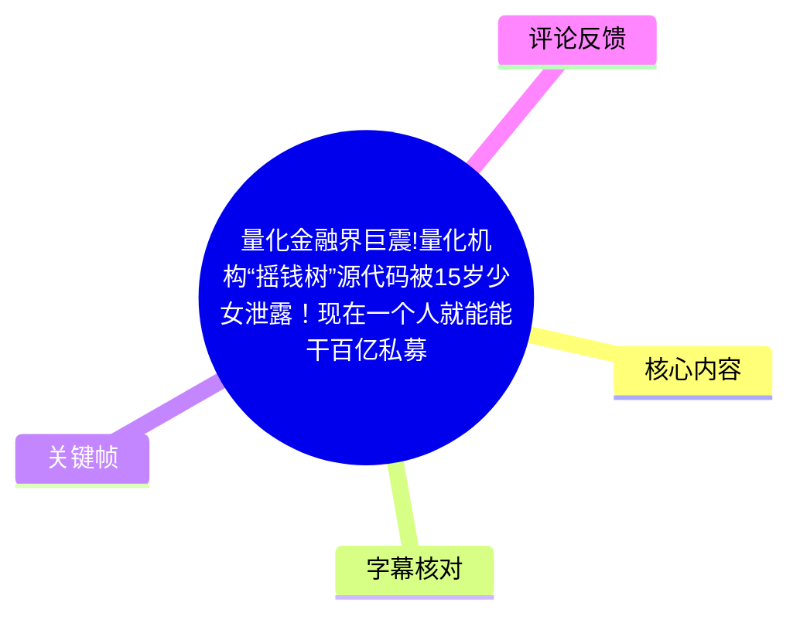
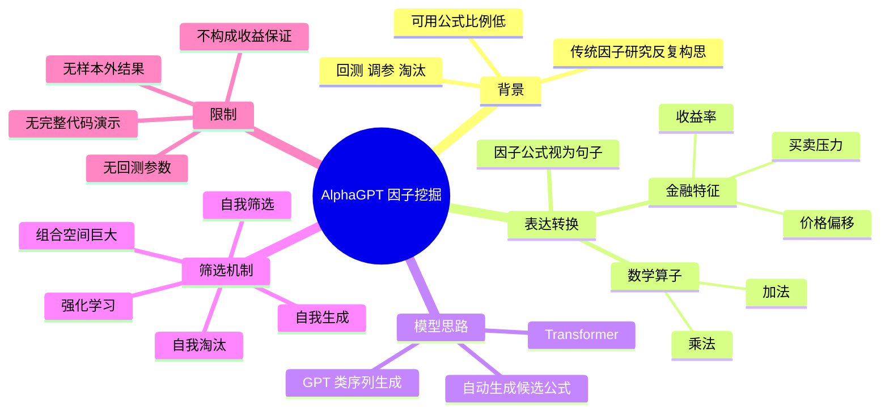

# 量化金融界巨震!量化机构“摇钱树”源代码被15岁少女泄露！现在一个人就能能干百亿私募的活！

> 来源：[Bilibili 视频](https://www.bilibili.com/video/BV1eWj26cEYv) 
> UP 主：阿尔法量化价格行为｜时长：03:11｜分辨率：1920×1080

## 小结

视频介绍了一个名为 **AlphaGPT** 的开源量化因子挖掘项目。UP 主以“未满 16 岁少女开源量化基金核武器”的强烈表述切入，并将其定位为区别于“金叉买、死叉卖”这类固定规则策略的、面向金融数学与因子挖掘的工具。标题中的“泄露”是传播性措辞；视频口述的实际说法是“代码已经全部开源”，两者不应混同。

其核心思路是：把一个量化因子公式拆成“金融特征 + 数学算子”的符号序列，视为一句可生成的“语言”。例如，视频用“收益率、买卖压力、价格偏移”及乘法、加法构造买入信号，并据此说明：既然公式可以被编码为 token 序列，便可以借助 Transformer/GPT 类序列模型自动生成候选因子公式。

视频所强调的难点不在于预测“明天涨还是跌”，而在于传统量化研究中需要反复提出公式、回测、调参、淘汰的因子搜索工作。针对大量组合空间，视频给出的筛选机制是**强化学习**：让模型根据评价结果调整特征与算子的组合，持续生成、筛选和淘汰候选因子。

不过，本片是概念性“开胃菜”，未展示代码仓库地址、训练数据、奖励函数、回测区间、交易成本、样本外测试、实盘记录或风险控制细节。因此，“自动生成能赚钱的公式”“一个人能干百亿私募的活”等表达不能视为收益承诺或已验证的投资结论。视频适合希望理解“语言模型如何用于因子表达式生成”的读者；若要实操，仍须独立验证数据质量、回测严谨性和样本外稳健性。

## 思维导图

## 目录

- [背景：因子研究的重复搜索工作](#背景因子研究的重复搜索工作)
- [AlphaGPT 的定位与视频范围](#alphagpt-的定位与视频范围)
- [技术核心：把因子公式转换为语言](#技术核心把因子公式转换为语言)
- [从符号序列到 Transformer 生成](#从符号序列到-transformer-生成)
- [强化学习筛选与开源信息](#强化学习筛选与开源信息)
- [可执行经验、步骤与缺失参数](#可执行经验步骤与缺失参数)
- [结论、限制与时效性](#结论限制与时效性)
- [字幕比对](#字幕比对)
- [评论分析](#评论分析)
- [处理记录](#处理记录)

## 背景：因子研究的重复搜索工作 [00:00:01](https://www.bilibili.com/video/BV1eWj26cEYv?t=1)

视频开头提出的问题是：如果让 AI 自己发现市场中的“赚钱规律”，会发生什么。UP 主将量化交易中最折磨人的工作描述为“想因子”，而不是写代码或搭系统。

按视频的叙述，传统因子挖掘流程大致为：

1. 研究人员提出一个可能捕捉市场规律的公式；
2. 对该公式进行回测；
3. 调整参数；
4. 淘汰不符合要求的候选公式；
5. 再构思下一个候选公式。

UP 主称，一个策略从构思到上线可能需要尝试数百个公式，最终可能只留下“一两个”。这里的“数百个”“一两个”是视频中的概括性说法，并非本视频提供了数据来源或统计口径的实证结论。

> 图：该关键帧将量化研究呈现为“公式、回测、模型调优”密集叠加的工作场景，有助于理解视频为何将因子构思视为高重复、强筛选的研究环节。该画面为概念化视觉表达，不是项目性能证明。

## AlphaGPT 的定位与视频范围 [00:00:49](https://www.bilibili.com/video/BV1eWj26cEYv?t=49)

UP 主将项目称为“天才少女之染的开源项目 AlphaGPT”，并声称该项目试图把因子发现工作交给 AI。视频对其定位有两层：

- **不是固定买卖规则的玩具策略**：UP 主明确拿“金叉买、死叉卖”作为对比对象。
- **更接近金融数学领域的量化因子研究**：重点是构造和筛选公式，而非让模型直接报出次日涨跌方向。

视频也主动界定了本期范围：它是“开胃菜”，只解释一个核心问题——**这个项目到底在做什么**。因此，片中没有展开训练工程、模型实现、因子库定义、数据接口和完整实验结果。

> 图：画面出现“AlphaGPT”“开源量化引擎”“OPEN CODE”等文字，并以数据、量化模型、回测、风控、实盘交易等模块作视觉化排列。它能说明视频的宣传定位，但画面中的“算法是武器”“让智慧自由生长”等属于宣传性文案，不能据此推导实际交易能力。

## 技术核心：把因子公式转换为语言 [00:01:13](https://www.bilibili.com/video/BV1eWj26cEYv?t=73)

视频提出的关键转换是：**公式本质上可以被表达成一句“句子”**。

UP 主举例说明，一个逻辑可以写成：

- 当收益率与买卖压力发生同向变化；
- 同时价格偏离某一基准线；
- 则发出买入信号。

视频随后把该逻辑抽象为“收益率 × 买卖压力 + 价格偏移”这一类组合。这里应注意：

- 这是用于讲解表达式组合方式的示例；
- 视频没有给出精确的财务数据字段定义；
- “买卖压力”“价格偏移”“基准线”的计算口径、窗口长度和归一化方式均未披露；
- 示例并不等价于已通过回测、可直接交易的策略。

随后，视频称可为公式元素逐一贴标签：金融特征成为 token，乘法、加法等数学运算也成为 token。由于 ASR 对具体 token 的英文/缩写识别存在明显错误，本整理保留其可确认的概念层含义，而不将误识别文本当作项目的准确词表。

| 视频中的元素类别 | 视频举例 | 在 AlphaGPT 思路中的作用 |
| --- | --- | --- |
| 金融特征 | 收益率、买卖压力、价格偏移 | 组成候选因子的基础输入 |
| 数学算子 | 乘法、加法 | 规定特征间如何组合 |
| 符号序列 | 特征标签与算子标签拼接 | 作为模型生成和学习的对象 |
| 候选因子 | 一条完整公式 | 交由评价/筛选流程判断价值 |

> 图：关键帧以“提出公式—回测检测—淘汰过滤—Alpha 诞生—投入实盘—持续进化”展示因子生产链路。其中“回测标准”“多因子评估”“稳定性检验”“风险过滤”等文字与量化研究的常见环节相呼应；但这些标准的具体实现与数值阈值并未由视频正文交代。

## 从符号序列到 Transformer 生成 [00:02:01](https://www.bilibili.com/video/BV1eWj26cEYv?t=121)

视频的推理链条是：

1. 一个因子公式由金融特征和数学算子拼接而成；
2. 拼接后的公式可视为一串有语法约束的 token；
3. token 序列类似语言中的句子；
4. 擅长序列建模和生成的 Transformer/GPT 类模型可被用于生成新的公式序列；
5. 因此，AlphaGPT 的思路是让模型“像写句子一样”生成交易因子公式。

ASR 在此处将模型名识别为“Transfer”“GPD”。结合上下文中“GPT 背后的模型”以及热评对“Transformer”的提及，可较可靠地校正为 **Transformer** 与 **GPT**；但视频本身没有展示模型结构图、层数、参数量、词表规模或训练代码，不能进一步断言其具体架构。

视频称存在“18 个”可组合元素，其有效组合大约有“几十万亿种”。该数字的组合规则、是否允许重复、最大表达式长度、非法表达式过滤规则等均未说明，因此只能记录为 UP 主对搜索空间规模的口述，而不能复算或验证。

## 强化学习筛选与开源信息 [00:02:49](https://www.bilibili.com/video/BV1eWj26cEYv?t=169)

面对海量候选公式，视频给出的答案是**强化学习（Reinforcement Learning，RL）**。其口述目标是让 AI 学会：

- 哪些特征组合更容易挖掘到“好因子”；
- 如何自行进化；
- 如何自行筛选；
- 如何淘汰低质量候选。

这与把公式生成视为序列决策问题的思路相一致：模型每一步选择一个特征或算子，完成表达式后，根据某种评价结果获得反馈，再更新后续生成偏好。

但视频未公开以下决定结果可靠性的核心内容：

| 缺失项 | 为什么重要 |
| --- | --- |
| 奖励函数 | 决定模型究竟优化收益、夏普、IC、回撤，还是多个指标的组合 |
| 数据市场与时间范围 | 决定模型的适用资产、市场制度和样本覆盖 |
| 训练/验证/测试切分 | 用于防止把未来信息泄漏进训练过程 |
| 交易成本与冲击成本 | 回测中忽略成本会显著高估可交易收益 |
| 因子去重与相关性约束 | 可防止模型反复生成本质相同的表达式 |
| 表达式合法性约束 | 用于避免无意义、除零、数据不可得等公式 |
| 样本外与实盘结果 | 用于检验因子是否仅仅拟合历史噪声 |

视频最后称“AlphaGPT 的代码已经全部开源”，并表示“关注三连后自动发送源码”。本素材中没有提供仓库链接、许可证、提交记录或源码包，因此无法在本文中确认项目的实际开源范围、复现状态和当前可访问性。

## 可执行经验、步骤与缺失参数 [00:00:25](https://www.bilibili.com/video/BV1eWj26cEYv?t=25)

尽管视频没有提供可复现命令或代码，仍可提炼出一条需经严格验证的研究流程。以下是对视频流程的结构化整理，不代表视频已展示这些步骤的工程实现。

### 1. 定义可用特征与算子集合

先明确可用于构建公式的基础金融特征，例如收益率、成交量相关指标、买卖压力或价格偏离度；再定义可执行算子，例如加、减、乘、除、排序、延迟、滚动统计等。

**关键限制：**视频只口述了少量示意元素，没有给出完整的“18 个元素”清单。

### 2. 将公式编码为符号序列

把“特征”和“算子”统一编码为离散 token，使一个表达式能够像句子一样被序列模型读取、生成和约束。

**关键限制：**视频未说明其采用前缀表达式、后缀表达式、树结构编码，还是自定义虚拟机指令格式。

### 3. 生成候选公式

采用 Transformer/GPT 类模型生成 token 序列，并将其解析为可执行因子公式。

**关键限制：**应设置最大长度、运算合法性、变量类型匹配、异常数值处理等约束；视频没有提供相应参数。

### 4. 回测与多维评价

对候选公式计算预测能力与交易表现，再依据规则进行筛选。视频画面提及回测、稳定性检验、风险过滤等概念，但没有公布指标定义或阈值。

实践中至少应分别检查：

- 样本内与样本外表现；
- 不同市场状态下的稳定性；
- 因子与既有因子的相关性；
- 换手率、手续费、滑点与容量；
- 最大回撤与尾部风险；
- 是否存在数据泄漏和幸存者偏差。

### 5. 用强化学习更新生成策略

将候选公式的评价结果反馈给模型，使其逐渐偏向更高评价的特征与算子组合。

**关键限制：**“高回测分数”不等于“可实盘盈利”。如果奖励函数只奖励样本内收益，模型可能系统性地追逐历史噪声，造成过拟合。

## 结论、限制与时效性 [00:03:10](https://www.bilibili.com/video/BV1eWj26cEYv?t=190)

视频最有价值的部分，是用通俗方式说明了一个技术映射：**因子公式可以被离散化为语言序列，因而可以借助生成模型和强化学习进行自动化搜索。**

可迁移的理解包括：

- 量化研究自动化的对象不只是价格方向预测，也可以是“公式发现”；
- 模型生成只是候选因子的起点，回测、风控、样本外验证才决定其是否可信；
- 搜索空间越大，越需要语法约束、评价体系和反过拟合机制；
- “开源”降低了接触门槛，但不自动解决数据、算力、交易执行和金融验证问题。

需要特别保留的风险与边界：

1. **关于人物、项目与开源状态**：视频称项目由“之染”开发且代码已开源，但素材未附仓库证据，无法独立核验。
2. **关于模型效果**：视频未提供收益曲线、基准对比、样本外统计或实盘审计，不可将其视作性能证明。
3. **关于投资风险**：任何自动生成的公式都可能只拟合历史；未计成本、未做滚动验证的回测尤其容易产生虚假优越性。
4. **关于标题措辞**：标题中的“泄露”“百亿私募的活”具有明显传播性和夸张性；视频正文本身强调的是开源项目与因子生成方法。
5. **关于时效性**：视频发布日期按元数据为 2026 年 2 月，素材抓取时间为 2026 年 7 月。代码仓库、依赖版本、数据源与项目可用性均可能已经变化；本文不对当前状态作超出素材的推断。

## 字幕比对

| 字幕来源 | 完整性 | 专有名词 | 时间轴 | 主要问题 |
| --- | --- | --- | --- | --- |
| Bilibili 站内字幕 `p01-ai-zh.srt` | 不完整且与视频主题不符，仅覆盖约 00:00—01:16 | 无法反映 AlphaGPT、量化因子等主题 | 有真实分段时间，但内容明显错配 | 内容是“假期赶作业崩溃瞬间”等，与本片口述完全不对应，并夹杂英文歌曲歌词 |
| 本次 ASR 字幕 | 较完整，覆盖 00:00—03:10，诊断语音覆盖率为 99.73% | 部分中文、英文缩写和专名误识别 | 有真实分段时间，可用于章节定位 | 将 Transformer/GPT 误识为“Transfer/GPD”，并将若干金融字段和 token 识别为乱码或近音词 |

最终采用**本次 ASR 的时间轴与主题内容**作为正文主要依据，未采用站内字幕的文本内容。理由是：

- 站内字幕虽然带时间轴，但文本主题与视频不一致，属于明显错配字幕；
- 本次 ASR 覆盖从 00:00 至 03:10，和视频总时长 03:11 基本一致；
- ASR 诊断未标记 `noAudioStream=true`，说明源视频存在音轨，且识别任务并非因无音轨而失败；
- 关键帧中的“AlphaGPT”“开源量化引擎”“量化公式工厂”等画面文字，支持视频主题确为量化因子生成，而非站内字幕所述的开学作业内容。

重要校正与保留：

- ASR 的“Transfer”“GPD”依上下文校正为“Transformer”“GPT”，但未据此虚构具体模型参数。
- “收益率”“买卖压力”“价格偏移”“乘法”“加法”的概念清晰；其对应 token 的精确拼写无法从 ASR 可靠恢复，故不作为确定性技术参数记录。
- “18 个元素”“几十万亿组合”保留为视频口述数字，未作外部验证。

## 评论分析

仅分析本次可获取的热评前三条；评论均属于用户陈述，不作为已验证事实。

1. **DarcJC（173 赞）**  
   评论者称其查看过代码，认为项目使用“policy gradient RL”训练“两层迷你版 Transformer”，由 Transformer 生成“虚拟机代码序列（因子）”；还称项目此前可能尝试过 actor-critic，并提到执行器涉及 SOL 链和 A 股。  
   - **补充价值：**提供了比视频更具体的模型实现猜测与市场适配信息。  
   - **可信度边界：**评论未附仓库链接、代码位置、提交版本或实验结果，且“估计效果不好”是评论者推测，不能作为项目事实。  
   - **与视频关系：**其“Transformer + RL + 因子生成”概述与视频核心叙述方向一致。

2. **进取的小巨人（110 赞）**  
   评论指出：“都说了开源项目。还一堆要代码的。”  
   - **观点：**认为观众应自行从开源渠道获取，而非反复索取代码。  
   - **可信度边界：**该评论没有给出公开仓库地址，不能据此确认源码的实际可访问性、许可证或完整程度。  
   - **与视频关系：**对应视频结尾“代码已经全部开源”的口述。

3. **小河豚愛啃人（2 赞）**  
   评论内容为“@MioriaAI 把內容彙整給我”。  
   - **观点与信息量：**这是请求整理内容的互动留言，没有提供项目技术、效果或争议方面的可验证补充。  
   - **结论：**不构成对视频技术主张的支持或反驳。

## 处理记录

- **Worker ID：**worker-mrj0www4-e8d79408
- **模型：**gpt-5.6-terra
- **调用工具与素材：**视频元数据、站内 SRT 字幕、ASR 时间轴字幕、`asr/asr-result.json` 诊断信息、12 张关键帧清单、可获取热评 3 条。
- **ASR 识别信息：**模型 `medium`；语言识别为中文，置信度 0.99560546875；运行设备为 CUDA，计算类型为 float16；语音覆盖率 99.73%。
- **字幕选择：**检查了站内字幕与本次 ASR。站内字幕内容明显错配，故不用于正文事实记录；采用本次 ASR 的时间分段作为章节时间轴，并对“Transformer/GPT”等明显近音误识别做了上下文校正。
- **关键帧选择依据：**选用 `frame-002.jpg` 说明量化研究的公式密集与任务负担，选用 `frame-003.jpg` 说明公式生成、回测、淘汰与筛选链路，选用 `frame-004.jpg` 说明 AlphaGPT 的开源宣传定位。关键帧仅用于辅助理解画面表达，不被用作项目效果证据。
- **缓存清理：**提供的素材中没有缓存清理执行日志；未将“缓存已清理”作为既成事实记录。
- **未解决问题：**素材未提供 AlphaGPT 的仓库地址、代码版本、许可证、完整 token 词表、18 个元素清单、模型超参数、奖励函数、回测报告、样本外结果及实盘记录，均无法据此视频独立确认。
