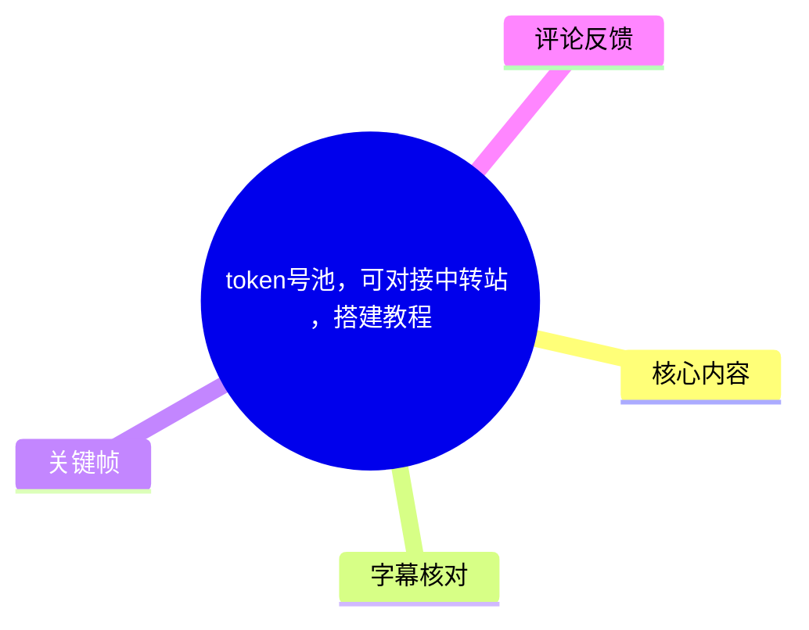
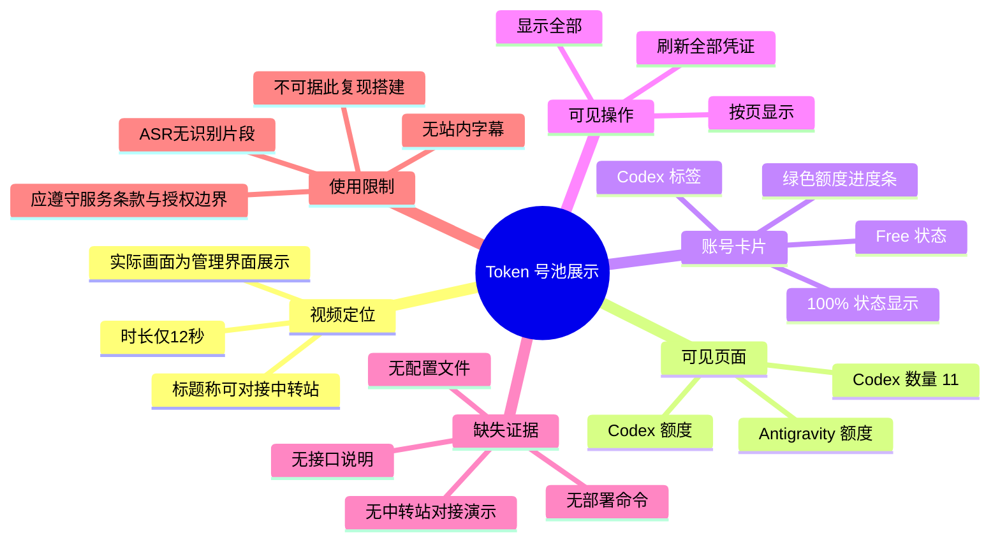
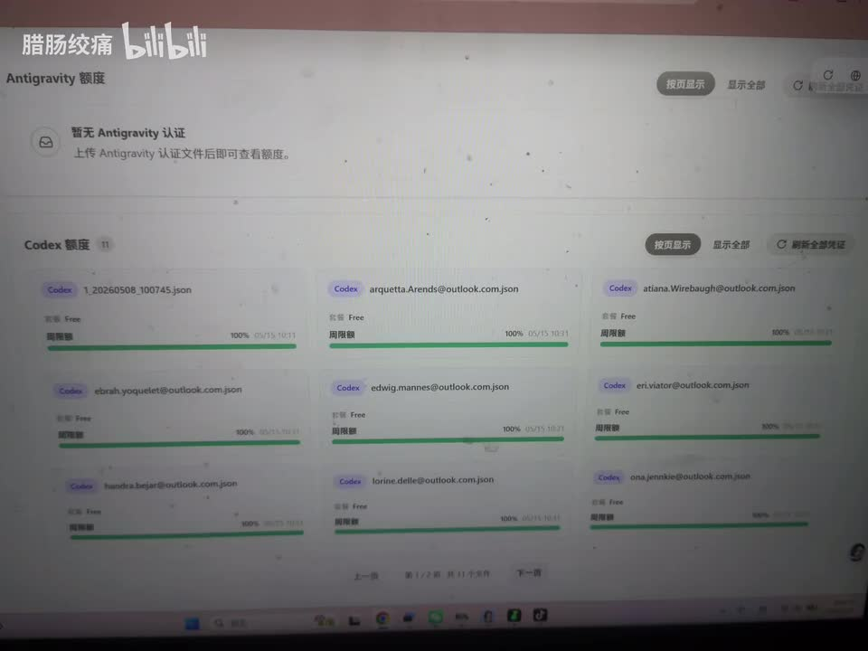
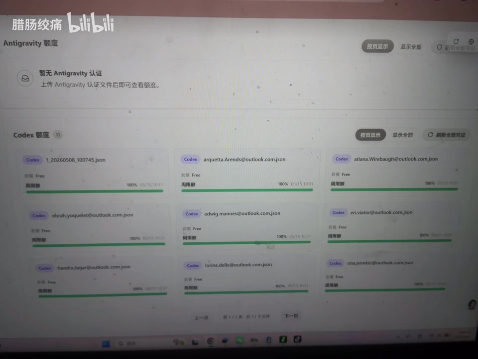

# token号池，可对接中转站 ，搭建教程

> 来源：[Bilibili 视频](https://www.bilibili.com/video/BV1r8RmBzESG) 
> UP 主：腊肠绞痛｜发布时间：2026-05-09｜时长：12 秒｜分辨率：2880 × 2160

## 小结

本视频时长仅 12 秒，画面核心是一套额度/账号管理页面。页面顶部可见 **Antigravity 额度** 与 **Codex 额度** 两个区域；其中 Antigravity 区域提示尚无认证，Codex 区域则展示了多个标记为 `Codex` 的账号卡片。

从可辨识画面看，Codex 区域显示账号数量为 **11**。每张卡片均带有 `Free` 标识、绿色进度条，以及接近或显示为 `100%` 的额度状态；页面还提供“按页显示”“显示全部”“刷新全部凭证”等操作入口。视频标题称其为“token号池，可对接中转站”，但画面没有展示中转站地址、接口格式、部署命令、配置文件、鉴权方式或实际调用过程，因此不能据此还原完整搭建流程。

这段素材更接近于对已搭建管理界面的成果展示，而不是可复现的教程。对于希望理解其页面结构的人，能确认的信息是：该界面似乎按服务类型管理凭证，并展示单个账号/凭证对应的额度与状态；对于希望实施部署或进行中转站对接的人，则必须另行获得官方文档、项目来源和合规的授权说明。

视频没有形成可用语音转写，站内字幕也未提供。因此，本文对视频内容的整理以关键帧中的可见 UI 文字为依据，并严格区分“画面可证实的信息”与“标题中的主张”。任何未出现在画面或字幕里的技术细节均不作补充推断。

账号池、令牌管理与中转服务通常涉及账号凭证、服务条款、访问控制和计费责任。视频中可见疑似邮箱式文件名或账号标识；本文不转录这些可能关联个人或账户的信息，也不将“Free”状态解释为可任意共享、批量使用或绕过服务限制的授权。

## 思维导图

## 目录

- [视频定位与证据边界](#视频定位与证据边界-0000)
- [可见的额度管理界面](#可见的额度管理界面-0000)
- [画面中的账号卡片与页面操作](#画面中的账号卡片与页面操作-0000)
- [教程可复现性、参数与限制](#教程可复现性参数与限制-0000)
- [时效性与合规提醒](#时效性与合规提醒-0000)
- [字幕比对](#字幕比对-0000)
- [评论分析](#评论分析-0000)
- [处理记录](#处理记录-0000)

## 视频定位与证据边界 [00:00](https://www.bilibili.com/video/BV1r8RmBzESG?t=0)

视频标题为“token号池，可对接中转站 ，搭建教程”，标签包括“教程”“搭建教程”“中转站”“token”。不过，当前可用素材中没有站内字幕，也没有被本次 ASR 成功识别的语音片段；关键帧主要记录同一个网页管理界面。

因此，能够确认的范围如下：

| 信息类别 | 可确认内容 | 证据来源 |
| --- | --- | --- |
| 视频时长 | 12 秒 | 视频元数据 |
| 页面主题 | 可见 Antigravity 与 Codex 的“额度”管理区域 | 关键帧 |
| Codex 数量 | 页面标题旁显示 `11` | 关键帧 |
| 卡片状态 | 多张卡片可见 `Free`、绿色进度条和 `100%` 字样 | 关键帧 |
| 页面操作 | 可见“按页显示”“显示全部”“刷新全部凭证”等按钮/入口 | 关键帧 |
| 可对接中转站 | 仅为视频标题中的表述，画面未展示对接流程 | 标题与关键帧对照 |
| 搭建方法 | 未展示安装、运行、配置或验证步骤 | 素材缺失 |

需要特别注意：视频标题中的“搭建教程”不能替代实际操作文档。没有代码仓库、项目名称、运行环境、部署命令、环境变量、API 文档和权限模型时，无法从本视频复现该系统。

## 可见的额度管理界面 [00:00](https://www.bilibili.com/video/BV1r8RmBzESG?t=0)

关键帧显示一个以“额度”为核心的管理页面，分为 Antigravity 与 Codex 两部分。

### Antigravity 区域

画面顶部的区域标题为 **Antigravity 额度**。区域内可读到类似“暂无 Antigravity 认证”的提示，并说明上传 Antigravity 认证文件后可查看额度。

这至少说明该界面在信息架构上为 Antigravity 凭证/认证文件预留了入口；但画面未展示：

- 认证文件的具体格式；
- 上传位置或文件字段；
- 认证成功后的额度数据；
- Antigravity 与 Codex 是否使用同一套凭证体系；
- 与外部服务、中转站或 API 的关系。

因此，“上传认证文件后可查看额度”仅是页面提示所表达的功能预期，不能延伸为对认证机制、数据来源或可用性的技术结论。

### Codex 区域

画面中部显示 **Codex 额度 11**，即当前列表中有 11 个 Codex 相关条目。卡片按网格排列，每张卡片大致包含：

1. 紫色的 `Codex` 分类标签；
2. 一个疑似文件名或账号标识的文本字段；
3. `Free` 状态文字；
4. 标为“周期额度”或同类含义的额度信息；
5. 绿色的进度条；
6. `100%` 与日期/时间样式的文字。

由于视频采用拍摄屏幕的方式呈现，且画面存在摩尔纹、反光与模糊，部分字段无法可靠辨认。尤其是卡片中可能包含邮箱式账号标识或文件名，本文不摘录这些细节，避免传播可能的账户关联信息。

> 图：关键帧展示了 Antigravity 与 Codex 两个额度区域，其中 Codex 区域标注数量为 11，并以网格卡片展示 `Free` 状态、绿色进度条和 `100%` 信息。这是判断视频主要内容为额度/凭证管理界面的直接视觉依据。

## 画面中的账号卡片与页面操作 [00:00](https://www.bilibili.com/video/BV1r8RmBzESG?t=0)

从卡片与页面工具栏可提取的操作层信息有限，但仍能看到一些管理意图。

### 卡片展示方式

画面中的 Codex 卡片呈多列网格布局。卡片使用统一的服务标签与状态样式，表明页面设计目标可能是批量浏览多个凭证或账号条目，而不是只查看单一账户。

可见字段及其可解释边界如下：

| 可见字段/视觉元素 | 可作出的谨慎解读 | 不能据此得出的结论 |
| --- | --- | --- |
| `Codex` 标签 | 该条目在页面中被归为 Codex 类别 | 不能确认对应具体模型、官方产品版本或 API 权限 |
| `Free` | 页面将该条目状态显示为 Free | 不能确认可用额度、资费政策、账号类型或合法共享范围 |
| `100%` 与绿色条 | 页面正在用百分比形式呈现某项额度/周期状态 | 不能确认 100% 是剩余额度、已用额度、健康度或成功率 |
| 日期/时间样式文本 | 页面可能记录额度周期、刷新时间或过期时间 | 由于文字不清晰，不能确定字段语义 |
| 疑似邮箱/JSON 文件名 | 页面可能以文件或账号标识区分条目 | 不应将其视为可公开使用的凭证信息 |

### 页面级操作入口

页面右侧能看到“按页显示”“显示全部”以及“刷新全部凭证”等可辨识操作入口。这说明页面至少考虑了列表展示模式和批量刷新场景。

但视频没有记录点击后的结果，因此下列问题均无法确认：

- “刷新全部凭证”实际刷新的是 token、认证状态、额度数据，还是仅刷新页面缓存；
- “按页显示”对应的单页条数、分页逻辑及性能限制；
- “显示全部”在大量条目时是否会受到浏览器或服务端限制；
- 刷新是否需要管理员权限；
- 刷新失败时是否有错误提示、重试机制或审计记录。

> 图：该帧更清楚地保留了 Codex 卡片网格、顶部/右侧的展示模式入口与刷新入口。它的价值在于说明视频不仅展示单条状态，也呈现了面向多个条目的列表管理操作；但由于没有交互过程，不能将按钮文案视为已验证的功能结果。

## 教程可复现性、参数与限制 [00:00](https://www.bilibili.com/video/BV1r8RmBzESG?t=0)

### 视频实际提供的“步骤”

严格按素材整理，视频能够确认的展示顺序只有：

1. 展示额度管理页面；
2. 页面顶部显示 Antigravity 额度区域及未认证提示；
3. 页面中部显示 Codex 额度区域；
4. 展示 11 个 Codex 条目构成的卡片列表；
5. 展示分页/全量显示和批量刷新凭证等页面入口。

这不是完整的搭建步骤，而是已运行页面的静态展示。没有足够证据补充为“安装—配置—启动—导入凭证—对接中转站—测试调用”的教程流程。

### 可见参数

本视频可确认的数值参数极少：

| 参数/状态 | 可见值 | 说明 |
| --- | ---: | --- |
| 视频总时长 | 12 秒 | 元数据 |
| 视频画面尺寸 | 2880 × 2160 | 元数据 |
| Codex 条目数量 | 11 | 页面标题可见 |
| 多个卡片状态 | `Free` | 页面可见文字 |
| 多个进度显示 | `100%` | 页面可见文字 |

没有展示或无法辨认的关键参数包括：

- 服务监听地址、端口与域名；
- 中转站 URL、上游 URL 或回调地址；
- API Key、Bearer Token、Cookie、OAuth 参数或认证文件结构；
- 并发数、请求速率、超时、重试次数；
- 账号轮询策略、故障转移逻辑和额度扣减规则；
- 数据库、缓存、队列或持久化方案；
- Docker、Node.js、Python、Go 或其他运行时版本；
- 管理员权限、日志、审计与告警配置。

### 不能据此执行的高风险操作

视频的标题和页面中出现“token”“号池”“凭证”等概念，但未提供授权范围与安全设计。基于合规与安全考虑，不应将这段片段作为以下行为的操作依据：

- 收集、导入、共享或轮换未经授权的账号凭证；
- 将个人或第三方账号通过中转服务提供给其他人使用；
- 试图绕过平台账户、计费、配额或访问控制；
- 在缺少加密、最小权限和审计机制的情况下保存 token；
- 公开展示或传播界面中可能出现的账号标识、文件名、密钥或认证材料。

若用途确为自有账号与获授权的内部服务，最低限度仍应确认：凭证存储加密、访问日志、权限隔离、密钥轮换、撤销机制、服务商条款及数据处理责任。

## 时效性与合规提醒 [00:00](https://www.bilibili.com/video/BV1r8RmBzESG?t=0)

本视频发布于 2026-05-09。额度界面、`Free` 状态、认证方式、相关产品名称及页面按钮均可能随项目版本、服务商政策或账号状态改变而失效。视频中没有给出项目版本号、代码地址或文档链接，无法进行版本核验。

关于时效性，应保留以下判断：

- **页面状态具有瞬时性**：卡片中的百分比和日期/时间文本即使可见，也只代表录制时页面所显示的状态。
- **配额与资费可能变化**：`Free` 标签不等于长期固定、普遍适用或可转授的免费资格。
- **接口兼容性未被证明**：标题虽称“可对接中转站”，但没有调用演示、请求样例或返回结果，无法验证兼容的协议、模型名称、鉴权方式或错误处理。
- **安全与条款需优先核验**：任何账号池或凭证服务应只处理拥有明确授权的凭证，并遵守所涉服务的使用条款、计费政策与隐私要求。

## 字幕比对 [00:00](https://www.bilibili.com/video/BV1r8RmBzESG?t=0)

| 字幕来源 | 完整性 | 专有名词 | 时间轴 | 主要问题 |
| --- | --- | --- | --- | --- |
| Bilibili 站内字幕 | 未提供可用字幕 | 无法核验 | 无可用分段 | 没有站内字幕素材 |
| 本次 ASR 字幕 | 空 | 未识别 | ASR 具备时间戳能力，但无分段输出 | 识别语言被自动判定为英语，置信度 0.5410；`segments` 为空，语音覆盖率为 0% |

本次 ASR 使用 `medium` 模型处理 `audio/audio.wav`，音频时长为 11.9815 秒。诊断结果显示没有识别出语音片段，警告为“未识别到语音，请核实源视频是否包含可听语音并使用正确音轨重试”。

需要区分的是：诊断数据**未标记** `noAudioStream=true`，且素材清单中存在 `audio/audio.wav`。因此，不能断言源视频没有音轨；只能如实说明，本次识别未得到可用语音文本，可能是无有效口播、音量/音质不足、背景音影响或语言自动识别偏差等原因所致。

最终没有可合并采用的字幕文本。本文采用关键帧与元数据进行多模态整理，并以如下可辨识文字作为校正依据：

- `Antigravity 额度`
- `Codex 额度`
- `Codex`
- `Free`
- `100%`
- `11`
- “按页显示”“显示全部”“刷新全部凭证”等页面入口

由于关键帧均为同一界面的近似连续画面，且没有 ASR/SRT 分段，正文中的视频时间轴统一使用可证实的视频起点 `00:00`；未虚构后续时间点。

## 评论分析 [00:00](https://www.bilibili.com/video/BV1r8RmBzESG?t=0)

仅获取到热评前三条，合计点赞数较低，且评论内容不能替代视频事实或独立验证。

1. **无敌花生豆豆豆**（1 赞）：“11 个 free 也来当号池了，你好歹整几个 pro 啊”
   - 评论者注意到页面中的 11 个条目及 `Free` 状态，并对其作为“号池”的价值提出质疑。
   - 该观点与画面中“Codex 额度 11”“Free”标签相呼应。
   - 但“pro”账号是否存在、不同账号类型的实际可用性，以及该池是否仅由 Free 条目组成，都未在视频中被充分证明；因此这是一种评价，不是可验证结论。

2. **_春hh**（0 赞）：“Chunapi.vip低价性价比”
   - 评论提出了一个外部站点/服务名称，并作出“低价性价比”的推荐性表述。
   - 视频本身没有展示该服务，也没有提供价格、性能、授权、隐私或稳定性证据。
   - 应将其视为未验证的个人推荐，不应据此认定该服务安全、合规或与视频所示页面存在关联。

3. **小鱼小鱼Xu**（0 赞）：“11”
   - 内容极短，可能是在回应视频中可见的 11 个 Codex 条目，也可能无具体语义。
   - 因缺乏上下文，不能提炼为有效技术信息或观点。

## 处理记录 [00:00](https://www.bilibili.com/video/BV1r8RmBzESG?t=0)

- Worker ID：`worker-mrj0wbly-5dc4e50c`
- 整理模型：`gpt-5.6-terra`
- ASR 模型：`medium`（CUDA / `float16`）
- 使用的素材工具产物：视频元数据、`audio/audio.wav`、ASR 诊断结果、关键帧 `frames/frame-001.jpg` 至 `frames/frame-012.jpg`、热评数据。
- 字幕检查与选择：
  - 已检查站内字幕：未提供可用站内字幕。
  - 已检查本次 ASR：输出为空，`segments` 为空，无法采用。
  - 最终方案：不编造口播内容；以可见 UI、视频元数据和标题作有限整理，并明确证据边界。
- 关键帧选择依据：
  - 选用 `frames/frame-001.jpg`，因其完整呈现 Antigravity 区域、Codex 额度区域、11 个条目提示和卡片列表。
  - 选用 `frames/frame-004.jpg`，因其保留了列表网格及“按页显示”“显示全部”“刷新全部凭证”等页面级操作入口。
  - 其余关键帧与上述界面高度相似，未重复插入以避免信息冗余。
- 隐私处理：未转录画面中疑似邮箱、账号名或 JSON 文件名等可能关联账户的信息。
- 缓存清理：提供的素材未包含缓存清理执行结果，无法确认是否已完成缓存清理。
- 未解决问题：
  - 未知页面所属项目、代码仓库和版本；
  - 未知 token/认证文件格式、保存方式及权限模型；
  - 未知“对接中转站”的协议与实测结果；
  - 未知 `100%`、日期/时间字段的精确业务语义；
  - 未知视频是否含有可辨认但未被 ASR 成功转写的口播。

## 评论分析

- 热评 1：11 个 free 也来当号池了，你好歹整几个 pro 啊
- 热评 2：Chunapi.vip低价性价比
- 热评 3：11

以上内容是观众反馈摘录，只用于补充理解视频反响，不作为正文事实依据。
