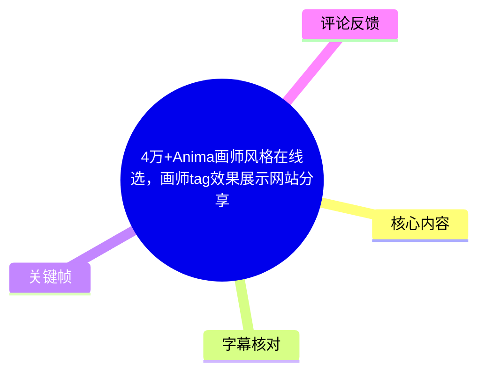
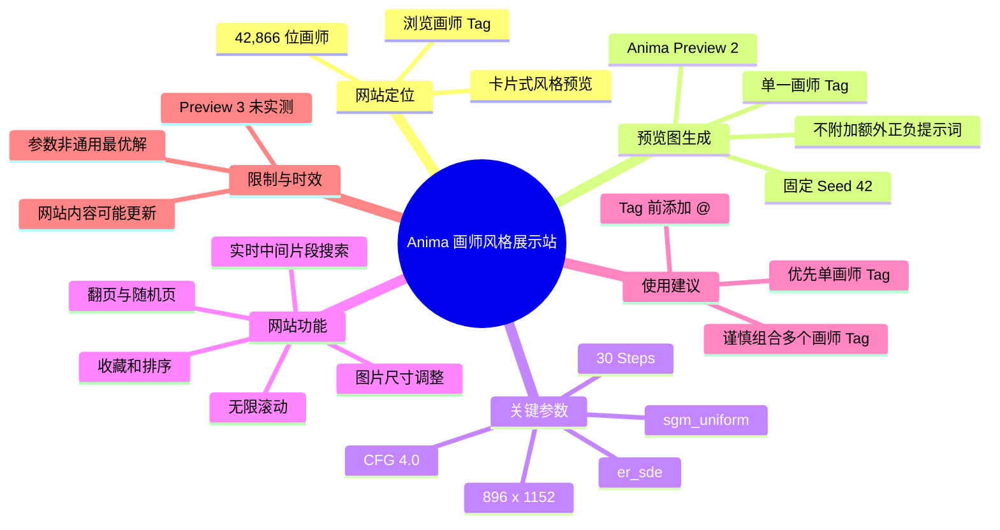
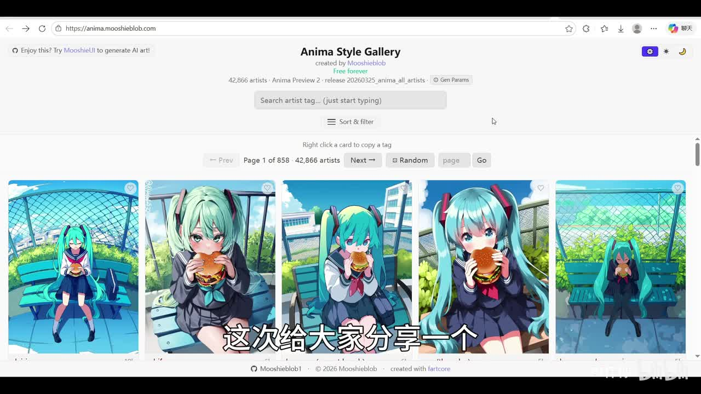
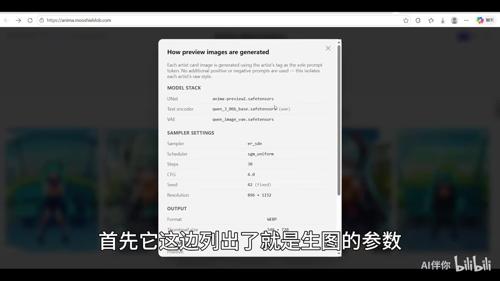
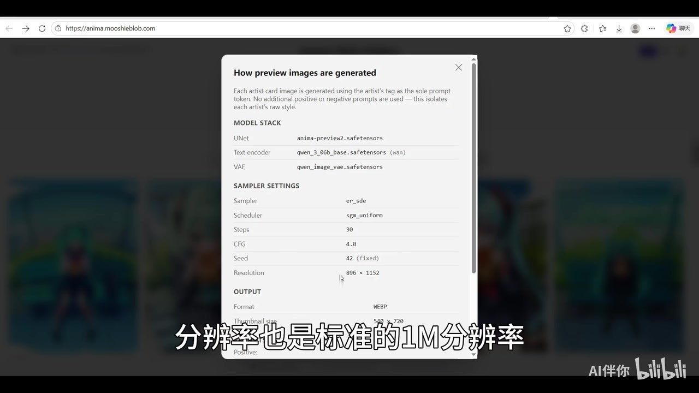

# 4万+Anima画师风格在线选，画师tag效果展示网站分享

> 来源：[Bilibili 视频](https://www.bilibili.com/video/BV1tLo5BZENG)  
> UP 主：AI伴你｜视频时长：2 分 53 秒｜合集：AIcode  
> 视频简介提供的网址：`anima.mooshieblob.com`

## 小结

这是一条面向二次元 AI 绘画用户的网站分享视频。UP 主介绍了 `anima.mooshieblob.com`：一个用于浏览、检索和复制 Anima 画师风格 Tag 的展示站。视频画面显示该站为 **Anima Style Gallery**，当时收录 **42,866 artists**，与标题中的“4 万+”相符。

该站的核心用途是让用户在统一生成条件下横向比较不同画师 Tag 的视觉风格。页面说明指出，每张画师卡片仅使用对应画师 Tag 作为提示词，不附加其他正向或负向提示词，因此预览图更接近该 Tag 在站内固定工作流中的单独表现，而不是复杂提示词场景下的最终效果。

视频展示的预览生成条件包括：`anima-preview2.safetensors`、`er_sde` 采样器、`sgm_uniform` 调度器、30 Steps、CFG 4.0、固定 Seed 42，以及 `896 × 1152` 分辨率。UP 主称这些图片均由 Anima Preview 2 生成，并推测 Preview 3 的表现“应该也差不多”；后者是个人经验判断，视频未提供两个版本的同条件对比。

网站交互包括实时搜索、支持从 Tag 中间片段匹配、翻页、随机页、收藏、排序、每页数量、无限滚动与图片卡片 Size 调整。UP 主特别肯定其使用体验，并表示视频录制时访问该站不需要“魔法”、速度还可以。

使用经验方面，UP 主建议：在 Anima 中使用画师 Tag 时，应在 Tag 开头添加 `@`；多画师 Tag 的兼容性较差，应优先从单画师 Tag 开始测试。网站规模、模型版本、站点功能与访问体验均具有时效性，本文仅记录视频素材所呈现的状态。

## 思维导图





## 目录

- [网站定位与风格预览机制](#网站定位与风格预览机制)
- [预览图生成参数](#预览图生成参数)
- [搜索、浏览与管理功能](#搜索浏览与管理功能)
- [实际使用步骤](#实际使用步骤)
- [Anima 画师 Tag 使用限制](#anima-画师-tag-使用限制)
- [时效性、结论与边界](#时效性结论与边界)
- [字幕比对](#字幕比对)
- [评论分析](#评论分析)
- [处理记录](#处理记录)

## 网站定位与风格预览机制 [00:00](https://www.bilibili.com/video/BV1tLo5BZENG?t=0)

UP 主在开场介绍一个 Anima 画师风格展示网站，目标用户是使用二次元 AI 绘画、需要选择或查找画师风格 Tag 的人。

视频简介中给出的地址是：

```text
anima.mooshieblob.com
```

关键帧显示，该网页标题为 **Anima Style Gallery**，页面标注“created by Mooshieblob”，并显示以下信息：

- **42,866 artists**
- **Anima Preview 2**
- `release 20260325_anima_all_artists`
- 搜索框提示：`Search artist tag... (just start typing)`
- 卡片操作提示：`Right click a card to copy a tag`
- 当前分页示例：`Page 1 of 858`

页面主体以多张图像卡片并列展示画师 Tag 对应的风格效果。视频中的卡片以同一角色、相近主题的画面作为视觉比较基础，方便用户观察不同 Tag 在人物面部、构图、线条、色彩与画风上的差别。



> 图：关键帧直接显示网站名称、42,866 位画师、搜索框、分页与多个风格预览卡片。它说明该站的主要价值是用可视化样图帮助用户横向挑选画师 Tag。

UP 主评价该站“做得算简单”，但认为实际使用体验不错。这是视频作者的主观感受，不代表对网站性能、稳定性或全部功能的独立验证。

## 预览图生成参数 [00:24](https://www.bilibili.com/video/BV1tLo5BZENG?t=24)

视频在参数弹窗中展示了站内预览图的生成方式。弹窗标题为 **How preview images are generated**，其说明表示：

> 每张画师卡片图像使用该画师的 Tag 作为唯一提示词 token；不使用额外正向或负向提示词，以尽量隔离每位画师的原始风格。

这意味着站内图片适合用于初步观察单个画师 Tag 的倾向，但不能保证其在加入人物描述、场景描述、质量词、LoRA 或其他画师 Tag 后仍然得到相同结果。

### 模型栈

| 项目 | 页面显示值 |
| --- | --- |
| UNet | `anima-preview2.safetensors` |
| Text encoder | `qwen_3_06b_base.safetensors (wan)` |
| VAE | `qwen_image_vae.safetensors` |

### 采样与输出设置

| 参数 | 页面显示值 | 视频中的说明 |
| --- | --- | --- |
| Sampler | `er_sde` | ASR 近似识别为“ERSDE”。 |
| Scheduler | `sgm_uniform` | UP 主称其与 Simple“基本没什么区别”。 |
| Steps | `30` | ASR 的“部署是30步”应校正为采样步数。 |
| CFG | `4.0` | 页面与口述一致。 |
| Seed | `42 (fixed)` | 固定随机种子。 |
| Resolution | `896 × 1152` | 约 103 万像素，对应 UP 主所说“标准的一兆分辨率”。 |
| Format | `WEBP` | 页面列出的输出格式。 |
| Thumbnail size | `540 × 720` | 页面列出的缩略图尺寸。 |



> 图：该帧清楚显示预览图的模型栈、采样器、调度器、步数、CFG、固定 Seed 与分辨率，是校正 ASR 中参数专有名词的直接依据。



> 图：该帧显示 `Seed 42 (fixed)`、`Resolution 896 × 1152`、WEBP 输出和缩略图尺寸。固定 Seed 与统一分辨率有助于降低随机性差异，使不同画师 Tag 的卡片更便于比较。

UP 主说明，站中所有预览图均由 **Anima Preview 2** 生成。因此，该站展示的是 Preview 2 加固定参数组合下的结果。对于 Preview 3，UP 主仅称“效果应该也差不多”，没有展示对照图、提示词或测试记录，不能将其视作已证实的跨版本结论。

## 搜索、浏览与管理功能 [00:48](https://www.bilibili.com/video/BV1tLo5BZENG?t=48)

### 实时中间片段搜索 [00:48](https://www.bilibili.com/video/BV1tLo5BZENG?t=48)

网页提供画师 Tag 搜索框。UP 主指出：

1. 已知 Tag 时，可以直接输入搜索；
2. 不必从 Tag 的开头输入；
3. 输入 Tag 中间的一部分字符也可以匹配；
4. 搜索结果实时刷新，不需要按回车。

视频中演示输入“ZY”后即可得到结果。对只记得 Tag 部分字符、拼写不完整或需要快速定位候选项的用户，这一设计比只支持完整名称或前缀匹配更方便。

### 分页与随机浏览 [01:12](https://www.bilibili.com/video/BV1tLo5BZENG?t=72)

UP 主随后介绍网页的浏览方式：

- 常规翻页；
- 页码输入与跳转；
- **Random** 随机功能。

UP 主解释 Random 的作用是跳转到随机某一页。视频可确认它用于随机探索，但没有说明随机算法、随机页码范围或是否会排除已浏览页面。

### 收藏、排序与显示设置 [01:36](https://www.bilibili.com/video/BV1tLo5BZENG?t=96)

设置区提供或展示了以下能力：

- 将喜欢的风格加入收藏；
- 查看收藏内容；
- 排序；
- 调整每页显示数量；
- 开启无限滚动；
- 调整图片卡片 Size。

无限滚动开启后，用户不需要手动进入下一页，网页会自动加载后续内容。图片 Size 则用于平衡细节观察和横向比较效率：

| 调整方向 | 适合的使用场景 | 代价 |
| --- | --- | --- |
| 调大图片 Size | 观察笔触、五官、配色及构图细节 | 同屏可比较的样图减少 |
| 调小图片 Size | 一次快速比较更多画师风格 | 局部风格细节不易辨认 |
| 增加每页数量 | 批量浏览、初步筛选 | 页面信息密度提高 |
| 使用无限滚动 | 连续探索大量风格 | 不适合需要精确记录页码的场景 |

UP 主建议用户根据自己的显示器尺寸和分辨率调整卡片大小；视频没有给出固定的最佳 Size 值。

## 实际使用步骤 [01:12](https://www.bilibili.com/video/BV1tLo5BZENG?t=72)

根据视频演示，可将网站的使用流程整理为以下步骤：

1. **打开网站**  
   进入 `anima.mooshieblob.com`。UP 主称录制时访问“不需要魔法”，速度还可以；这是当时的使用体验描述，不能保证不同地区、网络环境或未来时间仍然相同。

2. **浏览首页风格卡片**  
   通过并列样图初步判断自己偏好的角色表现、色彩和画风方向。

3. **搜索目标画师 Tag**  
   若记得完整 Tag 或其中一部分字符，直接输入搜索框。视频显示可从中间片段搜索，且结果实时刷新。

4. **复制候选 Tag**  
   页面提示可右键单张卡片复制 Tag。复制后的 Tag 可用于个人 Anima 工作流测试。

5. **收藏待测风格**  
   对有兴趣的画风加入收藏，后续再集中比较与验证。

6. **选择合适的浏览模式**  
   - 想随机发现风格，可使用 Random；
   - 想逐页查看，可使用分页；
   - 想连续浏览，可开启无限滚动；
   - 想观察细节或提高对比密度，可调整 Size 和每页数量。

7. **在自身工作流中验证**  
   站内预览图使用统一的单 Tag 条件。实际创作时，应把选中的 Tag 放进自己的提示词中测试，并观察其与人物、场景、构图词及其他模型组件的相互影响。

## Anima 画师 Tag 使用限制 [02:24](https://www.bilibili.com/video/BV1tLo5BZENG?t=144)

### 画师 Tag 前添加 `@` [02:24](https://www.bilibili.com/video/BV1tLo5BZENG?t=144)

UP 主提醒，在 Anima 中写画师 Tag 时，不要忘记在开头加上 `@`。视频给出的操作规则可以概括为：

```text
@画师Tag
```

视频没有展示具体 Tag 名称，也没有展示添加和不添加 `@` 的对照结果。因此，这一规则应理解为 UP 主针对 Anima 使用方式给出的经验建议，实际仍应在自己使用的模型版本和前端中测试。

### 多画师 Tag 组合兼容性较差 [02:24](https://www.bilibili.com/video/BV1tLo5BZENG?t=144)

UP 主表示，Anima 对多个画师 Tag 的兼容性不好，类似“画师串”的组合可能表现不佳，因此建议从单画师 Tag 开始尝试。

建议的测试顺序为：

```text
单画师 Tag
→ 观察风格表现与主体稳定性
→ 保留有效候选项
→ 再谨慎尝试多 Tag 组合
```

站内预览本身也是“单一画师 Tag、无额外正负提示词”的设计，这有利于观察单 Tag 的原始风格。多 Tag 叠加时可能出现风格竞争、融合不稳定或主体表现偏移等情况；这些是对视频建议的合理解释，并非视频展示的系统性实验结果。

## 时效性、结论与边界 [02:24](https://www.bilibili.com/video/BV1tLo5BZENG?t=144)

本视频的可迁移价值在于提供了一种选择画师风格 Tag 的工作流：先通过统一条件下的单 Tag 样图筛选，再放入自己的提示词和生成参数中逐一验证。

应注意以下边界：

- **收录规模是视频快照**：画面显示 42,866 位画师，标题称“4 万+”；站点后续可能增删 Tag、替换数据集或改变页面统计。
- **预览版本有明确范围**：站内图片对应 Anima Preview 2；Preview 3 的相似性仅为 UP 主推测，未获视频实测支持。
- **站内参数不是通用最优参数**：30 Steps、CFG 4.0、固定 Seed 42 等是预览图统一条件，适合对比，而非适用于所有创作目标的唯一最佳设置。
- **单 Tag 预览无法覆盖真实复杂提示词**：人物、场景、质量词、构图词、LoRA、分辨率和种子都会改变最终效果。
- **多画师组合存在风险**：UP 主明确建议从单画师 Tag 开始，说明不宜直接把多个 Tag 组合视为稳定方案。
- **访问体验可能变化**：视频称网站无需“魔法”、速度可接受，但实际可访问性受地区、网络、网站运行状态与后续维护影响。

## 字幕比对 [00:00](https://www.bilibili.com/video/BV1tLo5BZENG?t=0)

站内字幕素材中标注为“未提供可用站内字幕”。本次已检查 ASR 结果，并未出现 `noAudioStream=true` 标记；ASR 诊断显示视频存在音轨，音频时长约 172.34 秒，识别到约 158.07 秒语音，语音覆盖率约 91.72%，共 7 个带真实时间戳的片段。

| 字幕来源 | 完整性 | 专有名词 | 时间轴 | 主要问题 |
| --- | --- | --- | --- | --- |
| Bilibili 站内字幕 | 未提供可用内容 | 无法核验 | 无法使用 | 素材未提供站内字幕文件。 |
| 本次 ASR 字幕 | 覆盖主要口述内容，共 7 段 | 部分参数名称存在近似识别 | 可直接使用，范围为 00:00.050—02:38.120 | 长句未充分断句；参数与术语需结合关键帧校正。 |

正文最终采用**本次 ASR SRT 的真实起止时间**建立时间轴。关键术语校正如下：

| ASR 近似识别 | 校正结果 | 校正依据 |
| --- | --- | --- |
| `ERSDE` | `er_sde` | 参数弹窗中的 Sampler 字段。 |
| `SGM Uniform` | `sgm_uniform` | 参数弹窗中的 Scheduler 字段。 |
| `部署是30步` | `Steps 30` | 页面明确显示 Steps。 |
| `一兆分辨率` | `896 × 1152`，约 103 万像素 | 参数弹窗中的 Resolution 字段。 |
| `多画贴Tag`、`单画贼Tag` | 多画师 Tag、单画师 Tag | 视频主题与上下文语义。 |
| `At` | `@` | 视频结尾关于画师 Tag 前缀的口述语义。 |

## 评论分析 [00:00](https://www.bilibili.com/video/BV1tLo5BZENG?t=0)

以下仅处理可获取的热评前三条。评论内容为观众观点或自述，不作为已经验证的正文事实。

1. **萌黑Black｜26 赞**  
   评论者推荐了自己的 Anima 画师风格展示与探索网站：`ranker.kuronet.top`，称其采用类似 Tinder 的机制对用户喜欢的画师风格进行排序，并自述目前有约三万张图，数据由自己生成。  
   - 补充价值：提出基于偏好排序探索画风的另一种交互思路。  
   - 可信度边界：网站功能、图像数量、数据来源与在线状态均为评论者自述，未由本视频或本任务素材验证。

2. **吃莲蓉蛋黄月饼｜25 赞**  
   评论称“anima画师串好像融合很差”。  
   - 与视频的关系：其观点与 UP 主“多画师 Tag 兼容性不好”的结论方向一致。  
   - 可信度边界：评论未提供模型版本、提示词、参数、样图或复现条件，无法判断问题的具体触发条件与严重程度。

3. **9527号低保户｜9 赞**  
   评论称“2B模型存了这么多画风”。  
   - 可理解为：对模型或相关资源容纳大量画风 Tag 的感叹。  
   - 可信度边界：评论未解释“2B模型”的具体所指，不能据此推断训练数据来源、版权状态、模型能力边界或网站收录机制。

## 处理记录 [00:00](https://www.bilibili.com/video/BV1tLo5BZENG?t=0)

- **Worker ID**：`worker-mrj0wbly-5dc4e50c`
- **模型**：`gpt-5.6-terra`
- **可用素材与工具输出**：合并视频 `merged.mp4`、音频 `audio/audio.wav`、关键帧目录 `frames/`、ASR SRT `asr/transcript.srt`、ASR 分段结果 `asr/asr-result.json`、评论文件 `comments/comments.json`。
- **字幕选择**：站内字幕未提供可用内容；已检查本次 ASR，采用其 7 段 SRT 的真实时间戳作为正文时间轴依据。
- **音频状态**：ASR 诊断未标记 `noAudioStream=true`，并识别出约 158.07 秒语音，因此按有音轨视频处理。
- **关键帧选择依据**：选用 `frames/frame-001.jpg` 验证网站首页、画师数量、搜索和分页形态；选用 `frames/frame-003.jpg` 与 `frames/frame-004.jpg` 验证模型栈、采样参数、固定 Seed、分辨率与输出设置。未对其他未明确展示的关键帧内容作推断。
- **评论处理范围**：仅分析可获取热评前三条，未扩展处理其他评论。
- **缓存清理**：素材中未提供缓存清理执行日志；本文不宣称已执行缓存清理。
- **未解决问题**：未提供站内字幕；未提供 Anima Preview 2 与 Preview 3 的同条件对照；未重新联网验证网站当前可用性、画师总数、访问速度及评论推荐网站的实际状态。

## 评论分析

- 热评 1：推荐一下我自己做的anima画师风格展示网站+画师风格探索网站，使用类似tinder的机制对每个人喜欢的画师风格进行排名。 ranker.kuronet.top 数据是我自己跑的。有三万图目前
- 热评 2：anima画师串好像融合很差
- 热评 3：2B模型存了这么多画风[哦呼]

以上内容是观众反馈摘录，只用于补充理解视频反响，不作为正文事实依据。
