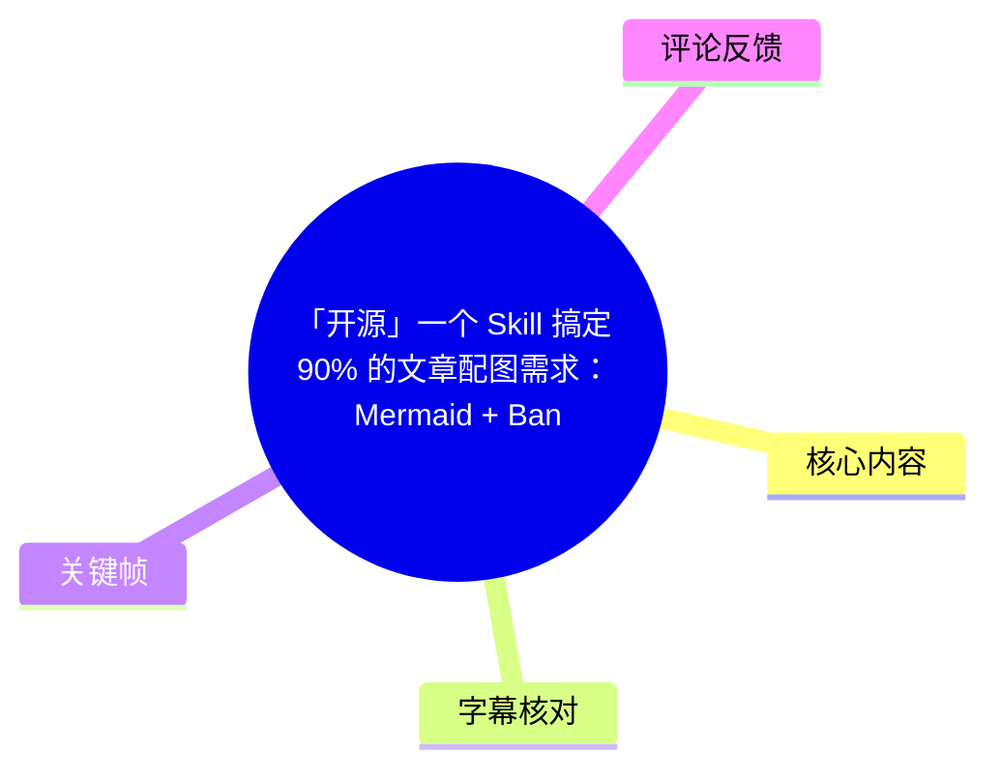
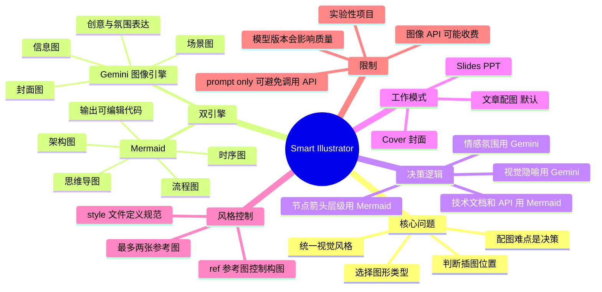
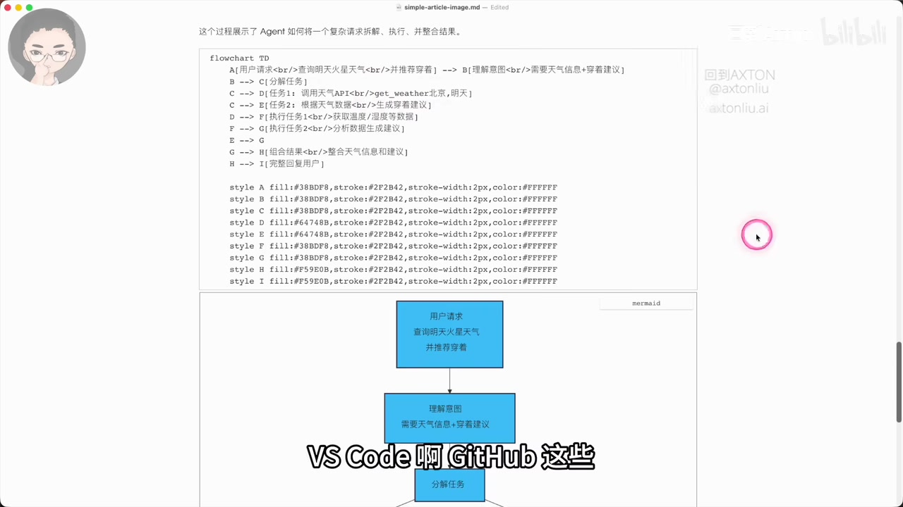

# 「开源」一个 Skill 搞定 90% 的文章配图需求： Mermaid + Banana 双引擎自动配图

> 来源：[Bilibili 视频](https://www.bilibili.com/video/BV1wGFfzJEua)  
> UP 主：回到Axton｜视频时长：11 分 08 秒｜合集：AIcode  
> 开源地址：<https://github.com/axtonliu/smart-illustrator>

## 小结

视频介绍并演示了开源项目 **Smart Illustrator**：一个面向 Claude Code Skills 生态的文章自动配图系统。其核心不是“替用户画一张图”，而是先分析内容、判断哪里需要图、再决定该使用结构化图表还是视觉生成图，并将结果组装回文章。

系统采用双引擎：**Mermaid** 用于流程图、架构图、时序图、思维导图等逻辑结构明确的图；视频中称为 **Gemini** 的图像生成引擎则用于信息图、场景图、封面图等需要视觉隐喻、氛围或创意表达的图。前者输出可编辑的 Markdown 代码块，控制性更高；后者可生成视觉丰富的 PNG 图像，但结果会受模型版本影响。

视频演示了三种模式：默认的**文章配图模式**、批量输出信息图的 **Slides/PPT 模式**、面向 YouTube 缩略图和公众号封面的 **Cover 模式**。此外，参考图（`ref`）与保存配置功能用于让系列内容维持相近的构图和视觉结构；视频称最多可使用两张参考图。

实际使用时应注意：图像生成经由 Gemini API 或 OpenRouter API 时会产生费用；可通过 `prompt only` 仅输出 JSON 格式提示词，再手动粘贴到 Gemini 批量生成。项目被作者明确定位为**实验性项目**，质量会随底层模型版本波动，不能视为稳定的“完美工具”。

适合已经使用 Claude Code、Cursor 等支持 Skills 的工具，且长期创作技术文章、课程内容、博客、PPT 或系列封面的人。视频所称“覆盖 90% 配图需求”是作者对系统能力范围的定位，并非本次素材提供的独立评测结论。

## 思维导图





## 目录

- [问题定义与适用边界](#问题定义与适用边界)
- [双引擎设计：Mermaid 与 Gemini](#双引擎设计mermaid-与-gemini)
- [自动决策逻辑与取舍](#自动决策逻辑与取舍)
- [模式一：文章自动配图](#模式一文章自动配图)
- [参考图与系列风格复用](#参考图与系列风格复用)
- [模式二：Slides/PPT 批量信息图](#模式二slidesppt-批量信息图)
- [模式三：Cover 封面图](#模式三cover-封面图)
- [安装、限制与时效性](#安装限制与时效性)
- [字幕比对](#字幕比对)
- [评论分析](#评论分析)
- [处理记录](#处理记录)

## 问题定义与适用边界 [00:00:34](https://www.bilibili.com/video/BV1wGFfzJEua?t=34)

作者将文章配图的主要困难定义为“**决策**”，而不是单次绘图操作。具体决策包括：

1. 文章中哪些位置需要插图；
2. 某处应使用流程图、概念图、信息图还是场景图；
3. 使用 Mermaid 代码块还是 AI 生成图片；
4. 如何让同一篇文章或一组内容保持统一的风格；
5. 图生成后如何插入合适的文档位置。

Smart Illustrator 是一个 Skill。作者称，除 Claude Code 外，Cursor、Codex、OpenCode、Gemini 等支持 Skills 的工具也可使用；此处是视频作者的兼容性陈述，具体宿主对 Skills 的支持方式仍应以各工具及项目仓库的当前文档为准。

目标用户包括：

- 使用 Claude Code、Cursor 等支持 Skills 的工具；
- 经常创作技术文章、课程内容、博客并需要插图；
- 不希望每次从零定义视觉风格、希望系列配图统一的人。


> 图：关键帧直接展示“配图的难点是「决策」”这一主张，是理解该 Skill 为什么要包含内容分析与引擎路由，而不只是调用绘图模型的核心画面。

## 双引擎设计：Mermaid 与 Gemini [00:01:23](https://www.bilibili.com/video/BV1wGFfzJEua?t=83)

### Mermaid：结构化、可编辑的图形引擎 [00:01:48](https://www.bilibili.com/video/BV1wGFfzJEua?t=108)

作者将 Mermaid 用于具有清晰逻辑结构的内容，包括：

- 流程图；
- 架构图；
- 时序图；
- 思维导图；
- 技术文档、API 说明及工作流图。

视频强调 Mermaid 的输出本质上是可嵌入 Markdown 的代码块，因此具有两个直接优势：

- **可编辑性**：用户可直接修改节点、连线与文本，不必重新生成整张图片；
- **渲染兼容性**：作者列举 Obsidian、VS Code、GitHub 等工具对 Mermaid 有原生或常见的渲染支持。



> 图：画面同时呈现 Mermaid 源代码与生成后的流程图预览，说明该引擎的关键价值是“代码即图表”，适合需要版本管理、审阅和后续修改的文档。

### Gemini：视觉与创意表达引擎 [00:02:12](https://www.bilibili.com/video/BV1wGFfzJEua?t=132)

视频将 Gemini 图像引擎定位为 Mermaid 难以表达的视觉类需求，例如：

- 信息图；
- 场景图；
- 文章或视频封面；
- 需要视觉隐喻的概念画面；
- 需要氛围、情感或创意表达的配图。

作者提到会调用图像生成 API，并称输出为 **2K 分辨率 PNG 图片**。ASR 对具体模型名称存在明显误识别（如“gemdai”“Gemnet”及不稳定的版本词），因此本文统一采用视频简介中明确出现的“Gemini”作为引擎名称；具体模型版本、图像尺寸参数及 API 接口需要以 GitHub 仓库配置为准。

## 自动决策逻辑与取舍 [00:02:36](https://www.bilibili.com/video/BV1wGFfzJEua?t=156)

作者给出的路由逻辑可整理为：

| 内容特征 | 优先引擎 | 原因 |
| --- | --- | --- |
| 有明确节点、箭头、层级 | Mermaid | 易精确表达关系与步骤 |
| 技术文档、API、系统架构 | Mermaid | 便于结构化呈现与修改 |
| 流程或工作流 | Mermaid | 节点与连线可控 |
| 需要视觉隐喻 | Gemini | 可表达代码图表难以覆盖的画面 |
| 需要创意表达 | Gemini | 更适合信息图和概念视觉 |
| 需要氛围、情感表达 | Gemini | 视觉风格与场景表达能力更强 |
| YouTube 缩略图、公众号封面 | Gemini | 面向高视觉吸引力的封面需求 |

作者的取舍判断是：

- Mermaid 的“保真度”更高：输出是代码，用户能精确控制每个节点；
- Gemini 的结构精确度相对较低：生成结果不如代码图那样逐项可控；
- Gemini 的补偿价值在于：可以生成 Mermaid 不能充分表达的创意、比喻和氛围画面；
- 二者互补，构成自动配图系统。

这里的“保真度”应理解为**对指定结构的可控性**，而不是对现实世界画面的真实性。视频未给出可量化的准确率、成本或生成成功率测试。

## 模式一：文章自动配图 [00:03:24](https://www.bilibili.com/video/BV1wGFfzJEua?t=204)

默认模式面向一篇已有文章。作者演示的流程如下：

1. 向 Skill 提供文章目录或文章路径，演示中“不加任何参数”即进入默认模式；
2. Skill 读取文章内容和 `style` 文件；
3. 自动给出配图规划：识别封面和正文中需要插图的位置；
4. 对每个位置选择 Mermaid 或 Gemini；
5. 并行或依次生成图像、创建 Mermaid 图表；
6. 将图像与图表组装进文章；
7. 输出一份带完整配图的新文章文件。

视频中的示例规划是：

| 文章位置/内容 | 系统选择 |
| --- | --- |
| 封面图 | Gemini |
| “为什么需要系统化” | Gemini |
| “三步构建法” | Mermaid 流程图 |
| “串联成工作流” | Mermaid 工作流图 |

作者展示的结果包括：Gemini 制作的封面和第一张正文图，以及 Mermaid 制作的流程图、工作流图，最终被插入到新生成的文章中。`style` 文件在这个模式中承担视觉规范的作用，决定生成图的整体风格。

### 实操检查清单

- 确认输入文章内容完整，章节层级清晰；
- 预先维护 `style` 文件，明确色彩、排版、插画风格等视觉规范；
- 检查自动生成的“配图规划”，避免在不需要图的段落插入装饰性图片；
- 对 Mermaid 图直接审阅节点文本、连线方向与语义；
- 对 AI 图检查文字准确性、视觉主体、版权/品牌元素及与正文的一致性；
- 将生成文章作为新文件审阅，确认图片路径与插入位置有效。

## 参考图与系列风格复用 [00:05:01](https://www.bilibili.com/video/BV1wGFfzJEua?t=301)

参考图功能用于将已有视觉样式延续到新配图中。视频中的说明可拆分为三层：

- Gemini 会参考指定图片的**布局、元素排列、构图特征与视觉结构**；
- 颜色、整体风格等核心视觉规范仍由 Skill 的 `style` 文件指定；
- 参考图以 `ref` 参数传入，后面跟图片文件名；再添加一个“保存配置”的参数后，可将该参考设置保留下来。

后续制作同一系列文章时，作者称只需使用基础命令即可自动加载已保存的参考图，不必重复填写参考图参数。

示例中，系统输出了四张图片：作者口述为三张 Gemini 图、一张 Mermaid 图。作者认为生成结果与参考图保持航海地图风格，包括手绘线条、扁平几何主体、指向性元素与罗盘等视觉特征。

### 参考图的适用范围与限制 [00:06:37](https://www.bilibili.com/video/BV1wGFfzJEua?t=397)

- 适合课程系列、连续专栏等需要长期保持构图语言一致的场景；
- 视频称最多支持**两张参考图**；
- 对单篇文章，作者建议可不使用参考图，以获得更多样化的输出；
- 仅依赖参考图无法替代 `style` 文件：`style` 文件仍是完整视觉规范的主要载体；
- 参考图会引导构图相似性，不应把它理解为保证逐像素复刻或保证生成结果完全一致。

## 模式二：Slides/PPT 批量信息图 [00:07:02](https://www.bilibili.com/video/BV1wGFfzJEua?t=422)

Slides 模式适用于课程 PPT 或需要将脚本拆分为多页演示视觉的场景。视频演示中，作者为同一文章添加 `slides` 模式参数，系统执行：

1. 分析文章或脚本；
2. 拆分为一张张幻灯片；
3. 规划各页内容；
4. 批量生成统一风格的信息图。

演示文章被拆分为 **7 张 PPT**，并最终生成 7 张图片，供用户按页演示使用。

### 成本控制：`prompt only` [00:08:14](https://www.bilibili.com/video/BV1wGFfzJEua?t=494)

作者特别指出，直接生成幻灯片图会通过 Gemini API 或 OpenRouter API 调用模型，**需要付费**。如只需要提示词，可添加：

```text
prompt only
```

视频说明该参数的效果是：

1. 不直接调用图像 API；
2. 仅输出 JSON 格式的 prompt；
3. 用户可将 JSON 提示词复制到 Gemini；
4. 由 Gemini 一次性生成 7 张 PPT 图片。

这一做法将工作流由“Skill 自动付费生成”切换为“Skill 负责规划与提示词、用户自行生成”。但视频没有披露不同 API 的单价、JSON 字段定义、批量生成限制或每次生成的稳定性。

## 模式三：Cover 封面图 [00:08:50](https://www.bilibili.com/video/BV1wGFfzJEua?t=530)

Cover 模式专门生成封面图，适用于：

- YouTube 缩略图；
- 公众号封面；
- 其他追求高点击率视觉效果的平台封面。

输入可以来自文章内容，也可以不提供文章而直接指定主题。视频演示的参数思路包括：

- 使用 `cover` 模式；
- 指定平台，例如 YouTube；
- 通过 `topic` 指定主题，例如“文章自动配图”。

作者称此模式内置提高点击率的最佳实践，并支持多个平台尺寸。它也会读取样式描述文件；如需改变封面视觉风格，需修改该文件。

视频展示了一个纯黑背景的生成封面作为输出案例。应注意，“高点击率最佳实践”属于作者对功能设计的描述；素材中没有 A/B 测试数据、点击率提升幅度或不同平台效果对比。

## 安装、限制与时效性 [00:10:02](https://www.bilibili.com/video/BV1wGFfzJEua?t=602)

### 安装方式

作者说明，Skill 已开源，安装时将 Skill 文件夹克隆到自己的 Skill 目录即可。视频简介给出的仓库地址是：

```text
https://github.com/axtonliu/smart-illustrator
```

并提及可克隆至：

```text
~/.claude/skills/
```

但视频未展示完整的 `git clone` 命令、依赖安装、环境变量、API Key 配置或宿主工具的确切目录规范。因此实施前应以仓库 README 为准，尤其要确认：

- 当前版本的目录结构；
- Gemini/OpenRouter 的认证方式；
- 所需 API Key 与计费账户；
- 支持的 Skill 宿主；
- Mermaid 渲染环境与导出方式；
- 输出图片、文章和配置文件的保存位置。

### 作者明确说明的限制

1. **实验性定位**：作者明确称这是实验性项目；
2. **模型波动**：输出质量会受模型版本变化影响；
3. **非完美工具**：作者将其描述为“够用的系统”，而不是完美解决方案；
4. **成本问题**：Slides 等图像生成可经付费 API 完成；
5. **参考图限制**：最多支持两张参考图；
6. **结构与创意的边界**：Mermaid 更精确但视觉表达有限，图像生成更灵活但结果控制性较低。

### 可迁移的经验

- 将“是否配图、配什么图、在哪插入”设计成明确的决策步骤，比只优化画图 Prompt 更接近可复用工作流；
- 对结构性知识优先使用可编辑的 Mermaid，可降低后期文档维护成本；
- 用 `style` 文件集中管理视觉规则，比在每次请求中重复描述风格更稳定；
- 参考图适合建立系列一致性，但单篇内容不一定需要牺牲多样性；
- 将 `prompt only` 作为低成本/人工复核路径，可在自动化与费用控制间保留选择。

### 时效性说明

本视频元数据发布时间为 2026-02-08。项目仓库、Skills 机制、Gemini 模型版本、API 名称、接口能力、价格、平台尺寸规范均可能在视频发布后变化。尤其是 ASR 对具体 Gemini 模型名称识别不稳定，本文不将其视作可长期依赖的版本信息；应在实际使用前核对仓库的最新文档与服务商官方文档。

## 字幕比对

| 字幕来源 | 完整性 | 专有名词 | 时间轴 | 主要问题 |
| --- | --- | --- | --- | --- |
| Bilibili 站内字幕 | 未提供可用字幕 | 无法核验 | 无法核验 | 素材明确标注“未提供可用站内字幕” |
| 本次 ASR 字幕 | 较完整，28 段，覆盖约 630.4 秒语音 | 存在多处误识别 | 可用，首段 00:00:34,380，末段 00:11:07,220 | 句子过长、断词不规范、英文产品名和参数误识别较多 |

本次素材中**不存在可用站内字幕**，因此正文以带真实 SRT 时间戳的本次 ASR 为主，并结合视频简介、关键帧及上下文进行术语规范化。ASR 诊断显示音频语言为中文、置信度约 `0.9990`、语音覆盖率约 `94.45%`；未标记 `noAudioStream=true`，因此不能将本视频视为无音轨视频。

主要校正原则如下：

| ASR 中的常见写法 | 本文采用写法 | 校正依据 |
| --- | --- | --- |
| mormat、momate、momid 等 | Mermaid | 视频标题、简介及画面中的 Mermaid 代码/预览 |
| gemdai、Gemnet 等 | Gemini | 视频简介明确写为 Gemini；ASR 对英文词识别不稳定 |
| cloud code | Claude Code | 视频简介与工具语境 |
| 配囿、配团、文竩等 | 配图、文章 | 中文 ASR 形近/音近错误 |
| 分隔复用 | 风格复用/参考图复用 | 结合后续 `ref` 参数与参考图演示的语义 |
| “保存配置的变数” | 保存配置参数 | ASR 未稳定识别具体参数名，素材未提供精确命令，故不编造 |

文中没有将 ASR 中不稳定识别出的具体 Gemini 模型版本、API 字段或命令行参数补写为确定事实。

## 评论分析

仅处理素材中可获取的热评前三条；评论是用户反馈，不构成对项目能力的独立验证。

1. **Lars-Ulrich（7 赞）**  
   评论认为项目“思路清晰”，并计划加入“数据可视化的决策规则”。这与视频把配图重点放在引擎路由和决策层的思路相呼应，也提出了一个未在视频中展开的潜在扩展方向：为数据可视化增加独立规则。该扩展是否已被项目支持，素材未证实。

2. **种地小汪（6 赞）**  
   评论者表示当前“还不太用得上”，但感谢开源。该反馈说明目标工具对非内容创作、非 Skill 用户的即时适配度可能有限；同时也体现开源发布获得正向态度，但无法据此推断实际使用效果。

3. **Vaiy_Huang（4 赞）**  
   评论内容为感谢开源，没有提供技术细节、使用结果或争议信息。它只能反映基本的正面社区反馈，不能作为功能可靠性或性能的证据。

## 处理记录

- Worker ID：`worker-mrj0wbly-5dc4e50c`
- 模型：`gpt-5.6-terra`
- 使用素材与工具结果：视频元数据、视频简介、ASR 时间轴字幕（`asr/transcript.srt`）、ASR 分段诊断（`asr/asr-result.json`）、关键帧目录、热评数据；未提供可用站内字幕。
- 字幕选择：采用本次 ASR 的真实 SRT 起止时间作为时间轴依据；通过视频标题、简介、关键帧和上下文规范化 Mermaid、Gemini、Claude Code 等误识别专有名词。
- 关键帧选择依据：选用 `frames/frame-001.jpg` 说明“配图难点是决策”的问题定义；选用 `frames/frame-003.jpg` 说明 Mermaid 代码与图表预览的可编辑性。其余已给关键帧未在素材中附带足够稳定的画面—文件编号对应信息，避免错误归因而未强行使用。
- 热评范围：仅分析可获取的热评前三条，未扩展到普通评论或未提供的回复链。
- 缓存清理：素材未提供缓存清理执行日志，无法验证是否执行；未将其编造为已完成。
- 未解决问题：未提供项目仓库当前 README、精确命令、环境变量、API 价格和版本化配置；文中已明确保留待核验状态。
