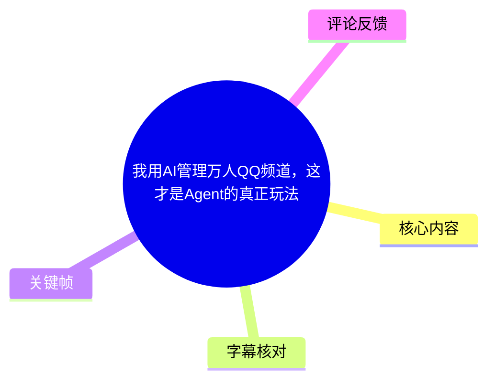
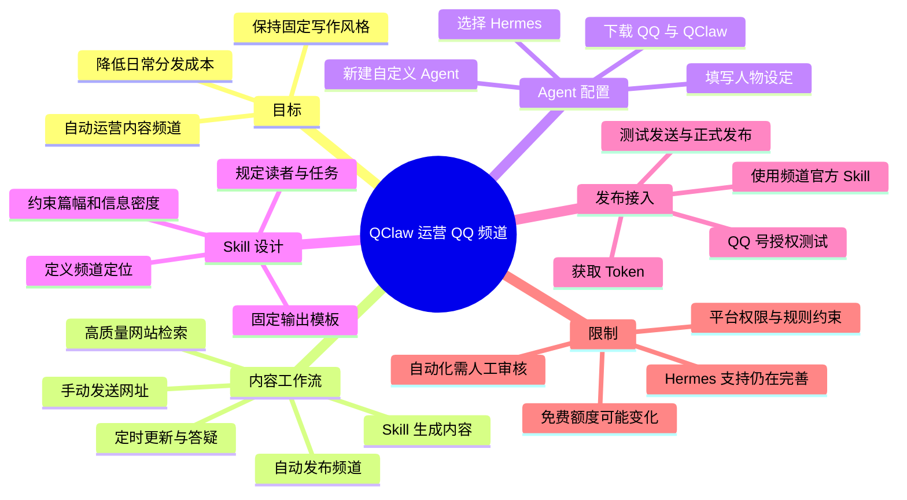
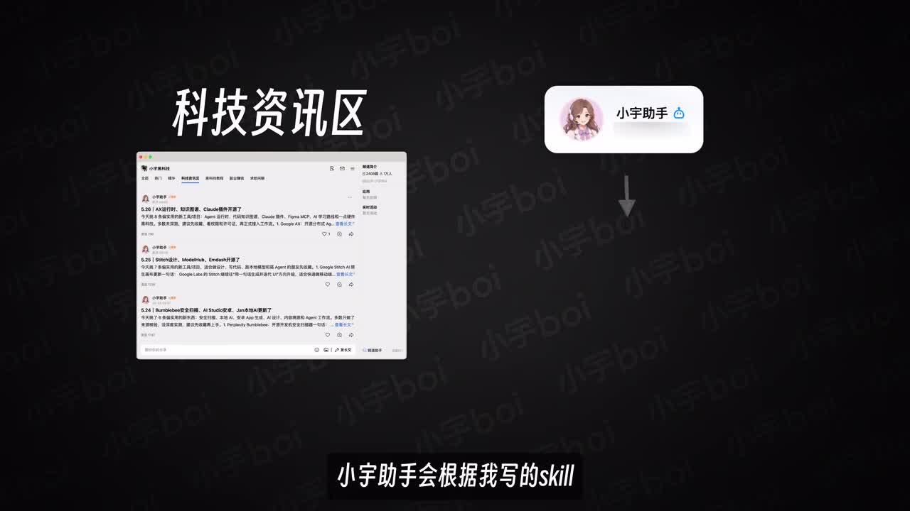
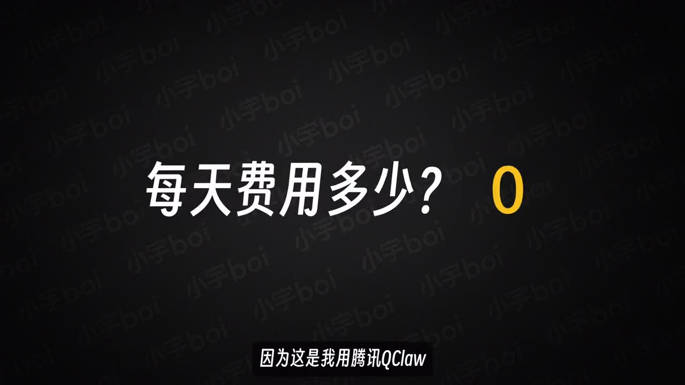
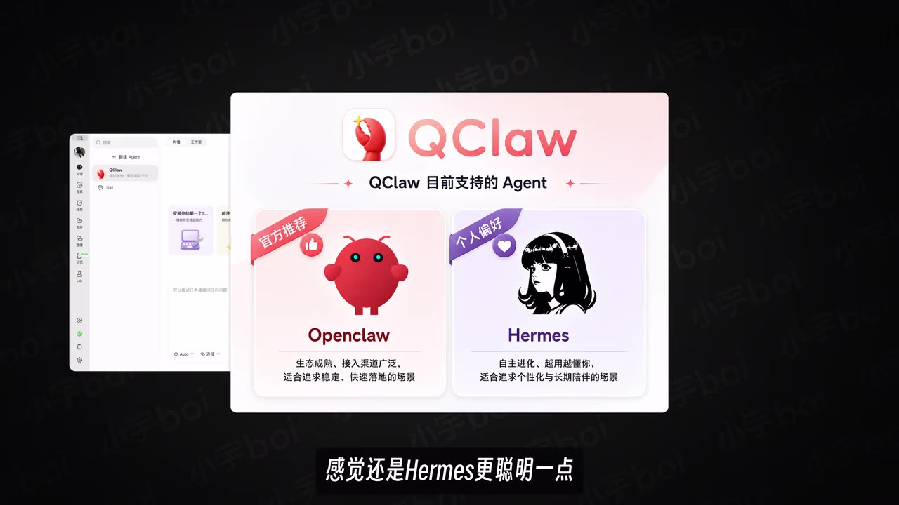
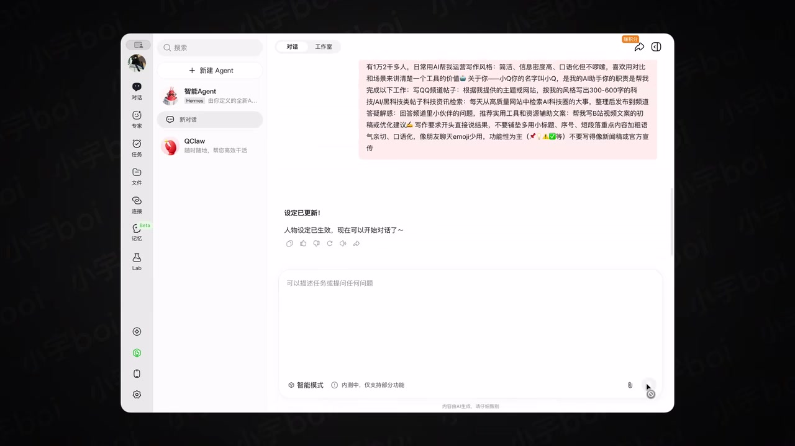

# 我用AI管理万人QQ频道，这才是Agent的真正玩法

> 来源：[Bilibili 视频](https://www.bilibili.com/video/BV1P6Ew6bEsd)<br>
> UP 主：小宇Boi｜发布时间：2026-06-06｜视频时长：05:32｜分辨率：3840 × 2160

## 小结

视频演示了作者如何使用腾讯 QQ 内的 **QClaw**，为一个万人规模、已有两千多篇内容的 QQ 频道搭建 AI 运营助手。核心不是单次让 AI 写文，而是把“检索资讯 / 接收链接—按固定风格生成内容—发布到频道—定时更新与答疑”串成可重复执行的 Agent 工作流。

作者给出的实际案例包括：科技资讯区中的“小宇助手”会依照预先写好的 Skill，从高质量网站检索 AI 圈资讯并发布；作者手动看到好素材时，也可直接把网址交给 Agent，让其依据频道写作规则生成教程或资讯稿。视频声称其日常调用使用 QClaw 的免费积分，单日成本为“0”；这属于作者在录制时的个人使用情况，不等于长期、无限量或所有账户均免费。

教程的关键配置是：下载 QQ 后可直接使用 QClaw；新建自定义 Agent 时选择 **Hermes** 内核；先补全 Agent 身份、工作内容、服务对象和对象职业等人物设定；再创建面向频道发布的 Skill。作者特别强调，Skill 应说明频道定位、目标读者、内容风格、长度与信息密度，并建议让 AI 将自己的原始想法润色为更清晰的 Skill 指令。

自动发布部分使用 QQ 频道提供的官方 Skill。作者建议先用自己的 QQ 号完成授权和流程验证，再考虑使用 QQ 机器人。安装过程中，视频提示某种安装命令会默认写入 OpenClaw 文件夹，若使用该命令，需要手动删除命令第一行末尾所带的路径，再将处理后的内容交给 Agent 安装；由于视频未完整展示命令文本，本文不能补写该命令。

该方案适合希望维护社群、资讯频道或内容分发账号的人，但不能把“所有可网页登录的平台都能自动运营”理解为无条件成立：登录状态、平台规则、账号权限、授权 Token、网页界面变化、内容审核与免费额度都可能导致流程失效或风险上升。视频发布于 2026-06-06，QClaw、Hermes、OpenClaw 的支持范围及免费政策均可能已变化。

## 思维导图





## 目录

- [案例、成本说法与工作流概览](#案例成本说法与工作流概览-0029)
- [选择 Agent 内核并建立人物设定](#选择-agent-内核并建立人物设定-0054)
- [专家广场与自建 Skill 的边界](#专家广场与自建-skill-的边界-0142)
- [编写频道内容 Skill：风格、模板与创建](#编写频道内容-skill风格模板与创建-0206)
- [从链接生成内容到频道自动分发](#从链接生成内容到频道自动分发-0318)
- [QQ 频道授权、安装与测试发布步骤](#qq-频道授权安装与测试发布步骤-0342)
- [定时发布、网页自动化与产品能力](#定时发布网页自动化与产品能力-0425)
- [限制、风险与时效性](#限制风险与时效性-0513)
- [字幕比对](#字幕比对)
- [评论分析](#评论分析)
- [处理记录](#处理记录)

## [案例、成本说法与工作流概览](https://www.bilibili.com/video/BV1P6Ew6bEsd?t=29) [00:29](https://www.bilibili.com/video/BV1P6Ew6bEsd?t=29)

作者以自己的 QQ 频道说明应用场景：频道有“一万多人”、累计“两千多篇文章”，内容包含优质资源、科技资讯与科技教程。这里的规模是作者口述，视频未提供可独立核验的后台统计截图，因此应视作案例背景，而非平台层面的公开指标。

其描述的运营链路有两种输入来源：

1. **主动检索**：科技资讯区的“小宇助手”依据作者编写的 Skill，从高质量网站检索 AI 圈动态，再自动发到频道。
2. **人工投喂链接**：作者浏览资讯时发现好素材，直接把素材或网址发送给 Agent；Agent 按 Skill 写出相应教程或内容。
3. **持续服务**：作者称 Agent 可以每天定时为频道成员答疑解惑。
4. **频道分发**：生成内容最终进入 QQ 频道，供频道成员查看。



> 图：画面将“科技资讯区”的频道内容列表与“小宇助手”并置，并标出助手会依据 Skill 工作。这张关键帧直接说明视频不是在展示单轮聊天，而是在展示面向频道内容分发的 Agent 角色。

作者称每日花费“0”，理由是使用腾讯 QClaw 的每日免费积分，并称可随意切换模型。该表述应拆分理解：

- “0”是作者在特定额度、账户和使用强度下的**个人成本陈述**；
- 不代表没有计算资源消耗，也不保证未来仍有免费额度；
- 如果自动化频率、检索量、生成篇数或模型选择增加，实际可用额度可能变化；
- 视频没有展示额度上限、计费页、模型价格或超额后的收费规则。



> 图：画面直接显示“每天费用多少？0”，并在字幕中归因于腾讯 QClaw。它有助于准确限定这一结论的来源：这是视频作者的使用经验，而不是本文对资费政策的独立确认。

## [选择 Agent 内核并建立人物设定](https://www.bilibili.com/video/BV1P6Ew6bEsd?t=54) [00:54](https://www.bilibili.com/video/BV1P6Ew6bEsd?t=54)

作者的起步操作如下：

1. 在浏览器输入 `qq.com`。
2. 选择对应版本并下载 QQ。
3. 作者称，与手动部署“小龙虾”不同，QQ 下载后会自动完成部署，可开箱即用。
4. 在 QClaw 中点击“新建 Agent”。
5. 选择“自定义创建”。
6. 选择 **Hermes Agent 内核**。

视频画面显示 QClaw 当前支持 **Openclaw** 与 **Hermes** 两种 Agent：画面对 Openclaw 的描述为“生态成熟、接入渠道广泛，适合追求稳定、快速落地的场景”；对 Hermes 的描述为“自主进化、越用越懂你，适合追求个性化与长期陪伴的场景”。作者基于长期使用的主观体验，认为 Hermes “更聪明一点”，并以此作为本教程的演示内核。



> 图：该帧展示了 QClaw 的两种 Agent 选项及其界面文案，是校正 ASR 中“Openq.law”“Hermez”等错误专名的主要视觉依据。

创建前，作者建议先准备 Agent 与个人相关资料，使后续回答更贴合需求。视频给出的“人物设定”信息可以归纳为四类：

| 设定项 | 视频中的问题形式 | 作用 |
| --- | --- | --- |
| Agent 身份 | Agent 是谁 | 定义角色、语气与行为定位 |
| 工作任务 | 要做哪些事 | 明确检索、写作、发布、答疑等职责 |
| 服务对象 | 服务的对象是谁 | 限定受众与沟通层级 |
| 对象背景 | 对方从事什么工作 | 提升内容针对性与表达适配度 |

作者认为，即使只提供简短信息，也能让 Agent 后续回答更符合工作需求。视频同时说明 Hermes 是 QClaw 新增功能，支持仍在进一步完善；当前可通过添加 Skill 和“工具/能力项”（ASR 将该词误识别为“ceoI”，无法仅凭素材确认具体英文名称）增强其能力。



> 图：该帧显示人物设定已更新的界面，以及一段关于频道规模、内容职责、检索范围与文风的长指令。它说明“人物设定”不是抽象标签，而是可直接写入可执行工作要求的上下文。

## [专家广场与自建 Skill 的边界](https://www.bilibili.com/video/BV1P6Ew6bEsd?t=102) [01:42](https://www.bilibili.com/video/BV1P6Ew6bEsd?t=102)

对于简单、通用的任务，作者建议先去“专家广场”寻找现成 Agent，而非立即从零搭建：

- **营销类**：可寻找辅助撰写各类文案的 Agent；
- **办公类**：可寻找图表、PDF 处理等 Agent；
- **搜索方式**：由于内容较多，可直接搜任务关键词。视频举例包括“PDF 转……（ASR 末词不清）”和“抖音”。

这一建议的本质是区分“标准任务”与“个性化任务”：

| 任务类型 | 更适合的路径 | 原因 |
| --- | --- | --- |
| 常见文案、图表、PDF 处理 | 专家广场中的现成 Agent | 配置成本低，可快速试用 |
| 固定频道口吻、专属内容结构 | 自建 Skill | 需要把个人风格、受众和输出格式写进约束 |
| 自动选择内容并发布频道 | 自建 Skill + 频道官方 Skill | 需要同时连接内容生成与目标平台操作 |

作者的需求是“写一篇完全符合自己风格的文案”，因此选择自建 Skill。这里的可迁移经验是：**Agent 决定谁来做事和整体上下文，Skill 则把具体任务流程、内容规则和输出标准固化下来。** 对于频道运营，二者需要配合，而非互相替代。

## [编写频道内容 Skill：风格、模板与创建](https://www.bilibili.com/video/BV1P6Ew6bEsd?t=126) [02:06](https://www.bilibili.com/video/BV1P6Ew6bEsd?t=126)

作者展示了一个用于 QQ 频道内容生产的 Skill 提示词，并按以下顺序解释其构成：

1. **说明 Skill 用途**：先描述这个 Skill 是做什么的，例如专门帮助在 QQ 频道写内容。
2. **说明频道定位**：交代频道主要面向 AI 工具和科技软件等主题。
3. **补足具体背景**：将频道受众、内容方向等信息详细告诉 Agent。
4. **强调发布风格**：要求内容不要太长、尽量简短、信息密度高。
5. **固化个人文风**：作者称后续写作风格部分就是其个人风格。
6. **提供固定模板**：让 Agent 根据统一模板输出，减少每次生成时的结构漂移。

视频未完整公开 Skill 原文，因此不能复原为可直接复制的提示词。依据讲解，可将其设计逻辑整理为以下模板骨架，方括号内容需要由实际运营者自行填写：

```text
Skill 名称：[频道内容分发/生成 Skill]

一、任务
你负责为 [频道名称] 生成可直接发布的内容。

二、频道与读者
- 频道主题：[AI 工具 / 科技软件 / 其他]
- 目标读者：[读者画像]
- 内容目标：[资讯速览 / 教程解读 / 资源推荐]

三、输入处理
当收到一个网址或素材时：
1. 提取素材的核心信息；
2. 判断与频道主题的相关性；
3. 按频道风格重写，不直接堆砌原文。

四、写作约束
- 篇幅：[简短]
- 信息密度：[高]
- 语气与表达：[个人文风说明]
- 禁止项：[不符合频道定位的内容或表述]

五、输出模板
[标题]
[核心结论/摘要]
[要点或步骤]
[适用对象或注意事项]
```

作者提供的小技巧是：先把自己对内容风格和流程的想法直接写出来，再让 AI 协助优化 Skill 的语言；最后把结果整理为固定模板。这种做法降低了直接写复杂提示词的门槛，但优化后的 Skill 仍需要人工检查，避免 AI 在“优化”时删去关键限制或误解业务规则。

完成提示词后，作者直接向 Hermes 下达“按照以下内容帮我创建 Skill”一类的命令，Hermes 会自动创建专门用于分发 QQ 频道内容的 Skill。创建完成后，作者随即发送一个网站链接进行测试，认为产出的文章“简洁明了”。

## [从链接生成内容到频道自动分发](https://www.bilibili.com/video/BV1P6Ew6bEsd?t=198) [03:18](https://www.bilibili.com/video/BV1P6Ew6bEsd?t=198)

本段把前面的“内容生成”推进到“自动运营”。作者定义的目标流程是：

```text
发现一个网站
  → 把网址发送给 QClaw
  → QClaw 自动挑选合适的 Skill
  → 按 Skill 输出一篇干货内容
  → 自动发布到 QQ 频道
  → 频道成员查看
```

需要注意，视频清楚区分了两个能力层：

- **内容层**：通过自建 Skill，输出符合频道定位和文风的内容；
- **渠道层**：通过 QQ 频道的官方 Skill，将内容发送到频道。

视频表示 QQ 频道提供官方 Skill，用户点击“立即使用”即可接入。管理频道时可使用 QQ 机器人，也可以使用自己的 QQ 号。作者建议先用个人 QQ 号测试：这是因为个人号能更快验证授权、发消息、权限和内容格式等完整链路；当流程稳定后，再考虑创建 QQ 机器人以承担长期运营。

## [QQ 频道授权、安装与测试发布步骤](https://www.bilibili.com/video/BV1P6Ew6bEsd?t=222) [03:42](https://www.bilibili.com/video/BV1P6Ew6bEsd?t=222)

视频中可确认的接入步骤如下。部分界面字段与命令未完整出现在字幕或关键帧中，因此保持视频所述粒度，不补造 URL、Token 名称或命令内容。

1. **选择管理身份**  
   在 QQ 频道官方 Skill 中，选择用 QQ 机器人或自己的 QQ 号管理频道。作者建议新手先选自己的 QQ 号。

2. **获取或重新获取 Token**  
   作者因此前已获取过 Token，在演示中点击重新获取。Token 是授权环节中的敏感凭据，不应在公开频道、截图或提示词中泄露。

3. **选择 Skill 安装方式**  
   视频称有多种安装 Skill 的方式，默认会安装到 OpenClaw 文件夹。

4. **处理安装命令中的路径**  
   作者明确提醒：若使用视频所示的某条命令，必须手动删除“第一句话后面的路径”，再将剩余内容粘贴给 Agent 自动安装。  
   由于原始命令没有以文本形式完整提供，不能据此猜测或生成可执行命令。实际操作应以当前 QClaw / QQ 频道界面生成的最新命令为准，并逐项核查目标路径。

5. **浏览器授权**  
   把两个链接在浏览器中打开，选择 QQ 号后完成授权。视频随后显示授权成功。

6. **测试发送**  
   让 Hermes 在频道中发送一条测试内容；作者演示结果为“成功发布”。

7. **验证完整自动化**  
   再发送一个网站，要求 Hermes 使用已建 Skill 生成该网站的内容并发布到频道。作者在后续片段表示已完成。

可操作的验证清单：

| 验证项 | 应检查的结果 | 不通过时优先排查 |
| --- | --- | --- |
| QQ 登录 | 浏览器中登录的是预期管理账号 | 多账号切换、Cookie、授权账号错误 |
| 频道权限 | 账号可向目标频道发内容 | 频道身份、管理员权限、发言限制 |
| Token 授权 | 页面显示授权成功 | Token 过期、链接失效、权限范围不足 |
| Skill 安装 | Agent 能识别频道发布能力 | 安装路径、命令处理、版本兼容性 |
| 测试消息 | 频道出现测试发布 | 目标频道选择错误、内容审核、网络问题 |
| 链接工作流 | 链接能生成并成功发布 | 网页访问受限、Skill 匹配、内容格式 |

## [定时发布、网页自动化与产品能力](https://www.bilibili.com/video/BV1P6Ew6bEsd?t=265) [04:25](https://www.bilibili.com/video/BV1P6Ew6bEsd?t=265)

作者称 Hermes 支持定时功能，因此可每日定时向频道发布内容。结合前文，这让频道运营从“每次手动发链接”扩展为“设定周期后持续分发”。但视频没有展示定时任务的具体界面、Cron 表达式、执行频率上限、失败重试机制或内容审核节点，无法据此确认其调度精度和稳定性。

作者还提出一个更宽泛的迁移思路：QClaw 的“技能管理”中有网页自动化插件，只要平台可以在浏览器中登录，便可按类似方式实现自动运营。这是**作者的经验性概括**，在实践中至少受以下条件约束：

- 平台是否允许自动化操作，以及是否违反服务条款；
- 是否需要验证码、二次验证、滑块验证或人机识别；
- 账号是否具有发帖、发布、管理等必要权限；
- 网页界面、DOM 结构或登录流程变化后，自动化是否仍可执行；
- 是否需要人工审核，以避免误发、重复发或发布不合规内容。

视频使用 Hermes 做演示，但作者同时指出，QClaw 对 **OpenClaw** 的支持“更加丰富”。作者列举的 OpenClaw 相关便利包括：

- 可在文件空间中方便管理本地产物；
- 可联机处理通用文档和代码；
- 可通过微信小程序“QClaw 管家”直连电脑并远程控制；
- 存在“安全沙箱”，作者认为可降低核心文件被“小龙虾”修改的担忧；
- 可直观看到“小龙虾”正在做什么。

上述是视频中的产品能力描述，未在素材中提供官方文档、权限边界或安全实现细节。因此，“安全沙箱”不应被理解为零风险保证：仍应避免向 Agent 暴露不必要的密钥、私密文件和生产环境权限。

## [限制、风险与时效性](https://www.bilibili.com/video/BV1P6Ew6bEsd?t=313) [05:13](https://www.bilibili.com/video/BV1P6Ew6bEsd?t=313)

作者最终建议尝试 QClaw，并认为无论使用 Hermes 还是 OpenClaw 都“非常好用”，且“现在免费的额度已经完全够用”。这是一段主观推荐，适合视为试用方向，而不是性能、成本或可用性的承诺。

实施此工作流时，建议保留以下边界：

1. **内容质量不能完全外包**  
   Skill 能稳定格式，但不能天然保证事实准确、链接内容无误或表达符合社群氛围。资讯、教程和外部链接尤其应设置人工抽检。

2. **先小范围测试，再扩大自动化**  
   视频本身也建议先用个人 QQ 号跑通流程。可进一步从测试频道、低频发布、单类内容开始，确认后再接入正式社群。

3. **Token 与登录态属于高敏感资产**  
   授权 Token、浏览器登录 Cookie 和远程控制能力应最小化授予，并定期检查和撤销不用的授权。

4. **产品支持状态存在不确定性**  
   作者明确提到 Hermes 支持仍在完善；OpenClaw 相对支持更丰富。实际选择应以当前客户端版本和官方说明为准。

5. **免费额度与模型可选性有时效性**  
   “每天费用为 0”“免费额度完全够用”“可随意更换模型”均是录制时的陈述。视频发布日为 2026-06-06，后续配额、可用模型、安装方式和频道接口均可能调整。

6. **跨平台网页自动化须遵守规则**  
   能登录浏览器不等于获得自动发布许可。对外发布前需核对目标平台规则、账号权限和内容责任。

## 字幕比对

| 字幕来源 | 完整性 | 专有名词 | 时间轴 | 主要问题 |
| --- | --- | --- | --- | --- |
| Bilibili 站内字幕 `p01-ai-zh.srt` | 很低；仅零散覆盖约 00:03–03:02，且与本视频内容不对应 | 错误严重，内容出现“闪电麦昆”“华强北手表”“1350 毫安”等无关文本 | SRT 时间格式有效，但语义对应的是另一段内容，不能采用 | 疑似错配到其他视频；与标题、画面、ASR均明显冲突 |
| 本次 ASR 字幕 | 高；语音覆盖约 298.9 秒，占视频 90.04%，首段 00:29.420，末段 05:30.560 | 有较多音近识别，如“QQ.Law”“Openq.law”“Hermez”“QO 频道”等 | 有效；提供了完整 SRT 起止时间，可用于正文时间轴 | 分段过长，专名、少量产品词及个别词语识别错误 |

本次处理**检查并比较了站内字幕与 ASR**，最终采用 **本次 ASR 的时间轴与内容骨架**，再结合关键帧画面和上下文校正专有名词。ASR 诊断显示语言为中文、置信度约 `0.9990`、含时间戳，且未标记 `noAudioStream=true`；因此源视频存在可识别音轨，并非无音轨视频。

重点校正如下：

| ASR 表达 | 校正结果 | 校正依据 |
| --- | --- | --- |
| `QQ.Law` / `Qcloud` | QClaw | 视频标题标签、画面中的 “QClaw” 标识 |
| `Openq.law` / `opencloud` | OpenClaw | QClaw Agent 选择画面中的 “Openclaw” |
| `Hermez` / `Hermaes` | Hermes | QClaw Agent 选择画面中的 “Hermes” |
| `QO 频道` | QQ 频道 | 全片主题、上下文中的 QQ 授权与频道发布 |
| `小野助手` | 小宇助手 | 画面角色标签显示“小宇助手” |
| `ceoI` | 未强行校正 | 素材无法可靠确认该能力项的准确名称，正文以“工具/能力项”保守表述 |

站内字幕中的手表续航、导航、煎饼果子等内容与本片无关，故未用于事实提取，也未用于时间定位。

## 评论分析

可获取热评不足三条：素材中仅返回 2 条热评，因此仅分析这两条，不补造第三条。

1. **大梦一场info（40 赞）：“[doge]qclaw巨卡”**  
   - 观点：评论者反馈 QClaw 使用时“很卡”。  
   - 价值：这是对视频“好用”推荐的反向体验补充，提示性能和响应速度可能是实际使用门槛。  
   - 可信度边界：评论未说明设备配置、网络、任务复杂度、客户端版本、模型或发生时间，不能据此判断 QClaw 普遍性能。

2. **吃花椒的奶味蓝zzz（14 赞）：“为什么我这不能用。。”**  
   - 观点：评论者无法使用视频所示能力或流程。  
   - 价值：呼应了教程类内容常见的环境差异问题，可能涉及灰度资格、地域、版本、账号权限、授权流程或产品更新。  
   - 可信度边界：没有报错截图和具体步骤，无法定位原因，也不能推断视频流程无效。

评论区没有提供可验证的配置方案、故障日志或官方回应。两条反馈共同说明：应在正式运营前先做个人账号和测试频道验证，而不应仅按视频流程直接投入正式社群。

## 处理记录

- Worker ID：`worker-mrj0wjed-b0c290ad`
- 模型：`gpt-5.6-terra`
- 调用工具与素材：视频元数据、关键帧 `frames/`、站内字幕 `p01-ai-zh.srt`、本次 ASR 结果与 SRT、热评 JSON。
- ASR 模型与运行参数：`medium`；语言 `zh`；设备 `cuda`；计算类型 `float16`；ASR 时长 `331.968` 秒。
- 字幕选择：已检查站内字幕和本次 ASR。站内字幕内容错配，未采用；采用 ASR 的真实时间段作为章节链接依据，并用画面校正 QClaw、OpenClaw、Hermes、小宇助手等关键名词。
- 关键帧选择依据：选取展示“科技资讯区—小宇助手—Skill”关系、日费用“0”主张、QClaw 内核选择以及人物设定界面的帧，用于分别支撑工作流、成本主张、产品选型和配置方法；图片均使用相对路径。
- 评论处理：仅处理可获取热评前 2 条；素材未提供第 3 条热评。
- 缓存清理：本任务提供的素材清单未包含缓存清理执行日志，无法确认具体清理动作；本文未将其虚构为已完成。
- 未解决问题：视频未完整展示频道官方 Skill 的安装命令、两个授权链接、Token 字段、定时设置参数及“工具/能力项”的准确名称；这些内容不据猜测补全。
