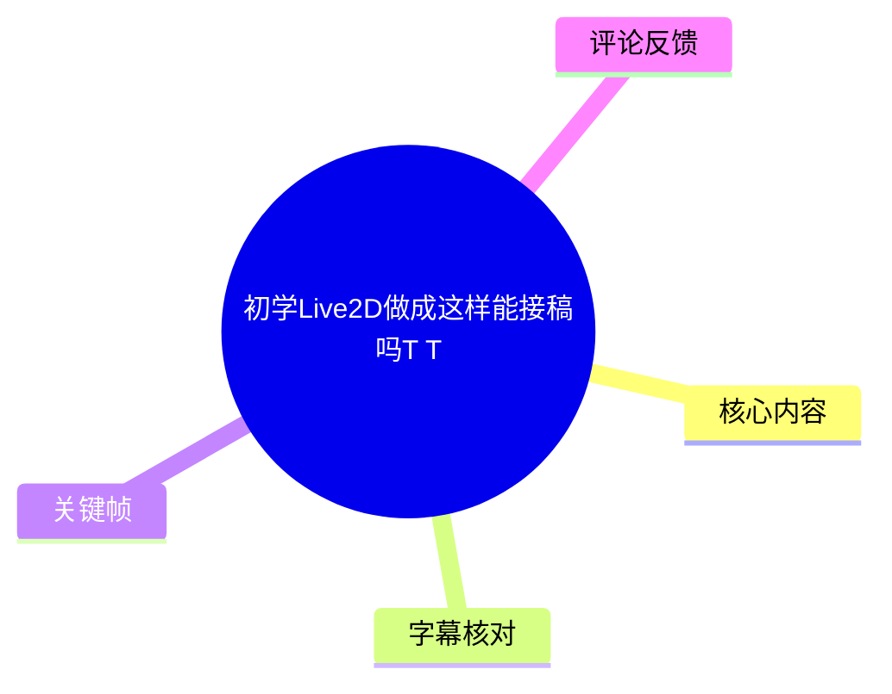
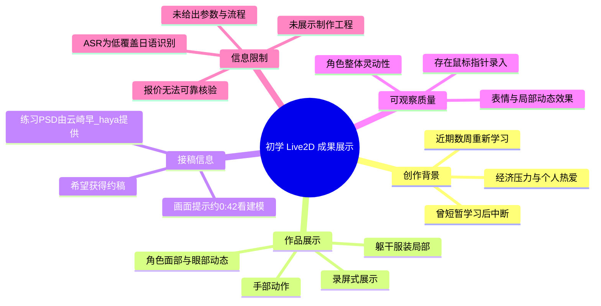
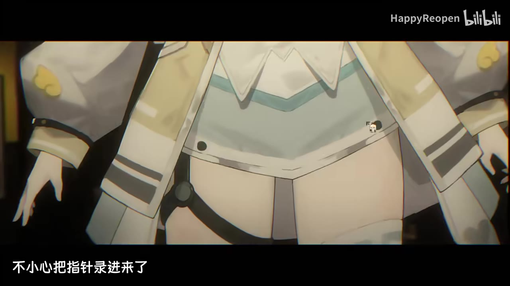
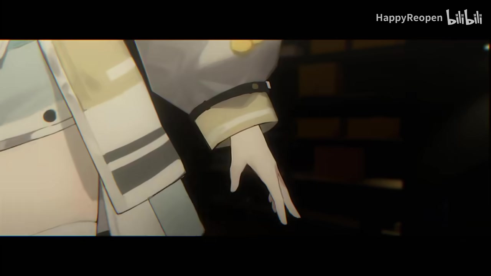

# 初学Live2D做成这样能接稿吗T T

> 来源：[Bilibili 视频](https://www.bilibili.com/video/BV19D421L7Wu) 
> UP 主：泡泡啪嗒｜发布时间：2024-03-26｜视频时长：01:43｜标签：模型展示、虚拟UP主、Live2D、VUP

## 小结

这是泡泡啪嗒展示其 Live2D 练习成果、并试探性寻求约稿机会的短片。视频核心不是教学演示，而是通过角色面部、躯干与手部等局部动态镜头，呈现一个二维角色模型的动态效果与整体观感。

UP 主在简介中说明：自己曾在前一年短暂学习过 Live2D，之后因忙碌中断；近期数周因经济压力和个人热爱重新学习，目前以某种意义上的“Live2D 全职”状态接触相关工作，并希望获得约稿。练习使用的 PSD 由 @云崎早_haya 提供，UP 主对此作出明确致谢。

从画面可直接观察到，作品包含角色表情、视线/眼部变化、身体局部和手部的动态展示；其中画面文字还提示“建模捞打请看0:42”，说明视频在约 0:42 后集中展示模型动态。另一处字幕写有“不小心把指针录进来了”，反映成片中保留了鼠标指针这一录屏痕迹。

视频没有展示 Live2D Cubism 的工程界面、PSD 分层、参数列表、物理设置、面部角度范围、导出格式或完整制作流程。因此，它可以作为“动态成品展示”的参考，但不能据此反推具体绑定方法，更不能仅凭短片判断其是否已满足全部商业委托标准。

时效上，视频发布于 2024-03-26；UP 主当时的学习阶段、接稿意愿与潜在报价均可能在之后变化。热评中出现“只要700”的价格讨论，但视频所给 ASR 不能可靠核验该价格的语境、币种或是否为正式报价，不能将其写成当前有效价目。

## 思维导图

## 目录

- [背景、作品定位与时效性](#背景作品定位与时效性-0044)
- [模型动态展示：面部与角色观感](#模型动态展示面部与角色观感-0044)
- [局部细节：服装、躯干与手部](#局部细节服装躯干与手部-0052)
- [接稿判断：可见能力、步骤缺口与限制](#接稿判断可见能力步骤缺口与限制-0119)
- [字幕比对](#字幕比对)
- [评论分析](#评论分析)
- [处理记录](#处理记录)

## 背景、作品定位与时效性 [00:44](https://www.bilibili.com/video/BV19D421L7Wu?t=44)

视频标题以“初学Live2D做成这样能接稿吗T T”提出自我评估式问题。结合简介，UP 主并非完全从零开始：其在前一年学过一小段时间 Live2D，但因工作忙碌停学；重新投入学习的时间则是“最近几个星期”。

简介中可确认的创作与接稿背景如下：

1. **学习状态**：有过短期学习基础，随后停学，近期恢复学习。
2. **接稿动机**：UP 主明确提到经济压力和对 Live2D 的热爱。
3. **工作表述**：其自述“目前是某种意义上的live2d全职”，这是创作者的当时个人表述，不等同于已建立稳定商业服务体系。
4. **素材来源**：练习 PSD 由 @云崎早_haya 提供。该信息说明展示模型并非必然由 UP 主独立完成角色原画；视频并未提供 PSD 授权范围、切分责任或原画制作责任的细节。
5. **展示定位**：成片以角色动态效果为主，不是工程录屏或逐步教程。

视频发布后的统计数据（抓取元数据）为播放 209,797、点赞 6,200、收藏 4,654、评论 298。这些互动数据反映视频传播情况，不能单独证明模型的商业交付质量或当前接稿状态。

## 模型动态展示：面部与角色观感 [00:44](https://www.bilibili.com/video/BV19D421L7Wu?t=44)

在 ASR 首段语音开始的 00:44.270 附近，画面展示金发角色的面部近景。角色具备灰色眼睛、红色下眼部装饰、较粗的眼线与多处发饰，画面通过近景强调眼部、脸部与头发区域的动态呈现。

> 图：该关键帧展示角色面部近景，画面下方可见“建模捞打请看0:42”的文字提示。它说明视频将模型动态展示放在约 0:42 后的时段，也是理解作品重点是“成品观感展示”而非软件教学的重要依据。

从画面能合理观察到的内容包括：

- 视频采用了角色近景来突出面部表现；
- 角色表情处于偏平静、微笑或轻微神态变化的状态；
- 发型、发饰、眼睛和面部阴影构成了视觉层次；
- 成片有黑色上下留边，并叠有平台水印，整体形式更接近展示剪辑或录屏片段。

但以下结论不能由当前素材确认：

- 角色是否实现了完整的 XYZ 头部转动；
- 眼球、眉毛、嘴形、呼吸、物理摆动分别使用了哪些参数；
- 是否配置了口型同步、追踪器输入或 VTube Studio 等运行环境；
- 面部动态的范围、极限角度、变形修正质量及性能开销。

因此，对这一段最稳妥的评价是：**它有效展示了面部局部的视觉效果，但未提供足够技术证据来审核完整绑定规格。**

> 图：该关键帧提供更完整的正面脸部观察角度，可用于查看眼部、刘海、发饰与面部整体风格的一致性；它有助于判断视觉观感，不足以证明后台参数结构或动态范围。

## 局部细节：服装、躯干与手部 [00:52](https://www.bilibili.com/video/BV19D421L7Wu?t=52)

ASR 在 00:52.500 至 00:58.420 记录到连续语音片段。同期关键帧的视觉重点从面部移至上半身、裙装/服装下摆与手部，补充了模型不只包含头像区域。

> 图：该关键帧展示角色躯干、衣袖、服装下摆和腰部附近的构图；画面下方明确写有“不小心把指针录进来了”。该信息既能证明视频为录屏式展示，也能提示成片存在需要清理的展示瑕疵。

此处可整理出的经验是：当 Live2D 成品需要用于接稿展示时，不应只展示脸部，应至少让观众看到服装、躯干和肢体等区域，以便呈现模型整体的完成度。该视频正是以不同局部镜头补足角色可见范围。

同时，画面中保留鼠标指针的情况也具有实际参考价值：

- 它不必然影响模型本身的绑定质量；
- 但会影响作品集、宣传片或商业交付预览的整洁度；
- 若用于正式接稿展示，宜在录屏前隐藏鼠标指针，或在剪辑阶段裁切、遮罩及重录；
- 视频没有说明该指针是操作所必需、录制软件设置导致，还是后期疏漏，不能进一步归因。

> 图：该关键帧聚焦角色手部和袖口区域，能够补充面部特写之外的肢体可见性。手部通常是 Live2D 展示中容易暴露分层、遮挡与变形问题的区域，因此该画面对评估整体展示范围具有价值。

从这些局部镜头可见的“展示步骤”可概括为：

1. 先以面部近景建立角色辨识度；
2. 再切换至躯干和服装区域，补充模型非面部部分；
3. 展示手部等肢体局部，扩展观众对可动范围的印象；
4. 以录屏式成片发布并附带接稿诉求。

这只是**视频的展示组织方式**，并不是 Live2D 制作流程。素材中没有出现从 PSD 导入、网格划分、变形器配置、参数绑定、物理运算到导出的实际操作步骤。

## 接稿判断：可见能力、步骤缺口与限制 [01:19](https://www.bilibili.com/video/BV19D421L7Wu?t=79)

ASR 在 01:19.370 后再次出现较长的连续语音识别段，直至 01:41.560。由于识别结果为日语，且未提供可用的站内中文字幕，无法将这些音频内容可靠还原为 UP 主对接稿条件、服务范围或价格的具体说明。

基于视频画面、简介和评论，可将“能否接稿”拆分为两个层面：

### 1. 视频已经展示的能力边界

可见证据支持以下描述：

- UP 主能够展示一名角色的 Live2D 动态成品；
- 展示覆盖面部、躯干服装和手部局部；
- 成片具有一定角色表现力，且热评中有观众给予“非常灵动”的正面评价；
- UP 主明确表达了接受约稿的意愿。

这些内容足以让潜在委托方初步了解其审美风格和部分动态效果。

### 2. 视频未覆盖、接稿前仍需确认的事项

若将该作品作为约稿入口，仍应以文字或样片补充下列信息；这些不是视频中已展示的参数，而是视频缺失的商业交付信息：

| 需要确认的项目 | 当前视频是否明确提供 | 说明 |
| --- | --- | --- |
| 委托类型 | 否 | 未说明是全身、半身、头像、表情包、VUP 模型或其他类型。 |
| 原画与 PSD 责任 | 否 | 视频只说明本次练习 PSD 由他人提供，未说明商单中原画、切分由谁负责。 |
| 可动范围 | 否 | 未列出头部角度、身体角度、手部动作、表情数量或开关项。 |
| 软件与交付格式 | 否 | 未说明 Cubism 工程、`.moc3`、纹理文件、动作文件或其他交付内容。 |
| 修改次数与周期 | 否 | 未展示商单排期、修改规则和验收方式。 |
| 商业使用权 | 否 | 未解释直播、视频、周边、转售等场景下的授权边界。 |
| 当前报价 | 否 | 热评虽讨论“700”，但不是可验证的正式报价单。 |

### 3. 参数与技术限制

本视频没有给出任何可复现的技术参数，包括但不限于：

- Cubism 版本；
- 画布尺寸、纹理数量与纹理尺寸；
- 参数名称、参数区间、关键形状数量；
- 网格密度、变形器层级；
- 物理参数、摆动幅度与帧率；
- 模型文件体积、CPU/GPU 占用；
- 面捕软件与追踪设备；
- 导出格式和运行端兼容性。

因此，不能从该视频提炼出“按某参数设置即可达到同样效果”的教程结论。对潜在客户而言，最可迁移的经验不是猜测技术配置，而是：**用覆盖面部、服装和肢体的短展示片建立第一印象，同时在接稿页补齐交付范围、可动规格、版权和价目等可验证信息。**

## 字幕比对

| 字幕来源 | 完整性 | 专有名词 | 时间轴 | 主要问题 |
| --- | --- | --- | --- | --- |
| Bilibili 站内字幕 | 不可用 | 不可核验 | 不可用 | 素材明确标注“未提供可用站内字幕”。 |
| 本次 ASR 字幕 | 有限 | 不适合用于核验中文画面信息 | 有真实分段时间戳 | 自动识别语言为日语，语言置信度仅 0.363；共 12 段，覆盖约 32.9 秒、占全片约 31.98%，且 01:01.090—01:19.370 存在 18.28 秒大间隔。 |

本次 ASR 已实际检查。其诊断未标记 `noAudioStream=true`，说明源视频存在音轨；问题不在于无音轨，而在于识别模型将语音识别为日语，且字幕覆盖有限。ASR 的有效时间段包括：

- 00:44.270—00:49.310；
- 00:52.500—01:01.090；
- 01:19.370—01:41.560。

ASR 中识别到的日语文本如“私は今、自分の身体を動かすことができません”“700円くらいです”等，缺少站内字幕、原始对白文本或画面内对应文字的交叉验证，不能直接翻译后当作 UP 主明确陈述。特别是“700円くらいです”虽在字面上出现“约 700 日元”，但这与热评中的“只要700”不能自动等同，也无法确认单位、报价对象及真实性。

最终采用策略为：

1. **时间轴**：优先使用 ASR 的真实起始时间，章节链接采用 00:44、00:52、01:19 等可追溯秒数；
2. **文字事实**：优先采用视频简介、元数据和关键帧中直接可见的中文画面文字；
3. **画面校正**：以关键帧确认“建模捞打请看0:42”“不小心把指针录进来了”等屏幕文字与模型展示内容；
4. **不作校正的部分**：未将 ASR 的日语句子擅自改写为中文口播含义，也未据其确认报价、技术参数或接稿条款。

## 评论分析

以下仅分析可获取的热评前三条；评论反映的是观众意见或提问，不构成已经验证的事实。

1. **我没有黑眼圈233｜1196 赞**  
   评论称自己原本预期价格为“四位数”，后来得知“只要700”，并认为“捡到宝了”。这说明观众对潜在报价表现出较高的性价比认可。  
   但评论未给出报价截图、币种、服务内容、报价时间或 UP 主确认，且 ASR 中疑似相关的“700”语句无法可靠转写，不能据此确认正式价格。

2. **云崎早_haya｜1149 赞**  
   评论认为模型“非常灵动”，并特别喜欢“模型驾驶员”。该评论与简介中“云崎早_haya 提供 PSD 给我练习”的信息相互关联：评论者很可能就是素材提供者本人。  
   其价值在于提供了对动态观感的正面反馈；局限在于评价具有合作/熟人语境的可能性，不能替代第三方技术验收。

3. **约岚打农｜328 赞**  
   评论直接询问“好奇价位捏”。这说明价格是观众关心的信息，也是视频展示中没有被清晰、可验证地固定下来的商业要素。  
   该评论仅为提问，没有提供价格答案或其他补充事实。

## 处理记录

- Worker ID：`worker-mrj0wjed-b0c290ad`
- 模型：`gpt-5.6-terra`
- 调用工具与素材：视频元数据、视频时长信息、关键帧提取结果（`frames/`）、音频 ASR 结果（`asr/asr-result.json` 与 `asr/transcript.srt`）、热评结果（`comments/comments.json`）。
- ASR 模型与运行参数：`medium`｜CUDA｜`float16`｜自动语言识别；识别语言为日语，语言置信度 `0.363037109375`，音频时长 `102.887625` 秒。
- 字幕选择：无可用 Bilibili 站内字幕；已检查本次 ASR。因 ASR 日语识别覆盖不足且无法可靠对应中文画面信息，正文以简介、元数据、关键帧可见文字和可观察画面为主，ASR 仅用于有真实依据的时间轴定位。
- 关键帧选择依据：`frames/frame-001.jpg` 用于确认面部近景及“建模捞打请看0:42”提示；`frames/frame-002.jpg` 用于补充正面面部观感；`frames/frame-003.jpg` 用于确认躯干/服装与“指针录入”画面文字；`frames/frame-004.jpg` 用于补充手部和袖口局部展示。未把无法由单帧确认的动作范围、参数结构或软件设置写成事实。
- 评论处理：只分析了可获取热评前三条，未扩展至其他评论。
- 缓存清理：提供的素材未包含缓存清理执行日志，无法核验是否已清理；不将其表述为已完成。
- 未解决问题：无法确认视频口播完整中文内容、当前是否仍接稿、正式报价及币种、商单范围、PSD 授权方式、Live2D 参数与软件配置。
