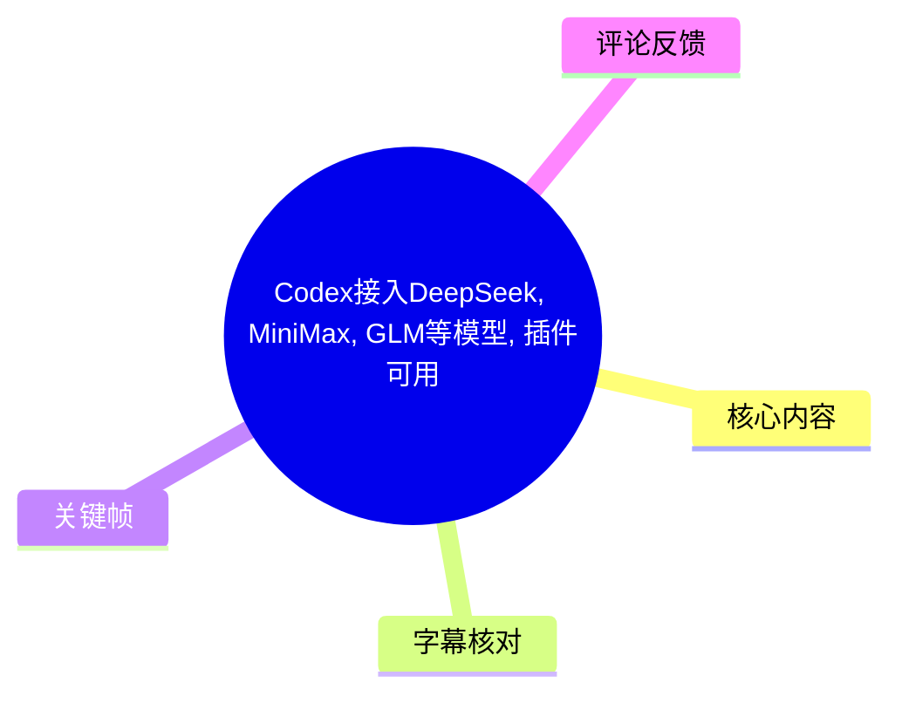
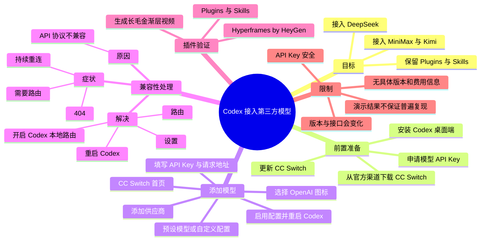
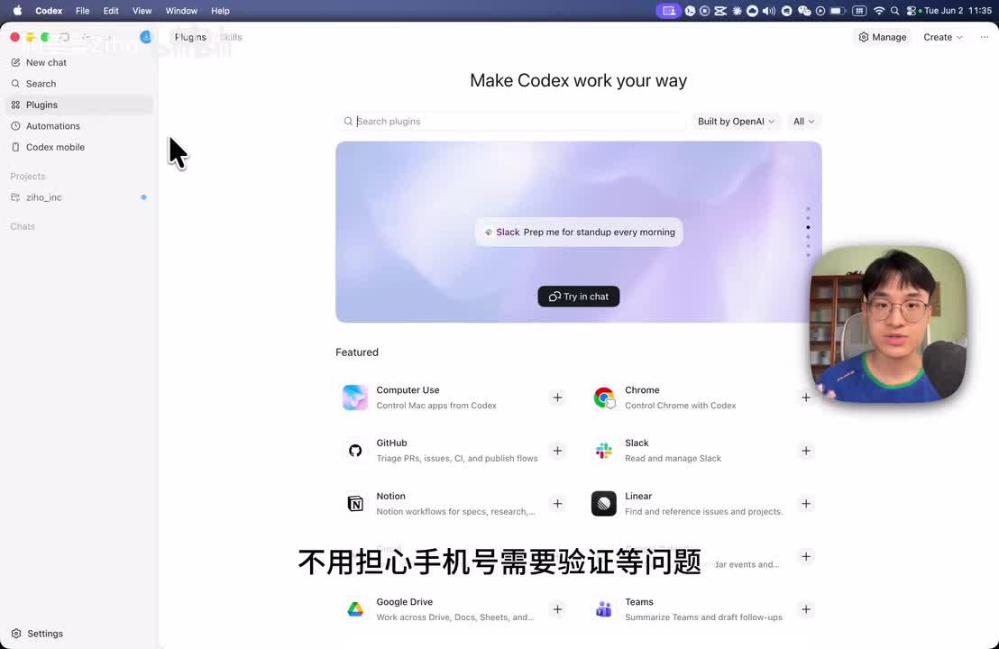
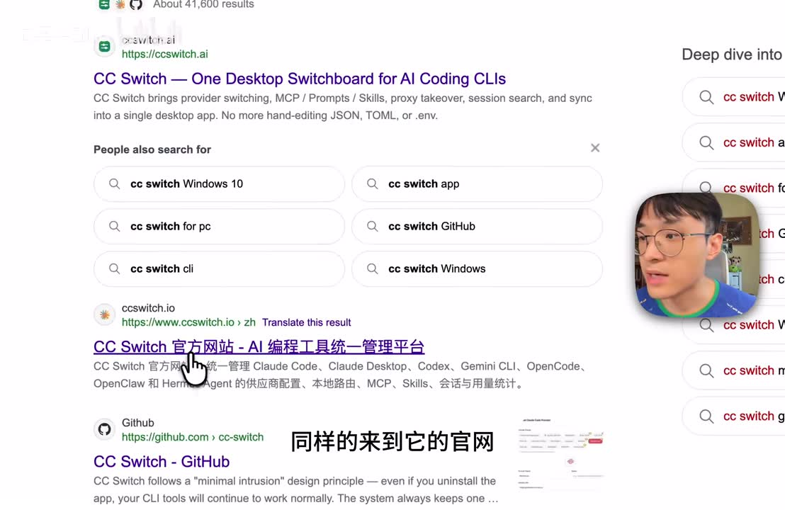
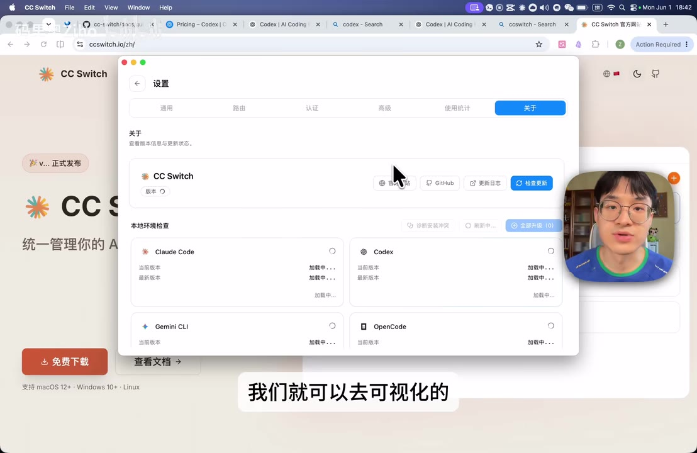
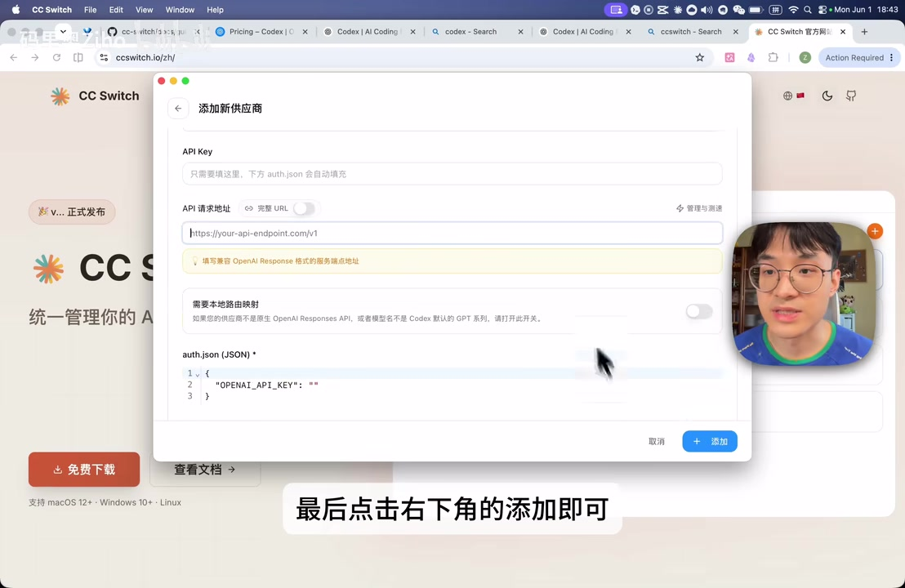

# Codex接入DeepSeek、MiniMax、GLM 等模型，插件可用

> 来源：[Bilibili 视频](https://www.bilibili.com/video/BV1RNV66MEWp) 
> UP 主：码里奥Ziho｜视频时长：03:50｜合集：AIcode  
> 本文仅整理视频中展示的配置流程与说法；第三方工具、模型兼容性、API 价格与产品界面均可能随版本变化。

## 小结

视频展示了一条将第三方模型接入 Codex 桌面端的路径：先安装 Codex，再通过 **CC Switch** 添加模型供应商配置，并在接口协议不兼容时开启 Codex 的“本地路由”，由 CC Switch 对请求进行处理与转换。

作者以 DeepSeek 为例：在 CC Switch 的 OpenAI 配置入口中选择预设供应商，向模型供应商申请 API Key，填入后由工具自动完成 Codex 模型映射；添加并启用后重启 Codex。视频声称，此时登录界面会消失，右下角模型会显示为 “DeepSeek V4”。

关键技术点不是“填入 Key 即可”，而是 **API 协议兼容性**。视频称 DeepSeek、Kimi、MiniMax、硅基流动等供应商使用的接口版本与 Codex 使用的新版 OpenAI API 不一致；若出现“不断重连”、`404` 或界面提示“需要路由”，需要在 CC Switch 的“设置 → 路由 → 本地路由”中开启 Codex 本地路由，并重启 Codex。

视频还演示了功能保留：接入第三方模型后，作者在 Codex 的 `Plugins` 与 `Skills` 中添加 **Hyperframes by HeyGen**，输入制作“长毛金渐层”主题视频的提示词，执行过程调用该 Skill，随后视频生成完成。作者据此认为，第三方模型仍可使用 Codex 的插件能力，用于编程、视频制作与文章撰写等任务。

适合已有 Codex 桌面端、第三方模型 API Key，并希望通过图形界面管理供应商配置的用户。操作中涉及 API Key，必须避免将密钥粘贴到不可信网页、截图或公开仓库；CC Switch 也应从官方渠道获取，视频特别提示网络上存在仿冒或盗版版本。

需要注意，视频中的“无需登录”“功能未被阉割”“响应速度非常快”均属于作者在演示环境中的陈述，不等于所有账号、区域、模型、版本和套餐下都能复现。视频没有给出 CC Switch、Codex、各模型 API 的具体版本号、费用、速率限制、隐私策略或完整错误日志。

## 思维导图

## 目录

- [视频主张、适用范围与前置条件](#视频主张适用范围与前置条件)
- [下载安装与更新 CC Switch](#下载安装与更新-cc-switch)
- [在 CC Switch 中添加第三方模型](#在-cc-switch-中添加第三方模型)
- [以 DeepSeek 为例创建并填入 API Key](#以-deepseek-为例创建并填入-api-key)
- [协议不兼容、404 与本地路由](#协议不兼容404-与本地路由)
- [验证模型接入结果](#验证模型接入结果)
- [插件与 Skills：Hyperframes 视频生成演示](#插件与-skills-hyperframes-视频生成演示)
- [完整操作清单与排错顺序](#完整操作清单与排错顺序)
- [限制、风险与时效性](#限制风险与时效性)
- [字幕比对](#字幕比对)
- [评论分析](#评论分析)
- [处理记录](#处理记录)

## 视频主张、适用范围与前置条件 [00:00:00](https://www.bilibili.com/video/BV1RNV66MEWp?t=0)

视频开头提出的主要结论是：Codex 可以接入 DeepSeek、MiniMax、Kimi 等第三方模型，并可继续使用插件、自动化 Skills 等功能。作者还称接入后“不需要登录”，因而可避免手机号验证问题。

这里应区分三类信息：

1. **视频演示的操作事实**：作者后续确实展示了 CC Switch 的供应商添加、路由设置和插件调用流程。
2. **作者的环境结论**：作者称登录界面会在正确配置后自动消失，模型会显示为 “DeepSeek V4”，且功能不会被削弱。
3. **未在视频中验证的通用性**：不同 Codex 版本、CC Switch 版本、模型供应商账号、API 套餐、网络区域和产品策略下，登录要求及插件可用性可能不同。视频未提供可复现的版本号或配置导出文件。

前置条件包括：

- 已安装 Codex 桌面端；
- 可访问模型供应商的 API 开放平台；
- 已拥有或能够创建对应模型的 API Key；
- 安装 CC Switch，并尽量保持为最新版本；
- 如出现接口不兼容问题，允许通过 CC Switch 的本地路由处理请求。

> 图：画面显示 Codex 的 `Plugins` 页面，左侧包含 New chat、Search、Plugins、Automations 等入口，页面列出 Computer Use、Chrome、GitHub、Slack、Notion 等插件。该图支持视频“接入后仍可使用插件与自动化能力”的演示背景，但不能单独证明所有第三方模型在所有环境下均可使用这些功能。

## 下载安装与更新 CC Switch [00:00:13](https://www.bilibili.com/video/BV1RNV66MEWp?t=13)

### 1. 安装 Codex 桌面端

视频的起始操作是：

1. 在搜索引擎中搜索 `Codex`；
2. 进入 Codex 官网；
3. 选择对应操作系统下载安装；
4. 打开应用后，若出现登录界面，作者建议暂时不处理，继续进行第三方模型接入。

站内中文字幕在 `00:00:19,440` 至 `00:00:21,960` 明确说明“打开之后需要登录，这个咱们暂时不用管”。视频并未说明跳过登录是否适用于所有版本。

### 2. 搜索并从官方渠道下载 CC Switch

[00:00:21](https://www.bilibili.com/video/BV1RNV66MEWp?t=21) 作者搜索 `CC Switch` 并进入其官网，强调该工具存在许多盗版或仿冒版本，必须从官方网站下载。

> 图：画面中搜索结果同时出现 `ccswitch.ai`、`ccswitch.io` 和 GitHub 条目，作者光标指向标为“官方网站”的结果。这张图的价值在于说明下载来源需要核验；但仅凭截图无法确认某个域名在当前时点仍是官方唯一入口，下载前仍应自行核对官方发布渠道与签名信息。

### 3. 更新已有的 CC Switch

若已经安装 CC Switch，视频建议按以下路径检查更新：

1. 打开 **设置**；
2. 找到 **关于**；
3. 点击 **检查更新**；
4. 确保 CC Switch 已更新至最新版本。

视频未提供最低版本号、更新日志或不同操作系统的路径差异，因此“最新版本”只能作为作者的操作建议，不能据此推导具体版本要求。

> 图：画面展示 CC Switch 设置窗口的“关于”页，右上区域可见“检查更新”按钮，窗口内还列出 Claude Code、Codex、Gemini CLI、OpenCode 等工具状态。该图直接对应“设置 → 关于 → 检查更新”的步骤，并表明该工具界面同时管理多种 AI 编程工具。

## 在 CC Switch 中添加第三方模型 [00:00:43](https://www.bilibili.com/video/BV1RNV66MEWp?t=43)

进入 CC Switch 后，作者使用可视化界面配置第三方模型。视频给出的入口和分支如下。

### 入口：OpenAI 图标与添加按钮

1. 回到 CC Switch 首页；
2. 选择 **OpenAI** 图标；
3. 点击右上角 **添加**；
4. 在供应商列表中选择预设模型，或进入自定义配置。

视频称，国内主流模型中可看到 DeepSeek、智谱（字幕写作“质朴”）、MiniMax、Kimi 等预设项。标题提到 GLM，但视频字幕与演示中实际出现的是“智谱 AI”；未展示具体 GLM 型号、模型 ID 或调用参数，因此不能补充推断其具体配置。

### 自定义供应商配置

如使用第三方站点而非工具内预设的模型供应商，视频给出的要求是：

- 点击 **自定义配置**；
- 按该站点提供的文档填写：
  - `API Key`
  - 请求地址 / API 请求地址
- 点击右下角 **添加**。

视频没有给出统一可直接复制的 URL、请求头、模型名、协议版本或 JSON 配置。因此应以目标供应商官方 API 文档为准，不能用视频中的通用描述替代接口文档。

> 图：画面为“添加新供应商”窗口，能看到 `API Key`、`API 请求地址`、`auth.json (JSON)`、基础路由映射开关与右下角“添加”按钮。它说明自定义接入不只有 Key 输入，还涉及请求地址和认证配置；图中示例地址是占位文本，不能作为真实接口地址使用。

## 以 DeepSeek 为例创建并填入 API Key [00:01:12](https://www.bilibili.com/video/BV1RNV66MEWp?t=72)

作者用 DeepSeek 演示预设供应商配置。站内字幕时间轴给出的步骤如下：

1. 在 CC Switch 的供应商列表中点击 **DeepSeek**；
2. 向下滚动；
3. 视频称 API 地址已由预设自动填写，通常无需再手动修改；
4. 前往 DeepSeek 官网；
5. 进入 **API 开放平台**；
6. 在左侧找到 **API Keys**；
7. 创建新的 Key；
8. 复制新 Key，粘贴回 CC Switch；
9. 继续向下滚动，确认 CC Switch 对 Codex 模型的自动映射；
10. 视频称这些映射项无需改动，点击 **添加**；
11. 添加完成后，必须点击 **启用**；
12. 重启 Codex 桌面端。

### 参数与安全边界

| 项目 | 视频中的说明 | 应注意的边界 |
| --- | --- | --- |
| API Key | 向模型供应商申请并粘贴到 CC Switch | 属于高敏感凭证，不应出现在截图、聊天记录、录屏、代码仓库或公共配置文件中。 |
| API 请求地址 | DeepSeek 预设中已填好；自定义站点须按文档填写 | 不应凭经验替换 URL；不同供应商、区域和 API 版本的地址可能不同。 |
| Codex 模型映射 | CC Switch 会自动映射；作者建议不改 | 视频未展示映射规则、模型名或回退策略，遇到异常应查看工具与供应商文档。 |
| 启用状态 | 添加后需要点“启用” | 只添加未启用可能导致 Codex 中模型不显示或不可用。 |
| 重启 | 设置完成后重启 Codex | 视频多次将重启作为配置生效和排错步骤。 |

视频在 `00:01:48,320` 至 `00:01:53,900` 称，正确配置且重启后，Codex 登录界面会自动消失，右下角模型会变为“DeepSeek V4”。这应理解为作者的演示现象，不应视作 DeepSeek 官方模型命名、Codex 的固定显示规则或免登录承诺。

## 协议不兼容、404 与本地路由 [00:01:53](https://www.bilibili.com/video/BV1RNV66MEWp?t=113)

这是视频最重要的排错环节。作者指出，模型虽已显示在 Codex 中，但直接提问仍可能出现：

- 不断重连；
- `404` 错误；
- CC Switch 中显示“需要路由”。

### 视频给出的原因

作者的解释是：

- DeepSeek、Kimi、MiniMax、硅基流动等供应商使用“老版本的 API 接口”；
- Codex 使用“最新版本的 OpenAI API 接口”；
- 两者协议不兼容，因此需要 CC Switch 进行一次协议转换。

该解释描述了视频中的工具定位：CC Switch 充当请求处理与适配层。视频未展示 HTTP 请求、响应体、API 版本号或协议差异细节，因而无法据此确认某一供应商当前具体使用何种 API 标准，也不能把所有 `404` 一概归因为协议版本问题。

### 视频中的解决步骤

[00:02:14](https://www.bilibili.com/video/BV1RNV66MEWp?t=134) 当看到“需要路由”时，按以下步骤处理：

1. 回到 CC Switch；
2. 点击 **设置**；
3. 找到 **路由**；
4. 找到 **本地路由**；
5. 开启 **Codex 的本地路由**；
6. 重启 Codex；
7. 再次向模型提问测试。

视频称，开启后所有请求会经过 CC Switch 处理，以使模型适配 Codex；作者重新测试后获得返回，且主观评价“响应速度非常快”。

### “需要路由”的实际含义范围

视频把“需要路由”作为协议不兼容的信号。就排错实践而言，可以把它视为优先检查项，但不应排除其他可能性：

- API Key 无效、已过期或无余额；
- 请求地址填写错误；
- 模型供应商侧没有对应模型权限；
- 网络、代理或 DNS 问题；
- Codex / CC Switch 版本变化；
- 路由未真正启用，或启用后没有重启 Codex；
- 供应商接口临时故障或限流。

这些是基于常见 API 接入故障作出的排错补充，并非视频逐项展示的结论。

## 验证模型接入结果 [00:02:34](https://www.bilibili.com/video/BV1RNV66MEWp?t=154)

作者重启 Codex 后再次发送请求，视频显示模型已有返回，并称响应速度很快。由此作者总结：DeepSeek 已通过 CC Switch 接入 Codex；其他模型可按相同逻辑接入。

建议把“接入成功”拆成以下可观察项逐一验证：

1. **CC Switch 配置存在且已启用**：不是仅保存了草稿。
2. **Codex 已重启**：视频将重启作为配置加载步骤。
3. **模型名称或可选模型状态正常**：视频环境中右下角显示“DeepSeek V4”。
4. **基础对话可返回结果**：排除持续重连与 `404`。
5. **需要路由时已启用本地路由**：确保请求经 CC Switch 转换。
6. **插件任务可正常调用**：不仅验证文本对话，也验证视频后续展示的 Skill 调用。

视频没有展示 API 调用日志、令牌消耗、上下文长度、函数调用成功率、长任务稳定性或多轮会话可靠性。因此，基础回复成功并不等同于所有 Codex 能力已完整验证。

## 插件与 Skills：Hyperframes 视频生成演示 [00:02:49](https://www.bilibili.com/video/BV1RNV66MEWp?t=169)

作者认为经 CC Switch 接入的优势之一，是 Codex 的功能没有被“阉割”。随后演示插件与 Skill 调用。

### 演示步骤

1. 点击 Codex 左上角的 **Plugins**；
2. 在 `Plugins` 与 `Skills` 中浏览官方提供的功能；
3. 向下滚动，添加 **Hyperframes by HeyGen**；
4. 作者称该插件可用于制作视频；
5. 点击左侧 **New chat**；
6. 输入提示词；
7. 观察执行过程是否调用刚添加的 Hyperframes Skill；
8. 等待生成完成。

### 视频中的提示词

站内英文字幕与阿拉伯语字幕较清晰地给出提示词含义为：

> 帮我制作一个关于长毛金渐层（long-haired golden shaded British Shorthair）的视频。

站内中文字幕转写为“长矛经验层”，本次 ASR 转写为“长毛经验层”，均存在识别错误；结合英文字幕的 `long-haired golden shaded British Shorthair`，本文校正为“长毛金渐层”。

### 演示结果

视频在 `00:03:16,100` 至 `00:03:23,970` 显示执行流程调用了刚添加的 Hyperframes Skill；随后在 `00:03:24,730` 至 `00:03:26,210` 称视频生成完成。作者据此得出结论：第三方模型也利用了 Codex 的插件功能。

这只能证明作者录制环境中展示了一次调用过程。视频未给出：

- Hyperframes 的授权、计费与账号要求；
- 生成视频的时长、分辨率、下载地址或实际成片质量；
- 插件执行中模型、Codex 与 HeyGen 服务之间的权限边界；
- 失败重试、配额限制和隐私处理规则。

## 完整操作清单与排错顺序 [00:03:26](https://www.bilibili.com/video/BV1RNV66MEWp?t=206)

### 最小接入流程

1. 从 Codex 官方渠道下载安装 Codex 桌面端。
2. 从 CC Switch 官方渠道下载安装工具，避免仿冒版本。
3. 若已安装 CC Switch：进入 **设置 → 关于 → 检查更新**。
4. 回到 CC Switch 首页，选择 **OpenAI** 图标。
5. 点击右上角 **添加**。
6. 根据供应商类型选择：
   - **预设供应商**：如视频中展示的 DeepSeek、智谱、MiniMax、Kimi 等；
   - **自定义配置**：按目标站点文档填写 API Key 与请求地址。
7. 在模型供应商 API 开放平台创建 API Key。
8. 粘贴 API Key；对视频中预设的 DeepSeek，作者建议保留已填写的 API 地址和自动模型映射。
9. 点击 **添加**，再点击 **启用**。
10. 重启 Codex。
11. 若可见模型但提问出现重连、`404` 或“需要路由”：进入 **设置 → 路由 → 本地路由**，开启 Codex 本地路由。
12. 再次重启 Codex 并发起基础测试。
13. 如需验证扩展能力，在 `Plugins` / `Skills` 中添加插件，执行一个可观察的任务。

### 按视频与热评整理的优先排错顺序

| 优先级 | 检查项 | 依据 |
| --- | --- | --- |
| 1 | CC Switch 是否为最新版 | 视频要求检查更新；热评也将其列为首项。 |
| 2 | API Key 是否已正确填写且配置已启用 | 视频强调添加后要点击“启用”。 |
| 3 | 是否关闭并重新打开 / 重启 Codex | 视频在添加和路由设置后均要求重启；热评也重复该建议。 |
| 4 | 是否出现“需要路由”、持续重连或 `404` | 视频将这些现象与协议兼容问题关联。 |
| 5 | 是否已开启 Codex 本地路由 | 视频给出“设置 → 路由 → 本地路由”的处理路径。 |
| 6 | 请求地址、供应商权限与 API 服务状态 | 视频对自定义站点要求按其文档填写；其余项是必要的常规补充排查。 |

### 无需路由的条件

视频结尾说明：如果某些模型“天然就适配 Codex 的接口”，则不需要路由；可在设置中的本地路由处将 Codex 路由关闭。这里没有提供判断模型是否原生兼容的列表或检测方式，因此实际应以 CC Switch 的状态提示、供应商文档和测试结果为准。

## 限制、风险与时效性 [00:03:42](https://www.bilibili.com/video/BV1RNV66MEWp?t=222)

### 视频明确或隐含的限制

- 视频重点是图形化接入演示，不包含命令行配置、配置文件路径或可导入的 JSON/TOML。
- 未提供 Codex、CC Switch、DeepSeek、MiniMax、Kimi、智谱等产品的具体版本号。
- 未给出 API 模型名称、价格、余额要求、速率限制、上下文上限或地区可用性。
- “DeepSeek V4”是视频界面中展示的名称；本文不将其扩展为供应商当前正式产品信息。
- “无需登录”是作者在所录环境中的表述，可能受应用版本、账号状态、地区及产品策略影响。
- “插件没有被阉割”依据一次 Hyperframes 演示，不能推导所有插件、自动化功能或权限场景都可用。

### 安全与隐私风险

- API Key 可产生调用费用或访问模型资源，应最小化暴露范围。
- 仅从可验证的官方渠道下载 CC Switch、Codex 与插件，不使用来源不明的安装包。
- 开启本地路由意味着请求会经 CC Switch 处理；在处理业务代码、企业资料或隐私文本前，应自行审查工具及模型供应商的隐私政策、日志策略和数据传输路径。
- 外部插件可能需要额外账户授权，并可能把提示词、文件或任务数据发送至其服务端。视频未展示权限弹窗与数据处理条款。

### 时效性说明

本视频时长为 230 秒，元数据时间戳对应 2026 年 6 月。AI 编程客户端、供应商 API、协议兼容层和插件市场都可能快速变化。本文保留视频中的产品名称与路径，不将其视为长期有效的官方文档；实际操作前应以当前版本界面和官方文档为准。

## 字幕比对

| 字幕来源 | 完整性 | 专有名词 | 时间轴 | 主要问题 |
| --- | --- | --- | --- | --- |
| Bilibili 站内中文字幕 `p01-ai-zh.srt` | 完整，覆盖约 `00:00:00,180–00:03:49,700` | 大部分可辨，但有“deep sick”“质朴”“长矛经验层”等误写 | 细粒度、逐句时间轴，可直接用于章节定位 | 中英文产品名被语音化转写；“长毛金渐层”误识别明显。 |
| Bilibili 站内英文字幕 `p01-ai-en.srt` | 完整，覆盖同一时段 | DeepSeek、MiniMax、Kimi、SiliconFlow、Hyperframes by HeyGen 等较清晰 | 细粒度、逐句时间轴，可用于交叉核验 | 个别内容为空段；部分表述是翻译而非原声逐字稿。 |
| 本次 ASR `medium` | 有语音识别结果，诊断显示语音覆盖约 89.81% | 多处错识别，如 `Dipsic`、`OpenEye`、`Deepseq`、`Hagen`、`規矩流露` | 有时间戳，但仅 10 个超长段，且首段从 `00:00:23,380` 开始，与站内字幕前 23 秒内容不一致 | 时间分段过粗，首段包含开头至 CC Switch 搜索等大量内容；不适合单独作为精确章节时间轴。 |

### 最终字幕选择

本文以 **Bilibili 站内中文字幕的细粒度 SRT 时间轴**作为章节链接依据，并用站内英文字幕和本次 ASR 交叉核对专有名词与语义。

本次 ASR 已被检查：其诊断中**没有** `noAudioStream=true` 标记，且显示识别语言为中文、`languageProbability=0.99951171875`、音频时长约 `229.715` 秒，因此源视频并非无音轨。ASR 的主要问题是分段粗糙和专有名词错识别，不是工具无音轨失败。

### 关键校正

| 原始转写形式 | 本文采用 | 校正依据 |
| --- | --- | --- |
| `deep sick` / `Dipsic` / `Deepseq` | DeepSeek | 视频标题、站内英文字幕、上下文一致。 |
| `OpenEye` | OpenAI | 站内中英文字幕均指向 OpenAI 图标。 |
| `质朴` / `Zip` | 智谱 AI | 站内英文字幕明确为 Zhipu AI。 |
| `規矩流露` | 硅基流动（SiliconFlow） | 站内中文字幕与英文字幕中的 SiliconFlow 相互印证。 |
| `Hyper Frames by Hagen` | Hyperframes by HeyGen | 站内英文字幕与视频字幕一致。 |
| `长矛经验层` / `长毛经验层` | 长毛金渐层 | 英文字幕明确为 long-haired golden shaded British Shorthair。 |

## 评论分析

本次可获取的热评数据中仅有 **2 条**，未达到“热评前三条”的数量；以下仅分析可获取内容，不补造第三条评论。

### 1. “DeepSeek 模型一直不显示”问题反馈

- **评论者**：遇风遇海
- **获赞**：13
- **核心观点**：评论者称 DeepSeek 模型一直显示为“自定义”且无法使用；其自述已经尝试多种方法，确认已开启路由并重启，但问题仍未解决。
- **补充价值**：这说明视频中的“开启路由并重启”并非对所有故障都足够，至少存在模型显示或可用性异常的未覆盖情形。
- **可信度与边界**：这是用户个案反馈，评论未包含 CC Switch/Codex 版本、供应商配置截图、错误日志、请求地址、API 账户状态或网络环境，不能据此确定根因。可作为“视频流程可能无法覆盖所有配置问题”的证据，而不是确定的技术结论。

### 2. 社区给出的三项基础排查

- **评论者**：AnDa筱原
- **获赞**：6
- **核心观点**：建议依次确认：
  1. CC Switch 是最新版；
  2. 已开启路由；
  3. 配置完成后关闭 Codex 再重新打开。
- **补充价值**：这与视频中的更新、开启本地路由、重启 Codex 三个关键动作完全一致，可作为简洁的首轮排错清单。
- **可信度与边界**：该评论是经验建议，未附官方文档或完整故障样本。它适用于优先排查，但不能替代 API Key、请求地址、账户权限、供应商服务状态等更深层检查。

## 处理记录

- **Worker ID**：worker-mrj0wbly-5dc4e50c
- **模型**：gpt-5.6-terra
- **调用工具与素材**：使用任务提供的视频元数据、站内多语言 SRT 字幕、`asr/asr-result.json` 诊断与 ASR 时间轴字幕、热评 JSON、关键帧清单及所提供的关键帧画面。
- **ASR 检查结果**：已检查本次 ASR；识别模型为 `medium`，语言为中文，CUDA / float16，音频时长约 229.715 秒；未标记 `noAudioStream=true`。ASR 有时间戳但分段过粗，且专有名词错识别较多。
- **字幕选择**：章节时间轴优先采用站内中文字幕 `p01-ai-zh.srt` 的逐句起止时间；以站内英文字幕校正 DeepSeek、Zhipu AI、SiliconFlow、Hyperframes by HeyGen 及“长毛金渐层”等专有名词；ASR 用于确认存在中文音轨及核验整体语义。
- **关键帧选择依据**：
  - `frames/frame-001.jpg`：展示 Codex 插件页，支撑插件与自动化能力的讨论；
  - `frames/frame-002.jpg`：展示 CC Switch 搜索结果与官方来源提醒；
  - `frames/frame-003.jpg`：展示 CC Switch“关于”页和检查更新入口；
  - `frames/frame-004.jpg`：展示添加供应商表单中的 API Key、请求地址、认证 JSON 与添加按钮。
- **评论处理范围**：按要求仅处理可获取的热评前三条；实际素材仅提供 2 条，未补造缺失评论。
- **缓存清理**：未提供缓存清理工具执行日志或结果；因此不宣称已执行缓存清理。
- **未解决问题**：素材未提供各工具版本号、实际 API 地址、模型 ID、费用与限流规则、完整错误日志、路由转换机制细节，以及 Hyperframes 插件的授权和计费信息。
