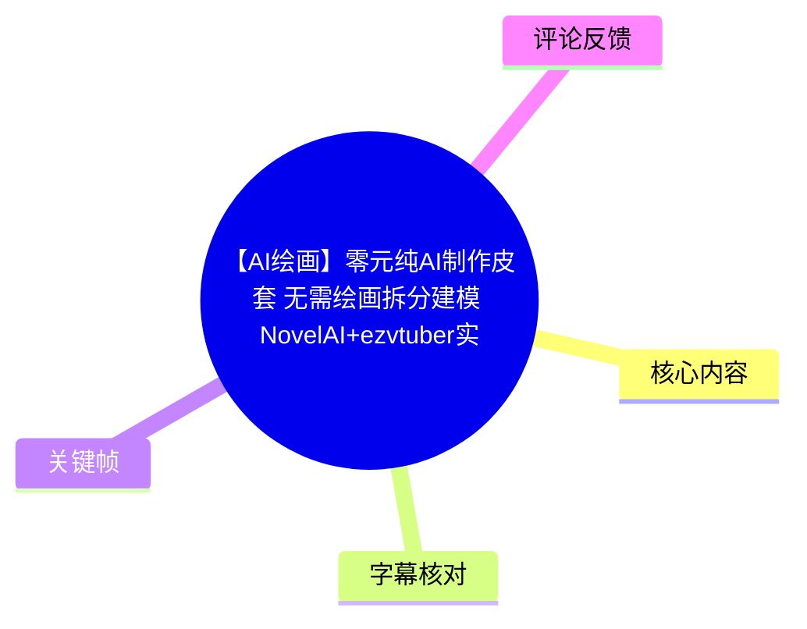
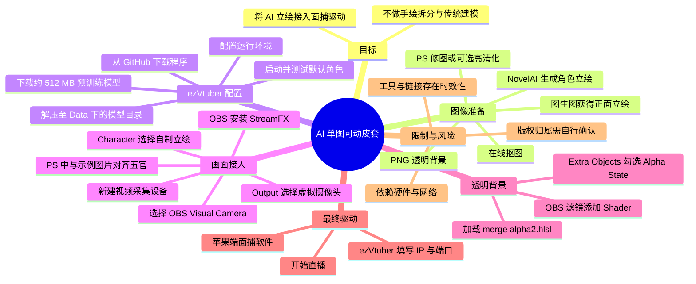
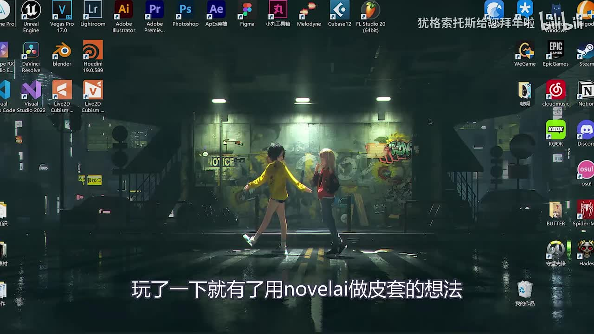
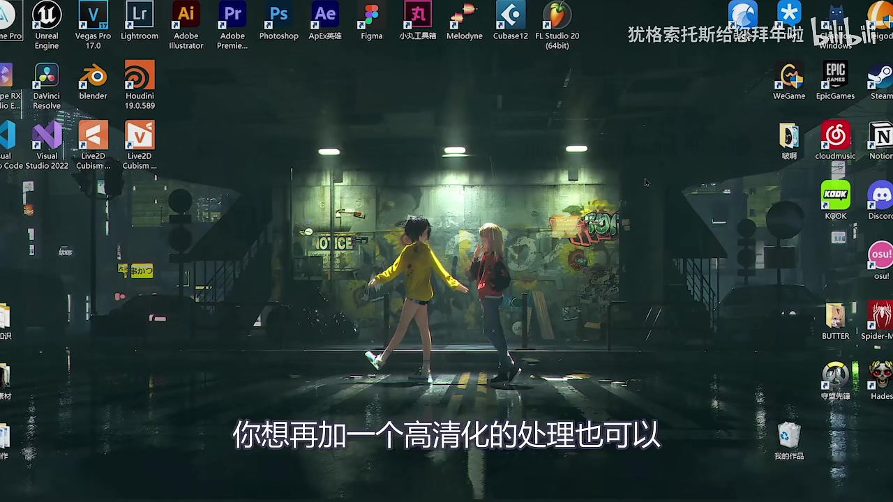
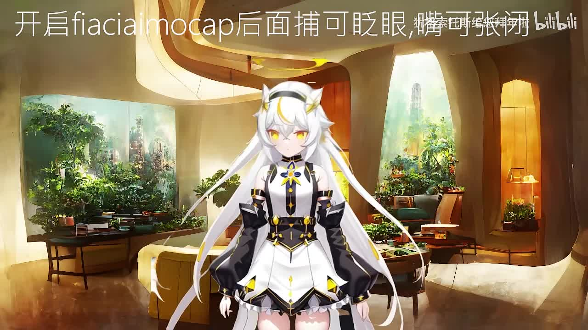

# 【AI绘画】零元纯AI制作皮套 无需绘画拆分建模 NovelAI+ezvtuber实现十分钟一个高质量可动皮套

> 来源：[Bilibili 视频](https://www.bilibili.com/video/BV1dW4y1J7vU)<br>
> UP 主：犹格索托斯给您拜年啦｜发布时间：2022-10-17｜视频时长：8 分 56 秒

## 小结

本视频给出一条将 **NovelAI 生成的单张二次元人物立绘** 转换为可驱动虚拟形象的实操链路：生成或准备人物图、抠图和可选高清化、配置 ezVtuber/EasyVtuber、以 Photoshop 对齐人物图与示例图、通过 OBS 与 StreamFX 接入虚拟摄像头、使用 Shader 去除背景，最后接入苹果端面捕软件进行驱动。

核心思路不是传统 Live2D 流程中的“绘制分层—切件—建模—绑定”，而是将一张带透明背景的高清 PNG 交给 ezVtuber 的预训练模型处理。视频作者明确表示这是一份**思路和部署演示**，不是 ezVtuber 的完整原理或细致教程；更完整的工具教程被引导至简介中的 yuyuzi 老师视频。

视频中的关键技术路径是：**NovelAI → PNG 立绘 → ezVtuber → OBS Virtual Camera → StreamFX Shader → 面捕输入**。其中，模型文件提到下载约 **512 MB** 的预训练包；在 ezVtuber 中，`Output` 需要选择 `OBS Visual Camera`，`Character` 选择自己的立绘，并在 `Extra Objects` 勾选 `Alpha State`。即使勾选后人物已经出现，画面背景仍可能不透明，作者再用 Shader 处理透明背景。

“零元”“十分钟一个”是标题中的宣传性描述，不应理解为无任何条件的客观承诺。视频本身依赖 PC、图像生成能力、Photoshop、OBS、StreamFX、预训练模型下载、网络访问以及苹果端设备面捕等前置条件；热评也反映出本地 AI 推理可能占用较多 GPU 资源。视频未展示不同硬件、不同人物构图或不同版本软件下的稳定性与耗时测试。

内容发布于 2022 年。NovelAI、EasyVtuber/ezVtuber、OBS Virtual Camera、StreamFX、预训练模型下载地址、Shader 兼容性和苹果端面捕应用均可能已经更新、迁移、失效或改变授权条件。复现时应以各项目当前官方文档、发行页与许可证为准，并特别核验人物素材和模型的版权边界。

## 思维导图





## 目录

- [背景、目标与适用范围](#背景目标与适用范围)
- [生成与准备角色立绘](#生成与准备角色立绘)
- [部署 ezVtuber 与预训练模型](#部署-ezvtuber-与预训练模型)
- [对齐立绘并接入 OBS](#对齐立绘并接入-obs)
- [透明背景：Alpha State 与 Shader](#透明背景alpha-state-与-shader)
- [面捕、直播与版权提醒](#面捕直播与版权提醒)
- [完整复现步骤与参数清单](#完整复现步骤与参数清单)
- [限制、时效性与复现建议](#限制时效性与复现建议)
- [字幕比对](#字幕比对)
- [评论分析](#评论分析)
- [处理记录](#处理记录)

## 背景、目标与适用范围 [00:00:47](https://www.bilibili.com/video/BV1dW4y1J7vU?t=47)

作者回顾此前制作过“AI 画图配合动态软件制作动态壁纸”的视频；在体验 NovelAI 后，产生了把 AI 图像用于“皮套”的想法。这里的“皮套”指可作为虚拟主播/直播画面角色使用的二维人物形象。

作者在 [00:01:09](https://www.bilibili.com/video/BV1dW4y1J7vU?t=69) 明确界定了视频范围：

- 主要由 **ezVtuber** 实现；
- 本片只讲“思路”和实际用到的工具；
- 不展开 ezVtuber 的完整细节教程；
- 更详细的 ezVtuber 教程建议观看 yuyuzi 老师的教程。

因此，这支视频更适合作为**工具串联与最小可行流程**参考，适用对象包括：

1. 已能获得或生成二次元人物立绘的人；
2. 希望避免传统二维角色拆分、建模流程的初学者；
3. 想把角色输出到 OBS 场景或直播画面的人；
4. 能自行处理软件安装、模型文件、网络下载和设备连接问题的人。



> 图：关键帧展示作者桌面及字幕“玩了一下就有了用 novelai 做皮套的想法”。它对应本教程的起点：将 AI 生图从静态图像用途扩展到可动角色用途。

## 生成与准备角色立绘 [00:01:30](https://www.bilibili.com/video/BV1dW4y1J7vU?t=90)

### 1. 生成角色图像

作者在 [00:01:30](https://www.bilibili.com/video/BV1dW4y1J7vU?t=90) 进入“生成皮套”步骤。关于 NovelAI 的部署或官网出图，作者没有展开教学，而是直接展示已经生成好的立绘案例。

视频表达的最低图像目标是：

- 人物立绘；
- 后续可处理为透明背景；
- 最好具有足够清晰度；
- 最终导出为 **PNG** 格式。


> 图：画面字幕说明作者将直接展示“已经生成好的立绘”。这说明 NovelAI 的提示词、采样参数、部署细节并非本视频提供的内容，复现者需要自行掌握或另寻相关教程。

### 2. 抠图、修图与高清化

在 [00:01:47](https://www.bilibili.com/video/BV1dW4y1J7vU?t=107)，作者表示自己没有手动抠图，而是“随便找了扣图网站”完成抠图。视频没有给出特定抠图站的名称、网址或抠图参数，因此不能据此指定唯一工具。

抠图后，作者在 [00:02:02](https://www.bilibili.com/video/BV1dW4y1J7vU?t=122) 给出两条可选处理路线：

- 使用 Photoshop 修整细节后，直接用该人物图继续；
- 在修图后，额外进行“高清化”处理。

作者把高清化教程链接放在简介区，引用的是“阿康老师教程”，但本视频未讲解其具体算法、模型、放大倍率或参数。高清化是**可选环节**，并非 ezVtuber 运行的已证实必要条件。



> 图：关键帧字幕为“你想再加一个高清化的处理也可以”。该画面强调高清化是质量优化选项，而不是视频所述流程的强制步骤。

### 3. 获取正面人物立绘的经验

在 [00:02:37](https://www.bilibili.com/video/BV1dW4y1J7vU?t=157)，作者补充了一种用于生成正面立绘的经验：

1. 从网络搜索一张立绘图片；
2. 以这张图进行“以图生图”；
3. 按个人喜好调整关键词；
4. 获得面向正面的角色图。

作者的表述是经验建议，不代表所有图生图模型都能稳定生成适合驱动的正面人物。对于后续五官对齐而言，人物脸部朝向正面、五官清晰、遮挡较少通常更便于处理；这是由视频后续“把五官大概重合一致”的操作所直接体现的工作条件，而不是作者给出的量化标准。

至 [00:03:02](https://www.bilibili.com/video/BV1dW4y1J7vU?t=182)，作者将图像准备阶段的目标总结为：得到一张**高清 PNG 格式的人物立绘**。

## 部署 ezVtuber 与预训练模型 [00:03:22](https://www.bilibili.com/video/BV1dW4y1J7vU?t=202)

### 获取程序与初始化环境

作者在 [00:03:22](https://www.bilibili.com/video/BV1dW4y1J7vU?t=202) 进入 yuyuzi 老师给出的 ezVtuber GitHub 页面，下载安装包并解压。

视频简介提供的项目链接为：

- EasyVtuber GitHub：`https://github.com/yuyuyzl/EasyVtuber`

随后在 [00:03:37](https://www.bilibili.com/video/BV1dW4y1J7vU?t=217)，作者演示反复运行用于配置运行环境的脚本/入口，直到界面提示运行环境配置完成。由于 ASR 对具体文件名识别不可靠、现有画面素材未能确认该文件名，本文不将其写成确定命令或固定文件名。操作原则是：

- 使用项目包内提供的运行环境配置入口；
- 按其提示完成依赖安装；
- 看到环境已配置完成的反馈后再继续。

### 下载并放置模型

[00:04:01](https://www.bilibili.com/video/BV1dW4y1J7vU?t=241) 起，作者要求从网页下载一个约 **512 MB** 的文件。视频简介提供的预训练模型链接为：

- `https://www.dropbox.com/s/y7b8jl4n2euv8xe/talking-head-anime-3-models.zip?dl=0`

作者的放置步骤为：

1. 下载约 512 MB 的预训练模型压缩包；
2. 在程序目录中找到 `Data` 文件夹；
3. 进入其中的模型文件夹；
4. 将模型压缩包解压到该模型目录；
5. 确认模型目录呈现与视频演示相似的结构。

模型文件的名称、内部目录结构和可用性可能已随项目更新而改变。下载完成后应检查项目当前 README 对模型位置的说明，而不宜只依赖 2022 年的视频目录结构。

### 启动测试

在 [00:04:34](https://www.bilibili.com/video/BV1dW4y1J7vU?t=274)，作者表示模型解压至模型文件夹后，ezVtuber 即完成基本配置，随后启动程序测试。 [00:04:47](https://www.bilibili.com/video/BV1dW4y1J7vU?t=287) 中作者运行的是默认皮套，确认程序能够正常产生角色画面后，再进入自己的立绘适配环节。

## 对齐立绘并接入 OBS [00:04:47](https://www.bilibili.com/video/BV1dW4y1J7vU?t=287)

### Photoshop：将人物五官对齐示例图

作者在 [00:04:47](https://www.bilibili.com/video/BV1dW4y1J7vU?t=287) 打开 Photoshop，并打开两张示例图片；随后将准备好的皮套图拖入。 [00:05:12](https://www.bilibili.com/video/BV1dW4y1J7vU?t=312) 的关键操作是：

1. 在 PS 中打开示例图片；
2. 将自己的透明背景人物图拖入；
3. 调整角色图的位置与缩放；
4. 使人物五官与示例图中的五官“大概重合一致”；
5. 导出处理后的图像。

视频没有给出像素坐标、画布尺寸、导出格式细节或可接受偏差范围。“大概重合一致”是作者的视觉对齐标准，意味着这一环节需要人工观察，而非可直接套用固定数值。

### 安装 StreamFX

作者在 [00:05:26](https://www.bilibili.com/video/BV1dW4y1J7vU?t=326) 前往 StreamFX 官网下载。安装建议是：

- 下载与自身环境需要相符的版本；
- 安装在默认目录。

在 [00:05:41](https://www.bilibili.com/video/BV1dW4y1J7vU?t=341)，作者说明：打开 OBS 后，如果顶部工具栏中出现 StreamFX 工具，则代表安装成功。

这是一项视频中的界面验证经验，不同 OBS/StreamFX 版本可能改变菜单位置、插件名称或支持状态。

### 建立 OBS Virtual Camera 输入

作者在 [00:06:12](https://www.bilibili.com/video/BV1dW4y1J7vU?t=372) 于 OBS 左下角新建**视频采集设备**，然后在 [00:06:17](https://www.bilibili.com/video/BV1dW4y1J7vU?t=377) 选择：

```text
OBS Visual Camera
```

该步骤的作用是把 OBS 虚拟摄像头作为 ezVtuber 的输出/接收链路中的视频设备。具体是由哪个程序启动虚拟摄像头、设备是否可见，取决于当时的 OBS 版本和本机驱动环境；视频未提供故障排查细节。

### 在 ezVtuber 中选择输出与角色

在 [00:06:34](https://www.bilibili.com/video/BV1dW4y1J7vU?t=394)，回到 ezVtuber 启动器后，作者要求配置：

| 区域 | 视频中的选择/操作 | 作用 |
| --- | --- | --- |
| `Output` | 选择 `OBS Visual Camera` | 指向 OBS 虚拟摄像头 |
| `Character` | 选择刚用 NovelAI 制作的人物立绘 | 载入自己的角色图 |
| `Extra Objects` | 勾选 `Alpha State` | 为后续透明背景处理提供相关设置 |

其中，`Output` 的“**一定要选中** OBS Visual Camera”是作者特别强调的配置项。

## 透明背景：Alpha State 与 Shader [00:06:50](https://www.bilibili.com/video/BV1dW4y1J7vU?t=410)

在 [00:06:50](https://www.bilibili.com/video/BV1dW4y1J7vU?t=410)，作者要求在 `Extra Objects` 勾选：

```text
Alpha State
```

稍等片刻后，人物皮套会显示出来；但作者在 [00:06:57](https://www.bilibili.com/video/BV1dW4y1J7vU?t=417) 指出，此时皮套背景仍然**不透明**。这说明仅选中 `Alpha State` 并未在其演示环境中完成最终抠透明。

### 使用 Shader 消除不透明背景

作者在 [00:07:09](https://www.bilibili.com/video/BV1dW4y1J7vU?t=429) 要求下载简介区提供的 Shader 压缩包。视频简介中给出的 Shader 源文件链接为：

- `https://github.com/shugen002/shader/blob/master/merge%20alpha2.hlsl`

随后回到 OBS，选中此前创建的视频采集设备并进入滤镜。实际操作顺序为：

1. 选中 OBS 中的视频采集设备；
2. 打开“滤镜”；
3. 在左下角点击 `+`；
4. 在 [00:07:34](https://www.bilibili.com/video/BV1dW4y1J7vU?t=454) 添加“逐色器”（ASR 对该名称有误识别，结合上下文可确定为加载 Shader 的滤镜步骤）；
5. 在滤镜的文件选项中，选择刚下载并解压的 Shader 文件；
6. 等待滤镜生效。

作者在 [00:07:56](https://www.bilibili.com/video/BV1dW4y1J7vU?t=476) 确认：皮套背景已经“完全透明”。

这里需要注意：

- 视频未说明 Shader 的实现机制、输入色彩格式或对不同 OBS 版本的兼容性；
- `merge alpha2.hlsl` 链接指向的文件是否仍可获取、是否适配当前 StreamFX，需复现者自行核验；
- 若人物边缘出现黑边、白边、锯齿或半透明异常，视频未提供修复方案；
- 应仅从可信来源下载脚本和模型文件，并在执行前检查文件内容与许可证。

## 面捕、直播与版权提醒 [00:08:05](https://www.bilibili.com/video/BV1dW4y1J7vU?t=485)

作者在 [00:08:05](https://www.bilibili.com/video/BV1dW4y1J7vU?t=485) 进入最后一步“面捕”。视频称苹果用户需要在应用商店下载一个面捕软件，启动后回到 ezVtuber 启动器填写 **IP 和端口**，即可开始直播。

本次 ASR 将应用名称识别为“Official Mocap”，但该专名与视频画面中的“facial mocap”文字并不一致，且现有素材无法可靠确认其精确应用名。因此可确认的流程是：

```text
苹果端面捕应用启动
    ↓
获取或确认网络 IP 与端口
    ↓
在 ezVtuber 启动器中填写 IP、端口
    ↓
由面部捕捉数据驱动角色
    ↓
经 OBS 用于直播或录制
```

视频开头的展示画面强调，启用 facial mocap 后角色可出现眨眼、嘴部开合等动作；但视频未逐项给出表情映射、头部旋转范围、网络协议、局域网要求或延迟参数。



> 图：画面展示白发二次元角色叠加在室内背景中，顶部文字说明开启 facial mocap 后可实现眨眼、嘴部动作等效果。它展示了本流程的预期成品形态：AI 立绘被驱动后可作为直播角色画面使用。

在 [00:08:27](https://www.bilibili.com/video/BV1dW4y1J7vU?t=507)，作者提醒观众注意**版权归属问题**，并倡导评论区理性讨论；同时提到建立了 AI 相关交流群，可能分享出图、关键词等内容。

版权提醒应扩展理解为以下复现风险：

- 用于图生图的参考立绘可能拥有原作者版权；
- AI 生成图像在不同平台、司法辖区、模型服务条款下的权利边界不同；
- 预训练模型、Shader、软件插件均可能有独立许可证；
- 用于商用直播、广告、角色运营前，应分别检查人物素材、模型、软件与音乐/背景素材授权。

## 完整复现步骤与参数清单 [00:01:30](https://www.bilibili.com/video/BV1dW4y1J7vU?t=90)

以下按视频真实顺序整理，不补充视频未出现的命令、模型参数或固定目录名。

### 前置物

- 一张由 NovelAI 生成或其他来源获得的人物立绘；
- 图像抠图工具或在线抠图网站；
- Photoshop，用于人物图与示例图的五官对齐；
- ezVtuber/EasyVtuber 程序包；
- 约 **512 MB** 的预训练模型压缩包；
- OBS；
- StreamFX；
- 简介区 Shader 文件；
- 苹果端面捕应用及与电脑互通的网络环境。

### 操作流程

1. **生成或准备人物图**  
   以 NovelAI 等方式得到二次元人物立绘。若希望画面更适合后续对齐，作者建议可找立绘参考图进行图生图，生成正面人物。

2. **抠图**  
   去除原背景，获得人物主体。视频作者直接使用在线抠图网站，未指定平台。

3. **修图与可选高清化**  
   可在 PS 修细节；也可按简介中的外部教程进行高清化。完成后以 PNG 人物立绘作为输入。

4. **下载并解压 ezVtuber/EasyVtuber**  
   从简介提供的 GitHub 项目页获取程序包，解压后运行项目提供的环境配置入口，直到环境配置完成。

5. **下载预训练模型**  
   下载视频提及的约 512 MB 模型包，并按项目结构解压到 `Data` 下的模型文件夹。

6. **启动程序测试**  
   先启动默认角色，确认基本输出正常。

7. **用 PS 对齐人物图**  
   打开视频所用示例图片，将自己的立绘拖入，移动/缩放至五官位置“大概重合一致”，然后导出。

8. **安装 StreamFX 并验证**  
   下载适配版本，建议默认目录安装；启动 OBS，确认工具栏出现 StreamFX。

9. **在 OBS 新建视频采集设备**  
   在左下角添加视频采集设备，选择 `OBS Visual Camera`。

10. **配置 ezVtuber 输出与角色**  
    - `Output`：`OBS Visual Camera`
    - `Character`：导入并选择自己的角色立绘
    - `Extra Objects`：勾选 `Alpha State`

11. **在 OBS 加 Shader 处理透明背景**  
    选中视频采集设备 → 滤镜 → `+` → 添加 Shader/逐色器相关滤镜 → 选择已解压的 Shader 文件。作者使用的是简介区提到的 `merge alpha2.hlsl`。

12. **连接面捕**  
    在苹果设备启动面捕应用，在 ezVtuber 启动器填写 IP 与端口，完成角色驱动并用于直播。

### 视频中明确出现的参数/名称

| 项目 | 视频信息 | 说明 |
| --- | --- | --- |
| 图像格式 | PNG | 图像准备阶段的目标格式 |
| 预训练模型体积 | 约 512 MB | 视频中提到的下载大小，不代表当前版本仍相同 |
| ezVtuber 输出 | `OBS Visual Camera` | 作者强调需在 `Output` 中选中 |
| 角色选择项 | `Character` | 选择自己的 AI 人物立绘 |
| 额外对象选项 | `Alpha State` | 作者要求勾选 |
| OBS 插件 | StreamFX | 用于后续滤镜/Shader 环节 |
| Shader 文件 | `merge alpha2.hlsl` | 简介提供的外部链接文件 |
| 面捕连接项 | IP、端口 | 视频未给出具体数值 |

## 限制、时效性与复现建议 [00:08:27](https://www.bilibili.com/video/BV1dW4y1J7vU?t=507)

### 视频覆盖范围的限制

- 作者不讲 NovelAI 的部署、提示词和出图参数；
- 不讲抠图工具的具体选择与修边方法；
- 不讲高清化工具的具体配置；
- 不讲 ezVtuber 的算法、详细安装排障或参数解释；
- 不提供 PS 对齐的精确尺寸与坐标；
- 不解释 Shader 的原理和兼容性；
- 未展示 Windows、OBS、StreamFX、显卡、驱动或网络的版本要求；
- 未量化“十分钟一个”的实际耗时构成；
- 未验证不同脸型、遮挡、侧脸、复杂发丝或复杂服装下的驱动效果。

### 工具时效性

视频发布于 2022 年 10 月，以下信息均应视为历史教程环境，而非当前保证：

| 事项 | 时效风险 |
| --- | --- |
| NovelAI 的网站、模型、功能与服务条款 | 可能已变化 |
| EasyVtuber/ezVtuber GitHub 项目 | 可能迁移、停止维护或变更安装方法 |
| Dropbox 模型下载链接 | 可能失效、限流或被替换 |
| StreamFX 与 OBS 的兼容关系 | 插件版本可能不再支持旧方法 |
| OBS Virtual Camera 的设备名与行为 | 可能随 OBS 版本变化 |
| Shader 滤镜菜单与文件兼容性 | 可能变更 |
| 苹果端面捕应用 | 名称、可用性、收费与协议可能变化 |

### 实践建议

1. 优先阅读 EasyVtuber 项目当前 README、Release 和许可证。
2. 先用默认角色完成“程序启动—虚拟摄像头—OBS 显示”闭环，再替换为自己的立绘。
3. 在替换角色前保存原始 PNG、PS 工程和导出版本，便于回退。
4. 不将“零元”理解为不需要硬件、网络或软件生态成本。
5. 仅下载可信的模型、脚本和插件文件，并进行安全扫描。
6. 对图生图参考图、角色设计、模型、插件和最终商用用途分别做授权检查。
7. 若当前 StreamFX 或 OBS 中没有视频所述滤镜入口，应查阅该版本的官方文档，而不是强行套用旧界面步骤。

## 字幕比对

| 字幕来源 | 完整性 | 专有名词 | 时间轴 | 主要问题 |
| --- | --- | --- | --- | --- |
| Bilibili 站内字幕 `p01-ai-zh.srt` | 与本视频完全不匹配 | 将内容识别为“蚂蝗/水蛭”科普 | 有完整分段，但对应的是另一支约 7 分 48 秒内容 | 主题、人物、工具、操作步骤均与实际视频和关键帧冲突，不能采用 |
| 本次 ASR 字幕 | 覆盖约 404.38 秒语音，首句在 00:00:47.950，末句至 00:08:54.600 | 多个术语存在音近错误，但可结合简介和画面校正 | 有真实起止时间；与 535.317 秒音频时长基本吻合 | `NovaAI`、`DZ VTuber`、`NORAI` 等为误识别；部分启动文件名与面捕应用名不可靠 |

### 最终字幕选择

本次整理以 **ASR 时间轴字幕** 为主要时间依据，因为其主题、步骤、时长和关键帧均与视频实际内容一致。站内字幕虽有时间轴，但内容是“蚂蝗/水蛭”科普，与视频标题、ASR、画面和作者简介提供的工具链接完全矛盾，判定为错配字幕，不用于正文事实或时间定位。

本次 ASR 已被实际检查；诊断中**没有** `noAudioStream=true` 标记，且检测到中文音频，语音覆盖率为 `0.7554`。开头约 47.95 秒前未出现可识别旁白，属于视频中的非语音/低语音片段，不应误认为音轨缺失或工具故障。

### 结合上下文校正的主要术语

| ASR 识别形式 | 正文采用形式 | 校正依据 |
| --- | --- | --- |
| `NovaAI` / `NORAI` | NovelAI | 视频标题、作者旁白语境 |
| `DZ VTuber` / `EDVTuber` / `EZV2` | ezVtuber / EasyVtuber | 视频标题、简介 GitHub 链接 |
| `YouYouZ老师` / `UUZ老师` | yuyuzi 老师 | 简介中的 `yuyuyzl/EasyVtuber` 链接 |
| `OBS visual camera` | OBS Visual Camera | ASR 反复出现，属于界面设备名 |
| `Alpha State` | Alpha State | ASR 在对应设置步骤中清晰出现 |
| `逐色器` | Shader/逐色器相关滤镜 | 结合简介给出的 `.hlsl` Shader 文件和 OBS 滤镜上下文 |
| `Official Mocap` | 未作确定命名 | ASR 置信度不足，画面仅能确认 facial mocap 相关提示 |

## 评论分析

以下仅分析可获取的热评前三条；评论为用户观点或玩笑表达，不作为已验证事实。

### 1. “人工智能替代创意劳动”的忧虑

- 评论者：`勿忘本_`
- 点赞：1664
- 核心观点：评论以“地球 OL 世界 if 线”调侃，担忧 AI 不仅替代重复性低技术劳动，也会压低高成本脑力和创意劳动的价格，最终导致劳动条件进一步恶化。
- 与视频的关系：视频展示了 AI 生图和自动角色驱动如何降低制作皮套的技术门槛，正好触发了关于创意工作价值、工具普及与劳动市场的讨论。
- 可信度边界：这是社会经济判断，不是视频中被证明的因果结论；其“最终达成赛博朋克结局”显然带有夸张修辞。

### 2. “显卡被 NovelAI 和 ezVtuber 占用”的硬件玩笑

- 评论者：`立希笑希希`
- 点赞：844
- 核心观点：将显卡拟人化，调侃原本买显卡玩游戏，结果用于 NovelAI 与 ezVtuber，甚至不如“回去挖矿”。
- 与视频的关系：该评论侧面反映观众将本流程与 GPU 负载、AI 推理资源联系起来。
- 可信度边界：评论未给出显卡型号、显存占用、帧率、推理速度或功耗数据，不能据此推导本教程的实际硬件需求。

### 3. “高算力用于生成二次元皮套”的时代反差

- 评论者：`嘤皇`
- 点赞：827
- 核心观点：将科幻作品中“天网”算力控制武器的想象，与 2022 年高性能显卡用于生成二次元皮套的日常用途对比，形成幽默反差。
- 与视频的关系：呼应视频所处的 2022 年 AI 绘画热潮及消费级算力进入创作领域的现象。
- 可信度边界：评论中的算力数字与“4090”表述是段子语境，未提供来源，不应当作硬件性能基准或历史技术报告引用。

## 处理记录

- **Worker ID**：`worker-mrj0www4-e8d79408`
- **模型**：`gpt-5.6-terra`
- **调用工具与素材**：视频元数据、站内 SRT、ASR 时间轴 SRT、ASR 诊断结果、关键帧清单、热评 JSON、视频简介中的外链信息。
- **字幕选择**：检查了站内字幕与本次 ASR。站内 `p01-ai-zh.srt` 内容为水蛭科普，和本视频不匹配，已排除；正文时间轴以本次 ASR 的真实分段时间为准，并对低置信度专名结合标题、简介链接和画面进行有限校正。
- **关键帧选择依据**：选用 `frame-002.jpg` 说明创作动机、`frame-003.jpg` 对应已生成立绘、`frame-004.jpg` 对应可选高清化、`frame-001.jpg` 展示面捕后的最终角色效果；均与相应 ASR 段落及正文主题直接相关。
- **缓存清理**：本任务提供的素材中未包含可执行的缓存清理日志或结果，未编造清理状态；仅基于已给定的 `frames/`、`asr/`、字幕和评论素材完成整理。
- **未解决问题**：
  - ASR 无法可靠识别 ezVtuber 环境配置脚本及启动器的具体文件名；
  - 苹果端面捕应用名称在 ASR 中不稳定，未在正文中强行确定；
  - 未提供完整关键帧时间戳，图片仅用于内容佐证，不作为章节时间定位依据；
  - 外部 GitHub、Dropbox、Shader 与教程链接的当前可用性、许可证和兼容性未在本素材中验证。
