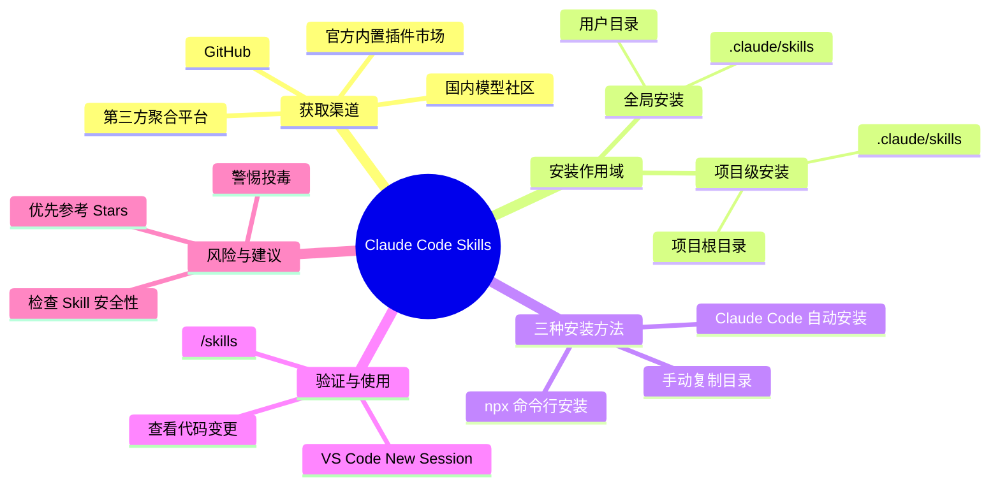
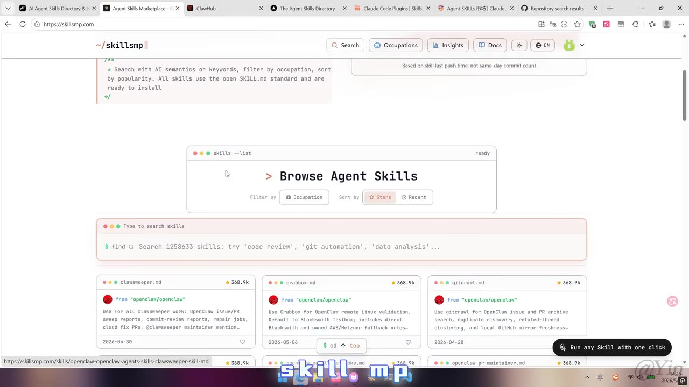

# 8个Skills平台 + 3种安装方法，一次学会

> 来源：[Bilibili 视频](https://www.bilibili.com/video/BV1AU5L6dEDC)<br>
> UP 主：Yin_Code｜时长：5 分 11 秒｜合集：AIcode  
> 视频描述：面向「在哪里找 Skill、怎样安装 Skill」的问题，演示 Claude Code Skills 的获取、目录位置与安装流程。

## 小结

视频围绕 Claude Code 的 Skills 展开：先说明可从官方内置插件市场和多个第三方聚合站点寻找 Skills，再讲解全局安装与项目级安装的目录差异，最后演示命令行、手动复制、让 Claude Code 自动处理链接这三种安装方式。

最重要的结构是区分安装作用域。视频所述全局目录为用户目录下的 `.claude/skills`，放入此处的 Skill 可被所有项目使用；项目级目录为项目根目录下的 `.claude/skills`，仅对当前项目生效。目录不存在时，视频建议自行创建。

命令行安装是信息最完整的一种：从网站复制以 `npx` 开头的安装命令，在**项目根目录**打开 CMD 后执行；交互过程中选择 Claude Code、选择 `Installation Scope`（项目级或全局）、再选择符号链接或复制文件，并以 `Yes` 确认执行。视频示例最终选了「复制完整 Skill 文件到项目内」。

手动安装的核心不是只复制单个文件，而是确认 Skill 根目录中包含 `SKILL.md`，然后将**整个 Skill 目录**复制到对应的 `skills` 目录。安装后可在 Claude Code 中用 `/skills` 检查是否识别，也可在 VS Code 的 Claude Code 会话中通过斜杠命令查看。

视频还推荐了名为 **Find Skills** 的 Skill，称其可按需求搜索并安装匹配技能，减少手动检索。与此同时，UP 主明确提示安装前要确认安全性，并建议优先考虑 Stars 较多的 Skills；这只是视频中的经验建议，不构成对任何第三方 Skill 安全性的验证。

本视频发布于 2026 年 5 月，涉及的第三方平台、插件市场、命令格式、VS Code 扩展名称及 Claude Code 的目录/交互界面都可能随版本变化。特别是 ASR 对专有名词识别存在多处误差，本文已结合标签与关键帧将明显的 “Cloud Code” 校正为 **Claude Code**，但不会补写视频未展示的具体命令或平台 URL。

## 思维导图




## 目录

- [获取渠道：官方市场与第三方平台](#获取渠道官方市场与第三方平台)
- [安装作用域：全局与项目级目录](#安装作用域全局与项目级目录)
- [方法一：使用 npx 命令行安装](#方法一使用-npx-命令行安装)
- [命令行交互选项：软件、作用域与链接方式](#命令行交互选项软件作用域与链接方式)
- [验证安装与 VS Code 中使用](#验证安装与-vs-code-中使用)
- [方法二：手动复制 Skill 目录](#方法二手动复制-skill-目录)
- [方法三：让 Claude Code 自动安装](#方法三让-claude-code-自动安装)
- [安全提醒与 Find Skills 推荐](#安全提醒与-find-skills-推荐)
- [限制、时效性与实践清单](#限制时效性与实践清单)
- [字幕比对](#字幕比对)
- [评论分析](#评论分析)
- [处理记录](#处理记录)

## 获取渠道：官方市场与第三方平台 [00:00:28](https://www.bilibili.com/video/BV1AU5L6dEDC?t=28)

视频开头将「找 Skill」分为两类渠道：

1. **官方内置插件市场**  
   UP 主称可输入一个命令，在 `Discover` 栏中查看官方内容；视频认为该渠道中的插件经过官方认证，并可由 Claude Code 自动完成后续下载。  
   - 素材未给出该命令的完整文字，不能据此补写。
   - “经过官方认证”是视频的原话立场，应以当时平台实际规则为准。

2. **第三方 Skills 聚合平台与代码社区**  
   视频称可通过浏览器搜索 Skills，列举了多个平台/渠道。ASR 中可辨识或结合画面校正出的名称包括：
   - Agent Skills（画面中出现 “AI Agent Skills Directory” 类页面标签）；
   - SkillsMP；
   - ClawHub；
   - Skills.sh；
   - Claude Marketplaces；
   - LobeHub；
   - GitHub；
   - 国内模型社区（ASR 近似识别为“魔搭社区”，可能指 ModelScope，但视频素材未提供清晰文字以完全确认）。

视频同时给出一个基础判断：**Skill 本质上是一个文件夹，许多 Skills 具有通用性**，因此不必将其局限于单一网站或单一项目。



> 图：关键帧展示浏览器同时打开多个 Skill 相关网页，其中主页面为 `skillsmp`，有搜索、职业筛选、热度/最近排序以及 Skill 卡片。它直观说明视频所说的第三方聚合平台用途是“浏览、筛选与获取 Skill”，而非 Claude Code 本体内置页面。

### 视频中平台信息的边界

标题写“8 个 Skills 平台”，但语音对若干英文专名识别不稳定，且没有提供可用站内字幕用于交叉核对。因此本文保留可从 ASR、浏览器标签和关键帧确认的渠道名称，不将无法确认的拼写、网址或平台归属当成事实。

## 安装作用域：全局与项目级目录 [00:00:54](https://www.bilibili.com/video/BV1AU5L6dEDC?t=54)

视频将 Claude Code Skill 的安装位置划分为两条路径。

| 安装类型 | 视频所述目录 | 生效范围 | 不存在时的处理 |
| --- | --- | --- | --- |
| 全局安装 | 用户目录下的 `.claude/skills` | 所有项目可用 | 自行创建 `.claude` 与/或 `skills` 所需目录 |
| 项目级安装 | 项目根目录下的 `.claude/skills` | 仅当前项目可用 | 自行创建 `.claude/skills` |

> 注：ASR 将 `Claude` 多次误识别为 “Cloud”，但视频标签明确包含 Claude Code，且后文展示的是 Claude Code/VS Code 相关内容，故本文统一采用 `.claude/skills` 记述。

### 全局安装目录的定位 [00:01:18](https://www.bilibili.com/video/BV1AU5L6dEDC?t=78)

视频在 Windows 文件资源管理器中演示：打开文件夹，在地址栏输入当前用户名并回车，找到 `.claude` 文件夹，再进入 `skills` 文件夹。这个位置被定义为全局安装目录。


> 图：关键帧展示 Windows 文件资源管理器，并且地址栏处于可输入状态。这张图的价值在于明确视频采用 Windows 图形界面来定位用户目录，而不是给出跨平台终端路径。

### 项目级安装目录的定位 [00:01:43](https://www.bilibili.com/video/BV1AU5L6dEDC?t=103)

项目级安装时，先打开**项目根目录**，再进入或创建：

```text
项目根目录/
└── .claude/
    └── skills/
```

视频后续三种安装方式均以项目级安装作为示例。因此若希望 Skill 只服务于当前代码库，应确保操作发生在该项目根目录，而不是任意下载目录或用户主目录。


> 图：关键帧中的页面文字为“如何安装呢？”并概括“两条安装路径、三种安装方法”。它适合作为从“寻找 Skill”切换到“确定目录与执行安装”的结构提示。

## 方法一：使用 `npx` 命令行安装 [00:02:07](https://www.bilibili.com/video/BV1AU5L6dEDC?t=127)

视频称许多 Skill 网站会提供一个以 `npx` 开头的安装命令。演示流程如下：

1. 在网站找到目标 Skill 提供的安装命令。
2. 若要进行项目级安装，先打开该项目的**根文件夹**。
3. 在文件资源管理器的地址栏输入 `cmd`，打开命令提示符。
4. 确认 CMD 当前路径就是项目根目录；视频特别强调这一点。
5. 将网页上复制到的 `npx` 安装命令粘贴进 CMD。
6. 按回车，等待安装程序进入交互流程。

```text
操作位置要求
项目根目录 → 地址栏输入 cmd → 在该目录对应的 CMD 中粘贴网站提供的 npx 命令
```

视频没有展示可完整复用的具体 `npx` 命令，也没有说明 Node.js、npm/npx 的版本或预装条件。因此不能将“任意 npx 命令均可执行”视为视频已验证的结论；实际执行前还应读取来源页面说明并确认本机运行环境。

## 命令行交互选项：软件、作用域与链接方式 [00:02:31](https://www.bilibili.com/video/BV1AU5L6dEDC?t=151)

命令执行后，视频依次讲解三个关键选择项。

### 1. `Additional Agents`：选择安装目标

视频称该步骤用于选择将 Skill 安装到哪个软件。演示中：

- 使用方向键切换选项；
- 使用空格键选中；
- 使用回车键提交；
- 选择 **Claude Code**。

### 2. `Installation Scope`：选择安装级别

视频将其解释为安装作用域：

- 第一个选项：**项目级**，仅当前项目可使用；
- 第二个选项：**全局**，所有项目可使用。

演示选择项目级，与前文项目根目录下 `.claude/skills` 的做法一致。

### 3. 安装方式：符号链接或完整复制 [00:02:55](https://www.bilibili.com/video/BV1AU5L6dEDC?t=175)

视频解释两个选项的行为差异：

| 方式 | 视频描述 | 适合的情形与限制 |
| --- | --- | --- |
| 符号链接（symbolic link） | 在项目中创建符号链接，指向该 Skill 的真实目录 | 后续更新 Skill 时只需维护一份真实文件；但依赖链接目标持续存在且路径有效 |
| 复制完整文件 | 将完整 Skill 文件复制至当前项目内 | 项目内保留独立副本；视频示例选择此项，但更新时可能需要分别维护，后半句为基于“副本”机制的常规推论，非视频直接说明 |

最后，安装器会询问是否执行安装，视频选择 `Yes`。完成后，可回到项目的 `.claude/skills` 文件夹检查刚安装的 Skill 是否出现。

## 验证安装与 VS Code 中使用 [00:03:19](https://www.bilibili.com/video/BV1AU5L6dEDC?t=199)

视频提供了两种检查安装结果的方式：

1. **在命令行中启动 Claude Code**  
   输入 `/skills`，查看刚安装的 Skill 是否出现在列表中。

2. **在 VS Code 中使用 Claude Code**  
   - 用 VS Code 打开项目文件夹；
   - 在左侧扩展市场搜索 `Claude Code for VS Code`；
   - 视频称选择 “AN42 Orbit 官方的”条目下载安装；
   - 在左侧点击 Claude 图标；
   - 点击 `New Session` 新建会话；
   - 在输入框通过斜杠命令查看已安装的 Skill。

视频认为 VS Code 方式的优点是能看到代码变化；同时称其可使用与命令行版 Claude Code 相同的功能。

### 扩展信息的时效性

“Claude Code for VS Code”的搜索结果、发布者名称和是否属于官方条目，会受扩展市场上架状态及版本调整影响。视频未展示扩展唯一标识、版本号、下载量或发布者验证细节，实际安装应以 VS Code Marketplace 的发布者身份、扩展 ID 与权限信息为准。

## 方法二：手动复制 Skill 目录 [00:03:43](https://www.bilibili.com/video/BV1AU5L6dEDC?t=223)

手动安装适用于已下载或已解压的 Skill。视频以某个示例 Skill 为例，关键要求是：

1. 打开目标 Skill 文件夹；
2. 确认其中存在 `SKILL.md`；
3. 打开目标安装目录：
   - 项目级：`项目根目录/.claude/skills`
   - 全局：`用户目录/.claude/skills`
4. 将刚才查看的**整个 Skill 文件夹**复制到 `skills` 目录中；
5. 返回 Claude Code，在命令行使用 `/skills` 检查；
6. 或在 VS Code 的 Claude Code 会话中输入斜杠命令检查。

可将视频操作抽象为：

```text
目标 Skill 目录（其中含 SKILL.md）
        ↓ 整个目录复制
.claude/skills/
        ↓
在 Claude Code 中通过 /skills 验证
```

这里“`SKILL.md` 位于 Skill 根目录”是视频明确提示的结构检查点。视频没有讲解 `SKILL.md` 的具体格式、其他必需文件、依赖安装、权限授权或冲突处理；这些都需要以目标 Skill 的自身文档为准。

## 方法三：让 Claude Code 自动安装 [00:04:32](https://www.bilibili.com/video/BV1AU5L6dEDC?t=272)

视频将 Claude Code 自动安装称为最简单的方式，流程为：

1. 找到想安装的 Skill/插件链接；
2. 回到 Claude Code；
3. 向 Claude Code 发出请求，表达“将这个 Skill 安装到项目目录”的意图；
4. 等待其完成安装；
5. 打开 `.claude/skills`，确认对应 Skill 已出现。

视频没有展示固定提示词、实际网络访问权限、自动安装时是否需要人工确认、失败后的排错过程或授权范围。因此该方法只能理解为视频中演示的交互思路，不能保证所有链接、所有 Claude Code 环境都能够自动安装。

## 安全提醒与 Find Skills 推荐 [00:04:56](https://www.bilibili.com/video/BV1AU5L6dEDC?t=296)

视频最后推荐 **Find Skills**。UP 主的表述是，它能够自动搜索并安装与需求相匹配的 Skills，从而减少手动寻找的麻烦。


> 图：关键帧左侧展示“Find Skills”的推荐卡片，文字说明其用于智能搜索、自动匹配并安装需求相关 Skills；右侧是终端窗口。该画面直接对应视频结尾的工具推荐与自动化安装主题。

同时，视频强调**先确认 Skill 是否安全**，并提醒可能有人向 Skills 中投毒；建议优先安装 Stars 较多的 Skills。

这条建议可转化为安装前检查清单：

- 核对来源平台、作者/组织和仓库地址；
- 阅读 `SKILL.md`、安装脚本与依赖说明；
- 关注脚本是否包含下载、执行命令、读取敏感文件或外部上传行为；
- 不因为 Stars 高就跳过代码和权限审查；
- 对陌生 Skill 优先在隔离项目或非敏感环境中测试；
- 自动安装时仍应确认它实际写入的目录和文件内容。

其中，“Stars 多”仅是视频提供的粗略筛选信号，不等同于安全证明。

## 限制、时效性与实践清单

### 视频覆盖的内容

- Skills 的获取渠道；
- 全局与项目级安装的目录逻辑；
- `npx` 命令行安装；
- 手动复制安装；
- Claude Code 自动安装；
- `/skills` 与 VS Code 会话中的安装验证；
- 基础安全提醒。

### 视频未覆盖或未展示的信息

- 官方插件市场的具体调用命令；
- 任一第三方平台的精确 URL、账户要求、收费或审核政策；
- `npx` 安装命令的完整实例；
- Node.js/npm/npx 前置安装条件与版本要求；
- macOS、Linux 下的具体目录定位方式；
- Skill 依赖冲突、卸载、更新、回滚和报错排查；
- Claude Code 自动安装需要哪些权限或网络条件；
- VS Code 扩展的准确扩展 ID 和版本。

### 可执行的最小流程

1. 明确要全局使用还是仅给当前项目使用。
2. 找到并核对目标 Skill 的可信来源。
3. 项目级安装时，确认终端工作目录是项目根目录。
4. 用网站提供的 `npx` 命令安装，或确认 `SKILL.md` 后手动复制整个目录。
5. 检查 `.claude/skills` 是否出现目标目录。
6. 在 Claude Code 中执行 `/skills` 验证。
7. 首次使用前审查 Skill 内容与潜在外部操作。

## 字幕比对

| 字幕来源 | 完整性 | 专有名词 | 时间轴 | 主要问题 |
| --- | --- | --- | --- | --- |
| Bilibili 站内字幕 | 未提供可用字幕 | 无法评估 | 无法评估 | 素材采集提示字幕工具因 `Invalid URL` 退出，未获得站内字幕内容 |
| 本次 ASR 字幕 | 覆盖约 280.77 秒语音，占视频约 90.51%；首段语音在 00:00:28.680，末段至 00:05:09.750 | 较多误识别 | 有 SRT 起止时间 | `Claude/Cloud`、`Skills/Skilled/Skids`、目录名及多个平台名存在混淆；每段文本过长，部分语义可能与时间段不精确对应 |

### 最终字幕选择与校正原则

本次没有可用的 Bilibili 站内字幕，因此正文以**本次 ASR 的带时间戳分段**为主要时间轴依据，并结合关键帧、视频标题、标签和上下文作有限校正。

已作的主要校正如下：

| ASR 近似文本 | 正文采用写法 | 校正依据 |
| --- | --- | --- |
| Cloud Code / Cloud | Claude Code | 视频标签明确含 “Claude Code”；叙述上下文为 Claude Code Skills |
| `.Cloud` 文件夹 | `.claude` 文件夹 | Claude Code 的上下文与视频标签；ASR 对英文专名持续混淆 |
| SKilled / Skids | Skills | 视频标题、页面文字和语义均指向 Skills |
| “点 MD” | `SKILL.md` | 视频语境为手动安装时检查 Skill 的说明文件，且 ASR 能辨识 “Skills 点 MD” |
| CME | CMD | 视频明确描述在文件资源管理器地址栏输入 `cmd` 打开命令提示符 |
| “符号铁” | 符号链接 | 语义明确为 symbolic link 安装方式 |

ASR 诊断中**没有** `noAudioStream=true` 标记；素材亦提供了 `audio/audio.wav` 与正常的 ASR 结果。因此，本视频不是“无音轨视频”，而是站内字幕未成功获取、需使用 ASR 与画面辅助整理的情况。

时间轴链接均优先采用 ASR SRT 的真实分段起点换算为秒数。由于 ASR 每段长度约 24 秒但转写内容密集，章节链接适合定位话题起始，不宜将每个细节精确到秒级操作画面。

## 评论分析

仅获取到热评 2 条，少于“前三条”的可获取上限；以下不将评论观点视为已验证事实。

1. **飞天从心流｜314 赞**  
   评论认为无需手动安装，可直接把 Skill 文件交给 Agent 让其自行安装。  
   - 与视频的“Claude Code 自动安装”部分方向一致；
   - 该评论没有说明 Agent 类型、提示内容、权限范围或成功条件；
   - 自动安装虽省步骤，但仍应保留对来源、落盘目录和执行行为的审查。

2. **Looowwoww｜265 赞**  
   评论称赞视频步骤清楚、对新手有帮助，并提出金融专业学生希望借助 AI 学习量化与基础知识的需求。  
   - 该评论反映了受众对“可跟做、少跳步”的教程需求；
   - 其中“别家的报错或跳步”等是个人体验，不能外推为对其他教程的客观评价；
   - 关于量化学习的提问超出视频主题；本视频主要覆盖 Skills 安装，不提供量化学习路径。

## 处理记录

- **Worker ID**：worker-mrj0www4-e8d79408
- **模型**：gpt-5.6-terra
- **可用素材与工具产物**：视频元数据、`audio/audio.wav`、本次 ASR 结果 `asr/asr-result.json`、时间轴字幕 `asr/transcript.srt`、12 张关键帧、热评数据 `comments/comments.json`。
- **字幕选择**：站内字幕未提供可用内容；已检查本次 ASR，并采用其 SRT 时间戳作为章节定位依据。对明显专名误识别，使用视频标题、标签、上下文和关键帧进行有限校正。
- **关键帧选择依据**：
  - `frames/frame-002.jpg`：展示 SkillsMP 页面及多个 Skill 站点标签，用于说明获取平台与检索场景；
  - `frames/frame-003.jpg`：展示“两条安装路径、三种安装方法”的过渡页，用于建立教程结构；
  - `frames/frame-004.jpg`：展示 Windows 文件资源管理器与地址栏，用于说明用户目录/项目目录定位操作；
  - `frames/frame-001.jpg`：展示 Find Skills 推荐卡与终端，用于对应结尾的工具推荐和自动安装主题。
- **缓存清理**：素材中未提供缓存清理命令或执行结果，无法确认是否已清理；本文不将其标记为已完成。
- **未解决问题**：
  - 站内字幕因采集过程报 `Invalid URL` 未能取得，无法进行逐句交叉校对；
  - ASR 对英文专有名词与部分目录名误识别明显；
  - 未提供完整命令行画面或具体 `npx` 命令，无法复现单一 Skill 的精确安装命令；
  - 若干第三方平台名称仅能依据 ASR 与浏览器标签推定，未将不确定拼写作为确定事实。
