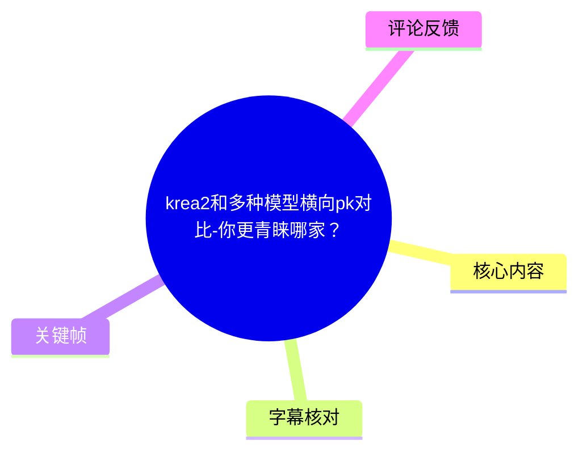
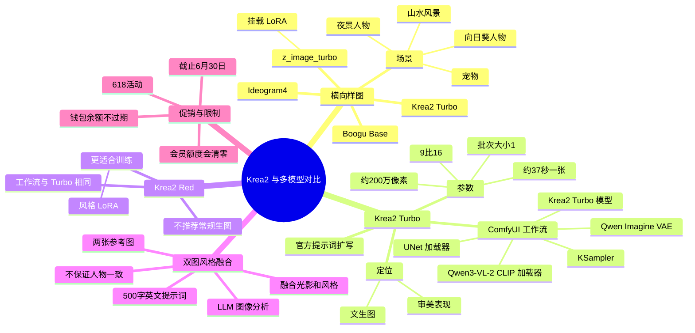
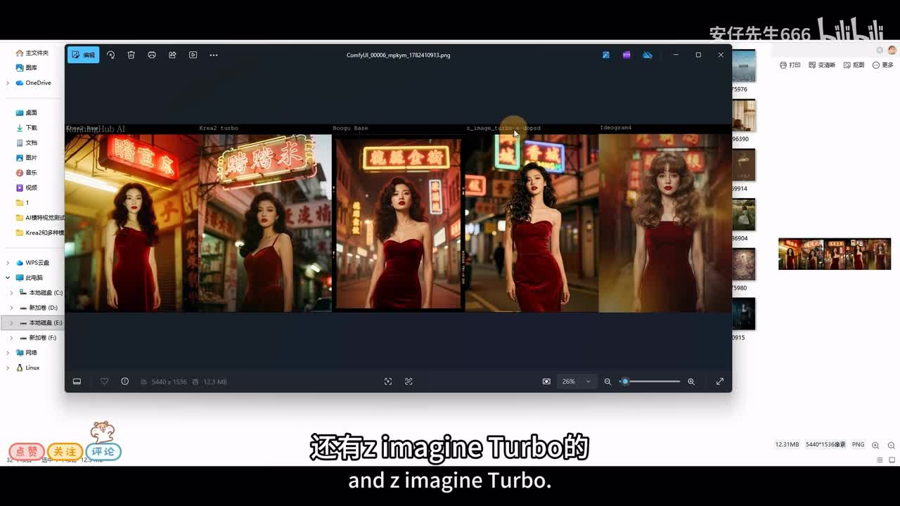
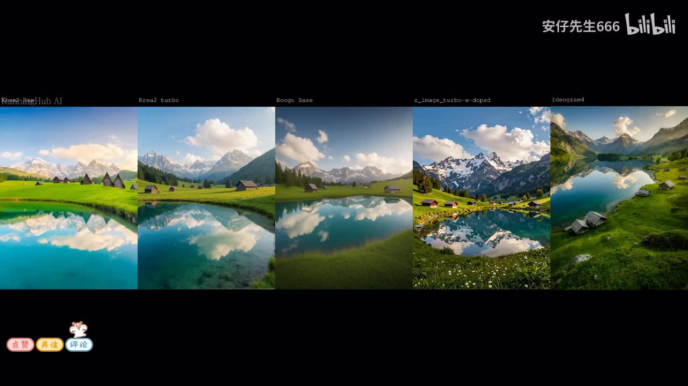
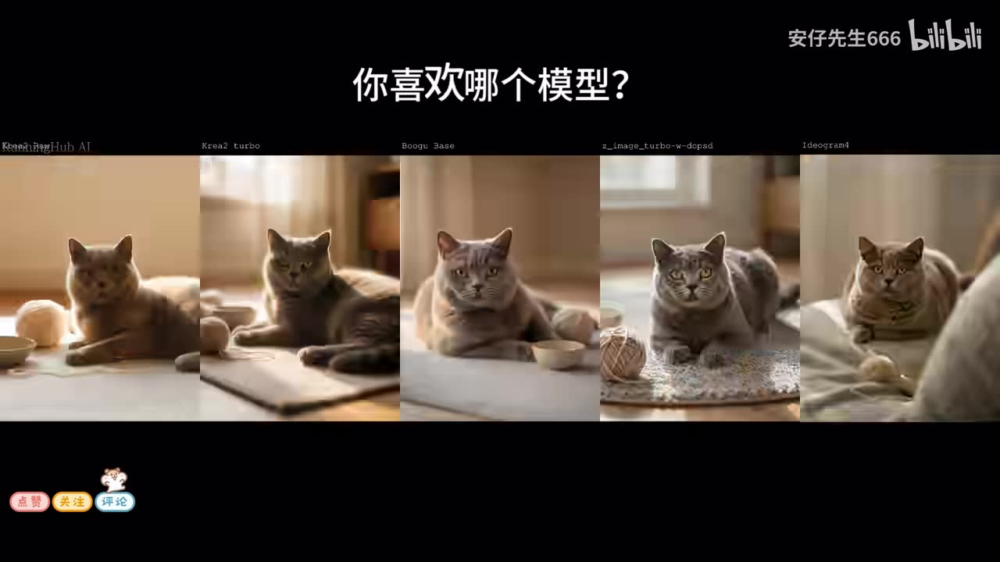
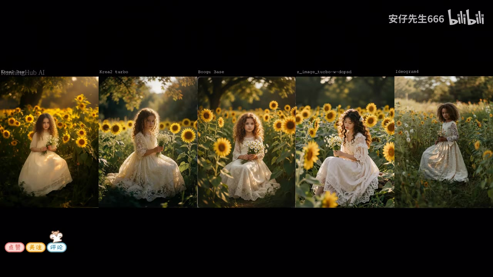

# krea2和多种模型横向pk对比-你更青睐哪家？

> 来源：[Bilibili 视频](https://www.bilibili.com/video/BV1xgTK6LEnA)  
> UP 主：安仔先生666｜视频时长：11 分 44 秒｜分辨率：1920×1080  
> 标签：设计、模型、ComfyUI、AI 商业、AI 电商设计、Ideogram4、Krea2、设计师、美学、模型对比

## 小结

视频先以多组画面横向展示 Krea2 Turbo、Boogu Base、z_image_turbo（挂载 LoRA 的版本）以及 Ideogram4 等模型在人物、风景、宠物和儿童肖像等场景中的出图差异，随后重点讲解 **Krea2 Turbo** 与 **Krea2 Red** 的 ComfyUI 工作流和实际定位。

UP 主对 Krea2 Turbo 的核心判断是：其文生图工作流简单、生成速度较快，并且在“静奢风”服装展示、静物、壁纸和宋代风格室内等样图中，呈现出较好的审美倾向。视频中的一次实测参数为 **9:16、约 200 万像素、批次大小 1**，生成一张图约需 **37 秒**。这是一项视频内单次演示结果，不能直接外推至其他显卡、模型版本或队列环境。

Krea2 Red 与 Turbo 使用相同的基本工作流结构，只需在 UNet 加载器切换模型。UP 主明确认为 Red 版不适合直接作为常规生图模型：演示图中叶片质感偏塑料、局部有“未画完”的感觉；但其更适合用于后续训练风格 LoRA。这是作者基于演示样图作出的实践评价，而不是通用性能基准结论。

视频还给出一种“双图风格融合”方法：将两张参考图输入工作流，让 LLM 先分析图像，再依据提示词模板生成约 500 字的英文提示词，继而经过 CLIP 文本编码、KSampler 采样和解码输出。结果会融合两图的长相、光影或视觉气质，但**不会保证复刻参考人物身份或容貌**。

末段包含会员促销信息，涉及截止日期、包月/包年价格、钱包额度、Sydence 2.0 不同分辨率的每秒成本及清零规则。这些均属于视频发布时的营销口径，具有强时效性；尤其是活动截止“6 月 30 日”、价格与折扣，阅读时不能视为当前仍有效的信息。

## 思维导图





## 目录

- [横向对比展示与观察边界](#横向对比展示与观察边界)
- [Krea2 Turbo：定位、样图与工作流](#krea2-turbo定位样图与工作流)
- [Krea2 Turbo：参数设置与实测](#krea2-turbo参数设置与实测)
- [Krea2 Red：训练取向与生图限制](#krea2-red训练取向与生图限制)
- [双图风格融合工作流](#双图风格融合工作流)
- [工作流获取与会员活动信息](#工作流获取与会员活动信息)
- [结论、适用范围与时效性](#结论适用范围与时效性)
- [字幕比对](#字幕比对)
- [评论分析](#评论分析)
- [处理记录](#处理记录)

## 横向对比展示与观察边界 [00:00](https://www.bilibili.com/video/BV1xgTK6LEnA?t=0)

视频开场展示了多模型在相同或相近主题下的并排出图，画面顶部可辨识的列标签包括：

- Krea2 Turbo；
- Boogu Base；
- z_image_turbo（画面标签显示为带有额外后缀的版本，视频口述为“挂了一个 LoRA 的版本”）；
- Ideogram4；
- 另有一列标签在现有字幕与画面中无法完全可靠辨认，因此不在此强行命名。

展示主题包括夜景红裙人物、山间湖泊、室内猫咪和向日葵花田中的人物。这些画面对比的价值在于快速观察不同模型在构图、景深、光线、人物五官和主体稳定性上的视觉差异；但视频未给出每张图的完整提示词、随机种子、采样器、步数、CFG、模型版本号或硬件环境，因此不能将其视作严格可复现的标准化测评。



> 图：画面展示多列模型生成的夜景红裙人物。它适合用于理解视频的比较形式：并排放置多模型结果以观察审美、人物脸部和背景霓虹处理的不同；但画面本身未展示完整参数，不能据此得出绝对排名。



> 图：山间湖泊场景可用于观察模型对远景山体、云层、湖面倒影和草地细节的处理差异。此类风景图强调整体视觉效果，不足以单独验证模型的复杂指令遵循能力。



> 图：猫咪场景提供了更聚焦的主体对比，可观察动物姿态、毛发、眼睛与室内光线；但不同结果的猫姿势并不完全一致，因此只能作直观参考。



> 图：向日葵花田人物样图集中呈现人物、服装、花卉和逆光氛围的组合效果，适合辅助理解视频所说的不同场景下模型生图能力差异。

## Krea2 Turbo：定位、样图与工作流 [01:10](https://www.bilibili.com/video/BV1xgTK6LEnA?t=70)

UP 主将 Krea2 Turbo 定位为文生图能力较强、审美表现较突出的模型，并以“小小的 MJ 版本”形容其视觉审美倾向。这里的 “MJ” 是作者的类比说法，视频没有提供与 Midjourney 的统一提示词、统一成本或统一质量指标测试，因此不应理解为两者性能等同。

作者展示的样图涵盖：

1. **静奢风服装图**：作者认为服装和整体画面风格相贴合，符合静奢气质。
2. **静物图**：作者认为结果有真实感和艺术感，并联想到美术训练中的静物素描。
3. **壁纸类画面**：作者认为美学效果较好。
4. **宋代时期风格室内**：作为风格化室内生成示例。

随后进入 ComfyUI 工作流说明。视频口述的基础链路为：

```text
Qwen3-VL-2 CLIP 加载器
  → 官方提示词扩写 / 优化节点
  → CLIP 文本编码
  → KSampler
  → 解码
  → 图像输出
```

同时，模型与解码相关组件包括：

- **UNet 加载器**：加载 Krea2 Turbo 模型；
- **VAE**：使用 Qwen Imagine VAE；
- **官方扩写优化提示词**：作为固定搭配，先对用户提示词扩写、润色，再送入 CLIP 文本编码器；
- **提示词展示区域**：用于查看扩写、润色后的提示词内容。

视频的重点并不在复杂节点拼接，而在于说明：基础文生图链条较短，模型加载、提示词扩写、文本编码、采样和解码构成主要流程。该工作流适合已经具备 ComfyUI 基础、希望快速调用 Krea2 Turbo 的用户。


> 图：该帧顶部标有不同模型名称，能够将后续对 Krea2 Turbo 的单独讲解放回横向比较的上下文中：视频并非只展示单模型，而是先展示多个候选模型的视觉结果。

## Krea2 Turbo：参数设置与实测 [03:10](https://www.bilibili.com/video/BV1xgTK6LEnA?t=190)

视频演示的输入区域包含以下可确认设置：

| 项目 | 视频中的说明 | 使用含义 |
| --- | --- | --- |
| 出图比例 | 选择 `9:16` | 控制画面长宽比，适合竖版展示图。 |
| 像素档位 | 约 200 万像素 | 视频口述为“这里是 200 万像素”；未提供精确宽高数值。 |
| 数值参数 `8` | “不用动它，保持就好了” | 视频未明确说出该参数的正式名称，不宜擅自认定为步数、CFG 或其他采样参数。 |
| 空 Latent 批次大小 | `1` | 一次生成一张图；若要一次生成多张，可修改该数量。 |
| 模型文档 | 提供 Models、VAE、LoRA 等入口 | 作者称可一键下载相关模型或查看说明。 |

演示运行后，UP 主称生成一张 **9:16 图像约需 37 秒**，并评价速度“非常不错”。其演示成品为克制的静奢风服装展示图，作者认可其审美。

### 可复用操作步骤

1. 在 ComfyUI 中加载视频所示 Krea2 Turbo 工作流。
2. 确认 UNet 加载器指向 Krea2 Turbo 模型。
3. 使用 Qwen3-VL-2 相关 CLIP 加载器，并配置视频所示 Qwen Imagine VAE。
4. 在比例选项中选择目标画幅；演示选择为 `9:16`。
5. 保持视频示例中的未命名数值 `8` 不变，除非已确认其节点含义和对结果的影响。
6. 将空 Latent 的批次大小设为 `1`；如需批量出图，再增加数量。
7. 输入原始提示词，交由官方扩写优化提示词节点处理。
8. 运行工作流，在提示词展示区域检查扩写后的文本，并评估最终图像。

### 使用注意

- “37 秒”只对应视频中的一次测试，并不构成固定速度承诺。
- 图像质量受模型版本、显存、GPU、分辨率、采样设置、服务器负载和提示词等因素影响。
- 视频未给出原始测试提示词全文，无法从素材中完整复现该服装图。
- 对“8”这一数值参数，视频未明确节点名称；实践中应先查看节点标签，而非盲目照搬。

## Krea2 Red：训练取向与生图限制 [05:25](https://www.bilibili.com/video/BV1xgTK6LEnA?t=325)

视频随后介绍 Krea2 Red 版本。其节点连接方式与 Turbo 版本“几乎一模一样”，主要调整点是：

```text
将 UNet 加载器中的模型
从 Krea2 Turbo
替换为 Krea2 Red
```

输入区域与 Turbo 演示保持一致。作者对 Red 的使用建议非常明确：

- **不推荐将其作为常规直接生图模型**；
- 演示结果不够真实；
- 作者观察到部分叶片像塑料；
- 生成图存在若干局部“没有画完”的观感；
- 更适合用于后续训练风格 LoRA。

这意味着，若目标是直接产出成熟的电商海报、人物展示图或高完成度视觉稿，视频作者倾向于选择 Turbo；若目标是围绕某种风格继续进行训练和 LoRA 工作，则 Red 可能更符合其发布定位。

需要强调的是，视频并未展示 Red 的训练过程、数据集要求、训练超参数、LoRA 触发词或训练后的对比结果。因此“适合训练”的结论只能记录为视频作者的使用建议，不能据此补充未出现的训练配置。

## 双图风格融合工作流 [07:10](https://www.bilibili.com/video/BV1xgTK6LEnA?t=430)

视频还展示了基于 Krea2 Turbo 的双图风格融合工作流。该流程的目标不是让输出完全复制其中某一张图，而是让模型分析两张图，并根据文字规则融合视觉风格、光影和人物动作等元素。

### 输入与提示词规则

工作流的关键输入为两张参考图：

- **图 1**：可作为人物动作或其他指定元素的参考；
- **图 2**：可作为光影、氛围或其他指定元素的参考。

视频口述的核心提示词意图为：

```text
分析这两张图像，
完美融合图 1 和图 2 的视觉风格。
```

在此基础上，用户可以继续追加具体约束，例如：

```text
光影更偏重图 2；
人物动作参考图 1。
```

演示中最终出图比例仍为 `9:16`。提示词末尾“生成 500 字英文提示词”被建议保留，因为工作流中预置了提示词模板，LLM 会按该模板对两张图进行分析并生成英文描述。

### 节点思路

视频对工作流的描述可整理为：

```text
两张参考图
  → LLM 图像分析
  → 根据模板生成约 500 字英文提示词
  → CLIP 文本编码
  → KSampler 采样
  → 解码输出
```

与前述 Turbo 基础工作流不同，此处**没有使用官方扩写优化提示词节点**；作者使用的是一个 LLM 对参考图进行分析。视频称提示词模板来自“贴吧大佬”，但未提供原始出处、作者身份或全文，因此无法进一步验证来源。

### 演示结果与边界

作者展示的结果融合了两张图的一部分视觉特征：人物外貌特征与另一张参考图的暖色光影被综合到新的图像中。但作者特别指出，最终人物**不会长得和图 1 中的女性一模一样**。

这揭示了该工作流的适用边界：

| 目标 | 视频所示能力 |
| --- | --- |
| 融合两图的整体视觉气质 | 可以尝试，视频给出正向演示。 |
| 让光影更偏向指定参考图 | 可通过文字约束控制。 |
| 让人物动作参考指定图 | 可通过文字约束控制。 |
| 精准复制参考人物身份或容貌 | 视频明确表示不能保证。 |
| 角色一致性、真人身份保持 | 视频未展示专门的身份锁定方法，不应假定具备。 |


> 图：花田人物画面同时包含人物、服装、花卉、逆光与背景层次，适合说明双图融合中可被分配给不同参考图的元素类别，例如人物动作、暖色光影与整体氛围。该图是视频中的横向比较样图，并非双图融合流程的唯一输入或输出。

## 工作流获取与会员活动信息 [09:15](https://www.bilibili.com/video/BV1xgTK6LEnA?t=555)

UP 主表示，本期使用的工作流已放在评论区，建议有需要的观众前往评论区获取。当前提供的热评采集结果为空，因此本资料无法确认工作流链接、文件格式、下载条件或是否仍可用。

视频末段还介绍了一项“618”活动。以下内容仅按视频口述整理，不能作为实时价格依据。

### 视频口述的活动与价格信息

- 活动截止日期：**6 月 30 日**。
- 提供单月会员和单年会员选项。
- 单月会员原价为“一千多元”，活动价口述为 **599 元/月**。
- 单月方案包含 **839 元钱包额度**，作者认为相当于赠送了较多额度。
- 若用于视频中口述为 “Sydence 2.0 720P” 的服务，费用约为 **0.86 元/秒**；作者称平时约为 **1.2 元/秒**。
- 另一按月方案，视频口述称可低至 **0.69 元/秒**；对应服务名称和分辨率在 ASR 中识别不稳定，站内字幕显示为 “SEDENCE2.0720P”，无法仅依素材可靠标准化为具体产品名称。
- 年度方案中，12 个月方案用于视频所述 “SED2.070P” 时约为 **0.43 元/秒**。
- 更高档的年度方案，视频称年费“一万多元”，可低至 **0.30 元/秒**。
- 作者称年会员会赠送额外额度，叠加后折扣约可至 **4.8 折**，最低约 **2.7 折**。
- 作者称上述额度不仅可用于所举视频生成服务，也可用于“所有闭源模型”；具体可用模型清单与规则未在素材中展示。

### 会员额度与钱包规则

视频特别强调两类充值方式的差异：

| 类型 | 视频中的规则 |
| --- | --- |
| 包月 / 包年会员 | 额度会清零；视频称有效期为 31 天，未用完将清零。 |
| 钱包充值 | 作者称余额“永远不会过期”；充多少用多少，按人民币 1:1 换算。 |

### 时效与风险提示

活动截止日期、订阅价格、每秒成本、赠送额度、折扣和清零周期均可能因平台调整而变化。尤其视频发布时间按元数据约为 2026 年 6 月下旬，而素材抓取时间为 2026-07-13，视频提及的“截至 6 月 30 日”活动在抓取时点已可能结束。购买前应以对应平台的实时套餐页、服务条款和结算页面为准。

## 结论、适用范围与时效性 [11:10](https://www.bilibili.com/video/BV1xgTK6LEnA?t=670)

从视频展示与作者判断中，可以提炼出以下实践结论：

1. **Krea2 Turbo 更偏向直接出图。** 对希望快速生成具备审美气质的服装、静物、壁纸和风格室内图的用户，视频提供了一个较简洁的 ComfyUI 调用思路：加载模型、进行提示词扩写、编码、采样和解码。
2. **Krea2 Red 应按训练取向理解。** 作者不推荐直接把它当高完成度生图模型，但认为其适合后续训练风格 LoRA；使用前应先明确目标是“立即出图”还是“构建训练素材与风格链路”。
3. **双图融合是“特征重组”，不是身份复制。** 通过 LLM 分析参考图、生成较长英文提示词，再引导生成模型融合动作、光影和视觉氛围，可获得新的组合图像；但人物相貌不会严格等同于参考人物。
4. **横向样图只能作为视觉参考。** 视频没有披露完整提示词、种子、采样参数和公平测试协议，因此无法支持“某模型全面优于另一模型”的强结论。
5. **促销信息失效风险高。** 活动价格、折扣、赠送额度及订阅清零规则需在购买时重新核验。

对于设计师、电商视觉从业者、ComfyUI 用户和关注 AI 图像模型审美差异的读者，本视频最有价值的部分是 Turbo/Red 的功能分工及双图融合的工作流思路；对于追求严谨性能基准、模型部署要求或 LoRA 训练参数的读者，视频提供的信息仍不充分。

## 字幕比对 [11:30](https://www.bilibili.com/video/BV1xgTK6LEnA?t=690)

本次任务已执行 ASR，并同时获得站内字幕。最终正文以**站内字幕为主、ASR 为辅助校对**，并依据关键帧中的模型标签和上下文对部分术语作保守整理。

| 字幕来源 | 完整性 | 专有名词 | 时间轴 | 主要问题 |
| --- | --- | --- | --- | --- |
| Bilibili 站内字幕 | 较完整，覆盖开场对比、Turbo、Red、融合工作流与活动说明 | 相对较好，但仍存在音译/识别不确定项，如 CLAIRE/Krea、Sydence/SEDENCE 等 | 当前提供文本不含逐句时间戳 | 个别模型名和产品名未能完全标准化；部分句子口语化且有重复。 |
| 本次 ASR 字幕 | 覆盖较完整，但开头与收尾有重复片段 | 较弱，出现 Clear2、Klayer2、Kalei'r 2、Korea 2、Rora、11M、Cidens 等多种误识别 | 当前提供文本不含逐句时间戳 | 存在中英混杂、断句异常、重复的 “by bwd6”、模型/节点名称错识别，以及“9 比 10”等明显疑似误听。 |

### 关键校正与采用原则

- 视频标题、标签以及画面对照列中均出现 `krea2`，正文统一采用 **Krea2**；站内字幕中的 “CLAIRE2” 与 ASR 的 “Clear2 / Klayer2 / Korea 2” 均按上下文视为同一名称的识别偏差。
- `Turbo`、`Red`、`Ideogram4` 可由站内字幕、ASR 与关键帧标签相互印证，正文保留这些名称。
- 站内字幕将节点称为 “queen3V二的 clip 加载器”，ASR 为 “Quin3 V2”；正文保守写作 **Qwen3-VL-2 相关 CLIP 加载器**，但由于未提供工作流截图细节或节点原文件，仍建议以实际节点名称为准。
- 站内字幕称 VAE 为 “queen imagine 的 VIE”，ASR 类似识别为 “vii”；正文按语境记录为 **Qwen Imagine VAE**，属于基于上下文的术语规范化，非对官方拼写的额外验证。
- ASR 将 “LoRA” 多次识别为 “Rora”，正文统一使用社区常用写法 **LoRA**。
- 对促销中服务名 “Sydence / SEDENCE / Cidens” 及其分辨率，素材内部识别不一致且缺少清晰页面证据，因此保留为“视频口述服务名”，不将其擅自替换为某个已验证产品。
- 视频中可确认的输出比例为 **9:16**；ASR 的“9 比 10”与站内字幕、上下文不一致，未采用。

## 评论分析 [11:35](https://www.bilibili.com/video/BV1xgTK6LEnA?t=695)

本次仅处理可获取的热评前三条。评论采集结果为：

```text
items: []
```

因此没有可分析的热评内容。元数据显示视频 `reply` 为 1，但当前热评接口返回为空，可能意味着该回复未进入热评列表、已不可获取，或采集时未返回具体评论。不能据此推断观众对模型质量、工作流或活动套餐的态度。

## 处理记录 [11:40](https://www.bilibili.com/video/BV1xgTK6LEnA?t=700)

- **Worker ID**：worker-mrj0www4-e8d79408
- **模型**：gpt-5.6-terra
- **调用工具与素材**：使用任务提供的视频元数据、站内字幕、已执行的本次 ASR 字幕、12 张关键帧清单、热评采集结果及视频素材输出目录信息进行整理；未获得可执行工作流文件、完整节点截图或外部产品页面。
- **字幕选择**：以站内字幕为主文本；本次 ASR 已执行并用于发现术语差异、补足断句语境。对于两者均无法可靠确认的专有名词，不作超出素材的断言。
- **关键帧选择依据**：选用 `frame-001.jpg` 展示夜景人物的多模型并排比较，`frame-002.jpg` 展示风景类比较，`frame-003.jpg` 展示宠物类比较，`frame-004.jpg` 展示人物、服装、花卉和光影构成的复杂场景；这些帧能直接支撑视频“多场景横向对比”的内容。未将未提供视觉内容说明的其他帧强行用于正文。
- **评论处理**：只尝试分析可获取的热评前三条；采集结果为空，故未编造评论观点。
- **缓存清理**：提供的素材清单仅说明已生成 `merged.mp4`、音频、关键帧、字幕、ASR 与评论等输出，未提供缓存清理执行日志；因此无法确认是否已清理缓存，也未虚构清理结果。
- **未解决问题**：
  - 多模型横向比较缺少统一提示词、随机种子、采样参数和完整模型版本号。
  - Krea2 相关节点、VAE、模型文件的官方精确命名未在素材中完整展示。
  - 视频结尾促销涉及的具体平台和部分产品名称存在字幕识别歧义。
  - 评论区工作流链接或附件未随本次可获取评论数据返回。

## 评论分析

本次流程未获取到可用热评，因此不推断观众态度或额外结论。
