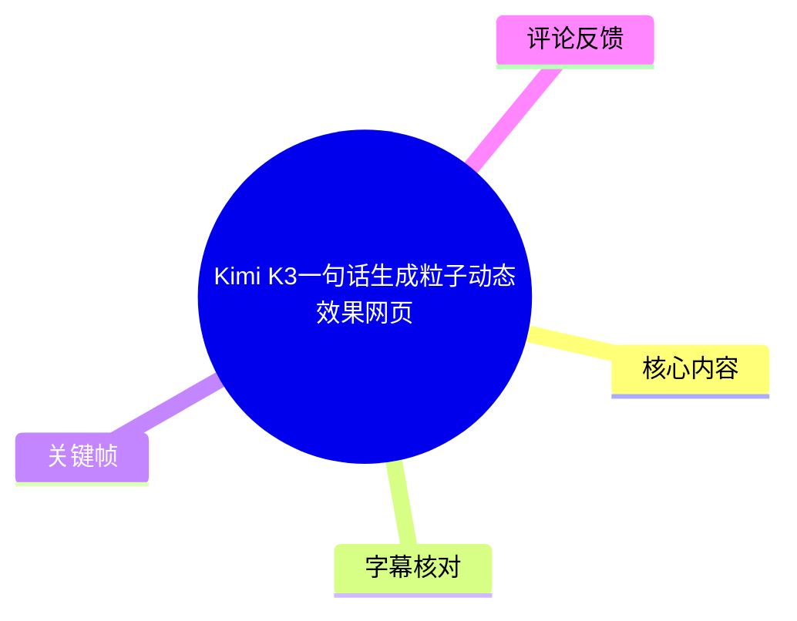
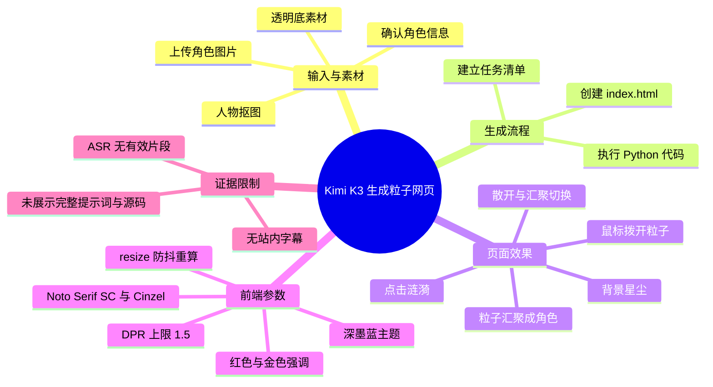
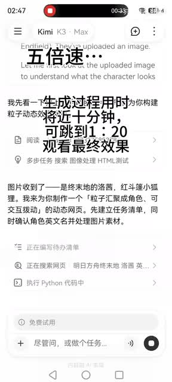
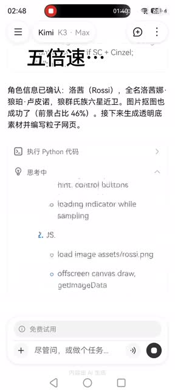
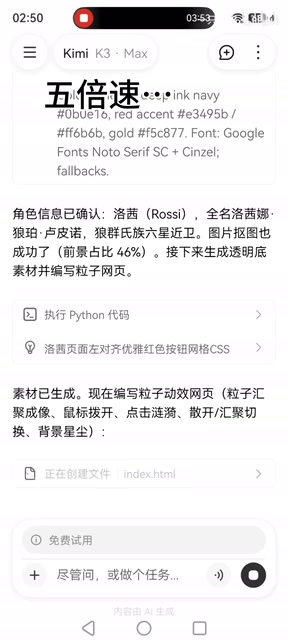
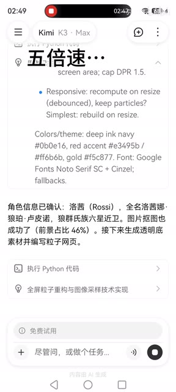

> 来源：[Bilibili 视频](https://www.bilibili.com/video/BV1VwKL6UEok)  
> UP 主：一只瓜猫｜视频时长：2 分 54 秒｜合集：AIcode  
> 视频简介提供的网页预览：<https://6tgk3xrohitwy.ok.kimi.link>

## 小结

该视频展示了在 Kimi K3（界面顶部显示为 “Kimi K3 · Max”）中，由 AI 处理角色图片并生成粒子动态网页的过程。视频标题称其为“一句话生成”，但现有画面素材未展示用户实际输入的完整提示词，因此不能据此还原原始 prompt。

从关键帧可确认，Kimi 的执行链路包括：识别上传的角色图片、确认角色信息、进行人物抠图、生成透明底素材，以及创建 `index.html`。最终拟实现的交互包含粒子汇聚成角色、鼠标拨开粒子、点击涟漪、粒子散开/汇聚切换和背景星尘。

画面还披露了若干前端实现参数：设备像素比（DPR）上限为 `1.5`，窗口尺寸变化时进行防抖后的重算或重建；视觉主题使用深墨蓝背景、红色强调色、金色点缀，并计划使用 Google Fonts 的 `Noto Serif SC` 与 `Cinzel` 字体及后备字体。

这是一段偏“结果演示”的短视频，而非可复现的完整开发教程：没有可用的站内字幕，本次 ASR 也未识别出有效语音片段；没有展示完整提示词、HTML/CSS/JavaScript 源码、运行环境、素材授权信息或最终网页的可操作测试。因此，视频可用于理解功能目标与界面工作流，不能直接作为完整工程实现规范。

内容具有工具时效性：视频发布于 2026-07-17，Kimi K3 的模型能力、网页生成链路、预览链接可用性及相关服务策略均可能在之后变化。

## 思维导图

## 目录

- [视频定位、素材与时效性](#视频定位素材与时效性-0000)
- [Kimi 展示的生成工作流](#kimi-展示的生成工作流-0000)
  - [角色识别、抠图与透明素材](#角色识别抠图与透明素材-0000)
  - [粒子页面的交互目标](#粒子页面的交互目标-0000)
  - [画面披露的前端参数](#画面披露的前端参数-0000)
- [可复用的实践步骤](#可复用的实践步骤-0000)
- [结论、限制与待验证项](#结论限制与待验证项-0000)
- [字幕比对与证据边界](#字幕比对与证据边界-0000)
- [评论分析](#评论分析-0000)
- [关键帧索引](#关键帧索引-0000)
- [处理记录](#处理记录-0000)

## 视频定位、素材与时效性 [00:00](https://www.bilibili.com/video/BV1VwKL6UEok?t=0)

视频标题为“**Kimi K3一句话生成粒子动态效果网页**”，发布者为“一只瓜猫”。视频为竖屏录屏形式，主要呈现 Kimi 对上传图片的理解、任务状态和文件创建过程。

可确认的外部信息如下：

| 项目 | 信息 |
| --- | --- |
| 视频时长 | 174 秒；ASR 输入音频时长为 173.476 秒 |
| 主题 | 用 Kimi K3 生成带角色粒子效果的网页 |
| 视频简介 | 提供网页预览地址：<https://6tgk3xrohitwy.ok.kimi.link> |
| 视频标签 | AI、洛茜、Kimi K3 |
| 画面中的模型标识 | `Kimi K3 · Max` |
| 已展示的输出文件 | `index.html` |
| 未展示的关键信息 | 原始提示词全文、源码全文、依赖版本、部署过程、浏览器兼容性与性能实测 |

由于站内没有提供可用字幕，且 ASR 没有产出带时间的语音文本，无法按语音段落可靠定位各画面内容在 174 秒视频中的精确秒点。本文各章节统一链接到视频起点，而不根据文字或关键帧顺序虚构时间位置。

## Kimi 展示的生成工作流 [00:00](https://www.bilibili.com/video/BV1VwKL6UEok?t=0)

### 角色识别、抠图与透明素材 [00:00](https://www.bilibili.com/video/BV1VwKL6UEok?t=0)

画面中，Kimi 先对上传图片作出角色和素材处理响应。可见文本表明其先建立任务清单，同时进行角色英文名确认与图片素材处理；任务区出现“正在编写待办清单”“正在搜索网页”“执行 Python 代码中”等状态。

随后画面显示角色信息已确认，并给出人物抠图结果：**前景占比为 46%**。在此之后，Kimi 的下一步是生成透明底素材，并开始编写粒子网页。

> 图：该关键帧展示 Kimi 已接收角色图片，并将任务拆为角色信息确认、图片素材处理与后续网页制作。它说明视频并非只生成静态页面，而是包含图像预处理环节。

> 图：画面明确显示人物抠图“前景占比 46%”及“执行 Python 代码”状态，是透明素材处理这一环节的直接证据。该比例只应理解为这次素材处理的界面结果，不能泛化为所有图片的适用阈值。

**可从画面确认、但不应过度推断的事实：**

1. Kimi 对图片中的角色进行了文本化识别与命名确认。
2. 工作流中包含人物抠图，且本次界面显示前景占比 `46%`。
3. Kimi 界面显示正在执行 Python 代码。
4. 视频未展示 Python 脚本内容、抠图模型、输入图片分辨率、透明 PNG 的实际文件名或输出质量，因此无法确认使用了何种具体算法。

### 粒子页面的交互目标 [00:00](https://www.bilibili.com/video/BV1VwKL6UEok?t=0)

在素材生成完成后，Kimi 的界面文字将目标页面描述为一个粒子动态网页，包含以下效果：

| 效果 | 画面中的描述 | 可理解的交互含义 |
| --- | --- | --- |
| 粒子成像 | “粒子汇聚成像” | 粒子以角色图像为目标形成可辨识轮廓或图案 |
| 鼠标交互 | “鼠标拨开” | 指针经过粒子区域时，对粒子位置产生扰动 |
| 点击反馈 | “点击涟漪” | 点击时产生向外扩散或局部扰动的视觉反馈 |
| 状态切换 | “散开/汇聚切换” | 页面在聚合和离散两类粒子状态之间切换 |
| 环境效果 | “背景星尘” | 背景存在独立于角色主体的粒子装饰层 |

> 图：该关键帧直接列出了“粒子汇聚成像、鼠标拨开、点击涟漪、散开/汇聚切换、背景星尘”等目标，并显示正在创建 `index.html`。它是界定本视频功能范围的核心证据。

需要区分的是：画面记录的是 AI 对页面功能的规划或生成描述，不等于视频已逐项证明每个效果都完成、可稳定运行，或在所有终端都有一致表现。尤其是“鼠标拨开”与“点击涟漪”的实际交互效果，现有素材没有提供完整的最终网页操作镜头和性能数据。

### 画面披露的前端参数 [00:00](https://www.bilibili.com/video/BV1VwKL6UEok?t=0)

Kimi 的思考/规划区展示了若干实现细节。这些内容是视频中最接近技术规格的部分：

| 类别 | 画面可见参数或方案 | 含义与注意事项 |
| --- | --- | --- |
| 渲染清晰度 | `cap DPR 1.5` | 将设备像素比限制到 `1.5`，通常用于在清晰度和 Canvas 渲染负载之间取平衡；视频未展示其具体代码。 |
| 窗口响应 | `Responsive: recompute on resize (debounced)` | 尺寸变化后通过防抖重算，避免 resize 高频触发重复计算。 |
| 备选 resize 策略 | `Simplest: rebuild on resize` | 画面同时提到最简单的方案是尺寸变化后重建；未能确认最终采用“重算”还是“重建”。 |
| 背景主色 | `#0b0e16` | 深墨蓝色背景。 |
| 红色强调色 | `#e3495b` / `#ffb6b9` | 页面使用一深一浅的红/粉色强调。 |
| 金色点缀 | `#f5c877` | 金色点缀色。 |
| 字体 | Google Fonts `Noto Serif SC` + `Cinzel`，并有 fallback | 中文与拉丁/装饰性字体组合；需注意线上字体加载失败时的回退效果。 |

> 图：该关键帧包含 `DPR 1.5`、resize 防抖重算/重建、色值和字体组合等文字，是本文参数表的主要依据。它的价值在于将“粒子网页”从纯视觉描述落实为有限但明确的前端设计约束。

对于性能而言，`DPR` 上限和 resize 防抖是合理的工程方向：粒子效果常依赖 Canvas 或类似逐帧绘制机制，像素面积和高频重建都会放大计算开销。但视频没有给出粒子数量、帧率、Canvas 尺寸、内存占用、移动端适配结果或浏览器测试范围，不能据此判断实际性能表现。

## 可复用的实践步骤 [00:00](https://www.bilibili.com/video/BV1VwKL6UEok?t=0)

以下步骤按视频可见工作流整理。它们是对**过程结构**的提炼，并非对视频未公开代码的补写。

1. **准备角色图像**
   - 上传希望转化为粒子图案的角色图片。
   - 图像的主体边界、背景复杂程度和主体占画比例会影响抠图与粒子成像质量。
   - 视频案例中，Kimi 显示前景占比为 `46%`；这仅是该样例的处理结果。

2. **确认素材语义与输出目标**
   - 在生成前明确角色名称、视觉风格和期望交互。
   - 视频中，Kimi 将任务拆成角色信息确认、图片处理和网页生成，说明把“素材理解”和“页面实现”分阶段处理有助于降低生成歧义。

3. **处理为可供粒子采样的透明素材**
   - 视频显示执行 Python 代码进行图像处理，并计划生成透明底素材。
   - 对粒子肖像效果而言，透明背景可以帮助采样逻辑区分主体与无效背景区域。
   - 具体抠图方法、透明通道处理规则、边缘去杂色方案均未公开。

4. **定义粒子页面的交互清单**
   - 依据视频中明确列出的目标，至少包括：粒子成像、鼠标扰动、点击涟漪、散开/汇聚切换及背景星尘。
   - 若实际使用生成式工具，应把交互目标写成可检查的独立条目，避免只得到静态视觉稿。

5. **建立页面文件**
   - 视频显示生成过程创建了 `index.html`。
   - 现有素材不能确认是否仅使用单文件 HTML，还是还引用了外部 CSS、JavaScript、图片资产或字体服务。因此不应据此断言项目是“纯单 HTML 文件”。

6. **控制渲染与窗口变化成本**
   - 将 DPR 上限限制为 `1.5`。
   - 对窗口变化采用防抖后的重算；画面也提示了“resize 时重建”作为更简单的替代策略。
   - 实际项目需要按设备能力、粒子数、目标帧率和移动端电量消耗进一步验证。

7. **按视觉主题统一样式**
   - 可参考视频中展示的主题：背景 `#0b0e16`，强调色 `#e3495b`、`#ffb6b9`，点缀色 `#f5c877`。
   - 字体方案为 `Noto Serif SC` 与 `Cinzel`，同时需要保留系统字体回退以处理网络字体不可用的情况。

## 结论、限制与待验证项 [00:00](https://www.bilibili.com/video/BV1VwKL6UEok?t=0)

### 可迁移的经验

- **先处理素材，再生成交互页面。** 视频将图片理解、抠图、透明素材与网页构建串联，适合需要把特定人物或物体转化为粒子图案的场景。
- **把视觉效果拆为交互清单。** “汇聚”“拨开”“涟漪”“切换”“星尘”分别对应可独立检查的功能，较笼统地要求“做一个炫酷粒子页面”更容易得到可控结果。
- **在生成阶段就提出性能约束。** DPR 上限和 resize 防抖虽不是完整性能方案，但说明视觉动效不能只关注效果，也要约束高分屏和尺寸变化下的负载。
- **保留设计 token。** 色值与字体搭配能够让后续页面迭代保持主题一致性。

### 视频未证明或无法复现的部分

1. **完整提示词缺失。** 标题中的“一句话”无法从现有素材还原；不能编造提示词文本。
2. **源码缺失。** 未展示 `index.html` 的完整内容，也没有 CSS、JavaScript、依赖清单或资产目录。
3. **最终效果验证不足。** 关键帧显示的是 Kimi 生成过程和功能描述，不足以证明每项交互都完成并可用。
4. **技术实现未知。** 无法确认粒子使用 Canvas、WebGL、SVG、DOM 元素或第三方库，也不能确认抠图的模型与 Python 依赖。
5. **性能与兼容性未知。** 没有粒子数、FPS、移动端测试、内存占用、浏览器兼容范围和无障碍信息。
6. **预览链接有时效风险。** 视频简介中的 Kimi 链接可能受分享有效期、账号权限、产品策略或服务状态影响；其可访问性需要以访问当时结果为准。
7. **素材权利未说明。** 视频画面涉及角色图片，但没有提供图片来源、使用授权或二次发布许可信息。

## 字幕比对与证据边界 [00:00](https://www.bilibili.com/video/BV1VwKL6UEok?t=0)

| 字幕来源 | 完整性 | 专有名词 | 时间轴 | 主要问题 |
| --- | --- | --- | --- | --- |
| Bilibili 站内字幕 | 无可用字幕 | 无法核验 | 无 | 素材明确说明未提供可用站内字幕。 |
| 本次 ASR 字幕 | 空 | 无法可靠识别 | 无有效分段 | ASR 输出 `segments: []`、句子数为 0、语音覆盖率为 0；诊断提示未识别到语音片段。 |

本次 ASR 已实际检查：使用 `medium` 模型、自动语言识别，识别语言结果为英语，置信度 `0.541015625`，但未产生任何语音分段。ASR 诊断中**没有**标记 `noAudioStream=true`；同时素材清单中存在 `audio/audio.wav`。因此不能断言源视频“没有音轨”，只能如实描述为：**已提取音频，但本次识别未识别出可用语音内容**。这可能意味着视频无可识别旁白、音量/音质不适于识别，或音频内容不属于可被当前 ASR 正常转写的语音，但现有材料无法进一步判定原因。

最终未采用任何字幕文本，而以以下证据整理正文：

- 视频元数据：标题、简介、时长、标签及发布信息；
- 关键帧中的 Kimi 界面文字；
- 关键帧中的任务状态与文件名；
- 评论区中可获取的热评前三条。

为避免伪造时间轴，正文没有将关键帧中的文字顺序映射为具体播放秒数；所有章节链接均指向可验证的视频起点 `00:00`。

## 评论分析 [00:00](https://www.bilibili.com/video/BV1VwKL6UEok?t=0)

仅处理当前可获取的热评前三条。评论反映的是观众体验与预期，不构成对技术实现、网页可用性或视频内容的事实验证。

| 热评 | 点赞 | 观点概括 | 可提供的补充与边界 |
| --- | ---: | --- | --- |
| `Silwings银翼`：“被我玩坏了，回不去了[笑哭]” | 108 | 以调侃方式表达其对效果进行了较多尝试，可能遇到非预期结果。 | 没有说明操作步骤、故障现象或设备环境，无法判断是网页交互问题、生成内容变化还是单纯玩笑。 |
| `二叉树树`：“依旧一个HTML建站，为啥不用框架呢” | 44 | 对实现形态提出质疑，认为应讨论是否使用前端框架。 | 现有视频画面只明确出现 `index.html`，并未展示工程目录或依赖；因此不能确认其是否“只用 HTML”，也不能判断框架是否更适合该项目。 |
| `糖炒栗子叽-OwO-`：“我以为最后效果是围绕在洛茜身边的粒子会随鼠标散开，怎么是洛茜本身变成粒子了，怪哦” | 21 | 指出其预期为“角色周围粒子被拨开”，而其理解到的效果是“角色本身由粒子构成”。 | 这与画面文字“粒子汇聚成像”“鼠标拨开”存在语义上的体验差异：前者可被理解为角色主体本身粒子化，后者也可能被理解为背景粒子互动。视频未给出完整成品交互镜头，无法裁定哪一种最终实现更准确。 |

评论区中最有价值的反馈是：**功能描述必须明确“粒子是主体成像媒介，还是角色周围的环境层”**。若需要降低用户预期偏差，生成需求应分别说明主体层、背景层、鼠标影响范围和点击效果影响范围。

## 关键帧索引 [00:00](https://www.bilibili.com/video/BV1VwKL6UEok?t=0)

| 关键帧 | 正文用途 | 选择依据 |
| --- | --- | --- |
|  | 素材进入 Kimi 后的任务拆分 | 能看到角色图片已被接收、任务清单和 Python 执行状态。 |
|  | 人物抠图和透明素材准备 | 能看到角色确认、前景占比 `46%` 及后续透明素材生成说明。 |
|  | DPR、resize、色彩与字体参数 | 是展示具体前端参数最完整的画面。 |
|  | 粒子互动目标和输出文件 | 明确列出粒子功能，并显示创建 `index.html`。 |

其余关键帧文件虽在素材目录中列出，但本次提供的可视内容不足以支持对其画面信息作出可靠描述，因此未将其作为正文证据，避免补充未核实内容。

## 处理记录 [00:00](https://www.bilibili.com/video/BV1VwKL6UEok?t=0)

- Worker ID：`worker-mrj0www4-e8d79408`
- 生成模型：`gpt-5.6-terra`
- ASR 模型与运行信息：`medium`／CUDA／`float16`／自动语言识别；诊断语言为 `en`，置信度 `0.541015625`
- 使用的素材与工具结果：视频元数据、关键帧目录、音频提取结果、ASR 诊断与输出、热评数据、视频简介中的预览链接。
- 字幕选择：站内无可用字幕；本次 ASR 已检查但结果为空，未采用字幕文本。正文改以关键帧、多模态界面文字和元数据为依据。
- 时间轴处理：ASR 没有可用的带时间分段，站内也无 SRT；为避免根据文字顺序猜测时间位置，所有章节时间轴均链接至 `00:00`。
- 关键帧选择依据：选用能直接证明任务拆分、抠图比例、渲染参数、交互清单和 `index.html` 创建过程的 `frame-001` 至 `frame-004`。
- 缓存清理：提供的素材中未记录缓存清理操作或结果，无法确认是否执行；未将其表述为已完成。
- 未解决问题：完整提示词、最终源代码、实际粒子实现技术、预览站点当前可用性、最终交互效果、性能数据、跨端兼容性与素材授权均未在现有素材中得到验证。

## 评论分析

- 热评 1：被我玩坏了，回不去了[笑哭]
- 热评 2：我以为最后效果是围绕在洛茜身边的粒子会随鼠标散开，怎么是洛茜本身变成粒子了，怪哦
- 热评 3：依旧一个HTML建站，为啥不用框架呢

以上内容是观众反馈摘录，只用于补充理解视频反响，不作为正文事实依据。
