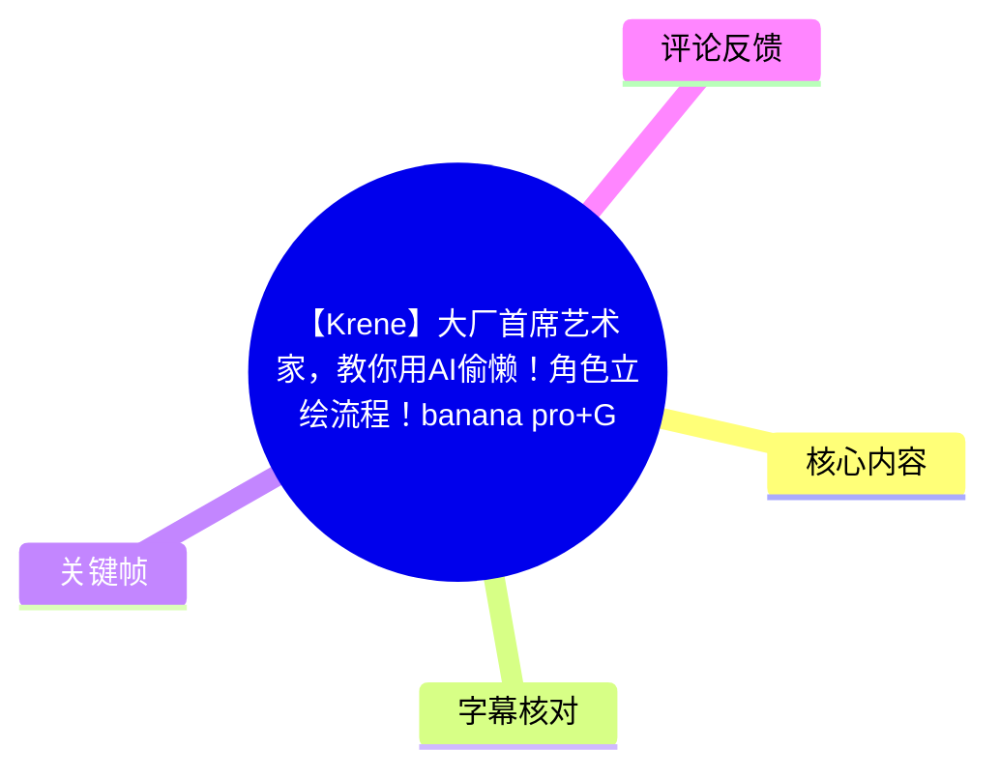
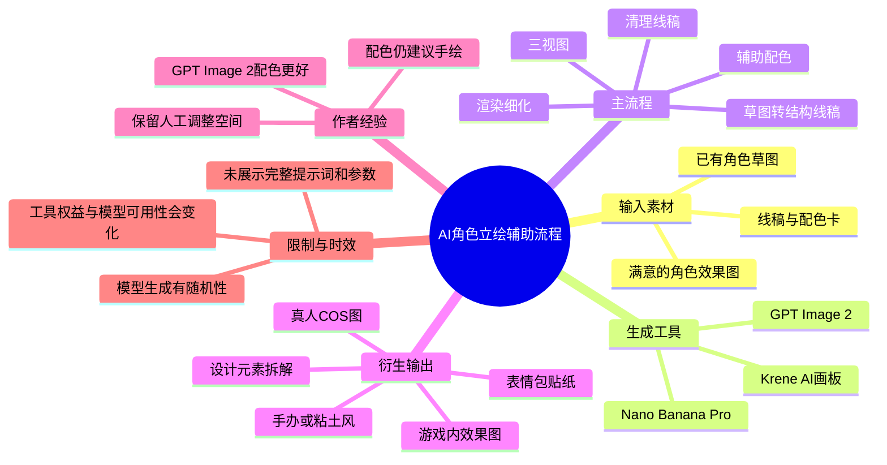
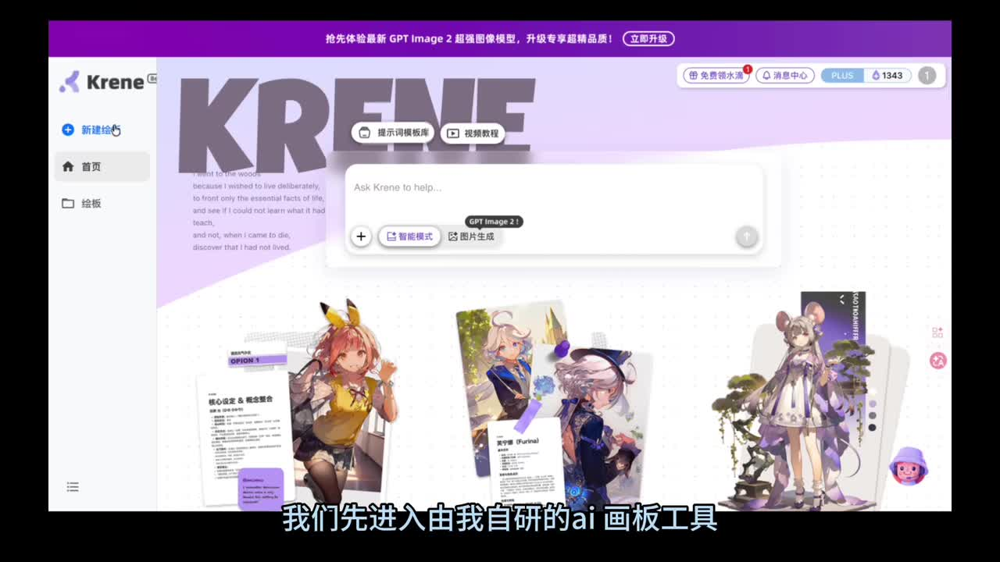
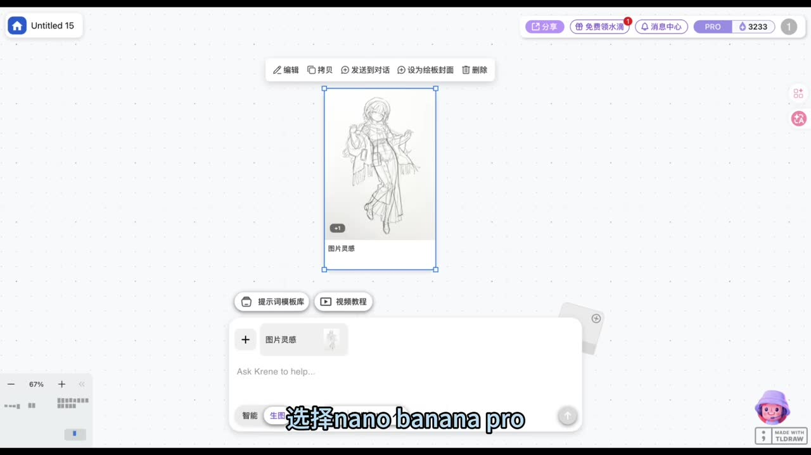
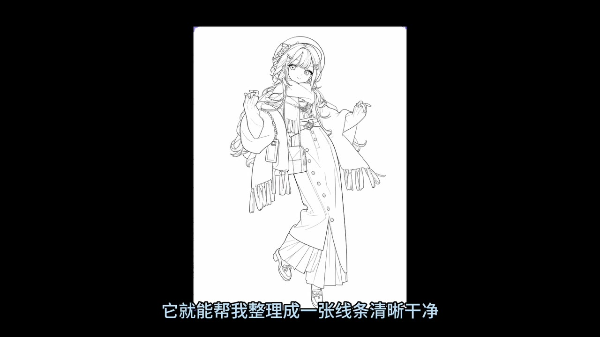
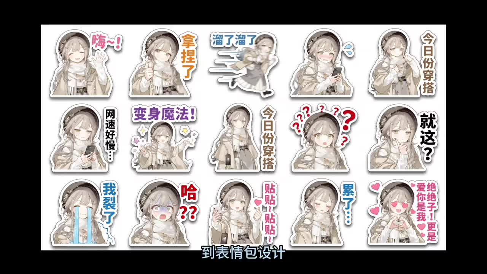

# 【Krene】大厂首席艺术家，教你用AI偷懒！角色立绘流程！banana pro+GPT image2。从线稿，到配色，到立绘效果，到三视图，到游戏内效果图

> 来源：[Bilibili 视频](https://www.bilibili.com/video/BV1qpEM6NELo)  
> UP 主：-XYZ-小叶子瓶颈中｜时长：03:15｜分区合集：AIcode  
> 视频简介提供的工具地址：[Krene](https://www.krene.com/?invitationCode=20F77A9W)；并称可加入 QQ 群 `692785043` 获取体验福利。链接、群信息及权益均为视频简介中的发布者信息，需以当前页面实际状态为准。

## 小结

这是一支以 **Krene AI 画板**为操作载体的角色原画辅助流程演示。作者从一张已有草图出发，依次展示 AI 清理线稿、辅助配色、渲染细化、生成不同游戏/媒介风格、三视图、设计元素拆解、表情包，以及将角色合成到游戏内场景的可能性。

视频给出的核心分工不是“让 AI 从零替代设计”，而是把 AI 用于重复性或变体工作：例如补齐草图细节、整理线条、尝试风格化渲染、生成衍生展示物。作者明确建议：**配色因模型随机性和后续调整需求，手绘往往更高效**；这也是视频中最重要的人工介入边界。

模型选择方面，作者称可在 Krene 中选择 **Nano Banana Pro** 或 **GPT Image 2**：前者用于根据草图逻辑补齐并生成结构线稿；后者被作者推荐用于配色及平涂图的细化渲染。这里的效果优劣是作者在演示中的经验判断，而非独立评测结论。

流程的前置条件是已有可供识别的角色草图或线稿，以及在配色环节提供配色卡。视频没有展示完整提示词文本、参数配置、单次生成耗时、成本、分辨率、版权/商用授权条款或失败案例，因此不能据此复现完全相同的结果，也不能将画面中的生成效果视为稳定保证。

内容具有明显时效性：视频声称平台可“无翻墙使用满血版 Nano Banana Pro 和 GPT Image 2”，并提及与 Google、Microsoft 的“官方合作”；这些均为作者口述，未在本素材中附带可核验合作文件。模型名称、可用地区、积分机制、功能入口和提示词页面都可能在发布后改变，应以 Krene 与相关模型服务的当前官方说明为准。

## 思维导图

## 目录

- [背景、前提与流程范围](#背景前提与流程范围)
- [草图识别与线稿清理](#草图识别与线稿清理)
- [配色：模型推荐与人工保留](#配色模型推荐与人工保留)
- [渲染细化与风格迁移](#渲染细化与风格迁移)
- [三视图、元素拆解与表情包](#三视图元素拆解与表情包)
- [游戏内效果图与提示词获取](#游戏内效果图与提示词获取)
- [可执行流程与适用边界](#可执行流程与适用边界)
- [结论与限制](#结论与限制)
- [字幕比对](#字幕比对)
- [评论分析](#评论分析)
- [处理记录](#处理记录)

## 背景、前提与流程范围 [00:00:28](https://www.bilibili.com/video/BV1qpEM6NELo?t=28)

视频在约 00:28 开始口述主体内容，称将在约 3 分钟内展示一条角色原画辅助工作流，覆盖：

1. 草图到线稿；
2. 线稿到配色；
3. 配色到细化立绘；
4. 三视图；
5. 元素拆解；
6. 表情包设计；
7. 《原神》式游戏局内效果图；
8. 《集合啦！动物森友会》式场景效果等。

作者将 Krene 称为其“自研的 AI 画板工具”，操作起点是在该工具中切换到生图模式，并选择 Nano Banana Pro 或 GPT Image 2。作者进一步声称 Krene 与 Google、Microsoft 存在官方合作，因此可无翻墙使用上述模型；本视频素材未给出合作公告、账户权限或地区限制细节，故应视为作者陈述。

> 图：画面展示 Krene 界面、左侧功能导航及多张角色设计样张，是理解视频所用操作环境的关键帧。它只能证明视频中展示了该界面，不能单独证明所有模型能力或合作关系。

## 草图识别与线稿清理 [00:00:28](https://www.bilibili.com/video/BV1qpEM6NELo?t=28)

作者的第一步是准备一张自己的角色草图，将其上传至 Krene，并选择 **Nano Banana Pro**。根据口述，输入对应提示词后，模型会识别草图中的构图/结构逻辑、补齐细节，并生成结构较准确的线稿。

随后作者演示切换至 **GPT Image 2**，在“与之前一样的提示词”条件下继续输出，用于将线稿整理得更清晰、干净，并称其可接近工业生产标准。需要注意：

- 视频未展示提示词全文，因此无法确认对角色比例、服装结构、材质、线宽、背景、负面约束等具体控制方式。
- “结构准确”“接近工业生产标准”属于作者对演示结果的评价，不等同于所有输入草图均能得到相同质量。
- 草图仍是该流程的重要输入。热评中也有观众指出“不会画草图”的障碍，说明此流程并未解决从零构思角色的问题。

> 图：该帧直接呈现画板上的角色草图、输入区域和“选择 nano banana pro”的字幕信息，支持“草图作为输入、选择模型后生成”的流程判断。

> 图：该帧展示一张全身角色线稿，用于说明视频所追求的“线条清晰、干净”的输出形态；它是单个展示样本，不能据此推断模型对所有服饰细节都可靠。

### 操作要点

1. 准备已有角色草图。
2. 在 Krene 中进入生图模式。
3. 上传草图，选择 Nano Banana Pro。
4. 使用作者提供的线稿类提示词生成初版。
5. 如需进一步规整线条，切换 GPT Image 2，以同类提示词继续整理。
6. 在进入配色前，人工检查角色结构、服装层级、手部、五官和小配件等高风险区域。

## 配色：模型推荐与人工保留 [00:00:52](https://www.bilibili.com/video/BV1qpEM6NELo?t=52)

配色环节的输入是：

- 一张线稿；
- 一张配色卡；
- 对应的提示词。

作者表示，将线稿与配色卡一同交给 Krene 后，可以快速得到配色方案。模型选择上，作者更推荐 **GPT Image 2**，并明确认为它在配色效果上优于 Nano Banana Pro。

但作者也给出了重要的限制判断：由于模型生成具有随机性，同时角色配色往往需要反复精调以服务后续设计，**配色仍建议采用传统手绘方式，效率反而更高**。这意味着视频并不把 AI 配色定位为最终定稿工具，更适合作为配色方案探索、快速预览或辅助出稿手段。

### 配色阶段的可迁移经验

- 配色卡是控制变量：它让模型有明确的色彩参考，而不是仅依据文字猜测。
- 若目标是大量探索不同色彩方向，AI 输出可帮助快速比较。
- 若目标是稳定交付、可控改色、满足项目规范，则应保留可编辑的人工配色流程。
- 生成结果需要检查：主/辅色比例、材质色区分、视觉重心、局部高饱和色，以及角色不同部位之间是否出现不合理串色。

## 渲染细化与风格迁移 [00:01:17](https://www.bilibili.com/video/BV1qpEM6NELo?t=77)

作者把渲染细化称为重点步骤，并继续使用 **GPT Image 2**。根据视频描述，输入提示词后，可以将平涂角色图转化为类似《明日方舟》“精英二阶段”立绘效果的风格。

作者同时调侃生成脸部看起来有某位既有角色的风格倾向。这一段实际揭示了风格化生成的风险：即使整体视觉效果符合预期，脸部特征、笔触或设计语言也可能不完全受控，并可能产生过于接近既有作品观感的问题。

在后续演示中，作者称只要修改提示词模板中对应的游戏名称，即可让平涂图生成多种方向，包括：

- 《原神》风格的二次元效果；
- 将提示词中的《原神》相关关键词替换为“周末地”后得到对应游戏截图感效果；
- 3A 游戏的 Unreal Engine 5（视频 ASR 误识别为“U15”）显示风格；
- 80 年代怀旧动画风格；
- 手办或粘土风格；
- 真人 COS 照片。

这里需要区分两层意思：

- **视频事实**：作者展示并口述了上述风格迁移用途。
- **不能直接验证的推论**：仅替换游戏名是否能稳定复现某种游戏的画面语言，取决于提示词其余内容、输入图、模型版本和随机性；视频没有给出多轮对比、失败率或一致性指标。

### 风格迁移的使用边界

- 不应将具体商业游戏名称简单视为质量保证或可商用授权。
- 面向正式项目时，应避免输出与特定在世创作者、特定商业 IP 或既有角色高度近似的内容。
- 以“风格特征”描述目标通常比单纯替换作品名更可控，例如：角色比例、赛璐璐层次、边缘光、金属材质、UI 构图、镜头距离等。
- 视频没有展示种子值、参考图权重、图片尺寸、迭代次数等参数，实际应用中需要自行建立可复现的记录。

## 三视图、元素拆解与表情包 [00:02:05](https://www.bilibili.com/video/BV1qpEM6NELo?t=125)

当获得满意的角色效果后，作者称可通过另一段提示词生成高质量的 **三视图**，再用提示词直接拆解设计元素。视频未展示三视图的具体正面、侧面、背面构图、尺寸或标注规范，因此“高质量”是作者评价；若用于建模或量产，还应人工核对三视图之间的服装结构、饰品位置、左右对称关系与比例一致性。

作者还演示了让角色更生动的方式：输入提示词后批量生成表情包贴纸，并称角色一致性保持得较好、表情可爱。视频表示未来会另行制作表情设计专题。

> 图：该帧集中展示同一角色的多种表情与动作贴纸，例如挥手、疑惑、流泪、比心等。它的价值在于直观呈现“以已有角色为基础批量派生表情”的目标，也能帮助观察角色服装和面部特征在不同姿势中的一致性。

### 衍生设计步骤

1. 选择已经确认的角色效果图作为基础输入。
2. 用三视图提示词生成角色多视角参考。
3. 用元素拆解提示词提取服装、饰品或设计构成。
4. 以“同一角色 + 指定情绪/动作 + 贴纸输出”生成表情包。
5. 人工筛选并修正脸部、手势、文字、服装细节和透明背景边缘。
6. 若面向实际生产，建立角色设定表，固定色值、结构标注与配件位置，不能只依赖生成图。

## 游戏内效果图与提示词获取 [00:02:29](https://www.bilibili.com/video/BV1qpEM6NELo?t=149)

作者总结称，流程可从一张草图出发，经多个动作快速形成“专业且标准”的角色设定图。随后进一步展示：使用提示词可以把已做好的角色放进《原神》游戏中，形成“以假乱真”的局内游戏截图；同样也可尝试《集合啦！动物森友会》等游戏场景效果。

这类输出本质上是**概念展示图或视觉模拟图**，并不等于角色已被导入真实游戏引擎，也不代表能够在对应游戏中运行。视频没有演示游戏引擎、角色模型、骨骼、材质、UI 接入、版权授权或资产导出流程。

在片尾，作者表示已将全部提示词整理至 blog，复制到 Krene 即可尝试同类效果；并称“评论区三连”可获得提示模板和积分兑换码。可获取热评中，UP 主确实贴出了以下文档链接：

<https://krene.com/blog/ai-character-artwork-banana-pro-gpt-image2>

该链接由 UP 主评论提供，但本素材未包含链接页面内容或有效性检测结果，使用前应自行确认其当前可访问性、提示词完整度、账户要求和积分规则。

## 可执行流程与适用边界 [00:00:28](https://www.bilibili.com/video/BV1qpEM6NELo?t=28)

基于视频实际展示，可将流程整理为以下操作清单。未展示的提示词正文和生成参数不予补写。

| 阶段 | 输入 | 作者建议的模型/方式 | 预期输出 | 人工检查重点 |
| --- | --- | --- | --- | --- |
| 草图转线稿 | 角色草图 | Nano Banana Pro | 补全细节的结构线稿 | 人体比例、手部、服装层级 |
| 线稿清理 | 初版线稿 | GPT Image 2 | 更干净、清晰的线条 | 线宽一致性、饰品、五官 |
| 配色探索 | 线稿、配色卡 | 作者推荐 GPT Image 2 | 配色方案 | 色彩逻辑、串色、项目规范 |
| 配色定稿 | 生成结果或原线稿 | 手绘优先 | 可控的最终配色 | 色值、材质、后续可编辑性 |
| 渲染细化 | 平涂角色图 | GPT Image 2 | 风格化角色立绘 | 面部相似性、结构漂移、IP 近似风险 |
| 三视图 | 满意的角色图 | 视频称使用对应提示词 | 多角度角色参考 | 正侧背结构是否一致 |
| 元素拆解 | 角色图 | 视频称使用对应提示词 | 服装/配件设计拆分 | 拆分是否遗漏、是否可生产 |
| 表情包 | 角色图 | 视频称使用对应提示词 | 批量表情贴纸 | 身份一致性、动作、文字与边缘 |
| 场景合成 | 已完成角色 | 视频称使用对应提示词 | 游戏截图感效果图 | 是否仅为视觉合成，不是游戏资产 |

### 不应忽略的限制

1. **草图能力仍是起点**：视频流程以“自己准备一张草图”为前提，并非从空白文字直接完成角色设计。
2. **随机性仍然存在**：作者在配色段落直接承认模型随机性，因此需要人工筛选和调整。
3. **提示词和参数缺失**：视频没有展示具体提示词、分辨率、生成次数、种子或成本，无法严格复刻。
4. **风格与版权风险**：涉及具体游戏名称和“以假乱真”的游戏截图感效果时，输出仅适合概念参考的风险判断更稳妥；商用前需核验授权与相似性风险。
5. **并非真实游戏开发流程**：视频展示的是图像效果图，不包含角色资产进引擎的技术步骤。
6. **工具服务可能变化**：模型、积分、会员、地区可用性、合作状态、网页入口均具有时效性。

## 结论与限制 [00:02:53](https://www.bilibili.com/video/BV1qpEM6NELo?t=173)

这支视频最有价值的部分，是给出了“角色设计主素材—衍生资产”的链式思路：先以草图锁定角色基础，再借助 AI 加速线稿整理、方案扩展、表现形式转换和展示物生成。对于已有绘画基础、需要快速探索角色方向或制作提案展示的人，这条链路具有实际参考价值。

其中最值得保留的工作原则是：**把 AI 放在高重复、可筛选、可迭代的环节；把人工放在设计决策、定稿配色、结构校验和风险把关的环节。** 作者对配色“古法手绘更有效率”的判断，恰好说明了工具提效不等于每一步都自动化。

同时，视频为短时案例展示，未覆盖质量稳定性、真实生产管线、提示词细节、账号成本和权利边界。对“官方合作”“无翻墙满血模型”“接近工业生产标准”“以假乱真”等说法，应保持来源意识：它们是视频作者陈述或视觉演示，不应在缺乏额外证据时扩大为普遍事实。

## 字幕比对

| 字幕来源 | 完整性 | 专有名词 | 时间轴 | 主要问题 |
| --- | --- | --- | --- | --- |
| Bilibili 站内字幕 | 未提供可用字幕 | 无法核对 | 无法核对 | 本次素材没有可用站内字幕文件。 |
| 本次 ASR 字幕 | 覆盖约 166.22 秒语音，语音覆盖率约 85.56%；首段语音为 00:28.040 | 存在多处误识别 | 8 个带起止时间的分段可直接使用 | 分段过长，句间缺少切分；模型名、工具名及游戏名有混淆。 |

本次最终采用 **ASR 的真实时间轴** 作为章节定位依据，并结合标题、视频简介、关键帧中的界面文字及上下文对少数专有名词作保守校正。ASR 诊断中**未标记 `noAudioStream=true`**；音频实际存在，识别语言为中文，语言置信度约 `0.9980`。

重要校正及保留原则：

- ASR 中的“Carini”“cranily”与视频标题、简介链接及界面品牌相互印证，正文统一记为 **Krene**。
- “GPテイメージ2”“GP Image V 2”等，结合视频标题，统一记为 **GPT Image 2**。
- “U15 显示风格”结合上下文，记为 **Unreal Engine 5（UE5）显示风格**；这是对明显语音识别错误的校正，不意味着视频展示了 UE5 工程文件。
- “30 图”结合上下文记为 **三视图**，但视频未提供三视图成品关键帧与规范细节。
- “周末地”按 ASR 原文保留为该读音对应名称；由于缺乏可供确认的站内字幕或画面文字，不对其正式名称作进一步推断。
- ASR 首段从 00:28 才开始，前约 28 秒无被识别的人声内容；正文没有凭文字顺序虚构该段内容。

## 评论分析

仅处理本次可获取的热评前三条，评论反映的是个体诉求或发布者补充，不能替代视频事实验证。

1. **AIGC造梦大师｜38 赞**  
   评论希望获得“生草图”的提示词，并要求覆盖二次元到真人方向。该评论指出视频流程的实际门槛：演示从已有草图开始，而很多用户的需求恰恰是草图之前的角色构思与草图生成。视频本身未提供“从零生草图”的提示词或完整方法。

2. **护花忍者｜29 赞**  
   评论称“倒在第一步，不会画草图”。这与视频流程前提一致：作者要求用户先准备自己的草图。该观点强化了适用范围——流程更适合已有基础草图的人，或需要另行解决草图来源问题的人；不能将其理解为零绘画基础即可无门槛完成角色原画。

3. **-XYZ-小叶子瓶颈中（UP 主）｜11 赞**  
   UP 主提供了“立绘流程的提示词文档”链接：<https://krene.com/blog/ai-character-artwork-banana-pro-gpt-image2>。这为视频中未展示全文的提示词提供了潜在补充来源，但本任务素材未抓取该网页内容，无法验证页面是否持续有效、包含哪些模板、是否需要登录或消耗积分。

## 处理记录

- Worker ID：`worker-mrj0wbly-5dc4e50c`
- 模型：`gpt-5.6-terra`
- 调用工具与素材：视频元数据、ASR 结果 JSON、ASR SRT 时间轴字幕、关键帧清单与已提供关键帧画面、热评 JSON。
- 字幕选择：未提供可用 Bilibili 站内字幕；已检查本次 ASR，采用其 `00:00:28,040` 至 `00:03:14,260` 的真实分段时间生成时间轴链接，并对明显专有名词误识别进行上下文校正。
- 关键帧选择依据：
  - `frames/frame-002.jpg`：展示 Krene 工具环境和角色设计样张；
  - `frames/frame-003.jpg`：展示草图输入及 Nano Banana Pro 选择；
  - `frames/frame-004.jpg`：展示清理后的角色线稿；
  - `frames/frame-001.jpg`：展示同一角色的批量表情包产出。
- 缓存清理：本任务提供的素材中未包含可执行缓存清理日志；未声称已执行未提供证据的删除操作。
- 未解决问题：
  - 未获得站内字幕，无法进行逐字级双字幕校验；
  - 未提供完整提示词、生成参数、成本和模型版本，无法复现或量化效果；
  - 未抓取 Krene 博客正文及当前服务条款，无法验证提示词文档、积分兑换码、合作关系和模型可用性的现状；
  - 仅有部分关键帧画面可供正文引用，未对未展示画面的关键帧内容作推断。
