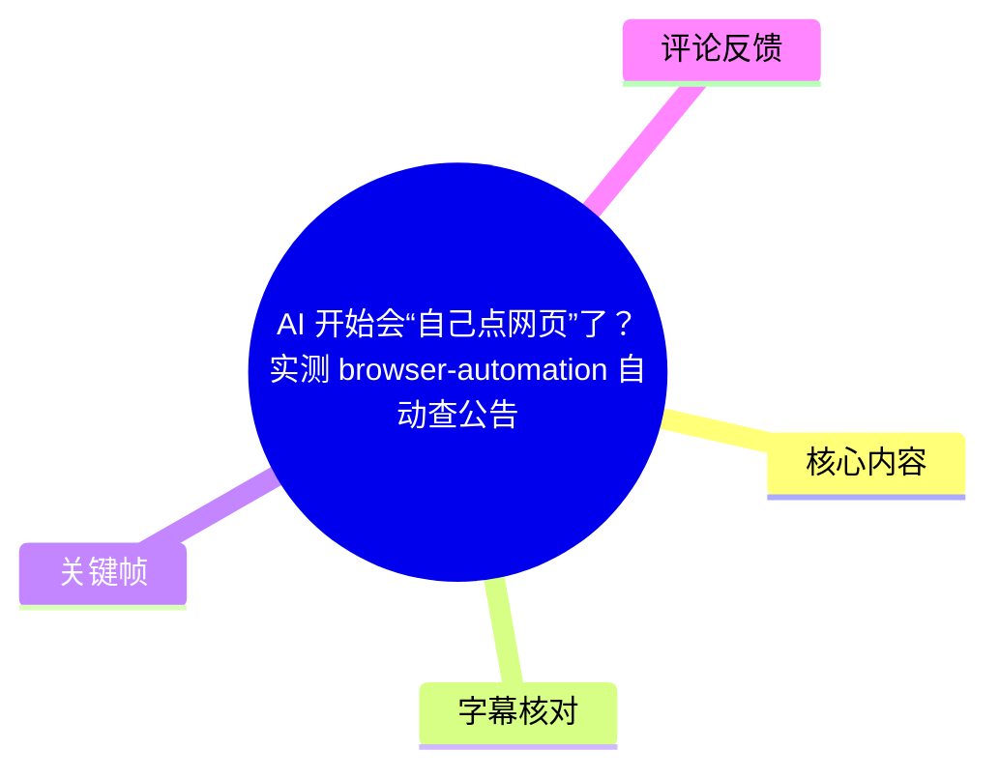
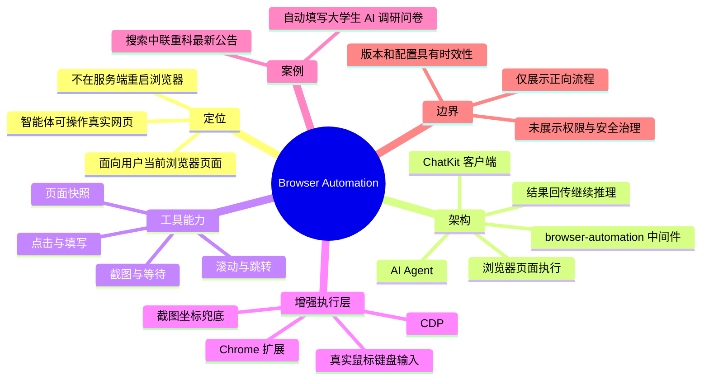
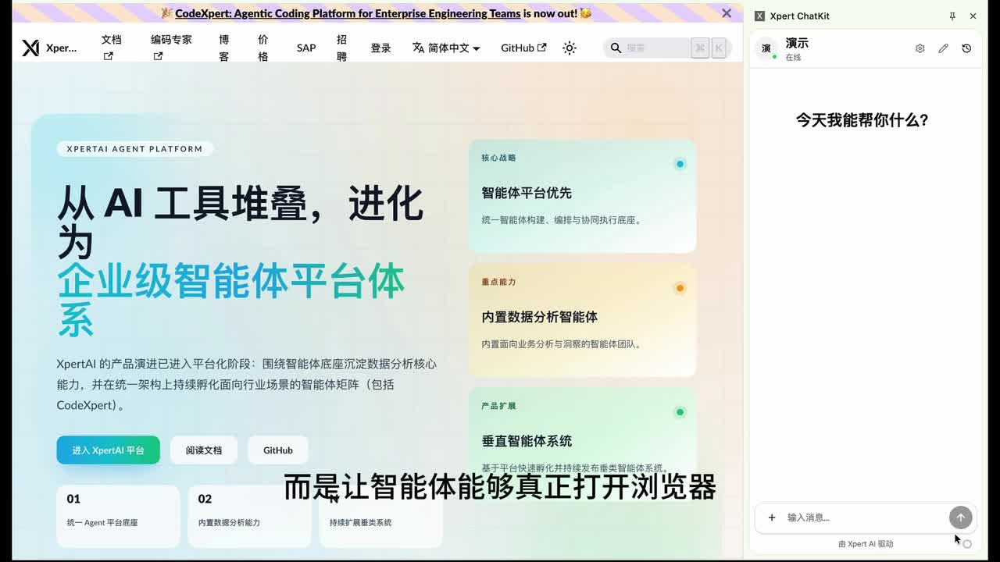
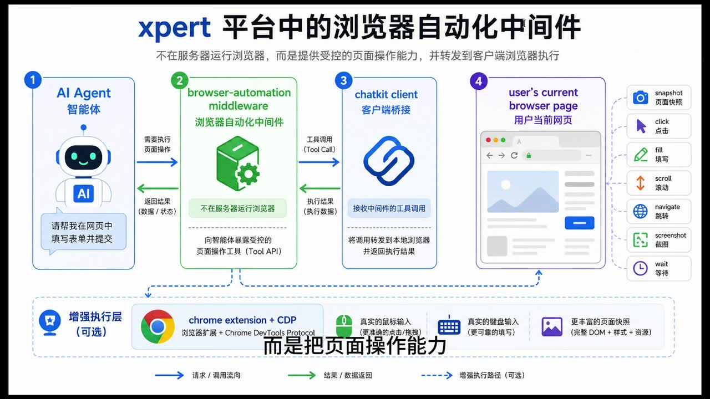
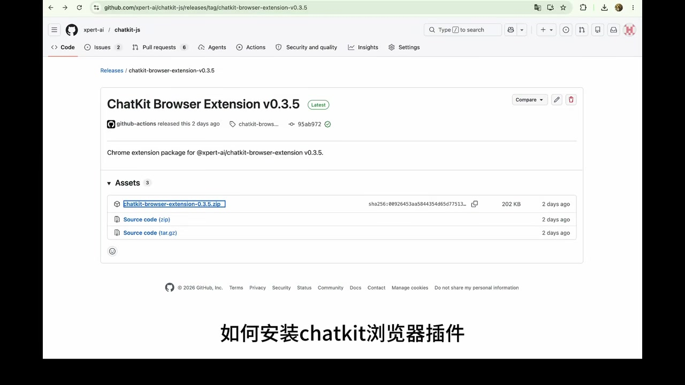

# AI 开始会“自己点网页”了？实测 browser-automation 自动查公告、填问卷

> 来源：[Bilibili 视频](https://www.bilibili.com/video/BV1XqLv6ZEx1)<br>
> UP 主：XpertAI_元数信息技术｜时长：4 分 46 秒｜合集：AIcode  
> 注：以下内容以本次带时间轴 ASR、给定关键帧、视频元数据及可获取热评为依据整理；未提供可用的 Bilibili 站内字幕。

## 小结

视频介绍 Xpert 平台中的 `browser-automation` 浏览器自动化中间件。其定位不是让服务端另行启动一个浏览器，而是将“读取当前网页、点击、填写、滚动、跳转、截图、等待”等能力封装为智能体可调用的工具，并经由 ChatKit 客户端转发到用户当前打开的浏览器页面执行。

视频呈现的核心链路为：**AI Agent 发起工具调用 → browser-automation 中间件调度 → ChatKit 客户端桥接 → 用户当前浏览器页面执行操作 → 执行结果返回模型继续推理**。关键帧还显示，可选的 Chrome 扩展与 CDP（Chrome DevTools Protocol）增强层能够补充更丰富的页面快照、真实鼠标点击、真实键盘输入及基于截图坐标的兜底操作。

演示包含两个案例：其一是在百度中检索“中联重科”的最新公告，智能体识别搜索框、输入关键词、提交搜索、沿结果页继续查找并定位最新公告；其二是依据用户在对话中提供的个人信息，读取在线问卷题目和选项，完成单选、多选、下拉选择等表单填写。

视频的经验重点在于：浏览器自动化不应只理解为脚本式“点按钮”。此方案试图让智能体先理解自然语言上下文，再读取页面结构与选项，根据题型和用户信息进行匹配，并把网页执行结果带回后续推理。

适合关注 AI Agent、浏览器自动化、企业智能助手、RPA、表单处理及网页信息检索的读者。需要注意的是，视频仅展示能力路径与两个正向演示，**没有展示权限控制、登录态隔离、敏感数据脱敏、失败重试、验证码处理、提交前人工确认、跨站安全策略或实际公告内容**；这些均不能从视频中推断为已解决。

时效上，关键帧中展示的 ChatKit Browser Extension Release 页面为 `v0.3.5`，并标注“Latest”和“2 days ago”；这只是录制画面中的相对状态，不能据此认定当前最新版本。安装包、配置字段和工具接口均可能随版本变化。

## 思维导图





## 目录

- [定位：让智能体从回答走向网页执行](#定位让智能体从回答走向网页执行)
- [架构与工具：中间件如何连接模型和当前网页](#架构与工具中间件如何连接模型和当前网页)
- [安装与接入：ChatKit 浏览器扩展](#安装与接入chatkit-浏览器扩展)
- [案例一：搜索中联重科最新公告](#案例一搜索中联重科最新公告)
- [案例二：依据对话自动填写问卷](#案例二依据对话自动填写问卷)
- [可迁移经验、限制与时效性](#可迁移经验限制与时效性)
- [字幕比对](#字幕比对)
- [评论分析](#评论分析)
- [处理记录](#处理记录)

## [定位：让智能体从回答走向网页执行](https://www.bilibili.com/video/BV1XqLv6ZEx1?t=28)

视频从 Xpert 平台的 `Browser Automation` 中间件切入。作者提出，它要解决的是：不让模型能力停留在对话输出，而是让智能体能够打开浏览器、读取页面、点击控件和输入内容，将任务推进到真实网页环境中。

这里的“网页执行”至少包含两层含义：

1. **页面理解**：智能体需要识别页面当前有什么内容、表单题目、候选选项或可交互元素。
2. **页面操作**：智能体根据任务目标采取点击、输入、滚动、跳转等动作，并依据返回结果决定下一步。

视频没有把它描述为传统纯脚本自动化：操作步骤并非在演示中预先逐项写死，而是由智能体在每一步页面操作后判断“接下来该点哪里、看哪里”。



> 图：该关键帧展示 Xpert 页面及右侧 “Xpert ChatKit” 对话面板。它有助于理解本视频讨论的是让智能体在用户浏览器上下文中参与页面任务，而非仅在独立聊天窗口中返回文本。

## [架构与工具：中间件如何连接模型和当前网页](https://www.bilibili.com/video/BV1XqLv6ZEx1?t=31)

作者说明，`browser-automation` 位于智能体与“用户当前浏览器页面”之间。它**不在服务端重新启动浏览器**，而是把页面操作能力封装为可由模型调用的工具；调用请求再通过 ChatKit 客户端转发给用户当前打开的网页。

按视频架构图，数据与调用路径可整理为：

| 环节 | 视频中的职责 |
| --- | --- |
| AI Agent / 智能体 | 理解用户任务，决定是否需要页面操作，并发起工具调用 |
| browser-automation middleware | 向智能体提供受控的页面操作工具 API；转发并协调调用 |
| ChatKit client / 客户端桥接 | 接收中间件的工具调用，将调用转到本地当前浏览器，并返回执行结果 |
| user’s current browser page / 用户当前网页 | 实际发生点击、填写、滚动、跳转、截图等操作的位置 |
| 执行结果 | 回传给模型，使模型能够基于新页面状态继续推理 |

视频口述的基础工具包括：

- 页面快照（画面标注为 `snapshot`）
- 点击（`click`）
- 填写（`fill`）
- 滚动（`scroll`）
- 跳转（`navigate`）
- 截图（`screenshot`）
- 等待（`wait`）

作者还说相应工具名通常以 `host_` 前缀开头；但给定素材**未展示完整、可复制的工具名列表或参数定义**，因此不能据此补出具体 API 名称、JSON 字段或调用格式。



> 图：这是理解全片最关键的架构帧。图中明确标注“不是在服务器运行浏览器，而是提供受控的页面操作能力，并转发到客户端浏览器执行”，并展示请求/调用流与结果/数据返回流。

### 可选增强层：Chrome 扩展与 CDP

视频称，若配合 Chrome 扩展和 CDP（关键帧明确写作 Chrome DevTools Protocol）使用，可获得：

- 更完整的页面快照：图中描述为“完整 DOM + 样式 + 资源”；
- 真实鼠标输入：更精确的点击与拖拽；
- 真实键盘输入：更可靠的文本输入；
- 基于截图坐标的兜底操作能力。

这里的“可选”很重要：视频图中将该层标作“增强执行层（可选）”。因此，不能把 Chrome 扩展或 CDP 视为视频所述基础链路必然启用的组成部分。

## [安装与接入：ChatKit 浏览器扩展](https://www.bilibili.com/video/BV1XqLv6ZEx1?t=79)

作者在演示中给出 ChatKit 浏览器扩展的接入顺序：

1. 进入 ChatKit 浏览器扩展的 Release 页面。
2. 找到最新版本的安装包并下载。
3. 解压扩展压缩包。
4. 打开 Chrome 的扩展程序管理页面。
5. 开启“开发者模式”。
6. 使用“加载已解压的扩展程序”，选择刚刚解压出的目录。
7. 安装完成后，打开扩展配置页。
8. 填入视频所称的相关配置项，完成当前网页接入准备。
9. 在所连接的“数字专家”编排中搭载浏览器自动化中间件，再进入后续任务演示。



> 图：关键帧可见 Release 标题为 “ChatKit Browser Extension v0.3.5”，Assets 中有名为 `chatkit-browser-extension-0.3.5.zip` 的压缩包。它为“下载、解压、以开发者模式加载扩展”的操作提供了画面依据。

### 配置字段的证据边界

ASR 在 1:43 后将配置项识别为类似“Export IT 和 APIP”，但音写结果明显不稳定，且所给关键帧未展示配置页具体字段。视频语义能够确认的是：**安装扩展后需要在配置页填入连接所需配置，配置完成后 ChatKit 才能接入当前网页**。

因此，本整理不将 ASR 中不可靠的字符串扩写为具体凭据名称，也不建议读者据此输入任何配置。实际字段、服务地址、鉴权方式与插件版本应以对应项目当前文档或配置页为准。

## [案例一：搜索中联重科最新公告](https://www.bilibili.com/video/BV1XqLv6ZEx1?t=127)

第一个案例发生在百度首页。作者让智能体查询“中联重科公司的最新公告”，展示的动作链为：

1. 识别页面中的搜索框；
2. 输入检索关键词；
3. 点击搜索，将查询真正提交到网页；
4. 如果首页结果未直接给出目标信息，则继续根据搜索结果向下查找；
5. 进入公告页面；
6. 定位最新一条公告信息；
7. 将找到的结果返回给用户。

作者强调，整个过程会被拆分为一系列页面操作。并非由浏览器一次性完成所有动作，而是由智能体根据当前步骤的页面信息判断下一步操作位置及查看内容。

这类流程的可迁移结构是：

```text
任务目标
  → 识别可操作入口
  → 输入与提交
  → 阅读结果页
  → 必要时跳转到来源页面
  → 定位目标条目
  → 返回结果与状态
```

### 案例能够说明与不能说明的内容

**能够说明：**

- 该方案的目标覆盖跨越搜索页与结果页的多步任务；
- 智能体可以将页面观察与下一步动作决策串联；
- 网页检索可被纳入对话式任务流程。

**不能从视频确认：**

- 所查询到的“最新公告”的标题、发布日期、来源网址及事实准确性；
- “最新”的判断标准是网页排序、公告日期还是其他规则；
- 搜索失败、网页反爬、登录、弹窗、验证码、页面改版时的处理策略；
- 是否有人工复核步骤。

视频未提供该案例结果页的可读关键帧，也未在 ASR 中报出公告正文，故不应补写具体公告内容。

## [案例二：依据对话自动填写问卷](https://www.bilibili.com/video/BV1XqLv6ZEx1?t=166)

第二个案例是一份“大学生人工智能使用情况”的在线调研问卷。作者首先在对话中提供一组个人信息，随后让智能体打开问卷页面、读取题目和选项，并将对话信息映射为表单答案。

视频中给出的用户条件及匹配结果如下：

| 问卷维度 | 用户在对话中给出的信息 | 视频所述页面操作/结果 |
| --- | --- | --- |
| 身份 | 大学生 | 用作问卷语境信息 |
| 性别 | 男性 | 选择“男性” |
| 专业 | 计算机专业 | 勾选“理工科类” |
| AI 工具使用史 | 使用过 ChatGPT（ASR 误识为“Chess GPT”） | 在“是否使用过 AI 工具”中选择“是” |
| 常用工具类型 | 使用习惯对应聊天与学习辅助 | 多选“AI 聊天助手”和“AI 学习辅助工具” |
| 最担心的问题 | 数据隐私与安全 | 选择“数据隐私泄漏” |
| 年级 | 用户称为大学生，但未给出具体年级 | 作者称智能体会按下拉框选择对应年级；具体选项未在素材中明确 |

该案例体现的流程不是简单逐项点击，而是：

1. 从自然语言对话中提取用户信息；
2. 打开问卷页面；
3. 读取题目与候选选项；
4. 判断控件类型，如单选、多选或下拉选择；
5. 把用户表达映射到页面中的可选答案；
6. 完成整份表单填写。

### 从案例提炼的表单自动化经验

- **先确认信息来源**：页面填写应以用户明确提供的信息为依据，而不是让智能体自行猜测。
- **按题型选择动作**：单选、多选、下拉框具有不同交互方式；视频明确展示了对题型与备选项的判断。
- **保留语义映射环节**：如“计算机专业”映射为“理工科类”、“数据隐私和安全问题”映射为“数据隐私泄漏”，属于语义匹配，而不是逐字填写。
- **高风险提交需增加确认**：视频只展示“自动填写完成”，没有明确展示最终提交按钮是否被点击。现实问卷可能涉及个人信息、研究数据或法律声明，提交前宜由用户复核。

## [可迁移经验、限制与时效性](https://www.bilibili.com/video/BV1XqLv6ZEx1?t=266)

作者在结尾将核心价值概括为：让智能体从“只会回答”进一步成为“可以操作网页”的系统，并认为网页查询、表单填写和流程执行较多的业务场景值得关注这一中间件。

### 适合的任务形态

依据视频中的两个案例，较匹配的任务包括：

- 有明确目标的信息检索，如从搜索页进一步进入目标站点寻找条目；
- 已知用户信息驱动的网页表单预填写；
- 页面状态变化后需要继续判断下一步的多步网页流程；
- 需要把网页执行结果再交还模型生成答复的对话式工作流。

### 视频未覆盖的关键限制

| 限制维度 | 素材中可确认的情况 | 实践中需要额外验证的问题 |
| --- | --- | --- |
| 页面权限 | 通过当前用户浏览器执行 | 扩展能访问哪些站点、标签页与页面数据，是否最小权限授权 |
| 登录态与隐私 | 使用用户当前网页上下文 | Cookie、会话、输入内容、截图和快照如何保护、保存与清理 |
| 高风险动作 | 展示点击与填写能力 | 删除、支付、发布、提交等不可逆操作是否需要二次确认 |
| 网页鲁棒性 | 仅展示正向演示 | 动态页面、弹窗、加载失败、改版、反自动化和验证码的应对 |
| 结果可信度 | 智能体依据页面信息继续推理 | 搜索结果是否权威、日期是否正确、模型是否会误读页面 |
| 工具接口 | 仅展示能力类别 | `host_` 工具的精确名称、参数、错误码与版本兼容性均未给出 |

### 时效性说明

- 视频元数据的发布时间按 Unix 时间戳换算为 **2026-05-22**，但未标明时区，应仅作为近似发布时间参考。
- 关键帧中的扩展版本为 `v0.3.5`，其“Latest”“2 days ago”均是录制时页面状态，不是当前版本承诺。
- 浏览器扩展、Chrome 的扩展加载界面、CDP 能力、平台编排方式及配置字段都可能变化。
- 因未提供官方文档、仓库链接正文、接口定义或测试日志，本视频应被视为功能演示与架构介绍，而非可直接复现的完整部署手册。

## 字幕比对

| 字幕来源 | 完整性 | 专有名词 | 时间轴 | 主要问题 |
| --- | --- | --- | --- | --- |
| Bilibili 站内字幕 | 未提供可用字幕，无法核验 | 无法核验 | 无 | 无可用素材 |
| 本次 ASR 字幕 | 覆盖 00:28.580–04:42.450；诊断语音覆盖约 87.42% | 存在多处音近误识 | 有，13 个真实时间段 | 首段在 28.58 秒开始；工具名、产品名、配置项及个别中文词出现错写或粘连 |

本次 ASR 已被检查。ASR 诊断显示：识别语言为中文、置信概率约 `0.9995`、音频时长约 `285.30` 秒、带时间戳；诊断中**没有** `noAudioStream=true` 标记，因此可确认源素材存在可供识别的音轨，并非无音轨视频。

最终采用策略为：**以本次 ASR 的 SRT 时间段作为所有时间轴链接依据，以关键帧可见文字和上下文对少数专有名词做保守校正**。重要校正或保留情况如下：

| ASR 原识别/问题 | 本整理采用 | 校正依据与处理原则 |
| --- | --- | --- |
| `Expert`、`Export` 等 | Xpert | 视频标题、UP 主名称及关键帧中的 “Xpert” 品牌文字 |
| `Browser Automation中间键` | browser-automation / 浏览器自动化中间件 | 标题、架构图和语义；“中间键”属语音识别错误 |
| `ChatKit 浏载器插建` | ChatKit 浏览器扩展 | 关键帧 Release 标题为 “ChatKit Browser Extension” |
| `CTP` | CDP | 架构图明确显示 “Chrome extension + CDP” 和 “Chrome DevTools Protocol” |
| `Chess GPT` | ChatGPT | 中文语境中“用过 ChatGPT”与后续 AI 聊天工具表述一致；作为上下文校正，不外推更多信息 |
| `Export IT 和 APIP` | 不确定的连接配置项 | 未见配置页字段，不能安全地推断具体名称 |
| `中联众科` | 中联重科 | 视频标题/简介明确写有“中联重科最新公告”，用于校正 ASR 误识 |

## 评论分析

以下仅分析可获取的热评前三条；评论为用户观点，不等同于已验证事实。

1. **-德川家康薛定谔（17 赞）**：“headless chrome：你好。[doge]”
   - 观点：以调侃方式将视频方案与 Headless Chrome 一类浏览器自动化能力联系起来。
   - 补充价值：指出该方案所处的技术谱系与浏览器自动化有关。
   - 可信度与边界：评论没有论证两者的架构差异。视频反而强调“不在服务端运行浏览器”，而 Headless Chrome 常见用法可能是在自动化环境中启动无头浏览器；两者能否等同，不能仅凭该评论判断。

2. **Egophant（16 赞）**：“直接用codex走cdp操控浏览器不是一样吗？这个工具的主要价值是在服务端通过js下发了浏览器自动化控制能力，更方便可控。可以这么理解吗？”
   - 观点：提问该工具与经 CDP 控制浏览器是否等价，并尝试将其价值理解为服务端下发 JS 控制能力。
   - 补充价值：提出与 CDP 直连方案的比较维度，包括控制链路、易用性与可控性。
   - 需要纠正/保留之处：视频架构图和口述明确说该中间件“不在服务器运行浏览器”，而是经 ChatKit 客户端转到用户当前浏览器执行；评论中的“服务端通过 JS 下发”并非视频已证实的机制。视频只确认 CDP 可作为可选增强执行层，未证明它与直接使用 Codex/CDP 完全相同或不同。

3. **是我说的啦（7 赞）**：“playwright 微软的mcp”
   - 观点：将视频能力联想到 Playwright 与 MCP 生态。
   - 补充价值：提示读者可以从现有浏览器自动化框架和工具协议的角度理解该产品定位。
   - 可信度与边界：评论过于简略，未给出具体实现依据。视频中没有提到 Playwright，也没有说明其与任何“微软的 MCP”实现之间的关系，不能据此认定本方案基于 Playwright 或某个 MCP 实现。

## 处理记录

- Worker ID：`worker-mrj0wjed-b0c290ad`
- 模型：`gpt-5.6-terra`
- 使用素材与工具：任务提供的元数据、`asr/asr-result.json`、`asr/transcript.srt`、关键帧目录、热评 `comments/comments.json`；未提供其他可验证的工具调用日志。
- 字幕选择：未提供可用 Bilibili 站内字幕；已检查本次 ASR。采用 ASR SRT 的真实分段时间作为时间轴依据，并以关键帧、标题和简介对 `Xpert`、`CDP`、`ChatGPT`、`中联重科` 等明显误识项作保守校正。
- ASR 音轨判断：`asr-result.json` 未标记 `noAudioStream=true`；ASR 成功从音频中识别出 13 段带时间戳语音，故未将字幕缺失归因为工具失败或无音轨。
- 关键帧选择依据：
  - `frames/frame-001.jpg`：展示 Xpert 页面与 ChatKit 侧栏，支撑“网页上下文 + 对话面板”的介绍；
  - `frames/frame-002.jpg`：完整呈现智能体、中间件、ChatKit 客户端、用户当前网页及可选 CDP 增强层，是架构说明的直接证据；
  - `frames/frame-004.jpg`：展示 `ChatKit Browser Extension v0.3.5` Release 与 ZIP 安装包，支撑扩展安装流程。
- 缓存清理：提供的素材未包含缓存清理命令、执行日志或结果；本整理未执行也不虚构已完成缓存清理。
- 未解决问题：
  - 扩展配置页的精确字段和鉴权方式未在可用画面中展示；
  - `host_` 系列工具的完整清单、参数、错误处理机制未提供；
  - 两个案例的最终网页结果、提交状态及异常处理过程均未给出；
  - 未提供站内字幕，无法进行逐句双源校对。
