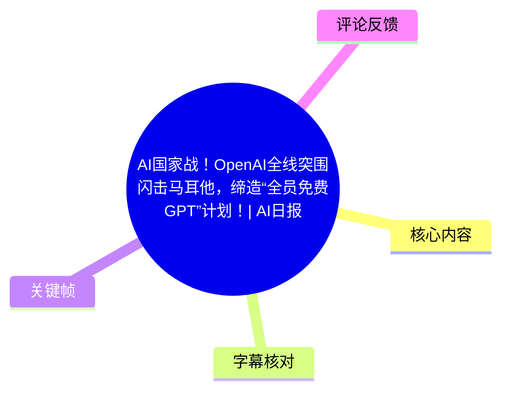
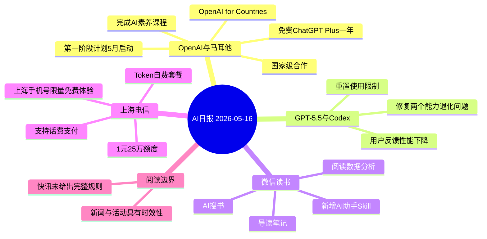
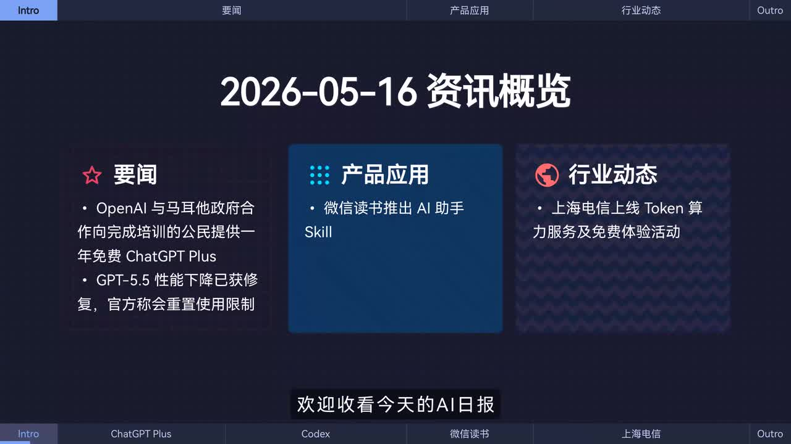
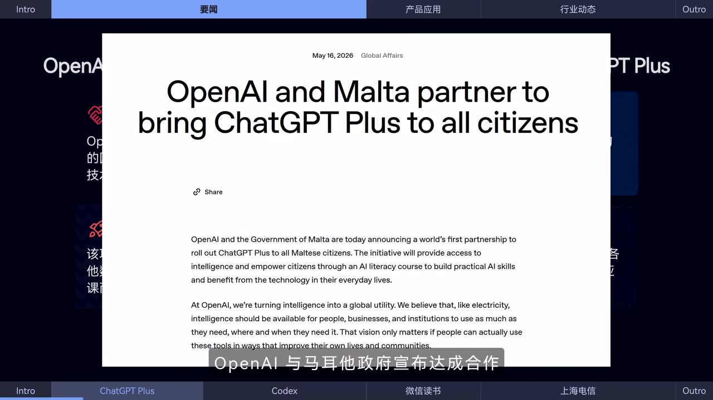
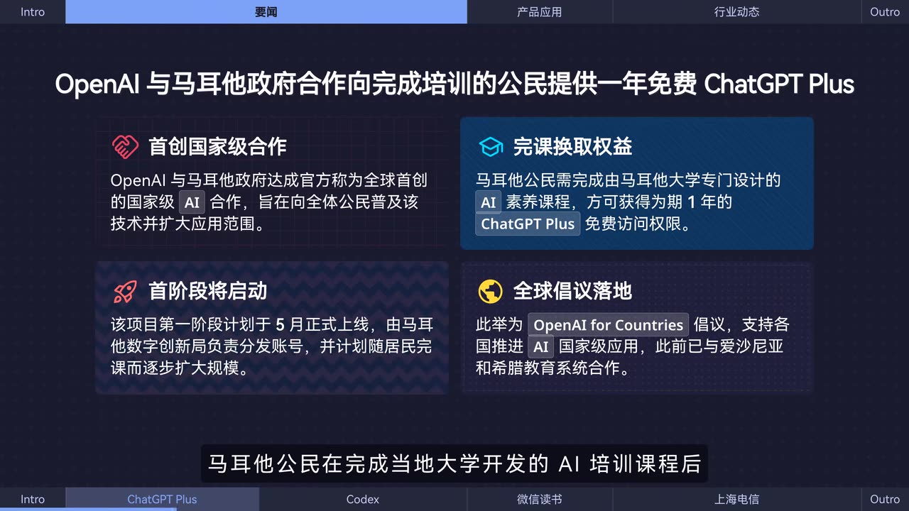

# AI国家战！OpenAI全线突围闪击马耳他，缔造“全员免费GPT”计划！| AI日报0516

> 来源：[Bilibili 视频](https://www.bilibili.com/video/BV1hqLG68Ead)  
> UP 主：黑鸦Heya｜所属合集：AIcode｜视频时长：00:49｜画面日期：2026-05-16  
> BVID：BV1hqLG68Ead

## 小结

本期 49 秒 AI 日报集中播报四则信息：OpenAI 与马耳他政府达成国家级合作、GPT-5.5 性能回退问题的修复进展、微信读书上线 AI 助手 Skill，以及上海电信推出大模型 Token 自费套餐和限量免费体验。

最重要的新闻是马耳他合作计划：视频称，马耳他公民完成由当地大学开发的 AI 素养课程后，可获得 **1 年 ChatGPT Plus 免费访问权限**。画面还补充称，该项目计划于 5 月启动第一阶段，由马耳他数字创新局负责分发账号，并将随居民完成课程逐步扩大规模。

对于开发者和高频使用者，视频给出两项直接关联使用成本与使用体验的信息：其一，Codex 团队称已修复导致 GPT-5.5 能力退化的两个技术问题，并将重置受影响用户的使用限制；其二，上海电信的套餐中，**1 元可获得 25 万 Token 额度**，支持话费支付，且向上海手机号用户限量提供 **2500 万额度**的免费体验。

视频是快速资讯播报，不提供政策原文、课程报名入口、套餐适用模型、实际计费规则、GPT-5.5 修复的技术细节或活动截止日期。因此，涉及资格、范围和可用性的内容应以 OpenAI、当地政府、微信读书及上海电信的后续官方页面为准。

## 思维导图

## 目录

- [资讯范围与时效性](#资讯范围与时效性-000000)
- [OpenAI 与马耳他：课程换取一年 Plus 权益](#openai-与马耳他课程换取一年-plus-权益-000000)
- [GPT-5.5 回退修复与 Codex 使用限制](#gpt-55-回退修复与-codex-使用限制-000000)
- [微信读书 AI 助手 Skill](#微信读书-ai-助手-skill-000024)
- [上海电信 Token 套餐与免费体验](#上海电信-token-套餐与免费体验-000024)
- [可执行的核验与使用步骤](#可执行的核验与使用步骤-000000)
- [参数、限制与风险](#参数限制与风险-000000)
- [字幕比对](#字幕比对)
- [评论分析](#评论分析)
- [处理记录](#处理记录)

## 资讯范围与时效性 [00:00:00](https://www.bilibili.com/video/BV1hqLG68Ead?t=0)

这是一条按“要闻—产品应用—行业动态”组织的短新闻视频。开场总览画面将内容分为三组：

- **要闻**：OpenAI 与马耳他政府合作；GPT-5.5 性能下降问题已修复、将重置使用限制。
- **产品应用**：微信读书推出 AI 助手 Skill。
- **行业动态**：上海电信上线 Token 算力服务和免费体验活动。

> 图：总览页明确列出本期四项核心资讯及其分类，适合用于确认视频报道范围，避免把单项新闻误解为视频的全部内容。

**时效性说明：**

1. 画面标题日期为 **2026-05-16**，本笔记仅整理该日期下视频所陈述的资讯。
2. “计划于 5 月上线”“限量免费体验”“重置使用限制”等均具有明显时效性，视频未提供具体结束时间、资格审核周期或更新后的执行状态。
3. 标题中的“全员免费 GPT”是传播性概括；从视频画面与口播可确认的准确条件是：**马耳他公民完成指定 AI 素养课程后，获得为期一年的 ChatGPT Plus 免费访问权益**，并非无条件、永久、面向全球的免费权益。

## OpenAI 与马耳他：课程换取一年 Plus 权益 [00:00:00](https://www.bilibili.com/video/BV1hqLG68Ead?t=0)

### 合作的核心机制

视频口播称，OpenAI 与马耳他政府宣布达成合作。画面展示的 OpenAI 页面标题为：

> “OpenAI and Malta partner to bring ChatGPT Plus to all citizens”

同时，视频中文信息卡将该合作拆分为以下要点：

| 项目 | 视频呈现的信息 |
| --- | --- |
| 合作性质 | OpenAI 与马耳他政府达成国家级 AI 合作；画面称其为“全球首创”的国家级合作。 |
| 权益获取条件 | 马耳他公民需要完成由马耳他大学专门设计的 AI 素养课程。 |
| 获得权益 | 完成课程后可获得 **1 年 ChatGPT Plus 免费访问权限**。 |
| 推进阶段 | 第一阶段计划于 **5 月**正式上线。 |
| 账号分发 | 画面称由马耳他数字创新局负责分发账号。 |
| 扩展方式 | 计划随居民完成课程逐步扩大规模。 |
| 项目归属 | 画面将其列为 **OpenAI for Countries** 倡议的落地案例。 |
| 其他合作背景 | 画面称该倡议此前已与爱沙尼亚和希腊教育系统合作。 |

> 图：画面展示英文标题“OpenAI and Malta partner to bring ChatGPT Plus to all citizens”及正文开头，用于佐证该视频确实以 OpenAI—马耳他合作公告为新闻来源；但截图范围内未展示完整报名规则、课程链接或地域验证细则。

> 图：信息卡集中呈现“首创国家级合作”“完课换取权益”“首阶段将启动”“全球倡议落地”四项结构化信息，是理解资格条件、实施阶段与项目背景的关键画面。

### 如何准确理解“全员免费”

视频标题容易让人把项目理解成“所有人直接免费使用”。但按视频内部信息，完整逻辑应是：

1. 对象是 **马耳他公民**；
2. 公民需先完成指定的 **AI 素养课程**；
3. 完课后获得的权益是 **ChatGPT Plus 一年免费访问**；
4. 项目计划分阶段发放账号，并随完课人数扩大。

因此，“全员”指向该国家级项目面向公民的覆盖目标，而非跳过课程条件后的即时、无差别发放。视频没有说明非公民、海外居住者、已有 Plus 订阅者、未成年人或企业账户是否适用，也没有说明一年期满后的续订价格和自动续费规则。

### 画面中的政策叙事

视频画面把该合作解释为扩大 AI 普及与应用范围的尝试，并关联 OpenAI for Countries 倡议。这里应区分两层信息：

- **视频直接陈述**：合作计划、完课权益、第一阶段启动与分发主体。
- **可作出的谨慎解读**：该模式将“AI 教育/素养培训”与“高级模型访问权”绑定，试图把工具可得性和实际使用能力一并推进。
  
后者是对画面结构的整理，不等同于 OpenAI 或马耳他方面在本视频中完整披露的政策效果评估。

## GPT-5.5 回退修复与 Codex 使用限制 [00:00:00](https://www.bilibili.com/video/BV1hqLG68Ead?t=0)

视频在第一段口播中称，针对部分用户反馈的 **GPT-5.5 性能下降问题**，Codex 团队已修复两个导致模型能力退化的技术问题，并将重置用户的使用限制。

可提取的事实边界如下：

| 维度 | 视频已说明 | 视频未说明 |
| --- | --- | --- |
| 问题表现 | 部分用户反馈 GPT-5.5 性能下降。 | 哪些任务、版本、地区或账户受到影响。 |
| 修复数量 | 修复了两个导致能力退化的技术问题。 | 两个问题的具体根因、代码变更或评测数据。 |
| 用户补偿/恢复 | 将重置用户使用限制。 | 重置对象、额度数值、开始时间、有效期及是否自动到账。 |
| 关联团队 | 视频归因于 Codex 团队。 | 该修复与 ChatGPT、API、Codex 产品各自的明确关系。 |

### 对用户的实际意义

若用户曾在相关产品中遇到能力波动或额度受限，视频传达的可操作信号是：关注账户内的使用限制是否出现重置，以及修复后相同任务的输出质量是否改善。

但由于本期没有给出官方公告链接、版本号或复现条件，不宜据此推导为“所有 GPT-5.5 用户均已恢复”“所有额度都会重置”，更不能将其当成模型能力的长期保证。应以实际账户提示、产品更新日志与官方状态页为准。

## 微信读书 AI 助手 Skill [00:00:24](https://www.bilibili.com/video/BV1hqLG68Ead?t=24)

视频称，微信读书新增 AI 助手 **Skill**。用户连接账号后，可使用以下能力：

1. **AI 搜书**：借助 AI 检索图书。
2. **导读笔记**：获得或整理导读、笔记相关内容。
3. **分析阅读数据**：基于账号连接后的阅读数据进行分析。

这里的关键前置条件是 **连接账号**。视频没有描述具体授权流程、数据保存期限、是否支持撤销授权、哪些阅读数据会被处理，以及该功能是否向全部用户、全部平台版本开放。

对于用户而言，连接阅读账号前应重点确认：

- 授权页面要求的账户权限范围；
- 阅读历史、书架、笔记等数据是否会被访问；
- 是否存在按地区、客户端版本或灰度资格限制；
- AI 输出的书籍信息、导读和统计结论是否需要回到原书或原始数据复核。

## 上海电信 Token 套餐与免费体验 [00:00:24](https://www.bilibili.com/video/BV1hqLG68Ead?t=24)

视频援引“据报道”称，上海电信发布多档大模型调用 Token 自费套餐，并给出两项明确参数：

| 项目 | 视频信息 |
| --- | --- |
| 计费示例 | **1 元可享 25 万 Token 额度** |
| 支付方式 | 支持话费支付 |
| 免费体验 | 限量向上海手机号用户提供 **2500 万额度**体验 |
| 套餐形式 | 多档大模型调用 Token 自费套餐 |

### 如何解读 Token 额度

Token 是大模型接口/服务常用的文本计量单位，通常会与输入、输出文本消耗相关，但视频未说明该套餐的 Token 统计规则。尤其不能仅根据“1 元 25 万额度”推导出每次调用的实际成本，因为仍缺少：

- 可调用的具体模型与模型等级；
- 输入与输出 Token 是否采用相同倍率；
- 是否含图片、音频、缓存命中、工具调用等特殊计费；
- 免费体验的领取方法、总量限制、有效期和过期处理；
- “上海手机号用户”的身份校验、号码归属与携号转网适用规则；
- 套餐是否可叠加、能否退款、超额后如何计费。

因此，该条新闻的价值是提供了一个低门槛调用价格和本地手机号免费体验的线索，而非一份可直接用于预算的完整价格表。

## 可执行的核验与使用步骤 [00:00:00](https://www.bilibili.com/video/BV1hqLG68Ead?t=0)

视频未展示具体网页操作流程，以下步骤是根据其公布的资格条件和功能入口整理的**核验清单**，不应视为视频中已演示的操作界面。

### 1. 马耳他 ChatGPT Plus 计划的核验流程

1. 查找 OpenAI、马耳他政府、马耳他大学或马耳他数字创新局发布的项目页面。
2. 确认自己是否属于项目定义的“马耳他公民”对象，而非仅依据所在地判断资格。
3. 查看 AI 素养课程的内容、完成标准、是否收费、证书/测验要求及开课时间。
4. 完成课程后，确认账号申领方式、身份验证方式和 Plus 权益的生效时间。
5. 在兑换前检查已有订阅状态，避免未知的订阅叠加或自动续费问题。
6. 保存课程完成、账号领取和订阅变更的页面记录，以便核对一年的权益期限。

### 2. GPT-5.5/Codex 修复信息的核验流程

1. 在 Codex 或关联产品的官方更新日志、状态页中寻找修复公告。
2. 确认公告是否明确适用于自己的产品、套餐、账户或地区。
3. 检查账户的使用限制、额度或限流提示是否已变化。
4. 使用此前出现问题的相同提示词、代码任务或工作流进行对照测试。
5. 若问题持续，保留时间、任务类型、报错信息与可复现样例，再通过官方支持渠道反馈。

### 3. 微信读书 AI 助手 Skill 的使用前检查

1. 将微信读书更新至支持该功能的版本，并确认入口是否已开放。
2. 阅读账号连接和授权页面，确认数据范围与授权目的。
3. 先用低敏感度内容测试 AI 搜书、导读笔记和阅读数据分析。
4. 对 AI 的书目推荐、摘要与数据解释保留复核步骤，避免把生成内容当作原始事实。
5. 如不再使用，检查是否可撤销账号连接及删除相关授权。

### 4. 上海电信 Token 活动的核验流程

1. 在上海电信官方渠道确认套餐名称、适用模型、Token 计费口径和有效期。
2. 确认号码是否属于活动所要求的上海手机号范围。
3. 领取免费额度前，核对是否为限量活动、是否需要实名认证或完成额外任务。
4. 小额测试调用，记录实际 Token 扣减与账单显示是否符合宣传规则。
5. 在接近免费额度或套餐额度上限时设置预算提醒，避免超额产生未知费用。

## 参数、限制与风险 [00:00:00](https://www.bilibili.com/video/BV1hqLG68Ead?t=0)

### 视频明确给出的参数

| 主题 | 参数/条件 |
| --- | --- |
| 视频时长 | 49 秒 |
| 马耳他 Plus 权益 | 完成指定 AI 素养课程后，免费使用 1 年 ChatGPT Plus |
| 马耳他项目阶段 | 第一阶段计划于 5 月上线 |
| GPT-5.5 修复 | 两个导致能力退化的技术问题已修复（未披露技术细节） |
| Codex 限制 | 将重置用户使用限制（未披露范围与数值） |
| 上海电信价格示例 | 1 元 / 25 万 Token 额度 |
| 上海电信免费体验 | 上海手机号用户限量 2500 万额度体验 |

### 主要限制

- **字幕粒度有限**：本次 ASR 仅产生两个长分段，无法从字幕中精确定位每一条快讯的独立起点；正文时间轴按真实 ASR 分段起点链接，而不是按文字顺序虚构秒数。
- **站内字幕不可用**：素材明确说明未提供可用 Bilibili 站内字幕，且字幕工具进程异常退出。
- **快讯信息不完整**：视频没有提供官方公告 URL、产品入口、活动结束时间、退款政策、技术修复详情或数据隐私条款。
- **画面和标题的范围差异**：标题中的“全员免费 GPT”不能替代画面中“公民完成课程后获一年 Plus 权益”的条件描述。
- **新闻更新风险**：政策合作、免费活动、套餐价格、模型版本及使用限制均可能在视频发布后调整。

## 字幕比对

| 字幕来源 | 完整性 | 专有名词 | 时间轴 | 主要问题 |
| --- | --- | --- | --- | --- |
| Bilibili 站内字幕 | 未提供可用字幕，无法比对完整性。 | 无法核验。 | 无可用时间轴。 | 素材记录显示字幕工具进程退出，最终未获取站内字幕。 |
| 本次 ASR 字幕 | 诊断显示语音覆盖约 98.72%，覆盖 00:00:00.300—00:00:48.390。 | 存在“马射他/马尔他”“GPt 5.5”“用戶”“颚度”等识别或转写问题。 | 有真实 SRT 时间戳，但仅 2 个长分段：00:00:00.300—00:00:24.530、00:00:24.530—00:00:48.390。 | 分段过长，未能为每条新闻提供独立精确时间点；部分专有名词与数字需结合画面校正。 |

### 最终字幕选择与校正

本笔记采用**本次 ASR 的时间轴**作为时间定位依据：第一段起点取 00:00:00，第二段起点取 00:00:24。站内字幕未提供，无法作为替代或交叉校验来源。

本次 ASR 诊断中**未标记 `noAudioStream=true`**；相反，音频时长为 48.7155 秒，语音覆盖率约 98.72%，因此可确认源视频存在音轨。需校正的重点词语如下：

| ASR 原文 | 本文采用写法 | 校正依据 |
| --- | --- | --- |
| 马射他 / 马尔他 | 马耳他 | 视频标题、画面英文 “Malta” 与中文信息卡。 |
| GPt 5.5 | GPT-5.5 | 结合视频总览画面的产品名称。 |
| 用戶 | 用户 | 常规简繁/字符识别差异。 |
| 颚度 | 额度 | 语义与 Token 套餐上下文。 |
| 导书笔记 | 导读笔记 | ASR 上下文与视频对微信读书功能的描述；未取得站内字幕，仍应以实际产品页面为准。 |

## 评论分析

以下仅分析当前可获取的热评前三条。评论反映观众反应，不构成对新闻事实、资格条件或人口数据的验证。

1. **恭敬的僭越者（305 赞）**  
   评论称：“即将多出一大群虽然不知道马耳他在哪，但是就就爱在中国用ai编程的马耳他程序员”。  
   - **观点**：以“马耳他身份”与中国用户使用 AI 编程的想象制造反差和幽默。  
   - **补充信息**：无可验证的政策或技术补充。  
   - **可信度判断**：纯调侃，不应据此推断存在跨境资格规避或大量新增开发者。

2. **奇迹的魔法师（263 赞）**  
   评论称：“居住在中国的马耳他80岁老奶奶们要开始编程了”。  
   - **观点**：延续“马耳他身份获得 AI 权益”的玩笑，夸张化不同年龄人群使用编程工具的情境。  
   - **补充信息**：无。  
   - **可信度判断**：调侃性质；视频仅称面向公民的课程与 Plus 权益，未说明年龄条件、居住地规则或编程培训内容。

3. **Koplim-awa（172 赞）**  
   评论称：“马耳他2026年出生人口或将于2025年的4638人翻20倍”。  
   - **观点**：以夸张的人口增长设想讽刺或调侃该权益可能提升身份吸引力。  
   - **补充信息**：提到“2025 年 4638 人”的人口数字，但没有来源。  
   - **可信度判断**：该预测明显为玩笑；其中基准人口数字也未在视频、字幕或给定素材中得到验证，不应作为统计事实引用。

## 处理记录

- **Worker ID**：worker-mrj0www4-e8d79408
- **整理模型**：gpt-5.6-terra
- **ASR 模型与配置**：medium；语言自动识别为中文（`zh`），语言概率 0.998046875；CUDA / float16。
- **使用的素材与工具产物**：视频合并文件 `merged.mp4`、音频 `audio/audio.wav`、关键帧目录 `frames/`、ASR 结果 `asr/asr-result.json`、ASR SRT `asr/transcript.srt`、评论文件 `comments/comments.json`；并使用提供的元数据和关键帧画面进行交叉整理。
- **字幕选择**：未提供可用 Bilibili 站内字幕；已检查本次 ASR。ASR 有音轨识别结果和真实时间戳，故以其两段 SRT 的起点作为正文时间轴依据，并以关键帧校正“马耳他”“GPT-5.5”“额度”等识别问题。
- **关键帧选择依据**：`frame-001.jpg` 用于确认栏目结构和新闻范围；`frame-002.jpg` 展示 OpenAI 与 Malta 的英文合作页面；`frame-003.jpg` 展示课程条件、1 年 Plus 权益、阶段上线与倡议背景。所选图片均直接服务于正文中可见的核心主张。
- **站内字幕获取情况**：素材警告记录为 `subtitles: Tool process exited with code 3221226505.`；因此不能将站内字幕作为事实来源。
- **缓存清理**：素材未提供缓存清理或删除工作区的执行日志，无法确认是否已清理；本记录不虚构清理结果。
- **未解决问题**：马耳他课程入口与完整资格规则、GPT-5.5 两个问题的技术细节及受影响范围、微信读书 Skill 的权限与隐私规则、上海电信套餐适配模型和活动有效期，均未在给定视频素材中披露。
