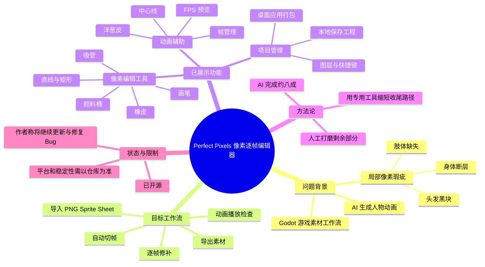
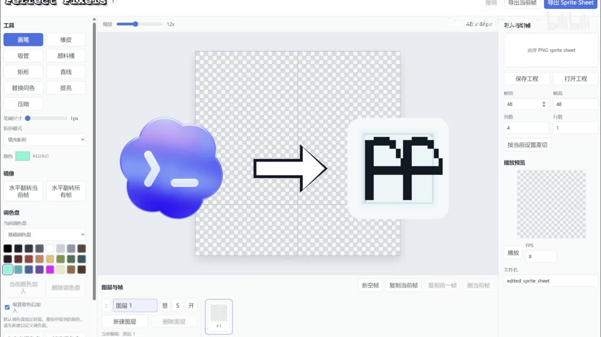
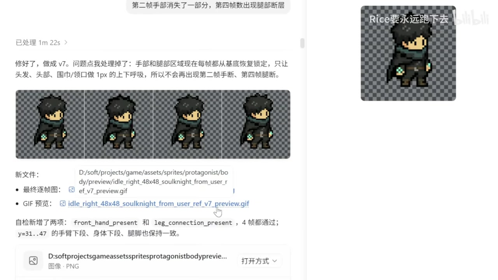
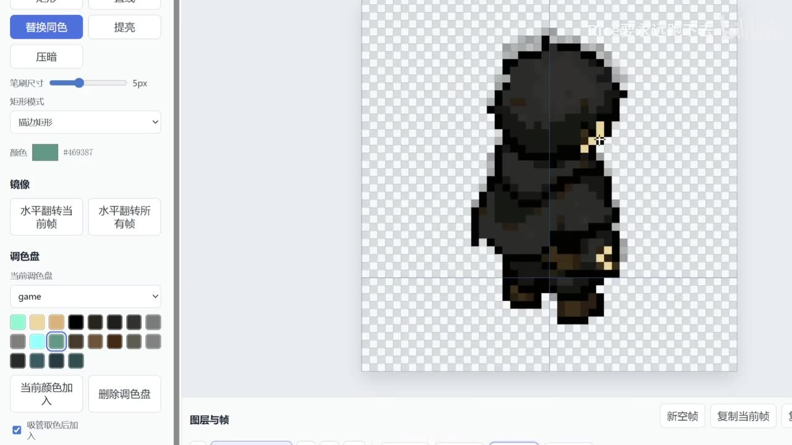
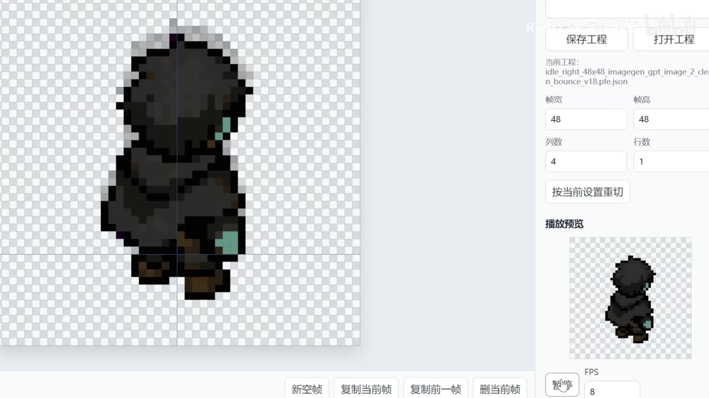

# 因为 AI 像素图总有瑕疵，我同codex做了一个像素逐帧编辑器

> 来源：[Bilibili 视频](https://www.bilibili.com/video/BV1gFGj6hE1j)  
> UP 主：Rice要永远跑下去｜时长：02:03｜合集：AIcode  
> 项目仓库：<https://github.com/Rice-run/perfect-pixels>（链接来自视频简介）

## 小结

视频展示了 UP 主使用 Codex 进行 Vibe Coding 后完成的一款像素动画编辑软件。项目的直接动机是：将 AI 生成的人物动画素材用于 Godot 游戏开发时，素材常会出现局部断层、头发黑块、肢体缺失等细小但会破坏动画可用性的瑕疵。

作者并非要以该工具替代通用绘图软件，而是围绕精灵图（Sprite Sheet）修补工作流，制作一个更聚焦的工具：导入逐帧图或 PNG Sprite Sheet、按设定切帧、逐帧查看与修改像素、播放预览动画，以及导出结果。其核心价值是缩短“AI 生成后人工收尾”的路径。

视频中可确认的功能包括：画笔、橡皮、吸管、颜料桶、矩形、直线、替换同色、提亮、压暗、调色盘、洋葱皮、中心线、图层、快捷键、本地工程保存、帧复制/删除与播放预览。画面还显示，当前演示精灵图按单帧 `48×48` 像素、`4` 列、`1` 行切分，并使用 `8 FPS` 预览；这些是演示项目参数，不应泛化为软件固定限制。

作者将项目从网页打包为桌面应用，并已开源。视频简介称后续“应该会继续更新项目和修复 bug”，因此功能完整度、可安装方式、兼容平台、导入导出格式与实际稳定性仍应以仓库当前文档和发布版本为准。

这份内容尤其适合使用 AI 批量生成像素角色素材、制作 Godot 像素游戏、需要逐帧修复 Sprite Sheet 的开发者参考。视频给出的经验是：AI 可以承担大部分生成工作，但最终动画质量仍依赖人工在逐帧预览中处理局部一致性。

## 思维导图




## 目录

- [工具概览：像素动画编辑与基础界面](#工具概览像素动画编辑与基础界面)
- [问题背景：AI 动画素材的逐帧瑕疵](#问题背景ai-动画素材的逐帧瑕疵)
- [目标工作流：从 Sprite Sheet 到动画检查](#目标工作流从-sprite-sheet-到动画检查)
- [功能演进：从切片导出到动画编辑基础能力](#功能演进从切片导出到动画编辑基础能力)
- [实操整理：修补 AI 像素动画的流程](#实操整理修补-ai-像素动画的流程)
- [参数、限制与时效性](#参数限制与时效性)
- [字幕比对](#字幕比对)
- [评论分析](#评论分析)
- [处理记录](#处理记录)

## [工具概览：像素动画编辑与基础界面](https://www.bilibili.com/video/BV1gFGj6hE1j?t=0)

视频开头说明，这是作者花费“几个小时”通过 **Codex Vibe Coding** 做出的像素动画编辑软件。根据站内字幕，软件具备三个基础方向：

1. **导入逐帧图**：用于加载动画帧或精灵图素材。
2. **编辑每一帧像素**：面向 AI 素材中少量错误像素的定点修补。
3. **提供基础工具栏和调色板**：使修改不必频繁切换到通用绘图软件。



> 图：该帧清晰呈现工具的整体布局。左侧可见画笔、橡皮、吸管、颜料桶、矩形、直线、替换同色、提亮、压暗等操作；右侧可见导入 PNG Sprite Sheet、保存/打开工程、帧尺寸与行列数、播放预览、FPS 和导出 Sprite Sheet 等区域，因此能直观说明软件围绕“切帧—修补—预览—导出”组织。

从画面可读到的演示界面信息包括：

| 区域 | 画面展示内容 | 用途 |
| --- | --- | --- |
| 左侧工具栏 | 画笔、橡皮、吸管、颜料桶、矩形、直线、替换同色、提亮、压暗 | 对局部像素执行绘制、取色、填充、几何绘制与颜色调整 |
| 左侧调色区 | 当前调色盘、色块、当前颜色 | 管理并选择绘制颜色 |
| 中央画布 | 棋盘格透明背景与放大的像素对象 | 在像素网格级别观察、修改角色图像 |
| 底部区域 | 图层与帧、新空帧、复制当前帧、复制前一帧、删除帧 | 管理动画帧和图层 |
| 右侧设置 | 帧宽、帧高、列数、行数、“按当前设置重切” | 按 Sprite Sheet 网格设置切分动画帧 |
| 右侧预览 | 播放按钮、FPS、文件名 | 连续播放并检查动画效果 |
| 顶部操作 | 撤销、导出当前帧、导出 Sprite Sheet | 回退编辑或导出成品 |

## [问题背景：AI 动画素材的逐帧瑕疵](https://www.bilibili.com/video/BV1gFGj6hE1j?t=13)

作者原本希望将 Codex 纳入 Godot 工作流，让其生成人物动画素材，并预期由此显著提升效率。但实际素材在逐帧层面出现了无法直接投入游戏的错误：

- **身体断层**：角色中间直接缺失了一块；
- **头发黑块**：头发区域出现不符合设计的黑色块；
- **“阿飘”式异常**：作者以口语形容第三个示例的异常观感；
- **细小瑕疵反复出现**：单看可能很小，但在动画连续播放时会更加明显。



> 图：该帧展示了作者针对角色动画逐帧质量进行检查、修复后的结果。页面文字提到第二帧手部部分消失、第四帧腿部断层；下方显示四帧角色图。它的价值在于说明问题不是“整张图完全不可用”，而是要处理跨帧的局部一致性。

作者的困扰不在于没有可编辑的工具，而在于通用绘图软件对于“只改几个像素、同时保证四帧或多帧动画连贯”的任务不够贴合。于是问题被重新定义为一个专用工作流需求：

> 将 AI 生成的 Sprite Sheet 导入工具，按帧检查；发现问题后在对应帧修补少量像素；再立即播放确认连续动画是否正常。

这里的关键判断是：AI 生成的静态图质量并不等于动画资产质量。对于动画角色，除了单帧造型，还需要检查人物轮廓、肢体连接、遮挡关系和位移变化在相邻帧之间是否连贯。

## [目标工作流：从 Sprite Sheet 到动画检查](https://www.bilibili.com/video/BV1gFGj6hE1j?t=56)

作者明确列出了希望工具完成的最小闭环：

1. **导入 Sprite Sheet**；
2. **自动切帧**；
3. **一帧一帧查看**；
4. **直接修改几个像素点**；
5. **播放动画进行检查**。



> 图：该帧展示角色被放大后的像素级编辑状态，画面中央有一条垂直中心线，左侧显示替换同色工具、笔刷尺寸和调色盘。这证明工具不仅处理整张图，还服务于局部像素与构图对齐检查。



> 图：该帧右侧显示保存工程、当前工程文件名、帧宽 `48`、帧高 `48`、列数 `4`、行数 `1`、按当前设置重切、播放预览及 `FPS 8`。其价值在于补足了字幕中“自动切帧、播放检查”的具体界面证据。

### 演示参数：仅代表视频中的项目设置

| 参数 | 画面中的值 | 含义 | 注意事项 |
| --- | ---: | --- | --- |
| 单帧宽度 | 48 | 每帧宽度为 48 像素 | 仅为当前素材设置 |
| 单帧高度 | 48 | 每帧高度为 48 像素 | 仅为当前素材设置 |
| 列数 | 4 | Sprite Sheet 横向包含 4 列帧 | 结合行数推断演示素材共 4 帧 |
| 行数 | 1 | Sprite Sheet 纵向包含 1 行帧 | 不代表工具只支持单行 |
| FPS | 8 | 预览播放速率 | 视频未说明可设置范围或默认值 |
| 缩放 | 12x（另一画面可见） | 方便观察单像素细节 | 不代表导出分辨率 |

从参数关系看，演示资产被按 `4 × 1` 的网格划分为 4 个 `48×48` 帧。该设定适合小型角色待机动画，但视频没有说明对不规则尺寸、帧间留白、间距（spacing）、边距（margin）或非网格 Sprite Sheet 的处理规则，不能据此推定工具支持这些情况。

## [功能演进：从切片导出到动画编辑基础能力](https://www.bilibili.com/video/BV1gFGj6hE1j?t=67)

作者说明，项目最初只有以下基本功能：

- 导入逐帧图；
- 切片；
- 修改；
- 导出。

由于开发过程有趣，作者继续增加功能，形成视频所称的“像素动画编辑基础功能”。按站内字幕与画面，可归纳为以下层级。

### 1. 绘制与颜色处理

视频画面中显示的工具包括：

- 画笔；
- 橡皮；
- 吸管；
- 颜料桶；
- 矩形；
- 直线；
- 替换同色；
- 提亮；
- 压暗；
- 可选调色盘与颜色色块。

这些工具对应的实际用途可概括为：

- 用画笔直接补齐断层或缺失边缘；
- 用吸管从相邻正确像素取色，以减少修补色差；
- 用替换同色批量替换某一种错误颜色；
- 用提亮、压暗修正阴影或高光层次；
- 用直线和矩形辅助处理规则边界。

但视频没有展示每项工具的快捷键、算法逻辑、容差配置、填充连通规则或调色盘文件格式，因此不应将这些界面名称延伸解读为完整的专业像素绘制能力。

### 2. 逐帧与动画辅助

作者提到并在界面中展示：

- **洋葱皮**：用于观察前后帧的残影或参考；
- **中心线**：用于检查角色是否相对中轴发生不期望的偏移；
- **帧操作**：新空帧、复制当前帧、复制前一帧、删除帧；
- **播放预览与 FPS**：在时间连续性中检查修补结果。

对 AI 生成动画而言，洋葱皮和播放预览尤其重要。原因是某些错误并不明显存在于单帧内，例如手臂只在某一帧突然消失、双腿在其中一帧断开、头部位置跳动。通过逐帧对比和连续播放，才更容易识别这种时序问题。

### 3. 图层、项目与发布形态

后续加入的能力包括：

- 图层；
- 快捷键；
- 本地保存工程；
- 从网页打包为桌面应用。

视频中右侧出现“保存工程”“打开工程”，说明作者将编辑状态以工程形式进行本地持久化；但视频未公开工程文件的格式规范、自动保存策略、跨版本兼容性和导入导出范围。

作者称使用 “tower i” 将项目从网页打包为桌面应用。站内字幕与 ASR 对该名称识别均不稳定，无法仅据现有材料可靠确定其准确产品或技术名称，因此本记录不将其展开为具体打包框架。

## [实操整理：修补 AI 像素动画的流程](https://www.bilibili.com/video/BV1gFGj6hE1j?t=56)

以下流程依据视频所展示功能与作者提出的需求整理，不补充视频未说明的命令、格式参数或自动化能力。

### 步骤 1：准备待修复的动画精灵图

准备 AI 生成的角色动画素材。视频中的目标素材为人物待机动画样式的 Sprite Sheet；在导入前，至少需要知道：

- 单帧宽度和高度；
- 水平列数；
- 垂直行数；
- 预期的播放速度或目标帧率。

如果这些网格参数错误，切帧结果会错位，后续编辑与播放检查也失去意义。

### 步骤 2：导入 PNG Sprite Sheet 并设置切帧网格

在右侧导入区域选择 PNG Sprite Sheet，填写帧宽、帧高、列数、行数，再使用“按当前设置重切”。

视频演示中使用：

```text
帧宽：48
帧高：48
列数：4
行数：1
```

这一步产生可逐一编辑的帧。视频未说明是否支持导入 GIF、APNG、序列帧文件夹或其他图像格式，因此应仅确认 PNG Sprite Sheet 是画面明确展示的输入形式。

### 步骤 3：逐帧检查 AI 生成的局部错误

按帧检查时，应优先关注视频实际指出的异常类型：

- 角色身体是否有空洞、断层；
- 头发、衣物或轮廓中是否出现多余色块；
- 手、脚等肢体是否在某一帧缺失；
- 相邻帧的角色位置、轮廓和结构是否突变。

可结合中心线和洋葱皮判断角色是否在相邻帧发生不自然的偏移，或某些局部是否无法延续前后帧结构。

### 步骤 4：以局部像素编辑修补

针对瑕疵选用相应工具：

- 小范围补边、补洞：画笔；
- 删除多余黑块或错误轮廓：橡皮；
- 取得邻近正确区域颜色：吸管；
- 大面积统一替换异常颜色：替换同色或颜料桶；
- 调整明暗层次：提亮、压暗；
- 处理规则形状：直线、矩形。

视频的核心建议不是重新绘制完整角色，而是在 AI 已生成的大部分可用内容基础上，修复少量影响使用的像素。

### 步骤 5：播放预览，检查跨帧连续性

设定播放 FPS 后使用预览播放。演示画面为 `8 FPS`，但实际帧率应与项目动画设计匹配。

检查重点包括：

- 修复区域是否在播放时闪烁；
- 角色肢体是否仍有突然消失、断开；
- 各帧之间是否出现明显跳动；
- 修复后的颜色是否与邻帧一致；
- 待机、移动等动作循环是否自然。

### 步骤 6：保存工程并导出

编辑过程中可以保存本地工程，完成后可导出当前帧或导出 Sprite Sheet。视频没有说明导出文件命名规则、透明通道处理、像素缩放插值、元数据输出或 Godot 的直接导入配置；若用于实际游戏项目，仍需在引擎侧复核导入设置与播放效果。

## [参数、限制与时效性](https://www.bilibili.com/video/BV1gFGj6hE1j?t=91)

### 作者的结论

作者将 AI 生成素材的价值概括为：

> AI 能帮你生成 80%，但剩下的 20% 仍需要顺手的工具慢慢打磨。

这是视频中的经验性判断，不是经过量化测试得出的通用比例。其可迁移之处在于：生成式 AI 对像素动画资产的帮助不止于“是否生成图片”，还取决于后续是否有足够低摩擦的质检与修补机制。

### 已确认限制

| 项目 | 视频可确认的信息 | 未被视频证明的部分 |
| --- | --- | --- |
| 输入 | 界面明确显示“选择 PNG sprite sheet” | GIF、APNG、序列帧目录及其他格式支持情况 |
| 切帧 | 可设置帧宽、帧高、列数、行数，并按设置重切 | 间距、边距、非规则帧、自动识别分割线 |
| 编辑 | 有基础像素工具、图层、调色盘 | 选择工具、撤销历史上限、滤镜、批处理 |
| 预览 | 有播放预览和 FPS 输入框 | FPS 合法范围、循环模式、导出动画格式 |
| 项目 | 可保存和打开本地工程 | 工程格式、跨平台兼容、版本迁移 |
| 发布 | 已开源，简介给出 GitHub 仓库 | 当前 Release、安装包、支持系统、许可证、维护频率 |
| 稳定性 | 作者称后续应该继续更新与修复 Bug | Bug 清单、测试覆盖率、生产环境可靠性 |

### 时效性说明

- 视频元数据记录的发布时间为 **2026-05-24**（按 Unix 时间戳换算），素材抓取时间为 **2026-07-16**。
- 作者在简介中表示项目“后续应该会继续更新项目和修复 bug”，因此视频所见界面和能力是当时版本的快照。
- 仓库地址来自视频简介，但本素材没有提供仓库 README、提交记录、Release 页面或许可证内容；本记录不对当前可运行性、版本号及安装步骤作出未验证结论。
- 视频中提到 Codex、Godot 与桌面打包，但未给出所用模型版本、提示词、Godot 版本、运行环境或完整技术栈，无法复现同一开发过程。

## 字幕比对

| 字幕来源 | 完整性 | 专有名词 | 时间轴 | 主要问题 |
| --- | --- | --- | --- | --- |
| Bilibili 站内字幕 | 覆盖 00:00.040—02:00.130，内容与全片叙述连续对应 | 存在“kodak”“歌odd”“tower i”等识别/转写问题，但可由上下文校正部分词语 | 细分为大量短句，起止时间可直接使用 | 个别语句缺词或同音错字，如“最出息”“自动切间” |
| 本次 ASR（medium） | 诊断显示语音覆盖约 88.9 秒、覆盖率 72.31%，但实际被压缩为 5 个超长段 | Codex、Sprite Sheet、工具名称等误识别较多，如“Split Sheet”“切剑”“Towai” | 首段从 00:33.780 才开始，明显遗漏开头对应时间且文本与时段不匹配 | 时间分段严重失真；每段塞入大量连续内容，无法可靠用于章节定位 |

### 最终字幕选择

正文以 **Bilibili 站内字幕** 作为时间轴与内容主依据，因为它从 `00:00:00,040` 开始，分段细且完整覆盖视频主要旁白。本次 ASR 已按要求检查，但其首个语音段错误地从 `00:00:33,780` 开始，且文本密度与 0.62 秒的首段时长明显不匹配，不适合作为定位依据。

ASR 诊断中**没有** `noAudioStream=true` 标记，且提供了音频文件与语音识别结果，因此不能将本视频判定为无音轨。问题是本次 ASR 的时间分段和专有词识别质量不足，而非源视频无音频。

### 结合上下文与画面校正的重点词语

| 原始字幕/ASR 写法 | 本文采用写法 | 校正依据 |
| --- | --- | --- |
| kodak / Codex Vibe Coding | Codex Vibe Coding | 视频标题、简介、标签中均出现 `codex` |
| 歌odd / 到底的工作流程 | Godot 工作流 | 视频简介提及“godot开发的游戏素材”，标签含 `godot` |
| 自动切间 / 自动切剑 | 自动切帧 | 站内字幕上下文与界面“帧宽、帧高、列数、行数、重切”相互印证 |
| Split Sheet | Sprite Sheet | 站内字幕、界面按钮“导出 Sprite Sheet”与行业术语一致 |
| 编织每一帧的像素 | 编辑每一帧的像素 | 站内字幕原句语义、视频标题及画面中的编辑器功能 |
| Towai / tower i | 不确定的桌面打包工具名称 | 两份字幕均未稳定识别；视频未展示明确产品标识，故不强行补全 |

## 评论分析

当前素材仅获取到 **2 条热评**，少于要求的“热评前三条”；以下只分析可获取内容，不虚构第三条评论。

### 1. 西米屋花火（34 赞）

> “猜你在找：aseprite”

评论将视频中的工具需求指向 **Aseprite**，隐含观点是：市场上已有成熟的像素绘制与动画编辑软件可用于类似任务。

- **补充价值**：为需要成熟编辑器的观众提供了一个检索方向。
- **与视频的关系**：作者的重点并非声称不存在同类软件，而是为自己的 AI Sprite Sheet 修补流程制作更贴合的工具。
- **可信度边界**：该评论未比较 Aseprite 与本项目在自动切帧、项目保存、导出、价格、平台或 AI 工作流适配方面的具体差异，不能仅凭一句评论断言二者功能等价或谁更适合。

### 2. HWcode（6 赞）

> “问下up主，AI生成素材用的是什么大模型啊，就是GPT的Images 2吗”

该评论关注 AI 素材的来源模型，并推测可能是 “GPT 的 Images 2”。

- **补充价值**：指出复现工作流时，生成模型是重要变量；不同模型在像素一致性、动画跨帧稳定性上可能产生不同结果。
- **视频中可确认的内容**：作者提到了 Codex 用于开发软件，也提到了 AI 生成像素素材。
- **不可确认的内容**：素材中没有作者对该评论的回复，也没有公开用于生成角色素材的确切图像模型。因此 “GPT 的 Images 2” 仅是评论者提问与猜测，不能作为事实写入项目技术栈。

## 处理记录

- **Worker ID**：`worker-mrj0www4-e8d79408`
- **模型**：`gpt-5.6-terra`
- **使用素材与工具产物**：视频元数据、站内字幕 `p01-ai-zh.srt`、本次 ASR 结果 `asr/asr-result.json` 与 `asr/transcript.srt`、关键帧目录 `frames/`、热评数据 `comments/comments.json`。
- **字幕选择**：检查站内字幕与本次 ASR 后，以站内 SRT 为正文时间轴主来源；ASR 仅用于交叉检查语音存在性、语言与识别覆盖情况。原因是 ASR 的首段延迟至 33.78 秒且时间切分失真。
- **关键帧选择依据**：选用 `frame-001` 说明整体工作台与切帧/导出功能；选用 `frame-002` 说明像素级编辑、中心线和调色盘；选用 `frame-003` 说明 `48×48`、`4×1`、`8 FPS` 等演示参数及预览；选用 `frame-004` 说明 AI 动画素材的跨帧缺失问题和修复结果。所有图片均使用相对路径。
- **评论处理范围**：素材可获取热评仅 2 条，已全部分析；未伪造缺失的第 3 条。
- **缓存清理**：提供的素材中没有缓存清理执行日志或结果，无法确认是否已清理；本记录不将其写为已完成。
- **未解决问题**：桌面打包工具名称转写不可靠；未提供仓库文档、版本号、许可证、安装说明、支持系统、导入导出格式详情和 Bug 列表，均需以 GitHub 仓库实时信息为准。
