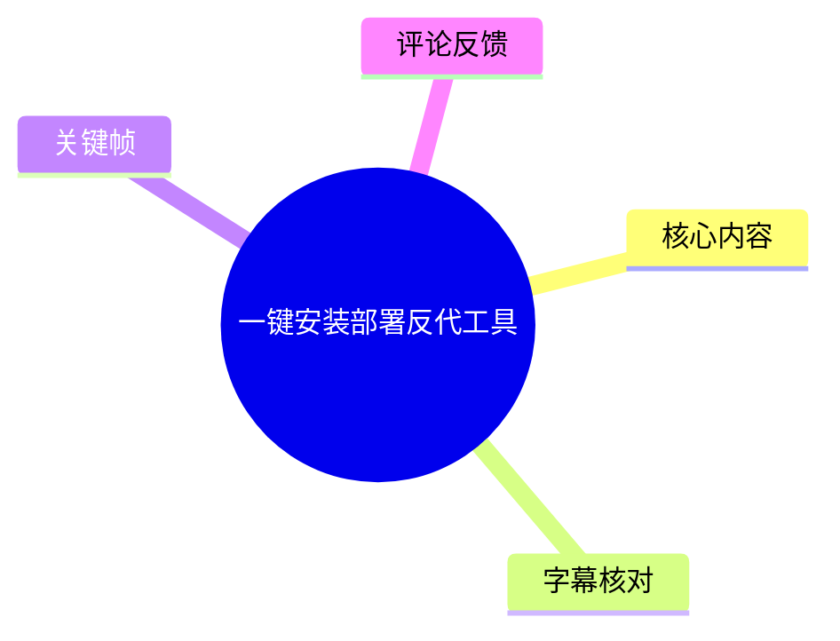
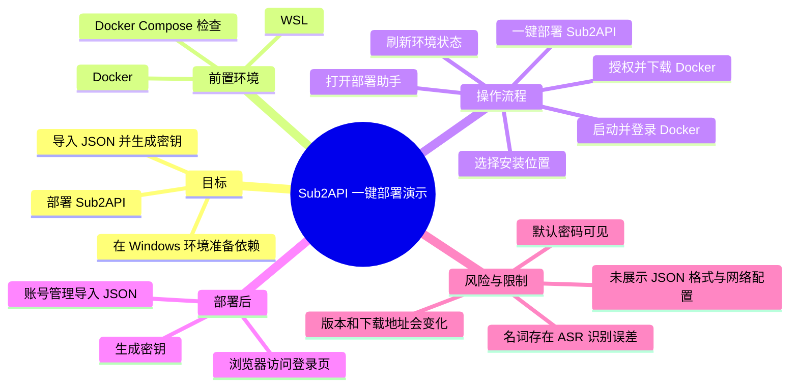
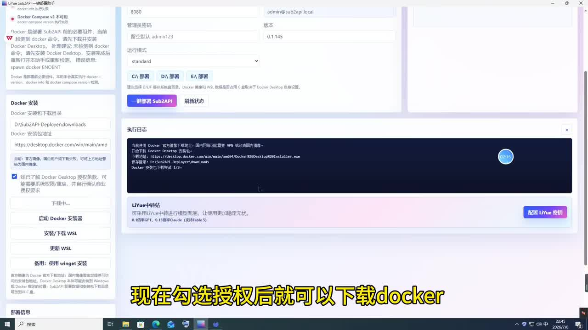
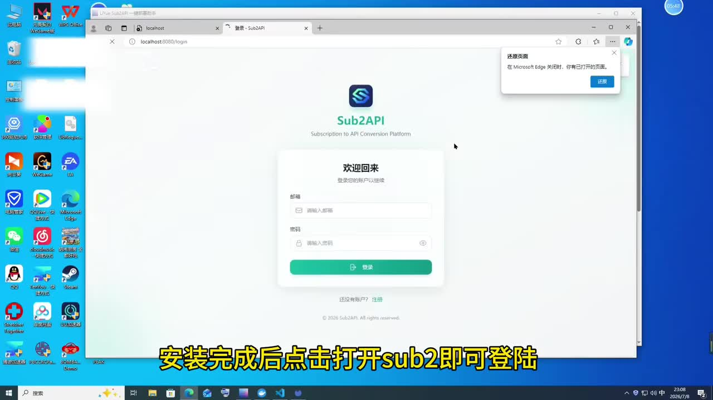

# 一键安装部署反代工具

> 来源：[Bilibili 视频](https://www.bilibili.com/video/BV1wGNc6QEnT)<br>
> UP 主：LiYue聚合｜合集：AIcode｜视频时长：01:04｜分辨率：1920×1080<br>
> 发布时间：2026-07-11（按元数据 Unix 时间戳换算；时区未在素材中明确）｜标签：系统、安装、教程、openai codex

## 小结

这是一段面向 Windows 桌面环境的快速部署演示。视频使用名为 **“LiYue Sub2API 一键部署助手”** 的图形化工具，目标是安装 Docker、准备 WSL 环境，并进一步一键部署 **Sub2API**。标题称其为“反代工具”，但视频画面和语音实际重点是部署流程，而非解释反向代理原理、路由规则或网络拓扑。

视频给出的主流程是：打开部署软件，检查并安装 Docker 与 WSL；勾选授权选项后下载 Docker；可选择安装位置，下载完成后启动并登录 Docker；回到部署工具刷新环境状态；当环境项均显示绿色后，执行 Sub2API 安装；安装完成后打开浏览器登录 Sub2API；最后在账号管理中导入 JSON 格式内容，并生成密钥供后续工具使用。

关键可见信息表明，该部署助手会检查 Docker Compose、Docker Desktop / Docker 版本及 WSL 等依赖。第一张关键帧中明确出现了 Docker 下载目录、Docker 安装包地址、授权复选框，以及“安装/下载 WSL”“更新 WSL”等操作入口；同时，日志区域展示了下载和校验类执行记录。工具界面还显示默认管理密码字段为 `admin123`，这意味着部署后应优先修改初始凭据，而不宜直接长期使用默认值。

视频没有给出 Docker、WSL、Sub2API 的官方项目地址、完整版本兼容矩阵、实际镜像名称、端口暴露规则、JSON 文件格式或“生成密钥”后接入目标的准确产品名称。因此，它适合作为操作顺序参考，**不应被视为可复现的完整运维文档**。所有涉及账户、授权、密钥和第三方 API 的操作，也应确认符合相应服务的使用条款与安全要求。

素材抓取时间为 2026-07-13。Docker Desktop、WSL、部署助手和 Sub2API 的下载地址、界面字段、依赖检测逻辑都可能随版本变化；视频中的按钮名称、默认配置和地址仅代表录制时画面，使用前须以软件当前版本及官方文档为准。

## 思维导图





## 目录

- [视频定位、环境与时效性](#视频定位环境与时效性)
- [Docker 与 WSL 的准备](#docker-与-wsl-的准备)
- [环境检查与 Sub2API 部署](#环境检查与-sub2api-部署)
- [登录、JSON 导入与密钥生成](#登录json-导入与密钥生成)
- [可复用操作清单](#可复用操作清单)
- [参数、限制与安全注意事项](#参数限制与安全注意事项)
- [字幕比对](#字幕比对)
- [评论分析](#评论分析)
- [处理记录](#处理记录)

## 视频定位、环境与时效性 [00:00](https://www.bilibili.com/video/BV1wGNc6QEnT?t=0)

视频标题为“一键安装部署反代工具”，UP 主通过 Windows 桌面录屏展示图形化部署。根据画面，实际使用的软件标题为 **“LiYue Sub2API 一键部署助手”**；最终打开的 Web 页面显示 **Sub2API** 标识及英文副标题“Subscription to API Conversion Platform”。

视频的核心不是手动输入 Docker 命令，而是通过部署助手把依赖安装、状态检测和 Sub2API 安装集中在一个界面中完成。对没有 Docker / WSL 基础、但希望按图形化步骤尝试部署的用户而言，视频提供了顺序参考。

需要区分以下内容：

- **视频明确展示**：Docker、WSL、Docker Compose 检查、Sub2API 安装、浏览器登录页、账号管理导入 JSON、生成密钥。
- **标题或语音提及但未充分展开**：反代工具的具体工作机制、反代域名、TLS/HTTPS、端口转发、外网暴露与安全策略。
- **无法由本素材验证**：Sub2API 的项目来源、镜像来源、许可证、Docker 安装包的真实性与完整性、JSON 的字段结构，以及“密钥”接入的具体客户端/服务。

## Docker 与 WSL 的准备 [00:05](https://www.bilibili.com/video/BV1wGNc6QEnT?t=5)

ASR 内容显示，讲解先要求安装 Docker 容器环境和 WSL；安装成功后，工具会给出提示。随后用户勾选授权，下载 Docker，并可指定安装位置。

从关键帧可见，部署助手左侧包含依赖状态与 Docker 安装区域：

- Docker Compose v2 状态显示为不可用；
- 工具提示 Docker 是部署 Sub2API 的必要组件；
- 有 Docker 安装包下载目录输入框；
- 有 Docker 安装包地址输入框；
- 有“我已了解 Docker Desktop 授权条款，可继续安装系统所需组件，并自行确认商业授权要求”的复选框；
- 有“启动 Docker 安装器”“安装/下载 WSL”“更新 WSL”等按钮；
- 主区域提供 `C:\ 部署`、`D:\ 部署`、`E:\ 部署` 等部署位置选项；
- 界面中的“Docker 下载目录”显示为 `D:\Sub2API-Deploy\downloads`。



> 图：该帧展示了“LiYue Sub2API 一键部署助手”的 Docker 安装区、下载路径、授权复选框、WSL 操作按钮和运行日志。它直接支持了视频“勾选授权后下载 Docker、可指定安装位置”的叙述，也提醒用户 Docker Desktop 的授权与安装目录是实际部署中的关键变量。

### 视频中的依赖准备顺序

1. 打开部署软件。
2. 检查 Docker 与 WSL 的可用性。
3. 若尚未满足条件，按界面入口安装或下载 WSL。
4. 勾选 Docker Desktop 授权条款确认。
5. 选择或确认 Docker 下载/部署位置。
6. 下载 Docker 安装包。
7. 下载结束后点击启动 Docker 安装器。
8. 完成 Docker 安装并登录 Docker。

### 画面可见的安装信息与解释

| 项目 | 画面/ASR 中的信息 | 使用时应注意 |
| --- | --- | --- |
| Docker | 需要下载、安装并启动 | 视频未展示 Docker Desktop 的完整安装向导，也未说明是否需要重启。 |
| Docker Compose | 界面提示 v2 不可用 | Docker Compose 是容器编排常见依赖；若状态异常，后续部署可能无法执行。 |
| WSL | 有安装/下载与更新入口 | 视频没有说明具体 WSL 发行版、WSL 版本或虚拟化要求。 |
| 安装位置 | 可选择 `C:\`、`D:\`、`E:\` 部署 | 应确保目标磁盘有足够空间、路径可写且安全软件不会阻断。 |
| Docker Desktop 授权 | 须勾选确认后继续 | 授权范围需由用户自行阅读并确认；视频不能替代许可证判断。 |

## 环境检查与 Sub2API 部署 [00:30](https://www.bilibili.com/video/BV1wGNc6QEnT?t=30)

Docker 登录完成后，视频回到部署助手并执行刷新。讲解给出的判断条件是：**“只要所有的环境都是绿色后，就可以开始安装 Sub2。”**

这里的“Sub2”应结合画面理解为 **Sub2API**：工具标题与后续登录页面均使用 Sub2API 名称。不过，ASR 仅转写为“Sub2”，未提供更完整的发音或拼写证据，因此本文保留“视频口述 Sub2、画面产品名 Sub2API”的区分。

部署工具主区域可见“**一键部署 Sub2API**”按钮。画面还显示运行日志，表明软件会执行下载、校验等自动化步骤；但素材没有提供完整日志文本、执行命令、镜像标签、容器名、卷挂载目录、环境变量或失败时的修复路径。

### 可从视频复现的操作节点

1. 返回 LiYue Sub2API 一键部署助手。
2. 点击“刷新状态”或同义按钮，重新检测 Docker、WSL、Docker Compose 等环境。
3. 确认工具中的环境项均为绿色。
4. 点击“一键部署 Sub2API”。
5. 等待安装流程完成。
6. 点击“打开 Sub2API”进入网页端。

### 不能从视频推出的技术细节

以下项目对生产部署很重要，但视频未展示，不能补造：

- Sub2API 监听的宿主机端口、容器端口和是否允许局域网/公网访问；
- Docker 镜像仓库、镜像版本、拉取策略和供应链校验方法；
- 数据目录、数据库类型、备份方式及升级/回滚方法；
- 是否需要域名、Nginx/Caddy 等反向代理、TLS 证书；
- “所有环境都是绿色”的具体检查项及每一项的合格版本；
- 安装失败时查看日志、修复依赖或清理残留容器的方式。

因此，视频中“绿色即可安装”应理解为该工具自身的前置检查结果，而不是对网络、安全、授权或生产可用性的全面保证。

## 登录、JSON 导入与密钥生成 [00:47](https://www.bilibili.com/video/BV1wGNc6QEnT?t=47)

安装完成后，视频打开浏览器中的 Sub2API 登录页。浏览器地址栏可见：

```text
localhost:8080/login
```

这说明录制环境中的服务至少可通过本机回环地址 `localhost` 的 `8080` 端口访问。该地址只反映视频演示环境，不能据此断言所有安装实例均固定使用 8080 端口。



> 图：该帧清楚展示了 Sub2API 的登录界面和地址栏中的 `localhost:8080/login`。它证明视频已进入本地 Web 服务的登录环节，并为“安装完成后点击打开即可登录”的流程提供可见依据；同时也表明视频没有展示公网域名或 HTTPS 访问。

第一张关键帧的部署配置区域还能看到：

| 字段 | 可见值/状态 | 风险或含义 |
| --- | --- | --- |
| 管理员账号 | `admin@sub2api.local` | 这是画面中出现的管理员账号字段，是否固定由实际版本决定。 |
| 管理员密码 | 留空时默认 `admin123` | 默认密码不应继续用于正式或联网环境。 |
| 版本 | `0.1.145` | 仅为录制画面中该工具/配置的可见版本信息，不能视为当前最新版。 |
| 运行模式 | `standard` | 视频未解释该模式与其他模式的区别。 |
| Web 访问地址 | `localhost:8080/login` | 仅证明演示环境本机访问；不代表公网配置已完成。 |

随后，ASR 说明的后续业务操作为：

1. 点击“账号管理”。
2. 点击“更多操作”。
3. 执行“导入”。
4. 导入 JSON 格式内容。
5. 生成密钥。
6. 将密钥配置到后续工具中开始使用。

ASR 最后把目标工具转写为“`CCCCWitch`”，该名称无法从提供的关键帧中确认，且不宜擅自校正为某个具体产品。更稳妥的理解是：视频声称生成的密钥需要被填入一个后续客户端或管理工具，但该工具的准确名称、配置位置、协议和字段均未展示。

### JSON 导入与密钥使用的边界

- 视频只说“导入 JSON 格式”，**没有展示 JSON 示例或字段约束**。
- 不应把任意来源不明的 JSON、账号令牌或 API 凭据直接导入。
- 导入前应确认数据来源、字段含义、是否包含敏感令牌，以及是否具备撤销和轮换机制。
- 生成密钥后，应避免将密钥写入公开截图、仓库、日志或聊天记录。
- 如服务可能被局域网或公网访问，至少应修改默认管理员密码，并评估访问控制、HTTPS、备份和日志脱敏。

## 可复用操作清单 [00:00](https://www.bilibili.com/video/BV1wGNc6QEnT?t=0)

以下清单按视频顺序整理，仅保留素材已出现的动作；未出现的命令和配置不补写。

### 阶段一：准备宿主环境

- [ ] 在 Windows 上打开 LiYue Sub2API 一键部署助手。
- [ ] 检查 Docker、Docker Compose 与 WSL 的状态。
- [ ] 如 WSL 未就绪，使用工具中的“安装/下载 WSL”或“更新 WSL”入口。
- [ ] 阅读并确认 Docker Desktop 相关授权条款。
- [ ] 选择部署盘或下载路径，例如画面中的 `C:\`、`D:\`、`E:\` 选项。
- [ ] 下载 Docker 安装包。
- [ ] 启动 Docker 安装器。
- [ ] 安装完成后启动并登录 Docker。

### 阶段二：检查并安装 Sub2API

- [ ] 返回部署助手。
- [ ] 刷新环境状态。
- [ ] 确认工具要求的环境状态全部显示绿色。
- [ ] 点击“一键部署 Sub2API”。
- [ ] 等待工具完成部署。
- [ ] 点击“打开 Sub2API”。

### 阶段三：首次访问与业务配置

- [ ] 在浏览器打开本地 Sub2API 登录页；视频示例为 `localhost:8080/login`。
- [ ] 使用实际部署配置的管理员账号登录。
- [ ] 若使用默认密码，登录后立即修改；画面提示的默认值为 `admin123`。
- [ ] 进入账号管理。
- [ ] 通过“更多操作”中的导入功能导入符合要求的 JSON 数据。
- [ ] 按系统功能生成密钥。
- [ ] 仅在已确认的目标工具中配置该密钥，并避免泄露。

## 参数、限制与安全注意事项 [00:22](https://www.bilibili.com/video/BV1wGNc6QEnT?t=22)

### 视频中实际可见的参数

| 参数/标识 | 值或表现 | 证据来源 |
| --- | --- | --- |
| 部署工具名称 | LiYue Sub2API 一键部署助手 | 关键帧界面标题 |
| Docker 下载目录 | `D:\Sub2API-Deploy\downloads` | 第一张关键帧 |
| Docker 安装包地址 | `https://desktop.docker.com/win/main/amd...`，画面未完整呈现 | 第一张关键帧 |
| 可选部署盘 | `C:\ 部署`、`D:\ 部署`、`E:\ 部署` | 第一张关键帧 |
| 管理员账号 | `admin@sub2api.local` | 第一张关键帧 |
| 默认管理员密码 | `admin123` | 第一张关键帧 |
| 可见版本 | `0.1.145` | 第一张关键帧 |
| 运行模式 | `standard` | 第一张关键帧 |
| 演示登录地址 | `localhost:8080/login` | 第二张关键帧 |

### 重要限制

1. **视频时长仅 64 秒**：它展示了成功路径，没有覆盖安装失败、权限不足、网络失败、WSL 不兼容或 Docker 无法启动等情况。
2. **缺少命令与部署文件**：没有展示 `docker compose` 文件、命令行输出、镜像标签及环境变量，因此不能离线复现或独立审计部署逻辑。
3. **反代能力未被具体演示**：标题出现“反代”，但未展示域名、上游服务、反向代理配置、HTTPS 证书或公网访问。
4. **ASR 专有名词不稳定**：例如“DOKA”“WS”“SL”“Sybar”“CCCCWitch”存在识别偏差或音近转写，不能作为准确软件名或命令使用。
5. **默认密码风险**：画面明确提示默认密码 `admin123`；若该实例被其他人访问，默认凭据将显著增加未授权访问风险。
6. **授权与合规需自行确认**：视频要求勾选 Docker Desktop 授权条款，但未说明个人、教育、商业或组织场景下的适用细则。
7. **版本会变化**：画面版本、下载地址和按钮位置在抓取时间之后可能已变更，不能将其当作长期固定接口。

## 字幕比对 [00:00](https://www.bilibili.com/video/BV1wGNc6QEnT?t=0)

本次任务中，**站内字幕未提供可用内容**；同时，**本次 ASR 已执行**，并提供了覆盖主要讲解步骤的转写文本。

| 字幕来源 | 完整性 | 专有名词 | 时间轴 | 主要问题 |
| --- | --- | --- | --- | --- |
| Bilibili 站内字幕 | 无可用字幕，无法覆盖 | 无法评估 | 无 | 素材明确标注“未提供可用站内字幕”。 |
| 本次 ASR 字幕 | 覆盖 Docker/WSL 安装、环境变绿、Sub2API 安装、JSON 导入与密钥生成等主线 | 较多不确定项 | 未提供逐句时间戳 | 将 Docker 识别为“DOKA”，将 WSL 拆分/误识别为“WS”“SL”，将 Sub2API 简化为“Sub2”；末尾目标工具识别为“CCCCWitch”，无法确认。 |

### 最终字幕选择与校正原则

正文以**本次 ASR**为主要文字依据，并采用关键帧的可见 UI 文本进行有限校正：

- ASR 的“DOKA 容器”按画面与上下文标为 **Docker**，因为界面中清晰出现 Docker、Docker Desktop 和 Docker Compose。
- ASR 的“WS”“SL”合并表述为 **WSL**，因为界面存在“安装/下载 WSL”“更新 WSL”按钮。
- ASR 的“Sub2”在流程叙述中保留原意，但产品名称统一写作 **Sub2API**，依据是部署工具标题、部署按钮和登录页标识。
- ASR 的“Sybar”无法由关键帧验证，正文不把它当作独立软件名；结合上下文，仅表述为“安装完成后打开 Sub2API”。
- ASR 的“CCCCWitch”缺乏画面证据，不做强行纠错，仅记录为“名称未确认的后续工具”。

由于没有逐句时间码，章节时间轴是依据视频顺序对操作阶段的定位链接，而非精确字幕级时间标注。

## 评论分析 [00:00](https://www.bilibili.com/video/BV1wGNc6QEnT?t=0)

可获取热评数量为 **1 条**，少于要求的前三条；因此仅分析该条，不对缺失评论进行补造。

1. **用户“世界第二帅没人称第一”**（获赞 1）  
   - 评论内容：“打码的是个啥”。
   - 观点概括：评论者关注视频中被打码的信息，并希望了解其内容。
   - 可提供的补充信息：无。该评论没有说明被打码对象、用途或解决方案。
   - 可信度与边界：这是一项观看疑问，不能据此推断打码内容是账号、密钥、地址还是其他敏感信息。视频素材本身也未提供足够画面来恢复被打码信息，因此不应尝试猜测或还原。

## 评论分析

本次流程未获取到可用热评，因此不推断观众态度或额外结论。

## 处理记录

- Worker ID：`worker-mrj0wbly-5dc4e50c`
- 模型：`gpt-5.6-terra`
- 调用工具与素材：任务提供的 Bilibili 元数据、素材清单、ASR 字幕、关键帧 `frames/frame-001.jpg` 与 `frames/frame-002.jpg`、热评 JSON。
- 使用的应用工具：未提供独立工具调用日志；本整理基于已交付的素材输出进行文本与画面交叉核验。
- 字幕选择：站内字幕无可用内容；已执行并采用本次 ASR。对 Docker、WSL、Sub2API 等词依据关键帧 UI 进行校正；对无法核验的“CCCCWitch”等名称保留不确定性。
- 关键帧选择依据：
  - `frames/frame-001.jpg`：包含 Docker Compose 状态、Docker 下载路径、授权确认、WSL 安装入口、部署盘选择、默认管理员凭据提示与日志区域，适合说明依赖安装和安全风险。
  - `frames/frame-002.jpg`：包含 Sub2API 登录页与 `localhost:8080/login`，适合说明安装后的本地访问和登录阶段。
- 评论处理范围：按要求仅处理可获取热评前三条；实际仅获取 1 条。
- 缓存清理：素材清单只说明生成了合并视频、音频、帧、信息、评论、字幕与 ASR 输出，未提供缓存清理执行记录；因此无法确认是否已清理缓存。
- 未解决问题：
  - 未提供 Sub2API 的官方仓库、镜像、部署文件和版本说明；
  - 未展示 JSON 导入格式及密钥的准确接入目标；
  - 未展示反向代理、域名、HTTPS、公网访问与安全配置；
  - 未提供 ASR 的逐句时间戳；
  - 末尾 ASR 所识别的后续工具名称无法由画面确认。
