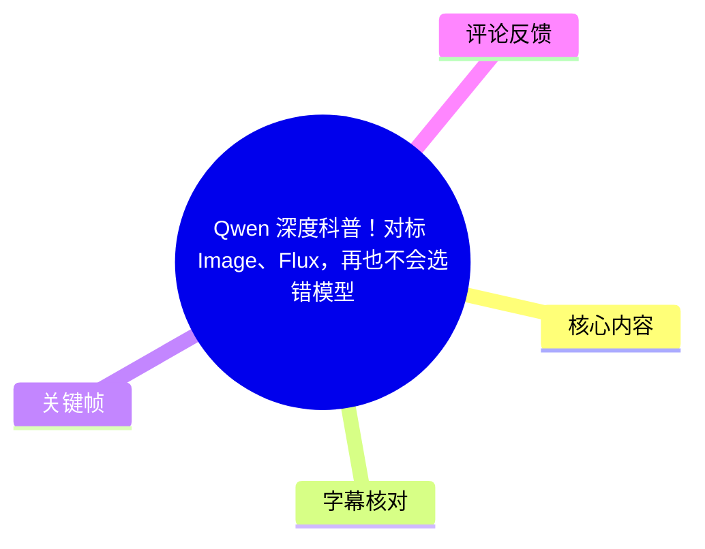
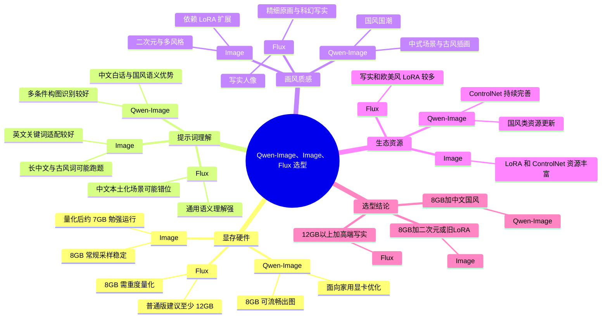
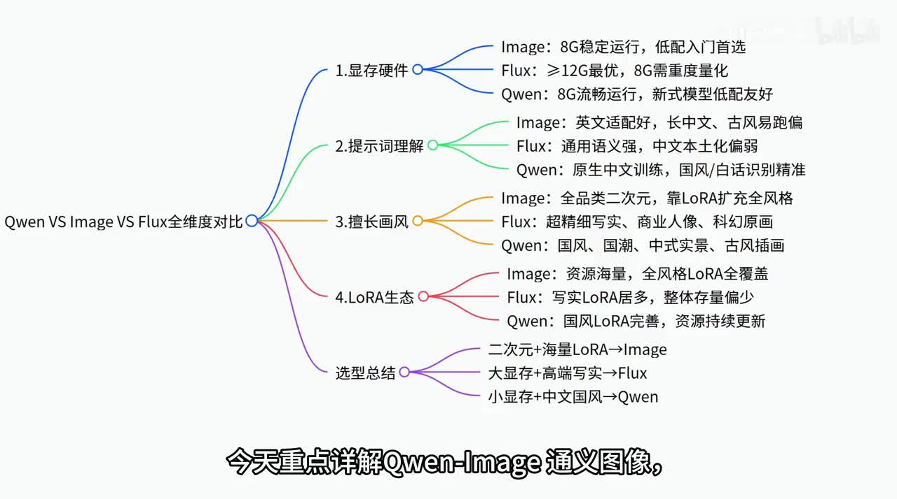
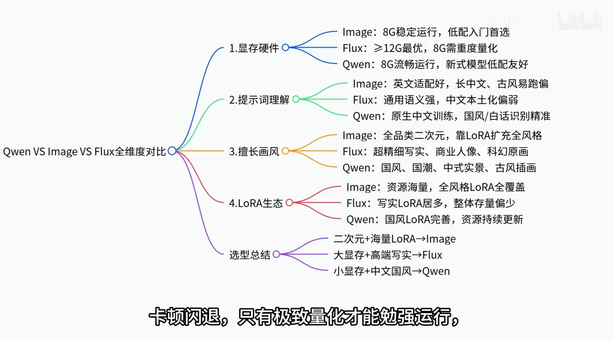
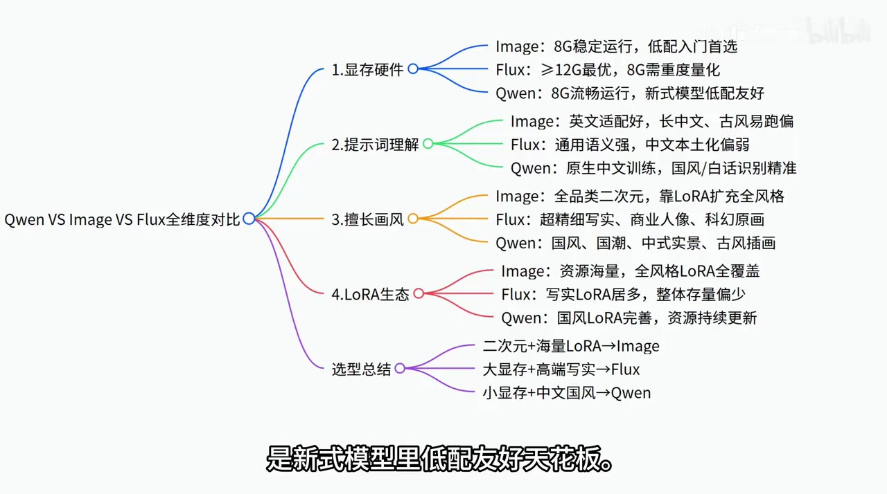
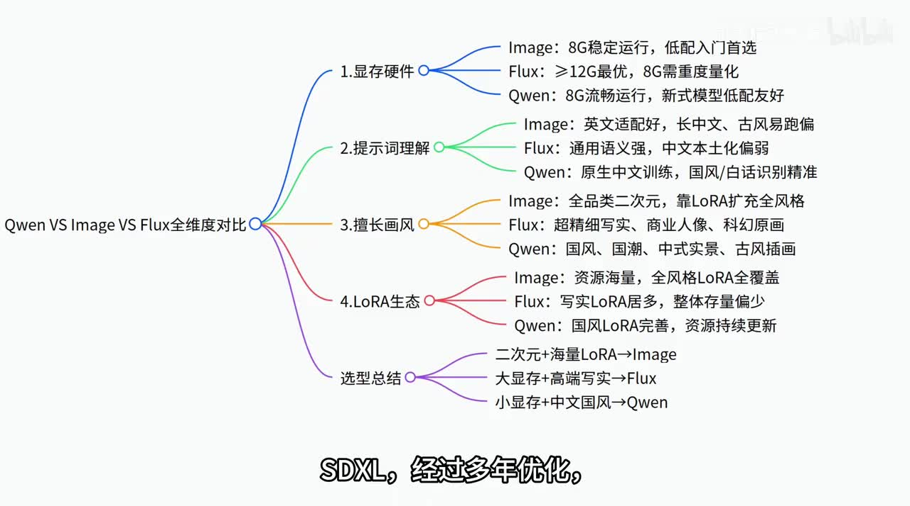

# Qwen 深度科普！对标 Image、Flux，再也不会选错模型

> 来源：[Bilibili 视频](https://www.bilibili.com/video/BV1hUVB6cEKq)  
> UP 主：丁丁喵不熬夜｜时长：4 分 08 秒｜合集：AIcode  
> 素材抓取时间：2026-07-16。视频将“Image”、Flux 与 Qwen-Image 作为三类本地图像生成模型/生态进行对比；其中“Image”是视频内使用的称呼，画面同时出现了“SDXL”字样，本文不擅自将两者完全等同。

## 小结

视频以「显存硬件、提示词理解、画面风格、LoRA 与配套生态」四个维度，对比 Qwen-Image、视频称作“Image”的模型以及 Flux，并给出按硬件和创作方向选型的简明路径。其核心结论不是模型绝对优劣，而是让显存配置、提示词语言、目标画风和既有资源库匹配。

在硬件层面，UP 主的经验性判断是：视频中的 Image 在常规采样时约 8GB 显存可稳定出图、量化后约 7GB 可勉强运行；Flux 普通版本建议至少 12GB，8GB 显存往往需重度/极致量化且可能伴随画面折损；Qwen-Image 则被定位为原生优化面向 8GB 家用显卡的新式模型。以上是视频给出的选型阈值，并非针对所有工作流、分辨率、采样器和模型版本的通用基准。

提示词与内容本土化是视频对 Qwen-Image 的重点肯定：其被描述为基于大量中文图文数据训练，适合中文白话、古风诗词、汉服、国风服饰、中式建筑等具体条件；Flux 被评价为通用语义理解强，但在中文本土素材、传统民俗与诗词等场景可能较弱；Image 则更适合英文关键词，复杂长中文描述可能出现细节丢失或跑题。

画风与生态方面，视频把 Image 归为成熟、LoRA 资源非常丰富且覆盖面广的路线，适合二次元和复用旧 LoRA；把 Flux 定位为写实商业人像、精细原画、科幻写实等原生画质上限更高的路线；把 Qwen-Image 定位为国风、国潮、中式实景、新中式插画、山水国画和古风人物等方向更有原生优势，但日系二次元仍需要配合专属 LoRA。

适合快速决策的读者包括：只有 8GB 显存且以二次元创作为主的用户、具有 12GB 以上显存并追求商业写实的用户，以及常写中文提示词、偏好国风或中式场景的用户。视频最终分别推荐 Image、Flux、Qwen-Image。

需要特别注意时效与限制：视频中关于显存、插件、LoRA 数量与模型能力的论断是 UP 主在发布时点的实践性总结，模型版本、量化方案、推理后端、显卡驱动、分辨率、ControlNet/LoRA 支持度都可能快速变化。视频没有提供统一的提示词、种子、分辨率、步数、显卡型号或客观对照样张，因此不能据此得出严格的性能或画质排名。

## 思维导图

## 目录

- [对比框架与适用问题](#对比框架与适用问题)
- [维度一：显存与硬件门槛](#维度一显存与硬件门槛)
- [维度二：提示词理解与中文本土化](#维度二提示词理解与中文本土化)
- [维度三：画面质感与擅长画风](#维度三画面质感与擅长画风)
- [维度四：LoRA、ControlNet 与资源生态](#维度四loracontrolnet-与资源生态)
- [落地选型步骤](#落地选型步骤)
- [结论、限制与时效性](#结论限制与时效性)
- [字幕比对](#字幕比对)
- [评论分析](#评论分析)
- [处理记录](#处理记录)

## [对比框架与适用问题](https://www.bilibili.com/video/BV1hUVB6cEKq?t=30)

视频有效语音从 **00:00:30.720** 开始。UP 主说明此前已讲解 Image 和 Flux，本期聚焦 Qwen-Image，并从硬件、提示词、画风、配套资源四方面横向比较，目标是明确各自优缺点与试用场景。

画面中的总览图把结论压缩为五组信息：

1. **显存硬件**：Image 8GB 稳定运行；Flux 以 12GB 以上为佳、8GB 需要重度量化；Qwen-Image 在 8GB 条件下可流畅运行。
2. **提示词理解**：Image 偏英文适配；Flux 通用语义强但中文本土化偏弱；Qwen-Image 强调中文训练及国风/白话理解。
3. **擅长画风**：Image 覆盖二次元等多种风格；Flux 主打超精细写实、商业人像与科幻原画；Qwen-Image 偏国风、国潮和中式题材。
4. **LoRA 生态**：Image 资源量最大；Flux 以写实类 LoRA 为主但总体较少；Qwen-Image 的国风 LoRA 与插件在持续补齐。
5. **最终选型**：二次元与大量 LoRA 使用者选 Image；大显存、高端写实需求选 Flux；小显存、中文国风需求选 Qwen-Image。

> 图：关键帧以思维导图形式完整呈现视频的四维比较与三条选型结论，是核对“视频原始分类框架”的核心画面证据。画面中明确使用了 “Qwen VS Image VS Flux” 的表述。

## [维度一：显存与硬件门槛](https://www.bilibili.com/video/BV1hUVB6cEKq?t=31)

### Image：成熟生态下的低门槛路线

UP 主称，视频中的 Image 经多年优化后，在**常规采样**条件下，8GB 显存能够稳定出图；量化后约 **7GB 显存**也可以“勉强运行”。因此，它被归为入门显卡可优先考虑的方案。

需要保留原视频中的限定词：这里的“稳定”对应常规采样，而“7GB”对应量化后的勉强运行。视频没有说明具体模型文件、量化位宽、图像分辨率、批量大小、VAE、采样器或生成速度，不能将这两个显存数字直接迁移到任意工作流。

### Flux：常规版本对显存更苛刻

视频将 Flux 称为新一代的大参数模型，并给出如下经验判断：

- 普通版本建议至少 **12GB 显存**；
- 在 8GB 显存上，若不量化，可能出现显存溢出、卡顿或闪退；
- 即便采用“极致量化”，也只是勉强运行，且 UP 主认为画面会有缩水。

> 图：该关键帧保留了字幕“卡顿闪退，只有极致量化才能勉强运行”，对应视频对于低显存部署 Flux 的风险提示。它的价值在于强调“能跑”不等于“适合日常生产”。

### Qwen-Image：视频定位为 8GB 新式模型的低配友好选择

UP 主认为 Qwen-Image 进行了显存深度优化，原生适配家用显卡；标准 8GB 显存笔记本或台式机可以完整、流畅出图。在相同画面规格下，视频称其显卡占用远低于 Flux、与 SDXL 基本持平，并将其评价为新式模型中低配友好的代表。

> 图：关键帧字幕直接写明 Qwen-Image“是新式模型里低配友好天花板”，并与上方三模型的显存结论同屏。该图适合用于理解视频的推荐逻辑，但“天花板”属于 UP 主的主观评价，不是统一基准测试结论。

## [维度二：提示词理解与中文本土化](https://www.bilibili.com/video/BV1hUVB6cEKq?t=55)

### Image：短中文可用，复杂中文条件可能损失

视频称 Image 的早期训练更偏英文数据，因此英文关键词输入天然适配。简短中文关键词可使用，但当提示词包含下列情况时，可能发生细节丢失与画面跑偏：

- 长句描述；
- 古风词汇；
- 中式专有名词；
- 多元素叠加的复杂条件。

UP 主列举的典型偏差是人物服饰、场景或道具与文字描述不一致。这并不意味着所有 Image 工作流都无法处理中文，而是视频把它归纳为相对于 Qwen-Image 的劣势场景。

### Flux：通用语义强，但中式语境存在适配风险

UP 主评价 Flux 的全局语义理解较强，适合多国通用描述；但因中文本土素材训练不足，面对汉服、中式古建筑、传统民俗、方言大白话和诗词时，可能产生语义错位，本土化细节表现也相对不足。

这里需要区分两层含义：视频肯定 Flux 的**一般多语言/多元素语义理解**，同时提出其在**特定中文文化语境**中的潜在短板；这不是对 Flux 所有中文生成任务的否定。

### Qwen-Image：以中文自然语言和国风内容为主要卖点

视频将 Qwen-Image 的核心优势概括为中文提示词理解。UP 主称其基于海量中文图文数据训练，可识别：

- 古风诗词描述；
- 国风服饰；
- 中式建筑；
- 日常白话口语；
- 复杂、多条件的构图要求。

其强调，即使不使用专业 AI 关键词，只以白话描述，也能较好还原画面；在三者中，Qwen-Image 被视频定位为中文适配最佳的一款。该结论对应特定模型版本及 UP 主使用体验，仍应以自己的提示词、人物一致性要求与样张测试验证。

## [维度三：画面质感与擅长画风](https://www.bilibili.com/video/BV1hUVB6cEKq?t=128)

### Image：基础画质中等，以 LoRA 扩展风格覆盖

视频认为 Image 的优势主要来自成熟生态：通过大量 LoRA，可覆盖日系二次元、厚涂、复古插画等绝大多数画风。相应地，UP 主将其原生基础画质评价为中等，更多依赖 LoRA 补全风格能力；短板则是人体和手部细节较容易崩坏。

这一路线适合已经积累模型、角色、服装或特效 LoRA 的用户。其关键不是单一底模的原生表现，而是工作流及外挂资源的可组合性。

### Flux：写实、商业人像和精细原画的原生上限

UP 主将 Flux 的原生画质上限放在三者最高位置，具体肯定了：

- 皮肤纹理；
- 毛发；
- 光影；
- 空间透视；
- 极致写实；
- 商业人像；
- 超精细原画；
- 写实科幻场景。

视频称 Flux 在写实科幻场景中明显领先另外两类模型。结合前文硬件判断，这意味着 Flux 的目标用户是愿意以更高显存门槛换取写实细节与空间质感的创作者。

### Qwen-Image：原生中式审美方向明显，二次元需补生态

视频认为 Qwen-Image 的原生画风偏向国风、国潮、中式实景、新中式插画、山水国画、古风人物和中式古建筑，在这些方向存在天然优势。

其边界也被明确指出：在极致超写实、极致精细人像方面不如 Flux；若目标是日系二次元，需要配合专属 LoRA 补足。这使得 Qwen-Image 的推荐条件不仅是“中文”，还包括目标视觉语言是否接近中式/国风题材。

## [维度四：LoRA、ControlNet 与资源生态](https://www.bilibili.com/video/BV1hUVB6cEKq?t=176)

### Image：资源最成熟、玩法自由度最高

UP 主称 Image 发展时间最早，网络上存在数十万款 LoRA，动漫角色、穿搭、场景、特效等资源较齐全；同时 ControlNet 和各类领域训练模型较完善。因此，视频将其判定为玩法自由度最高的方案。

> 图：关键帧中的红色分支总结了三类模型的 LoRA 生态：Image 为“资源海量”、Flux 为“写实 LoRA 居多”、Qwen-Image 为“国风 LoRA 完善且持续更新”。它帮助区分“底模画风”与“生态扩展能力”这两个选择维度。

### Flux：写实资源较集中，小众内容可能难找

视频表示 Flux 上线一年多，已积累一些优质 LoRA，主要集中在写实人像和欧美画风；但整体资源数量仍明显少于 Image。对小众画风、冷门角色，UP 主认为可能难以找到对应 LoRA。

因此，Flux 的使用策略更偏向利用原生写实质量完成创作，而不是期待通过成熟的大规模 LoRA 库解决所有角色和风格复刻需求。

### Qwen-Image：资源规模居中，国风相关方向增长

按照视频的说法，Qwen-Image 上线时间晚于前两者，整体资源量不如 Image；但国风、汉服和中式场景相关 LoRA 更新较快，专属 ControlNet 插件也在持续完善，资源体量介于 Image 与 Flux 之间。

“持续完善”“更新很快”均是发布时点的动态判断。实际部署前，应检查自己使用的前端/后端是否支持所需 LoRA、ControlNet 节点、模型格式与权重版本。

## [落地选型步骤](https://www.bilibili.com/video/BV1hUVB6cEKq?t=200)

视频最后给出了一套按约束逐层筛选的决策法，可整理为以下四步：

1. **先确认显存预算。**  
   - 手头是约 8GB 显存：优先从 Image 或 Qwen-Image 中选择。  
   - 有 12GB 及以上大显存：可重点考虑 Flux 的常规部署。  
   - 若只有 8GB 又要使用 Flux，视频提醒需要重度量化，并接受潜在的卡顿、稳定性或画质损失风险。

2. **再判断创作内容和画风。**  
   - 主打二次元、同人、角色复刻、多种既有风格：倾向 Image。  
   - 商业写实人像、精细原画、写实科幻：倾向 Flux。  
   - 国风、国潮、中式场景、古风人物、山水国画：倾向 Qwen-Image。

3. **检查提示词语言与表达习惯。**  
   - 常用英文关键词或愿意精炼提示词：Image 可作为可行选择。  
   - 需要强通用语义与复杂全球化描述：Flux 是视频认可的方向。  
   - 经常用中文白话、古风诗词或中式专有名词表达画面：视频建议优先 Qwen-Image。

4. **盘点已有资产与扩展需求。**  
   - 已长期使用老 LoRA，或依赖丰富角色、服装、特效资源：优先 Image，以降低迁移成本。  
   - 需要特定小众角色/风格：不要仅看底模，先确认对应 LoRA 是否存在。  
   - 计划使用 Qwen-Image 的 ControlNet 或国风 LoRA：应在实际工作流中验证插件与节点支持情况。

视频给出的三条最终选择是：

| 使用条件 | 视频推荐 | 推荐理由（视频观点） |
| --- | --- | --- |
| 8GB 显存；二次元/同人；长期使用老 LoRA | Image | 显存门槛较低、LoRA 资源量大、生态成熟 |
| 12GB 以上显存；商业写实人像、精细原画、科幻写实 | Flux | 原生写实质感、光影和空间表现上限更高 |
| 8GB 显存；中文提示词；国风、国潮、中式场景 | Qwen-Image | 中文语义与中式内容适配、低配部署定位 |

## [结论、限制与时效性](https://www.bilibili.com/video/BV1hUVB6cEKq?t=224)

UP 主最后强调，三款模型没有绝对优劣；找准显卡配置和创作方向，才能最大化模型能力。这是本期最具可迁移性的经验：**不要用单一“画质最强”指标选模型，应同时考虑部署成本、语言语境、目标审美和生态资产。**

本视频未展示可复现的横评实验，以下关键变量没有给出，属于未解决问题：

- “Image”的准确模型名称、版本、文件格式及其与画面中“SDXL”字样的具体关系；
- Qwen-Image、Flux 的准确版本及量化版本；
- 显卡型号、操作系统、推理软件/工作流；
- 图像分辨率、批量大小、采样器、步数、CFG、生成耗时；
- 用于比较的统一提示词、随机种子和对照图；
- LoRA、ControlNet 的具体来源、版本与兼容性。

因此，视频中的 7GB、8GB、12GB 显存结论可作为初筛门槛，不能视为配置承诺；“最好”“天花板”“遥遥领先”等表述应理解为 UP 主的经验判断。模型、插件与社区资源均具有强时效性，尤其 LoRA 数量、ControlNet 支持与低显存量化效果，建议以当前版本文档和本机实测为准。

视频末尾预告下一期将收尾“四大模型”讲解，并转入视频模型相关内容；该预告仅反映发布时的创作计划。

## 字幕比对

| 字幕来源 | 完整性 | 专有名词 | 时间轴 | 主要问题 |
| --- | --- | --- | --- | --- |
| Bilibili 站内字幕 | 未提供可用字幕，无法比对文本完整性 | 无法核验 | 无可用分段 | 素材明确标记为“未提供可用站内字幕” |
| 本次 ASR 字幕 | 共有 10 段，语音覆盖约 215.62 秒/全片 247.13 秒（87.25%）；首段语音为 00:00:30.720，末段为 00:04:06.340 | 存在多处识别错误或音译混淆 | 有真实 SRT 起止时间，可用于章节链接 | 分段过长；模型名、术语、个别数字和词语误识别较多 |

本次 ASR 使用 `medium` 模型、中文识别，`languageProbability=0.994140625`，CUDA + `float16` 推理；ASR 结果**未标记** `noAudioStream=true`，且实际识别到连续语音，因此本视频存在可用音轨，并非无音轨素材。

最终正文以本次 ASR 的 SRT 时间为时间轴依据，并以标题、元数据和关键帧中的文字进行有限校正。关键校正包括：

| ASR 原始/近似识别 | 正文采用写法 | 校正依据与处理原则 |
| --- | --- | --- |
| “Quant”“宽阴”等 | Qwen-Image | 视频标题及关键帧明确写有 “Qwen”/“Qwen VS Image VS Flux” |
| “Laura” | LoRA | 画面文字明确为 “LoRA”，且语境为文生图适配器生态 |
| “ControlNet”附近的错词 | ControlNet | 关键帧和上下文均指向该插件名称 |
| “Image” | 保留为“视频称作 Image” | 关键帧确实写作 Image；同时有“SDXL”画面文字，但素材不足以证明其严格等同关系 |
| “Acer 的 Ekisele”等 | 不作为模型名写入 | ASR 词形不可靠，且没有足够画面/原始字幕证据确认 |

除上述基于画面直接可见文字的修正外，本文不将 ASR 中无法确认的名词扩展为事实。

## 评论分析

可获取热评不足三条，仅有 1 条，故只分析该条，不补造其余评论。

1. **源仔要努力奋斗**（点赞 0）：“哇 UP好牛”  
   - **观点概括**：表达对 UP 主内容能力的正面认可。  
   - **补充信息**：未提供模型配置、测试样张、技术纠错或使用经验。  
   - **可信度与争议**：属于主观鼓励性反馈，不能作为 Qwen-Image、Image 或 Flux 性能结论的验证证据。

## 处理记录

- **Worker ID**：`worker-mrj0wjed-b0c290ad`
- **整理模型**：`gpt-5.6-terra`
- **ASR 模型与运行参数**：`medium`；语言自动检测为中文（置信度 `0.994140625`）；CUDA；`float16`。
- **使用的素材/工具产物**：视频元数据、音频 `audio/audio.wav`、ASR 分段结果 `asr/asr-result.json`、SRT `asr/transcript.srt`、关键帧目录 `frames/`、评论文件 `comments/comments.json`。
- **字幕选择**：站内字幕未提供可用内容；已检查本次 ASR，采用其 SRT 的真实起止时间制作时间轴。正文针对 Qwen、LoRA、ControlNet 等明显误识别术语，依据视频标题与关键帧可见文字校正。
- **关键帧选择依据**：选择 `frame-001.jpg` 呈现完整对比框架；`frame-002.jpg` 支撑生态资源对比；`frame-003.jpg` 呈现 Flux 在 8GB 下需极致量化的风险；`frame-004.jpg` 呈现 Qwen-Image 的低配定位。四张图片均与对应章节的字幕和画面信息直接相关。
- **热评处理范围**：按要求仅处理可获取热评前三条；当前仅获取 1 条。
- **缓存清理**：提供的素材清单未包含缓存清理执行记录；未据此编造“已清理”结果。
- **未解决问题**：视频中“Image”与画面“SDXL”的精确对应关系、各模型具体版本与量化方案、统一测试参数和实测样张均未在所给素材中明确。
