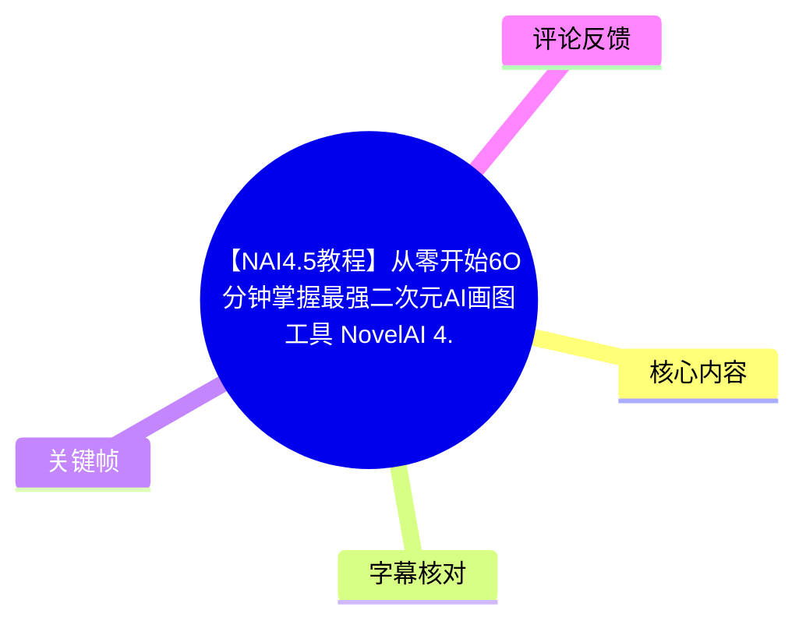
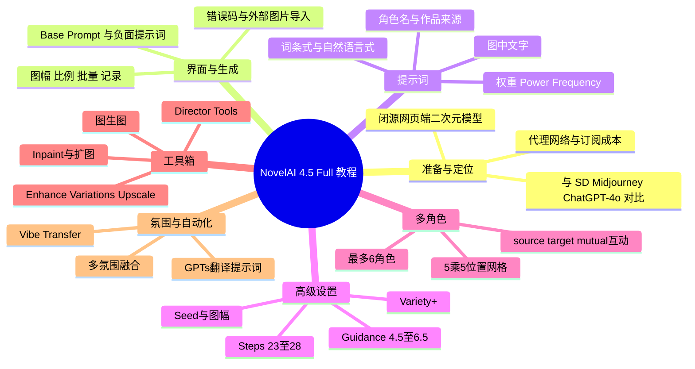
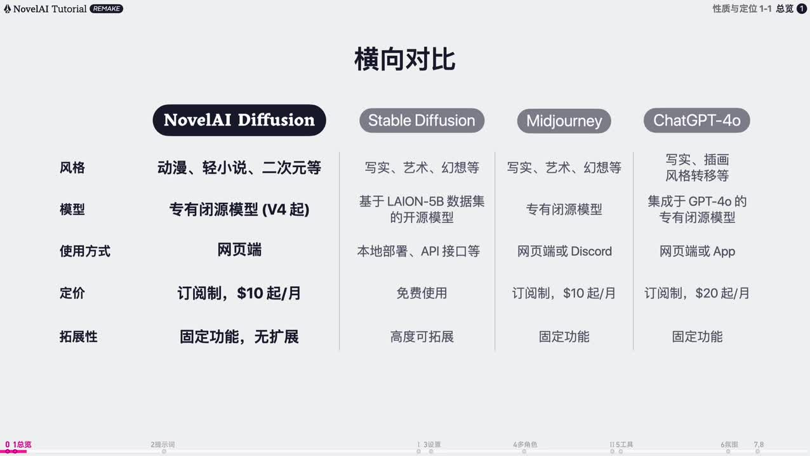
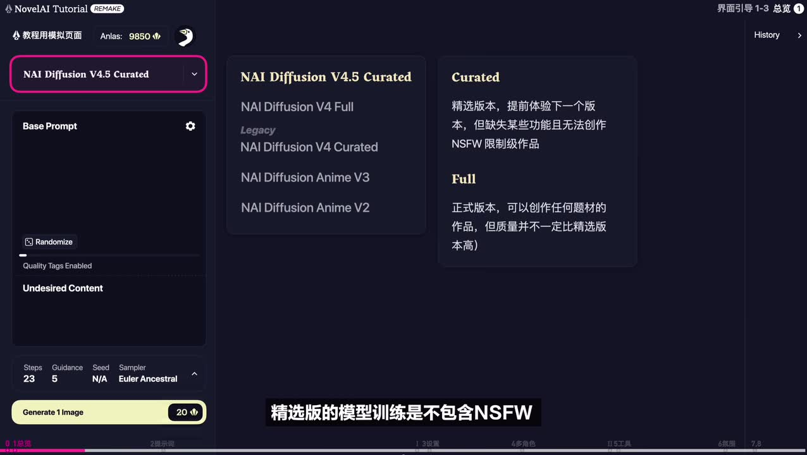
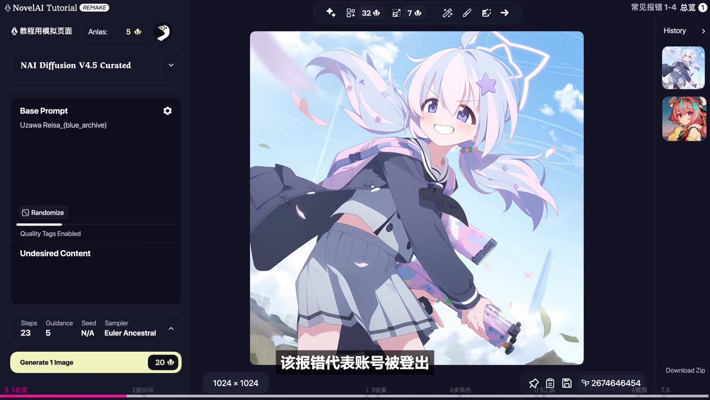
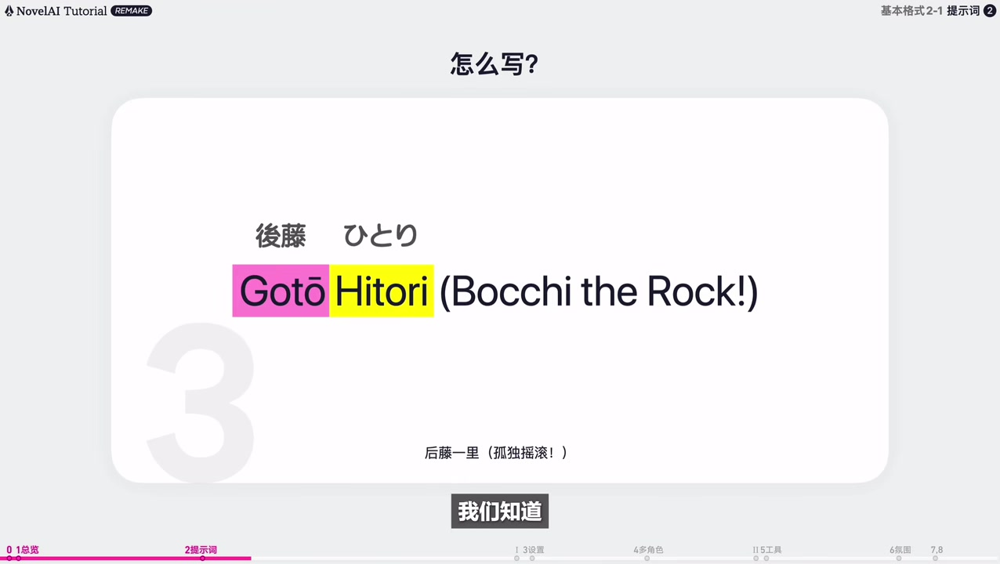

# 【NAI4.5教程】从零开始60分钟掌握 NovelAI 4.5 Full

> 来源：[Bilibili 视频](https://www.bilibili.com/video/BV1TeMbzwExw)  
> UP 主：衡鲍｜发布时间：2025-06-15｜时长：60:40  
> 本文中的价格、模型、功能及支付可用性均为视频制作时的陈述，不构成对当前 NovelAI 服务状态的保证。

## 小结

这是一份面向零基础用户的 NovelAI Diffusion 4.5 Full 教程，按“准备工作、总览、提示词、高级设置、多角色、工具箱、氛围转移与自动化”七个主题展开。重点不只是点击位置，还解释了提示词如何影响构图、怎样通过参数控制稳定性，以及如何在已有图片基础上修图、扩图和复用风格。

视频认为 NovelAI 的优势是二次元图像生成表现、网页端使用和较低上手门槛；代价则是订阅费用较高、需要适宜的代理网络，且不支持自行训练模型或导入 LoRA 等扩展。UP 主将其定位为闭源在线工具，与 Stable Diffusion 的开放、可扩展路线不同。

提示词部分给出了可操作的写法：词条式提示词用逗号连接；角色可用“角色名 + 作品来源”激活；自然语言适合空间关系、复杂场景与多文本逻辑。正面基础提示词和角色提示词共用 512 token 上限，负面提示词及负面角色提示词另有 512 token 上限。

最值得复用的经验包括：常规作图优先使用 23–28 步、Guidance 约 4.5–6.5；对单一词条优先在 1.0–2.0 权重区间试验；多角色时将风格与场景放入基础提示词、人物特征分入角色提示词；需要互动时使用 `source#`、`target#` 与 `mutual#`；对已满意图片及时下载，因为浏览器缓存刷新后历史记录可能消失。

视频中的订阅、点数和支付信息具有明显时效性。包括“最高档会员的免费生成阈值”“各工具点数费用”“地区支付限制”“模型版本及角色知识库截止日期”等，都应在实际使用前以 NovelAI 官方页面和账单页面为准。视频中还提及第三方代充、合租风险：低价账号可能封禁，合租点数可能被他人快速耗尽。

## 思维导图

## 目录

- [准备工作、定位与订阅](#准备工作定位与订阅-0043)
- [界面、生成流程与常见错误](#界面生成流程与常见错误-0534)
- [提示词：结构、角色、权重与文本](#提示词结构角色权重与文本-1302)
- [高级设置、种子与图幅](#高级设置种子与图幅-3030)
- [多角色、位置与互动标签](#多角色位置与互动标签-3801)
- [工具箱：图生图、修图、扩图与导演工具](#工具箱图生图修图扩图与导演工具-4535)
- [氛围转移与 GPTs 自动化](#氛围转移与-gpts-自动化-5406)
- [时效性、限制与实践清单](#时效性限制与实践清单)
- [字幕比对](#字幕比对)
- [评论分析](#评论分析)
- [处理记录](#处理记录)

## 准备工作、定位与订阅 [00:43](https://www.bilibili.com/video/BV1TeMbzwExw?t=43)

### 使用前提与产品定位

视频提出两项“硬性条件”：

1. 适宜的代理网络。
2. 持续的订阅开销。

UP 主强调 NovelAI 主要以英文标签识别和理解内容；英文能力较强会有优势，但可通过翻译软件或其他 AI 辅助。工具只是承载创意的容器，最终作品质量仍取决于用户的想象、审美与迭代能力。

从视频中的横向比较看，NovelAI Diffusion 被描述为：

- Anlatan 推出的二次元风格、付费、闭源在线 AI 绘画模型；
- 仅提供网页端，没有独立 App，因此可在多数设备与系统上使用，包括 macOS 与移动端；
- 相比 Stable Diffusion、Midjourney、ChatGPT-4o，视频认为其学习门槛较低；
- 不支持自行训练或导入 LoRA 角色数据等扩展；
- 在二次元画风方面有专属闭源模型优势，较简单提示词也可能得到较好结果。

> 图：画面以“风格、模型、使用方式、定价、拓展性”横向比较多个工具，有助于理解视频为何将 NovelAI 定位为“方便但封闭、强二次元但高订阅成本”的路线。

### 视频中的订阅与点数信息 [02:33](https://www.bilibili.com/video/BV1TeMbzwExw?t=153)

以下均为视频制作时的说法：

| 项目 | 视频中的说明 |
| --- | --- |
| 最低月费 | 约 72 元人民币/月 |
| 常见推荐档 | 约 180 元人民币/月的最高档 |
| 订阅档位 | 共 3 档，随订阅赠送约 1,000–10,000 点数 |
| 标准图基准 | 一张常规图约 20 点数 |
| 购点优惠 | 已订阅任一档位后，购买点数可获约 33% 优惠 |
| 低档适用性 | 视频认为前两档主要扩展小说功能；若只作图，不建议选前两档 |
| 最高档赠送 | 约 10,000 点数，视频称可对应约 5,000 张标准图，并含标准图免费无限生成能力 |
| 点数优先级 | 非标准大图或高级功能优先消耗订阅赠送点数，耗尽后才消耗付费点数 |
| 点数继承 | 视频称赠送点数在下次续费时重置为 10,000，不继承 |
| 操作建议 | 若赠送点数尚未用完，UP 主建议考虑暂时关闭自动续费，避免重置损失 |

视频特别提示：最高档的“免费标准图”存在参数边界。例如标准设置下，28 Steps 的标准图免费，而提高到 29 步可能需要额外消耗点数。不同尺寸、批量生成、扩图和高级工具也会改变消耗。

### 支付与账号风险 [04:06](https://www.bilibili.com/video/BV1TeMbzwExw?t=246)

视频称官方支持信用卡/借记卡与 PayPal 两类订阅路径，并引用官方 X 公告说明：部分地区银行发行的卡可能不支持。UP 主的实测经验是，特定国际合作发行卡“有一定概率”可以绑定成功，但不保证可用。

对于第三方代充或合租，视频明确提示风险：

- 视频中代充常见价格约为 180–200 元；
- 显著低于该区间的账号，可能存在订阅期内被封禁风险；
- 合租价格随人数浮动；
- 合租账户可能发生他人用脚本快速耗尽赠送点数，导致自己无法正常使用。

> 风险提示：以上是视频作者的经验性陈述，不应视为支付政策、账号安全或第三方服务可靠性的证明。不要向不可信第三方泄露账号、密码、支付信息或图片数据。

## 界面、生成流程与常见错误 [05:34](https://www.bilibili.com/video/BV1TeMbzwExw?t=334)

### 从登录到出图

视频演示的流程如下：

1. 在浏览器访问 NovelAI，点击 **Generate Images**。
2. 注册账号，或通过右上角 **Login** 输入邮箱与密码登录。
3. 回到主页，点击 **Image Generator** 进入主作图界面。
4. 界面从左至右为：工作区、图像区、作图历史区。
5. 写入基础提示词，保留默认设置或按需调整，点击黄色生成按钮。
6. 生成时图像区会显示加载状态；成图出现在图像区和右侧历史区。
7. 离开前可单张保存，或使用历史区中的“下载全部图片为压缩包”。

视频提醒：刷新浏览器缓存后，图片历史可能不会保留。因此要保存有价值的成图、种子和提示词。

### 模型、提示词区域与图像设置 [06:38](https://www.bilibili.com/video/BV1TeMbzwExw?t=398)

视频制作时，UP 主称最新模型为 **NovelAI Diffusion 4.5 Full**；其前一版本为 **4.5 Curated**。视频给出的区别是：

- **Curated**：训练不含 NSFW/R18 内容，因此不能用于对应内容创作。
- **Full**：功能更完整、限制更少；但视频强调，Full 不代表在所有任务中都必然优于 Curated。

> 图：画面展示模拟界面中的模型下拉菜单和 Curated、Full 的说明，能够直观对应“模型选择决定能力范围，但不直接保证质量更高”的观点。

关键界面信息：

- 左上角 **Anlas** 显示赠送点数与付费点数合计。
- **Base Prompt** 是核心正面提示词区域。
- 正面基础提示词与正面角色提示词合计上限为 **512 token**；视频按“1 token 约等于 3/4 英文单词”粗略换算，约可容纳 380 个英文单词。
- **Quality Tags Enabled / Quality Tax Enabled** 表示系统自动加入占用约 16 token 的质量类正向提示词。
- **Undesired Content** 为负面提示词区域；负面基础提示词与负面角色提示词也有独立的 512 token 上限。
- 齿轮设置中，UP 主建议保留大多数默认项；负面预设可按需求调整；**Tag Suggestions** 建议不要关闭；权重强调色建议保留。

图像尺寸与基础点数（视频口径）：

| 尺寸类型 | 基础费用 | 视频建议 |
| --- | ---: | --- |
| Normal | 20 点数 | 最推荐的常规尺寸 |
| Large | 30 点数 | 更大尺寸 |
| Wallpaper | 40 点数 | 壁纸规格 |
| Small | 8 点数 | 不建议优先使用 |

除 Wallpaper 外，视频称各尺寸一般有 Portrait、Landscape、Square 三种比例。宽高可手动调节，价格随尺寸变化。最高档会员下，视频称 Normal 与 Small 在条件满足时可免费；但批量一次生成多张没有折扣，并可能覆盖原本的单张减免，因此 UP 主不建议最高档会员常规批量生成。

### 常见错误与处理 [11:05](https://www.bilibili.com/video/BV1TeMbzwExw?t=665)

| 报错 | 视频解释 | 建议处理 |
| --- | --- | --- |
| `429 Current generation is locked` | 生成过快，可能被判定为脚本并临时限制；共享账号也可能是多人同时生成 | 等待约 10 秒；共享账号等待其他人完成 |
| `400 Invalid Authorization Header Content` | 账号退出登录或账号状态异常 | 到左上角头像处检查账号状态并重新登录 |
| `402 Not Enough Anlas` | 点数不足 | 充值、降低消耗或改用符合免费条件的设置 |
| 其他服务器错误 | NovelAI 自身服务端异常 | 稍等后重试 |

> 图：画面展示生成器、点数区域、历史区和“账号被登出”类字幕，适合辅助理解 400 错误并不是提示词语法问题，而可能与登录状态有关。

### 外部图片导入 [12:01](https://www.bilibili.com/video/BV1TeMbzwExw?t=721)

操作步骤：

1. 打开 NovelAI 页面，并打开存放图片的文件夹或其他应用。
2. 选中图片，跨窗口直接拖到 NovelAI 页面任意位置。
3. 当页面出现黑色蒙版和上传图标时松开鼠标完成上传。
4. 如果原图由 NovelAI 生成且未经二次编辑，导入时可能看到额外选项。
5. 非 NovelAI 图片或经编辑图片通常只有图生图与氛围转移等基础入口。

后续章节补充：若原图含 NovelAI 元数据，可导入正面提示词、负面提示词、角色提示词及种子；视频称 JPG 后缀一定不含该元数据。

## 提示词：结构、角色、权重与文本 [13:02](https://www.bilibili.com/video/BV1TeMbzwExw?t=782)

### 词条式与自然语言式

视频将提示词分为两类：

- **词条式（Tag-based）**：使用关键词/标签，逗号分隔，简洁且结构清晰，不要求完整语法。
- **自然语言式（Natural language）**：使用完整句子或口语描述，更适合简单空间关系、复杂场景逻辑和多个文本之间的归属关系。

词条式的推荐组织顺序仅供整理思路，不是强制语法：

1. 艺术家与风格；
2. 角色数量与性别；
3. 角色身份与性质；
4. 身体特征；
5. 服装与配饰；
6. 动作与表情；
7. 环境与背景；
8. 光影与视角；
9. 整体风格。

视频认为，直接写出特定角色名与来源作品名，可以减少对外貌、服装等冗长细节的重复描述；但角色能否稳定被识别，仍会受模型知识、词条强度、构图和其他提示词影响。

### 角色提示词写法 [14:30](https://www.bilibili.com/video/BV1TeMbzwExw?t=870)

视频以角色词条为例说明：

- 角色名和作品来源都应准确拼写。
- 大小写通常不构成严格限制。
- 含姓与名的日式人名、或由多个词组成的作品名，内部应保留空格；空格可用下划线替代。
- 角色名、外观/皮肤、作品名可按括号结构组织。
- 建议使用半角括号，视频称全角括号一般不影响识别，但会影响整洁性。
- 含变音符号或特殊字符的名称，可能需要改写为 ASCII 可表达形式；视频称当时模型主要支持基本拉丁字母、数字和标点。

> 图：画面用不同颜色标记角色名、姓名组成与作品来源，说明角色提示词的核心是准确、可解析的命名结构，而不是随意翻译角色中文名。

视频称，截至 4.5 Full 更新，角色知识库可能覆盖至 2025 年 6 月前已出现设计概念的角色，知名角色更可能被识别。这属于视频作者对模型知识范围的判断，应以实际测试为准。

### 权重：括号、数字与边界 [17:45](https://www.bilibili.com/video/BV1TeMbzwExw?t=1065)

视频给出两种权重方法：

| 写法 | 视频中说明 |
| --- | --- |
| `{tag}` | 将 tag 提升到约 1.1 倍权重 |
| `[tag]` | 将 tag 降至约 0.9 倍权重 |
| `数字::tag::` | 将 tag 权重设为输入的数字值 |

注意事项：

- 括号与冒号必须为**半角符号**，全角符号会导致权重失效。
- 数字权重必须用结束的双冒号限定作用范围；否则可能影响后续全部 tag。
- 权重强调色：增强为红色、降低为蓝色、数字权重作用范围为绿色；需在设置中保持“强调权重”开启。
- tag 以数字结尾时，结束双冒号可能产生解析歧义；视频建议在 tag 末尾加下划线、逗号或空格，再写结束标记。
- 视频示例指出，若用大括号实现约 2 倍权重，需要约 7 层大括号（约 1.95 倍）；极高倍数会需要大量嵌套，因此数字权重更适合精确控制。

UP 主强调权重效果具有非线性：并非数值越高效果越好，实战应优先在 **1.0–2.0** 范围试验，避免“暴力加权”。

### 词条强度、频率与构图联动 [23:44](https://www.bilibili.com/video/BV1TeMbzwExw?t=1424)

视频区分两个概念：

- **Power（词条强度）**：模型训练中学得的默认激活强度。
- **Frequency（引用数）**：词条在 Danbooru 等图像站的出现次数，可供参考，但不是 NovelAI 官方提供的 Power 数据。

UP 主通过若干词条观察得出经验性结论：引用数与强度大致呈对数拟合关系，即低频到中频阶段提升明显，较高频后趋于平缓；视频估计引用数约 3,000 时 Power 可能接近 10,000 上限。这是视频作者自行分析，不应作为官方规则。

实操建议：

1. 在 Danbooru 搜索 tag，查看引用数排序。
2. 使用 NAID Tag Search 查询词条强度。
3. 由于视频称该网站已于 2024 年停止更新，结果只能作为近似估计，不代表 4.5 模型当前状态。

视频还强调“暗含构图影响”的词条：例如某些服装、姿势或物体与特定构图常共同出现。提高这类词条权重时，模型可能不仅强化物体本身，也会连带改变姿势、视角和整体构图。因此若使用 `upper body close up` 等强构图词，应删除画面中无法展示的下半身服饰等冲突 tag。

### 生成图片中的文本 [26:50](https://www.bilibili.com/video/BV1TeMbzwExw?t=1610)

单条文本的写法，视频要求：

1. 写完 Base Prompt 后空一行；
2. 再使用大写 `TEXT:` 后接文字内容；
3. 页面中直接按回车可能触发生成，因此换行时使用 `Shift + Enter`。

视频还用文字样式、颜色、承载物展示了文本控制：例如要求粉色手写体、文字印在枕头上，模型可能同时生成“角色抱着枕头”的动作。多个文本时，UP 主建议将主要提示词改为自然语言，明确“谁说哪句话、文字是什么颜色、位于哪个气泡”，以降低文本归属混乱。

## 高级设置、种子与图幅 [30:30](https://www.bilibili.com/video/BV1TeMbzwExw?t=1830)

### Steps、Guidance 与 Variety+

在设置预览区右侧展开高级设置后，视频介绍 Steps、Guidance、Seed、Sampler 等参数。

| 参数 | 视频中的含义 | 视频建议/观察 |
| --- | --- | ---|
| Steps | 扩散模型从噪声逐步去噪、细化图像的迭代次数 | 默认 23；常用 23–28 |
| Guidance | 提示词整体约束强度 | 常用 4.5–6.5 |
| Variety+ | 增加额外自由度，使结果更具变化 | 想要随机性、动作与视角变化时可开启 |
| Seed | 初始随机噪声的起点 | 用于复现构图与结果 |
| Sampler / Noise Schedule | 采样器与噪声调度 | 视频建议普通用户保持默认 |

视频的判断：

- Steps 过低可能降低细节质量，过高会增加点数消耗。
- Guidance 过高时模型会更“死板地听提示词”，但可能失真；过低则更自由却更容易偏离要求。
- 视频用对照认为，降低 Guidance 和开启 Variety+ 都会降低严格控制，但机制不同：前者降低整体提示词约束，后者更像在保留要求基础上加入额外发挥。
- 对最高档免费标准图，视频称 **28 Steps** 是重要临界值，**29 Steps** 可能额外收费。

### Prompt Guidance Rescale、Seed 与尺寸 [33:39](https://www.bilibili.com/video/BV1TeMbzwExw?t=2019)

**Prompt Guidance Rescale** 被视频描述为高 Guidance 下的纠偏器：在 Guidance 过高时，可帮助画面回到较自然、平衡状态。示例中 Guidance 调至 10 出现明显失真，开启该功能并设为 0.6 后质量改善但色调变低。UP 主结论是：该功能不推荐作为日常常用方案，更不建议平时将 Guidance 调得过高。

Seed 的核心关系：

- 相同提示词 + 相同 Seed + 相同参数，理论上应复现相同图像；
- 不同提示词 + 相同 Seed，可能保留相似构图但内容变化；
- 因而 Seed 是复现、局部改词和保留构图的重要参数。

图幅建议：

| 图幅 | 视频建议用途 |
| --- | --- |
| Portrait | 单人立绘、半身像、全身像 |
| Square | 头像、头肩像、半身像 |
| Landscape | 环境人物图、较丰富场景 |

视频示例提到可手动输入 `2240 × 1252`，用于接近 21:9 的电影宽屏比例；但该例消耗约 50 点数。最高档会员在常规设置下，视频称图像宽高乘积小于约 **108 万像素**可免费生成，系统会按 32 或 64 的步长自动修正尺寸。

### 含元数据图片的导入 [36:52](https://www.bilibili.com/video/BV1TeMbzwExw?t=2212)

如果导入图片由 NovelAI 生成且未二次编辑，视频称其可能含 Metadata，可导入：

- 正面提示词；
- 负面提示词；
- 角色提示词；
- 种子。

角色提示词中的 `Append` 默认关闭：

- 关闭：导入图片的角色提示词覆盖当前角色提示词；
- 开启：将导入的角色提示词追加到当前角色提示词后。

## 多角色、位置与互动标签 [38:01](https://www.bilibili.com/video/BV1TeMbzwExw?t=2281)

### 多角色基础结构

进入 **Character Prompts** 后，新增角色可选择 girl、boy 或其他。视频称最多可同时存在 **6 个角色**。

规则与分工：

- 基础提示词和角色提示词在风格上互相影响；
- 所有正面角色提示词与 Base Prompt 共用 512 token；
- 基础提示词建议写：艺术家与风格、准确角色数量、环境背景、光影视角、整体风格；
- 各角色提示词分别写：性别、身份、外观特征、服装配饰、动作表情；
- 为降低污染，可在角色提示词中加入独特身体特征或服饰；
- 基础提示词内角色数量必须准确，例如 `two characters`。

### 5×5 网格位置 [40:28](https://www.bilibili.com/video/BV1TeMbzwExw?t=2428)

关闭 `Character Positions Global` 的 AI 自动选择后，可手动设置位置。视频将位置理解为 5×5 网格：

- 横坐标 A–E；
- 纵坐标 1–5；
- 左上角为起点；
- 共 25 个粗略位置。

视频建议：

| 图幅 | 建议位置范围 |
| --- | --- |
| Square | 尽量置于中间 9 格 |
| Portrait | B1–D5，即中间三列 |
| Landscape | A2–E4，即中间三行 |

避免事项：

- 部分边缘位置可能让人物显示不完整，视频特别不建议随意使用如 E1、A2、A5 等边缘位。
- 一个角色周围 8 格内尽量不要放另一角色，否则混合风格、属性重叠的概率提高。
- 但想制造握手、接触等互动时，可有意让人物处在相邻位置；视频示例将两人放在 C3 与 D4，必要时可放入同一坐标。

### source、target、mutual 互动标签 [42:01](https://www.bilibili.com/video/BV1TeMbzwExw?t=2521)

视频给出的互动标签逻辑：

| 标签 | 含义 | 用法 |
| --- | --- | --- |
| `source#动作` | 施动方 | 发起动作的一方 |
| `target#动作` | 受动方 | 接受动作的一方 |
| `mutual#动作` | 双向/镜像互动 | 两方都写相同动作，可形成相同或镜像动作 |

例如“扯住衣服”：

- 角色 1：`target# tugging clothes`
- 角色 2：`source# tugging clothes`

视频解释为：角色 2 施动，角色 1 被扯住衣服。

两项特殊应用：

1. **第一人称互动**：可将一名角色设置为带手部的第一人称视角，另一人置于中心或邻近位置，并明确主提示词中的角色数量。
2. **Cosplay 效果**：Source 角色保留更多自身身形、脸型、瞳孔等，Target 角色的服饰/头发可能迁移到 Source。为避免生成两个完整角色，视频建议两个位置放在同一坐标，且主提示词写 `one girl`、`one boy` 或 `one character`。

## 工具箱：图生图、修图、扩图与导演工具 [45:35](https://www.bilibili.com/video/BV1TeMbzwExw?t=2735)

### Image to Image：叠图/图生图

入口：

- 在提示词下方上传 Base Image；
- 对已生成图片点击工具栏魔法棒；
- 导入外部图片后选择 **Image to Image**。

导入后模型以图片为基础，按提示词重绘或微调。两个重要参数：

| 参数 | 视频解释 |
| --- | --- |
| Strength | 提示词对导入图片的影响强度，不是“原图参考强度” |
| Noise | 使模型引入新细节的程度；高噪声会增加变化和背景生成概率 |

视频的测试结论：

- Strength 低时，模型较少遵从提示词、较忠于原图形状；
- Strength 越高，提示词影响越深；
- 保持 Strength 0.8 时，提高 Noise 会增加图像多样性，类似 Variety+；
- 可先用第三方工具搭建人体姿势模型，再用图生图引导复杂动作。

### Enhance、Variations 与 Upscale [47:15](https://www.bilibili.com/video/BV1TeMbzwExw?t=2835)

| 功能 | 视频说明 | 消耗/效果（视频口径） |
| --- | --- | --- |
| Enhance | 通过参数变化增强/翻新图片 | Enhance 内部放大最高约 1.5 倍长宽 |
| Magnitude | Enhance 的粗调档位 | 1–5 整数；会联动 Strength 与 Noise |
| Variations | 基于相同提示词、相同种子做轻微扰动 | 常规设置下 32 点数生成额外 3 张相似图 |
| Upscale | 专用放大 | 约 7 点数，长宽各提高 4 倍，总像素约 16 倍 |

视频特别比较：

- 左侧的“生成 4 张”是相同 Prompt、不同 Seed 连续生成，本质近似四次单图生成，视频以标准图计为约 80 点数。
- Variations 则是在相同 Prompt 和 Seed 上进行三次轻微扰动，目标是寻找与当前图更相近的变体。
- 同为 7 点数，Enhance 内放大约为长宽 1.5 倍、总面积 2.25 倍；独立 Upscale 为长宽 4 倍、总面积 16 倍，因此视频认为单独 Upscale 更划算。

### Inpaint 局部重绘与扩图 [49:10](https://www.bilibili.com/video/BV1TeMbzwExw?t=2950)

视频中的 **Inpaint** 是局部重绘功能。操作流程：

1. 打开 Inpaint；
2. 调整画笔粗细；
3. 使用铅笔在问题区域绘制蒙版，橡皮可擦除；
4. `Minimum Context Area` 控制对蒙版周边内容的参考程度，视频建议保持默认 **96**；
5. 保存并生成。

视频解释：这里的笔刷画的是“蒙版”，保存后相当于将带蒙版图片作为图生图输入，重新生成涂抹区域。Context Area 越高，重绘区域越贴近周边画风；过低可能造成拼贴感、割裂感。

扩图流程：

1. 在 Inpaint 的扩图设置中，对上下左右填入大于 0 的扩展像素。
2. 例如左右各填 300，即在原图两侧各扩展 300 像素。
3. 扩图后，必须用画笔蒙版完整覆盖新增区域。
4. 保存并生成；否则新增区域可能保持空白。

视频的示例从 `1024×1024` 扩展为 `1664×1024` 左右，且指出系统可能把用户输入尺寸按规则修正。扩图后的总像素若超过约 108 万，也可能不再符合最高档会员免费生成条件。

### Director Tools [51:29](https://www.bilibili.com/video/BV1TeMbzwExw?t=3089)

入口位于工具栏最右侧箭头或左侧工作区底部 **Director Tools**。

| 工具 | 功能与限制 |
| --- | --- |
| 背景移除 | 输出透明背景，例如 PNG；提供 Masked、Generated、Mixed 三种结果 |
| Masked | 直接抠图，可能保留人物边缘上原本属于背景的元素 |
| Generated | 抠图后用 AI 修复覆盖不属于人物的部分；视频以落叶、水印残留为例 |
| Mixed | 融合直接抠图与生成修复的效果 |
| 转线稿 / 铅笔画 | 将目标图转换为线稿或铅笔画，视频未展开 |
| 线稿上色 | 视频实测认为效果欠缺，未推荐 |
| Emotion | 修改人物表情 |
| Declutter | 清理遮挡人物的元素、文字或文本框，并尽可能保留背景 |

成本与使用建议：

- 视频称背景移除最低费用约 65 点数，较高清图可能约 200 点数，成本较高。
- Emotion 更适合上传“正面、上半身、原本无表情”的人物图；不建议使用侧脸、有既有表情、明显偏转或全身图。
- Emotion 的独立提示词栏约有 75 token（约 60 单词）额度。
- 视频强烈建议 Emotion 从最低强度 **Weakest** 开始，效果不足再逐步增加，以减少“坏图、突脸”风险。
- Declutter 可删除遮挡物、冗余文字，同时尽量保留复杂背景；具体结果仍依赖图片内容。

## 氛围转移与 GPTs 自动化 [54:06](https://www.bilibili.com/video/BV1TeMbzwExw?t=3246)

### Vibe Transfer：参考氛围而非照搬主体

视频将 **Vibe Transfer（氛围转移）** 定义为：从参考图提取色彩、光感和风格等视觉特征，使新图具有类似氛围，而非直接复制参考图的对象结构。

入口：

- 工作区导入底图下方；
- 或外部导入时选择 Vibe Transfer。

视频称，与更新前不同，导入一张氛围图需花费 **2 点数**进行分析；分析完成才可使用。主要参数：

| 参数 | 视频说明 |
| --- | --- |
| Reference Strength | 越接近 1，越尝试模仿参考图的风格、色彩等视觉线索 |
| Information Extracted | 官方更新日志称不建议调整；即便微调 0.01，也会再次花 2 点数分析 |

4.5 更新后，视频称最多可同时处理 **16 个氛围图**。多氛围混合时：

- 每个氛围的 Reference Strength 总和不要超过 `1.00`；
- 页面中的 `Normalize Reference Strength Value` 默认开启；
- 可通过勾选/叉号激活或忽略某张氛围图；
- 不同强度分配会改变各参考风格在结果中的占比。

节省点数的做法：

1. 点击氛围图右侧下载，获得后缀类似 `.naiv4vibe` 的文件。
2. 以后将该文件拖回 NovelAI，可跳过分析过程并复用氛围。
3. 视频称，如果不离开浏览器且不清理浏览器缓存，曾分析过的氛围图即使删除后重新导入，也可能跳过重复分析。

> 这与“离开前应保存生成历史”的建议形成取舍：保存图片和种子有利于资产管理；保留浏览器缓存可能有利于免去重复氛围分析。实际应根据隐私需求、设备安全与账号使用场景决定。

### GPTs 快速翻译 [56:47](https://www.bilibili.com/video/BV1TeMbzwExw?t=3407)

视频介绍 UP 主在 ChatGPT 平台制作的 GPTs“鲍鲍助手”。视频称其用途是：

- 将中文场景描述转成词条式提示词和自然语言式提示词；
- 可上传图片并获取对应描述/提示词；
- ChatGPT 平台可每日免费使用，但额度有限；如有需求可能需 GPT Plus 获取更多额度。

视频简介中给出了相关站点与链接，包括 NovelAI、Danbooru、NAID Tag Search、鲍鲍助手、网盘资源、Discord 群等。外部网站和网盘内容随时可能失效或变化，应审慎访问并核验来源。

## 时效性、限制与实践清单

### 重要时效性

视频发布于 2025 年 6 月，且明确以“视频制作时”作为模型与功能说明的时间基准。以下内容不可直接等同于当前状态：

- NovelAI 4.5 Full / Curated 的具体名称、能力和内容限制；
- 各订阅档位、人民币换算、点数赠送量及点数重置规则；
- 免费生成的 Steps、像素阈值和批量生成规则；
- 图生图、背景移除、Variation、Upscale、Vibe Transfer 等工具费用；
- 支付地区、银行卡、PayPal 可用性；
- 角色知识库覆盖日期；
- NAID Tag Search 的更新状态；
- GPTs 免费额度及 Plus 权益。

### 一套低风险的实战流程

1. **先选模型与图幅**：普通单人二次元图优先 Normal + Portrait/Square；按内容决定 Full 或 Curated。
2. **写最小可用提示词**：先写角色数量、角色名与来源、动作、场景、视角和风格，不要一开始堆满 token。
3. **固定种子试错**：找到接近目标构图的图片后，保存 Seed；在同一 Seed 下逐步调整提示词。
4. **参数保持温和**：Steps 先用 23–28，Guidance 先用 4.5–6.5，权重先从 1.0–2.0 试。
5. **多角色分层**：全局风格放 Base Prompt，人物差异放 Character Prompts；人物相互靠近前先控制位置。
6. **问题局部修复**：小瑕疵使用 Inpaint，不要因一个背景人影而重抽整张图。
7. **满意后再放大**：先在常规尺寸完成构图和人物，再使用 Upscale，避免高分辨率阶段反复试错。
8. **及时导出资产**：保存图片、Prompt、负面 Prompt、Seed 与氛围文件；不要只依赖浏览器历史。
9. **核实费用**：每次点击高级工具、调整氛围参数或扩大尺寸前，检查当前界面显示的点数成本。

## 字幕比对

| 字幕来源 | 完整性 | 专有名词 | 时间轴 | 主要问题 |
| --- | --- | --- | --- | --- |
| Bilibili 站内字幕 | 覆盖全片口播与结尾，内容完整度高 | 多数术语较可靠，如 NovelAI、Base Prompt、Vibe Transfer、Source/Target | 提供毫秒级 SRT 起止时间，可直接用于时间轴 | 仍有少量英文和数字转写问题，例如模型名、错误码文本、个别尺寸 |
| 本次 ASR 字幕 | 检测到中文语音，覆盖约 84.53% 的语音时长；未标记 `noAudioStream=true` | 专有名词误识别较多，如 NovelAI 被识别为 NovaAI/Lavro AI，Danbooru、Vibe Transfer、Guidance Rescale 等均有错写 | 有真实分段时间戳；ASR 首段从 00:00:33.840 开始，前段覆盖异常 | 多处中英混杂、术语和数字失真；存在约 45 秒与 42 秒的音乐/无口播大间隔 |

### 最终字幕选择

正文以**站内 SRT 的毫秒级时间轴**为主，因为其对章节起止、英文术语和连续口播的还原整体更稳定；同时已检查本次 ASR 的时间戳、语言诊断与覆盖度，用于交叉确认章节位置和识别站内字幕中的个别疑点。

通过站内字幕、ASR 与关键帧画面交叉校正的重点术语包括：

- `NovelAI Diffusion 4.5 Full`、`Curated`；
- `Base Prompt`、`Undesired Content`、`Quality Tags Enabled`；
- `Steps`、`Guidance`、`Variety+`、`Seed`；
- `Image to Image`、`Inpaint`、`Director Tools`；
- `Vibe Transfer`、`Reference Strength`；
- `source#`、`target#`、`mutual#`。

本次 ASR 诊断未出现 `noAudioStream=true`，因此不存在“源视频没有音轨”的情况；ASR 结果可用，但因专有名词误识别明显，未作为正文主要转写来源。

## 评论分析

仅处理可获取热评前三条，以下内容均为评论者个人经验或观点，不视为已验证事实。

1. **家団_ofFicial（421 赞）**  
   评论称“已经出图了，非常开心”。这反映教程对部分观众具有较直接的可操作性，但没有提供具体参数、账号档位或生成质量，不能据此判断普遍成功率。

2. **lixKRT（246 赞）**  
   评论者表示自己对二次元 AI 绘图的印象仍停留在 2023 年的 Stable Diffusion，并询问当前是否有成品率更高的工具，以及 Stable Diffusion 是否仍适合进阶玩法。该评论体现了用户在“易用性/成品率”与“进阶可扩展性”之间的选择困惑，恰好对应视频对 NovelAI 与 Stable Diffusion 的定位比较；但评论本身没有给出结论或证据。

3. **爱爬树的鱼（239 赞）**  
   评论者分享个人流程：先构思画面，在 Danbooru 查 tag；没有合适 tag 时让 Grok 或 DeepSeek 转写；在高档会员前提下用小图逐步试错；并通过 Discord、Telegram 社群获取参考。其建议与视频的“英文 tag、翻译辅助、低成本试错、保存常用词条”思路一致。需要注意，评论所述群组资源、模型能力、会员成本和平台政策都可能变化，且外部社群链接应谨慎验证。

## 处理记录

- Worker ID：`worker-mrj0wbly-5dc4e50c`
- 模型：`gpt-5.6-terra`
- 调用工具与素材：视频元数据、Bilibili 站内 SRT、`asr/asr-result.json`、ASR SRT、12 张关键帧清单、热评 JSON。
- ASR 检查：已检查；语言识别为中文，概率 `0.994140625`；ASR 时长约 `3639.77` 秒，语音覆盖约 `84.53%`；未出现 `noAudioStream=true`。
- 字幕选择：以站内 SRT 为正文时间轴和内容主依据；ASR 用于时间段交叉检查与字幕质量比对。未根据文字顺序臆测时间位置。
- 关键帧选择依据：
  - `frames/frame-001.jpg`：横向对比图，适用于产品定位；
  - `frames/frame-002.jpg`：模型选择与 Curated/Full 差异，适用于界面和模型章节；
  - `frames/frame-003.jpg`：作图界面、历史区与账号状态提示，适用于错误排查；
  - `frames/frame-004.jpg`：角色词条结构图，适用于角色提示词规则。
- 缓存清理：未提供可执行的缓存清理工具记录；本次仅使用已交付素材进行整理，未声明或执行对源文件、浏览器缓存、视频缓存的删除操作。
- 未解决问题：
  - 未提供每张关键帧的原始提取时间戳，因此未把关键帧本身作为时间定位证据；
  - 视频中的点数、支付、地区限制、模型能力与外链资源均可能已变动；
  - 部分站内字幕与 ASR 对英文术语、个别数字存在转写差异，已优先保留上下文更一致的写法，并明确标注为视频口径。
