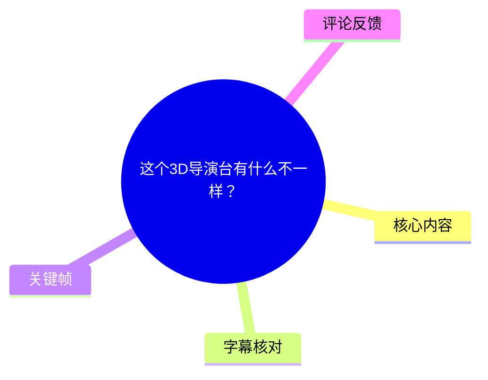
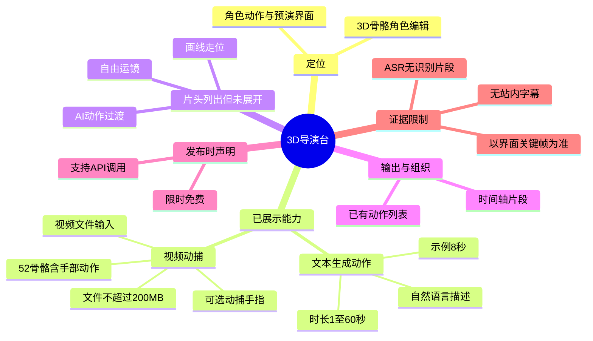
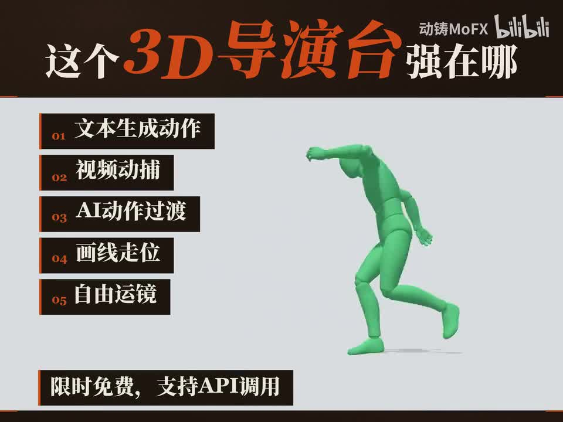
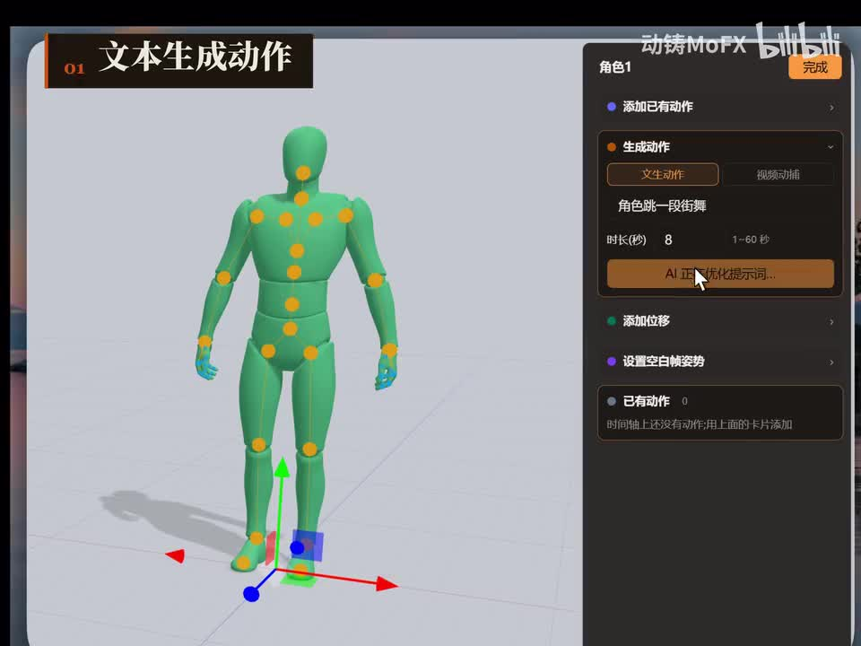
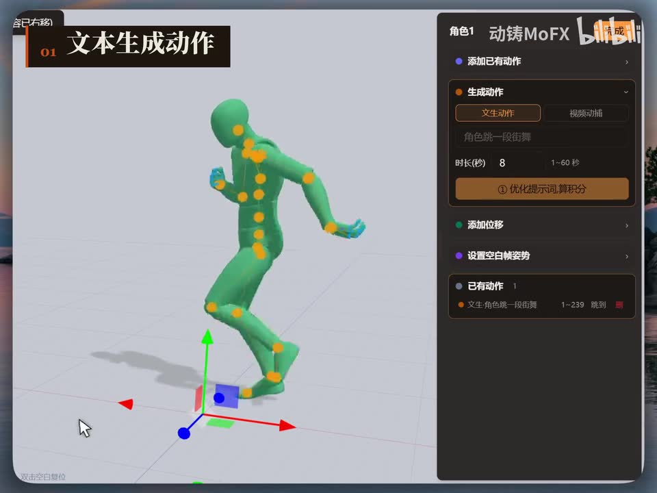
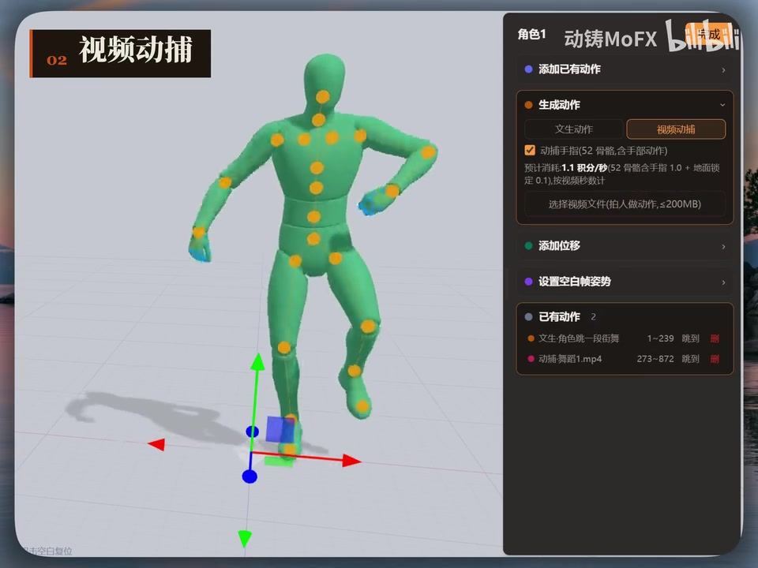

# 这个3D导演台有什么不一样？

> 来源：[Bilibili 视频](https://www.bilibili.com/video/BV1xNNZ6XEEW) 
> UP 主：动铸MoFX｜发布时间：2026-07-18｜视频时长：49 秒｜分辨率：2880 × 2160 
> 标签：`seedance2.0`、`3D导演台`、`动铸MoFX`、`AI视频`、`角色动作`

## 小结

视频以界面演示的形式介绍一个“3D 导演台”的角色动作能力。片头明确列出五项卖点：**文本生成动作、视频动捕、AI 动作过渡、画线走位、自由运镜**；同时标注“限时免费，支持 API 调用”。

已展示的两项能力分别是文本生成动作与视频动捕。文本生成动作支持填写自然语言动作描述，例如“角色跳一段街舞”，并设置动作时长；界面显示可选范围为 **1～60 秒**，示例设置为 **8 秒**。生成后，动作会加入“已有动作”列表，并以时间范围形式出现在时间轴中。

视频动捕模式可选择拍摄人物动作的视频文件。画面中明确可见文件限制为**视频文件不超过 200 MB**，并提供“动捕手指（52 骨骼，含手部动作）”选项。该选项说明系统至少在界面层面支持包含手部动作在内的骨骼动捕，但视频没有提供精度、处理耗时、支持格式或失败率等验证数据。

“AI 动作过渡、画线走位、自由运镜”仅在片头功能列表中出现；本素材提供的可见关键帧中没有对应的具体操作界面或结果展示，因此不能补充其工作方式、参数范围或实际效果。

这份视频适合关注 AI 角色动画、动作设计、预演和 API 接入的创作者阅读。需要注意：视频总时长仅 49 秒，且没有可用的逐字语音/站内字幕；本文以关键帧中可见的界面文字为主要证据。“限时免费”和 API 支持均是视频发布时的画面声明，不等同于当前仍可用或价格、额度不变。

## 思维导图

## 目录

- [视频定位与信息边界](#视频定位与信息边界)
- [功能总览：五项能力与发布时声明](#功能总览五项能力与发布时声明)
- [文本生成动作：提示词、时长与动作入列](#文本生成动作提示词时长与动作入列)
- [视频动捕：输入限制与手指动捕选项](#视频动捕输入限制与手指动捕选项)
- [工作流与可复用经验](#工作流与可复用经验)
- [参数、限制与时效性](#参数限制与时效性)
- [字幕比对](#字幕比对)
- [评论分析](#评论分析)
- [处理记录](#处理记录)

## 视频定位与信息边界 [视频起点](https://www.bilibili.com/video/BV1xNNZ6XEEW?t=0)

该视频标题为“这个3D导演台有什么不一样？”，核心呈现方式是 3D 人形骨骼角色与右侧动作控制面板的 UI 演示，而非口播教程或完整项目案例。

素材未提供站内字幕，本次 ASR 也未识别出任何语音分段，故不存在可据以精确定位的 SRT 时间区间。下面各章节统一链接至视频起点，避免根据画面排列顺序臆测具体秒数；正文的功能判断均以提供的关键帧中文字与可见界面为限。

> 图：片头直接展示“这个 3D 导演台强在哪”的标题、五项能力列表，以及绿色 3D 骨骼角色。这是界定本视频功能范围的最完整画面，也是确认“限时免费、支持 API 调用”声明的主要依据。

## 功能总览：五项能力与发布时声明 [视频起点](https://www.bilibili.com/video/BV1xNNZ6XEEW?t=0)

片头列出的功能如下：

| 编号 | 画面文字 | 本素材中的证据状态 | 可确认内容 |
| --- | --- | --- | --- |
| 01 | 文本生成动作 | 有后续界面展示 | 可输入文字描述并设置时长生成动作。 |
| 02 | 视频动捕 | 有后续界面展示 | 可选择视频文件进行动捕，画面显示文件大小限制。 |
| 03 | AI 动作过渡 | 仅片头列出 | 只能确认它被列为功能，无法确认操作、参数与输出。 |
| 04 | 画线走位 | 仅片头列出 | 只能确认它被列为功能，无法确认如何绘制路径或影响角色移动。 |
| 05 | 自由运镜 | 仅片头列出 | 只能确认它被列为功能，无法确认镜头控制维度或导出效果。 |

片头底部写有“**限时免费，支持 API 调用**”。这属于视频画面中的产品宣称，可用于理解发布时的推广信息，但不应进一步推导为：

- 当前仍处于免费期；
- 免费范围覆盖所有功能、时长或 API 用量；
- API 已公开、可申请，或具有稳定文档与服务等级；
- 产品与标签中的 `seedance2.0` 存在某种未在视频中明示的集成关系。

## 文本生成动作：提示词、时长与动作入列 [视频起点](https://www.bilibili.com/video/BV1xNNZ6XEEW?t=0)

右侧面板中可见“角色1”与“生成动作”区域，并提供“文本动作”和“视频动捕”两个切换项。在文本动作状态下，画面显示以下要素：

1. **文本描述输入**：示例文案为“角色跳一段街舞”。
2. **动作时长**：示例填写为 **8 秒**。
3. **时长范围**：输入框右侧标注 **1～60 秒**。
4. **提示词处理入口**：按钮文字为“AI 帮你优化提示词…”，另一关键帧中显示“① 优化提示词,算积分”，表明优化提示词可能消耗积分。
5. **已有动作管理**：生成后的动作出现在“已有动作”区域，可见条目“文生·角色跳一段街舞”，并附带“跳到”操作与删除图标。

> 图：该帧显示“文本动作”标签、动作描述“角色跳一段街舞”、时长 8 秒及“1～60 秒”范围。它为文本驱动生成和时长参数提供直接的界面证据。

> 图：该帧中的角色已呈现舞蹈姿势，右侧“已有动作”数量为 1，列表出现对应文生动作条目。这说明界面至少会把生成结果作为可管理的动作片段保存到已有动作列表中；画面未提供动作质量或生成耗时数据。

### 可复用操作顺序

依据画面可见的控件，文本生成动作可整理为以下最小工作流：

1. 选择目标角色，例如画面中的“角色1”。
2. 进入“生成动作”区域。
3. 切换到“文本动作”。
4. 输入动作描述，例如“角色跳一段街舞”。
5. 设置动作时长，确保在 **1～60 秒**范围内；演示使用 **8 秒**。
6. 如需处理提示词，可使用“AI 帮你优化提示词”入口；界面提示该步骤“算积分”，使用前应确认账户积分规则。
7. 生成后，在“已有动作”列表检查新增的文生动作，并通过“跳到”定位相应动作片段。

### 经验与边界

- 文字描述应至少包含角色要执行的动作类型；视频示例使用“跳一段街舞”，未展示更复杂的镜头、速度、情绪或接触约束如何表达。
- 时长是已明确暴露的控制参数，但视频未说明较长时长是否会降低稳定性、增加积分消耗或延长生成时间。
- “已有动作”列表及时间范围数字表明系统具有动作片段组织能力；但没有展示多段动作拼接、导出格式、循环、编辑关键帧等能力，不能将其视为已证实功能。

## 视频动捕：输入限制与手指动捕选项 [视频起点](https://www.bilibili.com/video/BV1xNNZ6XEEW?t=0)

切换至“视频动捕”后，右侧面板展示了另一条动作输入路径。画面中可辨识的信息包括：

| 项目 | 画面信息 | 解读边界 |
| --- | --- | --- |
| 输入方式 | “选择视频文件（拍人做动作，≤200MB）” | 可上传/选择拍摄人物动作的视频，文件限制为不超过 200 MB。未展示支持的具体封装格式、编码或分辨率。 |
| 手部选项 | “动捕手指（52 骨骼，含手部动作）” | 可选择包含手部动作的 52 骨骼动捕选项；未展示骨骼定义、手指追踪精度或遮挡情况下的表现。 |
| 已有视频动作 | 列表中可见“动捕 舞蹈1.mp4” | 视频动捕结果会作为已有动作条目出现。 |
| 时间范围 | 视频动作旁可见“273～872” | 画面可确认存在片段范围数字，但其单位、帧率及是否可编辑均未说明。 |

> 图：该帧展示“视频动捕”标签、手指动捕复选项、52 骨骼说明，以及“拍人做动作，≤200MB”的文件选择提示；它是确认视频输入限制和手部动捕描述的关键证据。

### 可复用操作顺序

1. 在“生成动作”区域切换到“视频动捕”。
2. 根据是否需要手部动作，确认“动捕手指（52 骨骼，含手部动作）”选项。
3. 选择拍摄人物动作的视频文件，并确保文件大小 **≤200 MB**。
4. 等待动捕结果加入“已有动作”列表。
5. 通过动作条目旁的“跳到”功能定位该片段，以便在时间轴/项目中查看。

### 实践建议

下列建议是基于画面中“拍人做动作”的输入提示所作的保守准备建议，并非视频明示的硬性要求：

- 优先使用人物主体清晰、全身不被遮挡的视频，以便降低动作主体不明确的风险。
- 在上传前控制文件体积，以满足 **200 MB** 上限。
- 若项目重点是手势表演，应关注是否启用“动捕手指”选项；该选项是画面中唯一明确涉及手部动作的设置。
- 上传后需自行检查角色四肢、手部与脚部接触的结果。视频没有给出质量对比，因此不能预设动捕结果必然准确。

## 工作流与可复用经验 [视频起点](https://www.bilibili.com/video/BV1xNNZ6XEEW?t=0)

结合已展示的两种输入方式，可以形成一个保守的动作制作流程：

1. **确定角色与动作来源**  
   对创意动作使用文本生成；对已有真人表演使用视频动捕。两者均在同一“生成动作”面板下出现。

2. **设置受已知参数约束的输入**  
   - 文本生成：动作时长限定在 **1～60 秒**。  
   - 视频动捕：输入文件不超过 **200 MB**。  
   - 手部表演：考虑启用 **52 骨骼、含手部动作**的动捕选项。

3. **将结果作为动作片段管理**  
   画面中“已有动作”列表同时容纳文生动作与视频动捕动作，说明不同来源的动作会进入统一管理位置。

4. **定位和检查片段**  
   列表条目旁可见“跳到”，可用于跳转至对应片段。视频展示了范围数字，但没有说明其精确单位；实际项目中应核验时间轴单位与播放效果。

5. **谨慎看待未展示环节**  
   片头宣称的 AI 动作过渡、画线走位、自由运镜，可能服务于动作与镜头整合，但本视频没有给出实操证据。若要用于正式生产，需要以产品文档或实际测试确认。

## 参数、限制与时效性 [视频起点](https://www.bilibili.com/video/BV1xNNZ6XEEW?t=0)

### 已明确出现的参数与限制

| 类别 | 参数/限制 | 来源 |
| --- | --- | --- |
| 文本动作时长 | 1～60 秒 | 文本生成动作界面 |
| 文本动作示例时长 | 8 秒 | 文本生成动作界面 |
| 提示词优化 | 界面提示“算积分” | 文本生成动作界面 |
| 视频动捕文件 | 拍摄人物动作；文件 ≤200 MB | 视频动捕界面 |
| 手部动捕 | 可选“动捕手指（52 骨骼，含手部动作）” | 视频动捕界面 |
| 服务状态 | 限时免费 | 片头画面 |
| 集成能力 | 支持 API 调用 | 片头画面 |

### 未被视频证实的信息

以下内容没有可用证据，不能补写为产品事实：

- 工具名称、官网地址、下载方式与登录要求；
- API 的请求方式、鉴权、模型名称、价格、速率限制和返回格式；
- 支持的视频文件格式、最大时长、分辨率和编码；
- 动捕的帧率、骨骼坐标规范、手指追踪质量、多人支持与错误处理；
- 文本生成动作的底层模型、生成耗时、积分消耗数值与可控参数；
- AI 动作过渡、画线走位、自由运镜的具体功能及效果；
- 动作导出格式、与 DCC/游戏引擎的兼容性。

### 时效性说明

视频元数据的发布时间为 **2026-07-18**，素材抓取时间为 **2026-07-21**。其中“限时免费”“支持 API 调用”属于该时间段内的视频画面信息。产品的免费政策、积分规则、文件限制和功能入口均可能变化，使用前应以实际产品界面或官方文档为准。

## 字幕比对 [视频起点](https://www.bilibili.com/video/BV1xNNZ6XEEW?t=0)

| 字幕来源 | 完整性 | 专有名词/界面词 | 时间轴 | 主要问题 |
| --- | --- | --- | --- | --- |
| Bilibili 站内字幕 | 不可用 | 无从核对 | 无 | 素材明确标注“未提供可用站内字幕”。 |
| 本次 ASR 字幕 | 空 | 无从识别 | 无有效分段 | ASR 使用 `medium` 模型，自动识别语言结果为英语（置信度 0.541），但 `segments` 为空，语音覆盖率为 0。诊断提示未识别到语音片段。 |

本次 ASR 已检查。ASR 输出为空，但诊断数据**没有**标记 `noAudioStream=true`；同时素材清单中存在 `audio/audio.wav`。因此不能断言源视频没有音轨，也不能将空 ASR 直接解释为无音轨。更准确的表述是：当前 ASR 未识别到可用语音内容，可能与视频无清晰口语、音乐/环境声占主导或识别失败有关，现有素材不足以判定具体原因。

最终未采用任何字幕文本。本文改以关键帧和多模态画面中的界面文字为证据，并校正/确认了以下重点词语：

- “文本生成动作”
- “视频动捕”
- “AI 动作过渡”
- “画线走位”
- “自由运镜”
- “动捕手指（52 骨骼，含手部动作）”
- “选择视频文件（拍人做动作，≤200MB）”
- “限时免费，支持 API 调用”

由于缺少带时间戳的站内 SRT 或 ASR 分段，无法为各项画面内容建立可靠的秒级起止时间。

## 评论分析 [视频起点](https://www.bilibili.com/video/BV1xNNZ6XEEW?t=0)

本次仅获取到 2 条热评，少于“热评前三条”的上限；以下只分析可获取内容。

| 评论者 | 点赞 | 评论观点 | 可提供的补充信息与可信度 |
| --- | ---: | --- | --- |
| MC默语 | 0 | “好用心的视频！” | 对视频制作投入表达正向评价，未提供功能使用、性能、价格或 API 的可验证信息。 |
| 维也纳的海风 | 0 | “厉害了，大佬强啊” | 对 UP 主及内容表示认可，属于情绪性反馈，未构成对产品效果的技术验证。 |

两条评论均为正面态度表达，没有出现功能争议、使用教程、实测数据或补充资源。因此，评论不能作为“3D 导演台”效果、稳定性或可用性的证据。

## 评论分析

- 热评 1：好用心的视频！
- 热评 2：厉害了，大佬强啊

以上内容是观众反馈摘录，只用于补充理解视频反响，不作为正文事实依据。

## 处理记录

- Worker ID：`worker-mrj0www4-e8d79408`
- 模型：`gpt-5.6-terra`
- 调用工具与模型：媒体素材整理流程；ASR 使用 `medium`，设备 `cuda`，计算类型 `float16`，请求语言为自动识别。
- 使用的应用工具：视频元数据读取、音频导出、关键帧提取、ASR 结果读取、站内字幕检查、热评读取。
- 字幕选择：未采用站内字幕（未提供可用字幕）；本次 ASR 已检查但结果为空，未作为正文依据；正文以关键帧可见文字和界面结构为准。
- 关键帧选择依据：  
  - `frames/frame-001.jpg`：包含完整五项功能列表及“限时免费，支持 API 调用”声明；  
  - `frames/frame-002.jpg`：展示文本动作输入、8 秒示例和 1～60 秒范围；  
  - `frames/frame-003.jpg`：展示文本动作生成后的角色姿势与“已有动作”条目；  
  - `frames/frame-004.jpg`：展示视频动捕、52 骨骼手指动捕选项及 ≤200 MB 文件限制。  
  其余关键帧虽在路径清单中列出，但未提供可供核验的画面内容，故未将其作为事实依据。
- 时间轴依据：站内字幕和 ASR 均无可用时间分段，无法生成基于 SRT/ASR 的精确秒级章节定位；章节链接统一指向 `t=0`，不对具体功能出现时刻作未经证实的推断。
- 缓存清理：未提供缓存清理执行记录，无法确认是否已清理；不作已清理声明。
- 未解决问题：音频中是否存在可识别口语、工具的实际名称与访问入口、API 细节、积分规则、未演示三项功能的操作方式，以及动捕/文生动作的真实质量与导出能力。
