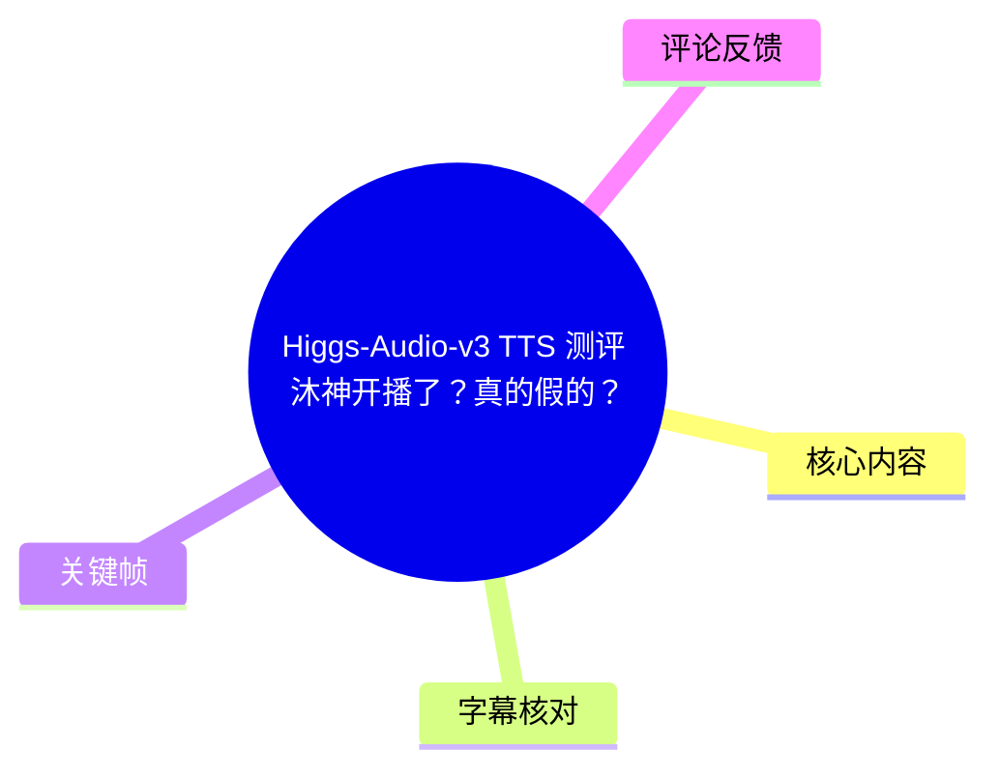
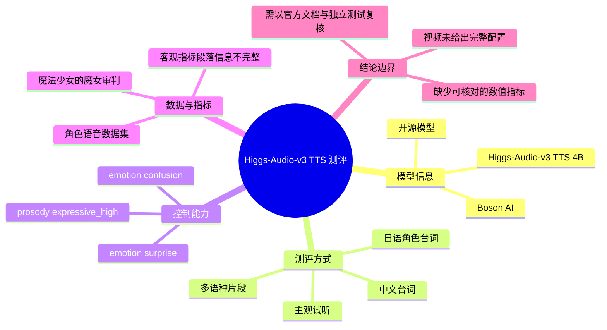
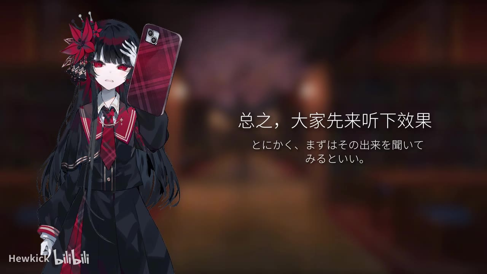
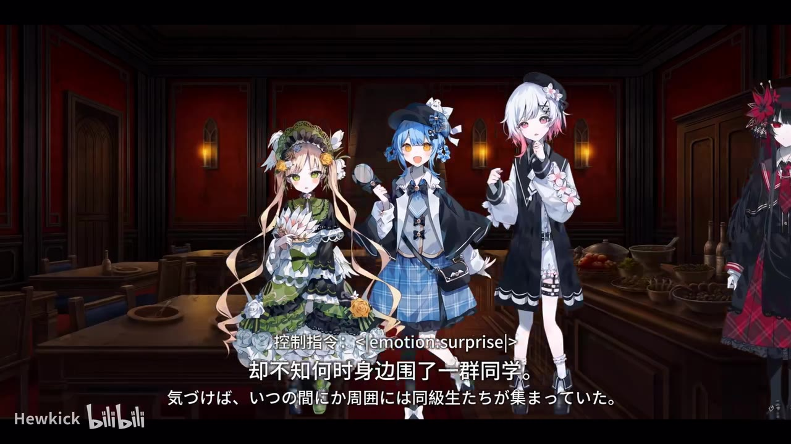
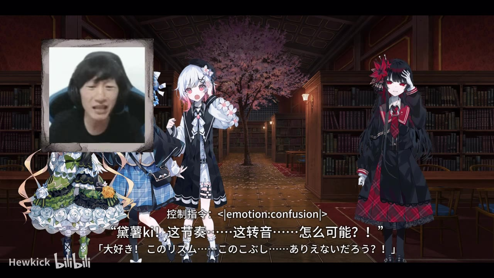
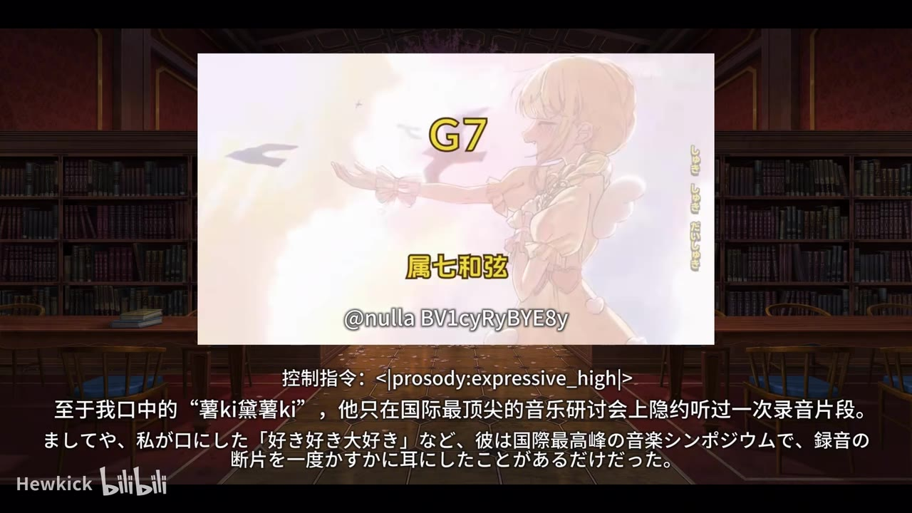

# Higgs-Audio-v3 TTS 测评: 沐神开播了？真的假的？

> 来源：[Bilibili 视频](https://www.bilibili.com/video/BV17YEZ6rEZk) 
> UP 主：Hewkick｜发布时间：2026-06-12｜视频时长：06:29｜分辨率：1920×1080

## 小结

视频对开源语音合成模型 **Higgs-Audio-v3 TTS 4B** 进行试听式测评。UP 主在开场说明，该模型已开源，且似乎支持较多控制指令；随后主要以多段日语角色台词、中文台词和带有情绪/韵律标签的样例展示合成效果。

最突出的信息是：画面明确展示了类似 `<emotion:surprise>`、`<emotion:confusion>` 与 `<prosody:expressive_high>` 的控制标签。视频的核心不是讲解部署或训练流程，而是让观众直接听角色化、多语言、带情绪指令的生成语音，以考察自然度、情绪表现和跨语种表现。

样例内容主要取自《魔法少女的魔女审判》相关角色语音/文本。视频后段口播称，后续的客观指标会使用“基于《魔法少女的魔女审判》角色语音构建的数据集”；但提供的 ASR 在约 04:40—05:49 存在长达约 69 秒的未识别区间，且没有对应的可用关键帧或站内字幕，因此不能据此补写具体指标、评分数值、图表结论或实验细节。

视频适合希望快速判断 Higgs-Audio-v3 主观听感的开发者、TTS 使用者和语音合成爱好者。若目标是复现实验或选择生产模型，仍须进一步核对官方模型卡、推理配置、许可证、硬件需求、数据集构成及独立基准，不能仅依据本视频的试听样例下结论。

时效性方面，视频发布于 2026-06-12；模型仓库、网页服务、权重版本、支持语言和推理接口均可能在发布后迭代。视频简介给出的资源为 [Hugging Face 开源地址](https://huggingface.co/bosonai/higgs-audio-v3-tts-4b) 与 [Boson AI 官网](https://www.boson.ai/higgs-audio)，访问时应以页面当时内容为准。

## 思维导图

## 目录

- [背景、模型与资源](#背景模型与资源-000007)
- [试听前的控制指令说明](#试听前的控制指令说明-000019)
- [日语角色化样例：情绪与韵律](#日语角色化样例情绪与韵律-000029)
- [多段角色台词与跨语言试听](#多段角色台词与跨语言试听-000201)
- [客观指标与数据集：已知信息及缺口](#客观指标与数据集已知信息及缺口-000429)
- [收尾补充试听与结论](#收尾补充试听与结论-000549)
- [使用与评测建议](#使用与评测建议-000007)
- [结论、限制与时效性](#结论限制与时效性-000610)
- [字幕比对](#字幕比对)
- [评论分析](#评论分析)
- [处理记录](#处理记录)

## 背景、模型与资源 [00:00:07](https://www.bilibili.com/video/BV17YEZ6rEZk?t=7)

视频开头以“Higgs-Audio-v3”作为测评对象。根据 ASR 在 00:00:07—00:00:13 的识别内容，UP 主陈述该 TTS 模型已经开源；00:00:14—00:00:18 进一步称其“似乎也支持相当多的控制指令”。这两项是视频设定测评重点的基础：

1. **开源可获得性**：简介给出了模型权重/页面链接，指向 `bosonai/higgs-audio-v3-tts-4b`。
2. **可控生成能力**：后续样例不是仅播放固定音色，而是直接在画面中展示情绪、韵律类控制标签。
3. **评价重心**：视频首先选择“听效果”，而非先展示安装环境、命令、API 或模型结构。

UP 主在简介中同时声明，自己确实从事音频方向研究，但并非专攻 TTS；这意味着视频应理解为个人试听评测，而不是官方技术白皮书或严格可复现实验报告。

### 可核对的资源

| 项目 | 视频素材中可确认的信息 |
| --- | --- |
| 模型名称 | Higgs-Audio-v3 TTS 4B |
| 开源页面 | `https://huggingface.co/bosonai/higgs-audio-v3-tts-4b` |
| 官方网站 | `https://www.boson.ai/higgs-audio` |
| 视频时长 | 389 秒（素材诊断为 388.516 秒） |
| 视频类型 | 以主观听感样例为主的测评 |
| 未在素材中确认 | 安装方式、推理命令、显存/硬件要求、许可证、精确参数量之外的架构细节、客观分数 |

## 试听前的控制指令说明 [00:00:19](https://www.bilibili.com/video/BV17YEZ6rEZk?t=19)

00:00:19—00:00:22，UP 主转入试听环节，画面文案为“总之，大家先来听下效果”。这说明接下来的判断主要依赖生成音频的实际输出，而不是抽象的功能宣称。

> 图：画面写有“总之，大家先来听下效果”，并显示视频使用的角色化视觉呈现。它明确了本段是试听开始点，而不是模型安装或参数教学环节。

视频没有提供用于这些试听样例的完整输入文本、参考音频、随机种子、生成温度、采样策略或后处理链路。因此，观看者可以把它视为“该视频中展示的输出实例”，但不能把单条音频直接等同于模型在所有输入条件下的稳定表现。

## 日语角色化样例：情绪与韵律 [00:00:29](https://www.bilibili.com/video/BV17YEZ6rEZk?t=29)

00:00:29 起，视频播放较长的日语角色台词。画面字幕为中文与日文对照，内容围绕角色演唱/叙事场景展开。ASR 将该段识别为日语，其中包括“好き好き大好き”等重复语句；由于 ASR 语言判定为日语，且画面确有日文字幕，此段语言归类较可靠。

### 画面可确认的控制标签

在样例中，画面直接叠加了控制指令，至少包含：

| 时间位置 | 画面标签 | 可确认作用 |
| --- | --- | --- |
| 约 00:00:29 之后 | `<emotion:surprise>` | 指定“惊讶”情绪的样例展示 |
| 约 00:01:07 附近 | `<emotion:confusion>` | 指定“困惑”情绪的样例展示 |
| 约 00:01:12—00:01:36 | `<prosody:expressive_high>` | 指定较强表现力/高表达性韵律的样例展示 |

这些标签证明视频至少在**展示层面**将文本控制指令与合成结果关联起来；但素材没有给出标签语法是否完整、是否支持组合、可用标签全集、权重设置方式，或标签失效时的回退机制。

> 图：画面中明确显示“控制指令：`<emotion:surprise>`”，下方为中日双语角色台词。该帧是视频关于情绪可控性的直接视觉证据，优先级高于 ASR 对中文内容的误识别结果。

> 图：画面显示“控制指令：`<emotion:confusion>`”，并以“这节奏……这转音……怎么可能？！”对应日文台词。它有助于观察视频将特定语义、戏剧性对白与“困惑”标签配对展示的方式。

> 图：画面显示“控制指令：`<prosody:expressive_high>`”。相较于前两张情绪标签图，这一帧体现视频还将控制范围延伸到韵律/表达强度，而非只区分情绪名称。

### 样例可提炼的试听维度

虽然 UP 主未在已提供的文本中逐项打分，但从样例组织形式可以提炼出其隐含考察维度：

- **长句连贯性**：00:00:29—00:01:47 是连续叙事性日语内容，适合听句间停顿、语调衔接与长文本稳定度。
- **唱念/重复短语的表现**：约 00:01:03—00:01:11 出现短促重复的“好き”“大好き”等语句，适合关注重音、节奏与情绪突变。
- **戏剧化语境下的情绪匹配**：`surprise`、`confusion` 等标签被放在具有强情绪的对白上，意在测试文字情境与声线情绪是否一致。
- **韵律表达**：`expressive_high` 所在段落更适合关注抑扬、强调和情感张力，而不能仅用字音准确率判断。

需要注意：样例人物、背景音乐、剪辑字幕和角色立绘会共同加强“角色感”。评价模型本身时，应把音频生成质量与视频包装效果区分开来。

## 多段角色台词与跨语言试听 [00:02:01](https://www.bilibili.com/video/BV17YEZ6rEZk?t=121)

00:02:01—00:04:27，视频继续播放多段角色对白。ASR 显示其中包括日语短句、角色自我介绍、对话式问答，以及一段中文台词。该结构使样例不再局限于单一长篇独白，而覆盖了不同句长、不同角色语气和不同语言内容。

### 可从时间轴确认的样例片段

| 时间 | ASR/画面可确认内容概述 | 可用于听辨的方面 |
| --- | --- | --- |
| [02:01](https://www.bilibili.com/video/BV17YEZ6rEZk?t=121) | 日语带有拒绝/敌意语气的短句 | 低时长高情绪对白的爆发力与收束 |
| [02:10](https://www.bilibili.com/video/BV17YEZ6rEZk?t=130) | 日语连续叙述句 | 中等长度句子的节奏与停顿 |
| [02:43](https://www.bilibili.com/video/BV17YEZ6rEZk?t=163) | “我是立花雪莉……”式角色自我介绍（ASR 为日文转写） | 人设化声线和介绍类台词的稳定性 |
| [03:18](https://www.bilibili.com/video/BV17YEZ6rEZk?t=198) | 一段中文内容，但 ASR 混入中文、繁体字和日语残片 | 中文发音、跨语种切换；文本转写不可靠 |
| [03:38](https://www.bilibili.com/video/BV17YEZ6rEZk?t=218) | 日语说明性台词 | 平静、信息密度较高的对白 |
| [03:47](https://www.bilibili.com/video/BV17YEZ6rEZk?t=227) | 日语讨论/投票场景对白 | 多人互动语境下的语气适配 |
| [04:03](https://www.bilibili.com/video/BV17YEZ6rEZk?t=243) | 日语威胁性/警告式短句 | 强语气句子的可懂度与情绪力度 |
| [04:13](https://www.bilibili.com/video/BV17YEZ6rEZk?t=253) | 中文评价性段落，ASR 为混合文字 | 中文自然度；转写不可作为逐字稿 |

### 关于跨语种表现的谨慎判断

热评中有观众认为其“无微调跨语种”表现优于近期不少 TTS；视频本身也确实呈现了日语与中文样例。可是，素材并**没有**提供“是否零样本”“是否没有微调”“参考音频属于何语言”“语言识别/文本规范化流程”等实验条件。

因此，能够确认的结论仅为：

- 视频展示了**至少包含日语和中文内容**的合成试听；
- 观众可以据视频音频自行主观比较跨语言听感；
- “无微调跨语种”以及相较其他模型的排名，属于评论者观点，不是该素材中已由实验设置证明的事实。

## 客观指标与数据集：已知信息及缺口 [00:04:29](https://www.bilibili.com/video/BV17YEZ6rEZk?t=269)

约 00:04:29—00:04:40，ASR 识别到 UP 主开始“展示客观指标”，并称使用了一个“基于《魔法少女的魔女审判》角色语音构建的数据集”。这是视频中关于评测数据来源最具体的口播信息。

可以谨慎整理为：

- **数据来源表述**：数据集以《魔法少女的魔女审判》的角色语音为基础构建。
- **用途表述**：用于后续的“客观指标”展示。
- **可见的评测意图**：除主观试听外，视频试图加入量化评估维度。

但 00:04:40—00:05:49 是本次 ASR 最大空白区间（约 69.09 秒），提供的关键帧中也没有该段图表、表格或界面。站内字幕同样不可用。因此，以下关键信息无法从现有素材确认：

1. 客观指标的具体名称；
2. 各项指标的数值、单位和比较对象；
3. 测试样本量、数据切分与角色数量；
4. 基线模型、推理条件与统计方法；
5. 是否使用参考音频、是否做微调；
6. 图表的最终结论，以及模型是否在全部指标上领先。

这段内容不应被“脑补”为模型跑分领先或已完成严格 benchmark。若需引用客观结论，应回看原视频 04:40—05:49 的画面，并结合发布者后续公开的评测说明核验。

## 收尾补充试听与结论 [00:05:49](https://www.bilibili.com/video/BV17YEZ6rEZk?t=349)

00:05:49—00:05:53，视频再次播放“请不要随便触碰我……不要以为我会忘记……”一类日语片段；00:05:58—00:06:08 则出现中文台词与混合语言识别结果。这个收尾前的补充试听可以理解为让观众继续通过短句判断情绪表达和中文输出。

00:06:10—00:06:12，UP 主结束本次测评；00:06:13—00:06:26 表示该系列后续还会测评更多开源 TTS 模型，并邀请观众关注。

视频没有在可核验素材中给出一个明确的总分、推荐等级或“最强模型”结论。标题中的“沐神开播了？真的假的？”具有传播性和玩梗色彩，不能据此当作身份归属、真人开播或模型能力的技术证明。

## 使用与评测建议 [00:00:07](https://www.bilibili.com/video/BV17YEZ6rEZk?t=7)

视频没有提供安装与调用步骤，以下内容是根据其展示方式整理出的**复核建议**，不是视频中已演示的操作流程。

### 1. 从官方页面确认版本与许可

先访问简介列出的 Hugging Face 与官网页面，核对：

- 当前权重名称是否仍为 `higgs-audio-v3-tts-4b`；
- 模型卡中的许可证与商业使用限制；
- 官方给出的推理框架、依赖版本和硬件需求；
- 是否支持情绪、韵律、音色、语言等控制标签；
- 控制标签的精确语法及适用模型版本。

视频画面仅证实三种标签在样例中出现，不能据此推导所有标签均可用，也不能假定标签格式永远兼容。

### 2. 以可复现条件重做试听

针对视频重点，建议至少固定以下变量：

| 维度 | 建议做法 | 原因 |
| --- | --- | --- |
| 测试文本 | 分别准备短句、长句、数字、专名、情绪对白 | 避免只以单类文学台词判断模型 |
| 语言 | 日语、中文分别测试；再测试语言切换 | 视频含两类语言，但条件未公开 |
| 参考音频 | 明确是否使用、时长、语言及音质 | 这会显著影响音色克隆和跨语种结果 |
| 标签 | 对照“无标签 / 单标签 / 组合标签” | 才能判断控制指令是否真实有效 |
| 推理参数 | 记录采样参数、温度、随机种子、版本号 | 保证不同模型之间比较公平 |
| 音频后处理 | 明确响度、降噪、压缩、背景音乐处理 | 避免后期影响主观结论 |

### 3. 建立主观与客观的双轨评价

仅凭“像不像角色”容易受偏好影响。可将评价拆分：

- **主观维度**：自然度、清晰度、情绪贴合度、音色相似度、长句稳定性、跨语种可懂度。
- **客观维度**：应明确指标定义、计算工具、测试集来源、样本量、基线和置信区间。
- **风险检查**：专名误读、数字与日期读法、文本规范化、情绪标签过拟合、爆音/断句，以及长文本累积失真。

视频提到了客观指标与角色语音数据集，但由于核心细节在现有 ASR 空白段内，不能替视频补充具体实验方案。

## 结论、限制与时效性 [00:06:10](https://www.bilibili.com/video/BV17YEZ6rEZk?t=370)

### 可确认结论

1. 视频测评的对象是开源的 **Higgs-Audio-v3 TTS 4B**。
2. 视频以样例试听为主要证据，覆盖日语和中文内容。
3. 画面明确展示了 `<emotion:surprise>`、`<emotion:confusion>`、`<prosody:expressive_high>` 等控制指令。
4. UP 主称后续客观指标采用了基于《魔法少女的魔女审判》角色语音构建的数据集。
5. 该频道计划继续测评更多开源 TTS 模型。

### 重要限制

- 没有站内字幕，无法交叉验证逐字口播。
- 本次 ASR 被自动判为日语，中文段落出现明显混杂、错字和语言漂移，不能作为精确文本引用依据。
- 04:40—05:49 缺少可用 ASR 内容，是与客观指标有关的关键缺口。
- 素材没有提供推理命令、参考音频、实验控制变量、完整参数或指标数值。
- 视频样例使用角色素材与剪辑包装，适合主观参考，不等于通用场景的性能保证。
- 热评中关于“最强”“优于其他模型”“零样本更强”的表述均未在视频素材中得到独立验证。

### 时效性

本条视频元数据的发布时间为 2026-06-12，抓取时间为 2026-08-04。TTS 模型的权重、网页演示、推理代码、标签集合、许可证和排行榜会快速变化。对模型选型、商业接入或研究引用，应以官方仓库当前提交记录、模型卡与可复现实验为准。

## 字幕比对

| 字幕来源 | 完整性 | 专有名词 | 时间轴 | 主要问题 |
| --- | --- | --- | --- | --- |
| Bilibili 站内字幕 | 未提供可用字幕 | 无法核验 | 无法使用 | 素材明确标注“未提供可用站内字幕” |
| 本次 ASR 字幕 | 有 30 段，覆盖约 234.66 秒，占视频约 60.4% | `Higgs-Audio-v3`、角色名及部分中文内容存在识别不稳 | 有真实 SRT 起止时间，可用于定位 | 自动识别语言为日语（置信度约 0.739）；中文/中日混读段误识别明显；04:40—05:49 有约 69 秒空白 |

### 最终字幕选择与校正原则

最终以**本次 ASR 的真实时间戳**作为章节时间轴依据，但不把其错识别文字视为逐字事实。原因如下：

- 未提供站内字幕，无法采用站内 SRT；
- ASR 文件明确包含时间戳，且没有 `noAudioStream=true` 标记，说明源视频存在音轨，本次 ASR 也确实识别出了有效语音段；
- ASR 的日语判定与前段画面中的日文字幕相符，但在中文段和混合语种段可靠性下降；
- 对控制标签、中文对照字幕、样例性质等信息，优先使用关键帧中的可见画面进行校正。

### 通过画面校正的重要信息

| 信息 | ASR 状态 | 画面校正依据 |
| --- | --- | --- |
| 模型主题 | 将模型名转写为日文近似音 | 视频标题、开场内容及元数据确认是 Higgs-Audio-v3 TTS |
| 情绪控制 | ASR 未完整保留标签 | 关键帧直接显示 `<emotion:surprise>`、`<emotion:confusion>` |
| 韵律控制 | ASR 未完整保留标签 | 关键帧直接显示 `<prosody:expressive_high>` |
| 中文台词 | 多处混入日文、繁简混写和不连贯文本 | 仅概述其为中文/混合语言样例，不作逐字引用 |
| 客观指标段 | 04:40—05:49 无识别内容 | 明确标注信息缺口，不编造图表或分数 |

## 评论分析

以下仅处理可获取的热评前三条；评论均为观众观点，不可替代模型卡、实验报告或独立测试。

| 热评 | 点赞 | 观点概括 | 可参考之处与限制 |
| --- | ---: | --- | --- |
| `zxyzxy123` | 10 | 认为其他方面不一定听得出差异，但“无微调跨语种”能力在近期 TTS 中算较好，并猜测可能和参数量有关。 | 该评论提示跨语种可能是观众感受到的优势；但“无微调”条件、参数量与性能的因果关系均未由视频实验公开证明。 |
| `foreverSR` | 4 | 推荐日语 TTS 使用者关注 `irodori tts`，并称其已到 v3。 | 这是一条替代模型线索，而非对 Higgs-Audio-v3 的直接评测。若要横向比较，应统一文本、参考音频、语言和推理配置。 |
| `ajlsunset` | 4 | 主观上认为该模型可能是自己听过最强的 TTS，并称其 zeroshot 或许优于 Fish Audio 和经微调的 GSV。 | 反映了部分用户对零样本音色/跨语言效果的高度评价；但比较没有给出测试条件、版本号、样本量或盲听设计，不能视为已验证排名。 |

整体看，热评讨论集中在三个方向：**跨语种能力、日语 TTS 的替代选择、零样本能力与竞品比较**。这些议题很适合作为后续实测的测试清单，但不构成可直接引用的性能结论。

## 处理记录

- Worker ID：`worker-mrj0wbly-5dc4e50c`
- 模型：`gpt-5.6-terra`
- 调用工具与素材：视频元数据、ASR 时间轴字幕（`asr/transcript.srt`）、ASR 分段诊断（`asr/asr-result.json`）、已提供关键帧、热评数据。
- 字幕选择：未提供可用 Bilibili 站内字幕；检查并采用本次 ASR 的 SRT 时间戳作为定位基础。ASR 未标记 `noAudioStream=true`，因此按“存在音轨但语种识别/转写质量有限”处理。
- ASR 诊断：识别模型为 `large-v3-turbo`，自动语言为日语，语言概率约 `0.7393`；共 30 段，语音覆盖约 `60.4%`；最大未识别间隔为 04:40—05:49，约 `69.09` 秒。
- 关键帧选择依据：选用 `frame-001.jpg` 说明试听开始；选用 `frame-002.jpg`、`frame-003.jpg`、`frame-004.jpg` 作为情绪与韵律控制标签的直接画面证据。未对未提供画面的指标段落作图表推断。
- 缓存清理：未提供缓存清理执行日志；本文不声称已执行文件删除或缓存清理。
- 未解决问题：客观指标的名称、数值、基线模型、测试集规模和推理配置无法从现有字幕与关键帧确定；中文样例的逐字内容也因 ASR 混合识别而无法可靠转写。
