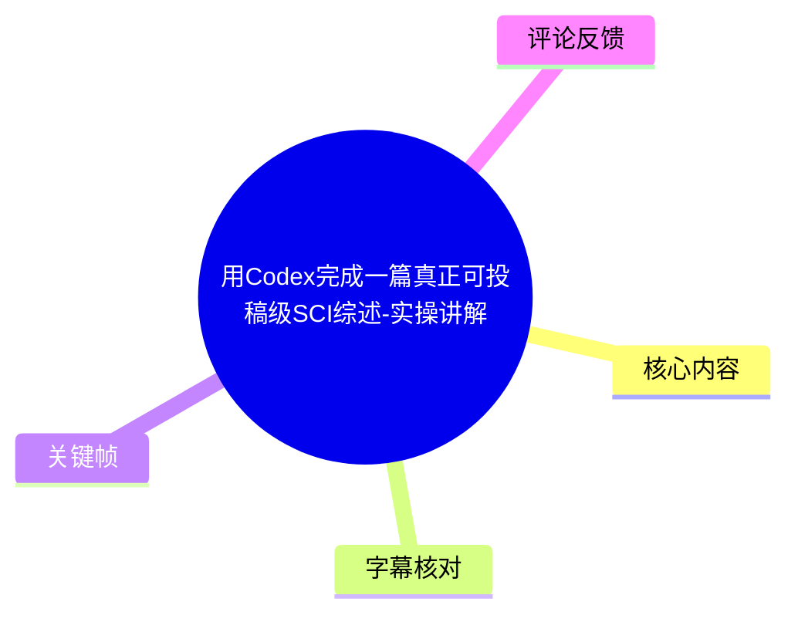
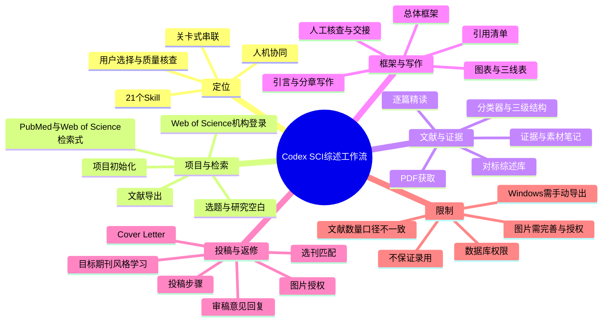
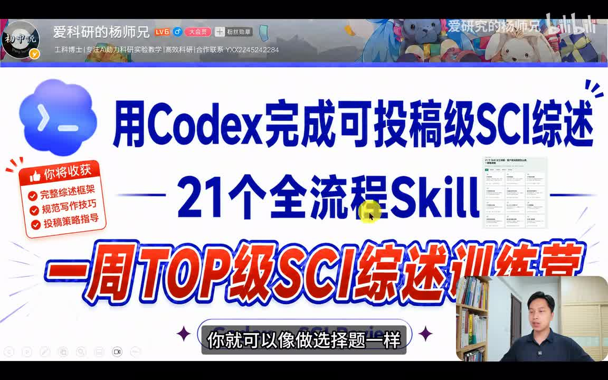
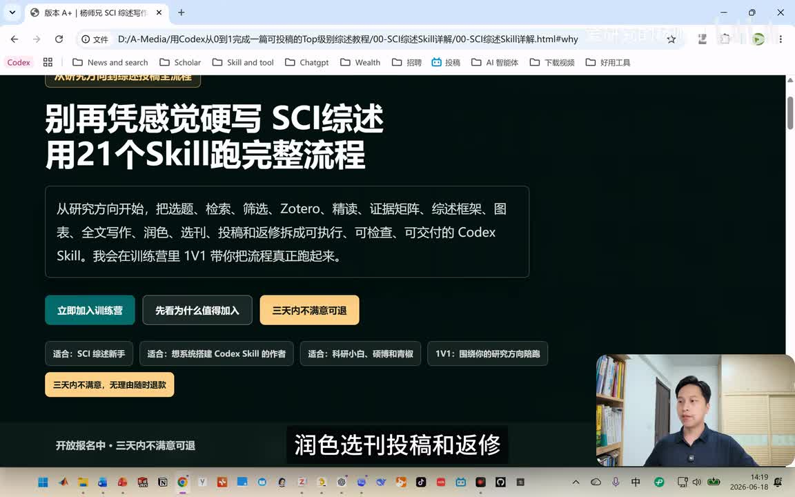
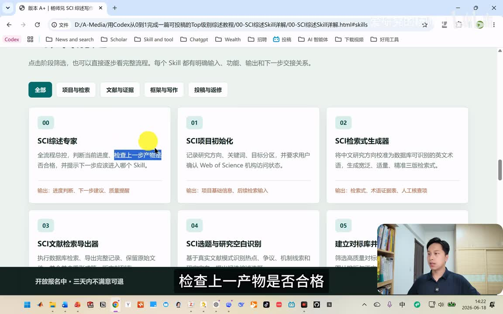
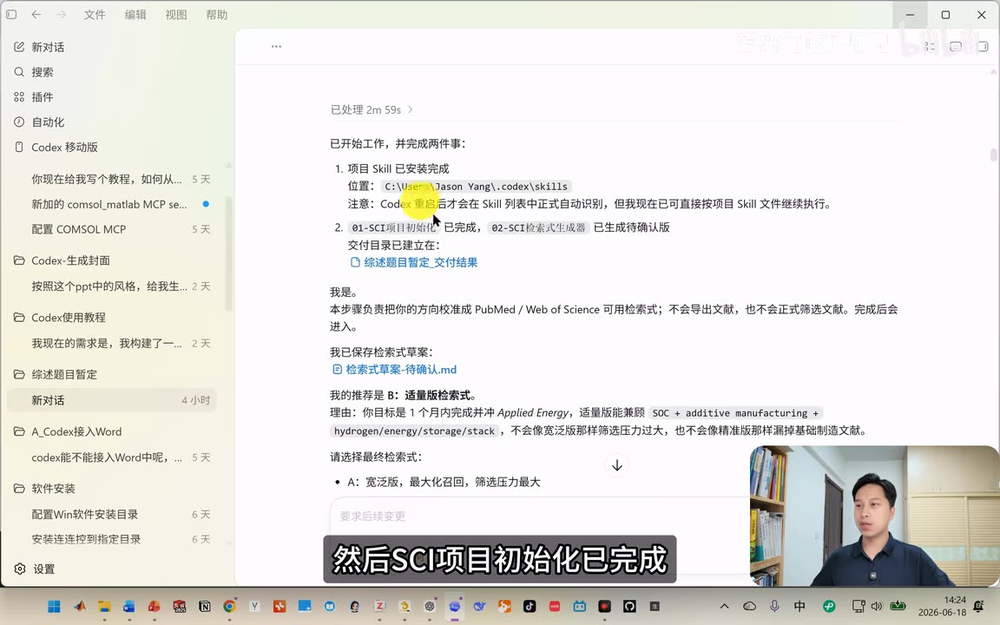
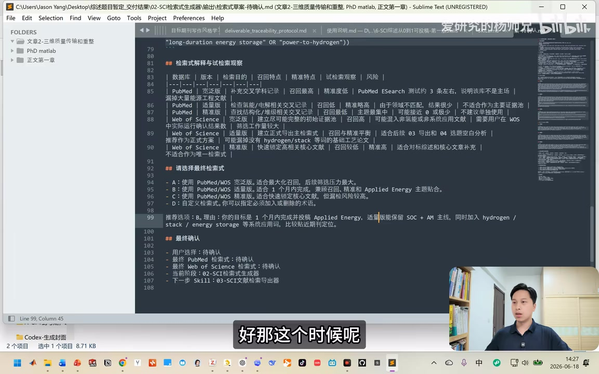
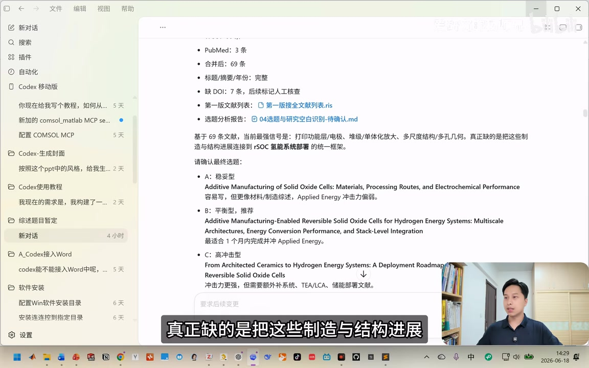

# 用Codex完成一篇真正可投稿级SCI综述-实操讲解

> 来源：[Bilibili 视频](https://www.bilibili.com/video/BV1ZEjz6nEQh) 
> UP 主：爱研究的杨师兄｜时长：16 分 08 秒｜合集：AIcode  
> 视频主张：以 21 个 Codex Skill 串联 SCI 综述从项目初始化、检索、精读、写作、选刊到返修的流程；视频展示的是一套工作流与案例，并非投稿接收的保证。

## 小结

视频演示了一套由 UP 主开发、称为“21 个全流程 Skill”的 Codex 工作流。其核心不是让模型仅凭一个题目直接生成综述，而是将综述生产拆分为可交付、可检查、依赖上一步产物的环节：研究方向与数据库访问确认、检索式生成、文献检索与导出、研究空白识别、对标综述学习、文献分类与 PDF 精读、证据与框架构建、图表和正文生成、目标期刊适配、投稿材料准备及审稿意见回复。

工作流强调“人机协同”和“关卡式推进”：每一步完成后都生成文件夹或交付物，用户需要在关键节点确认方案、选择检索范围/选题/期刊，并核查质量后再进入下一步。视频将用户角色概括为“做选择题和质量核查”，但实际仍存在数据库机构访问、Windows 端导出、PDF 获取、图片再加工、引用与版权核验等人工责任。

案例参数存在两处口径：开场称演示使用 **40 篇文献**，后段又称展示稿使用 **50 篇 SCI 文献**；视频还称 Skill 可处理或限定至 **500 篇文献**。这些均是视频陈述，不能据此推断系统在所有主题、数据库权限、期刊要求下都能稳定产出可接收稿件。

方法上的关键价值是把可追溯性前置：检索式给出候选版本，文献按综述逻辑分级，精读产出笔记与素材，图表标注来源论文与原图，正文保留引用、人工核查清单和下一步交接记录。对于需要写综述的研究者，这比“一键生成全文”更接近可审查的研究写作流程。

视频也有明显的商业推广与时效性内容：UP 主引导加入知识星球训练营，称可取得 Skill、教程、环境配置说明及 Mac/Windows 安装包；简介称训练营入口位于外部链接，并承诺“三天内不满意可退款”。这类价格、入口、课程资源、Codex 产品能力、数据库页面、期刊指标和投稿规则都可能变化，应在使用前以官方页面和目标期刊 Author Guide 为准。

## 思维导图

## 目录

- [定位、演示范围与适用边界](#定位演示范围与适用边界)
- [21 个 Skill 的总体架构](#21-个-skill-的总体架构)
- [项目初始化、检索式与文献导出](#项目初始化检索式与文献导出)
- [选题、对标学习、分类与精读](#选题对标学习分类与精读)
- [框架、图表、正文与引用管理](#框架图表正文与引用管理)
- [选刊、期刊适配、投稿与返修](#选刊期刊适配投稿与返修)
- [操作清单、参数与限制](#操作清单参数与限制)
- [字幕比对](#字幕比对)
- [评论分析](#评论分析)
- [处理记录](#处理记录)

## 定位、演示范围与适用边界

### [视频承诺与演示口径](https://www.bilibili.com/video/BV1ZEjz6nEQh?t=0)

开场称，案例由 Codex 从零到一完成图片制作、综述写作及参考文献插入；演示样本使用 40 篇文献，而正常写综述可能需要数百篇文献。随后视频称，安装 21 个全流程 Skill 后，可按流程“像做选择题一样”完成一篇“可投稿级别”的 SCI 综述。

这里应区分三层含义：

1. **视频展示的能力**：一套由多个 Skill 组成的流程、交付物样式和一个能源主题案例。
2. **视频的作者主张**：经过分步检索、精读、引用和人工核查的结果，较单提示词生成更接近可投稿稿件。
3. **不能直接推出的结论**：并不能仅凭演示证明稿件已通过同行评审、图表版权已获授权、引文无误，或任何研究主题都能获得期刊接收。

> 图：封面集中呈现视频主题、21 个 Skill 和训练营定位，适合用于理解本视频是工作流总览与课程推广性质的演示，而非一篇具体综述论文的完整答辩。

### [训练营与资源获取说明](https://www.bilibili.com/video/BV1ZEjz6nEQh?t=30)

视频称详细操作视频、综述 Skill、配套教程、GPT 注册和 Codex 安装说明放在训练营中；并提到可通过简介链接或蓝链加入。元数据简介另写有外部链接，并声明“不满意三天内可全额无理由退款”。

这些信息属于视频发布时的推广信息，存在明显时效性：

- 外部链接、收费方式、退款承诺与资源可用性可能变化；
- “免费获取”的表述在视频末尾对应的是加入训练营后获取资源，不应自动理解为无需任何前置成本；
- Codex、GPT 订阅、安装包和平台可用性应以服务方当前官方文档为准。

> 图：画面显示课程页面及其宣传条款，能够帮助读者将工作流演示与其训练营销售/服务背景区分开。

## 21 个 Skill 的总体架构

### [四大类与总控机制](https://www.bilibili.com/video/BV1ZEjz6nEQh?t=164)

UP 主将 21 个 Skill 划分为四类：

| 类别 | 视频列举的范围 |
| --- | --- |
| 项目与检索 | 项目初始化、检索式生成、检索与导出、选题和研究空白识别等 |
| 文献与证据 | 对标库、文献筛选分类、PDF 获取、精读、证据相关产物 |
| 框架与写作 | 综述框架、图表、正文撰写、润色与引用管理 |
| 投稿与返修 | 选刊、目标期刊适配、投稿材料、投稿指导、审稿意见回复 |

视频还展示编号 **00** 的“SCI 综述专家”作为全流程总控：判断当前进度、检查上一步产物是否合格，并提示应进入的下一 Skill。正式执行从 **01 SCI 项目初始化**开始。

> 图：该关键帧直接显示 Skill 的编号、分类筛选项和部分输入/输出说明，是理解“总控 + 分步交付”结构的主要视觉证据。

### [推进规则：完成、交付、确认，再进入下一步](https://www.bilibili.com/video/BV1ZEjz6nEQh?t=110)

视频强调，只有当前 Skill 完成，才会推进下一个 Skill；每一步会在项目文件夹中交付结果。此设计把流程控制为：

1. 当前 Skill 接收上一步的项目资料或用户确认；
2. 生成可查看的草案、报告、表格、文件或目录；
3. 用户检查、选择或补充资料；
4. 总控判断是否进入后续步骤。

这是一种**工作流约束**，而不是自动化正确性的证明。是否“合格”仍需要研究者依据主题、证据质量、期刊规范和事实准确性判断。

> 图：画面展示了“待确认版”交付物与检索方案 B 的提示，说明视频所谓“选择题式”操作的具体交互形态：系统提出方案，用户确认或修改。

## 项目初始化、检索式与文献导出

### [01：记录研究设定并确认数据库访问](https://www.bilibili.com/video/BV1ZEjz6nEQh?t=188)

项目初始化的目标是记录：

- 研究方向；
- 关键词；
- 目标分区；
- 目标期刊；
- Web of Science 机构访问状态。

视频演示中，Skill 打开 Web of Science 页面，要求用户完成机构登录并回复确认。UP 主解释，后续需要在 **PubMed** 或 **Web of Science** 中检索大量文献、阅读摘要并识别研究空白，因此机构登录是权限前提。

**限制：**视频仅说明需要机构登录，并未证明所有学校/机构都拥有相同数据库订阅或导出权限。没有权限时，流程不能简单等同于自动可运行。

### [02—03：生成检索式、用户选择并导出检索结果](https://www.bilibili.com/video/BV1ZEjz6nEQh?t=260)

检索式生成器会对研究方向、目标期刊和核心概念进行拆解，生成：

- PubMed 检索式；
- Web of Science 的多个版本检索式；
- 术语/证据相关表；
- 待确认的检索方案。

演示称系统列出 A、B、C、D 等选项，并推荐 **B**。UP 主以“一个月内完成并投稿”的目标为例，选择相对适量的检索方案，以保留 **SOC、增材制造、hydrogen/energy/storage/stack** 等主题主线。这里的具体关键词来自画面和语音演示，只能视为该案例的检索思路，而非通用检索模板。

后续文献检索和筛选在视频中被描述为可自动执行；但平台差异很关键：

- **Mac 用户**：视频称可“全程不用手动”完成；
- **Windows 用户**：视频明确称不能使用该自动方式，需要手动完成 Web of Science 导出；
- 导出后，文献被导入 **Zotero**（站内字幕中为“DETEL”等误识别，结合画面/上下文校正为 Zotero）。

因此，实际操作前应先验证本机操作系统、浏览器自动化能力、数据库导出格式、Zotero 导入结果以及重复文献清理情况。

### [04：基于检索结果识别空白并选择题目](https://www.bilibili.com/video/BV1ZEjz6nEQh?t=393)

在案例中，系统进入“SCI 选题与研究空白识别”。视频给出的示例空白是：缺少将“制造与结构进展”连接至 **RSOC 氢能系统部署**的统一框架。

系统给出若干题目方案，视频将其概括为：

- 稳妥型；
- 平衡型；
- 高冲击型；
- 另有可自定义的选项。

UP 主在演示中选择 B“稳妥型”。这个步骤的价值在于要求用户在检索结果基础上选择定位，而不是直接让模型断言“研究空白”。但研究空白是否真实成立，仍应通过系统综述式检索、最新文献核验及领域专家判断确认。

## 选题、对标学习、分类与精读

### [05—07：建立对标综述库、分类并获取 PDF](https://www.bilibili.com/video/BV1ZEjz6nEQh?t=441)

第 05 步建立高质量对标综述库并进行“深度学习”，目的是学习优秀综述的组织方式，为后续搭建框架服务。案例中展示了 **10 篇对标综述文献**，用户需要先获取对应 PDF，再向系统确认“已获得对标综述的 PDF”。

随后进入文献筛选分类器。视频称分类结构按优秀综述的构思建立，案例采用三级分类，例如一级编号 01—06，下设二级、三级条目。之后进入第 07 步导入并获取 PDF。

这一阶段的关键经验是：**对标库用于学习组织与表达结构，不应替代对主题原始研究的独立判断。**此外，PDF 的来源合法性、版本完整性、是否可机器读取、补充材料是否缺失，均会影响后续精读质量。

### [08：逐篇精读形成可追溯的综述素材](https://www.bilibili.com/video/BV1ZEjz6nEQh?t=537)

第 08 步针对已获得 PDF 的文献进行逐篇精读，生成：

- 文献精读笔记；
- 综述素材笔记；
- 对应材料/证据的文献条目。

UP 主特别反对只给一个主题、直接要求 AI 写一篇综述的做法，认为这类结果往往不可用；他将分步获取 PDF、精读、提取证据的过程描述为人机协同的基础。

视频同时提到图片来自既有文献，系统会获取后排版，并承认后期还需要人工把图片“建立得更完善”。这意味着图像部分至少有两类未自动解决的问题：

1. **学术表达问题**：图是否准确表达该综述的论点，是否应重绘而非拼接；
2. **版权合规问题**：转载、改编、组合图通常可能需要按出版商政策取得许可或使用合规授权素材。

### [为什么“有来源”仍不等于可直接投稿](https://www.bilibili.com/video/BV1ZEjz6nEQh?t=562)

视频认为逐步构建的结果更具投稿可能性，理由包括图片有来源、每一步有产物、可人工核查。这个判断有实践价值，但应补充以下边界：

- 引用到文献不等于该文献能支持当前表述，仍需逐条核对论断、数据、条件和因果关系；
- AI 汇总可能遗漏负面结果、领域争议、时间范围或实验边界；
- 引用原图或改编图要核对版权、署名和许可；
- “可投稿”只表示可以准备投稿材料，不等于符合期刊范围、可通过编辑初筛或同行评审。

## 框架、图表、正文与引用管理

### [总体框架与第 10 步图表系统](https://www.bilibili.com/video/BV1ZEjz6nEQh?t=586)

完成精读后，系统先形成综述总体框架。视频列举的框架信息包括：

- 拟定题目；
- 中文工作题目；
- 目标期刊倾向；
- 核心定位；
- 证据基础；
- 全文建议结构。

第 10 步将框架、图片排版与图表引用结合，生成图表系统与初稿。案例共制作 **7 个图**，视频称图的数量会随文献数量变化。每个图标注来源论文和来源图号，用户再进行重新排版。

> 图：该阶段是从“文献证据”转到“论文可视化产物”的关键节点。其价值不在于证明图已可发表，而在于显示来源标注应成为图表整理的必要字段。

### [三线表、引言和分章写作](https://www.bilibili.com/video/BV1ZEjz6nEQh?t=658)

视频称三线表会被自动放入 Word 文档，并附有具体文献出处。图表完成后开始撰写第一章引言，内容应覆盖：

- 背景；
- 重要性；
- 研究空白；
- 综述目的；
- 综述范围。

随后，系统为第一章生成初稿，并在文中标出引用的期刊或文献；全文完成后建立引用清单/参考文献。视频还展示“人工核查清单”和“下一步交接记录”，强调修改和检查后才推进。

建议将人工核查具体化为以下可执行项目：

| 核查对象 | 最低核查要求 |
| --- | --- |
| 题目与范围 | 是否与检索式、纳入文献、目标期刊 scope 一致 |
| 每个关键论断 | 是否能定位到原始文献的具体证据，而非仅有泛化引用 |
| 数据与单位 | 是否与原文一致，跨文献比较是否满足可比条件 |
| 图表 | 图号、来源、许可、改编说明、图注与正文是否一致 |
| 参考文献 | 文献真实性、作者、年份、DOI、引文位置与格式是否正确 |
| AI 文本 | 是否有幻觉式事实、过强因果、陈旧信息、模板化表达 |
| 期刊合规 | 字数、图表数、参考文献格式、声明与作者要求是否满足 |

### [形成完整初稿：章节衔接、讨论、局限与结论](https://www.bilibili.com/video/BV1ZEjz6nEQh?t=730)

视频称第一章完成后继续写第二章，并撰写主体讨论、局限性、未来展望和结论，形成综述初稿第一版。

这一顺序体现一个可迁移经验：**先建立证据结构和框架，再输出章节，而不是先追求流畅全文。**不过，章节间“衔接”不应只靠语言润色；更重要的是确保各节之间没有重复、证据层级一致、局限性没有被结论夸大掩盖。

## 选刊、期刊适配、投稿与返修

### [选刊评估与 Applied Energy 对标](https://www.bilibili.com/video/BV1ZEjz6nEQh?t=754)

综述初稿形成后，视频进入选刊。系统被描述为会检查：

- 稿件与期刊匹配度；
- 分区；
- 影响因子；
- APC；
- 综述接收情况；
- 投稿风险。

演示中系统给出 6 个候选期刊，用户自行选择；UP 主案例选择 **Applied Energy**。随后系统下载该期刊近 5 年的高质量综述，案例中选择 **5 篇**，提取标题、摘要、正文、图表及投稿格式偏好，生成目标期刊写作风格学习报告。

视频称该报告识别当前稿件与 Applied Energy 的差距，并给出 **16 条适配建议**，分为“必须修改”“优先修改”等，再对初稿进行逐章、逐段、逐句的学术润色和期刊风格适配。

必须注意，影响因子、APC、分区、综述接收情况、栏目策略和编辑偏好均有时间敏感性。任何选刊结论都应在投稿当天到期刊官网复核，尤其是：

- 期刊是否接收非邀约综述；
- 是否需要 presubmission inquiry；
- 文章类型及字数/图表限制；
- 开放获取费用；
- 图像版权、利益冲突、数据可用性等声明要求。

### [文献数量、版权、Cover Letter 与投稿步骤](https://www.bilibili.com/video/BV1ZEjz6nEQh?t=827)

视频后段称，案例最终只用了 **50 篇 SCI 文献**，而 Skill 限定为 **500 篇文献**，并据此表示大型综述也可处理。与开场的 40 篇演示文献存在口径差异，实际项目应明确记录：

- 初始检索结果数；
- 去重后数量；
- 标题摘要筛选数量；
- 获取全文数量；
- 最终纳入数量；
- 对标综述数量；
- 用于图表和关键结论的核心证据数量。

视频明确提醒图片引用需要申请权限；这是该流程中最重要的合规提醒之一。之后系统可生成 Word 版 **Cover Letter**，并指导投稿：进入投稿系统、新建投稿、填写稿件信息、按顺序上传文件、推荐审稿人等。

> 图：画面将流程延伸到写作之后的选刊、投稿和返修，帮助理解该方案不是仅做“生成初稿”，但也提示其中含有课程服务与后续人工执行环节。

### [审稿意见回复与最终用户责任](https://www.bilibili.com/video/BV1ZEjz6nEQh?t=875)

最后一个 Skill 用于审稿意见回复：对意见逐条拆解，形成礼貌、具体、有证据支撑的回复和修改说明。视频把整个流程总结为：用户主要做选择题和质量核查。

更稳妥的执行原则是：

1. 不把 AI 生成的回复直接提交；
2. 每一条 reviewer comment 都应对应“接受/部分接受/说明不修改”的清晰决策；
3. 修改稿中的具体位置、行号、图表或参考文献变动要可追踪；
4. 对不同意的意见，应提供证据和专业解释，而不是模板化反驳；
5. 作者本人对数据、事实、引用、图像权利和署名承担最终责任。

## 操作清单、参数与限制

### [按视频可复现的流程清单](https://www.bilibili.com/video/BV1ZEjz6nEQh?t=81)

以下按视频展示顺序整理；未展示的具体命令、文件格式、自动化配置与完整 21 项名称，不能补造。

1. 安装 21 个 Skill，并确认 Skill 能被 Codex 识别。
2. 建立 SCI 项目：录入研究方向、关键词、目标分区/期刊。
3. 在 Web of Science 完成机构登录，并确认数据库访问可用。
4. 生成 PubMed、Web of Science 等数据库的检索式草案。
5. 在候选检索方案中选择或自定义方案，保存检索记录。
6. 执行检索、筛选并导出文献；Windows 环境按视频需要人工导出。
7. 将结果导入 Zotero。
8. 基于检索结果识别研究空白，选择稳妥型、平衡型、高冲击型或自定义选题。
9. 建立对标综述库，获取对标综述 PDF 并生成学习报告。
10. 按对标框架对主题文献进行筛选和三级分类。
11. 获取纳入文献 PDF，逐篇精读并生成证据/素材笔记。
12. 形成拟题、定位、证据基础和全文结构。
13. 制作带来源标注的图表及三线表，人工复核并处理图像版权。
14. 撰写引言、主体讨论、局限、展望和结论，维护引用清单。
15. 依据匹配度、分区、影响因子、APC、接受情况和风险选刊。
16. 选定期刊后，分析该刊近年综述并进行风格适配。
17. 准备图像授权、Cover Letter 和投稿系统所需文件。
18. 投稿后逐条回复审稿意见，记录修改及证据依据。

### [视频明确出现的数量与环境参数](https://www.bilibili.com/video/BV1ZEjz6nEQh?t=826)

| 项目 | 视频信息 | 使用时的解释 |
| --- | --- | --- |
| Skill 数量 | 21 个全流程 Skill | 视频自述；仅展示了其中部分编号与功能 |
| 流程分组 | 4 大类 | 项目与检索、文献与证据、框架与写作、投稿与返修 |
| 演示文献数 | 开场称 40 篇；后段称 50 篇 SCI 文献 | 两处不一致，应以具体项目清单为准 |
| 正常综述规模 | 可能数百篇 | 是视频的经验性表述 |
| Skill 文献上限 | 称限定为 500 篇 | 未展示性能测试、硬件要求或失败边界 |
| 对标综述库 | 演示称 10 篇 | 用于前期学习 |
| 目标期刊对标 | Applied Energy，近 5 年 5 篇综述 | 仅为案例，不是通用选刊建议 |
| 期刊适配建议 | 16 条 | 案例输出，具体内容未完整展示 |
| 图数量 | 7 个图 | 视频称随文献数量变化 |
| 操作系统差异 | Mac 可自动；Windows 需手动导出 Web of Science | 仅为视频所述环境表现，需自行测试 |
| 引用图片 | 需申请权限 | 明确的投稿合规要求 |

### [关键限制与时效性](https://www.bilibili.com/video/BV1ZEjz6nEQh?t=923)

- **数据库与访问限制**：检索依赖 PubMed、Web of Science 等；机构登录、订阅与导出权限是前提。
- **平台限制**：视频称 Windows 需手动导出，自动化程度不等同于跨平台一致。
- **来源与版权限制**：图像有来源不等于拥有复用权；视频自身也提示图片引用需申请权限。
- **人工核查不可省略**：视频展示核查清单与交接记录，说明模型输出仍需审查。
- **文献规模并非质量保证**：40、50、500 篇均只是演示或系统口径；真正关键是检索策略、纳排标准、证据质量和论证完整性。
- **“可投稿级”不等于“可录用”**：编辑初筛、同行评审、邀请制度与期刊范围均会影响结果。
- **时效性**：本视频发布时间为 2026 年 6 月；训练营链接、退款规则、软件安装流程、数据库界面、期刊指标与 APC 可能在之后变化。

## 字幕比对

| 字幕来源 | 完整性 | 专有名词 | 时间轴 | 主要问题 |
| --- | --- | --- | --- | --- |
| Bilibili 站内字幕 | 覆盖 00:00:00—00:16:07，完整度高 | 大部分语义可用，但存在“DETEL”“web34”“A/C综述”等错词 | 分段细，起止时间与视频全程吻合 | 多个英文工具、期刊和缩写被音译或误识别 |
| 本次 ASR（medium） | 诊断显示语音覆盖约 96.38%，但首段从 00:00:30 开始 | 专名错误更密集，如“AboveSense”“Lutail”“A4A/SCA”等 | 有时间戳，但与站内字幕相比整体错位：首段内容已含开场却从 30.66 秒起 | 分段很长、前 30 秒时间错位，专有名词和中文词语误识别较多 |

最终正文采用 **Bilibili 站内字幕的时间轴**，并以本次 ASR 进行完整检查和交叉比对；没有使用 ASR 的时间戳定位章节，因为其开场时间相对站内字幕明显错位。ASR 诊断未标记 `noAudioStream=true`，且报告存在音频、中文识别概率约 0.9995，因此源视频**有音轨**，并非无音轨视频。

结合站内字幕、ASR 上下文和关键帧，对重要名词作如下校正：

| 原始字幕中的常见误识别 | 正文采用 | 校正依据 |
| --- | --- | --- |
| codex / Codec / CodeX | Codex | 视频标题、画面与上下文一致 |
| scale / SGO / Scales | Skill | 标题、关键帧卡片和网页均显示 Skill |
| web34 / WebSense / AboveSense | Web of Science | 站内语义、数据库上下文及画面 |
| pop MAD | PubMed | 与 Web of Science 并列的常用文献数据库 |
| DETEL / Lutail / RTL | Zotero | 视频流程中“导入文献管理器”的上下文；该处属基于上下文的审慎校正 |
| apply energy / play energy | Applied Energy | 视频后段明确展示和读出该期刊名 |
| Cabletter / Coverlite | Cover Letter | 投稿材料语境与英文常用名称 |
| ACI / SCA / A4A 综述 | SCI 综述 | 视频标题与全程主旨一致 |
| RSOC | RSOC | 以站内字幕为准；视频未提供该案例的完整技术展开，正文不延伸解释其具体含义 |

## 评论分析

仅分析当前可获取的热评前三条；评论是个人意见或经验，不能直接当作已核验事实。

1. **东子想长胖弈点（3 赞）：“捞钱捞麻了，无语”**  
   - 观点：认为视频/训练营商业化色彩过强。  
   - 关联：视频确实多次引导训练营、外链和课程资源，元数据简介也包含外部链接与退款表述。  
   - 可信度边界：这是对商业模式的价值判断，并未提供价格、交付质量或退款执行情况的可核验细节。

2. **守岸羊（25 赞）：“别生产学术大粪了行吗”**  
   - 观点：担忧 AI 批量生成低质量学术文本，损害研究生态。  
   - 关联：视频反复主张可生成“可投稿级”综述，确有被误用为一键批量生产的风险。  
   - 补充：视频本身也强调 PDF 精读、来源标注、人工核查和图片完善；这些环节若被跳过，评论所担忧的低质量风险会明显上升。

3. **萝莉小甜虾（667 赞）**  
   - 观点与经验：自称曾在 npj 副刊担任数年小编辑，提醒普通博士生向高质量期刊突投综述可能遭遇 desk reject；建议可先向编辑部或编辑发送选题意向与约 500—800 字摘要，若获认可再在约 6 个月内投稿全文；同时认可 AI 可用于语法梳理，但认为英文逻辑可能教条。  
   - 价值：该评论补充了视频中较少展开的“非邀约综述投稿风险”和 presubmission inquiry 思路，也提示语言润色不等于学术论证成熟。  
   - 可信度边界：评论者身份、期刊流程、时间周期和“接收率很高”等说法无法由现有素材独立验证；不同期刊对综述邀约、预投稿咨询和接受率的政策差异很大，应以目标期刊官方指南及编辑回复为准。

## 处理记录

- Worker ID：`worker-mrj0wbly-5dc4e50c`
- 模型：`gpt-5.6-terra`
- 调用工具与素材：视频元数据、站内字幕 `p01-ai-zh.srt`、本次 ASR 结果 `asr/asr-result.json` 与 SRT、12 张关键帧、热评 JSON。
- 字幕选择：以站内字幕为主，因为其覆盖 00:00:00—00:16:07 且时间轴与内容全程一致；已检查本次 ASR，发现其首段从 30.66 秒开始且与站内轴错位，故只用于语义交叉核对，不用于章节时间定位。
- 关键帧选择依据：`frame-001` 用于概览视频承诺；`frame-002` 说明训练营和推广背景；`frame-003` 佐证 00—05 等 Skill 卡片与四类架构；`frame-004` 佐证待确认交付与用户选择；`frame-005` 用于图表来源标注阶段；`frame-006` 用于投稿、润色、选刊与返修范围。其余帧未在正文重复使用，以避免无必要堆图。
- 缓存清理：未提供可执行的缓存清理日志或结果；未据此编造清理完成状态。
- 未解决问题：
  - 未提供完整 21 个 Skill 的逐项名称、源码、提示词、命令或文件规范，无法逐项复现；
  - “40 篇”和“50 篇”演示文献口径不一致；
  - 未提供实际投稿记录、编辑决定或审稿结果，无法验证“可投稿级”在目标期刊上的实际表现；
  - 未提供课程当前价格、链接有效性、退款执行或安装包安全性，相关信息需自行核验。
