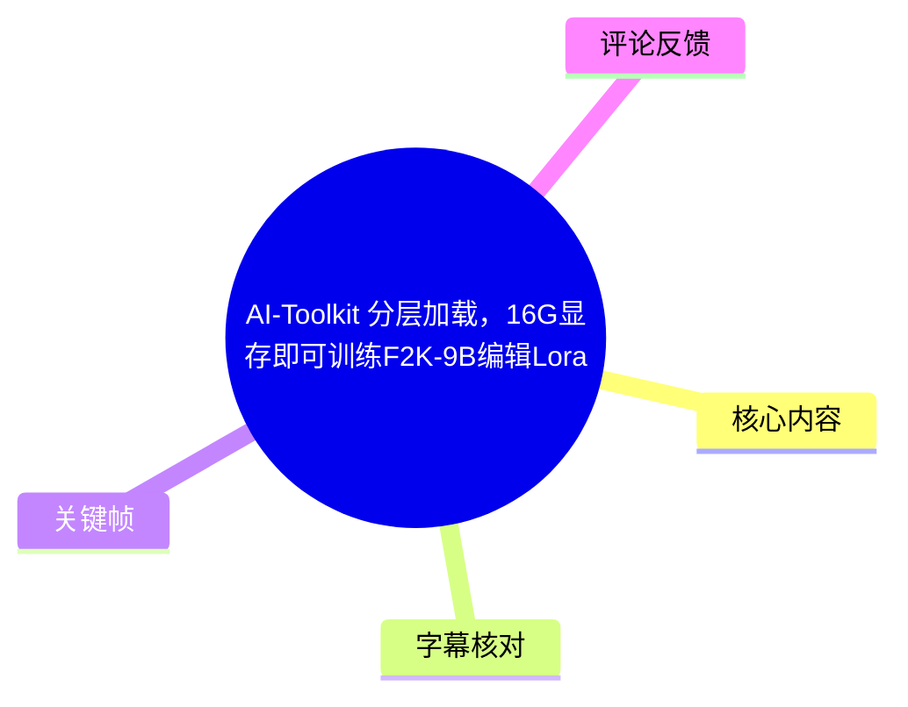
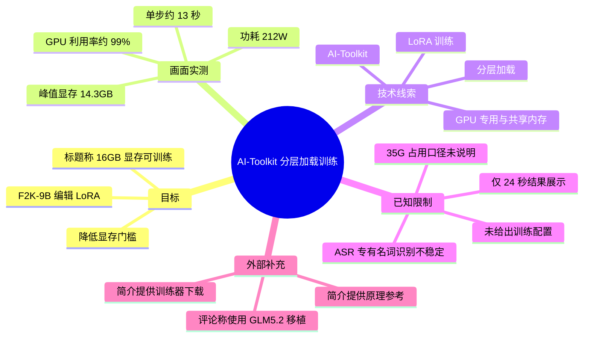
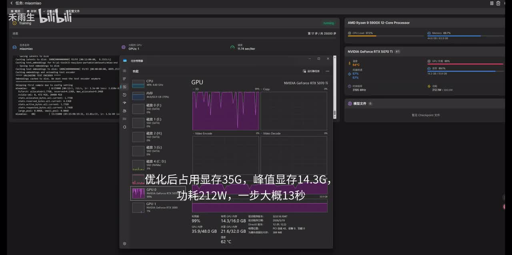

# AI-Toolkit 分层加载，16G显存即可训练F2K-9B编辑Lora

> 来源：[Bilibili 视频](https://www.bilibili.com/video/BV1k77464EAd)  
> UP 主：禾雨生｜时长：24 秒｜分区/收藏夹：AIcode  
> 元数据标签：学习、教程、AI 绘画、经验分享、图片编辑、显存、LoRA、爆显存、训练器、ComfyUI

## 小结

视频展示的是一次使用 **AI-Toolkit 分层加载**进行“F2K-9B 编辑 LoRA”训练时的资源监控画面。标题提出的核心结论是：**16GB 显存可进行该训练**；画面中实际可见的显存峰值为约 **14.3GB / 16.0GB**，与标题所称的 16GB 显存门槛相吻合。

视频给出的关键性能数据包括：优化后“占用显存 35G”、峰值显存 **14.3G**、功耗 **212W**、单步约 **13 秒**。其中“占用显存 35G”与 16GB 独显显存并非同一统计口径：画面同时显示专用 GPU 内存和共享 GPU 内存，且原视频未解释“35G”的具体含义，因此不能将其直接等同于物理显存占用。

这是一段结果展示型短视频，而不是完整操作教程：可确认其展示了训练已运行、GPU 利用率接近满载及显存监控结果；但未展示数据集格式、训练配置、batch size、分辨率、梯度累积、优化器、学习率、保存间隔、量化方式或实际启动命令。因此，不能仅依据本视频复现相同性能或确认“F2K-9B”的完整技术定义。

视频简介提供了原理参考链接和训练器下载地址；热评中 UP 主补充称“使用 GLM5.2 移植”。这些信息属于发布者提供的外部线索，未在视频画面中展开验证，下载前应自行核验链接安全性、软件来源、许可证和模型适用范围。

## 思维导图

## 目录

- [视频定位与时效性](#视频定位与时效性-0000)
- [训练结果与硬件监控](#训练结果与硬件监控-0000)
- [可复核的参数与统计口径](#可复核的参数与统计口径-0000)
- [实践步骤：基于素材可执行到什么程度](#实践步骤基于素材可执行到什么程度-0000)
- [结论、限制与风险](#结论限制与风险-0000)
- [字幕比对](#字幕比对-0000)
- [评论分析](#评论分析-0000)
- [处理记录](#处理记录-0000)

## 视频定位与时效性 [00:00](https://www.bilibili.com/video/BV1k77464EAd?t=0)

本视频时长仅 24 秒，定位为训练资源占用的快速展示。标题中的“AI-Toolkit 分层加载，16G显存即可训练F2K-9B编辑Lora”是视频最完整的主题描述；视频画面并未提供旁白式的原理讲解或完整配置教学。

可从元数据与画面确认的内容包括：

1. UP 主为“禾雨生”，视频主题涉及 AI-Toolkit、LoRA 训练和显存优化。
2. 视频运行环境为 Windows 桌面，画面显示训练终端、Windows 任务管理器及硬件监控面板。
3. 任务管理器中的 GPU 为 **NVIDIA GeForce RTX 5070 Ti**；右侧监控面板还显示 CPU 为 **AMD Ryzen 9 5900X 12-Core Processor**。
4. 标题声称通过“分层加载”使 16GB 显存能够训练目标编辑 LoRA，但视频没有披露该分层加载的算法实现、加载层级、CPU/RAM 卸载策略或参数。

视频简介中的发布者信息如下：

- 原理参考：`https://b23.tv/Xw3EplR`
- 训练器下载：`https://pan.qua删rk.cn/s/b9f8290c37d9`
- 提取码：`RizE`

以上链接和提取码为简介原文信息，并非本记录对其可用性、安全性或内容完整性的验证。AI 工具、模型仓库、驱动版本和下载链接均可能随时间变化；元数据仅给出 Unix 发布时间戳且未提供时区，故不将其转换为带时区的确定发布日期。

## 训练结果与硬件监控 [00:00](https://www.bilibili.com/video/BV1k77464EAd?t=0)

画面处于训练运行状态：左侧终端持续输出训练日志，中部 Windows 任务管理器显示 GPU 曲线，右侧硬件监控工具显示 CPU、GPU、内存及功耗状态。画面上的大字幕直接给出了发布者希望强调的优化结果：

> “优化后占用显存35G，峰值显存14.3G，功耗212W，一步大概13秒”

> 图：该关键帧同时呈现训练日志、Windows 任务管理器和硬件监控面板，是本视频中核对“14.3G 峰值显存、212W 功耗、约 13 秒/步”的主要视觉证据。它还显示 GPU 的专用与共享内存统计，帮助避免将“35G”简单误读为 16GB 显卡上的纯显存用量。

从帧中可辨识的监控数据如下：

| 项目 | 画面可见信息 | 说明 |
| --- | ---: | --- |
| GPU 型号 | NVIDIA GeForce RTX 5070 Ti | 来自任务管理器与右侧监控面板。 |
| GPU 利用率 | 约 99% | 说明截图时训练主要在占用 GPU 运算资源。 |
| 专用 GPU 内存 | 14.3 / 16.0 GB | 任务管理器底部可见；与标题“16G 显存”及字幕“峰值显存 14.3G”相互印证。 |
| 共享 GPU 内存 | 21.6 / 32.0 GB | 同一画面可见，意味着系统还可能使用共享内存统计口径。 |
| GPU 功耗 | 212 W | 画面大字幕与右侧监控面板均可见约 212W。 |
| 单步耗时 | 约 13 秒 | 来自画面大字幕；未提供累计平均、预热阶段或统计步数。 |
| GPU 温度 | 约 62°C | 任务管理器底部可见，属于截图瞬时状态。 |
| CPU | AMD Ryzen 9 5900X 12-Core Processor | 右上监控面板可见。 |
| 系统内存 | 约 44.0 / 63.9 GB（约 69%） | 右上监控面板可见，表明训练并非只消耗 GPU 资源。 |

画面左上训练界面可见任务名“miaomiao”、运行状态“Training”以及步数进度区域，但受截图分辨率与遮挡影响，除可见其正在训练外，不将模糊的具体步数、学习率或日志字段作为可靠参数记录。

## 可复核的参数与统计口径 [00:00](https://www.bilibili.com/video/BV1k77464EAd?t=0)

### 视频明确给出的参数

| 参数 | 视频/画面表述 | 可得结论 |
| --- | --- | --- |
| 训练框架/工具 | AI-Toolkit | 标题明确，具体版本未给出。 |
| 优化思路 | 分层加载 | 标题明确，但未说明实现细节。 |
| 训练目标 | F2K-9B 编辑 LoRA | 标题用语；“F2K-9B”的展开名称、版本与来源未展示。 |
| 显存门槛主张 | 16G 显存即可训练 | 标题主张；对应截图中 14.3/16.0GB 的专用 GPU 内存读数。 |
| 峰值显存 | 14.3G | 画面字幕，并可由任务管理器读数交叉核对。 |
| 占用显存 | 35G | 画面字幕；统计口径不明。 |
| 功耗 | 212W | 画面字幕和右侧监控数据均支持。 |
| 训练速度 | 一步大概 13 秒 | 仅是发布者给出的约数，未说明数据集、分辨率或平均区间。 |

### “35G”与“14.3G”的关系不能直接等同

视频同时出现“优化后占用显存 35G”和“峰值显存 14.3G”。这两个数字表面矛盾，但关键帧中可见 Windows 任务管理器区分了：

- **专用 GPU 内存：14.3 / 16.0GB**
- **共享 GPU 内存：21.6 / 32.0GB**

因此，较稳妥的记录方式是：

- **14.3GB**：可由画面直接对应到专用 GPU 内存，并可视为标题中“16G 显存可训练”所依赖的关键证据。
- **35G**：可能涉及专用显存、共享 GPU 内存、系统内存、框架分配量或其他合并统计，但原视频没有定义，不能据此推导精确内存公式。
- 截图中显示的 14.3GB 与 21.6GB 相加约为 35.9GB；这提示“35G”可能与专用/共享内存合计有关，但这是基于截图数值的**推断**，不是视频明示的统计口径。

### 性能数据的适用条件

“约 13 秒/步”和“212W”都只是截图时的运行状态，至少会受到以下未披露变量影响：

- 训练图像分辨率与图像数量；
- batch size、梯度累积和梯度检查点设置；
- LoRA rank、目标模块与训练层范围；
- 混合精度、量化方式及分层加载的具体策略；
- CPU 内存、存储读写、Windows 驱动和软件版本；
- 首步加载、缓存预热与后续稳态训练之间的差异。

因此，视频可支持“该展示环境中可运行且专用显存峰值约 14.3GB”的观察，不能支持“所有 16GB 显卡、任何数据和配置下都能以约 13 秒/步训练”的泛化结论。

## 实践步骤：基于素材可执行到什么程度 [00:00](https://www.bilibili.com/video/BV1k77464EAd?t=0)

视频未展示从安装到启动的完整流程，以下按“素材明确支持”与“素材缺失”分开整理，避免将常规经验写成视频已给出的操作步骤。

### 素材明确支持的操作路径

1. **获取训练器线索**  
   视频简介给出训练器下载地址和提取码。下载前应核验域名、文件哈希、发布者说明及安全软件扫描结果；素材未提供校验值或官方仓库地址。

2. **以 AI-Toolkit 进行目标 LoRA 训练**  
   标题说明使用 AI-Toolkit，训练目标表述为“F2K-9B 编辑 Lora”。视频没有展示配置文件、命令行参数或 UI 表单，无法从素材中提取可直接复制的启动命令。

3. **启用发布者所称的“分层加载”方案**  
   标题将其作为降低显存门槛的关键方法。画面显示训练期间使用共享 GPU 内存和较高系统内存，但没有明确给出分层加载的开关名称、分层规则、卸载设备或缓存设置。

4. **监控专用显存而非只看单一“占用”数字**  
   关键帧显示专用 GPU 内存为 14.3/16.0GB，接近 16GB 容量。实践中应同时观察专用显存、共享内存、系统内存、GPU 利用率和功耗；仅以“35G 占用”判断是否爆显存会造成误解。

5. **以步时和稳定性共同验证配置**  
   发布者给出“一步大概 13 秒”的当前示例。复现实验应记录预热后多步平均耗时、是否出现 CUDA OOM、是否频繁落入共享内存导致卡顿，以及系统内存是否持续增长。

### 素材未提供、必须自行确认的关键设置

下列参数会决定是否真正能在 16GB 显存上运行，但视频没有公开，不能补写为确定值：

| 缺失项目 | 对复现的影响 |
| --- | --- |
| AI-Toolkit 版本、Python/CUDA/PyTorch 版本 | 影响兼容性、显存分配与性能。 |
| 模型权重来源与“F2K-9B”具体版本 | 无法确认模型架构、授权和所需显存。 |
| 数据集结构、标注格式和预处理 | 影响训练是否能启动及编辑能力。 |
| 图像分辨率、bucket 策略 | 通常显著影响激活显存和每步耗时。 |
| batch size 与梯度累积 | 决定瞬时显存和等效批量。 |
| LoRA rank、alpha、目标层 | 影响可训练参数量、显存与结果质量。 |
| 学习率、训练步数、保存频率 | 影响收敛、训练时间和磁盘占用。 |
| 分层加载具体实现与参数 | 是本视频核心卖点，但恰恰没有展示。 |

## 结论、限制与风险 [00:00](https://www.bilibili.com/video/BV1k77464EAd?t=0)

### 可迁移的经验

- 对 16GB 显存设备，判断训练可行性时应优先检查**专用 GPU 内存峰值**。本视频截图为 14.3/16.0GB，余量不大，仍需保留显存波动空间。
- 训练显存压力不只体现在显卡专用显存上。截图中的共享 GPU 内存和约 64GB 系统内存使用情况提示，所谓低显存方案可能把部分压力转移至系统内存或共享内存。
- 性能评估应同时记录显存、系统内存、功耗、温度、GPU 利用率和稳态步时，避免只用“能跑”作为唯一标准。

### 重要限制

1. **缺少可复现配置**：视频没有给出任何可验证的训练脚本、配置文件或参数组合。
2. **“35G”定义不明**：不能确认它是框架报告的分配内存、专用与共享内存合计，还是其他指标。
3. **结果质量未展示**：没有训练前后编辑效果、样本图、loss 曲线或验证集结果，无法评价 LoRA 的实际编辑能力。
4. **硬件样本单一**：画面为 RTX 5070 Ti 与 Ryzen 9 5900X 环境；不同显卡架构、驱动、内存容量和带宽下的结果可能不同。
5. **时效性有限**：AI-Toolkit、模型版本、GLM5.2 移植状态与下载链接均可能更新或失效；应以当前官方文档、仓库发布页和许可证为准。
6. **外部下载风险**：简介给出网盘链接而非可验证的软件供应链信息。运行训练器前应在隔离环境中检查文件，并避免将敏感数据集直接交给未经核验的程序。

## 字幕比对 [00:00](https://www.bilibili.com/video/BV1k77464EAd?t=0)

本次已执行 ASR，但没有提供可用的 Bilibili 站内字幕。

| 字幕来源 | 完整性 | 专有名词 | 时间轴 | 主要问题 |
| --- | --- | --- | --- | --- |
| Bilibili 站内字幕 | 无可用字幕 | 无法评估 | 无法评估 | 素材明确说明未提供可用站内字幕。 |
| 本次 ASR 字幕 | 极低；仅识别出一小段性能描述 | 较差 | 未提供逐句时间戳 | 将“F2K”“显存”等词识别为“4RG”“方G昇存”“帮机显卡”等，且首句语义不完整。 |

ASR 原始文本为：

> 同一套新店餐秀,优化前将4RG显存,方G昇存15.4G  
> 加以显存35G,帮机显卡14.3G,功耗212W,一步大概13秒,  
> 就知道要不要過去

最终未采用 ASR 的前半段作为事实依据，原因是其语义和专有名词错误严重。与画面大字幕和关键帧交叉校正后，可较可靠地确认的表述为：

- “优化后占用显存 **35G**”
- “峰值显存 **14.3G**”
- “功耗 **212W**”
- “一步大概 **13 秒**”

“F2K-9B”“AI-Toolkit”“分层加载”则以视频标题和简介为准，而非依据 ASR 识别结果。由于视频只有一张关键帧、没有逐字时间戳字幕，本文将这些展示数据统一定位到视频起始段 `[00:00]`，不虚构更精细的句级时间轴。

## 评论分析 [00:00](https://www.bilibili.com/video/BV1k77464EAd?t=0)

可获取热评共 **1 条**，少于要求的前三条，因此仅分析该条；不存在可获取的第 2、3 条热评。

### 热评 1：UP 主“禾雨生”（1 赞）

评论内容重复提供了原理参考链接、训练器下载链接与提取码，并补充：

> “使用GLM5.2移植”

分析：

- **补充信息**：该评论明确将训练器/方案与“GLM5.2 移植”关联，是视频标题和简介之外的唯一技术补充。
- **可信度边界**：评论来自视频发布者，可视为作者自述；但未给出代码仓库、提交记录、模型配置或移植过程，不能独立验证其实现范围、兼容性与性能。
- **与正文的关系**：该信息可作为追溯技术来源的线索，不应替代可复现文档，也不应据此推断所有 AI-Toolkit 功能均由 GLM5.2 移植而来。
- **其他热评**：素材中未返回第 2、3 条可获取热评，故不进行臆测或扩展分析。

## 处理记录 [00:00](https://www.bilibili.com/video/BV1k77464EAd?t=0)

- Worker ID：`worker-mrj0wbly-5dc4e50c`
- 模型：`gpt-5.6-terra`
- 调用工具与素材来源：基于任务提供的 Bilibili 元数据、视频素材清单、已执行的 ASR 文本、关键帧 `frames/frame-001.jpg`、以及 `comments/comments.json` 中返回的热评进行整理；未获得额外可执行工具的运行日志。
- 使用的应用工具：素材采集产物包含 `merged.mp4`、`audio/audio.wav`、`frames/`、`subtitles/`、`asr/` 和 `comments/`；本记录实际使用了元数据、ASR、关键帧与评论结果。
- 字幕选择：站内字幕不可用；本次 ASR 已执行但错误较多。最终以视频标题、简介和关键帧可见字幕/监控读数为主，ASR 仅用于发现“35G、14.3G、212W、13 秒”等候选信息，再经画面校正。
- 关键帧选择依据：仅提供 `frames/frame-001.jpg`。该帧包含训练状态、RTX 5070 Ti、专用/共享 GPU 内存、GPU 利用率、功耗和画面性能字幕，是解释标题中“16G 显存可训练”及厘清“35G/14.3G”统计差异的最有价值证据。
- 评论范围：按“仅处理可获取热评前三条”执行；实际仅获取 1 条热评。
- 缓存清理：任务仅提供已生成素材路径，未提供可操作的缓存目录或清理工具权限；未执行无法验证的删除操作，未报告虚假的清理结果。
- 未解决问题：分层加载的具体实现；F2K-9B 的准确模型标识与版本；训练配置及数据集；“35G”内存统计口径；GLM5.2 移植的代码与适配范围；外部下载链接的安全性与当前有效性。

## 评论分析

本次流程未获取到可用热评，因此不推断观众态度或额外结论。
