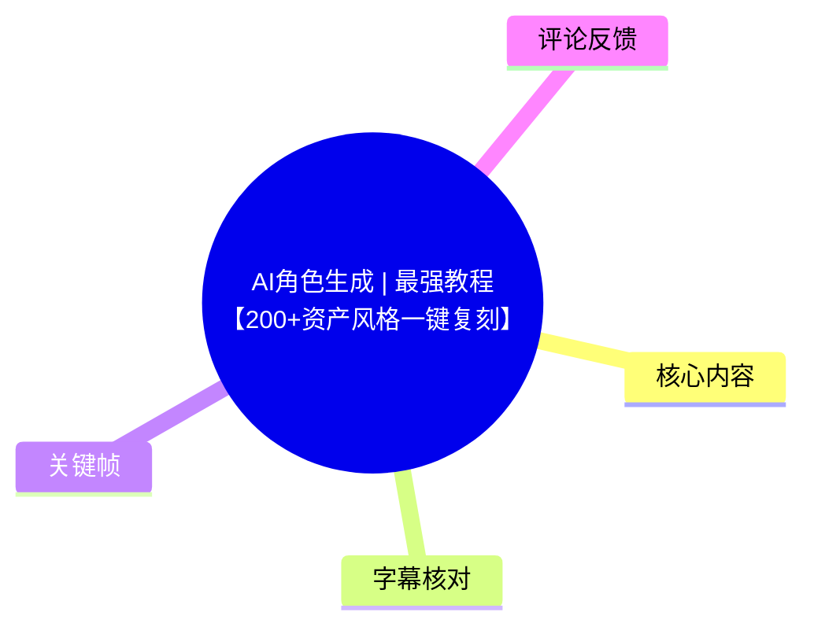
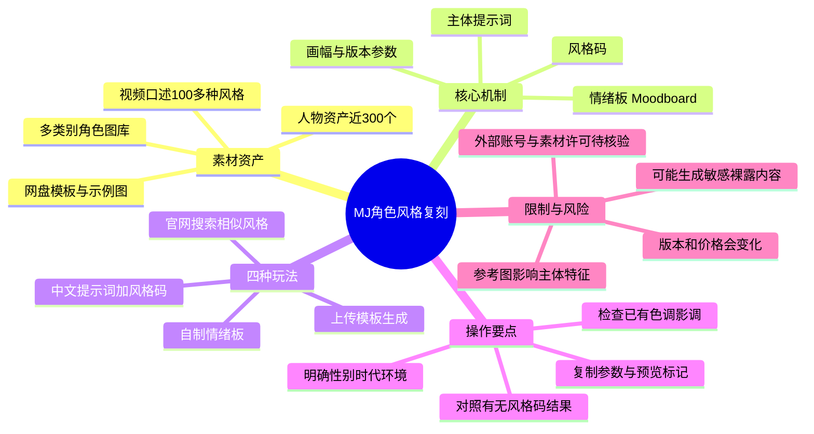
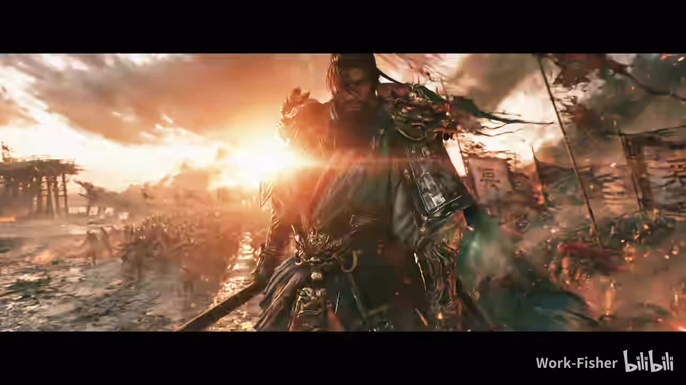
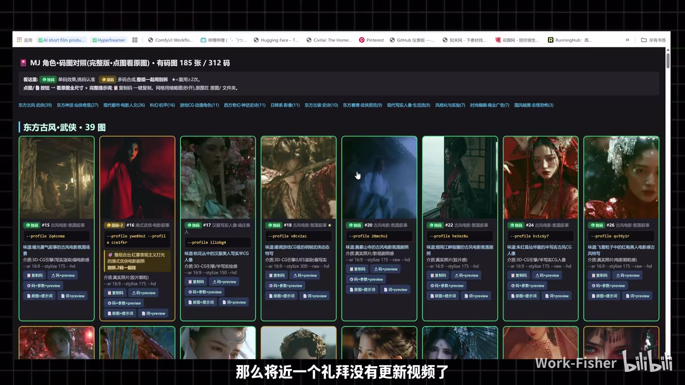
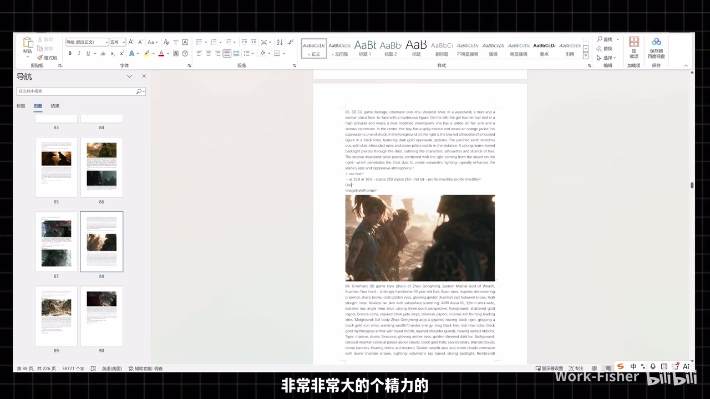
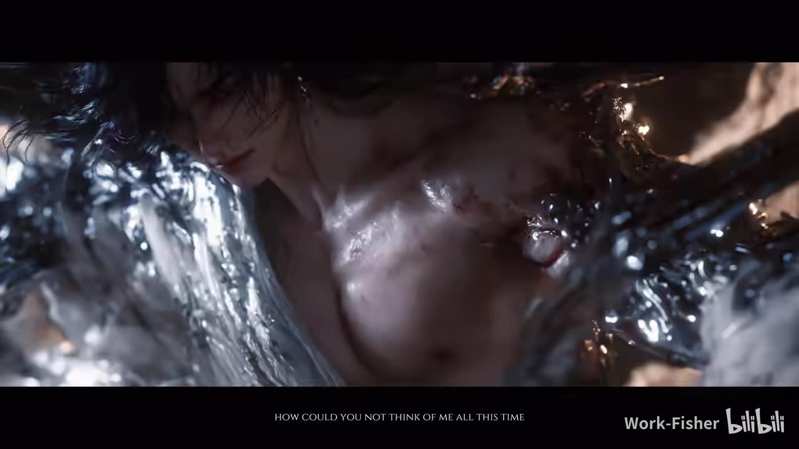

# AI角色生成 | 最强教程【200+资产风格一键复刻】

> 来源：[Bilibili 视频](https://www.bilibili.com/video/BV1YETE6tEEY)<br>
> UP 主：Work-Fisher｜时长：17 分 03 秒｜分辨率：3840×2160<br>
> 视频描述提供公开资料网盘、画布制作流程链接与飞书知识库；其中外部链接的可用性、内容和安全性未在本记录中验证。

## 小结

本视频是一套围绕 Midjourney（视频中简称“MJ”）角色图生成的资产化教程。UP 主将其筛选、测试过的角色风格整理为网页素材库：视频口述为“100 多种风格”，同时称人物资产“将近 300 个”，标题则宣传“200+资产”。这些数字口径并不完全一致，应以实际获取到的素材为准。

核心方法不是仅靠主体提示词生成，而是把**主体描述**与可复用的**风格码/情绪板（Moodboard）**、画幅等参数组合。UP 主的论点是：风格码可将参考图的色调、质感和整体视觉倾向迁移到新图；若不使用相应参数，生成结果会更普通，且在后续图生视频时可能更容易显出“AI 感”或“油腻感”。

教程给出四种玩法：直接将网站中中文提示词与风格码组合；上传模板再调整主体；自行用喜欢的图制作情绪板；在 MJ 官网通过放大镜寻找相似风格，并复制现成情绪码。实际操作中，主体性别、时代、环境等仍需明确写入提示词，否则模型会受风格参考图的高频特征影响。

视频所称的“8.2”是一个需在参数中加入 `--preview` 才能启用的预览版本；UP 主还比较了 8.1 与 8.2 的表现，认为后者更清晰、更精准。这是视频发布时点的工具经验，不应视为平台长期固定规则；模型版本、参数语法、价格和访问方式均可能变化。

适合已有 MJ 基础、需要批量建立角色视觉基调，或准备把静态角色图接入视频生成流程的创作者。视频不提供可独立验证的精确提示词全文、模型官方定价依据或版权许可说明，因此商用、真人肖像、外部账号购买等事项需要自行核验并承担风险。

## 思维导图





## 目录

- [背景、资产范围与工具入口](#背景资产范围与工具入口)
- [风格库的结构与风格码概念](#风格库的结构与风格码概念)
- [玩法一：中文主体提示词加风格码](#玩法一中文主体提示词加风格码)
- [玩法二：上传模板并改写主体设定](#玩法二上传模板并改写主体设定)
- [玩法三、四：自制或检索情绪板](#玩法三四自制或检索情绪板)
- [对比测试与图生视频经验](#对比测试与图生视频经验)
- [完整实操清单](#完整实操清单)
- [参数、限制与时效性](#参数限制与时效性)
- [字幕比对](#字幕比对)
- [评论分析](#评论分析)
- [处理记录](#处理记录)

## 背景、资产范围与工具入口

### [开场展示与资料定位](https://www.bilibili.com/video/BV1YETE6tEEY?t=0)

视频开头先播放具有电影感的角色片段，随后进入网页素材库。UP 主表示自己在近一周内整理了一套角色资产：人物资产“将近做了 300 个”，包含提示词与风格码；又称经浏览数千张图片筛选，筛选标准包括：

1. 图片应具有可复用的情绪；
2. 不希望风格重复；
3. 覆盖尽可能多的类别；
4. 每种风格需实际跑图和调试，排除效果不理想的项目。



> 图：该帧展示了视频用作效果预览的高动态战斗角色画面。它直观说明教程追求的并非单纯“人物清晰”，还包括逆光、环境叙事与电影化色调；但这只是展示素材，不能证明它由某一固定提示词必然生成。

### [MJ 使用途径与版本前提](https://www.bilibili.com/video/BV1YETE6tEEY?t=141)

UP 主称本期图片统一使用 MJ 生成，并认为 MJ 的“8.2”版本相较此前版本在清晰度、可控性上有明显提升。视频列举三种获取/使用路径：

| 路径 | 视频中的说法 | 需要注意的事项 |
| --- | --- | --- |
| RunningHub（口述为“RH”） | UP 主称会在简介提供链接，并评价为“最合算”；其后用该网站环境演示。 | 具体套餐、权限、价格未在素材中完整展示，需以服务页面为准。 |
| MJ 官网 | 视频口述价格“200 不到一点”。 | 未说明币种、套餐周期、地区及统计时间；属于时效性信息。 |
| 第三方电商团队会员 | 可在二手/电商平台购买团队版会员。UP 主特别提醒应确认“可以支持进入 MJ 官网”。 | 账号归属、付款安全、服务条款、隐私和封禁风险均需自行判断；视频未为该途径背书或提供保障。 |

视频的主要前置条件是：能在所用 MJ 界面发送提示词、上传图片，且能使用风格参考/情绪板相关功能。UP 主没有讲解注册、支付或官方账号配置的完整流程。

## 风格库的结构与风格码概念

### [网页风格库与分类浏览](https://www.bilibili.com/video/BV1YETE6tEEY?t=247)

素材库页面按类型摆放角色资产。视频明确列举的类别包括东方、神话、现代都市、机甲、动漫、西方与写实人像等；每张图片对应一种专用“码”，即可复制调用的风格参考信息。



> 图：该帧可见网页标题“MJ 角色·码图对照（完整版·点图看原图）”、分类导航及“东方古风·武侠”卡片网格。卡片提供原图浏览、码的复制与参数组合入口，说明该资源的交付形态是“示例图 + 可复用配置”，而不只是图片集。

视频描述与画面出现了以下操作入口，名称可能受界面更新影响：

| 入口/组合 | 视频解释 | 用途 |
| --- | --- | --- |
| 复制码 | 风格的色调参考 | 将参考图的视觉风格倾向迁移到新生成内容。 |
| 码 + `--preview` | 风格码再追加预览标记 | 用于调用视频口述的 8.2 预览版本。 |
| 码 + 参数 | 风格码与尺寸等参数一起复制 | 适合希望直接复刻示例构图规格的人。 |
| 原图 + 提示词 | 原始示例图对应的文字描述 | 用于查看或在其基础上改写主体。 |
| 原图 + 提示词 + 码 + `--preview` | 组合式一键复制 | 将示例提示词、风格信息与预览标记合并，降低手工拼接遗漏。 |

### [情绪板（Moodboard）与风格迁移](https://www.bilibili.com/video/BV1YETE6tEEY?t=387)

UP 主将“情绪板”解释为：把放入的图片的风格提取出来，再应用到要生成的图片中。因此，视频语境中的风格码主要承担**风格、滤镜、色调和质感迁移**，并不等同于完整的人物身份设定。

视频拆解一条组合提示词时，将其逻辑归纳为：

```text
中文主体/场景描述
+ 具体风格与画幅等参数
+ 风格码
+ 8.2 预览标记（--preview）
```

其中视频举例的画幅为 `--ar 16:9`；版本关系按 UP 主口述为：基础使用时是 8.1，附加 `--preview` 后进入 8.2 预览。由于 ASR 对命令字符和版本号存在误识别风险，本文保留视频中最明确出现的 `--preview` 与 `--ar 16:9`，不补写未被可靠识别的完整命令串。

## 玩法一：中文主体提示词加风格码

### [先检查提示词，再选择对应风格](https://www.bilibili.com/video/BV1YETE6tEEY?t=452)

第一种玩法是以网站中提供的中文提示词为起点。UP 主演示复制一张示例的中文描述到 MJ 官方界面，再到对应分类选择风格码。关键不是机械追加风格码，而是先检查原提示词是否已经包含以下内容：

- 色调；
- 影调；
- 环境；
- 镜头描述。

UP 主的建议是：如果原提示词已经有大量此类设定，后续叠加的风格方向可能发生冲突；演示中的示例没有特别的影调描述，因此可直接追加所选风格码。该原则可理解为“主体语义与视觉控制语义分层”：先保留想要的人物/事件信息，再让风格码统一画面基调。

### [主体信息必须明确：性别与风格参考的关系](https://www.bilibili.com/video/BV1YETE6tEEY?t=542)

UP 主展示生成图与原图对比，指出未在正文提示词中明确性别时，模型会参考风格码所关联图片的主导特征。例如，若风格参考中以女性形象为主，生成结果也可能偏向女性。这意味着风格码并不是“只改颜色”的无影响滤镜，它会对人物外观和审美倾向产生影响。

建议将不可妥协的主体约束明确写在提示词前部，例如：

```text
[人物性别/年龄段/身份]，[服装与时代]，[动作或情绪]，[场景]
[再追加所选风格码、画幅、版本等参数]
```

视频未给出可复制的完整标准模板，因此方括号内容是基于其“主体提示词需要改变、后缀可复用”的讲解所作的结构化整理，不是原视频逐字提示词。

### [只替换风格码即可改变整体调性](https://www.bilibili.com/video/BV1YETE6tEEY?t=584)

演示中，UP 主保持正文提示词基本不变，仅更换尾部参数/风格码，得到的图在整体风格和色调上明显变化。这是本教程最可迁移的结论：

- **主体提示词**决定“画什么”；
- **风格码/情绪板**重点影响“以何种视觉语言画”；
- **画幅、版本标记等参数**影响输出规格及模型能力入口；
- 风格迁移不是完全确定性的，生成结果仍会受模型随机性、文本描述与参考图片特征共同影响。

## 玩法二：上传模板并改写主体设定

### [模板上传与原描述检查](https://www.bilibili.com/video/BV1YETE6tEEY?t=625)

第二种玩法是使用网盘中提供的“专用提示词模板”。视频演示流程为：

1. 随机选择一个模型/入口；
2. 上传网盘下载的模板；
3. 将中文提示词复制到输入区域；
4. 检查模板文字是否已含色调、影调等视觉描述；
5. 选择目标风格码；
6. 生成结果后，按目标重新补充时代、环境等约束。

UP 主提示模板中“肯定会出现一些关于影调的描述”，因此使用模板更需要处理重复或矛盾的视觉词。若目标风格是硬朗、古代或特定地域风貌，而模板保留了不相符的现代、柔和等描述，最终结果可能被稀释。



> 图：该帧展示了一个包含页码、英文提示词与示例图的文档界面，印证视频所说的素材经过大量整理，并表明模板/资产可能以文档页面组织。它有助于理解“上传模板”并非只上传单张图片，而是需要结合文案与视觉参考使用。

### [用文字补足“古代感”](https://www.bilibili.com/video/BV1YETE6tEEY?t=688)

视频中一次生成结果的古代气质不够明显。UP 主将原因归于参考图本身不够古代，并通过删除原有内容、加入“东方古代”等文字设定后重新生成。前后对比显示，第二次结果的古代意味更突出。

这一案例说明优先级并非绝对由风格码决定：

1. 风格码提供视觉方向；
2. 参考图决定可借用的视觉特征边界；
3. 主体文字决定必须出现的时代、身份和场景语义；
4. 当参考图与目标时代不一致时，应在文字中加更明确的约束，必要时换用更相符的风格参考。

视频同时提到部分生成结果“有点裸露”，因此未点开细看。这也是实操限制：生成前应避免含混、容易导向成人化的描述；生成后要筛选，且应遵守所用平台的内容政策与发布平台规范。

## 玩法三、四：自制或检索情绪板

### [玩法三：用喜欢的图建立自己的情绪板](https://www.bilibili.com/video/BV1YETE6tEEY?t=747)

第三种玩法是自建情绪板。UP 主以自己测试过的情绪板为例，操作逻辑如下：

1. 点击情绪板相关按钮；
2. 放入或选择喜欢的风格图片；
3. 在前方写主体，例如“一个女孩”；
4. 追加规格设定，演示包含 `16:9`、8.1 与 `--preview`；
5. 发送生成；
6. 检查结果是否继承预期质感。

示例生成被 UP 主评价为带有 CG 质感。该方法的重点在于：创作者可以积累个人偏好的视觉图，而非完全依赖资源库现成分类；调用情绪板后可批量生成同一美术方向的不同主体。

### [玩法四：在官网检索相似图并复用情绪码](https://www.bilibili.com/video/BV1YETE6tEEY?t=798)

第四种玩法针对现有平台中的作品。UP 主在官网示范：选中感兴趣的图片后，点击放大镜图标，系统会展示大量相似风格图片。由此有两条路径：

- **直接参考相似图片**：无需先自行从零生成，先收集所需风格方向；
- **复制其情绪码**：若图片带有情绪码，复制后可在自己的主体提示词中调用，以复刻接近的氛围。

UP 主解释自己整理大量情绪码的目的，正是让使用者能更快构建模板。其同时承认即使已有 100 多种风格，仍不可能覆盖所有偏好；官网相似搜索是扩展素材库的办法。



> 图：该帧展示人物近景、湿润材质、水面反光与低照度电影光效。它适合作为“从单张图抽取可迁移情绪”的视觉例子：可观察的并非人物身份本身，而是冷暖对比、材质、镜头距离和氛围；使用外部图作为参考时仍需注意版权、肖像和平台规则。

## 对比测试与图生视频经验

### [有无参数的对照实验](https://www.bilibili.com/video/BV1YETE6tEEY?t=889)

视频后段将“带风格板/参数”的生成与“删掉参数”的生成并排比较。UP 主认为两者基调差异很大：使用风格板的多张图整体质感更统一、更舒服；不使用风格板的结果则较为普通。

这个对照支持的只是视频内的演示结论，存在以下未控制变量：

- 没有展示全部原始提示词；
- 没有说明随机种子、生成批次和选择标准；
- 演示里有一处画幅未选对，UP 主明确称“不管它”；
- 没有给出量化评估或多轮重复结果。

因此，更严谨的复现实验应保持主体提示词、画幅、版本、种子（若平台支持）一致，只切换风格码，并比较多批输出。

### [为图生视频准备“有风格”的角色图](https://www.bilibili.com/video/BV1YETE6tEEY?t=935)

UP 主进一步提出经验判断：若将这些带有明显风格的图片投向视频生成流程，人物面部不容易像此前一样显得“油腻”；反之，视频中的 AI 感很重，可能是角色图过于苍白，缺少滤镜和影调。

这是一条创作经验，而不是已被视频严格验证的普遍因果关系。可合理提炼为：在图生视频前，通过静帧建立一致的色彩、光影、材质和镜头语言，有助于减弱默认生成图的单调感，并使后续镜头风格更稳定。实际视频效果还会受图生视频模型、运动幅度、人物一致性控制、重绘强度与后期调色影响。

## 完整实操清单

### [从素材库到生成结果的最短流程](https://www.bilibili.com/video/BV1YETE6tEEY?t=350)

结合视频前后演示，可按以下顺序执行：

1. **取得素材**：从 UP 主视频描述所列公开资料入口下载网站/模板；若链接失效，视频未提供替代渠道。
2. **选分类与样例**：按目标角色定位东方、神话、都市、机甲、动漫、西方或写实人像等分类。
3. **确定复刻层级**：  
   - 只想迁移色调和质感：选“复制码”；  
   - 想复刻样例的完整规格：选“码 + 参数”；  
   - 想从样例文案改写：选“原图 + 提示词”；  
   - 想快速完整试跑：选带 `--preview` 的组合项。
4. **编写主体提示词**：明确人物性别、身份、服装、时代、情绪、动作、环境。对“古代”等强语义要求，不能只依赖风格图。
5. **清理冲突描述**：检查已有提示词/模板是否与目标风格重复或相互矛盾，尤其是色调、影调、环境、镜头语言。
6. **追加风格与规格**：添加选定风格码；如需横屏，采用视频示例中的 `--ar 16:9`；按视频口述，在适用环境中追加 `--preview` 尝试 8.2 预览。
7. **生成与筛选**：注意模型可能因参考图特征而偏移人物性别或时代感；对可能出现的裸露或不合规结果进行筛除。
8. **做 A/B 对比**：在尽量相同的主体文案和规格下，分别使用“带风格码”和“不带风格码”的版本，比较质感、色彩、人物一致性与可用于视频的程度。
9. **沉淀资产**：将满意的图、所用主体提示词、风格码、参数和用途记录下来，形成个人角色风格库。
10. **扩展风格库**：在官网点击相似搜索（视频示范为放大镜图标），从相似图中提取可用情绪码或建立自己的情绪板。

## 参数、限制与时效性

### [关键参数与不能忽略的边界](https://www.bilibili.com/video/BV1YETE6tEEY?t=997)

| 项目 | 视频内容 | 使用建议/限制 |
| --- | --- | --- |
| `--preview` | UP 主称添加后可将 8.1 切换到 8.2 预览。 | 版本入口与语法具有强时效性；使用前以当前 MJ 界面/官方文档为准。 |
| `--ar 16:9` | 视频示例拆解中出现的横向画幅参数。 | 适合横版画面，但不能保证所有界面、版本均以相同格式支持。 |
| 风格码/情绪码 | 用于迁移参考图的风格、色调与质感。 | 会影响人物外观倾向，不是只影响后期色彩；主体特征仍要明写。 |
| 中文提示词 | UP 主演示以中文直接生成，并认为当前效果可用。 | 不代表所有模型、版本或复杂指令下中文都等效；应针对实际结果迭代。 |
| 参考图 | 可自制情绪板，或从相似搜索中获取风格灵感。 | 需核验版权、肖像授权和平台许可，尤其是商业使用、真人脸和他人作品。 |
| 第三方团队会员 | 视频列为获取 MJ 的一种方式。 | 存在账号安全、服务条款、支付与封号风险；不宜仅凭视频决定购买。 |
| 外部网盘资料 | 视频称含网站、模板和大量图片。 | 视频称实际跑出约四五百张图、挑选部分公开；公开包是否完整及许可未知。 |

**时效性说明：**

- 元数据发布时间为 2026-07-02；视频中关于 MJ “8.2”、`--preview`、官网价格、RunningHub 服务与第三方账号渠道的信息均应视为该时点附近的经验。
- 视频标题中的“200+资产”、口述“将近 300 个人物资产”、口述“100 多种风格”以及“实际四五百张、挑选部分公开”分别描述不同统计范围，不能合并为一个精确数字。
- 视频结尾称下一期将做场景部分；本视频本身只系统讲角色资产，不包含场景库的完整教程。
- 标签中虽包含 ComfyUI、Seedance、Wan2.2、Z-Image 等，但本视频 ASR 主体内容实际聚焦 MJ 风格码/情绪板，没有形成这些工具的操作教学，不能据标签补充未展示流程。

## 字幕比对

### [站内字幕与本次 ASR 的可用性](https://www.bilibili.com/video/BV1YETE6tEEY?t=0)

| 字幕来源 | 完整性 | 专有名词 | 时间轴 | 主要问题 |
| --- | --- | --- | --- | --- |
| Bilibili 站内字幕 | 不可用 | 无法评估 | 无法评估 | 素材采集警告显示字幕工具因缺少 JSON 资源 URL 失败，且未提供可用站内字幕。 |
| 本次 ASR 字幕 | 覆盖了主体教程与开头片段，但存在转写损伤 | 部分可由上下文校正 | 未提供逐句时间戳，只能按内容段落定位 | 开场影视对白与教程口播连续；“MG/MJ”“RH/RunningHub”“8.1/8.2”“码/情绪码”等存在同音、乱码或版本识别问题。 |

**最终字幕选择：**本次 ASR 已执行，且没有可用站内字幕，因此正文以 ASR 为主，结合视频标题、标签、描述、关键帧文字和上下文进行有限校正；不以无依据的推测补全缺失命令或参数。

**重要校正与保留原则：**

- ASR 中反复出现的“mg”按标题、网页“MJ 角色”及语境校为 **MJ/Midjourney**。
- “h/RH”按描述中的画布制作流程域名与口播语境记为 **RunningHub（RH）**，但不进一步断言具体产品能力。
- ASR 对版本号出现“8 2”“8.1”；正文采用 UP 主明确表述的 **8.2 预览版**与 **8.1**，并保留其时效性。
- ASR 中“prefer / prevrr”等不稳定片段，根据口播“加了这个东西”“预览版本”及素材卡片可见 `--preview`，统一记录为 **`--preview`**。
- 开头约 0–20 秒的“我看到你”“你爱我吗”等内容为影视化片段对白，与后续教程无直接技术关系，未把它误并为提示词或操作指令。

## 评论分析

### [可获取热评前三条](https://www.bilibili.com/video/BV1YETE6tEEY?t=1000)

仅处理任务中可获取的热评前三条，不将评论内容当作已验证事实。

1. **我是克里斯安吉尔（6 赞）**  
   评论感谢 UP 主并表达支持，同时抱怨夸克软件修改多个默认应用。前半部分反映其对教程的正面接受；后半部分是个人软件体验，与教程中使用夸克网盘领取资料有关，但不能据此推断所有用户都会遇到同样问题。若使用网盘客户端，可关注安装项、默认应用设置和权限选项。

2. **大yu宝（1 赞）**  
   评论称 UP 主是“良心博主”，并表示从其内容中学到不少、已投币点赞。这是正向口碑反馈，说明至少有观众认可内容的教学价值；但没有提供对参数效果、资料完整度或实际复现率的具体证据。

3. **Skycris（0 赞）**  
   提问：若使用真人照片参考，再选一个角色提示词，能否生成真人脸对应的风格和场景图？该问题与视频的“参考图 + 风格码”方法直接相关，但视频未对真人肖像参考给出明确答复或完整流程。技术上不能仅凭本视频断言可行性、相似度或稳定性；此外还涉及肖像授权、隐私、平台政策与可能的身份混淆风险。应仅使用已获授权的照片，并先查阅所用平台当前规则。

## 处理记录

- **Worker ID**：worker-mrj0wjed-b0c290ad
- **模型**：gpt-5.6-terra
- **调用工具与素材**：使用任务提供的视频元数据、素材清单、ASR 文本、热评 JSON、封面/关键帧路径及所附关键帧预览进行整理；未执行外部网页事实核验。
- **字幕选择**：站内字幕未提供可用资源；本次 ASR 已执行，最终采用 ASR 为主，并以标题、描述、关键帧界面文字和上下文校正 `MJ`、`RunningHub`、`--preview`、版本号等关键术语。
- **关键帧选择依据**：  
  - `frames/frame-001.jpg`：展示开场电影化角色成片，适合说明目标视觉风格；  
  - `frames/frame-002.jpg`：展示可被情绪板提取的光影、材质和氛围层；  
  - `frames/frame-003.jpg`：直接呈现风格资产网页、分类与复制入口，是理解资源库结构的核心证据；  
  - `frames/frame-004.jpg`：呈现文档式提示词/示例图资产，支持模板与资料整理的讲解。  
  其余关键帧路径虽在清单中存在，但未随任务提供画面内容，不对其视觉信息作无依据描述。
- **缓存清理**：本次仅基于已提供的结构化素材与帧预览生成文档，未创建可清理的本地下载缓存；无额外缓存残留可报告。
- **未解决问题**：无法验证外部网盘资料是否仍可下载、素材数量及授权范围；无法核验 MJ 当前版本/价格/参数语法；站内字幕 JSON 资源缺失；ASR 未提供逐句时间码，章节时间轴为依据口播段落整理的近似定位。
