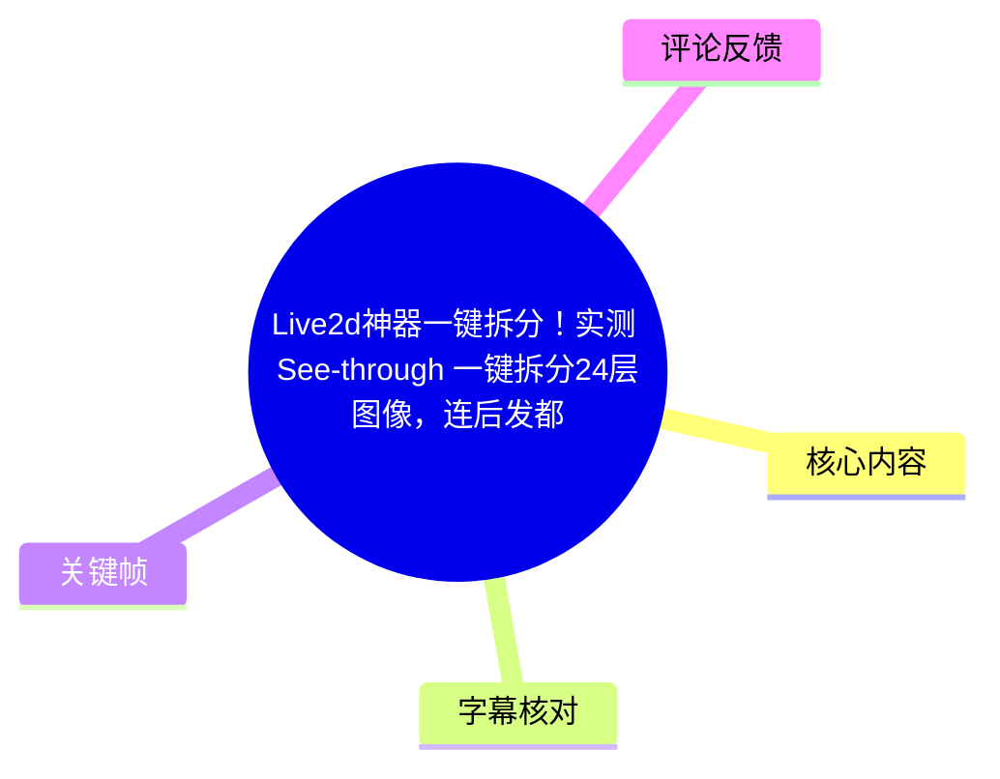
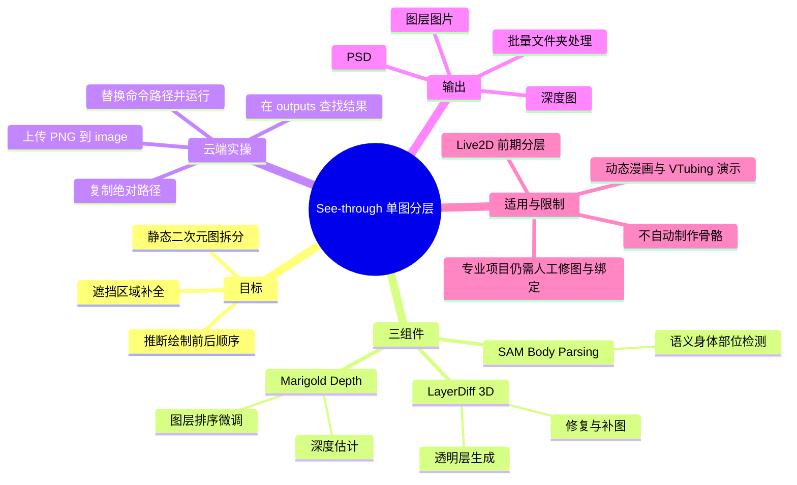
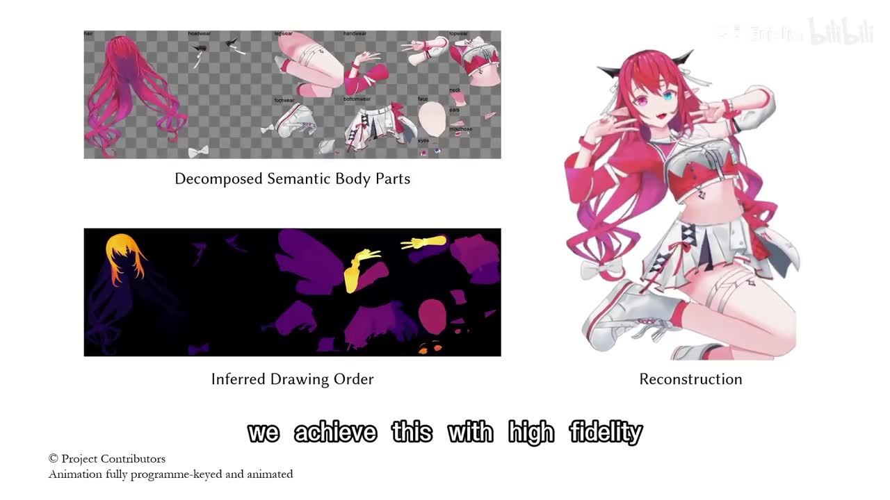
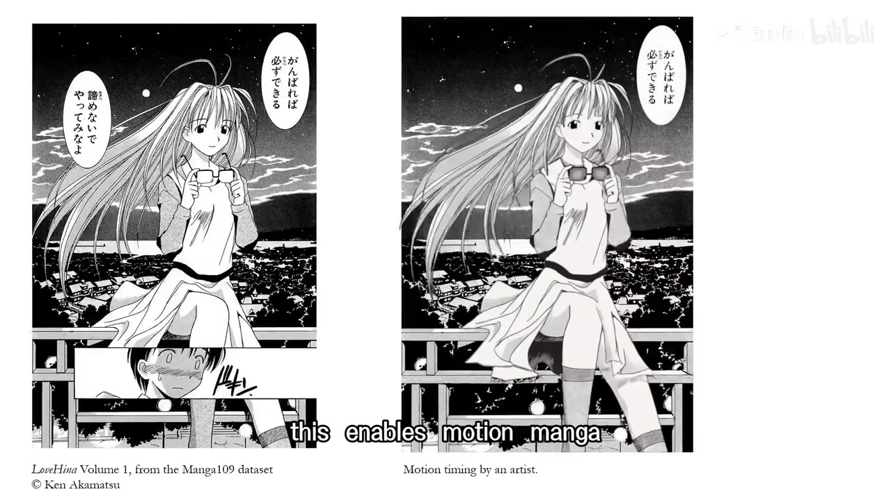
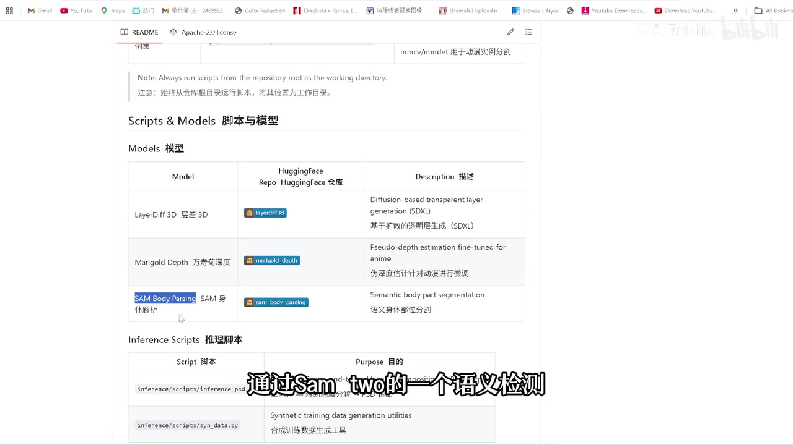
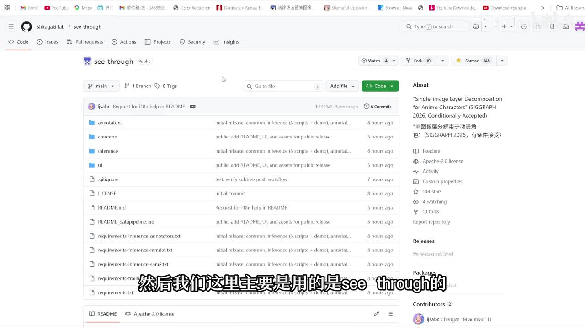

# Live2d神器一键拆分！实测 See-through 一键拆分24层图像，连后发都帮你补全了！

> 来源：[Bilibili 视频](https://www.bilibili.com/video/BV1jeXkByEDc)  
> UP 主：梦影Erislia｜时长：07:01｜合集：AIcode  
> 视频简介提供了云端镜像入口及项目仓库：[`shitagaki-lab/see-through`](https://github.com/shitagaki-lab/see-through)

## 小结

视频介绍了刚开源的 **See-through** 单图分层工具：它面向二次元角色图，将一张静态图拆成语义化身体部位和图层，并尝试补全被前景遮挡、原图中不可见的区域，例如后发。标题中的“24 层”是本次实测结果的宣传表述；视频正文主要展示其能够输出多张分层图、深度图和 PSD，而没有逐层列出这 24 层的命名或完整清单。

核心技术路线由三个组件构成：**SAM Body Parsing / SAM 2** 用于语义部位检测，**LayerDiff 3D** 用于透明层生成、修复与遮挡区域补全，**Marigold Depth** 用于估计深度关系并推断绘制顺序。这样得到的不只是切片，还包括前后层级的组织依据；但这是视频及项目演示所描述的能力，不等于所有素材都能无误分层。

UP 主实际演示的是已配置好的云端镜像：上传 PNG 到 `image` 目录，复制文件路径，将命令中的 PNG 路径替换为该绝对路径后执行；任务结束后可在 `see-through/workspace/outputs` 一类目录中寻找结果。输出包括深度图、可在 Photoshop 中打开的 PSD，以及单独的图层图片；还可通过修改命令处理整个文件夹。

硬件经验是：UP 主称 3080/3090 足够，自己用 4090 时“十多秒”可出结果；首次运行则可能要 **3–5 分钟**，其个人经验约 **2–3 分钟**。这些均是视频发布时的单次环境经验，实际耗时会受首次下载模型、图片尺寸、云端实例、模型版本和队列影响。

最关键的边界是：See-through 解决的是分层、遮挡补全和层次排序，**不会自动完成 Live2D 骨骼/参数绑定**。专业 Live2D 的图层结构、修复策略与后续骨骼设计通常需要协同设计；自动结果宜作为节省前期拆分工时的起点，而非可直接交付的完整模型。

## 思维导图

## 目录

- [项目定位与演示能力](#项目定位与演示能力)
- [三模型工作流：检测、补全与深度排序](#三模型工作流检测补全与深度排序)
- [云端部署与单图运行步骤](#云端部署与单图运行步骤)
- [结果目录、PSD 与批量处理](#结果目录psd-与批量处理)
- [本地部署、训练器与适用场景](#本地部署训练器与适用场景)
- [限制、经验与时效性](#限制经验与时效性)
- [关键帧索引](#关键帧索引)
- [字幕比对](#字幕比对)
- [评论分析](#评论分析)
- [处理记录](#处理记录)

## 项目定位与演示能力 [00:00:00](https://www.bilibili.com/video/BV1jeXkByEDc?t=0)

视频开场将 See-through 定位为“做 L2D 的神器”：把一张角色图片一键拆成多层，降低手动分层的前期工作。UP 主称使用的是 See-through 的“单图分层”能力，且项目刚开源。

随后播放项目介绍。站内字幕中的英文说明给出了较完整的技术目标：

1. 输入是一张静态图片；
2. 系统自动分解出语义化身体部位；
3. 对遮挡关系进行处理，并补绘关键的不可见区域；
4. 恢复推断出的绘制顺序，使碎片能够按深度正确堆叠；
5. 以尽量保留原始画风的方式，将静态绘图转为可动画化的角色。

视频还展示了复杂配饰、透明液体、黑白漫画、动态漫画，以及从视频或摄像头驱动头部姿态与表情的 VTubing 示例。应注意，这一段主要是项目官方展示；它说明潜在应用范围，并不构成 UP 主对所有类型素材的逐一实测。

> 图：画面同时显示“Decomposed Semantic Body Parts（语义部位拆分）”“Inferred Drawing Order（推断绘制顺序）”与“Reconstruction（重组）”。它直观说明该工具并非只做抠图，而是试图建立部件层级及前后关系，是理解后续深度图与 PSD 输出的关键。

### 动态漫画示例 [00:01:09](https://www.bilibili.com/video/BV1jeXkByEDc?t=69)

官方演示中，黑白漫画角色在保留原始手绘风格的前提下被拆分并产生动态效果。视频据此称该结构化拆分可用于 motion manga（动态漫画）。

> 图：左右画面显示同一漫画角色的原始分镜与经处理后的动态展示。该关键帧的价值在于补充说明：视频所说的适用对象并不限于彩色角色立绘，也包括墨线明显的漫画图像；但实际漫画分镜处理效果仍取决于原图结构与后续动画设计。

## 三模型工作流：检测、补全与深度排序 [00:01:36](https://www.bilibili.com/video/BV1jeXkByEDc?t=96)

UP 主将 See-through 的流程概括为三个模型协作。术语以画面中的项目文档为准；本次 ASR 对这些专有名词误识别较多，因此不采用 ASR 的拼写。

| 组件 | 视频中的角色 | 解决的问题 |
| --- | --- | --- |
| SAM Body Parsing（UP 主口述为 SAM / SAM 2 检测） | 语义检测、初步图像拆分 | 将角色部位识别为可分层的对象 |
| LayerDiff 3D | 透明层生成、修复、补图 | 补全原图被遮挡而不可见的部分 |
| Marigold Depth | 深度图估计与微调 | 判断部件前后关系，辅助重新组装 |

> 图：项目文档表格列出了 LayerDiff 3D、Marigold Depth 和 SAM Body Parsing；对应说明分别指向基于扩散的透明层生成、面向动漫的伪深度估计、语义身体部位分割。这是校正 ASR 中“Mirror Guard”“Layer 3D”等误识别的直接画面依据。

### 为什么需要“补全”

UP 主指出，若只用 SAM 2 分割，遇到“看不到的地方”无法直接拆出，例如被身体或前景头发遮挡的后发。视频将这视为常规分割的局限：模型只能依照已可见像素给出区域，不能天然获得被遮挡部位的完整形状。

See-through 的做法是让 LayerDiff 3D 在初步抠图/拆分的基础上执行修复和补图，从而尝试生成隐藏区域。最后由 Marigold Depth 对分层后的前后位置进行识别和微调，再组装为具有正确深度次序的结果。

这里需要区分两点：

- **视频陈述**：该流程可以补出不可见部位，并推断前后图层关系。
- **实践含义**：补全结果本质上是模型推断，而不是从原始图片中“找回”真实不可见像素；服装纹样、发丝走向、复杂饰品和角色设计的一致性，仍应人工检查。

## 云端部署与单图运行步骤 [00:03:13](https://www.bilibili.com/video/BV1jeXkByEDc?t=193)

UP 主推荐在项目刚发布的阶段先使用云端，并表示自己已准备好镜像。视频简介给出了优云智算的部署链接，同时提供 GitHub 项目地址。该云端入口属于视频发布者提供的第三方部署路径，使用前应自行查看平台费用、账号、数据与隐私条款。

### 硬件与时间参数 [00:02:49](https://www.bilibili.com/video/BV1jeXkByEDc?t=169)

视频中给出的参数与经验如下：

| 项目 | 视频说法 | 使用时的解释 |
| --- | --- | --- |
| 可用 GPU | 3080 或 3090“完全够用” | 为 UP 主对云端运行的经验，并非官方最低配置承诺 |
| 演示 GPU | 4090 | UP 主实际演示环境 |
| 非首次速度 | 4090 下“基本十多秒就出来” | 未说明输入分辨率、层数、冷启动状态，不能外推为稳定基准 |
| 首次运行 | 约 3–5 分钟 | 可能含模型下载或初始化 |
| UP 主个人较快记录 | 约 2–3 分钟 | 单次经验值 |
| 模型负载判断 | 三个模型“不是很吃内存” | 未提供显存占用数值，不能据此确定其他 GPU 的可用性 |

首次使用该云平台时，UP 主称完成实名认证可获得 10 元体验金。这是带有强时效性的营销/平台政策信息；是否仍有效、适用地区和领取条件，均须以当前平台页面为准。

### 单张 PNG 的操作顺序 [00:03:17](https://www.bilibili.com/video/BV1jeXkByEDc?t=197)

1. 完成镜像部署后，点击 **Jupyter** 打开工作界面。
2. 进入 `image` 目录。
3. 上传自己的图片；视频明确以 **PNG** 路径为例。
4. 对上传文件右键，使用 **Copy Path** 复制路径。
5. 启动相应运行项/命令，将原先的 PNG 路径替换为刚复制的图片路径。
6. 保留路径开头的斜杠。UP 主说明这是绝对路径的一部分，删去会导致路径不正确。
7. 将视频中要求一起复制的两段内容复制后运行，界面显示处理状态即表示任务开始。
8. 首次运行等待时间可能更长；完成后到输出目录寻找结果。

视频没有在字幕或画面素材中完整展示可复用的命令文本，因此不能据此补写命令、参数名或文件名。实际执行时应以仓库 README、云端镜像内脚本说明为准。

## 结果目录、PSD 与批量处理 [00:04:01](https://www.bilibili.com/video/BV1jeXkByEDc?t=241)

任务完成后，UP 主演示从项目目录进入 `see-through`，再进入 `workspace`、`outputs` 查找此前运行的结果。字幕中“see-through / workspace / outputs”的拼写依据站内字幕语境及项目名称校正；ASR 将其识别为近似发音词，不可靠。

### 输出内容 [00:04:25](https://www.bilibili.com/video/BV1jeXkByEDc?t=265)

UP 主说明输出目录中至少包括以下内容：

| 输出 | 视频中的用途 |
| --- | --- |
| `depth` / 深度图 | 表示或辅助判断画面部件的深度关系 |
| PSD | 已组织和关联好的 PSD 文件，可直接在 Photoshop 中打开；UP 主认为也可作为后续 Live2D 工作的输入 |
| `image` / 图层图片 | 多张已经分好的单独图层图片，可双击查看 |
| 下载方式 | 在云端文件界面右键下载 PSD 或其他结果；也可以整体下载 |

“可直接用于任何 Live2D”的说法是 UP 主的使用建议。结合视频后段的限制，更审慎的理解是：PSD/分层图可作为 Live2D 制作的素材起点，但仍可能需要检查图层命名、遮挡补全、裁切边缘、面部细节和可变形区域。

### 批量处理 [00:05:02](https://www.bilibili.com/video/BV1jeXkByEDc?t=302)

工具还支持一次处理整个文件夹。UP 主仅说明需要改动指令，并让命令前部保留一个在字幕中被转写为“gun”的部分，以使其处理 `image` 下的文件夹。由于原始命令未在提供素材中完整、清晰地出现，不能可靠还原该字段或给出可运行命令。

可迁移的操作原则是：

- 单图与批量模式的输入路径不同；
- 批量处理前应先用一张代表性图片验证输出质量、命名和耗时；
- 对多个角色图批处理时，应为每个输入保留独立输出与人工质检环节，避免错误覆盖或将不合格自动补图直接投入绑定。

## 本地部署、训练器与适用场景 [00:05:33](https://www.bilibili.com/video/BV1jeXkByEDc?t=333)

### 本地运行路径

UP 主称本地使用需按项目环境设置安装依赖，之后执行仓库提供的命令。该命令会自动下载三个模型，默认从 **Hugging Face** 拉取。相较于云端镜像，本地部署意味着使用者要自行处理：

- 环境与依赖安装；
- 模型下载的网络可达性；
- GPU、显存与驱动兼容性；
- 模型与代码版本变化。

视频没有给出完整环境命令、Python/CUDA 版本或显存实测数据，因此这些不能从本视频推导。

### 官方训练器 [00:05:59](https://www.bilibili.com/video/BV1jeXkByEDc?t=359)

视频称项目后续配有官方训练器，可供用户训练自己想要的、具有独特风格的 Live2D 相关结果。素材未展示训练数据格式、训练参数、授权条件、训练成本或结果质量，因此应将其理解为“存在训练器入口”的信息，而不是已验证的个人训练方案。

### 可考虑的使用方向

基于视频展示，可考虑的方向包括：

- 为个人 IP 或 VTuber 形象准备 Live2D 前期分层素材；
- 将角色立绘拆成可编辑的部件；
- 尝试动态漫画；
- 研究视频/摄像头驱动的 talking-head / VTubing 工作流。

这些方向中，后两项主要来自官方演示。实际商用或发布前，尤其应确认输入插画的版权、角色授权、模型许可证以及生成内容的可用范围。

## 限制、经验与时效性 [00:06:11](https://www.bilibili.com/video/BV1jeXkByEDc?t=371)

### 不会自动完成骨骼

UP 主明确说明：工具虽然可以分好层，**骨骼仍需要用户自己制作**；它还没有达到“把骨骼也做好”的程度。对 Live2D 制作来说，这意味着至少还需要完成变形器、参数、物理、表情、碰撞、动作调试等后续工作；其中后续项目清单是对“骨骼仍需自做”这一事实的行业工作流展开，不代表视频逐项演示。

### 自动分层与专业制作的差距

视频承认，专业 Live2D 的图层结构和修复等通常是共同设计的。一键生成后再做骨骼，无法将这一过程完全自动化。可将其整理为以下质检要点：

1. **遮挡补全是否合理**：后发、衣物背面、饰品背面是否符合角色原设。
2. **图层边缘是否可变形**：裁切过紧或补图不足会在头部转动、身体摆动时露出空洞。
3. **层级关系是否正确**：头发、手部、服饰、道具的前后顺序错误会直接影响视觉效果。
4. **分层颗粒度是否满足需求**：自动得到的图层数不一定等于制作所需的图层数。
5. **PSD 可编辑性**：即使 PSD 能打开，也应检查组结构、透明区域和图层内容，再导入 Live2D 流程。

### “24 层”与图层数量的理解

标题强调“一键拆分 24 层”，但视频没有提供完整的 24 层截图或清单。24 层可以视为该测试图得到的结果规模，而不是适用于所有角色图、也不是专业 Live2D 的通用充分条件。不同角色的发丝、瞳孔、嘴型、服装、饰品与可动范围差异很大，所需层数会显著不同。

### 时效性说明

- 视频元数据发布时间为 **2026-03-31**；See-through 被描述为“刚开源”，代码、模型、README、依赖、下载地址和云镜像都可能快速变化。
- 视频简介中的云端链接、实名体验金和镜像预配置均属于发布时信息，不能视作长期有效承诺。
- GPU 型号、耗时与“显存不吃紧”的判断是 UP 主环境经验，非基准测试。
- 仓库、Hugging Face 模型和项目许可证应以访问时的官方页面为准。

## 关键帧索引

| 时间 | 关键帧 | 画面内容与正文价值 |
| --- | --- | --- |
| [00:18](https://www.bilibili.com/video/BV1jeXkByEDc?t=18) |  | GitHub 的 `shitagaki-lab/see-through` 项目页，验证视频介绍的是开源项目，并为本地部署章节提供项目来源依据。 |
| [00:49](https://www.bilibili.com/video/BV1jeXkByEDc?t=49) |  | 同时呈现部件分解、层级推断、重组，是解释“分层不等于普通抠图”的最佳画面。 |
| [01:09](https://www.bilibili.com/video/BV1jeXkByEDc?t=69) |  | 说明官方展示的漫画适配与 motion manga 用例。 |
| [01:36](https://www.bilibili.com/video/BV1jeXkByEDc?t=96) |  | 项目文档直接列出 LayerDiff 3D、Marigold Depth、SAM Body Parsing，用于校正 ASR 专有名词。 |

## 字幕比对

| 字幕来源 | 完整性 | 专有名词 | 时间轴 | 主要问题 |
| --- | --- | --- | --- | --- |
| Bilibili 站内字幕 `p01-ai-zh.srt` | 高，覆盖 00:00:00–00:06:59 | 较好；可辨识 See-through、SAM 2、LayerDiff 3D、Marigold、Jupyter、Photoshop、Hugging Face 等语境 | 高，分段细，直接采用其起止时间换算链接秒数 | 少量口语转写和中英文混排；部分目录/命令片段仍未提供完整可执行文本 |
| 本次 ASR（medium） | 中等，诊断显示语音覆盖约 88.3%，共 17 段 | 较差；将 See-through、SAM 2、Marigold、LayerDiff 3D、Hugging Face、Jupyter 等多次误识别 | 中等，具时间戳，但 00:22.380–01:00.160 有 37.78 秒大间隔，01:27.420–01:36.680 有 9.26 秒大间隔 | 段落过长，英文项目演示基本未准确转写；“L2D”“路径”“骨骼”等也有误听 |

### 最终字幕选择与校正

正文以 **Bilibili 站内字幕为主**，并对本次 ASR 进行了逐段检查和对照。选择站内字幕的理由是：它覆盖完整、时间粒度更细，且保留了 00:22–01:36 的英文官方演示内容；ASR 虽确认视频存在音轨并提供了时间轴，但在这两段出现较大空缺，且专有名词误识别明显。

`asr-result.json` 未标记 `noAudioStream=true`，并记录音频时长约 420.65 秒、识别语言为中文、语言置信度 0.9921875。因此本视频并非无音轨视频，不存在“因无音轨而改用站内字幕”的情况。

重要术语校正依据如下：

- **See-through**：站内字幕、视频标题、GitHub 项目页面关键帧共同支持；ASR 的“C除了 / SysRule”等为误识别。
- **SAM Body Parsing / SAM 2**：项目文档关键帧明确出现 `SAM Body Parsing`；站内字幕口述为 `sam sam two`。
- **LayerDiff 3D**：项目文档关键帧明确出现 `LayerDiff 3D`；ASR 的“Layer 3D”等为不完整识别。
- **Marigold Depth**：项目文档关键帧明确出现 `Marigold Depth`；ASR 的“Mirror Guard”等为误识别。
- **Jupyter、Hugging Face、Photoshop**：采用站内字幕与上下文，未以 ASR 的近音拼写为准。
- **骨骼**：站内字幕明确为“骨骼”，ASR 多处误识别为“谷歌/谷格”。

## 评论分析

以下仅分析可获取的热评前三条；评论反映的是用户观点，不作为已验证技术事实。

1. **抑止之力（43 赞）**  
   - 观点：传统 Live2D 给人的印象是高度手工化、“一针一线缝出来”；未来可能会同时存在精细但半自动化的 Live2D 皮套，以及“开局一张图、后面纯 AI”的路线。  
   - 价值：呼应视频所强调的“节省分层时间”而非完全取代制作流程，提供了自动化程度分层的行业观察。  
   - 边界：这是对未来产品形态的预测，不是对 See-through 当前功能或效果的验证。

2. **KA_L0st（39 赞）**  
   - 观点：从 Live2D 制作角度看，图层数量可能不够；“一般一个 Live2D 300 层往上特别正常”，不过仍可先试玩。  
   - 价值：直接提醒标题中的“24 层”不应被理解为专业制作的普适充分层数，也支持视频后段“专业图层结构需共同设计”的限制。  
   - 边界：300 层是评论者的经验性说法，视频未给出行业统一标准；角色复杂度和制作目标不同，不能将其当作硬性门槛。

3. **名字6硬币哇（19 赞）**  
   - 观点：评论者称自己也在开发类似软件，尚未完成时已有他人先发布。  
   - 价值：侧面反映单图自动分层工具是受到关注的开发方向。  
   - 边界：评论未给出其软件细节、开发证据或与 See-through 的对比，不能据此判断技术竞争格局。

## 处理记录

- **Worker ID**：`worker-mrj0www4-e8d79408`
- **生成模型**：`gpt-5.6-terra`
- **已检查素材与工具产物**：视频元数据、站内字幕 `p01-ai-zh.srt`、本次 ASR 的 `asr/transcript.srt` 与 `asr/asr-result.json`、关键帧目录、热评数据。
- **ASR 模型与运行信息**：`medium`，CUDA，`float16`；识别语言为中文，音频时长约 420.65 秒。
- **字幕选择**：以站内 SRT 为正文时间轴和主要文本依据；同时检查 ASR。原因是站内字幕覆盖更完整、分段更细、专有名词更可靠。ASR 仅用于交叉验证语音存在、整体时段及部分中文口述。
- **关键帧选择依据**：选用 `frame-001` 验证项目来源，`frame-002` 解释分层/绘制顺序/重组，`frame-003` 支撑动态漫画展示，`frame-004` 校正三模型专有名词；未把未提供画面证据的命令文本补写为可执行命令。
- **评论处理范围**：仅处理获取到的热评前三条，未扩展至其他评论。
- **缓存清理**：提供的素材中没有缓存清理执行日志；本整理未执行文件删除或缓存清理，因此记录为“未执行、无可核验清理结果”。
- **未解决问题**：未提供完整运行命令、准确输入分辨率、显存占用、模型版本、许可证全文、训练器参数，以及“24 层”的逐层清单；这些内容未在正文中臆测补全。
