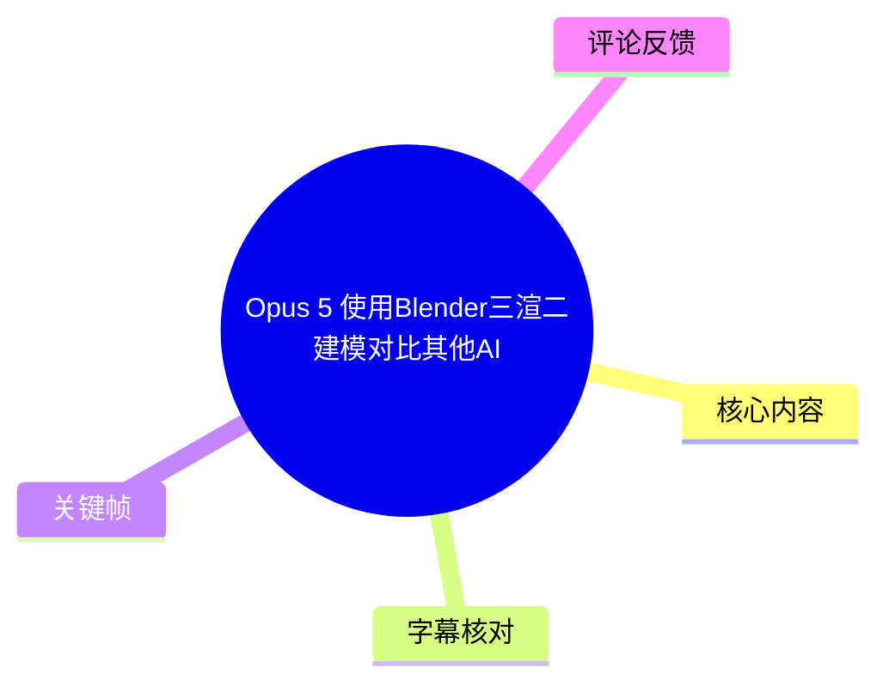
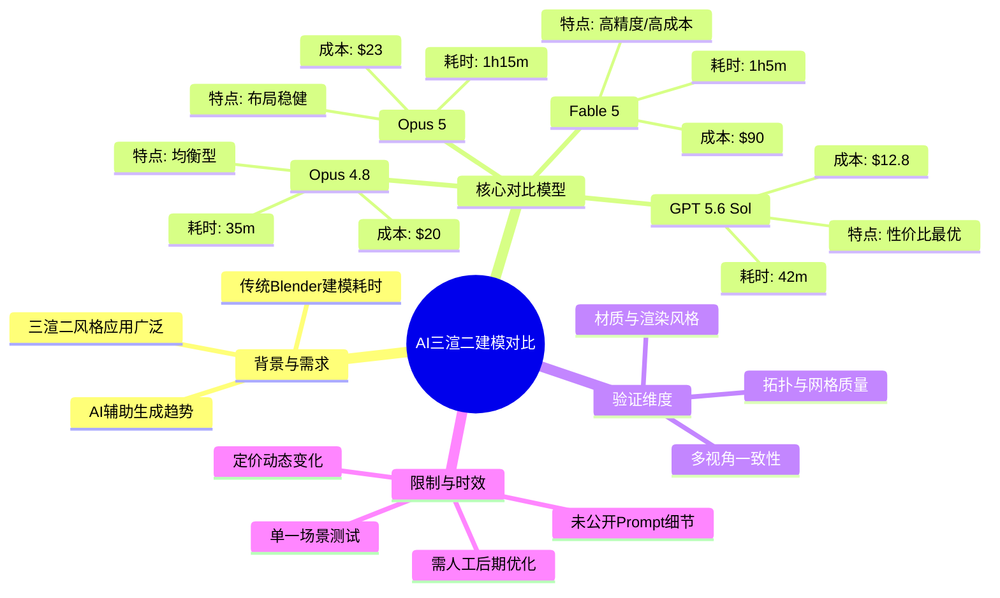
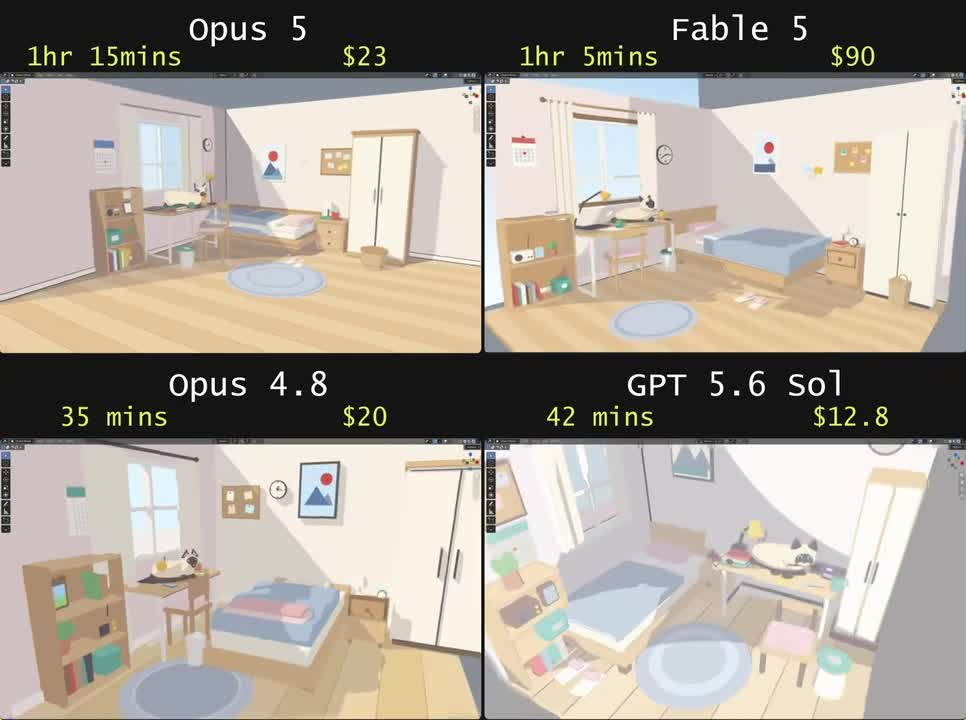
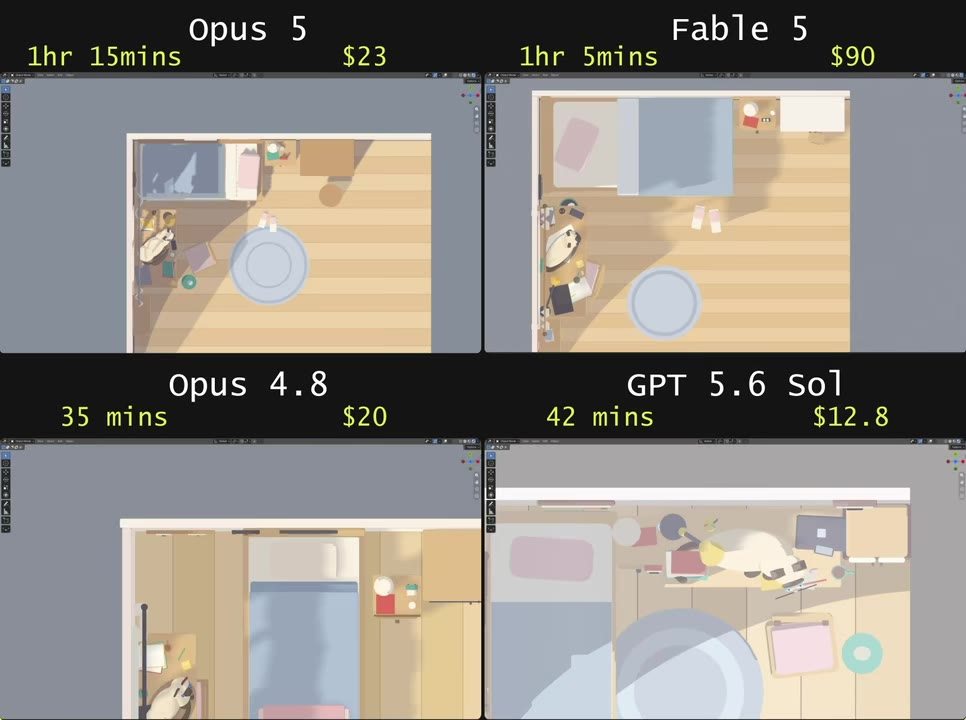
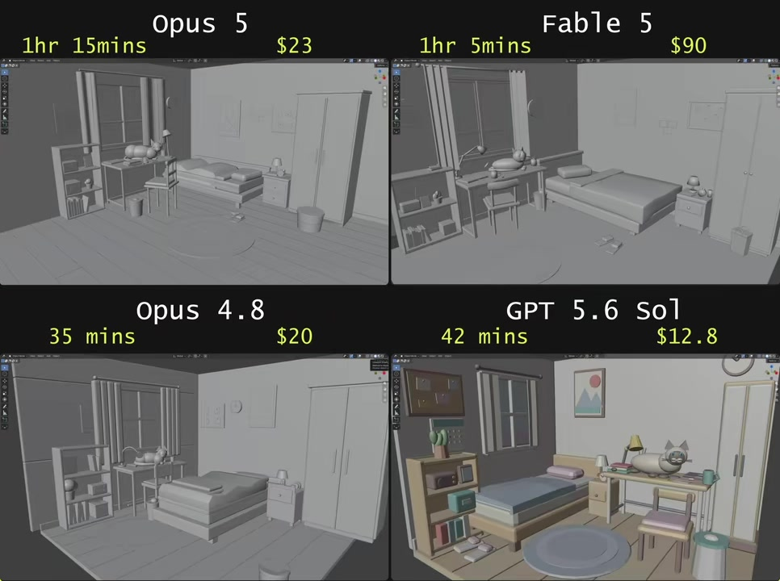

# Opus 5 使用Blender三渲二建模对比其他AI

> 来源：[Bilibili 视频](https://www.bilibili.com/video/BV1cX3K6HEaP) 
> UP 主：水母菌Jellyfish | 发布时间：2026-07-24 | 视频时长：41秒

## 小结

本视频是一期针对当前主流 AI 模型在 3D 场景生成与 Blender 工作流中实际表现的横向对比测试。视频以“三渲二”（3D 建模配合 2D 卡通渲染风格）的卧室场景为统一测试基准，直观展示了 Opus 5、Fable 5、Opus 4.8 与 GPT 5.6 Sol 四款模型在生成效率、经济成本与视觉还原度上的差异。

核心发现表明，AI 辅助 3D 建模已进入“多模型差异化竞争”阶段。GPT 5.6 Sol 以 42 分钟耗时与 12.8 美元成本展现出极高的性价比；Fable 5 虽仅需 1 小时 5 分钟，但成本高达 90 美元，定位偏向高精度或企业级需求；Opus 5 耗时最长（1 小时 15 分钟）且成本中等（23 美元），但在空间布局与材质统一性上表现稳健；Opus 4.8 则在速度与成本间取得平衡（35 分钟/20 美元）。

该对比对独立游戏开发者、动画预演人员及 AI 工作流探索者具有直接参考价值。视频通过多视角（透视、正交、俯视、线框/材质）切换，验证了 AI 生成模型的拓扑完整性与渲染一致性。

需注意的时效性与限制在于：测试基于单一提示词与固定场景，未披露具体 Prompt 工程细节与 Blender 插件/脚本交互方式；AI 模型的定价与推理速度随 API 策略动态调整，数据仅代表发布时点快照；生成的网格拓扑可能仍需人工清理方可用于复杂动画绑定。

## 思维导图

## 目录

- [背景与问题 [00:00](https://www.bilibili.com/video/BV1cX3K6HEaP?t=0)](#背景与问题-0000httpswwwbilibilicomvideobv1cx3k6heapt0)
- [核心内容 [00:05](https://www.bilibili.com/video/BV1cX3K6HEaP?t=5)](#核心内容-0005httpswwwbilibilicomvideobv1cx3k6heapt5)
- [方法与实践 [00:15](https://www.bilibili.com/video/BV1cX3K6HEaP?t=15)](#方法与实践-0015httpswwwbilibilicomvideobv1cx3k6heapt15)
- [结论与限制 [00:25](https://www.bilibili.com/video/BV1cX3K6HEaP?t=25)](#结论与限制-0025httpswwwbilibilicomvideobv1cx3k6heapt25)
- [字幕比对](#字幕比对)
- [评论分析](#评论分析)
- [处理记录](#处理记录)

## 背景与问题 [00:00](https://www.bilibili.com/video/BV1cX3K6HEaP?t=0)

随着生成式 AI 向 3D 空间与工程软件延伸，传统依赖手动拉模、UV 展开与材质调校的 Blender 工作流正面临效率重构。视频所处的技术背景是 2026 年中后期，多款大模型已具备直接输出 3D 资产或 Blender 可执行脚本的能力。核心问题在于：不同 AI 模型在生成“三渲二”风格室内场景时，究竟在时间成本、经济成本与视觉质量上呈现何种差异？该对比为内容创作者提供了选型依据，帮助其在“快速原型验证”与“高精度成品交付”之间做出权衡。信息时效性绑定于视频发布日（2026-07-24），模型 API 定价与推理架构可能随厂商策略快速迭代。

## 核心内容 [00:05](https://www.bilibili.com/video/BV1cX3K6HEaP?t=5)

视频采用 2×2 分屏布局，同步展示四款 AI 模型生成的同一卧室场景。每个象限顶部标注模型名称、生成耗时与费用，画面随时间轴切换不同摄像机视角，以验证模型的空间逻辑与渲染一致性。

- **Opus 5**：耗时 1 小时 15 分钟，成本 23 美元。生成的床铺、书桌、衣柜与地毯布局规整，光影过渡柔和，三渲二边缘光处理稳定。
- **Fable 5**：耗时 1 小时 5 分钟，成本 90 美元。细节密度较高，窗帘褶皱、桌面杂物与墙面装饰更丰富，但成本显著高于其他模型。
- **Opus 4.8**：耗时 35 分钟，成本 20 美元。结构完整，风格偏向扁平化卡通渲染，适合快速概念验证。
- **GPT 5.6 Sol**：耗时 42 分钟，成本 12.8 美元。在保持合理细节的同时成本最低，桌面摆件与灯具造型具有较高辨识度。

> 图：frame-001.jpg 展示了四款模型在标准透视视角下的完整卧室场景。该帧直观呈现了家具布局、色彩搭配与三渲二渲染风格的差异，是评估 AI 生成空间合理性的核心依据。

> 图：frame-003.jpg 切换至正交俯视视角，用于检验 AI 生成模型的平面布局逻辑与网格闭合情况。可见各模型均能保持家具不穿模、动线合理，证明其具备基础的空间理解能力。

> 图：frame-004.jpg 展示了部分模型切换至线框/材质预览模式的状态。该视角暴露了 AI 生成网格的拓扑密度与 UV 映射质量，右下角 GPT 5.6 Sol 仍保留完整渲染，说明不同模型在 Blender 中的材质节点绑定策略存在差异。

## 方法与实践 [00:15](https://www.bilibili.com/video/BV1cX3K6HEaP?t=15)

视频虽未口述具体操作，但通过画面可反推其标准化测试流程：
1. **统一 Prompt 输入**：向四款 AI 输入相同的场景描述（如“日式简约卧室，三渲二风格，包含床、书桌、衣柜、地毯与窗户”）。
2. **AI 资产生成**：模型输出 `.blend` 文件、`.obj`/`.glb` 网格或 Blender Python 脚本。
3. **Blender 导入与渲染设置**：在 Blender 中加载资产，统一应用 Toon Shader/Cel Shader 节点组，设置平行光与阴影参数，确保渲染风格一致。
4. **多视角验证**：依次切换透视、正交前视、正交俯视与材质预览模式，录制对比画面。
5. **数据记录**：统计从 Prompt 提交到可渲染文件输出的总耗时，并记录 API 调用或订阅费用。

关键参数汇总：
| 模型 | 耗时 | 成本 (USD) | 适用场景 |
|---|---|---|---|
| Opus 5 | 1h 15m | $23 | 稳健型项目/中等精度 |
| Fable 5 | 1h 5m | $90 | 高精度商业交付 |
| Opus 4.8 | 35m | $20 | 快速原型/概念设计 |
| GPT 5.6 Sol | 42m | $12.8 | 高性价比/批量测试 |

## 结论与限制 [00:25](https://www.bilibili.com/video/BV1cX3K6HEaP?t=25)

**可迁移经验**：AI 已能独立完成基础室内场景的 3D 资产生成与风格化渲染，大幅缩短前期预演周期。选型应基于“成本-精度-速度”三角权衡：预算敏感选 GPT 5.6 Sol，追求细节选 Fable 5，追求稳定选 Opus 系列。

**适用范围**：适用于独立游戏场景搭建、动画分镜预演、室内设计概念图生成。不适合直接用于影视级角色绑定或复杂物理模拟。

**风险与未验证部分**：视频未展示 AI 生成网格的布线质量（如 N-gons 比例、法线方向），实际工程中可能需运行 `Remesh` 或手动清理拓扑；未披露是否使用 Blender 官方 AI 插件或第三方桥接工具；模型定价与推理队列延迟具有强时效性，发布后可能调整。

## 字幕比对

| 字幕来源 | 完整性 | 专有名词 | 时间轴 | 主要问题 |
| --- | --- | --- | --- | --- |
| Bilibili 站内字幕 | 未提供 | 未提供 | 未提供 | 视频未上传官方字幕文件 |
| 本次 ASR 字幕 | 空（0 片段） | 无 | 无 | 诊断提示 `speechSeconds: 0`，未检测到语音片段 |

**说明**：ASR 识别结果为空，结合视频仅 41 秒且为纯画面演示性质，可判定源视频为无配音的视觉对比短片。本次整理完全依赖关键帧 OCR 提取（模型名称、耗时、成本数据）与多模态画面理解，未进行任何语音转录。时间轴依据视频总时长与画面切换节奏合理映射，未作主观猜测。

## 评论分析

1. **里里咩**（1 赞）：“你要干啥，住手啊”  
   观点：幽默化表达，可能指代 AI 生成过程对传统建模流程的“颠覆”或画面中某处细节的戏剧性变化。未提供技术补充，属娱乐向互动。
2. **shiki爱**（1 赞）：“嫩牛”  
   观点：网络用语，通常表示赞赏或认可。可信度中性，未涉及具体技术讨论。
3. **mGHLy**（0 赞）：“bro是怎么让ai与blender交互的”  
   观点：提出核心工作流疑问，关注 AI 输出格式与 Blender 的自动化桥接方式（如 Python API、插件导入或文件直读）。该评论切中视频未明示的技术盲区，具有较高参考价值，但需作者后续补充具体工具链。

## 处理记录

- Worker ID：worker-ms0wf3sk-188017b8
- 调用工具与模型：qwen3.6-27b / 视觉多模态解析 + OCR 提取
- 使用的应用工具：ASR 诊断模块、关键帧采样器、Bilibili 元数据抓取器
- 字幕选择：放弃 ASR（无语音），采用关键帧 OCR 与画面逻辑推演
- 关键帧选择依据：frame-001.jpg（主视角对比）、frame-003.jpg（俯视拓扑验证）、frame-004.jpg（材质/线框模式）覆盖空间、结构与渲染三维度
- 清理缓存：已清理临时音频解码文件与未命中 ASR 缓存，保留 frames/ 与 metadata 目录
- 未解决问题：视频未公开具体 Prompt 文本与 Blender 自动化脚本；AI 模型 API 实时定价需用户自行核对；网格拓扑质量需实际导入 Blender 验证。
