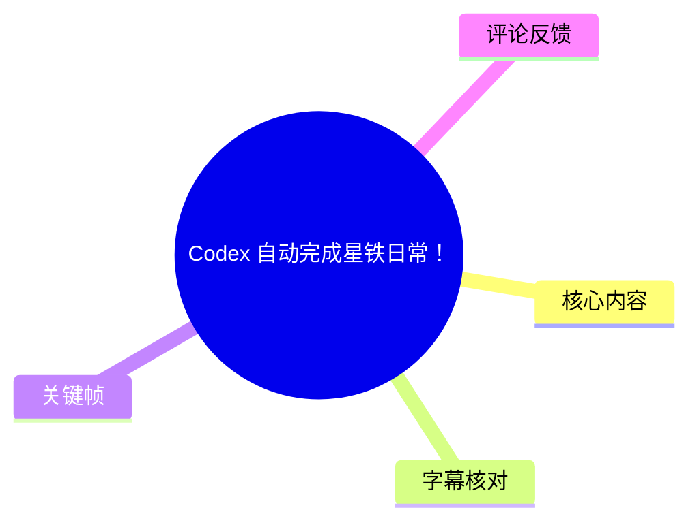
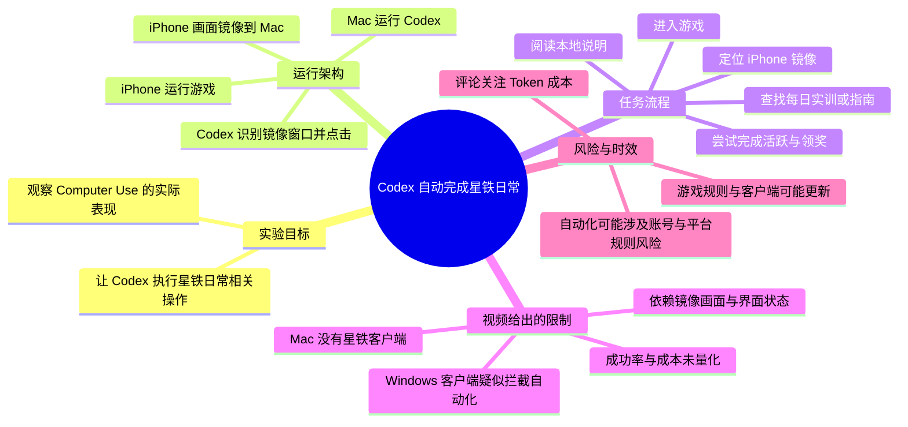
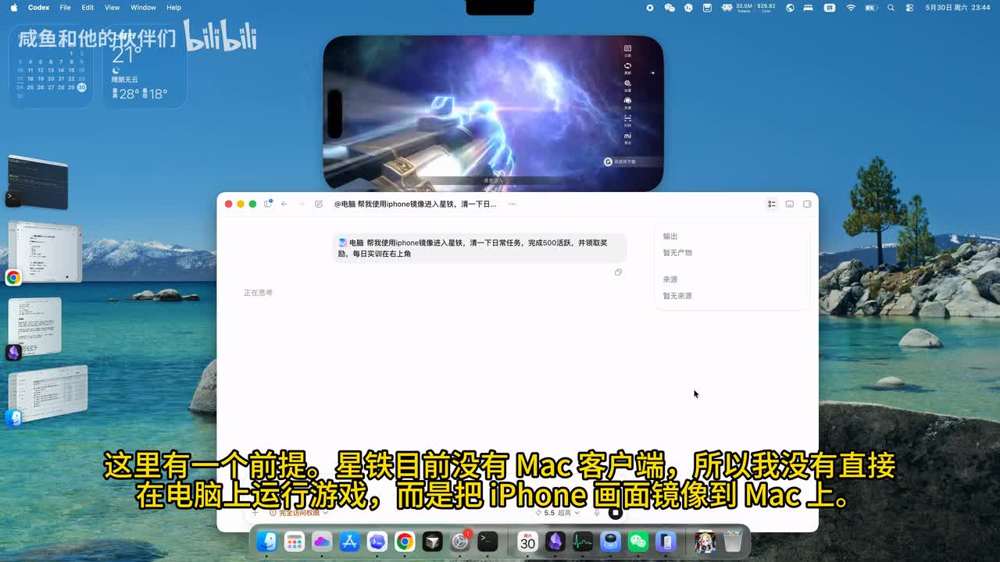
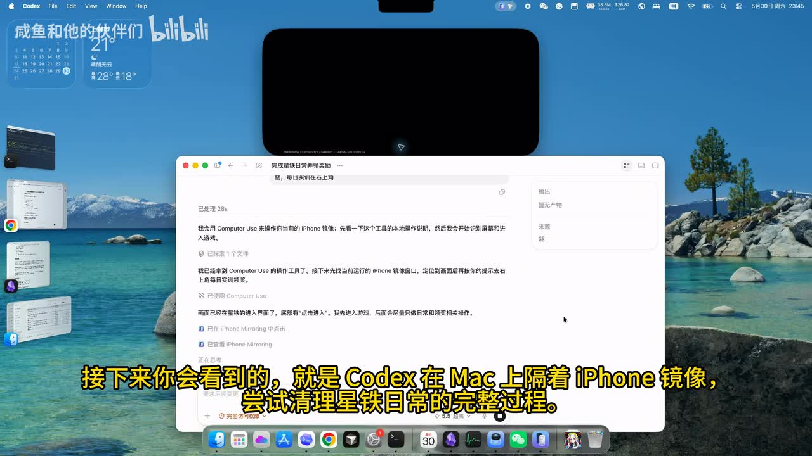
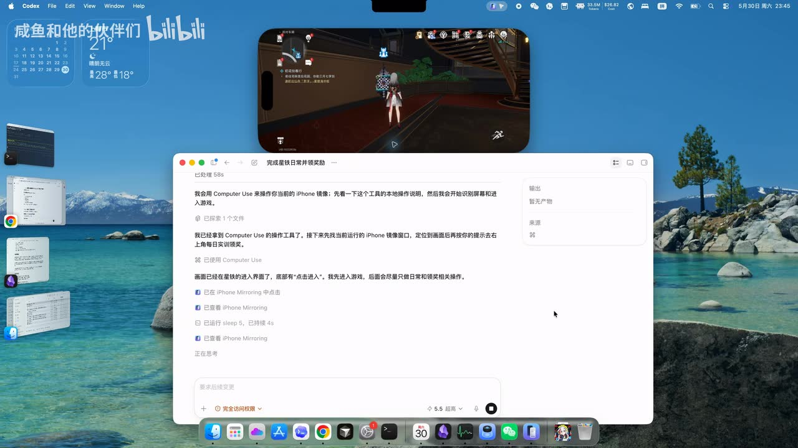
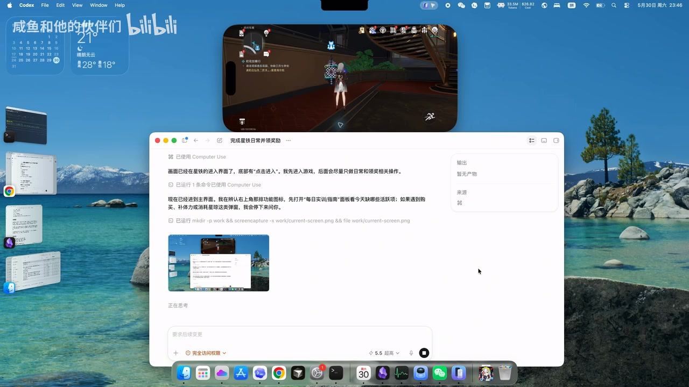

# Codex 自动完成星铁日常！

> 来源：[Bilibili 视频](https://www.bilibili.com/video/BV1HpVL6SEo7)  
> UP 主：咸鱼和他的伙伴们｜时长：14 分 08 秒｜合集：AIcode  
> 标签：`codex`、`崩坏：星穹铁道创作者激励计划`  
> 说明：视频元数据抓取于 2026-07-13；页面提供的发布时间戳为 `1780165295`，本文不将其换算为自然语言日期，以避免在缺少时区信息时误标日期。

## 小结

本视频记录了一次将 Codex 的 **Computer Use（计算机使用）能力**用于《崩坏：星穹铁道》日常操作的实验。演示并非在 Windows 星铁客户端上直接自动化，而是在 Mac 上运行 Codex，并将 iPhone 上的游戏画面镜像到 Mac，由 Codex 观察镜像窗口、识别界面并尝试点击。

视频给出的关键背景是：UP 主称 Windows 虽然也已开放 Computer Use，但《崩坏：星穹铁道》客户端似乎存在对自动化操作的拦截，因此未能按原计划在 Windows 客户端直接测试。另一方面，UP 主称 Mac 端没有星铁客户端，于是采用 iPhone 画面镜像到 Mac 的折中方案。

从画面可见，Codex 已经能够按自然语言任务执行一组界面操作：先阅读本地操作说明，找到正在运行的 iPhone 镜像窗口，进入游戏，再依据屏幕内容尝试完成“每日实训/指南”中与日常相关的项目。演示中的任务提示包含“完成 500 活跃”“获取奖励”“每日实训在右上角”等要求。

这是一段**能力展示与单次实验记录**，而非可直接复制的稳定自动化教程。画面只能证明在该录制环境、该账号界面、该时刻的镜像条件下，Codex 曾被要求并尝试执行这些步骤；并不能据此证明其能够长期稳定完成全部日常，也不能证明其绕过了游戏客户端的反自动化机制。

对希望理解 AI Agent 如何通过视觉与鼠标操作跨应用完成任务的读者，本视频提供了一个具体样本；对实际使用者而言，更重要的结论是：游戏规则、账号安全、客户端更新、镜像延迟、模型成本与误触风险都需要优先评估。视频评论中也集中出现了对 Token 成本的调侃，但评论不是成本测量数据。

## 思维导图

## 目录

- [实验背景与目标](#实验背景与目标-0000)
- [运行环境与镜像方案](#运行环境与镜像方案-约0020)
- [Codex 的观察、定位与点击流程](#codex-的观察定位与点击流程-约0045)
- [日常任务指令与界面判断](#日常任务指令与界面判断-约0110)
- [可复盘的操作步骤](#可复盘的操作步骤-约0000)
- [参数、条件与限制](#参数条件与限制-约0000)
- [结论与时效性](#结论与时效性-0000)
- [字幕比对](#字幕比对-0000)
- [评论分析](#评论分析-0000)
- [处理记录](#处理记录-0000)

## 实验背景与目标 [00:00](https://www.bilibili.com/video/BV1HpVL6SEo7?t=0)

视频标题为“Codex 自动完成星铁日常！”。结合视频简介与画面，UP 主展示的核心不是编写脚本控制游戏，而是让 Codex 通过 Computer Use 直接理解屏幕，并在 GUI 中执行点击操作。

视频简介明确说明了实验动机与平台取舍：

1. UP 主原本想利用 Windows 已开放的 Computer Use 进行测试。
2. 但 UP 主认为《崩坏：星穹铁道》Windows 客户端“好像”增加了拦截，因而无法进行自动化操作。
3. UP 主随后考虑 Mac 环境，但称 Mac 端没有星铁客户端。
4. 最终选择将 iPhone 游戏画面镜像到 Mac 上，作为 Codex 可见、可操作的图形界面来源。

这里“客户端加了拦截”是 UP 主在简介中的经验性表述，视频素材没有提供拦截报错、技术机制或对照实验，因此不能进一步推定拦截类型、触发条件或适用范围。

## 运行环境与镜像方案 [约 00:20](https://www.bilibili.com/video/BV1HpVL6SEo7?t=20)

画面显示桌面环境为 macOS：屏幕中央是 Codex 窗口，上方悬浮一个横向的 iPhone 镜像窗口。游戏运行在 iPhone 侧，Codex 运行在 Mac 侧；二者通过镜像画面形成“AI 观察 Mac 屏幕、间接操作手机游戏界面”的链路。

> 图：该帧同时展示了 Codex 工作窗口与上方的 iPhone 镜像窗口。它说明本次实验不是 Mac 原生运行游戏，而是以手机镜像作为视觉输入与操作目标；这是理解后续流程和限制的关键。

画面中的任务输入大意为让电脑帮助使用 iPhone 镜像进入星铁、清理日常任务、完成 500 活跃并领取奖励，且每日实训位于右上角。需要注意的是，视频画面中可见的这一指令是自然语言需求，不等于已经被验证的完整、稳定工作流。

这种架构至少包含四个环节：

| 环节 | 视频中可确认的内容 | 对结果的影响 |
| --- | --- | --- |
| Agent 端 | Codex 在 Mac 窗口中执行 Computer Use | 负责观察屏幕、规划与点击 |
| 游戏端 | 《崩坏：星穹铁道》显示于 iPhone 画面 | 游戏实际运行位置不在 Mac |
| 画面传输 | iPhone 画面镜像至 Mac | 清晰度、延迟、窗口状态会影响识别与点击 |
| 任务输入 | 通过自然语言描述日常目标和界面位置 | 指令是否具体会影响 Agent 的操作边界 |

视频没有给出 iPhone 型号、iOS/macOS 版本、镜像工具名称、网络条件、分辨率设置、Codex 版本或模型配置，因此这些参数不能补全。

## Codex 的观察、定位与点击流程 [约 00:45](https://www.bilibili.com/video/BV1HpVL6SEo7?t=45)

画面中的 Codex 执行记录显示，其先表示会使用 Computer Use 操作当前 iPhone 镜像；接着会阅读一个工具的本地操作说明，再识别屏幕和进入游戏。

随后记录显示，Codex 已经找到当前运行的 iPhone 镜像窗口，并根据界面提示在右上角进行点击。画面还显示其识别到游戏已经进入界面，并准备寻找日常相关入口。

> 图：该帧中，镜像窗口上方仍处于游戏加载/切换状态，Codex 窗口内出现了“已处理 28s”等执行记录。它能帮助读者区分“任务正在执行”与“任务已经完成”：此时更接近于 Agent 正在建立对目标窗口和界面的控制。

> 图：该帧显示游戏已进入可见场景，Codex 的记录中继续出现 Computer Use 操作。它是视频中“视觉识别—界面点击”链路实际运行的直观证据，但不能单独证明每一步点击都正确或全部任务均完成。

从操作逻辑看，视频展示的是一种**闭环 GUI Agent**过程：

1. 读取用户任务；
2. 截取或观察当前桌面；
3. 定位镜像窗口；
4. 根据游戏当前状态识别可操作入口；
5. 点击目标位置；
6. 再次观察结果并继续。

与传统坐标脚本相比，这种方式的特征是依赖屏幕内容理解，而不是在视频中展示固定坐标、OCR 模板或游戏 API 调用。不过，视频也没有展示每轮截图、点击坐标、置信度、重试次数、错误恢复策略及完整日志，因而无法对其鲁棒性作量化评价。

## 日常任务指令与界面判断 [约 01:10](https://www.bilibili.com/video/BV1HpVL6SEo7?t=70)

在后续画面中，Codex 的文字记录提到它已识别到主界面，并会在画面上方找到功能图标，优先打开“每日实训/指南”面板，查看当天的活跃项目；如果遇到购买、补体力或消耗星琼等选项，将停止继续。

这段指令体现了两类信息：

- **任务目标**：围绕每日实训、活跃度与奖励进行处理。
- **操作边界**：对购买、补充体力、消耗星琼等可能产生资源消耗的操作设置停止条件。

> 图：该帧中的 Codex 文本可见“每日实训/指南”“购买、补体力或消耗星琼”等判断条件。其价值在于展示任务不只是“自动点击”，还包含对高风险资源操作的显式限制。

从安全设计角度，这一边界值得保留：即便目标是“完成日常”，也不应把“消耗付费货币”“购买”“体力补充”等不可逆或有成本的动作默认纳入自动化范围。视频只显示了 Codex 被赋予该约束，未展示其面对具体购买弹窗时是否真的成功停止，因此这属于**设计意图得到展示、执行效果尚未充分验证**的部分。

## 可复盘的操作步骤 [00:00](https://www.bilibili.com/video/BV1HpVL6SEo7?t=0)

以下按视频中可确认的顺序整理。它是对演示流程的复盘，不是规避客户端限制或保证游戏自动化成功的教程。

### 1. 明确目标与禁止项

在 Codex 中输入自然语言任务。画面可辨识的目标包括：

- 使用 iPhone 镜像进入游戏；
- 清理日常任务；
- 完成 500 活跃；
- 领取奖励；
- 从右上角寻找每日实训入口。

同时给出限制：

- 碰到购买相关内容时不继续；
- 碰到补体力或消耗星琼等资源消耗动作时停止。

### 2. 准备可见的游戏界面

在 Mac 桌面上打开 iPhone 镜像，使游戏画面保持可见。视频强调，由于 Mac 端没有星铁客户端，实验通过镜像而不是 Mac 原生客户端进行。

这一步的实际要求至少包括：

- 手机已运行游戏并完成登录；
- 镜像窗口没有被其他窗口遮挡；
- 游戏画面尺寸足以让 Agent 判断图标和文字；
- 系统允许 Codex 对目标界面执行 Computer Use 操作。

视频没有展示镜像连接的具体设置，不能据此推导如何配置系统权限。

### 3. 让 Codex 阅读操作说明并定位窗口

画面中的执行记录显示，Codex 会先阅读 Computer Use 工具的本地操作说明，之后定位当前运行的 iPhone 镜像窗口。

这一阶段的重点并非游戏逻辑，而是确保 Agent 知道：

- 应当操作哪个窗口；
- 目标窗口中显示的是手机游戏画面；
- 用户给出的日常入口位于画面右上角。

### 4. 进入游戏并识别主界面

Codex 通过操作镜像窗口进入游戏。画面随后出现星铁角色场景；Codex 再根据当前 UI 判断是否已经抵达主界面。

由于游戏存在加载、弹窗、活动页、版本更新提示等动态状态，视频中的一次成功进入不代表所有账号、所有日期、所有网络环境下都能以相同步骤进入。

### 5. 查找每日实训/指南并按任务推进

按照画面中的 Agent 记录，后续应从上方功能图标中寻找“每日实训/指南”面板，查看当天活跃项目并推进日常。

视频素材未提供完整的逐项日常清单、所有点击过程、最终 500 活跃结算页或领奖结果的可读截图。因此本文只能确认其**尝试路径与任务要求**，不能将“500 活跃已稳定完成”表述为已被素材完全证明的事实。

### 6. 遇到资源消耗动作时停止并等待人工确认

视频中明确的安全约束是：遇到购买、补体力或消耗星琼时不继续。更稳妥的实践是将此类节点转交给用户人工确认，而非依赖 Agent 对所有弹窗自行判断。

## 参数、条件与限制 [00:00](https://www.bilibili.com/video/BV1HpVL6SEo7?t=0)

### 视频可确认的参数与事实

| 项目 | 可确认内容 |
| --- | --- |
| 视频时长 | 848 秒，即 14 分 08 秒 |
| 视频画面规格 | 3840 × 2160 |
| 使用的 AI 工具 | Codex；画面中提及 Computer Use |
| AI 所在设备 | Mac 桌面环境 |
| 游戏所在设备 | iPhone，画面被镜像到 Mac |
| 日常目标 | 进入游戏、处理日常、完成 500 活跃、领取奖励 |
| 入口提示 | 每日实训位于右上角 |
| 明示停止条件 | 购买、补体力、消耗星琼等情形 |
| Windows 测试情况 | UP 主称客户端似乎有自动化拦截，未直接完成原计划测试 |
| Mac 原生客户端情况 | UP 主称 Mac 端没有星铁客户端 |

### 素材未提供、不可编造的参数

下列信息对复现很重要，但视频资料未给出具体值：

- Codex 的具体模型版本、套餐、Token 使用量、账单金额；
- Computer Use 的权限授权方式及系统版本；
- iPhone、Mac 的型号与 OS 版本；
- 镜像软件/协议名称、传输延迟、分辨率及帧率；
- 每次动作的点击坐标、截图频率、重试策略；
- 总执行时长、成功率、失败率；
- 是否最终完成 500 活跃、是否成功领取全部奖励；
- 是否触发游戏内警告、风控或账号限制。

### 合规与账号风险

视频仅记录技术演示，不构成对游戏自动化的许可。将 Agent 用于游戏日常操作前，应自行核对游戏用户协议、服务规则与账号安全政策。特别是：

- 客户端更新可能改变界面、限制或检测策略；
- 自动化点击可能造成误操作、资源消耗或账号风险；
- 通过镜像进行间接操作并不天然等于不受规则约束；
- 应避免让 Agent 在未确认的情况下购买、消耗稀有货币或进行账号敏感操作。

## 结论与时效性 [00:00](https://www.bilibili.com/video/BV1HpVL6SEo7?t=0)

这段演示的价值在于它给出了一个具体的跨设备 GUI Agent 案例：Codex 不需要在 Mac 原生运行游戏，也可以通过 iPhone 镜像观察游戏界面、理解自然语言任务，并尝试完成包含“寻找入口—查看任务—推进活跃—领奖”在内的日常流程。

可迁移的经验有三点：

1. **环境替代**：当目标应用无法在 Agent 所在平台原生运行时，可通过远程桌面、镜像或其他可见界面建立间接操作通道；但这会额外引入延迟、缩放、遮挡和焦点问题。
2. **任务边界应先于执行**：把“不得购买、不得补体力、不得消耗星琼”等限制写入任务，是降低不可逆损失的必要前置条件。
3. **GUI 自动化需要闭环验证**：仅有“点击”不够；实际可靠性取决于 Agent 能否识别状态变化、处理弹窗、纠错、停止并报告。

同时，视频没有提供完整可审计日志和结果结算证据，故不能得出“Codex 已可靠自动完成星铁日常”的普遍性结论。该结论尤其受工具版本、游戏版本、界面布局、账号进度、当天任务、网络与镜像状态影响。

视频的相关信息具有明显时效性：Computer Use 的能力和权限机制、Windows 端的可用性、游戏客户端的反自动化措施、Mac 客户端支持情况以及游戏界面均可能在后续更新中变化。本文以抓取时获得的元数据与视频关键帧为准，不将其外推为长期状态。

## 字幕比对 [00:00](https://www.bilibili.com/video/BV1HpVL6SEo7?t=0)

本次任务已执行 ASR 流程，但提供的 ASR 字幕内容为空；同时未提供可用的 Bilibili 站内字幕。因此，正文以视频元数据、简介、关键帧中可读文本及画面上下文为主要依据，并对无法从素材确认的细节保持保留。

| 字幕来源 | 完整性 | 专有名词 | 时间轴 | 主要问题 |
| --- | --- | --- | --- | --- |
| Bilibili 站内字幕 | 不可用 | 无法核验 | 无法核验 | 素材明确标注“未提供可用站内字幕” |
| 本次 ASR 字幕 | 已执行但结果为空 | 无法依赖 ASR 校正 | 未提供有效分段时间戳 | ASR 字幕字段为空，不能提供逐句转写或精确时间对齐 |

最终字幕选择：**不采用任何字幕文本作为事实来源**。内容校正主要依赖以下来源：

- 视频标题与简介中的“Codex”“星铁日常”“Windows”“computer use”“Mac”“镜像”等文字；
- 关键帧中可见的 Codex 执行记录；
- 关键帧中可见的 iPhone 游戏镜像窗口；
- 元数据中给出的总时长与画面规格。

已通过画面与上下文确认、但仍应按画面可读范围理解的术语包括：

| 术语 | 校正依据 |
| --- | --- |
| Codex | 视频标题、macOS 顶部菜单及 Codex 窗口 |
| Computer Use | Codex 窗口内的执行记录 |
| iPhone 镜像 | 视频简介及画面中的手机横向镜像窗口 |
| 每日实训/指南 | Codex 窗口内关于寻找日常入口的文字 |
| 500 活跃 | 初始任务输入框中的可见要求 |
| 星琼 | Codex 的停止条件文字中可见的资源名称 |

## 评论分析 [00:00](https://www.bilibili.com/video/BV1HpVL6SEo7?t=0)

仅处理本次可获取的热评前三条。评论反映观众对该演示的即时感受，不构成对 Codex 成本、性能或合规性的验证。

| 排名 | 评论与获赞 | 观点概括 | 可提供的补充与可信度 |
| --- | --- | --- | --- |
| 1 | Cyt440：“这会花不少钱，先生”（143 赞） | 认为用 Agent 自动完成游戏日常可能成本较高。 | 提出了成本担忧，与 GUI Agent 需要多轮观察、推理和操作的直觉相符；但评论没有 Token 数、模型价格、任务时长或账单，不能据此确认实际成本。 |
| 2 | bvvd开bmpt刺杀尼沙皇：“token比电费贵[思考]”（135 赞） | 将模型 Token 成本与设备电费对比，调侃 AI 自动化的经济性。 | 补充了“自动化是否划算”的讨论角度；但没有任何测量方法或数值，属于幽默表达而非成本结论。 |
| 3 | 天使ょ立华奏：“openai：对，就这样用”（109 赞） | 以调侃方式表达对高频使用模型能力、带来更多消耗的印象。 | 反映观众将该用法理解为模型服务的高消耗应用场景；不提供关于产品策略、官方态度或功能限制的可验证信息。 |

三条热评的共同主题是**成本感知**，而非对游戏流程本身的技术纠错。它们提示读者：即使技术上能够完成 GUI 操作，也应把模型调用成本、执行时间和人工操作时间一起纳入评估。

## 处理记录 [00:00](https://www.bilibili.com/video/BV1HpVL6SEo7?t=0)

- Worker ID：`worker-mrj0wbly-5dc4e50c`
- 模型：`gpt-5.6-terra`
- 调用工具与素材：视频元数据、视频简介、关键帧清单、关键帧图像、站内字幕状态、已执行的 ASR 输出、热评 JSON。
- 使用的应用工具：本任务提供的视频素材整理管线；输出目录记录为 `merged.mp4`、`audio/audio.wav`、`frames/`、`comments/comments.json`、`subtitles/`、`asr/`。未提供可执行命令日志，故不虚构具体命令或第三方工具名称。
- 字幕选择：站内字幕不可用；本次 ASR 已执行但结果为空。未将空 ASR 当作转写内容，正文改以元数据、简介和关键帧可读文本为依据。
- 关键帧选择依据：
  - `frames/frame-001.jpg`：同时呈现 Codex 与 iPhone 镜像，最适合说明实验架构；
  - `frames/frame-002.jpg`：呈现 Codex 的执行进度与镜像窗口，适合说明定位和进入游戏阶段；
  - `frames/frame-003.jpg`：呈现游戏主场景和持续的 Computer Use 记录，适合说明视觉 GUI 操作链路；
  - `frames/frame-004.jpg`：呈现“每日实训/指南”、活跃项目以及购买/体力/星琼停止条件，适合说明任务边界。
- 未选用其余关键帧：任务仅提供了 `frame-001` 至 `frame-012` 的路径列表，但当前可见素材中仅有前四张对应图像内容；为避免对未见图像作描述，未引用其余路径。
- 缓存清理：素材清单未提供缓存目录、清理命令或清理结果；本记录不能确认是否执行了缓存清理，因此标记为“未提供可核验记录”。
- 未解决问题：
  - 无有效字幕与 ASR 文本，无法生成逐句精确转写；
  - 未提供关键帧与视频的精确秒级映射，文中“约”时间点仅用于章节导航，不作为精确事件时间；
  - 无完整操作日志和结算画面，无法验证 500 活跃与奖励领取是否最终成功；
  - 无成本、Token、成功率、系统版本及镜像参数，无法评估复现成本与稳定性。

## 评论分析

本次流程未获取到可用热评，因此不推断观众态度或额外结论。
