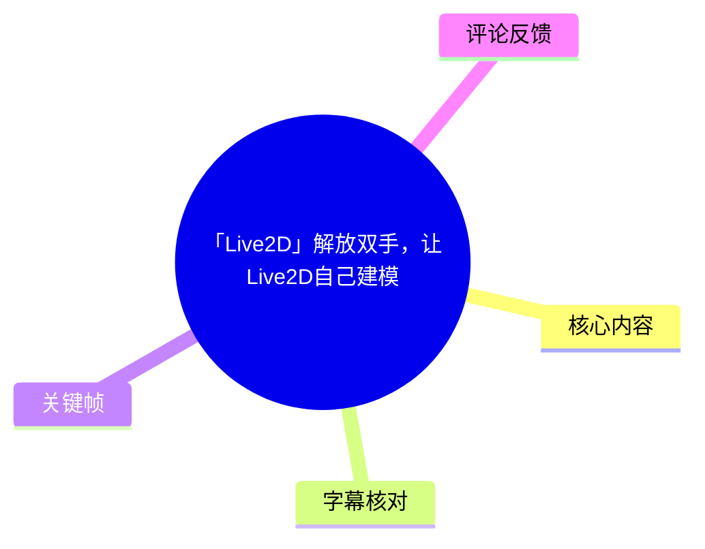
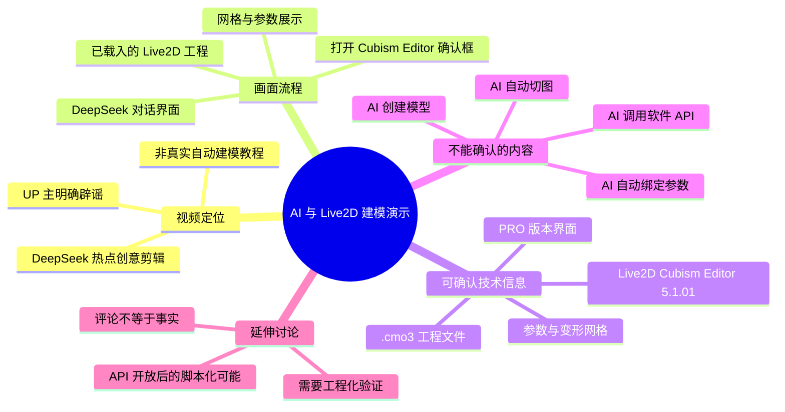
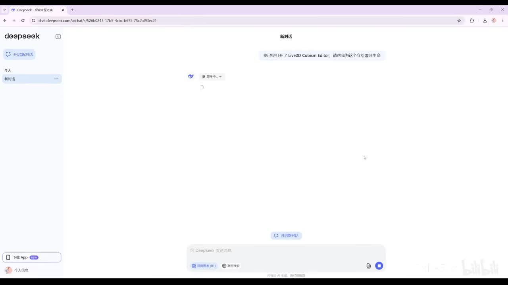
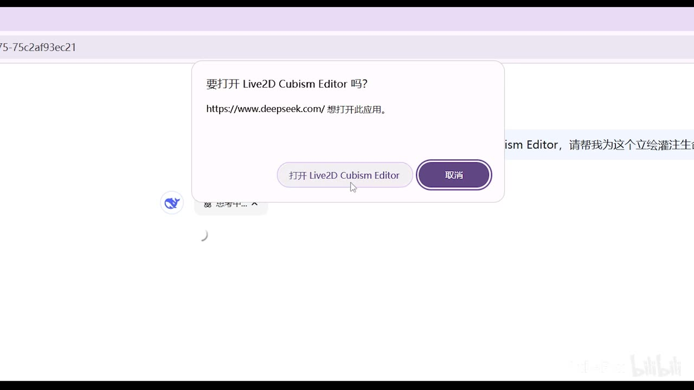
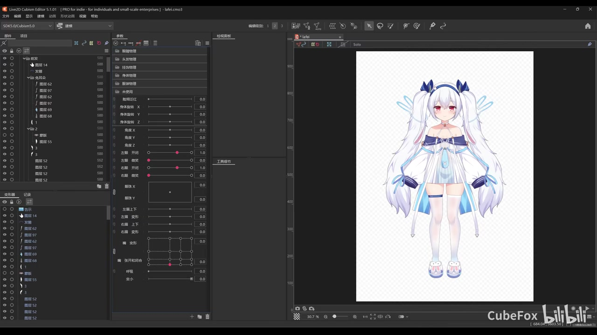
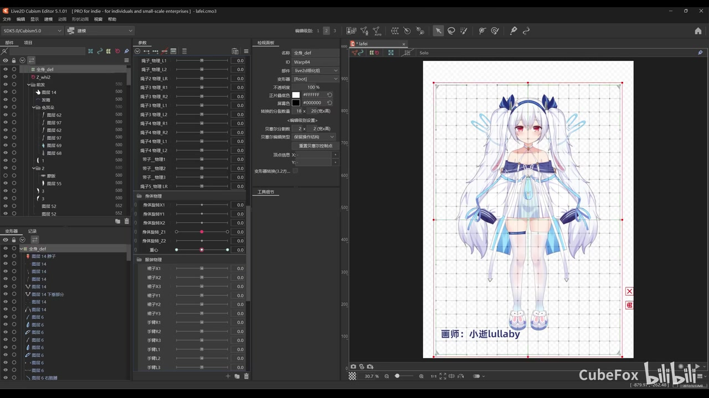

# 「Live2D」解放双手，让Live2D自己建模

> 来源：[Bilibili 视频](https://www.bilibili.com/video/BV1xwNPedEcT)  
> UP 主：Cubefox｜发布时间：2025-02-04｜视频时长：约 118 秒｜分辨率：2560×1440

## 小结

这是一支以 DeepSeek 和 Live2D Cubism Editor 为主题的剪辑演示视频：画面将 DeepSeek 对话页面、系统“打开 Live2D Cubism Editor”的确认框，以及已经载入 Live2D 模型的 Cubism Editor 界面串联起来，营造出“让 AI 自己完成 Live2D 建模”的效果。

但这并非真实可复现的 AI 自动建模工作流。UP 主在视频简介中明确说明：**模型由本人亲手制作，DeepSeek 并不具备这样的能力；视频经过剪辑，请勿当真。** 因此，视频的核心价值是创意表达与对当时 DeepSeek 热度的玩梗，而不是 Live2D 自动化建模教程。

画面确实展示了 Live2D Cubism Editor 中一个已存在的 `.cmo3` 工程：可以看到角色立绘、部件层级、参数面板、变形器/网格编辑区域等典型建模界面。这些画面只能证明成品工程被打开和展示，不能证明 DeepSeek 创建了模型、拆分了图层、生成了网格或设置了参数。

对于想研究“AI 能否辅助 Live2D 制作”的读者，视频可以提供一个合理的讨论入口：若未来 Cubism Editor 提供足够完备、稳定且可编程的 API，理论上可由脚本或智能体辅助执行部分重复操作；但这属于评论区提出的设想，并非本视频已经实现或验证的功能。

视频发布于 2025-02-04，正处于 DeepSeek 获得广泛讨论的时期。其“DeepSeek 可以直接建模”的叙事具有明显时效性和戏剧化包装；截至本素材范围内，没有任何可验证的项目文件、脚本、API 调用记录、操作日志或完整制作过程可用于支持自动建模结论。

## 思维导图

## 目录

- [背景、定位与时效性](#背景定位与时效性)
- [画面叙事：从 DeepSeek 到 Cubism Editor](#画面叙事从-deepseek-到-cubism-editor)
- [画面可确认的 Live2D 技术信息](#画面可确认的-live2d-技术信息)
- [可迁移经验：如何判断 AI 自动化演示是否可信](#可迁移经验如何判断-ai-自动化演示是否可信)
- [限制、参数与结论](#限制参数与结论)
- [关键帧索引](#关键帧索引)
- [字幕比对](#字幕比对)
- [评论分析](#评论分析)
- [处理记录](#处理记录)

## 背景、定位与时效性 [00:00](https://www.bilibili.com/video/BV1xwNPedEcT?t=0)

视频标题为“「Live2D」解放双手，让Live2D自己建模”，标签包含“deepseek”“DeepseekR1”“Live2D”“模型”“软件应用”等。结合标题和画面，作品借用了“AI Agent 可以操作桌面软件”的想象：用户似乎向 DeepSeek 提出让角色立绘“活起来”的请求，随后由 DeepSeek 打开 Live2D Cubism Editor，最后展示完成建模的角色。

不过，判断本片时应以 UP 主提供的文字说明为最高优先级：

> 模型是亲手建的，DeepSeek 深度求索并不具备这样的能力。视频是剪出来的，勿当真。

这段说明直接否定了“DeepSeek 已在视频中完成 Live2D 自动建模”的字面解读。更严谨地说：

1. **可确认事实**：视频展示了 DeepSeek 网页、系统打开应用的确认界面，以及 Cubism Editor 内的已建工程。
2. **作者明确陈述**：成品模型由 Cubefox 亲手制作，视频经过剪辑。
3. **不能由视频推出的结论**：DeepSeek 能够原生启动 Cubism、读取立绘、自动完成切图、生成 ArtMesh、创建变形器、绑定参数或导出模型。
4. **合理但未验证的技术设想**：未来可通过软件 API、桌面自动化、脚本和模型推理组合，辅助执行某些 Live2D 制作环节；这一点不等于本视频已经实现。

视频简介还列出署名信息：画师为“小逝lullaby”，模型制作者为“CubeFox”。这也进一步说明画面中的模型是有明确人工创作来源的成品。

> 时间轴说明：站内未提供可用字幕，本次 ASR 亦未产生带时间戳的语音段，因此无法依据字幕精确切分各镜头的起止秒数。本文涉及画面阶段的章节均以视频起点 `00:00` 作为可验证跳转入口，不将关键帧编号或文字顺序伪装为精确时间。

## 画面叙事：从 DeepSeek 到 Cubism Editor [00:00](https://www.bilibili.com/video/BV1xwNPedEcT?t=0)

### 1. DeepSeek 页面与“让立绘活起来”的请求

开头关键帧显示浏览器中的 DeepSeek 对话页面。页面右侧可见一段用户输入，其可辨识内容为“我已经打开了 Live2D Cubism Editor，请帮我为这个立绘注生……”；末尾文字因截图清晰度和截取范围不足而无法可靠补全，故不将其扩写为完整提示词。

这一步承担的是叙事设定：用户将 Live2D 建模任务交给 AI。它并未展示实际发送后的回答内容，也没有展示 DeepSeek 输出任何工程步骤、脚本、参数表或模型文件。

> 图：该帧建立了“由 DeepSeek 接收 Live2D 建模请求”的故事前提。它的价值在于说明视频的创意起点；但画面没有提供 AI 成功执行任务的技术证据。

### 2. 浏览器请求打开 Live2D Cubism Editor

后续关键帧出现浏览器级确认窗口，窗口文字为“要打开 Live2D Cubism Editor 吗？”，并显示来源为 `https://www.deepseek.com/`，下方有“打开 Live2D Cubism Editor”和“取消”两个选项。

这类画面可被理解为网页尝试通过自定义协议、关联应用或浏览器外部应用调用机制唤起桌面软件。需要特别区分两层含义：

- **画面层可见内容**：浏览器出现了打开 Cubism Editor 的确认提示。
- **不能仅凭该提示确认的内容**：DeepSeek 是否真的具备对 Cubism 的控制权限、是否传递了有效建模指令、是否读取或修改了工程文件。

即使某网页能够触发系统打开指定应用，也不代表该网页或其中的 AI 模型拥有该软件的完整自动化能力。启动应用、向应用传递参数、读取工程状态、操纵 GUI、写入工程文件，是复杂度和权限边界完全不同的能力。

> 图：该帧展示了浏览器到桌面应用的“打开”衔接。它有助于理解视频如何制造连贯的自动化效果，但不能证明后续建模操作由 DeepSeek 完成。

### 3. Cubism Editor 中已打开的角色模型

关键帧显示软件标题栏为 **Live2D Cubism Editor 5.1.01**，并带有 “PRO for indie - for individuals and small-scale enterprises” 字样；左上区域还能看到 “SDK 5.0.0”。窗口标题末尾显示工程文件名为 `lafei.cmo3`。

主画布中是一名白发蓝白服装的角色全身立绘。界面左侧是部件/层级树，中部是参数区域，右侧为画布。该界面所呈现的是一个已经具有部件结构、参数与显示结果的 Live2D 工程。

从画面可确认的工作状态是：

- Cubism Editor 已打开某个 `.cmo3` 工程；
- 角色立绘已经被组织为多个可管理层级或部件；
- 参数面板中可见多组滑杆与二维参数控制区域；
- 画布中角色以完整形态显示。

但模型“已经存在”与“正在被自动创建”是两回事。该帧没有显示从零开始导入 PSD、自动拆件、生成网格、绑定参数或保存工程的过程。

> 图：该帧是判断技术边界的关键证据。它证明视频展示了一个 `.cmo3` 成品工程及其编辑界面，但并不展示成品的生成来源。

## 画面可确认的 Live2D 技术信息 [00:00](https://www.bilibili.com/video/BV1xwNPedEcT?t=0)

### Cubism 工程、层级与参数面板

从编辑器画面可见，左侧存在较长的层级列表，名称中多次出现“图层”字样；中部参数区可见诸如身体相关控制、角度 `X / Y / Z`、眼睛、左右眉、呼吸等中文标签或相近界面元素。不同项目的命名规范可由制作者自定义，因此不应仅凭截图把每一项都认定为固定官方参数名称。

画面可反映的 Live2D 建模常见结构包括：

| 可见区域 | 画面中可确认的作用 | 不能据此确认的内容 |
| --- | --- | --- |
| 部件/层级树 | 管理角色立绘拆分后的对象或图层结构 | 自动拆分是否由 AI 完成 |
| 参数面板 | 存在滑杆、数值和二维参数控制区 | 所有参数的实际范围、绑定逻辑与质量 |
| 画布 | 显示完整角色的当前状态 | 是否已经完成全部表情、物理、动作与导出 |
| 编辑工具区 | 可见网格/变形相关工具界面 | 网格是否自动生成、是否经过人工修正 |

视频中最值得保留的技术信息不是“AI 自动建模成功”，而是它把 Live2D 成品工程最常见的几个关键层面放进同一画面：**立绘部件、参数、变形结构与最终视觉呈现**。

### 网格与变形编辑状态

另一关键帧中，角色画面叠加规则网格，并有红色外框及控制点；左侧层级中可见大量对象条目。该画面表明编辑器进入了与变形器、网格或对象编辑有关的状态。

Live2D 建模中，网格和变形控制通常用于把二维图层随参数产生形变，例如头部转动、身体倾斜、头发摆动、服装局部拉伸等。视频仅展示了编辑状态，并未展示具体的网格节点调整或形变前后对比，因此不能评价该模型的网格质量、参数插值、变形自然度或物理效果。

画面右下/下方还可见“画师：小逝lullaby”署名，这与视频简介中的署名一致。

> 图：该帧的价值在于直观呈现 Live2D 模型并非单张静态图片，而是涉及对象结构与变形控制的工程。它同时提醒读者：展示网格不等于展示了网格的创建过程，更不等于证明 AI 自动完成了该过程。

### 可见版本与工程参数

以下参数来自画面或元数据，可作为素材记录，不应理解为“自动建模所需配置”：

| 项目 | 可确认值 | 说明 |
| --- | --- | --- |
| 视频时长 | 元数据 118 秒；ASR 音频时长约 117.653 秒 | 两者存在正常的封装/取整差异 |
| 视频分辨率 | 2560×1440 | Bilibili 元数据提供 |
| 编辑器版本 | Live2D Cubism Editor 5.1.01 | 来自关键帧标题栏 |
| 编辑器版本属性 | PRO for indie - for individuals and small-scale enterprises | 来自关键帧标题栏 |
| 可见 SDK 标识 | SDK 5.0.0 | 来自关键帧左上区域 |
| 工程扩展名 | `.cmo3` | 标题栏显示 `lafei.cmo3` |
| 可见画布缩放 | 约 30.7% | 来自画面底部状态区域，受截图清晰度限制 |
| 画师署名 | 小逝lullaby | 视频简介及关键帧均可见 |
| 模型制作者署名 | CubeFox / Cubefox | 视频简介提供 |

## 可迁移经验：如何判断 AI 自动化演示是否可信 [00:00](https://www.bilibili.com/video/BV1xwNPedEcT?t=0)

本视频虽然不是实操教程，但非常适合作为辨别“AI 操作专业软件”演示的案例。面对类似内容，可按以下顺序核验。

### 步骤 1：先查作者是否声明了演示性质

本片最关键的核验材料不是画面细节，而是简介中的作者自述。作者已经明确说明模型由人工完成、视频为剪辑，因此应优先接受这一说明，而不是将视觉连贯性误解为功能证明。

适用原则：

1. 作者声明为剪辑、概念演示、整活或模拟时，不把它转述成真实功能。
2. 作者没有声明时，也不能因为画面出现“AI 页面 → 软件界面 → 成品”就默认因果成立。
3. 若内容涉及软件能力、产品功能或工作流，优先寻找项目文件、脚本、日志、完整录屏与可复现实验。

### 步骤 2：拆分“打开软件”与“控制软件”

浏览器弹出“打开 Live2D Cubism Editor”的窗口，最多只能支持“网页可能尝试唤起桌面应用”的判断。实际自动建模至少需要继续验证：

1. AI 如何获取立绘源文件及其图层信息；
2. AI 如何调用 Cubism 的公开接口、脚本接口或桌面自动化接口；
3. AI 如何建立 ArtMesh、变形器、参数与关键形状；
4. AI 如何处理头发、服装、遮挡关系和局部形变；
5. AI 如何校验模型质量并修复穿帮；
6. AI 如何保存 `.cmo3` 工程并导出运行时模型。

本视频没有提供这些环节的操作证据。因此，“能打开软件”不能升级为“能完成建模”。

### 步骤 3：要求提供可复现实证

如果要将“AI 辅助 Live2D 建模”作为真实技术方案，应至少要求下列材料中的一部分：

| 证据类型 | 能回答的问题 |
| --- | --- |
| 完整无剪辑录屏 | 操作是否连续发生，是否存在人工切换或预先打开的工程 |
| 提示词与模型输出 | AI 到底生成了什么指令、代码或步骤 |
| API 文档与调用日志 | AI 是否能通过正式接口控制软件 |
| 脚本源码 | 自动化逻辑是否存在、是否可审查 |
| 输入 PSD 与输出工程 | 是否真正从原始素材构建出模型 |
| `.cmo3` 版本差异 | 工程对象、参数和网格是否由流程新增 |
| 失败案例与人工修正记录 | 方案在复杂角色上的边界与实际成本 |

这也是专业创作工具领域评估 AI 自动化能力的基本方法：不只看最终成品，更看**输入、过程、输出和可重复性**。

### 步骤 4：区分“辅助”与“替代”

在实际生产中，更现实的分层通常是：

- **辅助层**：命名整理、素材检查、批量导出、重复性配置、文档生成、错误提示；
- **半自动层**：基于既定模板生成部分参数、批量处理规范化对象、辅助完成简单规则任务；
- **人工主导层**：艺术拆分判断、网格拓扑、遮挡修复、复杂形变、角色表现力控制与质量验收。

视频中的成品角色包含头发、服装装饰、身体比例和多层结构。即使未来存在自动化能力，复杂角色的最终质量仍通常需要创作者进行审美判断和人工校正；本片也没有提供任何能够推翻这一判断的证据。

## 限制、参数与结论 [00:00](https://www.bilibili.com/video/BV1xwNPedEcT?t=0)

### 证据限制

本次素材中不存在可用站内字幕；ASR 没有识别出语音片段；也没有提供逐帧时间戳、完整脚本、项目源文件、DeepSeek 对话全文或 Cubism 自动化日志。因此，本文对视频内容的整理主要依据以下材料：

- 视频元数据、标题、简介、标签与统计快照；
- 提供的关键帧画面；
- ASR 覆盖诊断；
- 可获取热评前三条。

因此，本文不会把无法在素材中确认的镜头顺序、具体操作耗时、完整提示词、模型参数范围或 AI 内部行为写成事实。

### 关于“自动建模”的最终判断

**本视频不是 DeepSeek 自动完成 Live2D 建模的技术证明，而是作者明确标注为剪辑的热点创意作品。**

可从视频中获得的可靠信息包括：

- Cubefox 展示了一个 Live2D Cubism Editor 5.1.01 中的已有角色工程；
- 工程展示了角色图层/部件、参数界面与网格/变形编辑状态；
- 角色画师署名为小逝lullaby，模型由 CubeFox 制作；
- 视频用“网页打开桌面软件”的视觉桥段构造了 AI 代为建模的叙事；
- 作者已说明 DeepSeek 不具备视频中暗示的建模能力。

不可从视频中获得的可靠信息包括：

- DeepSeek 能否直接操作 Live2D Cubism Editor；
- Cubism Editor 是否存在可供 DeepSeek 使用的完整自动建模 API；
- AI 是否能稳定完成复杂立绘的自动切图、网格、参数、物理与导出；
- 视频中任何具体模型参数、工作时长或自动化成功率。

### 时效性提示

视频发布于 2025-02-04，简介将其置于“最近 DeepSeek 大火”的讨论背景中。AI 产品、浏览器外部应用调用策略、Cubism 版本、开发者 API 和第三方自动化工具均可能在发布后变化。

因此，不能把本片当作关于当前 DeepSeek 或 Live2D Cubism 功能边界的最新说明。若需要验证当下是否存在可行的 AI 辅助工作流，应以目标版本的软件官方文档、公开 API、可运行代码和完整复现实验为准。

## 关键帧索引

| 关键帧 | 画面内容 | 正文使用价值 |
| --- | --- | --- |
| `frames/frame-001.jpg` | DeepSeek 对话页面与用户输入 | 说明视频如何建立“AI 接收建模任务”的叙事前提 |
| `frames/frame-002.jpg` | 浏览器确认打开 Live2D Cubism Editor | 用于区分“唤起应用”与“控制应用”的能力边界 |
| `frames/frame-003.jpg` | Cubism Editor 中的完整角色与参数界面 | 记录可见编辑器版本、`.cmo3` 工程及已存在的模型状态 |
| `frames/frame-004.jpg` | 角色叠加网格/变形编辑画面及画师署名 | 展示 Live2D 工程的网格化、参数化特征，并核对创作者署名 |

其余关键帧文件虽在素材目录中列出，但本次提供给 Agent 的可视画面仅包含上述四张预览，故未对未见内容作推断或引用。

## 字幕比对

| 字幕来源 | 完整性 | 专有名词 | 时间轴 | 主要问题 |
| --- | --- | --- | --- | --- |
| Bilibili 站内字幕 | 不可用 | 无法评估 | 无可用分段 | 素材明确说明“未提供可用站内字幕” |
| 本次 ASR 字幕 | 空 | 未识别出专有名词 | 无语音分段时间戳 | Whisper `medium` 自动识别语言为英语，置信度约 0.541；共 0 个语音片段，语音覆盖率为 0% |

本次 ASR 已实际检查，结果为空。其诊断提示为“未识别出语音片段，请确认源文件是否含有可听语音并使用正确音轨重试”。但诊断数据**没有**标记 `noAudioStream=true`；同时素材清单中存在提取出的 `audio/audio.wav`。因此不能将本片表述为“源视频没有音轨”，只能如实记录为：**本次 ASR 未从提取音频中识别出可用语音内容。**

最终未采用任何字幕文本作为内容依据。本文以视频简介、关键帧中的可读文字和多模态画面信息为主，并对重要词语作了以下校正或保守处理：

- `Live2D Cubism Editor 5.1.01`：来自编辑器标题栏；
- `SDK 5.0.0`：来自编辑器左上可见标识；
- `lafei.cmo3`：来自窗口标题栏；
- `小逝lullaby`：由关键帧及视频简介交叉确认；
- DeepSeek 输入框中的句子末尾不可辨识：未擅自补写为完整提示词。

## 评论分析

> 以下仅分析本次可获取的热评前三条。评论反映的是观众观点，不构成对软件功能或作者制作过程的独立验证。

### 1. Twilight-Dream（113 赞）

> “其实这也不可能完全是假的。只要Live2D Editor，把所有的API都开放。然后用代码脚本的形式写出来，让deepseek学一下就可以了。”

这条评论提出了一种技术设想：如果 Live2D Editor 提供充分开放的 API，开发者可以用代码和脚本将部分操作形式化，再让大语言模型参与调用或生成脚本。这个设想与“AI Agent + 专业软件 API”的一般路径相符，具有讨论价值。

但评论中的前提尚未得到本视频验证：其一，所需 API 是否存在、覆盖范围多大、授权条件如何，均不能由视频确认；其二，即使存在 API，也不等于复杂模型的美术拆分、网格质量和参数表现能被可靠自动化。因此，这是一项未来可能性讨论，而非本片的已实现功能。

### 2. 香菇滑鸡不想哭滑稽（29 赞）

> “一眼假，但是过程很丝滑，点赞了[doge]”

该评论准确抓住了视频的观看体验：叙事链条从对话页面到软件打开、再到成品展示，剪辑上具有连贯性。同时，“一眼假”的判断与 UP 主简介中“视频是剪出来的，勿当真”的说明一致。

它补充的是传播层面的观察，而不是技术细节：高流畅度的 UI 演示很容易让观众产生“功能已经落地”的直觉，因此更需要回到作者声明和过程证据核验。

### 3. 拂晓世尘（26 赞）

> “你不要让我失业呀😭👊”

这条评论表达了创作者面对 AI 自动化叙事时的职业焦虑。它没有提供技术证据，但反映了此类视频触及的现实议题：当 AI 被描述为能替代专业建模劳动时，观众会自然联想到岗位替代风险。

就本片而言，这种担忧不应被视频效果放大为既成事实。因为作者已明确否认 DeepSeek 具备该能力，画面也未展示自动化建模的实证流程。更稳妥的理解是：AI 可能改变部分重复性工作，但本片本身不能用于证明 Live2D 建模职业已被自动化替代。

## 处理记录

- Worker ID：`worker-mrj0wbly-5dc4e50c`
- 文档生成模型：`gpt-5.6-terra`
- ASR 模型与运行信息：`medium`；CUDA；`float16`；自动语言识别结果为 `en`，语言置信度约 `0.541015625`
- 已检查素材：视频元数据、视频简介、关键帧目录、音频提取结果、ASR 诊断、ASR 字幕输出、热评前三条。
- 使用的素材产物：`merged.mp4`、`audio/audio.wav`、`frames/`、`asr/transcript.srt`、`asr/asr-transcript.txt`、`asr/asr-result.json`、`comments/comments.json`。
- 字幕选择：站内字幕不可用；本次 ASR 输出为空且无时间分段；最终不采用字幕正文，改依据视频简介、关键帧可读文字和画面理解整理。
- 时间轴依据：没有可用 SRT 起止时间，也没有 ASR 语音分段时间戳。为避免根据文字顺序虚构时间位置，章节只链接至可确认的视频起点 `t=0`，并在正文中明确该限制。
- 关键帧选择依据：选用已提供画面预览且能直接支撑论述的 `frame-001` 至 `frame-004`，分别覆盖 AI 对话设定、外部应用唤起、已载入工程和网格/变形编辑状态。
- 缓存清理：未提供缓存清理执行结果；本文不宣称已完成缓存删除。
- 未解决问题：无法确定各关键帧的精确秒数；无法获得完整对话文本；无法验证浏览器唤起应用的实际协议、后续操作来源及任何自动化脚本/API 调用；无法依据 ASR 判断视频是否含有可识别的人声。
