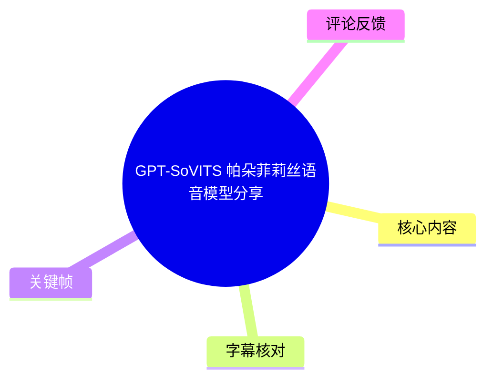
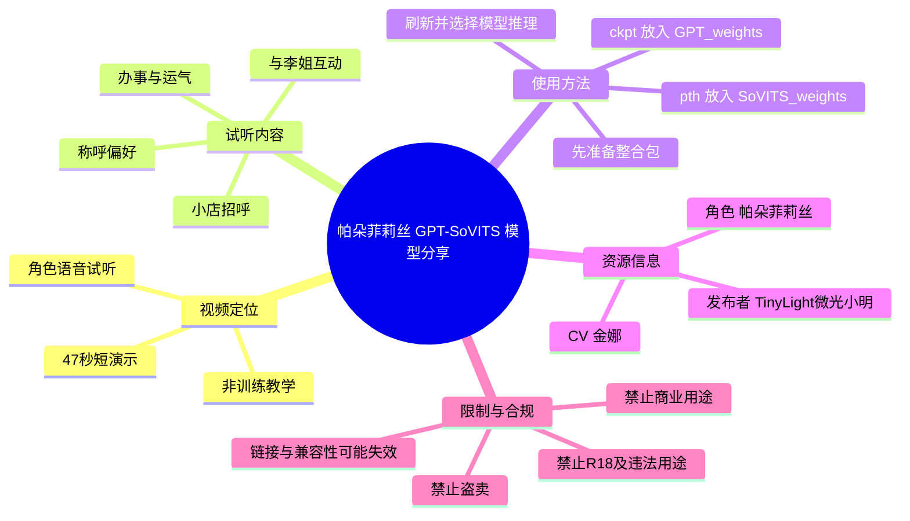
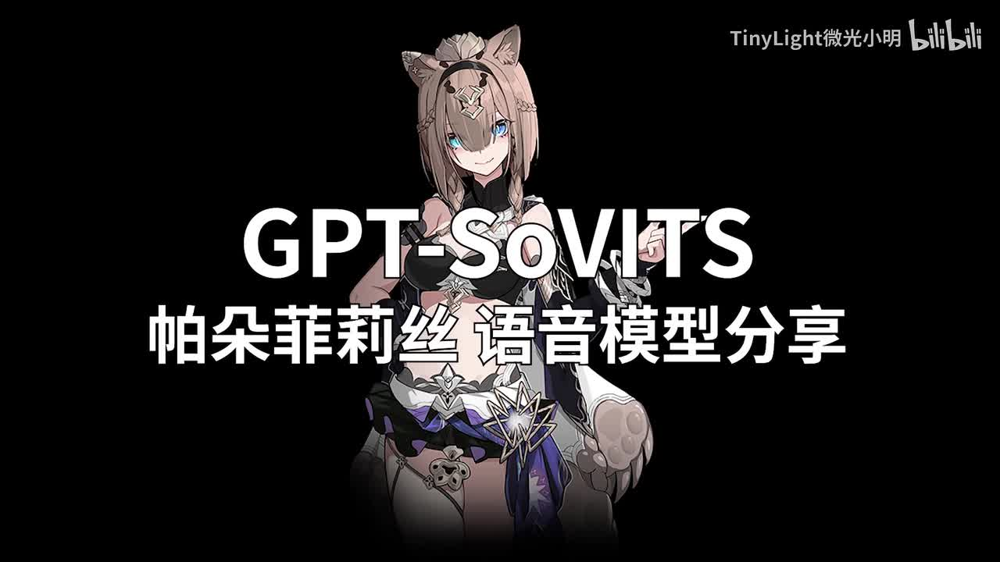

# GPT-SoVITS 帕朵菲莉丝语音模型分享

> 来源：[Bilibili 视频](https://www.bilibili.com/video/BV1Pi421S7qZ) 
> UP 主：TinyLight微光小明｜发布时间：2024-05-22｜视频时长：47 秒

## 小结

这是一支 **GPT-SoVITS《崩坏3》帕朵菲莉丝语音模型**的短试听与资源分享视频。画面以帕朵菲莉丝角色立绘配合台词字幕呈现，核心内容是让观众听取模型对角色语气的复现效果，而不是从零训练模型的教程。

视频中可确认的试听台词覆盖了“店主招呼”“称呼偏好”“办事与运气”等符合角色口吻的片段，以及后段与“李姐”互动的两句台词。ASR 共识别到 4 段语音，覆盖约 38.46 秒，音频语言判定为中文，音轨存在且识别结果带有真实时间戳。

UP 主在视频简介中补充了实际使用方法：使用者需要先准备 GPT-SoVITS 整合包；`.ckpt` 格式的 GPT 模型放进 `GPT_weights`，`.pth` 格式的 SoVITS 模型放进 `SoVITS_weights`，刷新模型列表后再选择模型进行推理。视频画面本身未展示软件界面、训练参数、推理参数或模型加载过程。

资源描述将角色标为“帕朵菲莉丝—崩坏3”，CV 为金娜，模型发布者为 TinyLight微光小明；整合包提供者标为“花儿不哭”。UP 主明确要求：**不要盗卖，不要用于商业、R18，以及法律范围外的一切用途**。使用前还应自行核对 GPT-SoVITS、素材、角色与配音相关权利状态。

该资源信息发布于 2024 年 5 月。至本次整理时（素材抓取时间为 2026-07-21），网盘链接、整合包兼容性、项目目录结构和模型可用性均可能变化；视频没有提供版本号、模型训练数据规模、授权文件或客观音质测试，因此不能将试听效果外推为所有文本、所有推理配置下的稳定表现。

## 思维导图

## 目录

- [视频定位与展示形式](#视频定位与展示形式-000003)
- [试听台词与角色表达](#试听台词与角色表达-000003)
- [模型安装与推理步骤](#模型安装与推理步骤-000009)
- [资源、署名与使用限制](#资源署名与使用限制-000009)
- [结论与时效性](#结论与时效性-000038)
- [字幕比对](#字幕比对)
- [评论分析](#评论分析)
- [处理记录](#处理记录)

## [视频定位与展示形式 [00:00:03]](https://www.bilibili.com/video/BV1Pi421S7qZ?t=3)

视频标题直接说明其主题为“GPT-SoVITS 帕朵菲莉丝语音模型分享”。开头画面以黑色背景、帕朵菲莉丝角色立绘与标题文字构成，随后保持角色立绘加字幕的形式播放试听音频。

> 图：标题页同时给出技术名称“GPT-SoVITS”、角色“帕朵菲莉丝”与“语音模型分享”的定位，是确认视频主题与非教程性质的直接画面依据。

从画面和音频可见，视频重点在于呈现合成语音听感；没有展示 GPT-SoVITS WebUI、命令行、模型选择下拉框、训练日志、参考音频切分或参数设置。因此，下文有关文件夹和后缀的操作信息来自视频简介，而非对视频画面流程的推断。

## [试听台词与角色表达 [00:00:03]](https://www.bilibili.com/video/BV1Pi421S7qZ?t=3)

### [第一段：小店招呼 [00:00:03]](https://www.bilibili.com/video/BV1Pi421S7qZ?t=3)

ASR 时间段为 **00:00:03,060—00:00:09,100**，识别文本为：

> “嘿嘿嘿，这位老板，欢迎来到我的小店，随便看随边看，你想来点什么？”

该段以“老板”“小店”“想来点什么”等表达塑造售卖、招呼客人的场景。画面字幕可直接确认“欢迎来到我的小店”，与 ASR 的核心句意一致；“随便看随边看”是 ASR 的重复性识别结果，无法仅凭现有素材确认其准确断句，故保留原识别形式而不擅自改写。

> 图：画面中的“欢迎来到我的小店”字幕与角色立绘共同对应试听开场，能够交叉验证 ASR 首段的主要语义，并展示视频以字幕辅助听辨的呈现方式。

### [第二段：称呼、委托与运气 [00:00:09]](https://www.bilibili.com/video/BV1Pi421S7qZ?t=9)

ASR 时间段为 **00:00:09,660—00:00:33,820**，为整支视频最长的一段连续语音，识别结果如下：

> “不，叫我帕朵或者菲利斯就好了啊，什么，有蛋生液，那可太好了。人也好，物也好，只要抱手给够了，咱肯定都能帮你弄到手。嘿嘿，你可要相信咱，咋的运气可好了，这点咱可从不吹牛。帕杜，我的小帕兔回来了啊，怎么是你。”

其中，“帕朵”与视频标题、角色名相吻合；画面字幕也可确认“叫我帕朵或者菲莉丝就好啦”这一核心意思。ASR 写作“菲利斯”，而角色中文常见译名及画面可见字幕为“菲莉丝”，因此正文采用 **“帕朵菲莉丝”** 作为角色名称，但不把 ASR 中其余可能存在同音误识别的词语强行校正。

这一长段可听出模型尝试表现多种语气：先是纠正称呼，之后转为接单式、带“咱”字的轻松表达，再进入与其他角色对话的情境。它能够说明试听并非只包含单句静态朗读；但视频未给出原声对照、MOS 评分、同文本 A/B 对比或推理配置，不能据此量化“还原度”。

### [第三段：对“李姐”的回应 [00:00:33]](https://www.bilibili.com/video/BV1Pi421S7qZ?t=33)

ASR 时间段为 **00:00:33,820—00:00:36,260**：

> “啊李姐，不要再这样捉弄我了。”

该段是独立的短句，呈现角色在被戏弄时的回应。由于视频以单张角色立绘和逐句字幕为主，观众对情绪变化的判断主要来自合成语音的音色、语速与语气，而不是角色动画表演。

### [第四段：收束句 [00:00:38]](https://www.bilibili.com/video/BV1Pi421S7qZ?t=38)

ASR 时间段为 **00:00:38,250—00:00:44,070**：

> “李姐还是不要说这种话了吧，不想死。”

这也是视频中最后一段被识别到的有声台词。ASR 诊断显示最后语音结束于 44.07 秒，而视频总时长为 47 秒，末尾约 3 秒没有识别到有效语音内容。现有素材没有提供末尾文字卡或额外口播信息，不能补充为未证实的结语。

## [模型安装与推理步骤 [00:00:09]](https://www.bilibili.com/video/BV1Pi421S7qZ?t=9)

以下流程来自 UP 主视频简介，是其提供的模型使用说明；**并未在这 47 秒视频画面中演示**。

1. **准备 GPT-SoVITS 整合包**  
   UP 主强调，使用模型前必须先拥有 GPT-SoVITS 整合包。简介标注整合包提供者为“花儿不哭”，并提供了一个“如何使用整合包”的参考视频：`BV12g4y1m7Uw`。同时给出 GPT-SoVITS GitHub 地址：  
   <https://github.com/RVC-Boss/GPT-SoVITS>

2. **区分两类模型文件**  
   简介明确给出文件后缀与目标目录的对应关系：

   | 模型类型 | 文件后缀 | 放置目录 |
   | --- | --- | --- |
   | GPT 模型 | `.ckpt` | `GPT_weights` |
   | SoVITS 模型 | `.pth` | `SoVITS_weights` |

3. **刷新模型列表并选择推理模型**  
   在相应目录放入文件后，刷新模型列表，即可选择模型进行推理。简介没有说明“刷新”按钮位置、具体 WebUI 版本、是否需要重启服务，也没有给出文本语言、参考音频、切分方式、温度、采样参数或输出格式等配置。

4. **准备模型资源**  
   简介提供了百度网盘和夸克网盘链接，并给出百度网盘提取码 `pard`。这些链接属于发布时资源信息；本整理未对其可访问性、文件内容、文件哈希或安全性进行验证。

> 实践注意：目录名、模型加载机制和文件兼容性会随整合包或 GPT-SoVITS 版本变化。若界面无法识别模型，应优先核对所用整合包的版本说明和实际目录结构，而不是假定本视频简介适用于所有版本。

## [资源、署名与使用限制 [00:00:09]](https://www.bilibili.com/video/BV1Pi421S7qZ?t=9)

### 资源归属信息

视频简介中明确列出：

| 项目 | 简介中的信息 |
| --- | --- |
| 角色 | 帕朵菲莉丝—《崩坏3》 |
| CV | 金娜 |
| 模型发布 | TinyLight微光小明 |
| 整合包提供 | 花儿不哭 |
| 模型格式 | GPT `.ckpt` + SoVITS `.pth` |
| 资源渠道 | 百度网盘、夸克网盘 |
| 百度网盘提取码 | `pard` |

UP 主还表达了对原角色配音的主观看法：认为“娜娜子配的帕朵真的是太可爱了”，同时坦言自己难以还原其“灵动的感觉”，因此只挑选了相对普通的语气进行模型展示。这是发布者对试听目标和效果边界的自我说明，不等同于对模型质量的客观评测。

### 使用边界

简介中的限制措辞包括：

- 请不要盗卖；
- 请不要用于商业用途；
- 请不要用于 R18；
- 请不要用于法律范围外的一切用途。

这些要求应被视为发布者提出的使用条件。同时，模型涉及游戏角色与真人配音风格，使用者仍需自行确认所在地法律、平台规则、项目许可证、角色相关权利以及声音人格权益。视频未提供正式授权协议、再分发规则、训练素材来源或商业授权文件，不能将“可下载”理解为已获得全面权利授权。

## [结论与时效性 [00:00:38]](https://www.bilibili.com/video/BV1Pi421S7qZ?t=38)

这支视频的可复用价值主要有两点：其一，提供帕朵菲莉丝风格语音模型的短试听，便于初步判断角色音色与语气是否符合个人需求；其二，在简介中明确给出了 GPT-SoVITS 两类权重文件的放置路径，即 `.ckpt → GPT_weights`、`.pth → SoVITS_weights`。

但它不构成完整部署、训练或调参教程。视频没有展示：整合包版本、GPU/CPU 环境、依赖安装、参考音频要求、文本切分、推理参数、错误处理、权重文件版本，以及下载后文件是否完整。因此，实际使用效果与安装成功率仍需要以当前所用 GPT-SoVITS 环境的文档和模型包说明为准。

时效性方面，视频发布于 2024 年 5 月，而素材获取于 2026 年 7 月。项目仓库、WebUI 界面、权重兼容性、网盘资源和平台政策都可能发生变化。特别是资源链接的有效性与文件安全性未在本次整理中验证，下载和运行前应进行必要的来源核验与安全检查。

## 字幕比对

| 字幕来源 | 完整性 | 专有名词 | 时间轴 | 主要问题 |
| --- | --- | --- | --- | --- |
| Bilibili 站内字幕 | 未提供可用字幕 | 无法核验 | 无法使用 | 字幕获取流程返回 `Invalid URL`，因此没有可供比对的站内 SRT/字幕文本 |
| 本次 ASR 字幕 | 4 段，覆盖约 38.46 秒语音 | “帕朵”可用；“菲利斯”等存在同音/译名偏差风险 | 可用；含 4 个真实 SRT 时间段 | 第二段长达 24.16 秒、句间未切分；部分词语如“蛋生液”“抱手”“帕杜”“小帕兔”无法仅凭现有素材可靠校正 |

本次 ASR 使用 `medium` 模型，识别语言为中文，语言置信度约 **0.9897**，音频时长约 **46.38 秒**。诊断结果显示 `asrHasTimestamps=true`，未标记 `noAudioStream=true`，说明源视频存在音轨，且 ASR 正常获得了带时间戳的语音结果；这不是无音轨视频，也不应将站内字幕抓取失败误写为音频工具失败。

最终正文采用 **本次 ASR 的真实时间轴** 作为 Bilibili 跳转依据，并以关键帧中可见的画面字幕校验关键角色名与开场语义：

- 角色名在标题和画面中为“帕朵菲莉丝”，而 ASR 第二段写作“帕朵或者菲利斯”；正文统一使用画面与元数据支持的“帕朵菲莉丝”。
- `frames/frame-002.jpg` 可见“欢迎来到我的小店”，支持 ASR 首段的核心内容。
- 现有素材不足以可靠订正第二段中所有不清晰词语，因此保留 ASR 原文并显式标出不确定性，避免编造台词。

## 评论分析

仅处理本次可获取的热评前三条；评论反映的是观众感受，不作为模型效果或授权状态的验证证据。

1. **逆神污女（20 赞）**：“woc这么像，太神了哥”  
   - 观点：认为模型相似度很高，对试听效果给予强烈正向评价。  
   - 补充价值：说明至少有观众从短试听中感受到较强的角色辨识度。  
   - 局限：未说明比较对象、播放设备、文本条件或模型参数，属于主观即时评价，不能替代客观测评。

2. **逐火之蛾A501（10 赞）**：“13英桀起了，该考虑复现往世乐土了[doge]”  
   - 观点：将该模型放入《崩坏3》“十三英桀”角色语音复现的想象场景中。  
   - 补充价值：反映观众期待更多同系列角色模型，或希望借助语音模型重现“往世乐土”相关体验。  
   - 局限：这是玩笑化的愿望表达，不表示已有完整角色集合，也不证明存在可运行的“往世乐土”复现项目。

3. **爱莉希雅的第十三门徒（9 赞）**：“感觉这类语言模型模仿其他英桀都挺像的唯独爱莉会有点不自然……”  
   - 观点：认为同类模型模仿部分英桀较自然，但对“爱莉”可能不够自然。  
   - 补充价值：提出不同角色的复现难度与自然度可能不一致，提示不能从单一角色样本泛化到所有角色。  
   - 局限：评论未给出具体模型、测试文本或可重复的评价方法，属于个人体验，不能据此得出普遍技术结论。

## 处理记录

- Worker ID：`worker-mrj0www4-e8d79408`
- 整理模型：`gpt-5.6-terra`
- 调用工具与模型：素材处理管线提供的视频元数据、音频、关键帧、ASR、评论结果；语音识别模型为 `medium`，运行设备为 CUDA，计算类型为 `float16`。
- 使用的应用工具：视频信息读取、音频导出、关键帧提取、ASR 转写与 SRT 时间轴生成、热评获取；站内字幕获取尝试执行，但返回 `Invalid URL`。
- 字幕选择：未获得可用 Bilibili 站内字幕；检查并采用本次 ASR 的 4 段带时间戳结果作为时间轴基础，结合关键帧可见字幕对“帕朵菲莉丝”和开场语义进行有限校验。
- 关键帧选择依据：选用 `frames/frame-001.jpg` 确认标题、技术名称与角色主题；选用 `frames/frame-002.jpg` 确认“欢迎来到我的小店”的开场字幕与角色展示形式。未对未提供画面内容说明的其余帧作无依据解读。
- 缓存清理：素材中未提供缓存清理日志或清理结果，无法确认是否执行过缓存清理；本记录不将其标记为已完成。
- 未解决问题：未取得站内字幕；无法对 ASR 第二段的多个疑似同音误识别词作可靠订正；未验证网盘链接有效性、权重文件完整性、模型版本、许可证及 GPT-SoVITS 当前兼容性。
