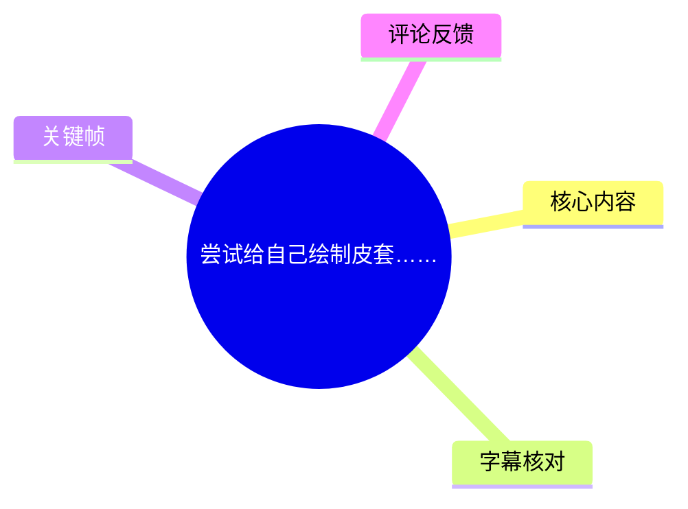
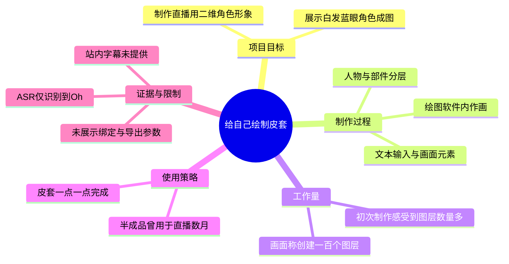
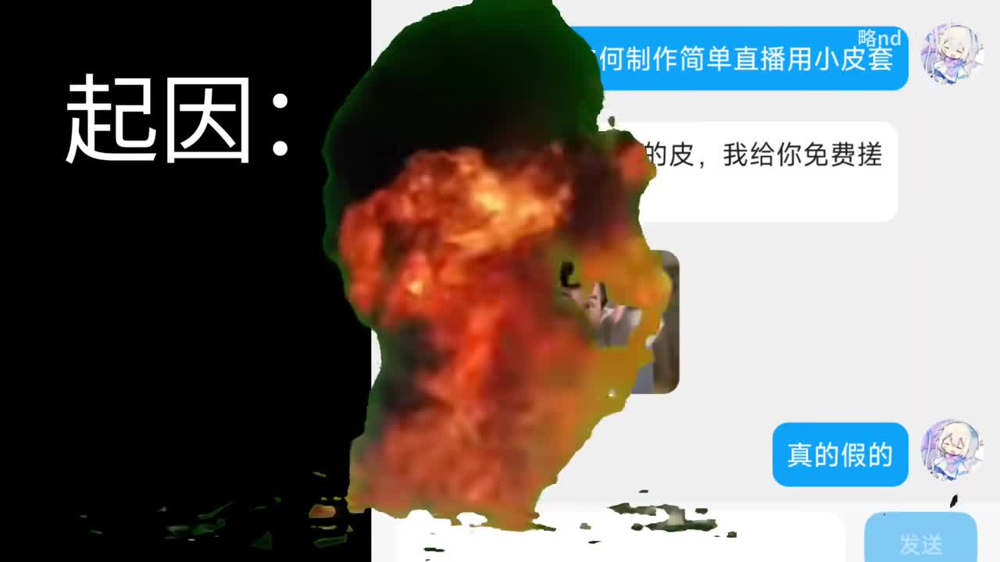
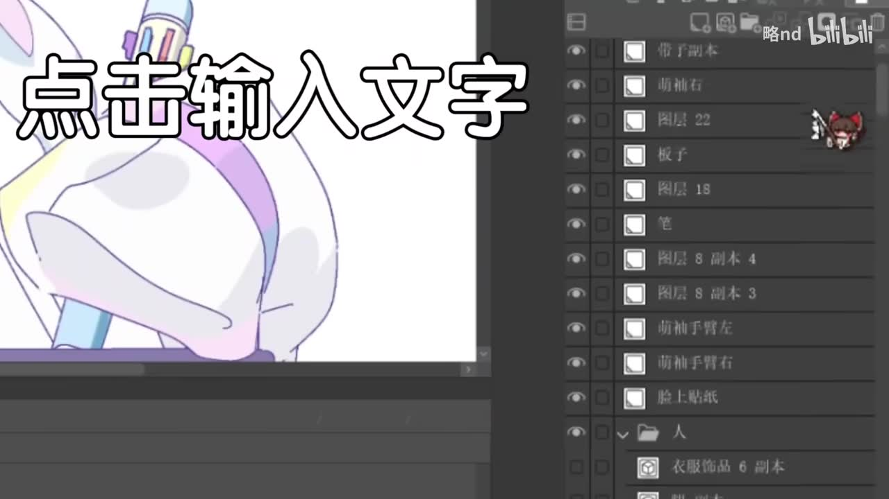
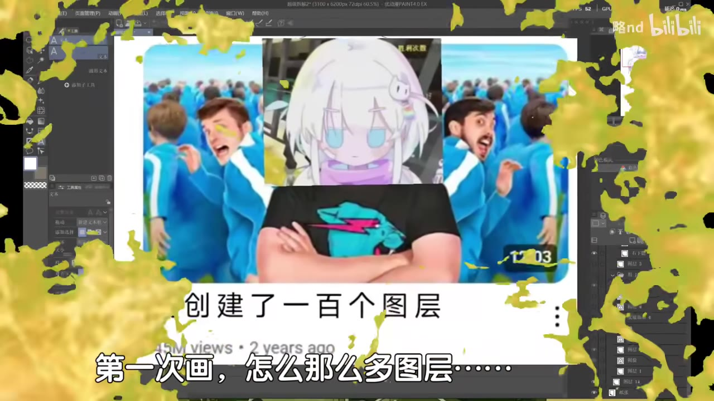
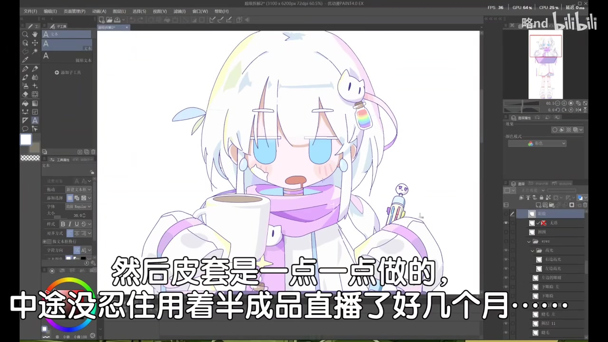

# 尝试给自己绘制皮套……

> 来源：[Bilibili 视频](https://www.bilibili.com/video/BV1KU92ByE8b) 
> UP 主：略nd｜时长：67 秒｜分辨率：1920×1080｜合集：AIcode  
> 数据抓取时间：2026-07-16。互动数据会随时间变化，本文所述播放、点赞与评论仅对应素材抓取时的快照。

## 小结

这是一支以短视频节奏呈现的绘图过程/成果记录。UP 主围绕“给自己绘制皮套”这一目标，展示了在绘图软件中制作一个白发、蓝眼、紫色围巾风格的二维角色形象，并以多个表情与局部画面强调制作过程的工作量和趣味性。

视频可明确观察到的核心经验是：**用于直播展示的二维形象并非单张成图，而会被拆分为大量独立图层**。画面中出现“创建了一百个图层”及“第一次画，怎么那么多图层……”等文字；软件图层面板也显示了眼睛、头发、衣服、人物等分层项目。这说明作者面对的是便于后续控制、编辑或直播使用的分层绘制，而不是只追求一张静态插画。

视频还通过字幕说明，皮套是“一点一点做的”，且作者在制作尚未完成时，曾“用着半成品直播了好几个月”。这反映出一种渐进式实践路径：先以可用的半成品投入使用，再持续补全细节；但视频没有展示具体绑定软件、导出格式、面部捕捉设置或图层命名规范，因此不能将其视为完整的 Live2D、VTube Studio 或其他软件教程。

本片几乎没有可用的口语信息：本次 ASR 仅在 00:00:03.470—00:00:04.290 识别出英文“`Oh`”，语音覆盖率为 1.24%。因此，正文主要依据画面内可读文字、绘图软件界面、角色成图以及关键帧进行整理；带有明确时间轴的口语内容仅限上述 ASR 分段。

适合希望理解“直播用二维形象为何需要复杂分层”、正在从静态角色图向可编辑皮套过渡的初学者阅读。其限制是视频长度仅 67 秒、未提供站内字幕，且缺少可复现的具体操作参数；其中的“一百个图层”应理解为作者本次项目画面中呈现的工作量，而不是所有皮套的通用硬性要求。

## 思维导图

## 目录

- [背景与素材边界](#背景与素材边界)
- [开场：直播用小皮套的制作语境](#开场直播用小皮套的制作语境)
- [分层绘制：从输入文字到大量图层](#分层绘制从输入文字到大量图层)
- [制作工作量：一百个图层的直观呈现](#制作工作量一百个图层的直观呈现)
- [半成品先投入直播：渐进完成的经验](#半成品先投入直播渐进完成的经验)
- [可迁移步骤、参数与限制](#可迁移步骤参数与限制)
- [字幕比对](#字幕比对)
- [评论分析](#评论分析)
- [处理记录](#处理记录)

## 背景与素材边界

视频标题为“尝试给自己绘制皮套……”，UP 主为“略nd”。封面/关键帧中的聊天界面、绘图软件界面以及角色成图共同指向：这是一项为直播用途制作二维角色形象的个人创作尝试。

从可见画面看，作品采用卡通化、Q 版角色风格：角色具有浅色头发、蓝色眼睛、紫色围巾和白色系服装，并出现咖啡杯、发饰、笔等配件或场景元素。绘图界面右侧可见大量图层条目，表明作者正在进行可独立编辑的部件管理。

需要区分以下三类信息：

1. **视频直接呈现的事实**：使用绘图软件、存在大量图层、画面文字称“创建了一百个图层”、皮套逐步完成、半成品曾用于直播数月。
2. **合理但未被视频完整验证的推断**：多图层可能服务于后续局部控制、状态切换或编辑便利；这是直播皮套常见需求，但视频没有展示后续绑定步骤。
3. **视频没有提供的信息**：软件名称与版本、画布尺寸、笔刷参数、图层总数是否精确为 100、是否使用 Live2D、采用何种面捕工具、导出格式、电脑配置和制作总时长。

视频的唯一 ASR 语音片段在 [00:00:03](https://www.bilibili.com/video/BV1KU92ByE8b?t=3) 出现，故后续画面段落不擅自补写未经字幕或关键帧证实的精确时间点。

## 开场：直播用小皮套的制作语境 [00:00:03](https://www.bilibili.com/video/BV1KU92ByE8b?t=3)

开场关键帧采用聊天窗口与爆炸特效的拼接式表达。右侧蓝色气泡顶部可辨识“略nd 如何制作简单直播用小皮套”的字样；其下方还有被特效遮挡的对话内容，无法完整可靠还原。右下蓝色气泡可读为“真的假的”。

这组画面建立了视频的情境：作者将“制作简单直播用小皮套”作为主题，以夸张的爆炸特效表现对相关请求或设想的反应。由于中间文本被特效大面积遮蔽，不能据此补全聊天双方身份、承诺内容或制作条件。

> 图：关键帧呈现视频以聊天记录风格引入“简单直播用小皮套”的主题。中部文字被爆炸特效遮挡，因此仅可将可辨识标题作为语境证据，不能把遮挡区域当作可验证字幕。

本次 ASR 在 00:00:03.470—00:00:04.290 的识别结果为“`Oh`”。这是素材中唯一带精确时间戳的语音转写，不包含对制作方法、软件或参数的说明。

## 分层绘制：从输入文字到大量图层

画面切入绘图软件工作区。左侧是角色局部，右侧为图层面板；画面覆盖大字“点击输入文字”。这更像是短视频剪辑中的文字效果或正在编辑文字元素的状态，而非可完整复现的教学步骤。

图层面板中能辨识出多行图层/文件夹条目以及缩略图。可读或部分可读的项目包括“眼睛”“头发”“脸上贴纸”“人物”等类别；部分条目因分辨率和遮挡无法准确转录。无论具体命名为何，界面能说明作者不是将角色作为单一图层处理，而是将不同部位或素材拆开管理。

> 图：角色局部位于画布左侧，右侧集中显示大量图层条目。它直接支撑“皮套制作涉及分层管理”的判断；但截图没有显示每个图层的完整名称、层级关系和功能，不能反推出完整工程结构。

对于直播形象制作而言，分层的实际价值通常在于保留局部可编辑性，例如将眼部、头发、服饰、装饰等对象分开处理。但这只是依据界面结构作出的通用解释；视频本身没有展示某一层如何被绑定、切换或驱动。

## 制作工作量：一百个图层的直观呈现

关键帧将绘图软件界面与网络梗图并置，画面中央的文字为“创建了一百个图层”，底部字幕为“第一次画，怎么那么多图层……”。右侧图层栏仍能看到密集的层级条目，构成对“图层很多”的视觉补充。

这里可以确认两点：

- 作者以“创建了一百个图层”描述此次制作的分层量；
- 作者将自己定位为“第一次画”此类皮套，并以感叹式字幕突出初次面对多图层的压力或意外。

“一百个图层”是视频的画面陈述，不宜不加限定地推广为制作皮套的固定门槛。图层数量会受到角色复杂度、表情数量、服饰配件、是否拆分左右部件、是否预留物理效果以及后续软件工作流影响；这些变量均未在视频中展开。

> 图：画面同时给出“创建了一百个图层”“第一次画，怎么那么多图层……”两段文字，并保留图层栏作为背景。这是本片关于工作量最明确的证据，但并未给出图层清单或统计方法。

## 半成品先投入直播：渐进完成的经验

成图画面展示了一个较完整的角色：白色头发、蓝色眼睛、紫色围巾，角色端着咖啡杯，右侧仍保留绘图软件的图层列表。画面字幕写道：“然后皮套是一点一点做的，中途没忍住用着半成品直播了好几个月……”。

这段信息体现了作者的实际使用路径：

1. 不等待所有细节完成，而是逐步推进角色制作；
2. 在仍是“半成品”的状态下，已将其投入直播；
3. 该半成品使用持续了“好几个月”。

这并不是对所有创作者都适用的唯一方案，但具有实践意义：如果目标是尽快验证直播呈现效果，可以先建立可用版本，再持续迭代画面细节。相应风险是，半成品可能在视觉统一性、素材完整性或后续返工成本上留下问题；视频没有展示这些问题是否出现，也没有说明作者如何管理版本迭代。

> 图：这是视频中最完整的角色成果展示，底部字幕明确说明皮套逐步制作、半成品曾用于直播数月。其价值在于将“多图层的制作过程”与“实际直播使用”连接起来。

## 可迁移步骤、参数与限制

### 可从视频提炼的实践顺序

虽然视频不是逐步教程，但依据可见画面，可以将作者展示的工作流概括为以下顺序：

1. **明确用途**：围绕“直播用小皮套”设定项目方向，而非单纯完成静态头像。
2. **在绘图软件中建立角色画面**：绘制角色主体、服饰、头发、眼睛与附属装饰等可见元素。
3. **按部件拆分图层**：画面中可见眼睛、头发、人物等多类图层/文件夹，说明需要在绘制阶段保留不同部件的独立性。
4. **接受工程复杂度**：作者画面称创建了 100 个图层，初学者应为大量部件、层级与命名预留管理空间。
5. **先以可用版本投入实际场景**：作者在半成品阶段已经直播数月，再继续补完皮套。
6. **持续迭代完成度**：视频字幕中的“一点一点做的”表明成品不是一次性完成。

### 已知参数与可验证信息

| 项目 | 视频/素材可验证内容 | 说明 |
| --- | --- | --- |
| 视频时长 | 67 秒 | 元数据给出的总时长。 |
| 视频画面规格 | 1920×1080 | 元数据中的视频分辨率。 |
| ASR 音频时长 | 66.2465625 秒 | 本次 ASR 诊断结果。与视频总时长存在约 0.75 秒差异。 |
| ASR 语言判断 | 英语，置信度约 0.484 | 自动识别结果，不代表视频主体语言为英语。 |
| ASR 有效语音 | “Oh” | 时间为 00:00:03.470—00:00:04.290。 |
| 图层数量表述 | “创建了一百个图层” | 来自画面文字，未提供可审计的完整图层列表。 |
| 使用周期表述 | “半成品直播了好几个月” | 来自画面字幕，未给出起止日期。 |

### 视频未提供、不能补写的关键参数

- 绘图软件名称、版本、授权状态与具体功能模块；
- 画布尺寸、分辨率、DPI、色彩空间；
- 笔刷、线稿、上色、阴影与导出参数；
- 图层命名规则、父子层级、遮罩/剪贴蒙版设置；
- 角色是否经过 Live2D Cubism 或其他软件绑定；
- 面部追踪、摄像头、动作捕捉、物理参数与直播软件设置；
- “一百个图层”中哪些是绘制层、文件夹、效果层或复制层；
- 实际完成总工时、返工次数和成本。

因此，本文不将其扩展为“从绘画到可动皮套”的完整技术教程。若要复现一个可驱动直播形象，还必须另行确认绘制规范与目标驱动软件的导入要求。

## 字幕比对

| 字幕来源 | 完整性 | 专有名词 | 时间轴 | 主要问题 |
| --- | --- | --- | --- | --- |
| Bilibili 站内字幕 | 未提供可用字幕 | 无从核验 | 无从核验 | 素材明确标注未提供可用站内字幕。 |
| 本次 ASR 字幕 | 很低：仅 1 个片段、0.82 秒 | 未识别出皮套、图层或软件名 | 有真实时间戳：00:00:03.470—00:00:04.290 | 自动判定为英语，识别为“`Oh`”；语音覆盖率仅 1.24%，诊断提示可能主要为音乐、静音、音轨不匹配或识别不完整。 |

本次 ASR 结果已检查。`asr-result.json` 的诊断中**未标记** `noAudioStream=true`，且素材包包含 `audio/audio.wav`，因此不能称源视频“没有音轨”；实际情况是音轨存在，但 ASR 仅识别出极少量语音。

最终字幕策略如下：

- **不采用站内字幕**：原因是未提供可用站内字幕。
- **有限采用 ASR**：仅将带时间戳的“`Oh`”保留为 00:00:03 的语音事实，不据此延伸内容。
- **以多模态画面为正文主要依据**：使用关键帧中清晰可读的画面文字，包括“点击输入文字”“创建了一百个图层”“第一次画，怎么那么多图层……”以及“然后皮套是一点一点做的，中途没忍住用着半成品直播了好几个月……”。
- **未强行校正不可辨识内容**：开场聊天气泡存在遮挡；图层面板中多数条目分辨率有限，均未被补写成确定文本。

## 评论分析

本次素材最多可获取热评前三条，但实际仅提供 **2 条**，因此只分析这两条，不补充不存在的第三条。

### 热评 1：观众期待角色投入使用

- 评论者：耳机终结者114
- 点赞：2135
- 原文：“好了，该我们用了”

这是一条简短的调侃式支持评论。“我们用了”可理解为观众期待作者完成或启用该皮套，呼应视频的直播用途和成图展示。评论没有补充制作流程、软件或技术事实，不能作为对皮套功能已完成的验证。

### 热评 2：角色表情具有表情包传播性

- 评论者：cendchan
- 点赞：958
- 核心内容：评论者称多个画面“都能当个表情包”，并按“哼”“黑脸”“眼神呆滞”“傻眼了”等主观标签概括角色表情；同时表达“画皮套画那么久，辛苦了。越看越可爱”。

该评论补充了观众的观看体验：角色在不同画面中的表情变化被认为具有二次传播和截取为表情包的潜力，也体现出观众对作者投入时间的感知。需要注意的是，“画那么久”是评论者的感慨，而非视频给出的精确工时；可被视频直接验证的只有“半成品直播了好几个月”，不能据此推导完整制作耗时。

## 处理记录

- Worker ID：`worker-mrj0www4-e8d79408`
- 整理模型：`gpt-5.6-terra`
- ASR 模型：`medium`，运行设备为 CUDA，计算类型为 `float16`，自动语言识别为英语，语言概率 `0.48388671875`。
- 可用素材与工具产物：已读取素材包提供的元数据、音频产物 `audio/audio.wav`、ASR 结果 `asr/asr-result.json`、ASR SRT `asr/transcript.srt`、关键帧目录 `frames/`、站内字幕状态及评论数据 `comments/comments.json`。素材包未提供具体命令行、软件调用日志或绘图工程文件。
- 字幕选择：站内字幕未提供可用内容；已检查本次 ASR，确认其仅含 00:00:03.470—00:00:04.290 的“`Oh`”。正文以关键帧可读文字和软件界面为主，未将低覆盖率 ASR 作为内容主来源。
- 关键帧选择依据：
  - `frames/frame-001.jpg`：用于说明“简单直播用小皮套”的开场主题，但不转录被特效遮挡的聊天内容；
  - `frames/frame-002.jpg`：用于说明角色局部与多图层软件界面；
  - `frames/frame-003.jpg`：用于记录“创建了一百个图层”及初次制作时对图层数量的感受；
  - `frames/frame-004.jpg`：用于记录角色成图以及“半成品直播了好几个月”的画面字幕。
- 时间轴依据：唯一可直接使用的 ASR/SRT 分段为 `00:00:03,470 --> 00:00:04,290`，已换算为 3 秒并用于对应章节链接。其余章节没有可验证的分段起止时间，不按文字顺序臆造秒数。
- 缓存清理：素材中未提供缓存清理日志或执行结果，无法确认是否已清理；本文不虚构清理状态。
- 未解决问题：无法从现有素材确认绘图软件名称、图层完整结构、绑定与面捕方案、导出参数、实际总工时，以及开场被特效遮挡的聊天原文。
