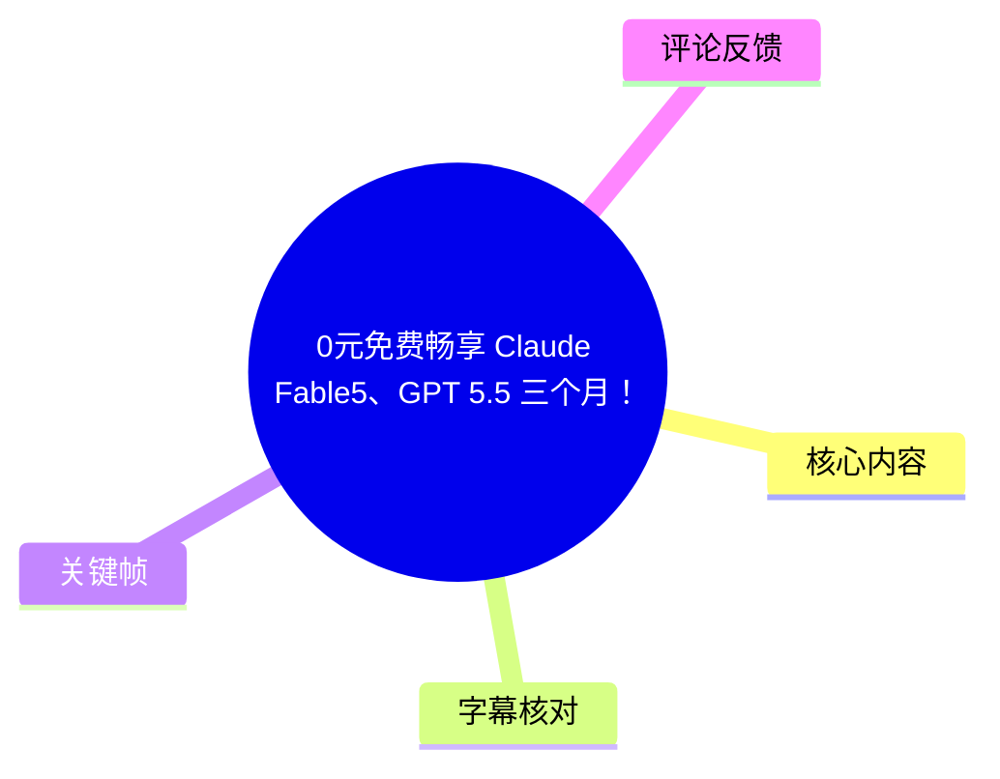
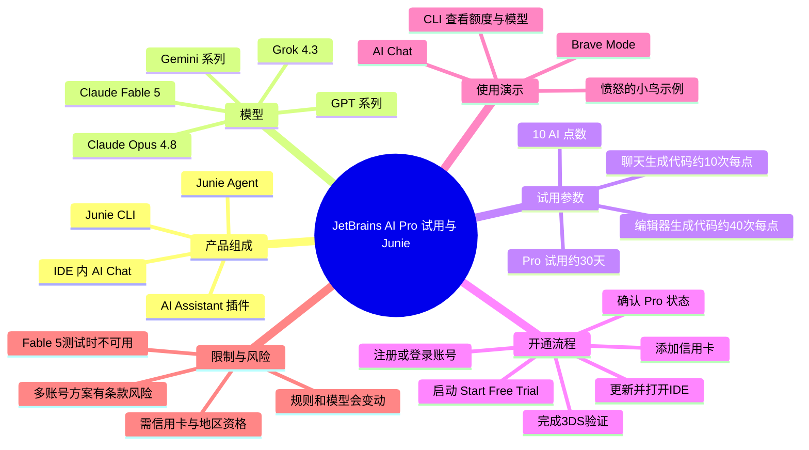
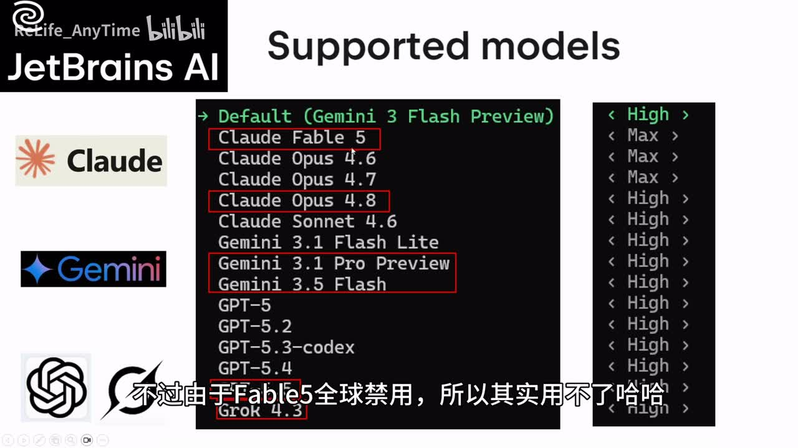
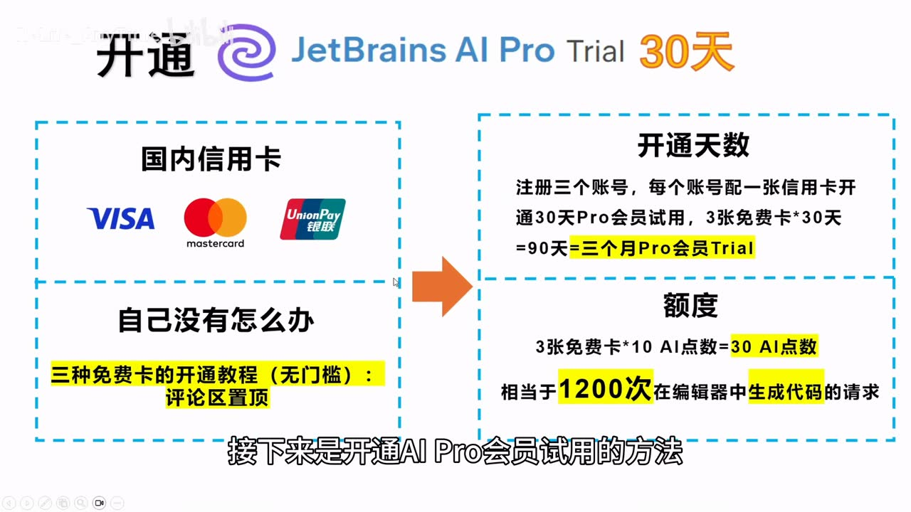
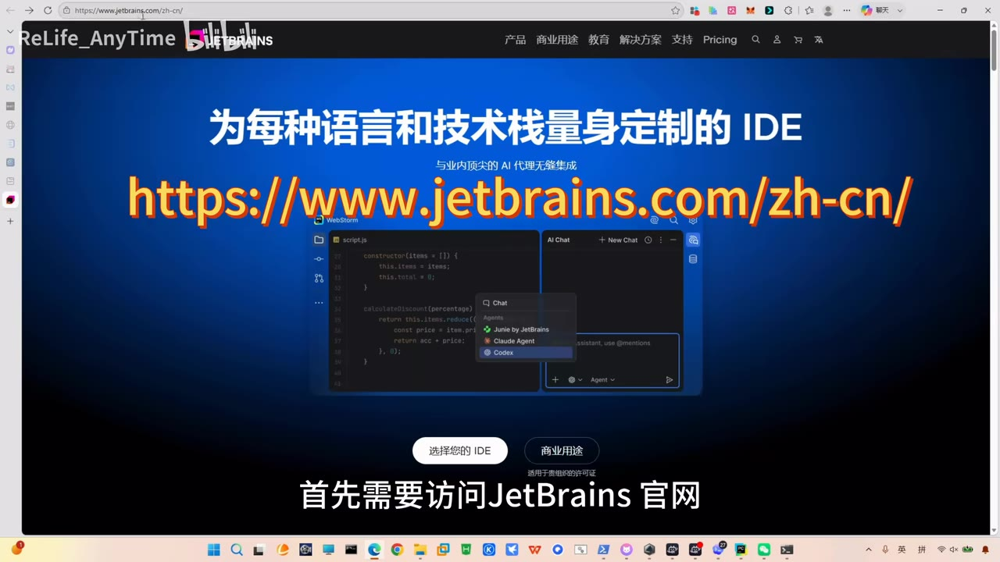

# 0元免费畅享 Claude Fable5、GPT 5.5 三个月！

> 来源：[Bilibili 视频](https://www.bilibili.com/video/BV1827B6TEhQ) 
> UP 主：ReLife_AnyTime｜视频时长：8 分 38 秒｜分辨率：3840 × 2160

## 小结

视频介绍 JetBrains 生态中的 AI Assistant 插件与 Junie CLI，并演示如何开通 JetBrains AI Pro 的 **30 天试用**，再在 PyCharm 内使用 AI Chat、Junie Agent 及其可选模型。

作者称 JetBrains AI 可接入多个主流模型，包括 Claude、GPT、Gemini、Grok 等；视频中重点展示了 Claude Opus 4.8、Claude Fable 5、Gemini 系列及 GPT 系列的模型列表。需要注意：作者同时明确表示 **Claude Fable 5 在其测试时因“全球禁用”而不可用**，因此标题中的“畅享”不等于所有列出的模型均可实际调用。

作者给出的试用参数是：单个 AI Pro 试用约 **30 天、10 AI 点数**；其口径下，1 AI 点数约对应 **10 次 AI Chat 生成代码请求**或 **40 次编辑器内生成代码请求**。据此，单账号约可得到 100 次聊天生成代码请求或 400 次编辑器生成代码请求的量级，但这只是视频的换算说法，实际计费会随模型、功能和官方规则变化。

视频提出通过多个账号分别绑定信用卡来叠加试用期，声称可形成“三个月、30 AI 点数、约 1200 次编辑器生成代码请求”。这属于作者的个人方案；多账号试用、地区设置及支付卡使用均可能受 JetBrains 服务条款、账户验证、地区资格和风控限制，**不应将其视为长期稳定、合规或必然成功的免费方案**。

实操主线是：注册/登录 JetBrains 账号 → 更新并打开 JetBrains IDE → 进入 AI Assistant → 切换至 Junie → 启动免费试用 → 添加信用卡并完成 3DS 邮箱验证 → 回到 IDE 确认 Junie Pro → 在 AI Chat 或 Junie CLI 中选择模型与查看额度。

视频适合已经使用 PyCharm、IntelliJ IDEA 等 JetBrains IDE，且希望了解 JetBrains AI/Junie 入口、试用状态和模型选择界面的开发者。所有产品版本、模型名称、试用政策、可用地区、额度规则及自动续费规则均有明显时效性，应以当前官方页面和账户实际展示为准。

## 思维导图

## 目录

- [背景：JetBrains AI、AI Assistant 与 Junie](#背景jetbrains-aiai-assistant-与-junie)
- [模型支持、试用额度与作者的三个月方案](#模型支持试用额度与作者的三个月方案)
- [开通 JetBrains AI Pro Trial 的演示步骤](#开通-jetbrains-ai-pro-trial-的演示步骤)
- [试用状态、续费说明与 IDE 内使用](#试用状态续费说明与-ide-内使用)
- [Junie Agent 与 CLI 实测](#junie-agent-与-cli-实测)
- [限制、风险与时效性](#限制风险与时效性)
- [字幕比对](#字幕比对)
- [评论分析](#评论分析)
- [处理记录](#处理记录)

## 背景：JetBrains AI、AI Assistant 与 Junie [00:24](https://www.bilibili.com/video/BV1827B6TEhQ?t=24)

作者在开场将 JetBrains 定位为开发者熟悉的 IDE 厂商，举例 PyCharm 与 IntelliJ IDEA，并指出其 AI 产品并不只是一项功能，而包含以下形态：

1. **AI Assistant**：可装在 JetBrains 系列 IDE 与 Android Studio 中的插件。
2. **AI Chat**：IDE 侧边栏中的聊天入口，可在其中选择 Agent。
3. **Junie**：JetBrains 自家的 Agent。
4. **Junie CLI**：可在 PowerShell 等命令行环境运行的命令行 Agent。

视频强调，AI Assistant 可用于多款 JetBrains IDE，说明其核心使用场景是把模型能力嵌入开发环境，而不是仅在独立网页聊天框里提问。

> 图：画面同时列出 JetBrains、PyCharm、IntelliJ IDEA、AI Assistant、JetBrains AI 与 Junie/Junie CLI。它有助于区分视频所说的“AI 产品”并非单一插件，而是 IDE 插件、图形界面 Agent 和命令行 Agent 的组合。

## 模型支持、试用额度与作者的三个月方案 [00:43](https://www.bilibili.com/video/BV1827B6TEhQ?t=43)

### 模型列表与可用性 [00:43](https://www.bilibili.com/video/BV1827B6TEhQ?t=43)

作者称 JetBrains AI 支持多家厂商的顶级/主流模型，并在口述中列举：

- Claude Opus 4.8；
- GPT 5.5；
- Gemini 3.5 Flash；
- Gemini 3.1 Pro Preview；
- Grok 4.3；
- Claude Fable 5。

这里应区分“**出现在模型选择列表**”与“**可成功调用**”：

- 作者表示 Claude Fable 5 虽然显示在支持列表中，但其测试时处于“全球禁用”状态，因此无法使用。
- 视频画面中的模型列表可见 Claude Fable 5、Claude Opus 4.8、Gemini 3.1 Pro Preview、Gemini 3.5 Flash、GPT-5、GPT-5.2、GPT-5.3-codex、GPT-5.4、Grok 4.3 等文本；模型目录可能会动态更新。
- 因此，不能仅根据标题或列表推断某一型号在当前地区、当前账户和当前版本下一定可用。

> 图：画面展示 Supported models 列表，并标记 Claude Fable 5、Claude Opus 4.8、Gemini 3.1 Pro Preview、Gemini 3.5 Flash 与 Grok 4.3；同时字幕写明 Fable 5 在该次测试中不可用。这是理解“列出模型”不等于“实际可用”的关键证据。

### 会员层级与额度换算 [01:07](https://www.bilibili.com/video/BV1827B6TEhQ?t=67)

作者称 JetBrains AI 会员分为：

- Free；
- Pro；
- Ultimate；
- 以及其重点介绍的 Pro 免费试用。

视频给出的单次 Pro 试用信息如下：

| 项目 | 视频中的说法 |
| --- | --- |
| 试用价值 | 约 10 美元 |
| 试用时长 | 约 1 个月 / 30 天 |
| AI 点数 | 10 点 |
| 点数有效期 | 1 个月 |
| 1 点数对应 AI Chat 生成代码 | 约 10 次请求 |
| 1 点数对应编辑器内生成代码 | 约 40 次请求 |
| 按 10 点估算的编辑器内请求 | 约 400 次 |

上述“请求次数”是作者基于其界面或规则做的近似换算，并非视频提供的固定官方计费表。不同模型、上下文长度、功能类型和产品更新均可能改变实际消耗。

### 作者提出的多账号试用口径 [01:32](https://www.bilibili.com/video/BV1827B6TEhQ?t=92)

作者提出的方案是：准备多张卡、注册多个账号、每个账号各开一次 30 天 Pro 试用，以获得更长的累计试用时间。他的计算为：

| 计算项 | 作者口径 |
| --- | --- |
| 账号数 | 3 个 |
| 每账号试用期 | 30 天 |
| 累计试用期 | 约 90 天 / 3 个月 |
| 每账号 AI 点数 | 10 点 |
| 累计 AI 点数 | 30 点 |
| 编辑器内生成代码请求 | 约 1200 次 |

> 图：画面将“注册三个账号、每个账号配一张信用卡、30 天 Pro 会员试用”与“3 张卡 × 10 AI 点数 = 30 AI 点数、约 1200 次编辑器生成代码请求”并列展示，直观呈现该方案的假设和计算基础。

这部分有几项不能忽略的前提：

- 作者说需要信用卡；没有卡的观众被引导查看评论区置顶教程，但提供的热评数据中未包含该置顶教程内容，无法核验其具体来源或合规性。
- 同一用户是否可使用多个账号领取试用、不同账号是否可复用同一身份或支付方式、是否受地区及风控影响，视频没有给出官方条款证据。
- 即使账户成功开启试用，也不代表每个模型的可用性、排队状态、配额或速率相同。

## 开通 JetBrains AI Pro Trial 的演示步骤 [02:22](https://www.bilibili.com/video/BV1827B6TEhQ?t=142)

### 1. 创建或登录 JetBrains 账号 [02:22](https://www.bilibili.com/video/BV1827B6TEhQ?t=142)

作者的演示从 JetBrains 官网开始：

1. 访问 JetBrains 官网。
2. 点击右上角头像入口。
3. 没有账号时选择创建账号（Create Account）；已有账号则登录。
4. 注册方式可选邮箱、Google 账号或 GitHub 账号；作者演示使用 Google 账号。

> 图：画面是 JetBrains 中文官网，中央界面展示 AI Chat 的 Agent 选择菜单，其中可见 Junie by JetBrains、Claude Agent 与 Codex。它既说明了账户操作起点，也说明视频所处的 JetBrains AI 集成环境。

### 2. 在最新版 JetBrains IDE 中启用 AI Assistant [02:30](https://www.bilibili.com/video/BV1827B6TEhQ?t=150)

作者随后打开 JetBrains 产品，以 PyCharm 为例，并明确提醒：

- **IDE 需要更新至最新版，否则可能无法使用该入口或功能。**
- 点击 IDE 右上角 AI 图标并选择“Let us go”来打开插件。
- 右侧出现 AI Chat 后，可以进入 Agent 选择界面。
- 视频所述可选项包括 Claude、Codex 和 JetBrains 自家的 Junie。

这一步的核心不是安装某个单独的第三方模型插件，而是先确认 JetBrains IDE 自身的 AI Assistant/AI Chat 已可运行。

### 3. 进入 Junie 并发起免费试用 [03:10](https://www.bilibili.com/video/BV1827B6TEhQ?t=190)

作者在 AI 面板中进入右侧的 Junie 区域，选择 **Start Free Trial**。

演示中出现“账号地区不匹配”的情况，作者给出两种处理说法：

- 在账号设置中修改地区；
- 或更换账号。

随后他演示在 IDE 菜单中依次操作：

1. 打开 `Help`；
2. 进入 `Manage Subscriptions`；
3. 在左下角点击 `Logout`；
4. 退出当前账号；
5. 点击 `Login` 登录另一个账号；
6. 确认 IDE 左下角用户名已变更，再关闭窗口回到 AI 面板。

> 注意：地区信息通常与付款、税务、服务资格和账户风控相关。视频只展示了其操作路径，并未证明修改地区或换号在所有地区均被允许；应遵守 JetBrains 当前账户政策与当地法律。

### 4. 添加信用卡、完成验证 [03:53](https://www.bilibili.com/video/BV1827B6TEhQ?t=233)

当再次点击 **Start Free Trial** 后，作者展示的流程为：

1. 系统提示需添加信用卡，点击 `Link`。
2. 在 Country/地区处选择 **United States**。
3. 点击 `Save` 保存。
4. 点击右上角 `Add Credit Card`。
5. 填写信用卡资料。
6. 点击右下角 `Confirm`。
7. 进入 **3DS 验证**环节。
8. 邮箱接收验证码并填写。
9. 验证成功后等待系统自动跳转。

作者提到，页面文字提示可能会对信用卡做约 **1 美元**的验证扣款，随后退回；但他个人实测“没有扣”。这不构成对实际扣款的保证，银行卡预授权、验证金额及退回时效均取决于发卡机构和支付处理结果。

### 5. 在 IDE 内确认绑卡与 Pro 状态 [05:03](https://www.bilibili.com/video/BV1827B6TEhQ?t=303)

验证完成后，作者回到 PyCharm：

1. 确认卡已添加成功；
2. 在 PyCharm 中确认卡的 `Link` 状态成功；
3. 鼠标悬停在右侧 Junie 区域；
4. 看到 Junie Pro 用户状态，即视为本次开通成功；
5. 回到浏览器的主界面，进入 `Transaction` 查看已生效的一个月 Pro 会员试用。

## 试用状态、续费说明与 IDE 内使用 [05:30](https://www.bilibili.com/video/BV1827B6TEhQ?t=330)

### 试用有效期与自动续费 [05:52](https://www.bilibili.com/video/BV1827B6TEhQ?t=352)

作者在账户页面确认 JetBrains AI Pro Trial 已开通，并展示其账户的有效期至“下个月 7 月 24 日”，由此判断试用维持 30 天。

关于续费，视频转述官方文档/问答的结论为：

- 试用结束后不会自动收费；
- 对已经付费的订阅也“不用取消，因为不会自动续费”。

这段内容必须结合时效性理解：视频只是作者在录制时对页面/文档的转述，未提供文档 URL、版本号或适用条件。订阅是否续费、何时扣款、是否需要取消，应以账户中的当前订阅状态、订单条款和官方帮助中心为准；不要仅凭本视频做资金决策。

### AI Chat、Junie 与 Brave Mode [06:21](https://www.bilibili.com/video/BV1827B6TEhQ?t=381)

回到 PyCharm 后，作者操作如下：

1. 打开右侧 **AI Chat**。
2. 阅读并点击同意服务条款（`Agree`）。
3. 点击第三个图标进入 Junie Pro 功能。
4. 作者评价 Junie Pro 的功能“较简陋”，称仅有三种模式。
5. 其中 **Brave Mode** 的含义被作者解释为“自动同意”。
6. 因此作者称自己更常使用 AI Chat。
7. 在左下角选择 Junie Agent。
8. 在模型列表中查看模型支持情况。

“自动同意”意味着 Agent 可能减少对执行步骤的逐项确认。视频没有展示文件修改范围、命令执行权限、沙箱边界或回滚机制；在真实项目中启用此类模式前，应先确认工作区、版本控制状态和命令权限，避免未经审查修改代码或执行危险操作。

## Junie Agent 与 CLI 实测 [07:00](https://www.bilibili.com/video/BV1827B6TEhQ?t=420)

### Claude Opus 4.8 生成小游戏 [07:00](https://www.bilibili.com/video/BV1827B6TEhQ?t=420)

为测试模型，作者选择 Opus，并输入需求：

> 帮我做一个愤怒的小鸟游戏

接着作者打开 Brave Mode / 自动同意模式，等待 Agent 完成生成。约在 7 分 20 秒，他表示 Opus 已完成游戏代码；之后启动项目并试玩。

演示结果包括：

- 游戏能够启动；
- 作者认为成品较符合预期；
- 试玩中出现“发射”、过关、进入下一关等效果；
- 作者注意到游戏中的猪会“藏起来”。

这只是一次单任务、单环境的展示，能够说明该次 Agent 工作流输出了可运行结果，但不足以评价模型在大型工程、复杂重构、稳定性、安全性或长期成本上的表现。

### Junie CLI：查看额度、模型与思考等级 [07:41](https://www.bilibili.com/video/BV1827B6TEhQ?t=461)

作者补充说明，除 IDE 插件之外，Junie 还有命令行 Agent：

1. 使用 `Usage` 查看剩余配额；
2. 需要登录已开通 Pro 试用的账号；
3. 可查看其支持的模型；
4. 可指定思考等级；
5. 作者输入“你是什么模型”进行确认；
6. 终端返回为 **Claude Opus 4.8**。

视频未提供可复制的完整 Junie CLI 安装命令、实际命令语法、参数名、版本号或操作系统兼容说明，因此不能据此补全或臆测命令。若要实际使用，应查阅 JetBrains 当前 CLI 官方文档，并以本机 `--help` 输出和账户可见模型为准。

## 限制、风险与时效性 [08:32](https://www.bilibili.com/video/BV1827B6TEhQ?t=512)

### 视频事实与不可外推部分

| 项目 | 视频能支持的结论 | 不应直接外推的结论 |
| --- | --- | --- |
| JetBrains AI 产品 | 视频展示 AI Assistant、AI Chat、Junie 和 Junie CLI | 所有 IDE、系统和版本均有完全相同入口 |
| 模型支持 | 录制界面中出现多类模型名称 | 任意账户均能调用任意模型 |
| Claude Fable 5 | 列表中出现该名称 | 作者测试时明确称其不可用 |
| Pro 试用 | 作者账户显示约 30 天试用 | 所有新账号均可获得相同试用资格 |
| AI 点数 | 视频称单试用 10 点、提供近似请求换算 | 未来计费、模型消耗和额度不变 |
| 续费 | 作者转述其当时规则为试用后不自动收费 | 当前所有地区、所有订阅都不自动续费 |
| 多账号三个月 | 是作者按多个试用账户得出的计算 | 官方允许、低风险、可持续或适合所有人 |

### 使用前检查清单

- 确认 JetBrains IDE 与 AI Assistant 均更新到当前受支持版本。
- 在开通页面核验自己账号的地区资格、价格、试用天数、额度和支付提示。
- 在绑定卡前确认卡片支持的线上支付、3DS 验证、外币预授权及可能的验证扣款。
- 在账户交易页核查试用终止日期和续费状态；必要时保存订单页面截图。
- 在模型下拉列表中以实际可选、可发送并可返回结果的状态为准。
- 使用 Agent 的自动同意模式前，确保项目已提交到版本控制，并审查命令和文件改动。
- 不将评论区链接、第三方支付卡教程或第三方模型转售服务视为官方渠道。

## 字幕比对

| 字幕来源 | 完整性 | 专有名词 | 时间轴 | 主要问题 |
| --- | --- | --- | --- | --- |
| Bilibili 站内字幕 `p01-ai-zh.srt` | 与本视频内容不匹配 | 严重错误，内容为健身“训练分化”话题 | 有完整时间轴，但仅覆盖约 0:00–3:45 的另一段内容 | 明显串片/错配，不能用于本视频知识整理 |
| 本次 ASR 字幕 | 覆盖 24.71–516.26 秒，语音覆盖率 76.85%；开头约 24 秒无语音识别内容 | 多处音译、错词和拆词，但可结合画面校正 | 具有真实分段时间戳，可用于正文定位 | 例如 JetBrains、PyCharm、IntelliJ IDEA、Claude、GPT、Gemini、Junie、3DS 等专名识别不稳定 |

### 最终字幕选择与校正原则

本次整理以 **ASR 时间轴**为定位依据，所有章节链接均使用其真实分段起始时间换算为秒数；站内字幕因内容完全不对应本视频而弃用。

结合视频标题、关键帧文本、上下文与 ASR，对以下重要词汇进行人工规范化表达：

| ASR 中的异常识别 | 正文采用写法 | 校正依据 |
| --- | --- | --- |
| Cloud Fiber 5 / Fable5 | Claude Fable 5 | 视频标题与模型列表画面 |
| Chad GED、5.5 / GT 5.5 | GPT 5.5 | 视频标题及上下文 |
| Cloud Opus 4.8 | Claude Opus 4.8 | 模型列表与终端演示 |
| GMI 3.5 Flash | Gemini 3.5 Flash | 模型列表与上下文 |
| GMI 3.1 Pro Preview | Gemini 3.1 Pro Preview | 模型列表画面 |
| Grow K 4.3 | Grok 4.3 | 模型列表画面 |
| Juni / Uni / 珠尼 | Junie | JetBrains 产品名称及画面 |
| PYcharm / PyChang | PyCharm | JetBrains IDE 正式名称 |
| Intel AIJ IDEA | IntelliJ IDEA | JetBrains IDE 正式名称 |
| 3DS 验證 | 3DS 验证 | 支付验证流程上下文 |

## 评论分析

> 按任务限制，仅处理可获取的热评前三条。提供的数据中实际仅有 2 条可获取热评，未获取到第 3 条，因此不补充推测内容。

### 1. 亲穹大队队长：请求私信总结

- 点赞数：1
- 评论内容：`@MilkyAi 总结，私信发我`
- 观点概括：评论者没有评价教程的真实性或技术细节，而是向另一用户请求总结。
- 可提取信息：反映部分观众倾向于获取压缩版步骤。
- 可信度判断：没有提供可验证的产品、付款或试用补充信息，不能作为事实依据。

### 2. bili_66678616262：推广第三方模型转售/聚合链接

- 点赞数：1
- 评论内容涉及“0.06 倍率”“人民币美元 1:1”“满血 GPT”“ccmax 的 Claude”及一个注册链接。
- 观点概括：评论者推荐一个第三方服务，并声称其提供较低倍率、模型能力及免费额度。
- 与视频的关系：这不是视频所演示的 JetBrains 官方试用流程，也没有说明与 JetBrains AI Pro、Junie 或官方模型授权的关系。
- 风险与可信度：评论包含推广链接，且其价格、模型版本、“满血”表述、隐私处理、服务稳定性和授权来源均未被视频素材验证。不要将此类评论当作官方替代方案，更不应在未核验服务条款与数据安全政策前提交代码、密钥或支付信息。

## 处理记录

- Worker ID：`worker-mrj0www4-e8d79408`
- 整理模型：`gpt-5.6-terra`
- ASR 模型：`medium`，语言识别为中文，语言概率 `0.990234375`，CUDA / float16。
- 使用的素材与工具输出：视频元数据、ASR 分段 JSON、ASR SRT、站内 SRT、关键帧目录、热评 JSON；未获得可执行命令日志，因此不虚构额外工具调用。
- 字幕选择：站内 SRT 内容为健身训练话题，与视频完全错配；采用本次 ASR 的真实时间戳作为正文时间轴，并依关键帧和语境校正专有名词。
- 关键帧选择依据：
  - `frames/frame-001.jpg`：展示 JetBrains AI、AI Assistant、Junie 与 IDE 的关系；
  - `frames/frame-002.jpg`：展示模型清单及 Fable 5 不可用这一关键限制；
  - `frames/frame-003.jpg`：展示作者“三账号/三张卡/三个月/30 点数”的计算逻辑；
  - `frames/frame-004.jpg`：展示 JetBrains 官网入口及 AI Agent 选择界面。
- 缓存清理：素材未提供缓存清理执行记录，无法确认是否已清理；本整理不将“未提供记录”表述为已完成清理。
- 未解决问题：
  - 未提供 JetBrains 官方试用政策页面、价格页、订阅条款或 CLI 文档链接，无法独立核验作者关于额度、地区、自动续费和多账号试用的说法；
  - 视频展示的模型名称与可用性会随产品更新、账号地区和配额变化；
  - 热评仅获取到 2 条，未获取到第 3 条。
