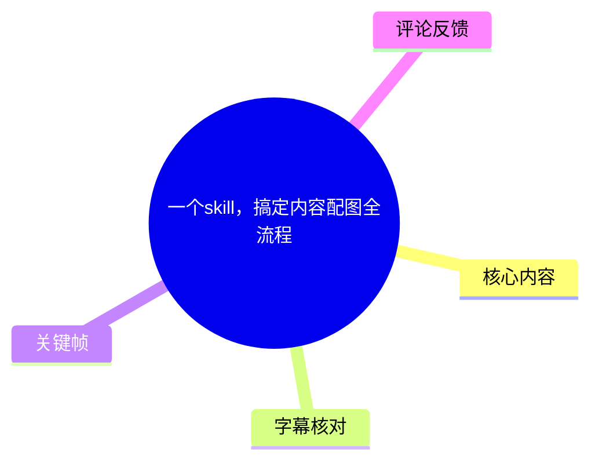
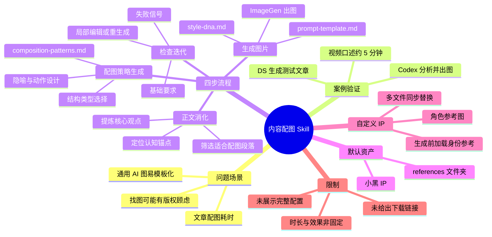
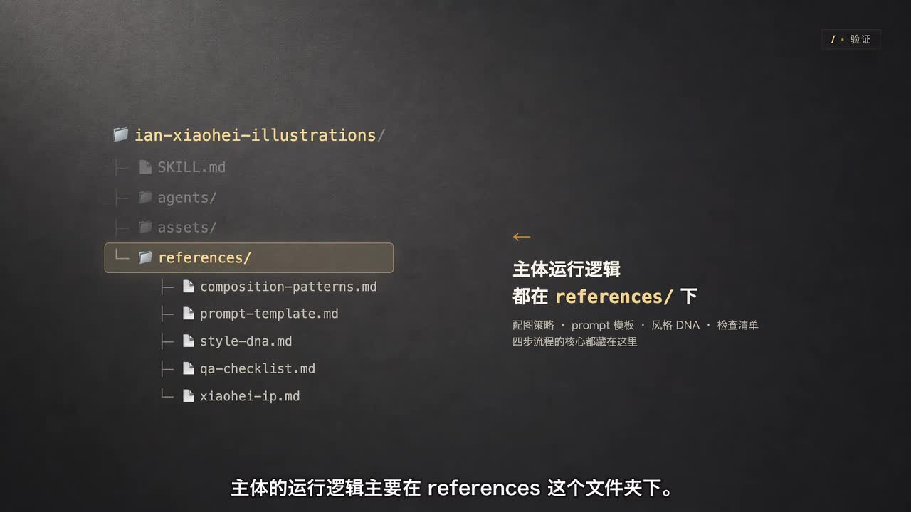
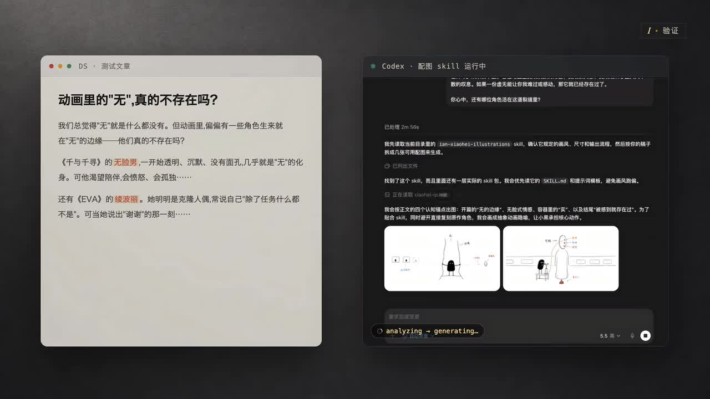
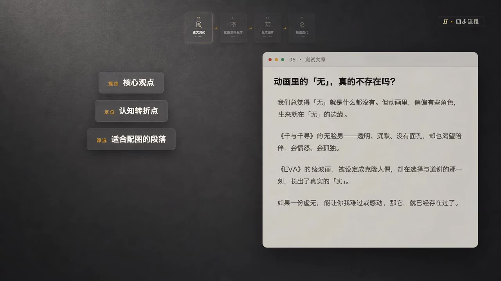
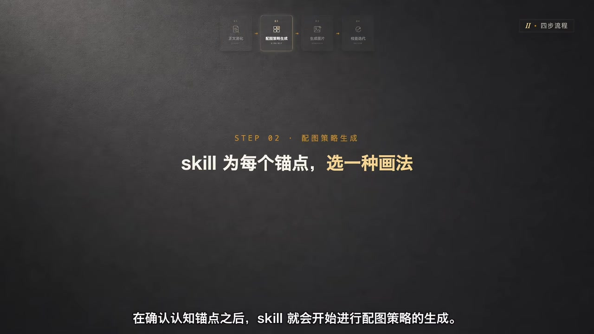

# 一个skill，搞定内容配图全流程

> 来源：[Bilibili 视频](https://www.bilibili.com/video/BV1L9VZ6bE2y)<br>
> UP 主：hopiy_046｜视频时长：4 分 53 秒｜合集：AIcode  
> 视频简介聚焦文章、公众号与小红书配图场景：通过一个 Codex skill，把正文自动转为统一的白底手绘风格中文配图，并可替换为自定义 IP。

## 小结

视频拆解了一个用于“内容配图”的 Codex skill。它接收文章正文或链接，先理解文本，再将适合视觉表达的内容转成配图策略、图像提示词，并调用内置图像生成能力完成出图，最后进行质量检查、重绘或局部编辑。

作者以一篇讨论动画角色“无”的测试文章为例验证效果。画面中，Codex 对文章分析后生成多张白底手绘配图；视频口述该次生成总计约花费 **5 分钟**。这是一项案例观察，不代表不同文章、模型版本或运行环境下的固定耗时。

该 skill 的核心运行逻辑主要位于 `references/` 文件夹。其中，`composition-patterns.md` 负责将认知锚点映射为画面结构；`prompt-template.md` 定义生图字段；`style-dna.md` 规定视觉风格；`qa-checklist.md` 用于检查质量；`xiaohei-ip.md` 则承载默认“小黑”角色 IP 的设定。

完整工作流可归纳为四步：**正文消化 → 配图策略生成 → 生成图片 → 检查、迭代与保存**。其关键不只是“让模型画图”，而是先提取核心观点、认知转折和适合配图的段落，再为每个锚点选择合适的图解结构与隐喻。

默认视觉方案采用“小黑”IP，但视频明确展示了替换路径：需要同步修改 `SKILL.md`、`xiaohei-ip.md`、`prompt-template.md`、`composition-patterns.md`、`qa-checklist.md`、`agents/README/prompt.md` 等多处设定；若希望新角色在批量配图中更稳定，还应增加角色参考图，并在生成前加载它作为身份参考。

本视频没有提供 skill 的下载地址、GitHub 链接、完整文件内容、具体命令、模型计费、图像分辨率或质量阈值。因此，它适合作为理解该类“文章到配图”自动化 skill 的结构化案例，而不能直接视为可复现的完整部署文档。工具接口、内置图像模型和 skill 文件结构均可能随版本变化。

## 思维导图





## 目录

- [背景、案例与文件结构](#背景案例与文件结构-0013)
- [四步工作流总览](#四步工作流总览-0037)
- [第一步：正文消化与认知锚点](#第一步正文消化与认知锚点-0037)
- [第二步：配图策略与画面结构](#第二步配图策略与画面结构-0126)
- [第三步：提示词模板、风格 DNA 与出图](#第三步提示词模板风格-dna-与出图-0150)
- [第四步：检查、迭代与保存](#第四步检查迭代与保存-0238)
- [自定义角色 IP：从“小黑”切换为“科技”](#自定义角色-ip从小黑切换为科技-0328)
- [实践步骤与检查清单](#实践步骤与检查清单-0037)
- [限制、适用范围与时效性](#限制适用范围与时效性-0440)
- [字幕比对](#字幕比对)
- [评论分析](#评论分析)
- [处理记录](#处理记录)

## 背景、案例与文件结构 [00:13](https://www.bilibili.com/video/BV1L9VZ6bE2y?t=13)

视频从内容创作者的配图痛点切入：找图可能担心版权问题，自己绘制耗时，而直接使用 AI 出图又可能出现“丑”或模板化的问题。作者介绍的方案是一个由作者口述为 “en” 的 Codex skill；下载后会得到一个文件夹。

作者强调，**主体运行逻辑主要在 `references/` 文件夹**。关键帧展示的目录包括：

- `SKILL.md`
- `agents/`
- `assets/`
- `references/`
  - `composition-patterns.md`
  - `prompt-template.md`
  - `style-dna.md`
  - `qa-checklist.md`
  - `xiaohei-ip.md`

从文件命名与视频讲解可知，`references/` 是将抽象文章内容稳定转化为配图方案的规则层：它不仅包含提示词模板，也包含构图策略、风格约束、角色设定和质量检查规则。



> 图：该关键帧直接显示 skill 的目录树，并突出 `references/`。它说明视频方法不是单一提示词，而是由构图、提示词、风格、质检与角色设定组成的一组可维护文件。

视频开头还给出一次试运行：作者先使用 DS 快速生成一篇文章，再让该 skill 运行。根据口述，Codex 分析后生成了一组“不错的配图”，总计约花费 **5 分钟**。这一数字仅对应视频中的演示案例；素材未给出文章字数、图片数量、硬件资源、队列等待、模型版本或重试次数，不能据此估算一般任务的性能。



> 图：左侧为 DS 生成的测试文章，右侧为 Codex 运行“配图 skill”的界面及已生成图片预览。它为“输入文章—分析—生成多张配图”的案例链路提供了画面依据。

## 四步工作流总览 [00:37](https://www.bilibili.com/video/BV1L9VZ6bE2y?t=37)

作者将 skill 的流程明确划分为四个阶段：

1. **正文消化**
2. **配图策略生成**
3. **生成图片**
4. **检查、迭代与保存**

这四步构成了从“文本内容”到“可交付配图”的闭环。前两步负责理解与规划，第三步负责生成，第四步处理质量控制和输出归档。视频的重点是：每张图并非随机生成，而是先为文章中的认知锚点确定画法，再把策略填入统一模板。



> 图：关键帧在顶部展示“正文消化、配图策略生成、生成图片、检查迭代”四步流程，并在左侧列出“核心观点、认知转折点、适合配图的段落”。它将视频的总体流程和第一步输入输出对应起来。

## 第一步：正文消化与认知锚点 [00:37](https://www.bilibili.com/video/BV1L9VZ6bE2y?t=37)

正文消化阶段，skill 会优先读取用户提供的：

- 正文；
- 链接等相关输入。

其目标是从内容中提炼：

- **核心观点**；
- **段落结构**；
- **认知转折点**；
- **适合用图解释的内容**。

视频将这些适合视觉化的关键内容称为“认知锚点”。根据案例文章，skill 提取出四个锚点。由于 ASR 在此处出现明显错字，结合画面中测试文章的可读文字，可较可靠地整理为以下四项：

1. “无”的边缘；
2. 没有脸也会有情绪；
3. 被定义为空容器，也可能长出“实”；
4. 被感到/被触动，就已经存在过。

其中第 4 项的个别措辞无法仅凭现有素材完全确认：ASR 为“被赶到就已经存在过”，画面文章则表达“如果一份虚无，能让你难过或感动，那它就已经存在了”。因此，较稳妥的理解是：**角色或事物只要能够引起情绪反应，便具备某种“存在”意义**；不将 ASR 错词当作原文。

正文消化的价值在于避免“按段落机械配图”。例如，解释角色没有面孔却能引发情绪时，适合使用角色状态或概念隐喻；讨论存在与虚无的关系时，则可能需要将抽象命题转译为更具象的视觉结构。

## 第二步：配图策略与画面结构 [01:26](https://www.bilibili.com/video/BV1L9VZ6bE2y?t=86)

在确认认知锚点后，skill 开始生成配图策略。视频指出，这一步最重要的参考文件是：

```text
references/composition-patterns.md
```

该文件的作用是决定每个认知锚点“适合画成什么样的结构”。作者列出的常见结构类型包括：

- `workflow`：工作流；
- 流程；
- 系统；
- 局部概念隐喻；
- 角色状态；
- 地图路线等。

视频还提到，该文件定义了：

- 原创隐喻生成法；
- 三步走策略；
- 物品池；
- 动作池。

这些内容共同作用，是为了给下一步的生图提示词建立稳定的生产流程。换言之，文章中的“观点”不会直接原样塞给模型，而是经过“锚点 → 结构类型 → 隐喻/物品/动作”的转译。



> 图：画面文字为“STEP 02・配图策略生成：skill 为每个锚点，选一种画法”。它直观强调配图策略阶段的决策对象是“锚点”而非笼统的整篇文章。

对于实际使用者，这意味着要提升结果质量，重点不应只放在追加形容词，而应检查两个问题：

1. 提取出的认知锚点是否准确代表文章重点；
2. 为该锚点选择的视觉结构是否真的便于读者理解。

例如，步骤型内容可优先选择流程或工作流结构；状态变化适合角色状态；空间位置、探索和推进关系可能适合地图路线。以上是根据视频列举的结构类型作出的应用性归纳，不代表视频提供了完整映射规则。

## 第三步：提示词模板、风格 DNA 与出图 [01:50](https://www.bilibili.com/video/BV1L9VZ6bE2y?t=110)

配图计划完成后，流程进入图片生成阶段。作者指出核心文件为：

```text
references/prompt-template.md
```

该模板固定了一整套生图字段，视频明确提到其中包括：

- 风格；
- IP；
- 主题；
- 结构；
- 画面；
- 标注。

skill 会从正文中抽取适合的内容，替换模板中的变量；也就是说，提示词的框架固定，具体主题和画面内容随文章变化。

与模板相配套的是：

```text
references/style-dna.md
```

作者将其中的 `visualDNA` 描述为风格规范：它告诉图像模型应向何种审美方向收敛。依照视频描述，实际出图时，Codex 会把前一步配图策略得到的内容填入 `prompt-template`，形成最终 prompt，再调用内置的 **ImageGen** 出图。

可将视频所述关系抽象为：

```text
文章正文 / 链接
  → 核心观点与认知锚点
  → 构图策略（结构、隐喻、动作等）
  → 填充 prompt-template.md
  → 由 style-dna.md 约束视觉 DNA
  → 最终 Prompt
  → 内置 ImageGen 生成图片
```

需要注意，视频中“内置 ImageGen”的确切 API 名称、调用参数、图像模型版本、分辨率、一次生成张数以及是否与评论中提到的 `img._gen` 或 `image2` 相同，均未被素材证实。

## 第四步：检查、迭代与保存 [02:38](https://www.bilibili.com/video/BV1L9VZ6bE2y?t=158)

第四步是**检查、迭代和保存**。作者给出的判断顺序为：

1. 检查图片是否满足基础要求；
2. 检查是否出现失败信号；
3. 判断应进行局部编辑，还是整张重新生成；
4. 有问题则根据问题修改 prompt；
5. 无问题则保存至对应位置。

与此对应的文件是画面目录中出现的：

```text
references/qa-checklist.md
```

虽然视频没有展示 checklist 的完整条目，但从讲解可确认，它在流程中承担质量检查职责。该步骤的重要性在于，AI 出图不应以“已生成”作为完成标准，而应以是否符合预设要求作为保存条件。

视频没有给出“基础要求”或“失败信号”的具体判定标准，例如文字错误阈值、角色一致性标准、构图禁忌、审美评分规则或自动化检测方式。因此，下列实践项只能视为与视频流程一致的待补充方向，而非该 skill 已公开的原始规则：

- 是否与正文锚点语义对应；
- 是否保留既定角色 IP 的主要特征；
- 是否遵循统一的视觉风格；
- 是否存在影响发布的画面异常；
- 是否需要通过局部编辑修正，或直接改写 prompt 后全图重生。

## 自定义角色 IP：从“小黑”切换为“科技” [03:28](https://www.bilibili.com/video/BV1L9VZ6bE2y?t=208)

作者提出默认“小黑”IP 可能显得单一的问题：如果用户不喜欢小黑，而偏好“科技”这一角色，能否替换？视频给出的答案是可以，但不能只改一个名字，而要在多处**同步修改**角色相关规则。

作者口述需要调整的位置包括：

| 文件或位置 | 需要同步修改的内容 |
| --- | --- |
| `SKILL.md` | skill 名称、`description`、核心定位、工作流中的“小黑”相关表述 |
| `xiaohei-ip.md` | 整个 IP 设定 |
| `prompt-template.md` | `recurring character`、颜色规则、增强参与感的提示 |
| `composition-patterns.md` | 小黑动作池、旧案例 |
| `qa-checklist.md` | 检查项 |
| `agents/README/prompt.md` | 展示名、默认 prompt、示例 |

其中一些文件名在 ASR 中被连读或识别为近似字符串；关键帧显示目录内实际存在 `xiaohei-ip.md`、`composition-patterns.md`、`prompt-template.md`、`style-dna.md`、`qa-checklist.md`，故文中以画面可见拼写为准。至于 `agents/README/prompt.md` 的精确层级，视频只有口述，未展示目录展开，保留其口述结构而不进一步推断。

作者还给出提高角色一致性的关键做法：

1. 新增一张“科技”IP 参考图；
2. 在生成步骤中新增规则；
3. 将“直接文生图”改为“生成前先加载科技，作为角色身份参考”；
4. 让所有正文配图尽量保持该角色的轮廓、比例、五官和气质一致。

这说明自定义 IP 不只是改名称和颜色，还需要将角色身份注入生成环节。视频最后表示，完成这些改动后，再次调用 skill，即可生成使用自有 IP 的配图。

## 实践步骤与检查清单 [00:37](https://www.bilibili.com/video/BV1L9VZ6bE2y?t=37)

以下步骤严格按视频介绍的流程整理；未出现的命令、安装方式、仓库地址、模型参数不作补写。

### 1. 准备输入内容

提供要配图的正文，视频也提到 skill 可读取链接等输入。输入内容应尽量包含明确主题、核心论点和可拆分的段落，以便后续抽取视觉锚点。

### 2. 检查 skill 文件结构

确认下载后的 skill 文件夹中存在 `references/`，并理解其主要职责：

```text
references/
├── composition-patterns.md  # 选择视觉结构、隐喻、物品与动作
├── prompt-template.md      # 固定生图字段和变量位置
├── style-dna.md            # 风格 / visualDNA 规范
├── qa-checklist.md         # 检查与质控
└── xiaohei-ip.md           # 默认角色 IP 设定
```

> 此目录树基于关键帧可见文件和视频讲解整理；`#` 后的说明是作者在视频中的功能描述，不代表文件内部的完整内容。

### 3. 执行正文消化

让 skill 从正文或链接中提取：

- 核心观点；
- 段落；
- 认知转折点；
- 适合配图的段落；
- 可作为画面中心的认知锚点。

此阶段应人工检查锚点是否偏离文章本意。若锚点提取错误，后续构图和提示词即使执行正确，也可能得到“好看但不解释内容”的图片。

### 4. 为锚点生成配图策略

根据 `composition-patterns.md`，为每个锚点选择对应画法，例如流程、系统、局部概念隐喻、角色状态或地图路线。再结合原创隐喻生成法、三步走策略、物品池和动作池，形成具体策略。

### 5. 由模板生成最终 Prompt

将策略内容填入 `prompt-template.md` 的固定字段，包括风格、IP、主题、结构、画面与标注；同时遵循 `style-dna.md` 中的视觉 DNA，使整套配图收敛到相近审美方向。

### 6. 调用内置 ImageGen 出图

视频称 Codex 会调用内置 ImageGen。该步骤的实际接口、模型名称、生成参数与权限要求未展示，需以使用者当前环境中的工具文档为准。

### 7. 质检、修正与保存

按视频的决策顺序执行：

```text
满足基础要求？
├─ 否 → 识别失败信号
│       ├─ 可局部修正 → 局部编辑
│       └─ 不适合局部修正 → 修改 Prompt 后整图重生成
└─ 是 → 保存到对应位置
```

### 8. 若使用自有 IP，完成全局一致性改造

不要仅替换角色名称。需同步更新角色定位、IP 文档、颜色规则、动作池、案例、检查项、默认 prompt 和示例；再增加角色参考图，并把“加载身份参考”纳入生成步骤。

## 限制、适用范围与时效性 [04:40](https://www.bilibili.com/video/BV1L9VZ6bE2y?t=280)

### 可迁移的经验

- 文章配图自动化的核心是“文本理解 + 视觉策略 + 模板化生成 + 质检闭环”，不是一次性随机生图。
- 将构图策略、风格规范、角色设定和 QA 规则拆分为文件，有利于维护、复用和针对品牌 IP 的系统性调整。
- 角色一致性需要同时约束文本规则与视觉身份参考；只有改角色名，通常不足以稳定维持轮廓、比例、五官与气质。
- 对批量内容生产而言，明确“局部编辑还是整图重生”的分支，可以避免在不适合的图片上反复微调。

### 视频未验证或未提供的事项

- 未提供 skill 的公开下载地址、GitHub 链接或许可证信息；
- 未展示完整 `SKILL.md`、各 Markdown 文件的原文和规则；
- 未提供安装命令、运行命令、依赖环境或权限配置；
- 未说明 ImageGen 的具体底层模型、调用 API、配额、费用和输出分辨率；
- 未说明生成图片数量、失败率、重试次数或不同题材下的稳定性；
- 未给出版权、商用许可、角色素材来源及生成内容审核方案；
- 未展示“科技”IP 替换后的完整实际结果，只说明修改后的预期能力。

### 时效性

视频发布信息显示为 **2026-06-01**。其中涉及 Codex、内置 ImageGen、skill 文件结构和角色参考加载方式的描述，均依赖当时作者的工作环境。相关产品能力、接口名称、文件约定和模型表现可能会在后续版本更新中变化。实际操作前应检查当前 skill 文档和所用平台的最新说明。

## 字幕比对

| 字幕来源 | 完整性 | 专有名词 | 时间轴 | 主要问题 |
| --- | --- | --- | --- | --- |
| Bilibili 站内字幕 | 未提供可用字幕，无法用于转写核对 | 无法评估 | 无法评估 | 素材明确标注“未提供可用站内字幕” |
| 本次 ASR 字幕 | 较完整：13 段，覆盖约 290.16 秒；诊断覆盖率 0.9932 | 存在多处英文文件名、术语和汉字误识别 | 可用：提供 SRT 起止时间，本文时间轴均依此换算 | 如 `compositionpatents`、`styleDNAdmd`、`skilled`、`配囿`、`认质毛点` 等错识别 |

本次任务**没有可用的站内字幕**，因此正文以本次 ASR 的带时间戳 SRT 为主要时间轴来源，并对内容进行保守校正。ASR 诊断显示语言为中文，`languageProbability` 为 `0.9990234375`，共 13 段；素材中没有 `noAudioStream=true` 标记，且 ASR 已实际识别到连续语音，因此不能将字幕缺失归因于无音轨。

通过关键帧和上下文校正的重要术语如下：

| ASR 原始识别 | 正文采用写法 | 校正依据 |
| --- | --- | --- |
| `skills` / `skilled` | skill | 视频标题、上下文与目录中的 `SKILL.md` |
| `references这个文件夹` | `references/` | 关键帧目录直接可见 |
| `compositionpatents.md` | `composition-patterns.md` | 关键帧文件名直接可见 |
| `prompttemplate.md` | `prompt-template.md` | 关键帧文件名直接可见 |
| `styleDNAdmd` | `style-dna.md` | 关键帧文件名直接可见 |
| `认质毛点` | 认知锚点 | 视频语义与画面“为每个锚点，选一种画法” |
| `配囿` / `生囿` | 配图 / 生图 | 上下文语义 |
| `小嘿消hipMD` | `xiaohei-ip.md` | 关键帧文件名直接可见 |
| `配团` | 配图 | 上下文语义 |

对案例中四个“认知锚点”的逐字表述，ASR 错误较多，关键帧仅能辅助还原文章主题，无法保证每个字均为原话。因此正文将其作为**语义层面的案例概括**，并保留不确定性说明。

## 评论分析

以下仅处理素材中可获取的热评前三条。评论是用户提问或观点，不构成对视频内容的已验证事实。

1. **芝士塔ST**（1 赞）：“视频也做的不错呀，可以分享下制作过程吗”  
   - 观点：除配图 skill 外，观众也认可视频本身的制作呈现，并希望了解制作流程。  
   - 补充价值：反映视频的视觉包装与讲解方式获得一定注意。  
   - 限制：视频正文没有讲述视频剪辑、动效、录屏或配音制作流程，不能据此推断作者会提供教程。

2. **新世纪20188**（0 赞）：“内置的img._gen和image2模型生的图一样吗？”  
   - 观点：评论者关注不同内置图像生成接口或模型之间是否产生相同结果。  
   - 与视频的关系：视频只口述 Codex 调用“内置的 ImageGen”，没有说明 `img._gen`、`image2` 的具体定义，也没有比较不同模型输出。  
   - 结论：这是一个未在现有素材中解答的技术问题，不能将二者视为相同模型或相同结果。

3. **实话实说ChrisTalks**（0 赞）：“大佬能分享一下github链接吗”  
   - 观点：评论者希望获取项目源码或下载链接，以便复现。  
   - 与视频的关系：视频介绍了 skill 的文件结构与改造方法，但素材中没有 GitHub 地址。  
   - 结论：该评论指出了复现资料缺口；在没有作者回复或链接的情况下，不能推断项目是否公开、是否位于 GitHub，或其许可条件。

## 处理记录

- Worker ID：`worker-mrj0wbly-5dc4e50c`
- 模型：`gpt-5.6-terra`
- 调用工具与素材：视频元数据、关键帧清单、ASR 结果 `asr/asr-result.json`、ASR SRT `asr/transcript.srt`、热评数据 `comments/comments.json`
- ASR 模型与运行信息：`medium`｜中文识别｜CUDA｜`float16`｜时长诊断 `292.1535` 秒
- 字幕选择：站内字幕未提供可用版本；已检查本次 ASR，采用其 13 段 SRT 的真实起止时间生成章节时间轴。对明显错识别的文件名与术语，使用关键帧可见文本和上下文进行保守校正。
- 关键帧选择依据：
  - `frames/frame-001.jpg`：展示测试文章、Codex 运行状态与生成结果预览，用于说明案例验证；
  - `frames/frame-002.jpg`：展示 skill 目录与 `references/` 下的核心文件，用于说明文件结构；
  - `frames/frame-003.jpg`：展示四步流程及正文消化的提取对象；
  - `frames/frame-004.jpg`：突出“配图策略生成”为每个锚点选择画法。
- 缓存清理：提供的素材中没有缓存清理命令或执行回执；未将无法验证的清理结果写为已完成。
- 未解决问题：
  - skill 作者“en”的准确拼写、项目来源及 GitHub 链接未提供；
  - `img._gen`、`image2` 与视频所称 ImageGen 的关系未被视频证实；
  - 完整文件内容、安装步骤、API 参数、费用、许可证与商用边界均未提供；
  - 部分 ASR 对案例文章中“认知锚点”的逐字转写存在无法完全消除的不确定性。
