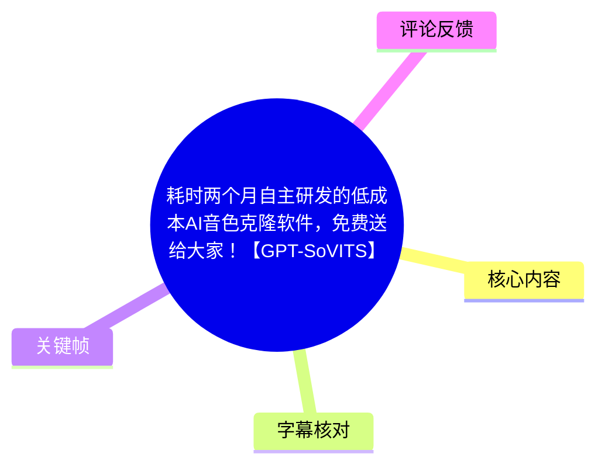
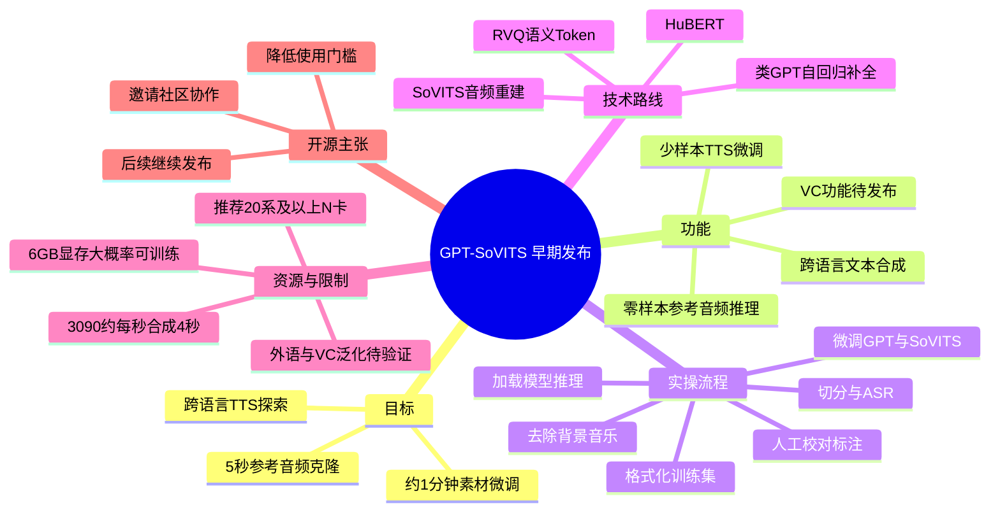
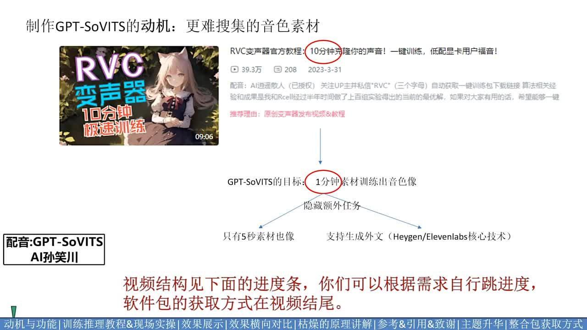
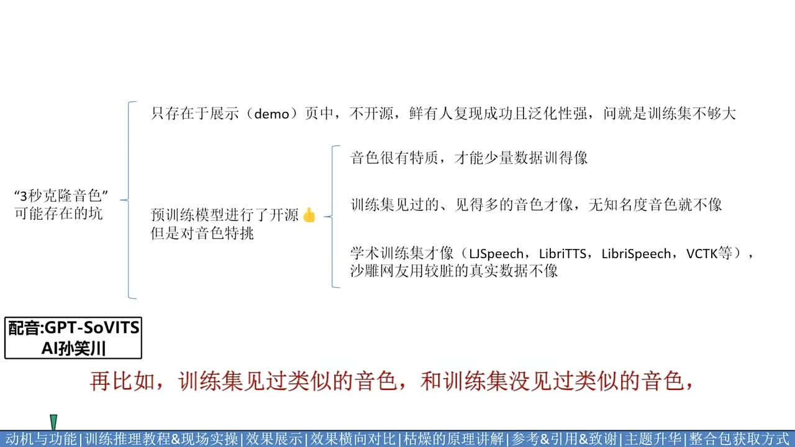
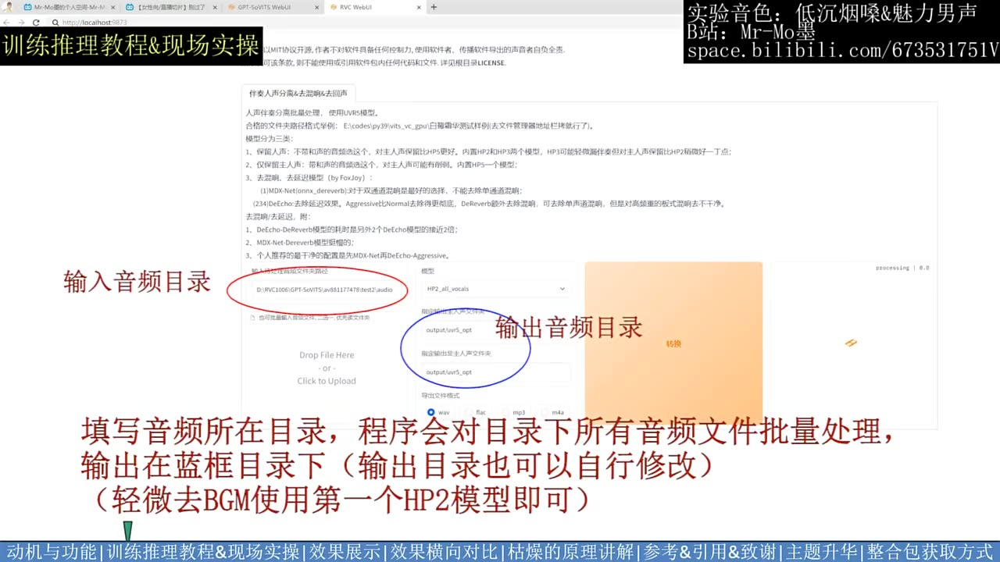
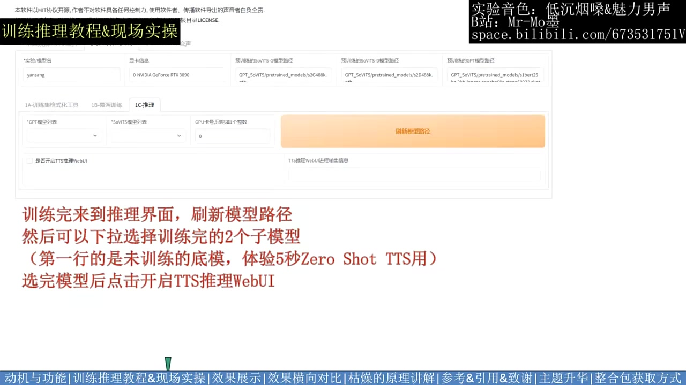

# 耗时两个月自主研发的低成本AI音色克隆软件，免费送给大家！【GPT-SoVITS】

> 来源：[Bilibili 视频](https://www.bilibili.com/video/BV12g4y1m7Uw)  
> UP 主：花儿不哭｜发布时间：2024-01-15｜视频时长：17 分 31 秒  
> 项目仓库：<https://github.com/RVC-Boss/GPT-SoVITS>

## 小结

本视频发布并演示了开源项目 **GPT-SoVITS** 的早期整合训练包。作者的核心目标是：在此前“约 10 分钟语音素材可训练变声器”的基础上，把可用音色克隆/文本转语音（TTS）微调所需的素材量降低到约 **1 分钟**；同时探索 **5 秒参考音频的零样本音色模仿** 与跨语言 TTS。

视频给出的功能分为几个层次：5 秒参考音频推理、少量素材微调 TTS、跨语言文本合成，以及尚在测试、准备后续发布的变声（VC）功能。作者对效果的表述并不绝对：多数案例可达到“约 90% 像”的主观听感，但说话习惯、口癖等特征未必能稳定复现；外语训练集、变声泛化能力等仍未完成验证。

实操部分展示了从素材去背景音乐、切分与语音识别、人工校对标注，到训练集格式化、GPT/SoVITS 两个子模型微调、加载模型和推理生成的完整流程。视频中的硬件经验是：显存不足时可下调 `batch size`；**6GB 显存大概率可完成训练**，推荐使用 **RTX 20 系及以上 NVIDIA 显卡**；作者以 RTX 3090 实测，合成速度约为“每秒生成 4 秒音频”。

技术解释部分将 GPT-SoVITS 描述为利用 HuBERT、RVQ 和类 GPT 自回归补全语义 Token 的路线。其关键思路不是完全消除音色信息，而是利用语义特征中保留的音色线索，使参考音频和模型嵌入共同提供音色引导，从而降低后续 SoVITS 重建阶段单独承担音色复现的难度。

这是一支发布于 2024 年 1 月的项目介绍视频，涉及的软件包、模型版本、依赖、下载方式和项目能力均可能已改变。视频中“关注 UP 主并私信关键词获取整合包”的方式属于当时的分发信息；当前应优先查看项目 GitHub 仓库与其最新文档。使用任何音色克隆工具时，也应确保拥有素材来源、声音和文本内容的合法授权。

## 思维导图

## 目录

- [项目动机、目标与功能边界](#项目动机目标与功能边界-0034)
- [为何警惕“数秒克隆”宣传](#为何警惕数秒克隆宣传-0124)
- [训练与推理全流程](#训练与推理全流程-0312)
- [效果展示与竞品比较口径](#效果展示与竞品比较口径-0537)
- [技术原理：从 SoVITS 到 GPT-SoVITS](#技术原理从-sovits-到-gpt-sovits-1149)
- [后续计划、开源理念与获取方式](#后续计划开源理念与获取方式-1503)
- [结论、风险与时效性](#结论风险与时效性)
- [字幕比对](#字幕比对)
- [评论分析](#评论分析)
- [处理记录](#处理记录)

## 项目动机、目标与功能边界 [00:34](https://www.bilibili.com/video/BV12g4y1m7Uw?t=34)

作者称自己此前约两个月未更新，主要精力投入到这个新项目。视频先回顾了已开源的 RVC 变声器：其定位是收集约 10 分钟语音素材进行训练，强调素材要求较低、训练门槛低。但作者观察到，10 分钟语料的要求仍会排除一些素材稀缺、难以收集足够干净语音的人物音色。

因此，GPT-SoVITS 的公开目标是：

1. 将有效训练素材的门槛从约 10 分钟进一步下降到约 **1 分钟**；
2. 在隐藏任务中挑战 **5 秒极限音色克隆**；
3. 探索“以 A 语言数据训练、生成 B 语言语音”的跨语言能力。

视频将功能拆为三条赛道：

- **5 秒参考音频推理**：使用短参考音频直接进行音色模仿。作者认为音色听感可能从“像”到“不太像”不等；较难复现的通常不是基础音色本身，而是个人说话方式和口癖。
- **少样本微调 TTS**：用约 1 分钟素材微调，作者称可得到接近真人的结果。
- **跨语言 TTS**：训练素材与要合成的语言文本可来自不同语种。视频中称中文微调集已经测试成功，外文训练集尚未测试。
- **变声功能（VC）**：作者说功能本身已经实现，但泛化性仍在测试，计划在下一支视频公布。

> 图：画面明确列出了“1 分钟素材训练出音色像”的主目标，以及“5 秒素材也像”“支持生成外文”两个附加目标；底部还给出了视频结构。它有助于区分已展示能力、实验目标与尚待验证的功能。

## 为何警惕“数秒克隆”宣传 [01:24](https://www.bilibili.com/video/BV12g4y1m7Uw?t=84)

作者回应了“既然已有宣传 3 秒克隆的技术，1 分钟为什么有优势”的问题，核心并非否认短音频克隆，而是强调展示条件、泛化能力和真实素材质量会显著影响结论。

视频给出的判断包括：

- **宣传口径偏保守**：某些音色极具辨识度时，短素材可能足以训练出相似效果；但作者认为这种前提不能泛化到所有人物，因此不应直接把特例宣传为普遍结论。
- **训练分布影响极大**：训练集中见过的、或相似度更高的音色，往往比模型未见过的未知音色更容易复现。这也意味着展示案例的挑选可能大幅影响观感。
- **Demo 与开源可用性不同**：只在展示页或学术数据集上表现良好，并不等同于开源后可以处理普通用户收集到的带噪、带 BGM、发音不稳定或素材不足的“脏素材”。
- **作者的成功标准**：不是声称所有音色都能短样本复现，而是将“约 1 分钟素材能训练出推理音色像”视为项目成功的实用标准。

> 图：该页把风险归纳为两类：仅存在于 Demo 页面、泛化性不强的方案，以及虽开源但对真实杂乱素材不适用的方案；并指出音色特质、训练集覆盖情况与学术数据集/真实数据的差别。它为理解视频的保守宣传口径提供了直接证据。

## 训练与推理全流程 [03:12](https://www.bilibili.com/video/BV12g4y1m7Uw?t=192)

### 1. 准备素材并去除背景音乐 [03:12](https://www.bilibili.com/video/BV12g4y1m7Uw?t=192)

作者以一个直播间的低沉男声音色进行现场训练演示。先试听原始音频，确认其中含有轻微背景音乐；随后双击 BAT 文件打开 Web 界面，并执行伴奏/人声分离。

操作要点：

1. 填写原始音频所在目录。
2. 程序会对该目录下的音频进行批量处理。
3. 指定输出目录；视频画面提示输出目录可自行修改。
4. 对于“轻微去 BGM”，视频建议使用第一个 **HP2** 模型。
5. 分离完成后关闭分离工具的勾选项，以释放该工具占用的显存。

> 图：界面圈出了输入音频目录和输出音频目录，画面文字说明程序会批量处理目录中的文件，并建议轻微去背景音乐时使用第一个 HP2 模型。这是流程中最容易因目录设置错误而失败的步骤之一。

### 2. 切分、识别与人工校对 [03:36](https://www.bilibili.com/video/BV12g4y1m7Uw?t=216)

对去背景音乐后的干净人声，作者依次进行：

1. 填写干声目录；
2. 指定切分输入目录及语音识别输入/输出目录；
3. 进行语音切分与语音识别；
4. 找到默认输出的识别结果文件；
5. 将识别结果文件路径交给标注工具；
6. 在标注工具中人工校对文本。

作者特别指出，中文识别多数情况下较准确，但仍应修正**标点与停顿位置**的一致性。对以下片段建议删除而不是强行保留：

- 听不清的语句；
- 语速过快、难以可靠标注的语句；
- 杂音干扰明显的语句；
- 文本过短的片段。

这一步体现了少样本训练中“素材可用性”比单纯时长更重要：若一分钟语料中混入大量错误文本、噪声或切分错误，实际有效信息会更少。

### 3. 训练集格式化与模型微调 [04:00](https://www.bilibili.com/video/BV12g4y1m7Uw?t=240)

在第二个菜单中，作者先执行训练集格式化。界面中需要填写三个带星号的字段：

- 实验名；
- 干声目录；
- 标注文件路径。

填写完成后点击“一键三连”，等待右下角提示全流程完成。作者称，完成后会在实验目录中看到若干编号输出路径。

接下来分别微调两个子模型，即 GPT 与 SoVITS 对应的模型组件。训练顺序可自行安排；若拥有多张显卡，也可以让不同显卡同时训练不同模型。

硬件与参数经验：

| 项目 | 视频中的说明 |
| --- | --- |
| 不熟悉参数时 | 使用默认参数 |
| 显存不够时 | 降低 `batch size` |
| 最低显存经验 | 6GB 显存“大概率就能完成” |
| 推荐显卡 | RTX 20 系及以上 NVIDIA 显卡 |
| 多卡训练 | 两个子模型可用不同卡并行训练 |

这里的“6GB 大概率能完成”是作者在当时整合包与演示设置下给出的经验判断，不应理解为适用于所有版本、数据量、驱动或训练参数的硬性配置下限。

### 4. 刷新模型并开始推理 [04:49](https://www.bilibili.com/video/BV12g4y1m7Uw?t=289)

训练结束后，进入推理界面：

1. 刷新模型路径；
2. 从下拉菜单选择训练完成的 GPT 和 SoVITS 两个子模型；
3. 点击开启 TTS 推理 WebUI；
4. 上传目标音色的参考音频；
5. 填写参考音频对应的文本及语种；
6. 填写待合成文本及其语种；
7. 生成语音并等待输出。

待合成文本过长时，作者建议切分为多行，每行一个句子。界面提供三种切分方式，也允许用户手动切分或不切分。视频中的示例参考文本为“你为什么要一次一次地伤我的心”。

> 图：推理页显示 GPT 模型列表、SoVITS 模型列表、GPU 卡号/并发推理个数与“刷新模型路径”按钮。画面注释强调第一行是未训练底模、可用于 5 秒 Zero-Shot TTS；实际微调后应选择训练完成的两个子模型。

### 5. 推理速度与实操限制 [05:13](https://www.bilibili.com/video/BV12g4y1m7Uw?t=313)

作者使用 RTX 3090 的体验是：约 **每秒可合成 4 秒长度的音频**。其主观比较是，它比传统语音模型慢一些，但比很多当时的新一代语音大模型更快。

需要注意：

- 这不是统一基准测试，未说明音频长度、并发数、采样参数、驱动、模型版本及 CPU/内存环境；
- 不同显卡、不同模型版本、参考音频长度、文本切分方式都会影响实际速度；
- 生成质量与速度、素材量、音色相似度、稳定性之间可能存在取舍，作者明确表示自己追求的是综合问题中的“平衡”与相对最优解。

## 效果展示与竞品比较口径 [05:37](https://www.bilibili.com/video/BV12g4y1m7Uw?t=337)

作者随后扩大测试范围，使用更“难”的音色与文本案例展示输出，包括日常口语、新闻式文本、技术文本（旋转位置编码）、古文和游戏对话等。其目的不是只展示容易模仿的短句，而是观察不同内容风格下的稳定性。

在对比部分，作者将测试划分为两条赛道：

1. **一分钟少样本微调赛道**；
2. **五秒克隆赛道**。

作者称，表格中记录了自己的结论，但不逐项念出；并释放竞品音频，建议观众自行试听判断。其明确立场是：

- 表中结论仅代表个人观点；
- 当时各家方案通常都能以免费方式体验；
- 最终结果应由用户自行尝试、对比后得出，不宜把单一视频中的横评当成客观定论。

视频还称，在其测试条件下，GPT-SoVITS 使用 1 分钟和半小时数据训练的结果差别不大，因此比某些方案更少出现“爆破”情况；但作者也承认结果可能与训练设置有关，观众可以自行复验。这里的“差别不大”“爆破更少”均是视频作者的测试观察，并非完整公开基准。

## 技术原理：从 SoVITS 到 GPT-SoVITS [11:49](https://www.bilibili.com/video/BV12g4y1m7Uw?t=709)

### SoVITS 与传统语音转换的抽象 [11:49](https://www.bilibili.com/video/BV12g4y1m7Uw?t=709)

作者从 SoVITS 语音转换器切入，将其抽象为“编码器—解码器”结构：

1. 编码器尝试从输入语音中提取内容/语义表征、弱化音色；
2. 解码器重建音频；
3. 训练时，目标音色被学习到模型参数中；
4. 因此，其他人声音频经编码后，也可由解码器以目标音色重建。

作者认为，这套叙述中的关键困难是“去音色”并不彻底：现实中不存在能够完全消除音色的特征，只有“去音色相对更强”的特征。若编码特征仍泄露了源说话人的音色，转换结果就可能混入源音色，使音色转换不够彻底。

### GPT-SoVITS 的思路：把音色泄露转为引导信息 [12:37](https://www.bilibili.com/video/BV12g4y1m7Uw?t=757)

作者的路线不是简单避免音色泄露，而是反向利用保留了丰富音色信息的语义特征。视频中提到：

- 使用 **HuBERT** 和 **RVQ** 将音频转换为包含音色线索的语义 Token；
- 使用类 **GPT** 模型补全 Token；
- 类 GPT 的自回归特性使后续 Token 会继承参考音频的音色特征；
- 相较于仅依赖条件语义特征，Token 中更强的音色线索可以承担更多音色引导任务；
- 在 HuBERT 等表征分担部分音色压力后，后续 SoVITS 重建阶段的任务更轻，从而提高短参考音频音色克隆的可行性。

作者提出一个尚未完成验证的设想：若参考音频与音色嵌入分别使用不同音色，或许可以实现某种“音色混合”功能，后续准备实验。

### 从变声平滑切换到 TTS [14:14](https://www.bilibili.com/video/BV12g4y1m7Uw?t=854)

视频称，如果把类 GPT 模型的 Condition 改为文本，系统功能就能从变声平滑转向 TTS。本次发布的整合包主要面向 TTS；前文较多讲解变声原理，是在为后续的变声包做技术铺垫。

这一段的重点是架构层面的设计关联，而不是宣称全部功能均已在当时的整合包中完成发布。作者明确提到：TTS 与 VC 的小版本模型虽已有训练成果，但尚未来得及整合进本次包内。

## 后续计划、开源理念与获取方式 [15:03](https://www.bilibili.com/video/BV12g4y1m7Uw?t=903)

作者感谢项目引用的开源仓库，并特别感谢 Rcell 在算法路线上的交流。视频中称，双方至少进行了约 100 次技术路线讨论，也踩过至少 100 个坑；这些数字是作者用于描述研发投入的说法。

后续计划包括：

- 邀请开源社区共同参与并扩大项目；
- 继续研究若干列在画面上的方向；
- 发布已训练但尚未整合的 TTS 和 VC 小版本模型；
- 在下一次发布中补齐整合包内容。

视频最后表达了作者对开源社区的价值判断：希望与社区一起做出低门槛、可供普通用户使用的技术，认为先进技术应服务于所有人。作者将这种愿景称作“AI 开源共产主义”，并表示会持续做开源工作。

### 当时的整合包获取信息 [17:03](https://www.bilibili.com/video/BV12g4y1m7Uw?t=1023)

视频描述及结尾给出的方式是：关注 UP 主后私信 `GPT`、`gpt`、`sovits`、`SOVITS`、`SoVITS`、`SVC` 或 `svc`，通过自动回复获取整合训练包下载链接。

这属于 **2024 年发布时的分发信息**。由于视频素材抓取时间为 2026 年，私信自动回复、链接有效性、仓库结构和安装方法均不能据此保证仍有效。对于当前使用者，优先核验：

1. GitHub 仓库的 README、Release 与 Issues；
2. 项目的许可证和模型权重来源；
3. 当前版本的系统、CUDA、Python 与 PyTorch 兼容要求；
4. 训练和生成语音的授权边界。

## 结论、风险与时效性

### 可迁移的实践经验

- **先处理素材，再谈模型。** 去 BGM、切分、ASR 和人工校对是少样本训练的重要前置条件。
- **标点与停顿是训练数据的一部分。** 文字内容正确并不足够，停顿位置错误也会影响语音自然度和对齐质量。
- **不可靠片段应删除。** 听不清、噪声重、语速极快或文本极短的片段，会稀释本就有限的有效训练数据。
- **先用默认参数建立基线。** 遇到显存不足再调低 `batch size`，比一开始盲目修改多项参数更易定位问题。
- **将 Demo 与泛化能力分开评价。** 短音频成功案例并不能直接证明工具面对陌生音色、真实杂音素材时依然稳定。

### 视频中未完成或未充分验证的事项

| 项目 | 视频中的状态 |
| --- | --- |
| 外文训练集效果 | 尚未测试 |
| VC 泛化性 | 正在测试，计划后续公布 |
| 音色混合 | 仅为后续实验设想 |
| TTS/VC 小版本整合 | 已训练但尚未整合进当次包 |
| 一分钟训练对所有音色的适用性 | 未作普遍保证 |
| 3090 推理速度的普适性 | 仅为作者环境下的经验值 |

### 使用风险

- **声音权利与人格权风险**：克隆真实人物声音前，应取得明确授权；不得用于冒充、诈骗、诽谤或误导。
- **内容合规风险**：生成文本及生成音频的传播方式都可能受到平台规则、版权和当地法律约束。
- **技术风险**：素材质量、语言、音色特征、训练集覆盖与模型版本都可能导致结果差异，不能仅按时长承诺效果。
- **时效风险**：本视频是早期发布资料，当前 GPT-SoVITS 项目实现、安装步骤、模型名称与硬件需求可能已显著变化。

## 字幕比对

| 字幕来源 | 完整性 | 专有名词 | 时间轴 | 主要问题 |
| --- | --- | --- | --- | --- |
| Bilibili 站内字幕 `p01-ai-zh.srt` | 与本视频内容不匹配，且仅覆盖约前 13 分钟 | 错误，内容为 WBG/BLG 电竞比赛解说 | 有真实时间段，但对应的是错误语音内容 | 与视频主题、画面和实际音频完全不一致，不可作为正文依据 |
| 本次 ASR 字幕 | 覆盖约 95.83% 语音，34.76 秒至 1050.76 秒 | 多个术语存在识别变形，但可结合画面校正 | 有完整时间戳，可用于章节定位 | 长段落切分较粗；GPT-SoVITS、SoVITS、HuBERT、RVQ、VC、TTS、`batch size` 等出现误识别或拼写变体 |

本次 ASR 诊断显示：音频语言为中文，置信度约 `0.9966`，总时长约 `1050.848` 秒，语音覆盖约 `95.83%`；素材**未标记** `noAudioStream=true`，因此确认源视频存在音轨，且本次 ASR 不是工具失败。

最终正文采用 **本次 ASR 的时间轴与语义为主**，再结合关键帧中的界面文字、视频标题、简介和上下文进行术语校正；未采用站内字幕的内容。主要校正包括：

| ASR 近似识别 | 正文采用 |
| --- | --- |
| GPT ZOVID / GPT Sovis | GPT-SoVITS |
| Sovis / SolveVC | SoVITS / SoVITS-VC |
| ContentVac | ContentVec |
| CN Hubert | HuBERT |
| Vis 解码器 | SoVITS 解码/重建阶段 |
| but size | `batch size` |
| HP2 | HP2 模型 |
| AR 技术 | AI 技术 |

## 评论分析

以下仅分析可获取的热评前三条，评论代表用户观点，不作为已验证事实。

1. **电子宠物竟是我自己｜6024 赞**  
   评论建议作者“抓紧注册版权”，认为项目即使暂时不维权，也应保留权利基础。该观点反映出观众对项目传播、商业化或被模仿风险的担忧，但评论没有提供具体的版权登记、许可证或法律路径，因此不能据此判断项目的实际权利状态。

2. **白灼福建仔｜2877 赞**  
   评论认为，许多用户只看到站内大量变声器应用，却不了解 GPT-SoVITS/RVC 一类底层项目对生态的影响。它补充了“基础工具与衍生应用”的关系：用户可见的成品往往建立在开源基础设施之上。不过“幕后大佬”是赞誉性的主观表达，不能替代对项目技术贡献范围的具体评估。

3. **Wenaka｜4326 赞**  
   评论将作者与把复杂工具做成免费整合包、降低使用门槛的开源作者相比较，高度认可其“自主开发 + 整合分发”的价值，并强调开源精神。该评论与视频中作者降低普通用户使用门槛的主张一致，但依然属于价值判断；免费整合包是否持续可用、是否适配当前环境，仍需以仓库与实际测试为准。

## 处理记录

- **Worker ID**：`worker-mrj0wjed-b0c290ad`
- **模型**：`gpt-5.6-terra`
- **调用工具与素材**：视频元数据、站内 SRT、ASR 结果与 SRT、关键帧、热评 JSON。
- **ASR 检查结果**：已检查 `asr/asr-result.json`；识别语言为中文，存在有效音轨和带时间戳的 ASR 分段，未出现 `noAudioStream=true`。
- **字幕选择**：弃用与视频内容不符的 Bilibili 站内字幕；采用本次 ASR 时间轴为章节定位依据，并依据关键帧和上下文校正术语。
- **关键帧选择依据**：选择展示项目目标与功能范围的 `frame-001.jpg`、展示短秒克隆局限的 `frame-002.jpg`、展示批量去 BGM 输入输出设置的 `frame-003.jpg`、展示模型加载与推理入口的 `frame-004.jpg`；均直接支撑正文的目标、限制和操作步骤。
- **评论范围**：仅处理所提供的热评前三条。
- **缓存清理**：未提供可执行缓存目录或清理回执；未对原始视频、音频、ASR、字幕及关键帧素材执行删除操作。
- **未解决问题**：未提供完整的训练参数截图、竞品横评表原文和生成音频文件，因此未对各竞品排名、具体训练轮数、采样参数或音质结论作超出素材的推断。
