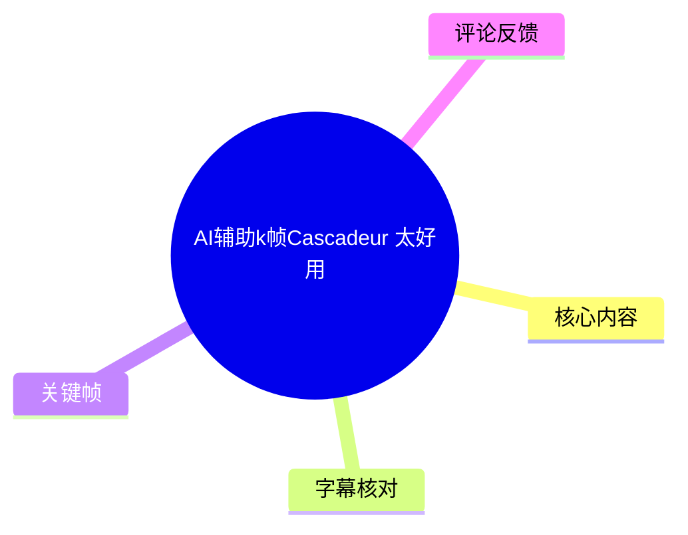
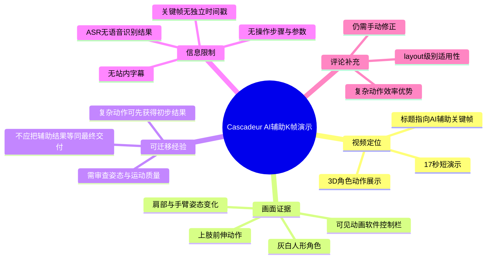
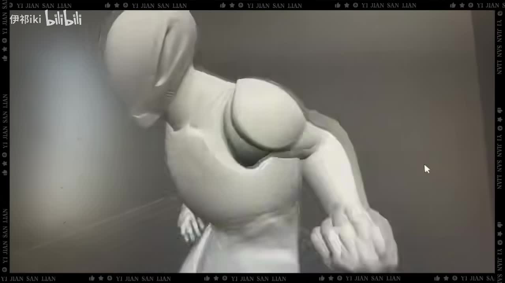
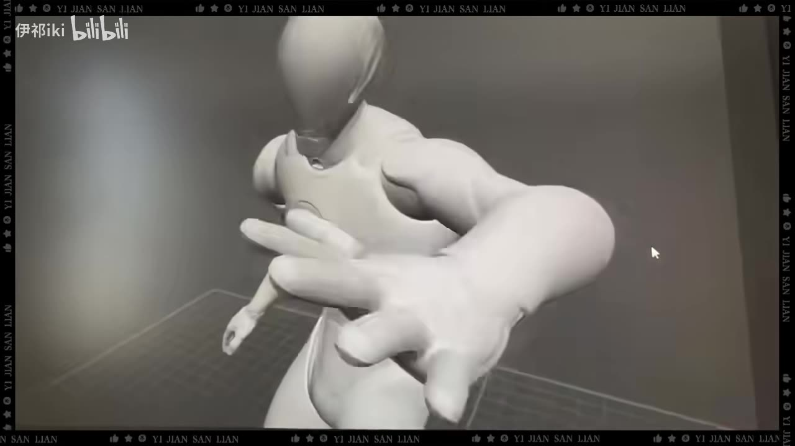
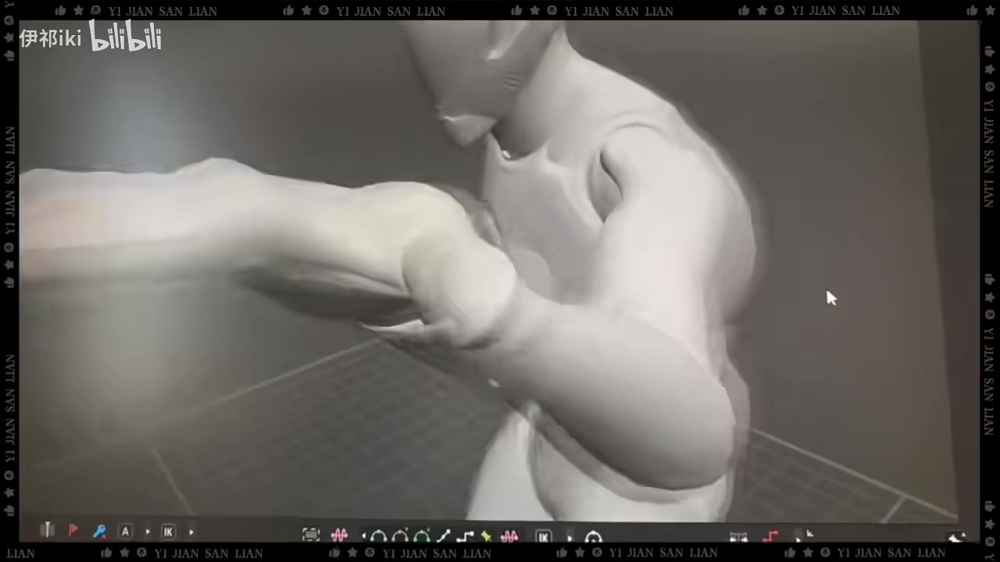
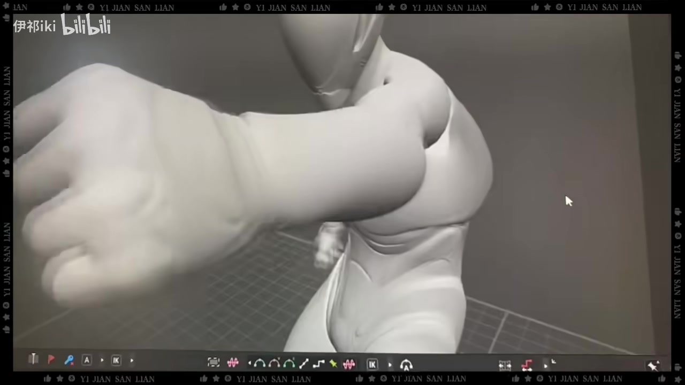

# AI辅助k帧Cascadeur 太好用

> 来源：[Bilibili 视频](https://www.bilibili.com/video/BV1rpdTYiEft)  
> UP 主：伊祁iki｜发布时间：2025-04-09｜视频时长：17 秒｜画面规格：1280×720  
> 标签：AI、学习、人工智能、软件、K帧、3D动画

## 小结

该视频是一段 17 秒的 3D 动画演示，标题明确指向 **Cascadeur 的 AI 辅助关键帧（K 帧）能力**。画面集中展示一名灰白材质的人形角色做出明显的上肢前伸、挥动/出拳式动作，重点在于观察动作姿态而非讲解软件界面或具体参数。

从可见画面看，演示对象是一个已绑定或可被动画控制的人形角色：镜头从角色上身和肩部区域切入，随后展示手臂向镜头方向伸出的连续姿态。后半段画面底部可见动画软件的时间线/控制工具栏，说明这并非纯渲染成片，而是动画制作环境中的过程或结果展示。

视频没有可用的站内字幕，本次 ASR 也未识别出任何语音片段。因此，不能从音频中确认 UP 主具体执行了哪些命令、使用了何种 AI 模式、输入了哪些关键姿势、是否启用了物理修正，或是否导出了动画数据。本文将标题所称“AI 辅助”与画面实际可见的“动画姿态结果”严格区分。

对动画制作者而言，这段素材可作为一个直观提示：AI/辅助动画工具可能有助于快速获得复杂肢体动作的初步姿态与运动过程；但它并不能单独证明最终成片已达到无需人工调整的质量。热评中也出现了“复杂动作效率较高、简单动作收益有限”“仍需手动修正”的经验性观点，供参考但不视为已验证结论。

该视频发布于 2025 年 4 月。Cascadeur 的功能、授权政策、联网要求及 AI 相关能力均可能在后续版本中发生变化；实际工作流应以使用时的软件版本、官方文档与项目测试为准。

## 思维导图

## 目录

- [视频定位与可确认信息](#视频定位与可确认信息)
- [画面中的动作演示](#画面中的动作演示)
- [从演示可提炼的制作经验](#从演示可提炼的制作经验)
- [参数、步骤与证据边界](#参数步骤与证据边界)
- [结论、限制与时效性](#结论限制与时效性)
- [字幕比对](#字幕比对)
- [评论分析](#评论分析)
- [处理记录](#处理记录)

## 视频定位与可确认信息 [00:00](https://www.bilibili.com/video/BV1rpdTYiEft?t=0)

### 标题、标签与画面之间的对应关系

视频标题为“AI辅助k帧Cascadeur 太好用”，结合标签中的“AI”“K帧”“3D动画”，可确认创作主题是以 Cascadeur 为背景的 AI 辅助关键帧动画体验展示。

但素材中没有语音文本、站内字幕或可读的参数面板，因此以下内容不能从视频中确认：

- 没有证据表明具体使用的是 Cascadeur 的哪一项功能或哪一个版本。
- 没有证据表明 AI 的输入形式是文字、姿势、动作参考、已有关键帧，还是其他数据。
- 没有证据表明角色动画是否经过物理修正、曲线编辑、手动补帧或导出后的后期处理。
- 没有证据表明画面中的动作完全由 AI 自动生成；标题仅说明视频主题或作者的主观评价是“AI 辅助 K 帧”。

视频本体时长为 17 秒，ASR 音频分析的媒体时长为 16.60225 秒，两者存在约 0.40 秒的封装/首尾差异，属于短视频处理中可能出现的媒体时长差异；由于没有识别到语音，不能据此建立细粒度字幕时间轴。

## 画面中的动作演示 [00:00](https://www.bilibili.com/video/BV1rpdTYiEft?t=0)

### 人形角色与前伸手臂姿态

关键帧画面呈现一个灰白、无贴图或低细节材质的人形角色。角色上半身占据主要画幅，右侧/前侧手臂朝镜头方向伸展，肩、肘、腕及手指的透视关系被刻意放大。这种构图适合展示动作中上肢的空间方向与姿态变化。

> 图：该画面展示角色胸肩区域与向前伸出的手臂。它的价值在于可直接观察肩部抬升、躯干前倾和手臂伸展之间的整体姿态关系，而不是只看局部关节。

> 图：画面进一步显示手掌、手指与身体之间的前后层次。手掌处于镜头近端，说明该动作具有明显的朝向镜头的空间延伸效果；这一点可用于检查动作轮廓和视觉冲击力。

### 连续动作中的肢体关系

后续画面可见角色手臂横向/前向摆动后的姿态。手臂处于较强的伸展状态，前臂和手部在画面中占比很高；身体则保持相对稳定的躯干基准。就可见结果而言，这一段的重点是展示复杂的上肢姿态，而非完整的走、跑、跳等全身循环。

> 图：画面底部出现动画软件的控制图标与时间线区域，同时角色手臂处于伸展姿态。它说明素材至少包含制作软件中的动画查看/编辑场景，而不仅是最终渲染画面。

> 图：手臂和手掌占据大面积画面，角色肩部与胸腔仍可见。该帧适合检查极端透视下的肢体可读性：即使手部靠近镜头，观众仍需要辨认动作方向与角色身体重心的关系。

### 画面能够支持与不能支持的判断

**可由画面支持的判断：**

1. 视频展示了人形角色的三维动画姿态。
2. 动作强调肩部、手臂、手腕和手掌的连续位置变化。
3. 演示存在软件编辑/播放界面元素。
4. 作者选择以角色动作结果作为视频的主要内容。

**不能由画面单独支持的判断：**

1. 不能确认每一个关键姿势是否由 AI 自动产生。
2. 不能确认中间帧是 AI 插值、传统插值、手工调整还是混合流程。
3. 不能确认动作是否符合特定动画规范，例如弧线、缓入缓出、重心转移或物理平衡。
4. 不能确认该角色绑定、控制器设置、帧率、导出格式及项目文件结构。

## 从演示可提炼的制作经验 [00:00](https://www.bilibili.com/video/BV1rpdTYiEft?t=0)

### 1. 复杂姿态应优先检查整体轮廓

视频将手臂置于镜头近端，造成强烈透视。这类动作的难点不是单个关节能否转动，而是整体轮廓是否清晰：

- 肩部是否为手臂前伸提供了合理的起点；
- 躯干是否配合转动或倾斜，而非仅让手臂孤立移动；
- 肘部方向是否能传达动作的力量与目标；
- 手掌是否在近景中形成可识别的朝向；
- 前景手部是否过度遮挡躯干，导致动作意图难以阅读。

AI 辅助或自动化工具若能快速给出可播放的初稿，可将动画师的注意力从“先让角色动起来”转向“这个姿态是否清楚、是否符合镜头意图”。

### 2. 将辅助结果视为布局或初稿更稳妥

视频没有展示逐帧编辑过程，无法证明其最终质量；但结合热评中关于“只能到 layout 级别”的经验性反馈，更稳妥的工作方式是把辅助生成的动作视为候选初稿：

1. 明确镜头目标与动作意图，例如前伸、攻击、抓取或闪避。
2. 先检查角色整体重心、躯干方向与四肢大方向。
3. 审查关键姿势之间是否出现穿插、关节反折、接触不稳或不自然的停顿。
4. 对手部、肩部、肘部等镜头敏感区域进行人工修形。
5. 在最终渲染前检查动作节奏、镜头构图与角色轮廓。

其中第 1 至第 5 步是针对动画制作的通用整理，并非视频逐项展示的操作教程。

### 3. 复杂动作与简单动作的效率收益可能不同

可获取的第二条热评提出：对评论者而言，复杂动作使用辅助方案的效率比纯手 K 更高，但简单动作与纯手工相比效率差异不明显。这是一名用户的实践反馈，不能直接推广为所有项目的性能结论；不过它提示了一个实际评估维度：

| 动作类型 | 可能的辅助价值 | 仍需人工检查的部分 |
| --- | --- | --- |
| 多关节、强透视、复杂上肢动作 | 可更快得到可播放的姿态草案 | 重心、关节方向、手部造型、穿插 |
| 简单摆臂、轻微转头、基础待机 | 辅助收益可能有限 | 节奏、角色性格、细微曲线 |
| 镜头近景手部动作 | 可帮助快速尝试姿态 | 手指、手腕、轮廓与镜头遮挡 |
| 需要精确接触的动作 | 可先形成初步动作 | 落脚、抓握、碰撞与接触帧 |

此表是基于视频画面、评论观点和动画制作常识形成的分析框架，不是视频内公布的功能规格。

## 参数、步骤与证据边界 [00:00](https://www.bilibili.com/video/BV1rpdTYiEft?t=0)

### 素材中可确认的参数

| 项目 | 可确认内容 |
| --- | --- |
| 视频标题 | AI辅助k帧Cascadeur 太好用 |
| 视频时长 | 17 秒 |
| 分辨率 | 1280×720 |
| 视频页数 | 1 个分 P |
| 可见角色 | 灰白材质人形角色 |
| 可见动作重点 | 上肢前伸/挥动式连续姿态 |
| 可见界面元素 | 底部存在动画软件的控制/时间线类工具栏 |
| 站内字幕 | 未提供可用字幕 |
| 本次 ASR | 无识别文本、无语音分段 |

### 无法从真实素材补全的操作参数

以下通常会影响 AI 辅助 K 帧结果，但本视频素材未提供，不能补写为确定事实：

- Cascadeur 软件版本；
- 操作系统、显卡、硬件配置；
- 工程帧率；
- 骨骼类型、角色绑定规范及控制器配置；
- AI 功能名称、模型版本、联网状态；
- 输入关键帧数量、关键帧位置与帧号；
- 是否使用参考视频、动作捕捉或文本输入；
- 自动补间、物理模拟、平衡修正的开关与数值；
- 导出格式、导出帧率及后续 DCC 软件流程。

### 可复用但非视频原样复述的验证步骤

若要在实际项目中验证类似“AI 辅助 K 帧”的价值，可采用以下测试流程：

1. **准备对照任务**：选取一个明确的动作目标，并同时保留手工 K 帧方案与辅助方案。
2. **统一约束条件**：使用同一角色、同一镜头、同一帧率与同一动作时长，避免因素材差异误判效率。
3. **记录初稿成本**：分别记录从空场景到可播放初稿所需时间。
4. **记录修正成本**：单独统计穿插、手脚接触、重心、手部造型和曲线节奏的修正时间。
5. **按镜头质量评估**：不要只比较“能不能动”，还要比较轮廓、动作意图、接触可信度和镜头可读性。
6. **形成项目内结论**：如果复杂动作的总耗时显著下降且修正可控，辅助方案才具备稳定的生产价值。

以上为建议性的评估方法，不应被误认为视频中实际演示的具体步骤。

## 结论、限制与时效性 [00:00](https://www.bilibili.com/video/BV1rpdTYiEft?t=0)

视频以短时长展示了人形角色上肢动作的视觉结果，标题表达了作者对 Cascadeur AI 辅助 K 帧能力的积极评价。画面中最有价值的信息是：复杂的前伸手臂动作可以在三维动画环境中被快速呈现和检查，尤其便于观察手部近景、肩部带动和整体轮廓。

但视频没有提供语音、字幕、菜单文字、参数面板或逐步操作，因此它更适合作为**效果展示**，而不是可直接复现的操作教程。不能据此断言某项功能可完全自动化完成动画，也不能确认任何具体 AI 模型、算法或软件设置。

实际应用时，建议将 AI 辅助结果定位为动作布局、姿态探索或初步补间方案，并预留人工修正预算。尤其在镜头近景、手部特写、角色接触、重心转换和强表演需求下，人工审核仍然关键。

视频发布于 2025-04-09；素材抓取元数据时间为 2026-07-15。软件功能、产品策略、跨境访问情况及用户反馈均具有时效性，使用前应重新核对 Cascadeur 当期官方信息。评论中关于联网、布局级别与手动修正的说法均属于用户意见，不替代官方说明或独立测试。

## 字幕比对

| 字幕来源 | 完整性 | 专有名词 | 时间轴 | 主要问题 |
| --- | --- | --- | --- | --- |
| Bilibili 站内字幕 | 无可用字幕 | 无法核对 | 无 | 素材明确标注“未提供可用站内字幕” |
| 本次 ASR 字幕 | 空 | 未识别出 Cascadeur、AI、K 帧等词 | 无有效语音分段 | ASR 模型 `medium` 自动判定语言为英语，置信度 0.541015625；共识别到 0 个片段、0 秒语音覆盖 |

本次 ASR 已检查，结果为空。诊断信息提示“未识别到语音片段”，但未提供 `noAudioStream=true` 标记，因此不能将其表述为“源视频没有音轨”；只能确认：已抽取音频文件并完成 ASR 处理，但没有得到可用的语音转写结果。

最终未采用任何字幕文本作为内容依据。正文中的 “Cascadeur”“AI 辅助 K 帧”来自视频标题与任务元数据；角色动画、手臂姿态及底部软件控制栏来自关键帧画面理解。关键帧素材未附带逐帧时间戳，因此未将其伪造为精确的画面发生时间；章节时间轴统一定位至视频真实起点 00:00。

## 评论分析

以下仅分析可获取的热评前三条。评论内容代表评论者个人体验或传闻，不作为已验证事实。

### 1. “这是16年就火起来的软件吧，听说要跨境网络”

- **评论者**：她怎么没死
- **获赞数**：4
- **观点概括**：评论者认为该软件在 2016 年前后已受到关注，并听说使用时可能需要跨境网络。
- **补充价值**：提出了软件历史认知和网络可访问性问题。
- **可信度与限制**：措辞中包含“吧”“听说”，属于不确定的二手信息；视频本身没有展示联网状态、地区限制或登录流程，不能据此确认当前网络要求。

### 2. “只能到layout级别……复杂动作效率比纯手k高……简单动作效率没区别”

- **评论者**：种竹子的公子
- **获赞数**：3
- **观点概括**：评论者表示自己试用后认为效果不错，但更接近 layout（布局）阶段；其手工 K 帧质量略优于辅助结果。对于复杂动作，辅助方案效率高于纯手 K；对于简单动作，效率差异不明显。
- **补充价值**：该评论提供了比“好用”更具体的生产判断：应分别评估初稿质量、复杂动作效率和后续修正成本。
- **可信度与限制**：这是单一用户、未说明版本和项目条件的主观经验。其“layout 级别”“品质略差”等判断无法从视频画面独立验证，但与“辅助后仍需修正”的工作流逻辑相容。

### 3. “然而还是需要手动修，只是少了大部分噪点”

- **评论者**：星の願いです
- **获赞数**：1
- **观点概括**：评论者强调辅助并不等同于完全自动化，仍需人工修正；其价值在于减少大量初步问题或“噪点”。
- **补充价值**：提醒使用者将工具定位为降低粗加工成本，而非省略质量控制。
- **可信度与限制**：“噪点”具体指姿态抖动、曲线杂乱、关节问题还是其他瑕疵，评论没有说明；视频也未提供前后对比，无法量化减少程度。

## 处理记录

- Worker ID：`worker-mrj0wbly-5dc4e50c`
- 生成模型：`gpt-5.6-terra`
- ASR 模型：`medium`，运行设备为 CUDA，计算类型为 `float16`，请求语言为自动识别。
- 可用素材：视频合并文件、音频文件、12 张关键帧、ASR 结果、评论数据及视频元数据。
- 字幕选择：站内字幕未提供可用内容；本次 ASR 已检查但输出为空、无时间分段；因此不采用字幕转写，仅依据标题、元数据、评论和关键帧进行整理。
- 关键帧选择依据：选用 `frames/frame-001.jpg` 至 `frames/frame-004.jpg`，因为它们连续呈现人形角色上身、前伸手臂、手部近景及底部动画软件控制栏，能够支持正文对动作展示和软件环境的描述。
- 时间轴依据：ASR 无可用起止时间、站内 SRT 缺失，关键帧也未附独立时间戳；所有章节仅链接至可确认的视频起点 `00:00`，未按文字顺序虚构时间位置。
- 缓存清理：提供的素材清单未包含缓存清理执行记录，无法确认是否已清理；本文不将其标记为已完成。
- 未解决问题：无法确认 Cascadeur 的具体版本、AI 功能名称、操作步骤、关键帧帧号、角色绑定设置、是否联网及动画是否经人工后期修正。
