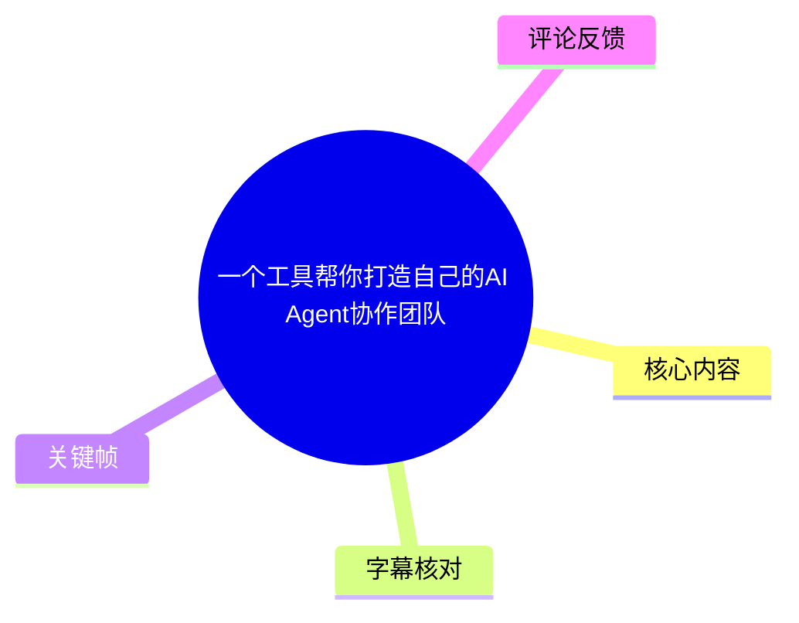
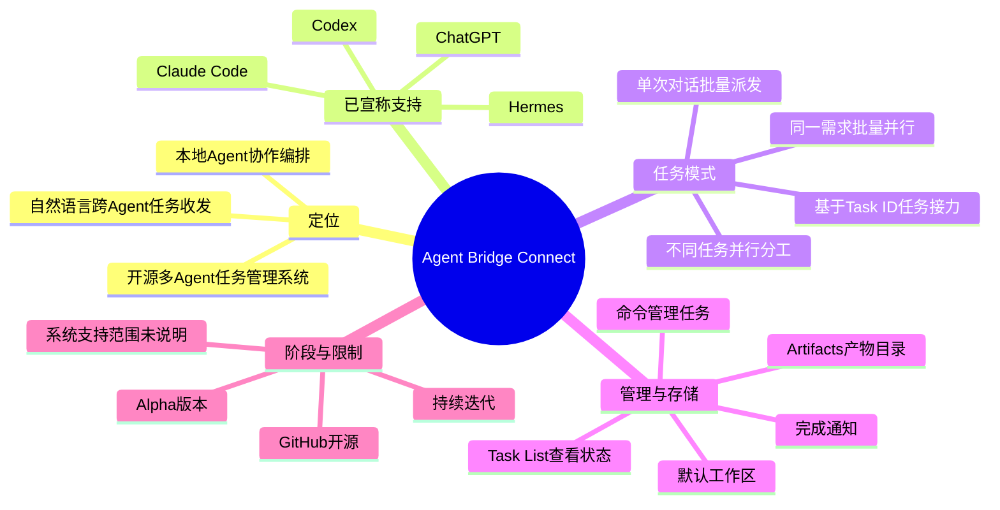
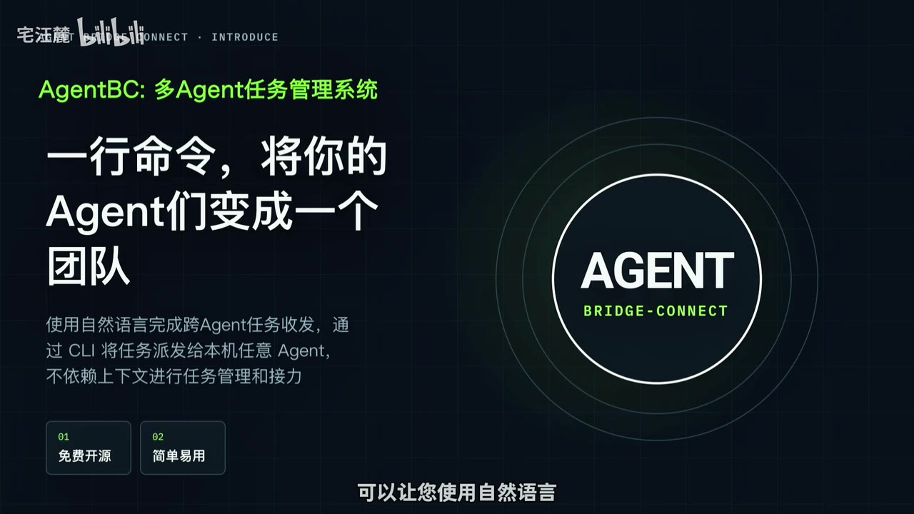
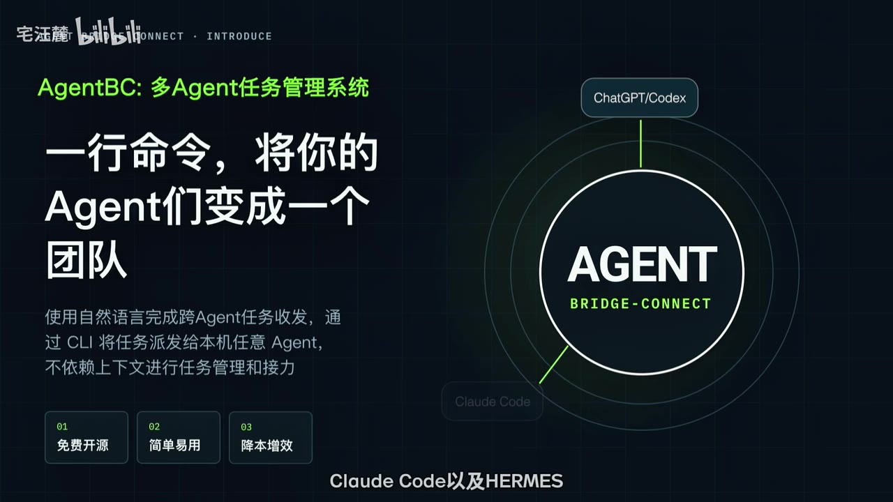
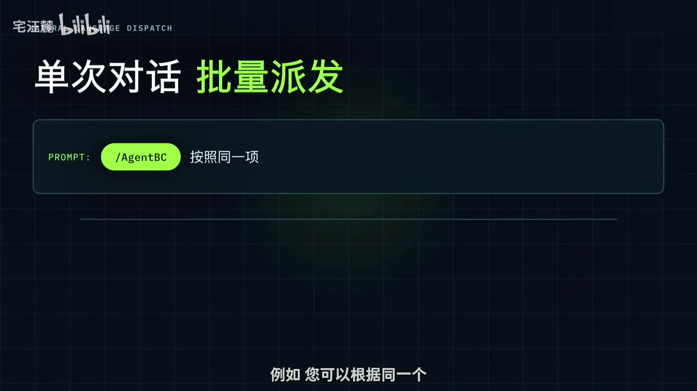
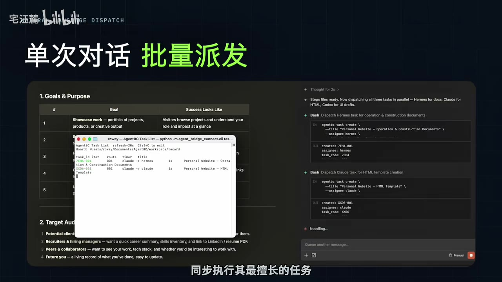

# 一个工具帮你打造自己的AI Agent协作团队

> 来源：[Bilibili 视频](https://www.bilibili.com/video/BV1LrGu6JET7)<br>
> UP 主：宅汪麓｜发布时间：2026-08-01｜视频时长：2 分 12 秒｜分区收藏：AIcode

## 小结

视频介绍了 **Agent Bridge Connect（简称 AgentBC）**：一个开源、多 Agent 的任务管理系统。它的定位不是训练或替代某个模型，而是在本机的不同 Agent 之间建立任务派发、任务接力、状态查看与产物归档的管理层。

核心方法是：用户可在任意一个已接入的 Agent 对话中，以自然语言或 `/AgentBC` 入口发起任务；系统据称可将不同子任务分派给多个 Agent 并行执行，或让后续 Agent 基于 **Task ID** 接力处理同一条任务链。视频强调，此过程“不依赖上下文和历史对话”，任务衔接依赖任务标识与任务要求，而非直接共享聊天上下文。

视频给出的典型分工是：针对同一个项目计划，同时派发文案、设计、编码等工作；也可以把同一个图片创作需求批量发给多个 Codex 实例，以获得多份图像结果。其价值在于按能力与成本安排模型/Agent，减少在不同工具间手动复制、转发和跟踪任务的操作。

管理侧，AgentBC 提供 **Task List** 查看执行状态，并支持以命令管理任务；任务完成后，Task List 会自动关闭并发出系统通知。部署成功后，系统会创建默认工作区，用于保存每个任务的报告和运行时记录；若派发时未指定工作路径，产物会落在默认工作区的 `Artifacts` 目录。

时效性与限制同样重要：视频明确称该项目仍是 **Alpha** 版本，虽已在 GitHub 开源，但仍持续迭代。视频只宣称支持 ChatGPT、Codex、Claude Code 和 Hermes；没有给出安装命令、仓库地址、支持的操作系统、权限机制、费用计算、并发上限或失败重试细节。因此，它适合希望统一调度本地多个 AI 编程/任务 Agent 的早期使用者，但不应据此直接推断其已具备成熟的生产级协作、跨设备推送或 Windows 支持。

## 思维导图





## 目录

- [背景、定位与支持对象](#背景定位与支持对象)
- [单次对话：按角色批量派发](#单次对话按角色批量派发)
- [同一需求的批量并行](#同一需求的批量并行)
- [任务链接力与 Task ID](#任务链接力与-task-id)
- [任务状态、通知与工作区](#任务状态通知与工作区)
- [版本状态、限制与实践建议](#版本状态限制与实践建议)
- [关键帧索引](#关键帧索引)
- [字幕比对](#字幕比对)
- [评论分析](#评论分析)
- [处理记录](#处理记录)

## 背景、定位与支持对象 [00:02](https://www.bilibili.com/video/BV1LrGu6JET7?t=2)

视频将 Agent Bridge Connect 描述为一个“开源的多 Agent 任务管理系统”。其目标是通过自然语言完成跨 Agent 的任务收发，以提升工作效率，并帮助用户控制使用成本。

这里的“跨 Agent”应理解为：在不同 Agent 工具或实例间做任务级协调，而不是让多个模型在同一段完整对话上下文中直接共同推理。视频强调不依赖上下文和记忆；从后续 Task ID 接力机制看，系统至少要求后续执行者能拿到任务标识与明确的新任务要求。



> 图：首帧以“AgentBC：多 Agent 任务管理系统”为标题，并写明“使用自然语言完成跨 Agent 任务收发”“通过 CLI 将任务派发给本机任意 Agent”“不依赖上下文进行任务管理和接力”。这张图直接界定了产品定位，避免将其误解为一个新的基础模型或聊天机器人。

视频口播在 [00:17](https://www.bilibili.com/video/BV1LrGu6JET7?t=17) 列出当前支持对象为 **ChatGPT、Codex、Claude Code 与 Hermes**。其中，本次 ASR 将第三项识别成“Cloud Code”，但关键帧中的文字清晰显示为 **Claude Code**，因此正文采用“Claude Code”。



> 图：画面围绕 “AGENT BRIDGE-CONNECT” 展示接入端，顶部为 “ChatGPT/Codex”，下方显示 “Claude Code”，画面字幕同时提到 Hermes。这为支持对象的专有名词校正提供了画面依据。

### 视频陈述与可验证边界

- **视频陈述**：AgentBC 免费开源、简单易用，并可“降本增效”。
- **素材可确认**：视频称项目已在 GitHub 开源，并处于 Alpha 阶段。
- **未在素材中提供**：仓库 URL、许可证、安装方式、CLI 完整参数、配置文件格式、API 认证方式、各 Agent 的实际接入条件及收费规则。
- **不宜延伸推断**：视频没有证明多 Agent 的结果一定优于单 Agent，也未量化效率提升、成本节省或任务成功率。

## 单次对话：按角色批量派发 [00:24](https://www.bilibili.com/video/BV1LrGu6JET7?t=24)

视频介绍的第一种组织方式是：在一次对话中，将不同类型的任务拆开后分派给多个 Agent。UP 主举例称，用户可基于同一个项目计划，一次性派发文案、设计和编码工作，再根据成本与能力，让各 Agent 同步处理自己更擅长的部分。

可迁移的工作流是：

1. **先定义共同项目目标**：例如要做的网站、内容项目或产品页面。
2. **拆成职责明确的子任务**：如文案、视觉设计、HTML/前端编码。
3. **为子任务匹配 Agent**：按其能力、可用性与成本进行分配。
4. **并行启动**：不同 Agent 同时执行，减少串行等待。
5. **统一在 Task List 检查状态**：而不是分别到多个会话窗口手动确认。



> 图：画面标题为“单次对话 批量派发”，输入区域展示 `/AgentBC` 作为入口。它说明视频不是要求用户逐个打开 Agent 会话手工转述，而是强调通过 AgentBC 发起调度。



> 图：画面中可见 AgentBC Task List 弹窗，以及右侧按文档、HTML、UI 草图等任务分派的界面；下方字幕为“同步执行其最擅长的任务”。该帧将“批量派发”具体化为可观察的任务列表与角色分工。

### 视频展示的操作要点

视频画面展示了 `/AgentBC`，但没有完整展示可复制的命令、参数说明或安装前置条件。因此，能从素材中严谨整理出的操作层级仅为：

```text
在某个已接入 Agent 的对话中
→ 通过 /AgentBC 或自然语言发起任务
→ 指定任务内容及目标 Agent / 分工
→ 由系统创建并派发任务
→ 在 Task List 观察执行情况
```

> 注意：上面的流程是对视频口播与画面的顺序化归纳，不是官方命令语法。素材没有提供一个可直接执行的完整 CLI 示例，不能据此补写命令参数。

## 同一需求的批量并行 [00:43](https://www.bilibili.com/video/BV1LrGu6JET7?t=43)

除“一个项目拆成不同工作”外，视频还提供了第二种模式：将**相同的任务要求**批量并行派发给多个 Agent。

UP 主以图片创作为例：用户可以通过任意 Agent，将一次图片创作任务同时派给多个 Codex，让它们使用 **ChatGPT Image 2** 批量输出图片，从而提高产出效率。这里的重点并非不同角色协作，而是用多份并行执行获得更多候选结果。

这类模式可用于：

- 需要多个设计、文案、代码方案进行比较的工作；
- 希望让不同实例独立探索解法的任务；
- 需要将吞吐量优先于单个结果一致性的工作。

但视频没有说明如何避免重复费用、如何设置并行数量、如何筛选结果，也没有展示图像任务的实际输出质量。因此，将同一任务“批量派发”应在明确预算、选择标准和人工验收流程的前提下使用。

## 任务链接力与 Task ID [01:00](https://www.bilibili.com/video/BV1LrGu6JET7?t=60)

视频的第三种模式是**任务接力**：同一条任务链可由不同 Agent 依次完成，且不依赖上下文或历史对话。

UP 主给出的关键操作是：在任意 Agent 对话中指定 **Task ID** 与新的任务要求，便可在原任务基础上让另一 Agent 接力工作。Task ID 是跨 Agent 衔接的锚点；相较于复制整段聊天记录，它让后续任务引用同一个任务实体。

可以将其理解为以下结构：

```text
任务 A 创建
  ├─ Task ID：用于定位原任务
  ├─ 原始任务要求
  ├─ 任务报告 / 运行时记录
  └─ 已产生的中间产物

在另一个 Agent 中：
  指定 Task ID + 新的任务要求
  → 对原任务执行接力处理
```

视频只说明了“无需上下文和历史对话”，并不等于后续 Agent 自动理解一切前序细节。为了减少接力偏差，实际任务描述仍应写清：

- 要引用的 Task ID；
- 当前希望接力完成的具体事项；
- 输入产物或相关文件的预期位置；
- 成功标准和输出格式。

这些写法是基于视频机制给出的实践建议；视频本身没有展示 Task ID 的完整格式、读取权限或跨工作区引用规则。

## 任务状态、通知与工作区 [01:16](https://www.bilibili.com/video/BV1LrGu6JET7?t=76)

任务执行期间，视频称用户可通过 **Task List** 查看任务执行状态，并可随时使用命令进行任务管理。画面中的 Task List 呈现为一个单独列表窗口，用于集中显示任务条目，而不是仅依赖各 Agent 会话各自的消息流。

任务结束时，视频称：

1. Task List 窗口会自动关闭；
2. 系统将发出通知，告知任务完成情况。

这意味着视频所描述的闭环是“派发—观察—完成提醒”。不过素材没有列明 Task List 中的全部状态值，也没有演示暂停、取消、重试、失败诊断、日志导出等命令，不能假定这些能力一定存在或已稳定可用。

### 默认工作区与 Artifacts [01:35](https://www.bilibili.com/video/BV1LrGu6JET7?t=95)

视频说明，正确部署 AgentBC 后会创建一个**默认工作区**。用户或 Agent 可以在该工作区中查看：

- 每个任务的任务报告；
- 运行时记录。

若任务在派发时没有指定工作路径，产物将被存放在默认工作区的 `Artifacts` 目录。

```text
默认工作区
├─ 任务报告
├─ 运行时记录
└─ Artifacts/
   └─ 未显式指定工作路径时的任务产物
```

这条规则对实践尤其重要：若任务会生成代码、文档或图像等可交付产物，应在派发时明确工作路径，避免依赖默认目录后出现文件难找、任务间产物混杂或后续 Agent 找不到输入的问题。视频未说明默认工作区的实际绝对路径、目录权限、多用户隔离或清理策略。

## 版本状态、限制与实践建议 [01:55](https://www.bilibili.com/video/BV1LrGu6JET7?t=115)

视频结尾称 **Agent Bridge Connect Alpha 版本已在 GitHub 开源**，且仍在持续开发迭代。UP 主提到后续计划包括：

- 更简洁易用的 UI；
- 更多系统支持；
- 更多 Agent 支持；
- 更完善的功能。

这意味着视频呈现的是一个仍在发展中的早期工具，而非功能边界已冻结的正式产品。工具现状可能在视频发布后改变，尤其是 UI、Agent 兼容性及操作系统支持等方面；使用前应以项目仓库的最新文档、Release、Issue 与兼容性说明为准。

### 已知限制

| 项目 | 视频/素材能确认的内容 | 素材未提供或未证实的内容 |
| --- | --- | --- |
| 版本成熟度 | Alpha，持续迭代中 | 稳定版发布日期、SLA、生产可用性 |
| 支持 Agent | ChatGPT、Codex、Claude Code、Hermes | 具体版本、认证方式、接入限制 |
| 任务协同 | 并行派发、批量派发、Task ID 接力 | 冲突处理、依赖编排、质量评测 |
| 存储 | 默认工作区、任务报告、运行时记录、`Artifacts` | 路径格式、数据保留周期、权限模型 |
| 平台支持 | UP 主称后续将支持更多系统 | 当前是否支持 Windows、macOS、Linux 的完整范围 |
| 交互方式 | 自然语言、CLI、Task List；未来将有更简洁 UI | CLI 的完整命令、GUI 配置及远程推送能力 |
| 成本控制 | 视频将其作为目标之一 | 实际费用、并发成本、配额与计费统计 |

### 使用前检查清单

1. 在项目官方仓库核对当前版本是否仍为 Alpha，以及目标操作系统是否受支持。
2. 核实所使用的 ChatGPT、Codex、Claude Code、Hermes 是否在兼容列表中。
3. 为高价值任务指定明确工作路径，并检查 `Artifacts` 的产物归档。
4. 将大任务拆成有验收标准的子任务，避免“并行”只带来重复和不可比较的结果。
5. 对批量生成任务预设预算、数量上限和人工筛选步骤。
6. 在用 Task ID 接力时，显式说明接力目标、输入文件与输出要求，不把“无需聊天上下文”误解为无需任务说明。

## 关键帧索引

| 时间点 | 关键帧 | 画面价值 |
| --- | --- | --- |
| [00:02](https://www.bilibili.com/video/BV1LrGu6JET7?t=2) |  | 展示 AgentBC 的产品定位，以及“免费开源、简单易用”等画面文案。 |
| [00:17](https://www.bilibili.com/video/BV1LrGu6JET7?t=17) |  | 画面中“Claude Code”可用于校正 ASR 的“Cloud Code”误识别。 |
| [00:24](https://www.bilibili.com/video/BV1LrGu6JET7?t=24) |  | 展示“单次对话，批量派发”及 `/AgentBC` 入口。 |
| [00:36](https://www.bilibili.com/video/BV1LrGu6JET7?t=36) |  | 同时显示 Task List 和按任务分工的派发界面，是理解并行调度的关键画面。 |

## 字幕比对

| 字幕来源 | 完整性 | 专有名词 | 时间轴 | 主要问题 |
| --- | --- | --- | --- | --- |
| Bilibili 站内字幕 | 未提供可用字幕，无法核对 | 无法核对 | 无法核对 | 素材明确标注“未提供可用站内字幕”。 |
| 本次 ASR 字幕 | 较完整：17 段，覆盖约 118.58 秒语音，占视频约 89.89% | 存在少量误识别 | 完整，首段 00:00:00.270，末段 00:02:10.520 | 多次将“任务”识别为“任劣/任势/任努”等；将“Claude Code”误识别为“Cloud Code”；部分“派发”“图片”等词有错字。 |

本次 ASR 使用 `large-v3-turbo` 模型，识别语言为中文，语言置信度为 `0.99755859375`；诊断显示视频存在音频流，**未标记 `noAudioStream=true`**，因此并非无音轨视频，也不是工具失败。

正文采用**本次 ASR 的真实时间戳**作为所有章节时间轴依据，并结合关键帧文字、语义上下文进行必要校正：

- `Cloud Code` → **Claude Code**：关键帧 `frames/frame-002.jpg` 直接显示 “Claude Code”。
- `任势收发` → **任务收发**：与产品定位、后续“任务派发”“任务链”“Task ID”等连续语义一致。
- `任劣/任劤/任努` → **任务**：为 ASR 在同一高频词上的重复错字。
- `拍发` → **派发**：与视频“批量派发”的主题与画面一致。
- `图骗` → **图片**：结合“图片创作任务”“输出图片”的句义校正。

除上述可由画面或上下文支持的明显错字外，未补充字幕和画面中没有出现的技术细节。

## 评论分析

仅分析本次可获取的热评前三条；评论反映的是用户期待或质疑，不构成已验证的产品事实。

1. **薄荷ljm**（1 赞）：“期待 windows 支持”
   - 观点：希望项目支持 Windows。
   - 补充价值：与视频结尾“后续会提供更多系统支持”的说法相呼应，表明平台兼容性是潜在用户关心的问题。
   - 可信度边界：该评论不能证明当前不支持 Windows，只能说明视频素材没有让该用户确认 Windows 支持情况。

2. **靐齾龗鱻爩麤灪爨**（0 赞）：“这个应该不算多agent协作系统，这个应该叫批量脚本”
   - 观点：质疑其“多 Agent 协作系统”的定位，认为展示能力更接近批量派发脚本。
   - 讨论价值：该评论准确指出一个值得验证的界限：视频主要展示了任务派发、并行和接力，未展示 Agent 间自主协商、共享规划、冲突解决或联合决策。
   - 可信度边界：这是概念分类上的评价，不能据此否定工具的任务管理价值；是否构成“协作系统”取决于对协作的定义与项目实际实现。

3. **neko_IN_Corner**（0 赞）：“可以从desktop到desktop吗？消息或是任务回报直接推送到会话界面？希望能尽快支持windows”
   - 观点：询问是否支持 Desktop 到 Desktop 的任务流转，以及能否把消息或任务回报直接推送到会话界面，并再次表达 Windows 支持诉求。
   - 补充价值：指出了视频未覆盖的三项实际使用问题：跨桌面/跨设备能力、结果回推到会话界面、Windows 兼容性。
   - 可信度边界：视频仅称完成时会有系统通知，未说明是否会把完整任务报告直接回推至某个聊天会话，也未说明 Desktop 到 Desktop 的能力。

## 处理记录

- **Worker ID**：worker-mrj0www4-e8d79408
- **模型**：gpt-5.6-terra
- **调用工具与素材**：视频元数据、ASR 结果 JSON、ASR SRT 时间轴字幕、关键帧素材、热评 JSON。
- **ASR 检查结果**：已检查本次 ASR；模型为 `large-v3-turbo`，存在有效音频流与时间戳，未出现 `noAudioStream=true`。
- **字幕选择**：站内字幕未提供可用版本；采用本次 ASR 的分段起止时间作为时间轴依据，并用关键帧校正“Claude Code”等明显专有名词/错字。
- **关键帧选择依据**：选用 `frames/frame-001.jpg` 至 `frames/frame-004.jpg`，因为它们分别清晰呈现产品定位、支持的 Agent、`/AgentBC` 派发入口、Task List 与按角色并行派发；其余关键帧未在所提供画面素材中展示，未擅自引用或推断。
- **评论范围**：严格限于可获取热评前三条。
- **缓存清理**：未提供缓存清理执行日志；本整理仅基于给定素材生成文档，无法核实外部工作目录或缓存是否已清理。
- **未解决问题**：GitHub 仓库地址、安装部署步骤、CLI 完整命令、支持平台、Windows 支持状态、任务权限与数据隔离、模型费用与并发限制，均未在素材中给出，需以项目后续官方文档为准。
