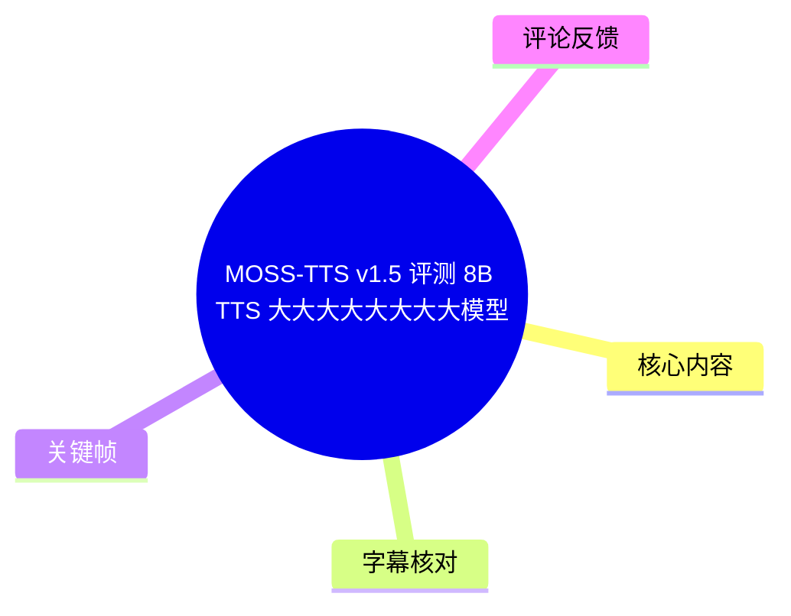
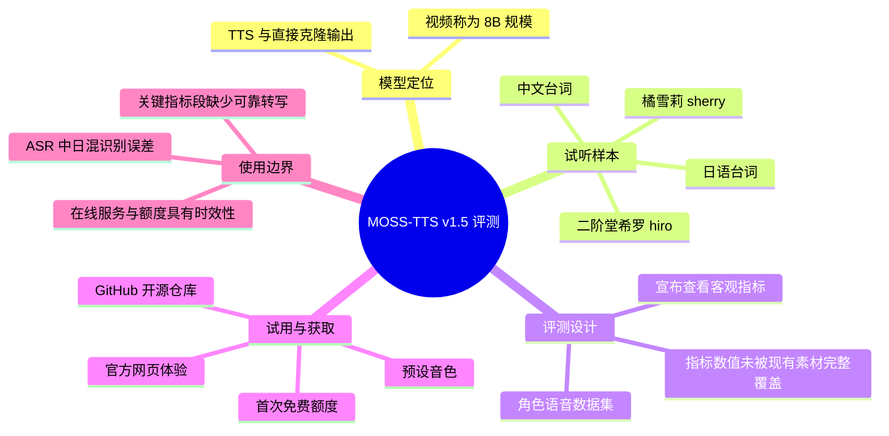
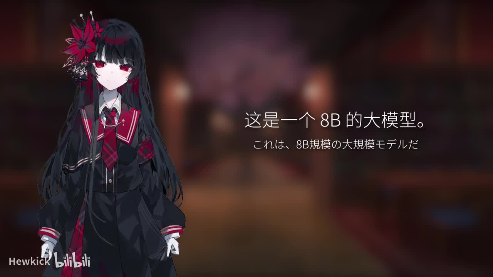
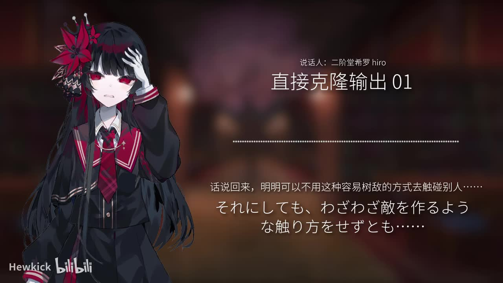
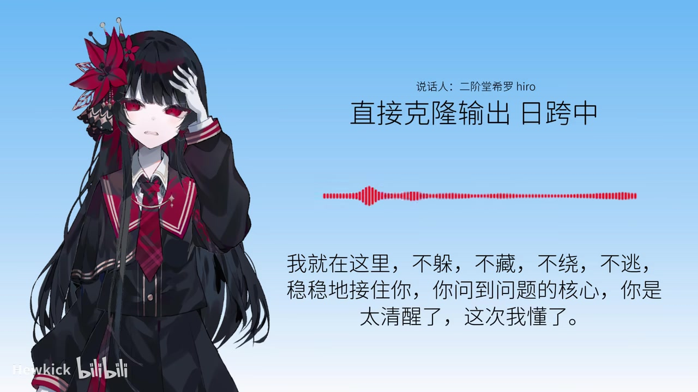
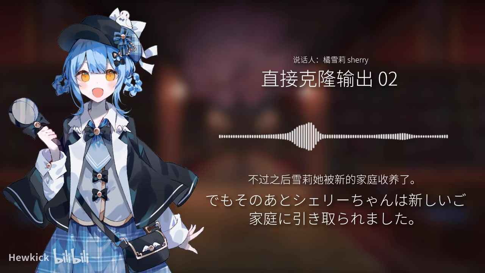

# MOSS-TTS v1.5 评测: 8B TTS 大大大大大大大大模型

> 来源：[Bilibili 视频](https://www.bilibili.com/video/BV1ydNU6oE32)  
> UP 主：Hewkick｜时长：5 分 13 秒｜合集：AIcode  
> 视频简介给出的资源：MOSS 官方体验平台 `https://mossland.mosi.cn/`；开源地址 `https://github.com/OpenMOSS/MOSS-TTS`

## 小结

视频对 **MOSS-TTS v1.5** 进行试听式评测，并在开头明确将其称为一个 **8B 规模的大模型**。评测的主线是：先展示多段角色语音的直接克隆输出，再以《魔法少女的魔女审判》角色声音构建的数据集进入客观指标环节，最后给出官方在线体验入口与开源仓库。

试听部分覆盖了至少两种角色音色：画面标注为“二阶堂希罗 hiro”与“橘雪莉 sherry”。示例包含日语台词和中文台词，且画面直接以“直接克隆输出”标识结果；这表明视频重点考察的是基于角色参考声音的语音克隆/音色复现效果，而不是只展示默认朗读音色。

视频在 [02:41](https://www.bilibili.com/video/BV1ydNU6oE32?t=161) 宣布查看“客观指标”，并说明测试集由《魔法少女的魔女审判》角色语音构建。不过，本次 ASR 在 02:52—04:03 存在约 71 秒的大段无有效转写，提供的关键帧也没有给出该段图表或数值，因此**不能从现有素材可靠复原具体指标名称、分数、对照模型与排名**。

对于想快速试用的人，视频称官方提供了可在浏览器直接体验模型的网站，站内有若干预设音色，首次使用可获得免费额度；链接位于简介与评论区。该说法属于视频发布时的信息，额度、可用音色、服务状态与网页功能均可能随时间变化，应以官网实际页面为准。

本视频适合关注开源 TTS、角色音色克隆、日语/中文角色台词表现的人作为试听入口；若要据此判断模型的客观质量或部署成本，还需补查官方仓库、模型卡、许可证、硬件需求及可复现实验结果。

## 思维导图

## 目录

- [模型定位与评测入口](#模型定位与评测入口)
- [角色音色直接克隆试听](#角色音色直接克隆试听)
- [客观指标与测试集说明](#客观指标与测试集说明)
- [复听样本与在线试用](#复听样本与在线试用)
- [实践步骤、参数与适用边界](#实践步骤参数与适用边界)
- [结论与时效性](#结论与时效性)
- [字幕比对](#字幕比对)
- [评论分析](#评论分析)
- [处理记录](#处理记录)

## [模型定位与评测入口](https://www.bilibili.com/video/BV1ydNU6oE32?t=2)

视频从 [00:02.660](https://www.bilibili.com/video/BV1ydNU6oE32?t=2) 开始介绍 MOSS-TTS v1.5，并表示这是一个“8B 的大模型”，随后让观众先听实际语音效果。

从画面文字可确认两项定位：

1. 模型名称为 **MOSS-TTS v1.5**。
2. 视频将模型规模描述为 **8B**。

> 图：画面以中日双语写出“这是一个 8B 的大模型”。它是确认视频中“8B”表述的直接视觉依据，也避免将 ASR 错识别出的日语文本当作模型名称或参数来源。

需要区分的是：视频使用“8B 大模型”描述模型规模，但现有素材没有提供参数精度、权重文件大小、上下文长度、推理显存、支持采样率、许可证或训练数据细节。上述内容不能由“8B”这一单一表述推导出来。

## [角色音色直接克隆试听](https://www.bilibili.com/video/BV1ydNU6oE32?t=22)

### [样本 01：二阶堂希罗 hiro 的日语输出](https://www.bilibili.com/video/BV1ydNU6oE32?t=22)

从 [00:22.410](https://www.bilibili.com/video/BV1ydNU6oE32?t=22) 起，视频展示“说话人：二阶堂希罗 hiro”的样本，并标注为“直接克隆输出 01”。画面中的日语原文与中文字幕共同呈现，能够确认这是角色台词的合成展示，而非旁白解释。

可辨识的首段台词对应中文为：

- “请不要随便碰我，别以为我会忘记。”
- “我讨厌你。”

随后 [00:30.840](https://www.bilibili.com/video/BV1ydNU6oE32?t=30) 至 [00:42.250](https://www.bilibili.com/video/BV1ydNU6oE32?t=37) 继续播放同一音色的日语句子，包括“明明可以不用这种容易树敌的方式去触碰别人……”以及“梳理时间线，指出艾玛证词中的矛盾”等内容。

> 图：画面明确标出“说话人：二阶堂希罗 hiro”“直接克隆输出 01”，下方同时呈现中文翻译与日语文本。这一帧为“直接克隆”性质、说话人标签和双语样本提供了视觉证据。

### [样本 01：中文台词与跨语言输出](https://www.bilibili.com/video/BV1ydNU6oE32?t=44)

[00:44.010](https://www.bilibili.com/video/BV1ydNU6oE32?t=44) 至 [01:02.020](https://www.bilibili.com/video/BV1ydNU6oE32?t=62) 的样本中，画面文本可校正 ASR 的混乱转写。可确认的中文台词为：

> 我就在这里，不躲，不藏，不绕，不逃，稳稳地接住你。你问到问题的核心，你是太清醒了，这次我懂了。

这段样本的重要性在于，它以“二阶堂希罗 hiro”的角色音色展示中文语句。视频没有解释参考音频语言、训练语言或跨语言机制，因此只能记录为：**视频展示了该角色标签下的中文直接克隆输出**，不能进一步断言模型已经在严格实验条件下证明跨语言音色保持能力。

> 图：画面标有“直接克隆输出 日跨中”，并完整显示中文台词及波形。它是本片展示“日语角色音色—中文文本”组合的关键画面依据；“日跨中”是画面标签，不应扩展解读为官方完整技术指标。

### [样本 02：橘雪莉 sherry 的日语输出](https://www.bilibili.com/video/BV1ydNU6oE32?t=64)

从 [01:04.170](https://www.bilibili.com/video/BV1ydNU6oE32?t=64) 起，视频切换到“说话人：橘雪莉 sherry”，标注“直接克隆输出 02”。ASR 对此处日语识别较稳定，可对应为角色自我介绍及若干后续台词，例如：

- “我叫橘雪莉。有事件的地方就有我，请交给这位名侦探吧。”
- “也就是说，所有人单独行动会比较好吗？”
- “不过之后雪莉被新的家庭收养了。”
- “这个时间点很严峻，似乎不能采用利用自然的方法。”

> 图：画面写明“说话人：橘雪莉 sherry”“直接克隆输出 02”，并以中文字幕和日语文本展示“不过之后雪莉她被新的家庭收养了”。它说明视频至少对两个角色音色进行了分别试听，而非只演示单一声音。

### [更多角色台词样本](https://www.bilibili.com/video/BV1ydNU6oE32?t=99)

[01:39.010](https://www.bilibili.com/video/BV1ydNU6oE32?t=99) 至 [02:40.090](https://www.bilibili.com/video/BV1ydNU6oE32?t=160) 继续播放多段台词，包括“大家都有成为魔女的因子”“请移至投票”“如果这是总意，我愿意配合”“抵抗是自由的，但命可能就没了”等。

其中 [02:27.080](https://www.bilibili.com/video/BV1ydNU6oE32?t=147) 的一句中文内容在 ASR 中受到中日混识别影响，现有转写无法可靠复原全部原文。该段可确认它仍是试听材料的一部分，但不宜以错误 ASR 文本作为引用或语言质量判断依据。

## [客观指标与测试集说明](https://www.bilibili.com/video/BV1ydNU6oE32?t=161)

[02:41.310](https://www.bilibili.com/video/BV1ydNU6oE32?t=161) 的 ASR 可较明确地转写为：接下来查看客观指标，本次使用基于《魔法少女的魔女审判》角色声音构建的数据集。

这段话提供了评测方法中的两项明确事实：

| 项目 | 视频可确认内容 |
| --- | --- |
| 评测方向 | 将查看“客观指标” |
| 数据来源 | 使用基于《魔法少女的魔女审判》角色声音构建的数据集 |
| 样本域 | 角色语音/角色台词 |
| 具体指标 | 现有素材未可靠提供 |
| 分数与比较对象 | 现有素材未可靠提供 |
| 数据集规模、划分、授权 | 现有素材未可靠提供 |

### 不能补全的指标信息

ASR 的有效语音段在 [02:52.130](https://www.bilibili.com/video/BV1ydNU6oE32?t=172) 后中断，直到 [04:03.040](https://www.bilibili.com/video/BV1ydNU6oE32?t=243) 才恢复，间隔约 **70.91 秒**。本次提供的关键帧未包含该区间的表格、图形或参数页，因此无法严谨地确认：

- 使用了哪些客观指标，例如音色相似度、词错率、说话人相似度或主观评分；
- MOSS-TTS v1.5 的具体得分；
- 是否与其他 TTS 模型进行横向比较；
- 参考音频时长、文本长度、采样配置和随机种子；
- 统计口径、测试集划分与误差范围。

因此，本视频可以作为“作者进行了客观指标环节”的记录，但不能作为某个具体性能数字的可引用来源。

## [复听样本与在线试用](https://www.bilibili.com/video/BV1ydNU6oE32?t=243)

### [复听片段](https://www.bilibili.com/video/BV1ydNU6oE32?t=243)

[04:03.040](https://www.bilibili.com/video/BV1ydNU6oE32?t=243) 至 [04:10.030](https://www.bilibili.com/video/BV1ydNU6oE32?t=250) 重放了开头的日语句子；[04:18.190](https://www.bilibili.com/video/BV1ydNU6oE32?t=258) 至 [04:29.710](https://www.bilibili.com/video/BV1ydNU6oE32?t=269) 重放了“我就在这里，不躲，不藏，不绕，不逃……”的中文句子。

此处属于试听复现，适合观众回听语音效果。由于没有可用的原声参考音频、音频频谱或可量化对照，不能仅据视频压缩后的播放结果对细微音质、底噪、韵律自然度或音色相似度作出严格结论。

### [官方网页与开源地址](https://www.bilibili.com/video/BV1ydNU6oE32?t=271)

[04:31.380](https://www.bilibili.com/video/BV1ydNU6oE32?t=271) 起，视频称官方提供可直接在线试用模型的网站；用户可在浏览器中体验模型，站内准备了若干常用/预设音色，首次使用可以获得免费额度。UP 主称链接已放在视频简介和评论区。

视频简介中可直接取得的链接为：

- 官方平台：<https://mossland.mosi.cn/>
- 开源仓库：<https://github.com/OpenMOSS/MOSS-TTS>

建议实际试用时按以下顺序核验，而非仅依赖视频口述：

1. 打开官方平台，确认页面当前是否可访问、是否要求登录及免费额度规则。
2. 查看可选音色与输入语言选项，确认是否仍提供视频中展示的类似角色音色能力。
3. 以短文本先测试发音、停顿、数字及中日混合文本。
4. 如需本地运行或二次开发，转至 GitHub 仓库查看 README、模型下载方式、许可证、推理依赖和硬件要求。
5. 若使用真人或角色声音，确认自己拥有参考音频及声音使用的授权，并避免将合成声音用于冒充、欺诈或误导性传播。

## [实践步骤、参数与适用边界](https://www.bilibili.com/video/BV1ydNU6oE32?t=271)

### 视频可复用的体验流程

基于视频明确展示的在线体验信息，可整理出最低限度的试用流程：

1. 在 [04:31](https://www.bilibili.com/video/BV1ydNU6oE32?t=271) 所述的官方平台进入浏览器端体验。
2. 从站内提供的预设音色中选择一个声音。
3. 输入要合成的文本。
4. 生成后回听，并使用短句与长句分别观察可懂度、断句和情绪表现。
5. 若关注角色克隆效果，应使用已获授权的参考音频，并以同一文本、同一参考条件进行多模型对比。
6. 若要复核视频结论，需自行记录参考音频、文本、模型版本、采样设置、生成日期及音频文件，以避免在线模型更新导致结果不可复现。

### 视频明确给出的参数

| 参数/信息 | 值或说明 | 证据范围 |
| --- | --- | --- |
| 模型名称 | MOSS-TTS v1.5 | 标题、开场画面 |
| 模型规模 | 8B | 开场画面与视频口述 |
| 演示方式 | 直接克隆输出 | 样本画面标签 |
| 说话人示例 | 二阶堂希罗 hiro、橘雪莉 sherry | 样本画面标签 |
| 演示语种 | 日语、中文 | 画面文字及 ASR 分段 |
| 测试集来源 | 基于《魔法少女的魔女审判》角色声音构建 | 02:41 的 ASR |
| 官方在线入口 | `mossland.mosi.cn` | 视频简介 |
| 开源入口 | `github.com/OpenMOSS/MOSS-TTS` | 视频简介 |

### 未公开或无法从素材确认的参数

视频没有在可用材料中给出下列决定复现结果的重要配置，因此不能擅自补充：

- 参考音频长度、格式、语言与预处理方式；
- 生成速度、采样率、码率与输出格式；
- 推理显卡、显存占用、量化版本与实时系数；
- 温度、随机种子、top-p、语速、情绪控制等生成参数；
- 角色音色是否来自预训练、微调、提示音频或其他流程；
- 8B 参数量对应的模型结构、精度和实际存储体积。

## [结论与时效性](https://www.bilibili.com/video/BV1ydNU6oE32?t=295)

视频的核心贡献是提供一组带角色标签的直接克隆试听，并告知用户可通过官方网页与 GitHub 仓库进一步接触 MOSS-TTS。对于试听判断，最值得关注的是同一角色标签下的日语和中文文本展示，以及至少两位角色音色的切换。

但视频呈现的内容仍有明显边界：

1. **客观指标不可复核**：虽明确进入指标环节，但现有 ASR 在该段覆盖失败，且关键帧没有保留指标页；不能引用任何具体成绩。
2. **试听不等于完整评测**：视频输出可能受到平台转码、播放设备、文本难度和参考音频质量影响，不能代表所有文本、所有音色或所有语言组合。
3. **克隆能力需结合授权审视**：角色或真人声音的使用都可能涉及作品、录音与人格相关权利；视频没有提供法律或许可证细则。
4. **在线服务具时效性**：官方平台、预设音色、免费额度与访问条件是视频发布时的描述，可能已经调整。
5. **开源不等于零门槛部署**：即使仓库可见，本地运行的依赖、权重获取、硬件要求与许可证仍需以仓库当前文档为准。

片尾 [04:55.380](https://www.bilibili.com/video/BV1ydNU6oE32?t=295) 表示该系列还将继续评测更多开源 TTS 模型。对后续横评而言，建议统一参考音频、测试文本、语言、输出格式和评价指标，再比较音色相似性、自然度、文本可懂度、推理速度和资源消耗。

## 字幕比对

| 字幕来源 | 完整性 | 专有名词 | 时间轴 | 主要问题 |
| --- | --- | --- | --- | --- |
| Bilibili 站内字幕 | 不可用：素材明确说明未提供可用站内字幕 | 无法核验 | 无法使用 | 无站内 SRT/字幕轨道可供比较 |
| 本次 ASR 字幕 | 部分覆盖：21 段、有效语音约 195.56 秒、覆盖率约 62.57% | 较差：中文语音被大量识别为日语；模型名被误写为“モースTTS-B1.5”等 | 可用：每段含真实起止时间 | 语言自动识别为日语，置信度 0.9888；02:52—04:03 有约 70.91 秒大缺口；中日混合内容错字较多 |

### 最终字幕选择与校正原则

本次没有可用站内字幕，因此以 **本次 ASR 的真实时间戳** 作为章节定位依据；正文文本则采用“ASR 时间段 + 关键帧画面文字 + 视频元数据”交叉校正。

重要校正如下：

| 项目 | ASR 表现 | 本文采用的处理 |
| --- | --- | --- |
| 模型名 | 被识别为近似日语的“モースTTS-B1.5” | 以标题、简介和开场画面统一校正为 **MOSS-TTS v1.5** |
| 模型规模 | ASR 中出现近似“8B”表述 | 以开场关键帧文字确认“8B” |
| hiro 样本 | 日语段转写大体可读 | 用画面中的“二阶堂希罗 hiro”“直接克隆输出 01”校正说话人和样本性质 |
| 中文复听句 | 混入日语字符与错误词，如“不躍、不藏、不繞” | 以关键帧校正为“我就在这里，不躲，不藏，不绕，不逃，稳稳地接住你……” |
| sherry 样本 | 日语转写较完整 | 用画面“橘雪莉 sherry”“直接克隆输出 02”确认标签 |
| 客观指标段 | 02:52—04:03 无转写 | 保留“视频进入客观指标环节”这一事实，不编造指标、分数或结论 |

ASR 诊断中**未标记 `noAudioStream=true`**；相反，素材包含音频文件，且 ASR 获得了带时间戳的语音段。因此，本片的问题不是“源视频没有音轨”，而是语音自动语言识别偏向日语、跨语言内容误识别，以及中段转写缺失。

## 评论分析

仅获取到 2 条热评，少于“热评前三条”的上限；以下仅分析可获取内容，不补造第三条。

| 评论者 | 获赞 | 评论概括 | 可用信息与可信度 |
| --- | ---: | --- | --- |
| Alvlarys | 2 | “这个好”，附带表情 | 表达对视频或模型效果的正向主观感受，没有提供音质、部署、指标或使用方法等可验证细节。 |
| 中三 | 3 | “哇还有550w” | 可能是在惊讶某项“550w”信息，但评论未说明其具体指代，无法判断是模型参数、显存、观看量或其他内容；不能将其作为技术事实。 |

整体而言，已获取评论以简短情绪反馈为主，未补充可复核的模型性能、复现配置或争议信息。

## 处理记录

- Worker ID：`worker-mrj0wjed-b0c290ad`
- 任务模型：`gpt-5.6-terra`
- ASR 模型与运行信息：`medium`；CUDA；`float16`；自动语言识别结果为日语（`ja`，概率 `0.98876953125`）。
- 使用的素材工具产物：视频元数据、音频 ASR SRT、ASR 分段诊断、关键帧目录、视频简介链接、评论 JSON。
- 字幕选择：未提供可用 Bilibili 站内字幕；使用本次 ASR 的 SRT 起止时间制作时间轴，并以关键帧与元数据校正模型名、角色名及中文台词。
- 时间轴依据：所有正文时间链接均取自 ASR SRT 的实际分段起点，或对应连续分段的真实起点；未按文字顺序臆测位置。
- 关键帧选择依据：
  - `frames/frame-001.jpg`：确认“8B 大模型”定位；
  - `frames/frame-002.jpg`：确认 hiro 的“直接克隆输出 01”及双语日语样本；
  - `frames/frame-003.jpg`：确认 hiro 的“日跨中”中文输出及完整文本；
  - `frames/frame-004.jpg`：确认 sherry 的“直接克隆输出 02”及角色切换。
- ASR 缺口处理：检测到 [02:52.130](https://www.bilibili.com/video/BV1ydNU6oE32?t=172)—[04:03.040](https://www.bilibili.com/video/BV1ydNU6oE32?t=243) 约 70.91 秒缺口；未将未见的客观指标数值、图表和对比对象写入正文。
- 缓存清理：未提供缓存清理执行日志，无法确认是否已执行清理；不将其表述为已完成。
- 未解决问题：客观指标的具体名称与数值、参考音频配置、模型推理参数、部署硬件要求、许可证细则及在线平台当前可用性，均需以官方仓库和平台官网的最新信息进一步核验。
